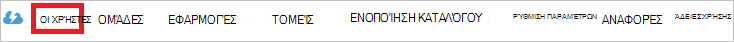

<properties
    pageTitle="Πρόγραμμα εκμάθησης: Ενοποίηση καταλόγου Azure Active Directory με του | Microsoft Azure"
    description="Μάθετε πώς μπορείτε να ρυθμίσετε τις παραμέτρους καθολικής σύνδεσης μεταξύ Azure Active Directory και του."
    services="active-directory"
    documentationCenter=""
    authors="jeevansd"
    manager="femila"
    editor=""/>

<tags
    ms.service="active-directory"
    ms.workload="identity"
    ms.tgt_pltfrm="na"
    ms.devlang="na"
    ms.topic="article"
    ms.date="09/28/2016"
    ms.author="jeedes"/>

# Πρόγραμμα εκμάθησης: Ενοποίηση καταλόγου Azure Active Directory με του

Στόχος αυτού του προγράμματος εκμάθησης είναι ώστε να σας δείξουν πώς μπορείτε να ενοποιήσετε του με το Azure Active Directory (Azure AD).

Ενοποίηση του με το Azure AD σάς παρέχει τα ακόλουθα πλεονεκτήματα:

- Μπορείτε να ελέγξετε σε Azure AD ποιος έχει πρόσβαση σε του
- Μπορείτε να ενεργοποιήσετε τους χρήστες σας να αυτόματα να συνδεθεί στην του (καθολικής σύνδεσης) με τους λογαριασμούς Azure AD
- Μπορείτε να διαχειριστείτε τους λογαριασμούς σας σε μια κεντρική θέση - κλασική πύλη του Azure

Εάν θέλετε να μάθετε περισσότερες λεπτομέρειες σχετικά με ΑΔΑ εφαρμογή ενοποίηση με το Azure AD, ανατρέξτε στο θέμα [Τι είναι η εφαρμογή access και καθολικής σύνδεσης με το Azure Active Directory](active-directory-appssoaccess-whatis.md).

## Προαπαιτούμενα στοιχεία

Για να ρυθμίσετε τις παραμέτρους ενοποίησης Azure AD με του, χρειάζεστε τα ακόλουθα στοιχεία:

- Μια συνδρομή του Azure AD
- Μια του καθολικής σύνδεσης με δυνατότητα συνδρομής

> [AZURE.NOTE] Για να ελέγξετε τα βήματα που περιγράφονται σε αυτό το πρόγραμμα εκμάθησης, δεν συνιστάται να χρησιμοποιείτε ένα περιβάλλον παραγωγής.

Για να ελέγξετε τα βήματα που περιγράφονται σε αυτό το πρόγραμμα εκμάθησης, θα πρέπει να ακολουθήσετε αυτές τις συστάσεις:

- Δεν πρέπει να χρησιμοποιείτε το περιβάλλον παραγωγής, εκτός εάν αυτό είναι απαραίτητο.
- Εάν δεν έχετε ένα περιβάλλον δοκιμαστική Azure AD, μπορείτε να αποκτήσετε μια μηνιαία δοκιμαστική [εδώ](https://azure.microsoft.com/pricing/free-trial/).

## Σενάριο περιγραφή
Είναι ο στόχος αυτού του προγράμματος εκμάθησης για να ελέγξετε Azure AD καθολικής σύνδεσης σε περιβάλλον δοκιμής.

Το σενάριο που περιγράφονται σε αυτό το πρόγραμμα εκμάθησης αποτελείται από δύο κύριο μπλοκ δόμησης:

1. Προσθήκη του από τη συλλογή
2. Ρύθμιση παραμέτρων και έλεγχος Azure AD μονό καθολικής σύνδεσης

## Προσθήκη του από τη συλλογή
Για να ρυθμίσετε την ενσωμάτωση των του στην Azure AD, πρέπει να προσθέσετε του από τη συλλογή στη λίστα των διαχειριζόμενων ΑΔΑ εφαρμογών.

**Για να προσθέσετε του από τη συλλογή, ακολουθήστε τα παρακάτω βήματα:**

1. Στην **πύλη του Azure κλασική**, στο αριστερό παράθυρο περιήγησης, κάντε κλικ στην επιλογή **Υπηρεσία καταλόγου Active Directory**. 

    ![Υπηρεσία καταλόγου Active Directory][1]

2. Από τη λίστα **καταλόγου** , επιλέξτε τον κατάλογο για την οποία θέλετε να ενεργοποιήσετε την ενοποίηση καταλόγου.

3. Για να ανοίξετε τις εφαρμογές προβολή, στην προβολή του καταλόγου, κάντε κλικ στην επιλογή **εφαρμογές** στο μενού επάνω.
    
    ![Εφαρμογές][2]

4. Κάντε κλικ στην επιλογή **Προσθήκη** στο κάτω μέρος της σελίδας.
    
    ![Εφαρμογές][3]

5. Στο παράθυρο διαλόγου **Τι θέλετε να κάνετε** , κάντε κλικ στην επιλογή **Προσθήκη εφαρμογής από τη συλλογή**.

    ![Εφαρμογές][4]

6. Στο πλαίσιο αναζήτησης, πληκτρολογήστε **του**.

    

7. Στο παράθυρο αποτελεσμάτων, επιλέξτε **του**και, στη συνέχεια, κάντε κλικ στην επιλογή **Ολοκλήρωση** , για να προσθέσετε την εφαρμογή.

    

##  Ρύθμιση παραμέτρων και έλεγχος Azure AD μονό καθολικής σύνδεσης
Ο στόχος αυτής της ενότητας είναι να σας δείξουν πώς μπορείτε να ρυθμίσετε τις παραμέτρους και να ελέγξετε Azure AD καθολικής σύνδεσης με του που βασίζεται σε ένα χρήστη δοκιμής που ονομάζεται "Britta Simon".

Για καθολικής σύνδεσης για να εργαστείτε, Azure AD πρέπει να γνωρίζετε ποιος είναι ο χρήστης αντίστοιχο στο του σε έναν χρήστη στο Azure AD. Με άλλα λόγια, μια σχέση σύνδεση μεταξύ ενός χρήστη Azure AD και το σχετικό χρήστη στο του πρέπει να καθοριστούν.

Αυτή η σχέση σύνδεση είναι εγκατεστημένος κατά την αντιστοίχιση της τιμής του **ονόματος χρήστη** στο Azure AD ως τιμή του το **όνομα χρήστη** στο του.

Για να ρυθμίσετε τις παραμέτρους και να ελέγξετε Azure AD καθολικής σύνδεσης με του, πρέπει να ολοκληρώσετε τα παρακάτω μπλοκ δόμησης:

1. **[Ρύθμιση παραμέτρων Azure AD καθολικής σύνδεσης](#configuring-azure-ad-single-single-sign-on)** - για να ενεργοποιήσετε τους χρήστες σας για να χρησιμοποιήσετε αυτήν τη δυνατότητα.
2. **[Δημιουργία μιας Azure AD δοκιμή χρήστη](#creating-an-azure-ad-test-user)** - για να ελέγξετε Azure AD καθολικής σύνδεσης με Britta Simon.
3. **[Τη δημιουργία ενός του δοκιμή χρήστη](#creating-a-deputy-test-user)** - έχουν αντίστοιχο του Britta Simon στο του που συνδέεται με το Azure AD αναπαράσταση εκείνη.
4. **[Εκχώρηση του Azure AD δοκιμή χρήστη](#assigning-the-azure-ad-test-user)** - για να ενεργοποιήσετε την Britta Simon για να χρησιμοποιήσετε Azure AD καθολικής σύνδεσης.
5. **[Δοκιμές καθολικής σύνδεσης](#testing-single-sign-on)** - για να επιβεβαιώσετε αν λειτουργεί η ρύθμιση παραμέτρων.

### Ρύθμιση παραμέτρων Azure AD καθολικής σύνδεσης

Σε αυτήν την ενότητα, ενεργοποιείτε Azure AD καθολικής σύνδεσης στην πύλη του κλασική και ρύθμιση παραμέτρων Καθολικής σύνδεσης στην εφαρμογή του.

**Για να ρυθμίσετε τις παραμέτρους Azure AD καθολικής σύνδεσης με του, εκτελέστε τα ακόλουθα βήματα:**

1. Στην κλασική πύλη, στη σελίδα ενοποίησης εφαρμογής **του** , κάντε κλικ στην επιλογή **Ρύθμιση παραμέτρων Καθολικής σύνδεσης** για να ανοίξετε το παράθυρο διαλόγου **Ρύθμιση παραμέτρων Καθολικής σύνδεσης** .
     
    ![Ρύθμιση παραμέτρων Καθολικής σύνδεσης][6] 

2. Στη σελίδα **Πώς θέλετε οι χρήστες να πραγματοποιούν είσοδο του** , επιλέξτε **Azure AD καθολικής σύνδεσης**και, στη συνέχεια, κάντε κλικ στο κουμπί **Επόμενο**.
    
    

3. Στη σελίδα **Ρύθμιση παραμέτρων των ρυθμίσεων της εφαρμογής** παραθύρου διαλόγου, εάν θέλετε να ρυθμίσετε τις παραμέτρους της εφαρμογής στο **IDP που ξεκινούν από λειτουργία**, ακολουθήστε τα παρακάτω βήματα και κάντε κλικ στην επιλογή **Επόμενο**:

    

    μια. Στο πλαίσιο κειμένου " **αναγνωριστικό** ", πληκτρολογήστε μια διεύθυνση URL με το ακόλουθο μοτίβο: `https://<your-subdomain>.<region>.deputy.com`.

    β. Στο πλαίσιο κειμένου **Διεύθυνση URL απάντηση** , πληκτρολογήστε μια διεύθυνση URL με το ακόλουθο μοτίβο: `https://<your-subdomain>.<region>.deputy.com/exec/devapp/samlacs`.

    c. Κάντε κλικ στο κουμπί **Επόμενο**.

4. Εάν θέλετε να ρυθμίσετε τις παραμέτρους της εφαρμογής σε **SP ξεκίνησε λειτουργία** στη σελίδα παράθυρο διαλόγου **Ρύθμιση παραμέτρων των ρυθμίσεων της εφαρμογής** , στη συνέχεια, κάντε κλικ στην εντολή το **"Εμφάνιση ρυθμίσεων για προχωρημένους (προαιρετικά)"** και, στη συνέχεια, πληκτρολογήστε το **Σύμβολο στη διεύθυνση URL** και κάντε κλικ στο κουμπί **Επόμενο**.

    

    μια. Στο πλαίσιο κειμένου **Εισόδου στη διεύθυνση URL** , πληκτρολογήστε μια διεύθυνση URL με το ακόλουθο μοτίβο: `https://<your-subdomain>.<region>.deputy.com`.

    β. Κάντε κλικ στο κουμπί **Επόμενο**.

    > [AZURE.NOTE] Επίθημα περιοχή του είναι opitional ή πρέπει να χρησιμοποιεί ένα από τα εξής: au | Na | ΕΕ | ως | λα | af | μια | εκπαιδευτικά au | εκπαιδευτικά na | εκπαιδευτικά-ΕΕ | εκπαιδευτικά-ως | εκπαιδευτικά λα | εκπαιδευτικά af | εκπαιδευτικά μια

5. Στη σελίδα **Ρύθμιση παραμέτρων Καθολικής σύνδεσης στο του** , ακολουθήστε τα παρακάτω βήματα και κάντε κλικ στην επιλογή **Επόμενο**:

    

    μια. Κάντε κλικ στην επιλογή **λήψη πιστοποιητικό**και, στη συνέχεια, αποθηκεύστε το αρχείο στον υπολογιστή σας.

    
6. Μεταβείτε στην ακόλουθη διεύθυνση URL: https://(your-subdomain).deputy.com/exec/config/system_config. Μεταβείτε στις **Ρυθμίσεις ασφαλείας** και κάντε κλικ στην επιλογή **Επεξεργασία**.

    

7. Στην κλασική πύλη Azure, σε τη ρύθμιση παραμέτρων Καθολικής σύνδεσης στη σελίδα του, αντιγράψτε τη διεύθυνση URL SSO SAML. 

8. Σε αυτήν τη σελίδα **Ρυθμίσεις ασφαλείας** , εκτελέστε την παρακάτω βήματα.

    

    μια. Ενεργοποίηση **κοινωνικών Login**.

    β. Ανοίξτε το πιστοποιητικό κωδικοποίηση Base64 στο Σημειωματάριο, αντιγράψτε το περιεχόμενο της στο Πρόχειρο και, στη συνέχεια επικολλήστε το στο πλαίσιο κειμένου **OpenSSL πιστοποιητικού** .

    c. Στο πλαίσιο κειμένου διεύθυνση URL SSO SAM, πληκτρολογήστε`https://<your subdomain>.deputy.com/exec/devapp/samlacs?dpLoginTo=<saml sso url>`
    
    d. Στο πλαίσιο κειμένου διεύθυνση URL SSO SAM, αντικαταστήστε `<your subdomain>` με τον υποτομέα.

    ε. Στο πλαίσιο κειμένου διεύθυνση URL SSO SAM, αντικαταστήστε `<saml sso url>` με τη διεύθυνση URL SSO SAML που αντιγράψατε από το Azure κλασική πύλη.

    f. Κάντε κλικ στην επιλογή **Αποθήκευση ρυθμίσεων**.

9. Στην κλασική πύλη, επιλέξτε την καθολική σύνδεση ρύθμιση των παραμέτρων επιβεβαίωσης και, στη συνέχεια, κάντε κλικ στο κουμπί **Επόμενο**.
    
    ![Azure AD καθολικής σύνδεσης][10]

10. Στη σελίδα **επιβεβαίωσης καθολική σύνδεση** , κάντε κλικ στην επιλογή **ολοκληρώθηκε**.  
    
    ![Azure AD καθολικής σύνδεσης][11]

### Δημιουργία ενός χρήστη δοκιμής Azure AD
Στόχος αυτής της ενότητας είναι να δημιουργήσετε έναν χρήστη δοκιμής στην κλασική πύλη που ονομάζεται Britta Simon.

![Δημιουργία Azure AD χρήστη][20]

**Για να δημιουργήσετε ένα χρήστη δοκιμής Azure AD, ακολουθήστε τα παρακάτω βήματα:**

1. Στην **πύλη του Azure κλασική**, στο αριστερό παράθυρο περιήγησης, κάντε κλικ στην επιλογή **Υπηρεσία καταλόγου Active Directory**.

    

2. Από τη λίστα **καταλόγου** , επιλέξτε τον κατάλογο για την οποία θέλετε να ενεργοποιήσετε την ενοποίηση καταλόγου.

3. Για να εμφανίσετε τη λίστα των χρηστών, στο μενού στο επάνω μέρος, κάντε κλικ στην επιλογή **χρήστες**.
    
    

4. Για να ανοίξετε το παράθυρο διαλόγου **Προσθήκη χρήστη** , στη γραμμή εργαλείων στο κάτω μέρος, κάντε κλικ στην επιλογή **Προσθήκη χρήστη**.

    

5. Στη σελίδα του παραθύρου διαλόγου **πείτε μας σχετικά με αυτόν το χρήστη** , εκτελέστε τα ακόλουθα βήματα:

    

    μια. Ως τύπο του χρήστη, επιλέξτε νέο χρήστη στην εταιρεία σας.

    β. Στο πλαίσιο όνομα χρήστη **πλαίσιο κειμένου**, πληκτρολογήστε **BrittaSimon**.

    c. Κάντε κλικ στο κουμπί **Επόμενο**.

6.  Στη σελίδα του παραθύρου διαλόγου **Προφίλ χρήστη** , εκτελέστε τα ακόλουθα βήματα:
    
    

    μια. Στο πλαίσιο κειμένου **όνομα** , πληκτρολογήστε **Britta**.  

    β. Στο πλαίσιο **Όνομα επώνυμο** κειμένου, τύπος, **Simon**.

    c. Στο πλαίσιο κειμένου **Εμφανιζόμενο όνομα** , πληκτρολογήστε **Britta Simon**.

    d. Στη λίστα **εργασιών** , επιλέξτε το **χρήστη**.

    ε. Κάντε κλικ στο κουμπί **Επόμενο**.

7. Στη σελίδα του παραθύρου διαλόγου **λήψη προσωρινό κωδικό πρόσβασης** , κάντε κλικ στην επιλογή **Δημιουργία**.
    
    

8. Στη σελίδα του παραθύρου διαλόγου **λήψη προσωρινό κωδικό πρόσβασης** , εκτελέστε τα ακόλουθα βήματα:
    
    

    μια. Σημειώστε την τιμή της το **Νέο κωδικό πρόσβασης**.

    β. Κάντε κλικ στην επιλογή **Ολοκλήρωση**.   

### Δημιουργία του χρήστη δοκιμής

Για να επιτρέψετε στους χρήστες Azure AD για να συνδεθείτε στο του, πρέπει να παρασχεθεί στο του. Στην περίπτωση του, η προμήθεια είναι μια μη αυτόματη εργασία.

####Για να προμηθεύσουν ένα λογαριασμό χρήστη, εκτελέστε τα ακόλουθα βήματα:

1.  Συνδεθείτε στην τοποθεσία της εταιρείας σας του ως διαχειριστής.

2.  Στο παράθυρο επάνω γραμμή περιήγησης, κάντε κλικ στην επιλογή **άτομα**.

    ![Άτομα] (./media/active-directory-saas-deputy-tutorial/tutorial_deputy_001.png "Άτομα")

3.  Κάντε κλικ στο κουμπί **Προσθήκη ατόμων** και κάντε κλικ στην επιλογή **Προσθήκη ένα μόνο άτομο**.

    ![Προσθήκη ατόμων] (./media/active-directory-saas-deputy-tutorial/tutorial_deputy_002.png "Προσθήκη ατόμων")

4.  Ακολουθήστε τα παρακάτω βήματα και κάντε κλικ στην επιλογή **Αποθήκευση και την πρόσκληση**.

    ![Νέο χρήστη] (./media/active-directory-saas-deputy-tutorial/tutorial_deputy_003.png "Νέο χρήστη")

    μια. Στο πλαίσιο κειμένου **όνομα** , πληκτρολογήστε **Britta** και **Simon**.  

    β. Στο πλαίσιο κειμένου **ηλεκτρονικού ταχυδρομείου** , πληκτρολογήστε τη διεύθυνση ηλεκτρονικού ταχυδρομείου του λογαριασμού Azure AD που θέλετε για την παροχή των.

    c. Στο πλαίσιο κειμένου **εργασία στις** , πληκτρολογήστε το όνομα bussniess.

    d. Κάντε κλικ στο κουμπί **Αποθήκευση & πρόσκληση** .

    >[AZURE.NOTE]Ο κάτοχος λογαριασμού AAD θα λάβετε ένα μήνυμα ηλεκτρονικού ταχυδρομείου και να ακολουθήσετε μια σύνδεση για να επιβεβαιώσετε το λογαριασμό, προκειμένου να καταστεί ενεργή. Μπορείτε να χρησιμοποιήσετε οποιοδήποτε άλλο του χρήστη λογαριασμού εργαλεία δημιουργίας ή APIs που παρέχεται από του σε λογαριασμούς χρηστών AAD διάταξη.

### Εκχώρηση Azure AD δοκιμής χρήστη

Στόχος αυτής της ενότητας είναι η ενεργοποίηση Britta Simon χρήση Azure καθολικής σύνδεσης, εκχώρηση της πρόσβασης σε του.
    
![Εκχώρηση χρήστη][200]

**Για να αντιστοιχίσετε Britta Simon του, ακολουθήστε τα παρακάτω βήματα:**

1. Στην κλασική πύλη, για να ανοίξετε τις εφαρμογές προβολή, στην προβολή του καταλόγου, κάντε κλικ στην επιλογή **εφαρμογές** στο μενού επάνω.
    
    ![Εκχώρηση χρήστη][201]

2. Στη λίστα εφαρμογών, επιλέξτε **του**.
    
    

3. Στο μενού στο επάνω μέρος, κάντε κλικ στην επιλογή **χρήστες**.
    
    ![Εκχώρηση χρήστη][203]

4. Στη λίστα χρηστών, επιλέξτε **Britta Simon**.

5. Στη γραμμή εργαλείων στο κάτω μέρος, κάντε κλικ στο κουμπί **Αντιστοίχιση**.
    
    ![Εκχώρηση χρήστη][205]

### Δοκιμές καθολικής σύνδεσης

Είναι ο στόχος αυτής της ενότητας για να ελέγξετε Azure AD καθολική σύνδεση ρύθμιση των παραμέτρων σας χρησιμοποιώντας τον πίνακα της Access.
 
Όταν κάνετε κλικ στο πλακίδιο του στον πίνακα της Access, που θα πρέπει να λάβετε αυτόματα πραγματοποιήσει-σε για την εφαρμογή του.

## Πρόσθετοι πόροι

* [Λίστα εκμάθησης σχετικά με τον τρόπο ενσωμάτωσης εφαρμογές ΑΔΑ καταλόγου Azure Active Directory](active-directory-saas-tutorial-list.md)
* [Τι είναι η εφαρμογή access και καθολικής σύνδεσης με το Azure Active Directory;](active-directory-appssoaccess-whatis.md)

<!--Image references-->

[1]: ./media/active-directory-saas-deputy-tutorial/tutorial_general_01.png
[2]: ./media/active-directory-saas-deputy-tutorial/tutorial_general_02.png
[3]: ./media/active-directory-saas-deputy-tutorial/tutorial_general_03.png
[4]: ./media/active-directory-saas-deputy-tutorial/tutorial_general_04.png

[6]: ./media/active-directory-saas-deputy-tutorial/tutorial_general_05.png
[10]: ./media/active-directory-saas-deputy-tutorial/tutorial_general_06.png
[11]: ./media/active-directory-saas-deputy-tutorial/tutorial_general_07.png
[20]: ./media/active-directory-saas-deputy-tutorial/tutorial_general_100.png

[200]: ./media/active-directory-saas-deputy-tutorial/tutorial_general_200.png
[201]: ./media/active-directory-saas-deputy-tutorial/tutorial_general_201.png
[203]: ./media/active-directory-saas-deputy-tutorial/tutorial_general_203.png
[204]: ./media/active-directory-saas-deputy-tutorial/tutorial_general_204.png
[205]: ./media/active-directory-saas-deputy-tutorial/tutorial_general_205.png
