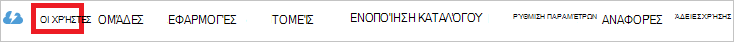

<properties
    pageTitle="Πρόγραμμα εκμάθησης: Ενοποίηση καταλόγου Azure Active Directory με Litmos | Microsoft Azure"
    description="Μάθετε πώς μπορείτε να ρυθμίσετε τις παραμέτρους καθολικής σύνδεσης μεταξύ Azure Active Directory και Litmos."
    services="active-directory"
    documentationCenter=""
    authors="jeevansd"
    manager="femila"
    editor=""/>

<tags
    ms.service="active-directory"
    ms.workload="identity"
    ms.tgt_pltfrm="na"
    ms.devlang="na"
    ms.topic="article"
    ms.date="09/29/2016"
    ms.author="jeedes"/>

# Πρόγραμμα εκμάθησης: Ενοποίηση καταλόγου Azure Active Directory με Litmos

Ο στόχος αυτού του προγράμματος εκμάθησης είναι να σας δείξουν πώς μπορείτε να ενοποιήσετε το Litmos με το Azure Active Directory (Azure AD).  
Ενοποίηση Litmos με Azure AD σάς παρέχει τα ακόλουθα πλεονεκτήματα: 

- Μπορείτε να ελέγξετε σε Azure AD ποιος έχει πρόσβαση σε Litmos 
- Μπορείτε να ενεργοποιήσετε τους χρήστες σας να αυτόματα να συνδεθεί στην Litmos (καθολικής σύνδεσης) με τους λογαριασμούς Azure AD
- Μπορείτε να διαχειριστείτε τους λογαριασμούς σας σε μια κεντρική θέση - Azure Active Directory 

Εάν θέλετε να μάθετε περισσότερες λεπτομέρειες σχετικά με ΑΔΑ εφαρμογή ενοποίηση με το Azure AD, ανατρέξτε στο θέμα [Τι είναι η εφαρμογή access και καθολικής σύνδεσης με το Azure Active Directory](active-directory-appssoaccess-whatis.md).

## Προαπαιτούμενα στοιχεία 

Για να ρυθμίσετε τις παραμέτρους ενοποίησης Azure AD με Litmos, χρειάζεστε τα ακόλουθα στοιχεία:

- Μια συνδρομή του Azure AD
- Μια Litmos καθολικής σύνδεσης enabled συνδρομής

> [AZURE.NOTE] Για να ελέγξετε τα βήματα που περιγράφονται σε αυτό το πρόγραμμα εκμάθησης, δεν συνιστάται να χρησιμοποιείτε ένα περιβάλλον παραγωγής.

Για να ελέγξετε τα βήματα που περιγράφονται σε αυτό το πρόγραμμα εκμάθησης, θα πρέπει να ακολουθήσετε αυτές τις συστάσεις:

- Δεν πρέπει να χρησιμοποιείτε το περιβάλλον παραγωγής, εκτός εάν αυτό είναι απαραίτητο.
- Εάν δεν έχετε ένα περιβάλλον δοκιμαστική Azure AD, μπορείτε να αποκτήσετε μια μηνιαία δοκιμαστική [εδώ](https://azure.microsoft.com/pricing/free-trial/). 

 
## Σενάριο περιγραφή
Είναι ο στόχος αυτού του προγράμματος εκμάθησης για να ελέγξετε Azure AD καθολικής σύνδεσης σε περιβάλλον δοκιμής.  
Το σενάριο που περιγράφονται σε αυτό το πρόγραμμα εκμάθησης αποτελείται από τρεις κύριο μπλοκ δόμησης:

1. Προσθήκη Litmos από τη συλλογή 
2. Ρύθμιση παραμέτρων και έλεγχος Azure AD μονό καθολικής σύνδεσης

## Προσθήκη Litmos από τη συλλογή
Για να ρυθμίσετε την ενσωμάτωση των Litmos στην Azure AD, πρέπει να προσθέσετε Litmos από τη συλλογή στη λίστα των διαχειριζόμενων ΑΔΑ εφαρμογών.

**Για να προσθέσετε Litmos από τη συλλογή, ακολουθήστε τα παρακάτω βήματα:**

1. Στην **πύλη του Azure κλασική**, στο αριστερό παράθυρο περιήγησης, κάντε κλικ στην επιλογή **Υπηρεσία καταλόγου Active Directory**. 

    ![Υπηρεσία καταλόγου Active Directory][1]

2. Από τη λίστα **καταλόγου** , επιλέξτε τον κατάλογο για την οποία θέλετε να ενεργοποιήσετε την ενοποίηση καταλόγου.

3. Για να ανοίξετε τις εφαρμογές προβολή, στην προβολή του καταλόγου, κάντε κλικ στην επιλογή **εφαρμογές** στο μενού επάνω.

    ![Εφαρμογές][2]

4. Κάντε κλικ στην επιλογή **Προσθήκη** στο κάτω μέρος της σελίδας.

    ![Εφαρμογές][3]

5. Στο παράθυρο διαλόγου **Τι θέλετε να κάνετε** , κάντε κλικ στην επιλογή **Προσθήκη εφαρμογής από τη συλλογή**.

    ![Εφαρμογές][4]

6. Στο πλαίσιο αναζήτησης, πληκτρολογήστε **Litmos**.

    ![Εφαρμογές][5]

7. Στο παράθυρο αποτελεσμάτων, επιλέξτε **Litmos**και, στη συνέχεια, κάντε κλικ στην επιλογή **Ολοκλήρωση** , για να προσθέσετε την εφαρμογή.

    ![Εφαρμογές][500]

##  Ρύθμιση παραμέτρων και έλεγχος Azure AD μονό καθολικής σύνδεσης
Ο στόχος αυτής της ενότητας είναι να σας δείξουν πώς μπορείτε να ρυθμίσετε τις παραμέτρους και να ελέγξετε Azure AD καθολικής σύνδεσης με Litmos που βασίζεται σε ένα χρήστη δοκιμής που ονομάζεται "Britta Simon".

Για καθολικής σύνδεσης για να εργαστείτε, Azure AD πρέπει να γνωρίζετε ποιος είναι ο χρήστης αντίστοιχο στο Litmos σε έναν χρήστη στο Azure AD. Με άλλα λόγια, μια σχέση σύνδεση μεταξύ ενός χρήστη Azure AD και το σχετικό χρήστη στο Litmos πρέπει να καθοριστούν.  
Αυτή η σχέση σύνδεση είναι εγκατεστημένος κατά την αντιστοίχιση της τιμής του **ονόματος χρήστη** στο Azure AD ως τιμή του το **όνομα χρήστη** στο Litmos.
 
Για να ρυθμίσετε τις παραμέτρους και να ελέγξετε Azure AD καθολικής σύνδεσης με Litmos, πρέπει να ολοκληρώσετε τα παρακάτω μπλοκ δόμησης:

1. **[Ρύθμιση παραμέτρων Azure AD καθολικής σύνδεσης](#configuring-azure-ad-single-single-sign-on)** - για να ενεργοποιήσετε τους χρήστες σας για να χρησιμοποιήσετε αυτήν τη δυνατότητα.
2. **[Δημιουργία μιας Azure AD δοκιμή χρήστη](#creating-an-azure-ad-test-user)** - για να ελέγξετε Azure AD καθολικής σύνδεσης με Britta Simon.
4. **[Δημιουργία μιας Litmos δοκιμή χρήστη](#creating-a-halogen-software-test-user)** - έχουν αντίστοιχο του Britta Simon στο Litmos που είναι συνδεδεμένο με το Azure AD αναπαριστάται με εκείνη.
5. **[Εκχώρηση του Azure AD δοκιμή χρήστη](#assigning-the-azure-ad-test-user)** - για να ενεργοποιήσετε την Britta Simon για να χρησιμοποιήσετε Azure AD καθολικής σύνδεσης.
5. **[Δοκιμές καθολικής σύνδεσης](#testing-single-sign-on)** - για να επιβεβαιώσετε αν λειτουργεί η ρύθμιση παραμέτρων.

### Ρύθμιση παραμέτρων Azure AD καθολικής σύνδεσης

Στόχος αυτής της ενότητας είναι για να ενεργοποιήσετε Azure AD καθολικής σύνδεσης στην πύλη κλασική Azure AD και για τη ρύθμιση παραμέτρων Καθολικής σύνδεσης στην εφαρμογή σας Litmos.  
Ως μέρος αυτής της διαδικασίας, που απαιτούνται για να δημιουργήσετε ένα αρχείο βάσης 64 κωδικοποιημένο πιστοποιητικό.  
Εάν δεν είστε εξοικειωμένοι με αυτήν τη διαδικασία, δείτε [πώς μπορείτε να μετατρέψετε ένα πιστοποιητικό δυαδικών δεδομένων σε ένα αρχείο κειμένου](http://youtu.be/PlgrzUZ-Y1o).

Ως μέρος της ρύθμισης παραμέτρων, πρέπει να προσαρμόσετε τα **Χαρακτηριστικά διακριτικού SAML** για την εφαρμογή σας Litmos.  

![Azure AD καθολικής σύνδεσης][17] 

**Για να ρυθμίσετε τις παραμέτρους Azure AD καθολικής σύνδεσης με Litmos, ακολουθήστε τα παρακάτω βήματα:**

1. Στην κλασική πύλη Azure AD, στη σελίδα ενοποίησης εφαρμογής **Litmos** , κάντε κλικ στην επιλογή **Ρύθμιση παραμέτρων Καθολικής σύνδεσης** για να ανοίξετε το παράθυρο διαλόγου **Ρύθμιση παραμέτρων Καθολικής σύνδεσης** .

    ![Ρύθμιση παραμέτρων Καθολικής σύνδεσης][6] 

2. Στη σελίδα **Πώς θέλετε οι χρήστες να πραγματοποιούν είσοδο Litmos** , επιλέξτε **Azure AD καθολικής σύνδεσης**και, στη συνέχεια, κάντε κλικ στο κουμπί **Επόμενο**.
 
    ![Azure AD καθολικής σύνδεσης][7] 

1. Σύνδεση στην τοποθεσία της εταιρείας σας Litmos (π.χ.: *https://azureapptest.litmos.com/account/Login*) ως διαχειριστής.

    ![Azure AD καθολικής σύνδεσης][21] 

1. Στη γραμμή περιήγησης στην αριστερή πλευρά, κάντε κλικ στην επιλογή **Λογαριασμοί**.

    ![Azure AD καθολικής σύνδεσης][22] 

1. Κάντε κλικ στην καρτέλα **ενοποιήσεις** .

    ![Azure AD καθολικής σύνδεσης][23] 

1. Στην καρτέλα **ενοποιήσεις** , κάντε κύλιση προς τα κάτω για **Ενοποιήσεις τρίτου κατασκευαστή**και, στη συνέχεια, κάντε κλικ στην καρτέλα **SAML 2.0** .

    ![Azure AD καθολικής σύνδεσης][24] 

1. Αντιγράψτε την τιμή στην περιοχή **είναι το SAML endoiint για litmos:**.

    ![Azure AD καθολικής σύνδεσης][26] 

3. Στην κλασική Azure πύλη, στη σελίδα παράθυρο διαλόγου **Ρύθμιση παραμέτρων των ρυθμίσεων της εφαρμογής** , εκτελέστε τα ακόλουθα βήματα:

    ![Azure AD καθολικής σύνδεσης][8] 
 
    μια. Στο πλαίσιο κειμένου " **αναγνωριστικό** ", πληκτρολογήστε τη διεύθυνση URL που χρησιμοποιούνται από τους χρήστες σας να καθολικής σύνδεσης στην εφαρμογή σας Litmos (π.χ.: *https://azureapptest.litmos.com/account/Login*).
     
    β. Στο πλαίσιο κειμένου **Διεύθυνση URL απάντηση** , επικολλήστε την τιμή που αντιγράψατε από την εφαρμογή Litmos στο προηγούμενο βήμα.

    c. Κάντε κλικ στο κουμπί **Επόμενο**.
 
4. Στη σελίδα **Ρύθμιση παραμέτρων Καθολικής σύνδεσης στο Litmos** , εκτελέστε τα ακόλουθα βήματα:

    ![Azure AD καθολικής σύνδεσης][2] 

    μια. Κάντε κλικ στην επιλογή λήψη πιστοποιητικό και, στη συνέχεια, αποθηκεύστε το αρχείο στον υπολογιστή σας.

1. Στην εφαρμογή σας **Litmos** , ακολουθήστε τα παρακάτω βήματα:

    ![Azure AD καθολικής σύνδεσης][25] 

    μια. Κάντε κλικ στην επιλογή **Ενεργοποίηση SAML**.

    β. Δημιουργία αρχείου **βάσης 64 κωδικοποιημένο** από το πιστοποιητικό που έχετε λάβει.  

    >[AZURE.TIP] Για περισσότερες λεπτομέρειες, ανατρέξτε στο θέμα [πώς μπορείτε να μετατρέψετε ένα πιστοποιητικό δυαδικών δεδομένων σε ένα αρχείο κειμένου](http://youtu.be/PlgrzUZ-Y1o)

    c. Ανοίξτε το βάσης 64 κωδικοποιημένο πιστοποιητικό στο Σημειωματάριο, αντιγράψτε το περιεχόμενο της στο Πρόχειρο και, στη συνέχεια επικολλήστε το στο πλαίσιο κειμένου **Πιστοποιητικό X.509 SAML** .

    d. Κάντε κλικ στην επιλογή **Αποθήκευση αλλαγών**.

6. Στην κλασική πύλη Azure AD, επιλέξτε την καθολική σύνδεση παραμέτρων επιβεβαίωσης και, στη συνέχεια, κάντε κλικ στο κουμπί **Επόμενο**. 

    ![Azure AD καθολικής σύνδεσης][10]

7. Στη σελίδα **επιβεβαίωσης καθολική σύνδεση** , κάντε κλικ στην επιλογή **ολοκληρώθηκε**.  
  
    ![Azure AD καθολικής σύνδεσης][11]

20. Στο μενού στην επάνω, κάντε κλικ στην επιλογή **Ιδιότητες** για να ανοίξετε το παράθυρο διαλόγου **SAML διακριτικού χαρακτηριστικά** . 

    ![Ρύθμιση παραμέτρων Καθολικής σύνδεσης][12]

24. Στο παράθυρο διαλόγου **Προσθήκη χαρακτηριστικό χρήστη** , εκτελέστε τα ακόλουθα βήματα: 

    ![Ρύθμιση παραμέτρων Καθολικής σύνδεσης][14]

  	| Όνομα χαρακτηριστικού | Τιμή του χαρακτηριστικού |
  	| ---            | ---             |
  	| Μήνυμα ηλεκτρονικού ταχυδρομείου          | User.Mail       |
  	| "Όνομα"      | User.givenname  |
  	| Επώνυμο       | User.surname    |

    Για κάθε γραμμή δεδομένων στον παραπάνω πίνακα, ακολουθήστε τα παρακάτω βήματα:
   
    μια. Κάντε κλικ στην επιλογή **Προσθήκη χρήστη χαρακτηριστικό**. 

    ![Ρύθμιση παραμέτρων Καθολικής σύνδεσης][15]

    μια. Στο πλαίσιο κειμένου **Όνομα χαρακτηριστικού** , πληκτρολογήστε το **Όνομα χαρακτηριστικού** εμφανίζονται για τη συγκεκριμένη γραμμή.

    β. Επιλέξτε την **Τιμή του χαρακτηριστικού** εμφανίζονται για τη συγκεκριμένη γραμμή.

    c. Κάντε κλικ στην επιλογή **Ολοκλήρωση** , για να κλείσετε το παράθυρο διαλόγου **Προσθήκη χαρακτηριστικό χρήστη** .

25. Κάντε κλικ στην επιλογή **Εφαρμογή αλλαγών**. 

    ![Ρύθμιση παραμέτρων Καθολικής σύνδεσης][16]

### Δημιουργία ενός χρήστη δοκιμής Azure AD
Στόχος αυτής της ενότητας είναι να δημιουργήσετε έναν χρήστη δοκιμής στην πύλη Azure κλασική που ονομάζεται Britta Simon.  

![Δημιουργία Azure AD χρήστη][20]

**Για να δημιουργήσετε ένα χρήστη δοκιμής Azure AD, ακολουθήστε τα παρακάτω βήματα:**

1. Στην **πύλη του Azure clasic**, στο αριστερό παράθυρο περιήγησης, κάντε κλικ στην επιλογή **Υπηρεσία καταλόγου Active Directory**.

      

2. Από τη λίστα **καταλόγου** , επιλέξτε τον κατάλογο για την οποία θέλετε να ενεργοποιήσετε την ενοποίηση καταλόγου.

3. Για να εμφανίσετε τη λίστα των χρηστών, στο μενού στο επάνω μέρος, κάντε κλικ στην επιλογή **χρήστες**.

     
 
4. Για να ανοίξετε το παράθυρο διαλόγου **Προσθήκη χρήστη** , στη γραμμή εργαλείων στο κάτω μέρος, κάντε κλικ στην επιλογή **Προσθήκη χρήστη**. 

     

5. Στη σελίδα του παραθύρου διαλόγου **πείτε μας σχετικά με αυτόν το χρήστη** , εκτελέστε τα ακόλουθα βήματα: 

      

    μια. Ως **Τύπο του χρήστη**, επιλέξτε **νέο χρήστη στην εταιρεία σας**.

    β. Στο πλαίσιο όνομα χρήστη **πλαίσιο κειμένου**, πληκτρολογήστε **BrittaSimon**.

    c. Κάντε κλικ στο κουμπί **Επόμενο**.

6.  Στη σελίδα του παραθύρου διαλόγου **Προφίλ χρήστη** , εκτελέστε τα ακόλουθα βήματα: 

     
 
    μια. Στο πλαίσιο κειμένου **όνομα** , πληκτρολογήστε **Britta**.  

    β. Στο πλαίσιο **Όνομα επώνυμο** κειμένου, τύπος, **Simon**.

    c. Στο πλαίσιο κειμένου **Εμφανιζόμενο όνομα** , πληκτρολογήστε **Britta Simon**.

    d. Στη λίστα **εργασιών** , επιλέξτε το **χρήστη**.
    ε. Κάντε κλικ στο κουμπί **Επόμενο**.

7. Στη σελίδα του παραθύρου διαλόγου **λήψη προσωρινό κωδικό πρόσβασης** , κάντε κλικ στην επιλογή **Δημιουργία**.

     
 
8. Στη σελίδα του παραθύρου διαλόγου **λήψη προσωρινό κωδικό πρόσβασης** , εκτελέστε τα ακόλουθα βήματα:

     
  
    μια. Σημειώστε την τιμή της το **Νέο κωδικό πρόσβασης**.

    β. Κάντε κλικ στην επιλογή **Ολοκλήρωση**.   

  
 
### Δημιουργία μιας Litmos δοκιμής χρήστη

Στόχος αυτής της ενότητας είναι να δημιουργήσετε ένα χρήστη που ονομάζεται Britta Simon στο Litmos.  
Η εφαρμογή Litmos υποστηρίζει μόνο στιγμή προμήθειας. Αυτό σημαίνει ότι, ένα λογαριασμό χρήστη δημιουργείται αυτόματα εάν είναι απαραίτητο κατά την προσπάθεια για να αποκτήσετε πρόσβαση στην εφαρμογή χρησιμοποιώντας τον πίνακα της Access.

**Για να δημιουργήσετε ένα χρήστη που ονομάζεται Britta Simon στο Litmos, ακολουθήστε τα παρακάτω βήματα:**

1. Σύνδεση στην τοποθεσία της εταιρείας σας Litmos (π.χ.: *https://azureapptest.litmos.com/account/Login*) ως διαχειριστής.

    ![Azure AD καθολικής σύνδεσης][21] 

1. Στη γραμμή περιήγησης στην αριστερή πλευρά, κάντε κλικ στην επιλογή **Λογαριασμοί**.

    ![Azure AD καθολικής σύνδεσης][22] 

1. Κάντε κλικ στην καρτέλα **ενοποιήσεις** .

    ![Azure AD καθολικής σύνδεσης][23] 

1. Στην καρτέλα **ενοποιήσεις** , κάντε κύλιση προς τα κάτω για **Ενοποιήσεις τρίτου κατασκευαστή**και, στη συνέχεια, κάντε κλικ στην καρτέλα **SAML 2.0** .

    ![Azure AD καθολικής σύνδεσης][24] 

1. Επιλέξτε **Αυτόματη δημιουργία χρηστών:**.

    ![Azure AD καθολικής σύνδεσης][27] 

### Εκχώρηση Azure AD δοκιμής χρήστη

Στόχος αυτής της ενότητας είναι η ενεργοποίηση Britta Simon χρήση Azure καθολικής σύνδεσης, εκχώρηση της πρόσβασης σε Litmos.

![Εκχώρηση χρήστη][200] 

**Για να αντιστοιχίσετε Britta Simon Litmos, ακολουθήστε τα παρακάτω βήματα:**

1. Στην κλασική Azure πύλη, για να ανοίξετε τις εφαρμογές προβολή, στην προβολή του καταλόγου, κάντε κλικ στην επιλογή **εφαρμογές** στο μενού επάνω.

    ![Εκχώρηση χρήστη][201] 

2. Στη λίστα εφαρμογών, επιλέξτε **Litmos**.

    ![Εκχώρηση χρήστη][202] 

1. Στο μενού στο επάνω μέρος, κάντε κλικ στην επιλογή **χρήστες**.

    ![Εκχώρηση χρήστη][203] 

1. Στη λίστα χρηστών, επιλέξτε **Britta Simon**.

2. Στη γραμμή εργαλείων στο κάτω μέρος, κάντε κλικ στο κουμπί **Αντιστοίχιση**.

    ![Εκχώρηση χρήστη][205]

### Δοκιμές καθολικής σύνδεσης

Είναι ο στόχος αυτής της ενότητας για να ελέγξετε Azure AD καθολική σύνδεση ρύθμιση των παραμέτρων σας χρησιμοποιώντας τον πίνακα της Access.  
Όταν κάνετε κλικ στο πλακίδιο Litmos στον πίνακα της Access, που θα πρέπει να λάβετε αυτόματα πραγματοποιήσει-σε στην εφαρμογή σας Litmos.

## Πρόσθετοι πόροι

* [Λίστα εκμάθησης σχετικά με τον τρόπο ενσωμάτωσης εφαρμογές ΑΔΑ καταλόγου Azure Active Directory](active-directory-saas-tutorial-list.md)
* [Τι είναι η εφαρμογή access και καθολικής σύνδεσης με το Azure Active Directory;](active-directory-appssoaccess-whatis.md)

<!--Image references-->

[1]: ./media/active-directory-saas-litmos-tutorial/tutorial_general_01.png
[2]: ./media/active-directory-saas-litmos-tutorial/tutorial_general_02.png
[3]: ./media/active-directory-saas-litmos-tutorial/tutorial_general_03.png
[4]: ./media/active-directory-saas-litmos-tutorial/tutorial_general_04.png
[5]: ./media/active-directory-saas-litmos-tutorial/tutorial_litmos_01.png
[500]: ./media/active-directory-saas-litmos-tutorial/tutorial_litmos_02.png

[6]: ./media/active-directory-saas-litmos-tutorial/tutorial_general_05.png
[7]: ./media/active-directory-saas-litmos-tutorial/tutorial_litmos_03.png
[8]: ./media/active-directory-saas-litmos-tutorial/tutorial_litmos_04.png
[9]: ./media/active-directory-saas-litmos-tutorial/tutorial_litmos_05.png
[10]: ./media/active-directory-saas-litmos-tutorial/tutorial_general_06.png
[11]: ./media/active-directory-saas-litmos-tutorial/tutorial_general_07.png
[12]: ./media/active-directory-saas-litmos-tutorial/tutorial_general_80.png
[13]: ./media/active-directory-saas-litmos-tutorial/tutorial_general_81.png
[14]: ./media/active-directory-saas-litmos-tutorial/tutorial_general_82.png
[15]: ./media/active-directory-saas-litmos-tutorial/tutorial_general_81.png
[16]: ./media/active-directory-saas-litmos-tutorial/tutorial_general_19.png
[17]: ./media/active-directory-saas-litmos-tutorial/tutorial_litmos_67.png

[20]: ./media/active-directory-saas-litmos-tutorial/tutorial_general_100.png
[21]: ./media/active-directory-saas-litmos-tutorial/tutorial_litmos_60.png
[22]: ./media/active-directory-saas-litmos-tutorial/tutorial_litmos_61.png
[23]: ./media/active-directory-saas-litmos-tutorial/tutorial_litmos_62.png
[24]: ./media/active-directory-saas-litmos-tutorial/tutorial_litmos_63.png
[25]: ./media/active-directory-saas-litmos-tutorial/tutorial_litmos_64.png
[26]: ./media/active-directory-saas-litmos-tutorial/tutorial_litmos_65.png
[27]: ./media/active-directory-saas-litmos-tutorial/tutorial_litmos_66.png

[200]: ./media/active-directory-saas-litmos-tutorial/tutorial_general_200.png
[201]: ./media/active-directory-saas-litmos-tutorial/tutorial_general_201.png
[202]: ./media/active-directory-saas-litmos-tutorial/tutorial_litmos_68.png
[203]: ./media/active-directory-saas-litmos-tutorial/tutorial_general_203.png
[204]: ./media/active-directory-saas-litmos-tutorial/tutorial_general_204.png
[205]: ./media/active-directory-saas-litmos-tutorial/tutorial_general_205.png

[400]: ./media/active-directory-saas-litmos-tutorial/tutorial_litmos_400.png
[401]: ./media/active-directory-saas-litmos-tutorial/tutorial_litmos_401.png
[402]: ./media/active-directory-saas-litmos-tutorial/tutorial_litmos_402.png

