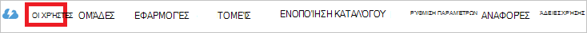

<properties
    pageTitle="Πρόγραμμα εκμάθησης: Ενοποίηση καταλόγου Azure Active Directory με Optimizely | Microsoft Azure"
    description="Μάθετε πώς μπορείτε να ρυθμίσετε τις παραμέτρους καθολικής σύνδεσης μεταξύ Azure Active Directory και Optimizely."
    services="active-directory"
    documentationCenter=""
    authors="jeevansd"
    manager="femila"
    editor=""/>

<tags
    ms.service="active-directory"
    ms.workload="identity"
    ms.tgt_pltfrm="na"
    ms.devlang="na"
    ms.topic="article"
    ms.date="09/11/2016"
    ms.author="jeedes"/>

# Πρόγραμμα εκμάθησης: Ενοποίηση καταλόγου Azure Active Directory με Optimizely

Σε αυτό το πρόγραμμα εκμάθησης, θα μάθετε πώς μπορείτε να ενοποιήσετε Optimizely με Azure Active Directory (Azure AD).

Ενοποίηση Optimizely με Azure AD σάς παρέχει τα ακόλουθα πλεονεκτήματα:

- Μπορείτε να ελέγξετε σε Azure AD ποιος έχει πρόσβαση σε Optimizely
- Μπορείτε να ενεργοποιήσετε τους χρήστες σας να αυτόματα να συνδεθεί στην Optimizely (καθολικής σύνδεσης) με τους λογαριασμούς Azure AD
- Μπορείτε να διαχειριστείτε τους λογαριασμούς σας σε μια κεντρική θέση - κλασική πύλη του Azure

Εάν θέλετε να μάθετε περισσότερες λεπτομέρειες σχετικά με ΑΔΑ εφαρμογή ενοποίηση με το Azure AD, ανατρέξτε στο θέμα [Τι είναι η εφαρμογή access και καθολικής σύνδεσης με το Azure Active Directory](active-directory-appssoaccess-whatis.md).

## Προαπαιτούμενα στοιχεία

Για να ρυθμίσετε τις παραμέτρους ενοποίησης Azure AD με Optimizely, χρειάζεστε τα ακόλουθα στοιχεία:

- Μια συνδρομή του Azure AD
- Μια **Optimizely** καθολικής σύνδεσης enabled συνδρομής

> [AZURE.NOTE] Για να ελέγξετε τα βήματα που περιγράφονται σε αυτό το πρόγραμμα εκμάθησης, δεν συνιστάται να χρησιμοποιείτε ένα περιβάλλον παραγωγής.

Για να ελέγξετε τα βήματα που περιγράφονται σε αυτό το πρόγραμμα εκμάθησης, θα πρέπει να ακολουθήσετε αυτές τις συστάσεις:

- Δεν πρέπει να χρησιμοποιείτε το περιβάλλον παραγωγής, εκτός εάν αυτό είναι απαραίτητο.
- Εάν δεν έχετε ένα περιβάλλον δοκιμαστική Azure AD, μπορείτε να αποκτήσετε μια μηνιαία δοκιμαστική [εδώ](https://azure.microsoft.com/pricing/free-trial/).

## Σενάριο περιγραφή
Σε αυτό το πρόγραμμα εκμάθησης, μπορείτε να ελέγξετε Azure AD καθολικής σύνδεσης σε περιβάλλον δοκιμής. Το σενάριο που περιγράφονται σε αυτό το πρόγραμμα εκμάθησης αποτελείται από δύο κύριο μπλοκ δόμησης:

1. Προσθήκη Optimizely από τη συλλογή
2. Ρύθμιση παραμέτρων και έλεγχος Azure AD μονό καθολικής σύνδεσης

## Προσθήκη Optimizely από τη συλλογή
Για να ρυθμίσετε την ενσωμάτωση των Optimizely στην Azure AD, πρέπει να προσθέσετε Optimizely από τη συλλογή στη λίστα των διαχειριζόμενων ΑΔΑ εφαρμογών.

**Για να προσθέσετε Optimizely από τη συλλογή, ακολουθήστε τα παρακάτω βήματα:**

1. Στην **πύλη του Azure κλασική**, στο αριστερό παράθυρο περιήγησης, κάντε κλικ στην επιλογή **Υπηρεσία καταλόγου Active Directory**. 

    ![Υπηρεσία καταλόγου Active Directory][1]

2. Από τη λίστα **καταλόγου** , επιλέξτε τον κατάλογο για την οποία θέλετε να ενεργοποιήσετε την ενοποίηση καταλόγου.

3. Για να ανοίξετε τις εφαρμογές προβολή, στην προβολή του καταλόγου, κάντε κλικ στην επιλογή **εφαρμογές** στο μενού επάνω.

    ![Εφαρμογές][2]

4. Κάντε κλικ στην επιλογή **Προσθήκη** στο κάτω μέρος της σελίδας.

    ![Εφαρμογές][3]

5. Στο παράθυρο διαλόγου **Τι θέλετε να κάνετε** , κάντε κλικ στην επιλογή **Προσθήκη εφαρμογής από τη συλλογή**.

    ![Εφαρμογές][4]

6. Στο πλαίσιο αναζήτησης, πληκτρολογήστε **Optimizely**.

    

7. Στο παράθυρο αποτελεσμάτων, επιλέξτε **Optimizely**και, στη συνέχεια, κάντε κλικ στην επιλογή **Ολοκλήρωση** , για να προσθέσετε την εφαρμογή.

    

##  Ρύθμιση παραμέτρων και έλεγχος Azure AD μονό καθολικής σύνδεσης
Σε αυτήν την ενότητα, μπορείτε να ρυθμίσετε τις παραμέτρους και να ελέγξετε Azure AD καθολικής σύνδεσης με Optimizely που βασίζεται σε ένα χρήστη δοκιμής που ονομάζεται "Britta Simon".

Για καθολικής σύνδεσης για να εργαστείτε, Azure AD πρέπει να γνωρίζετε ποιος είναι ο χρήστης αντίστοιχο στο Optimizely σε ένα χρήστη στο Azure AD. Με άλλα λόγια, μια σχέση σύνδεση μεταξύ ενός χρήστη Azure AD και το σχετικό χρήστη στο Optimizely πρέπει να καθοριστούν.
Αυτή η σχέση σύνδεση είναι εγκατεστημένος κατά την αντιστοίχιση της τιμής του **ονόματος χρήστη** στο Azure AD ως τιμή του το **όνομα χρήστη** στο Optimizely.

Για να ρυθμίσετε τις παραμέτρους και να ελέγξετε Azure AD καθολικής σύνδεσης με Optimizely, πρέπει να ολοκληρώσετε τα παρακάτω μπλοκ δόμησης:

1. **[Ρύθμιση παραμέτρων Azure AD καθολικής σύνδεσης](#configuring-azure-ad-single-single-sign-on)** - για να ενεργοποιήσετε τους χρήστες σας για να χρησιμοποιήσετε αυτήν τη δυνατότητα.
2. **[Δημιουργία μιας Azure AD δοκιμή χρήστη](#creating-an-azure-ad-test-user)** - για να ελέγξετε Azure AD καθολικής σύνδεσης με Britta Simon.
4. **[Δημιουργία μιας Optimizely δοκιμή χρήστη](#creating-an-optimizely-test-user)** - έχουν αντίστοιχο του Britta Simon στο Optimizely που είναι συνδεδεμένο με το Azure AD αναπαριστάται με εκείνη.
5. **[Εκχώρηση του Azure AD δοκιμή χρήστη](#assigning-the-azure-ad-test-user)** - για να ενεργοποιήσετε την Britta Simon για να χρησιμοποιήσετε Azure AD καθολικής σύνδεσης.
5. **[Δοκιμές καθολικής σύνδεσης](#testing-single-sign-on)** - για να επιβεβαιώσετε αν λειτουργεί η ρύθμιση παραμέτρων.

### Ρύθμιση παραμέτρων Azure AD καθολικής σύνδεσης

Στόχος αυτής της ενότητας είναι για να ενεργοποιήσετε Azure AD καθολικής σύνδεσης στην πύλη του Azure κλασική και για τη ρύθμιση παραμέτρων Καθολικής σύνδεσης στην εφαρμογή σας Optimizely.

Εφαρμογή Optimizely αναμένει το διεκδικήσεων SAML ώστε να περιέχει ένα χαρακτηριστικό με όνομα "ηλεκτρονικού ταχυδρομείου". Η τιμή του "ηλεκτρονικού ταχυδρομείου" πρέπει να είναι ένα μήνυμα ηλεκτρονικού ταχυδρομείου Optimizely αναγνώρισαν που μπορεί να πιστοποιηθεί από Azure AD. Ρυθμίστε το αίτημα "ηλεκτρονικού ταχυδρομείου" για αυτήν την εφαρμογή. Μπορείτε να διαχειριστείτε τις τιμές από αυτά τα χαρακτηριστικά από την καρτέλα **"Atrributes"** της εφαρμογής. Το παρακάτω στιγμιότυπο οθόνης εμφανίζει ένα παράδειγμα για αυτό. 

 

**Για να ρυθμίσετε τις παραμέτρους Azure AD καθολικής σύνδεσης με Optimizely, ακολουθήστε τα παρακάτω βήματα:**

1. Στην κλασική πύλη Azure, στη σελίδα **Optimizely** ενοποίηση εφαρμογής, στο μενού στο επάνω μέρος, κάντε κλικ στην επιλογή **χαρακτηριστικά**.
     
    ![Ρύθμιση παραμέτρων Καθολικής σύνδεσης][5]

2. Στο παράθυρο διαλόγου διακριτικού χαρακτηριστικά SAML, προσθέστε το χαρακτηριστικό "ηλεκτρονικού ταχυδρομείου".

    μια. Κάντε κλικ στην επιλογή **Προσθήκη χρήστη χαρακτηριστικό** για να ανοίξετε το παράθυρο διαλόγου **Προσθήκη χαρακτηριστικό χρήστη** . 
    
    

    β. Στο πλαίσιο κειμένου **Όνομα χαρακτηριστικού** , πληκτρολογήστε το χαρακτηριστικό όνομα "ηλεκτρονικού ταχυδρομείου".

    c. Από την **Τιμή του χαρακτηριστικού** λίστα, επιλέξτε την τιμή του χαρακτηριστικού "userprincipalname" ή οποιαδήποτε τιμή που περιέχει ένα μήνυμα ηλεκτρονικού ταχυδρομείου αναγνωρίζεται από το Azure AD και Optimizely.

    d. Κάντε κλικ στην επιλογή **Ολοκλήρωση**.
3. Στο μενού στο επάνω μέρος, κάντε κλικ στην επιλογή **Γρήγορης εκκίνησης**.

    ![Ρύθμιση παραμέτρων Καθολικής σύνδεσης][6]
4. Στην κλασική πύλη, στη σελίδα ενοποίησης εφαρμογής **Optimizely** , κάντε κλικ στην επιλογή **Ρύθμιση παραμέτρων Καθολικής σύνδεσης** για να ανοίξετε το παράθυρο διαλόγου **Ρύθμιση παραμέτρων Καθολικής σύνδεσης** .

    ![Ρύθμιση παραμέτρων Καθολικής σύνδεσης][7] 

5. Στη σελίδα **Πώς θέλετε οι χρήστες να πραγματοποιούν είσοδο Optimizely** , επιλέξτε **Azure AD καθολικής σύνδεσης**και, στη συνέχεια, κάντε κλικ στο κουμπί **Επόμενο**.
    
    

6. Στη σελίδα του παραθύρου διαλόγου **Διαμόρφωση παραμέτρων ρυθμίσεων εφαρμογής** , εκτελέστε τα ακόλουθα βήματα: 

    

    μια. Στο πλαίσιο κειμένου **Εισόδου στη διεύθυνση URL** , πληκτρολογήστε:`https://app.optimizely.net/contoso`

    β. Στο πλαίσιο κειμένου " **αναγνωριστικό** ", πληκτρολογήστε:`urn:auth0:optimizely:contoso`

    c. Κάντε κλικ στο κουμπί **Επόμενο**. 

    > [AZURE.NOTE] Οι τιμές για την **Είσοδο στη διεύθυνση URL** και το **αναγνωριστικό** είναι μόνο τα σύμβολα κράτησης θέσης για τις πραγματικές τιμές. Μπορείτε να βρείτε οδηγίες για aquiring τις πραγματικές τιμές από Optimizely παρακάτω σε αυτό το πρόγραμμα εκμάθησης.

7. Στη σελίδα **Ρύθμιση παραμέτρων Καθολικής σύνδεσης στο Optimizely** , εκτελέστε τα ακόλουθα βήματα:

    

    μια. Κάντε κλικ στην επιλογή **λήψη πιστοποιητικό**και, στη συνέχεια, αποθηκεύστε το αρχείο στον υπολογιστή σας.

    β. Αντιγράψτε τη **διεύθυνση URL της υπηρεσίας καθολικής σύνδεσης**.

8. Για να λάβετε SSO έχει ρυθμιστεί για την εφαρμογή σας, επικοινωνήστε με το διαχειριστή του λογαριασμού σας Optimizely και δώστε τις ακόλουθες πληροφορίες:

    - Έχετε λάβει πιστοποιητικού 
    - Η διεύθυνση URL της υπηρεσίας καθολικής σύνδεσης
 
    Απάντηση με το ηλεκτρονικό ταχυδρομείο, Optimizely σάς παρέχει τη εισόδου στη διεύθυνση URL (SP ξεκίνησε SSO) και οι τιμές αναγνωριστικό (υπηρεσία παροχής οντότητα ID).

9. Επιστροφή στη σελίδα του παραθύρου διαλόγου **Διαμόρφωση παραμέτρων ρυθμίσεων εφαρμογής** και, στη συνέχεια, ακολουθήστε τα παρακάτω βήματα:

    

    μια. Στο πλαίσιο κειμένου **Εισόδου στη διεύθυνση URL** , πληκτρολογήστε τη **Διεύθυνση URL που ξεκινούν από SP SSO** που παρέχεται από Optimizely.

    β. Στο πλαίσιο κειμένου " **αναγνωριστικό** ", πληκτρολογήστε το **Αναγνωριστικό οντότητα της υπηρεσίας παροχής** που παρέχεται από Optimizely.

    c. Κάντε κλικ στο κουμπί **Επόμενο**.

10. Στη σελίδα **Ρύθμιση παραμέτρων Καθολικής σύνδεσης στο Optimizely** , εκτελέστε τα ακόλουθα βήματα:
    
    ![Azure AD καθολικής σύνδεσης][10]

    μια. Επιλέξτε την καθολική σύνδεση παραμέτρων επιβεβαίωσης.

    β. Κάντε κλικ στο κουμπί **Επόμενο**.

11. Στη σελίδα **επιβεβαίωσης καθολική σύνδεση** , κάντε κλικ στην επιλογή **ολοκληρώθηκε**.  
    
    ![Azure AD καθολικής σύνδεσης][11]

12. Σε ένα παράθυρο προγράμματος περιήγησης διαφορετικά, καθολικής σύνδεσης στην εφαρμογή σας Optimizely.
13. Κάντε κλικ στο όνομα στην επάνω δεξιά γωνία και, στη συνέχεια, **Ρυθμίσεις λογαριασμού**του λογαριασμού.

    

14. Στην καρτέλα λογαριασμός, επιλέξτε το πλαίσιο **Ενεργοποίηση SSO** στην περιοχή καθολικής σύνδεσης στην ενότητα **Overview** .

    

### Δημιουργία ενός χρήστη δοκιμής Azure AD
Σε αυτήν την ενότητα, μπορείτε να δημιουργήσετε ένα χρήστη δοκιμής στην κλασική πύλη που ονομάζεται Britta Simon.
Στη λίστα χρηστών, επιλέξτε **Britta Simon**.

![Δημιουργία Azure AD χρήστη][20]

**Για να δημιουργήσετε ένα χρήστη δοκιμής Azure AD, ακολουθήστε τα παρακάτω βήματα:**

1. Στην **πύλη του Azure κλασική**, στο αριστερό παράθυρο περιήγησης, κάντε κλικ στην επιλογή **Υπηρεσία καταλόγου Active Directory**.
    
     

2. Από τη λίστα **καταλόγου** , επιλέξτε τον κατάλογο για την οποία θέλετε να ενεργοποιήσετε την ενοποίηση καταλόγου.

3. Για να εμφανίσετε τη λίστα των χρηστών, στο μενού στο επάνω μέρος, κάντε κλικ στην επιλογή **χρήστες**.
    
     

4. Για να ανοίξετε το παράθυρο διαλόγου **Προσθήκη χρήστη** , στη γραμμή εργαλείων στο κάτω μέρος, κάντε κλικ στην επιλογή **Προσθήκη χρήστη**.

     

5. Στη σελίδα του παραθύρου διαλόγου **πείτε μας σχετικά με αυτόν το χρήστη** , εκτελέστε τα ακόλουθα βήματα:
 
     

    μια. Ως τύπο του χρήστη, επιλέξτε νέο χρήστη στην εταιρεία σας.

    β. Στο πλαίσιο όνομα χρήστη **πλαίσιο κειμένου**, πληκτρολογήστε **BrittaSimon**.

    c. Κάντε κλικ στο κουμπί **Επόμενο**.

6.  Στη σελίδα του παραθύρου διαλόγου **Προφίλ χρήστη** , εκτελέστε τα ακόλουθα βήματα:

     

    μια. Στο πλαίσιο κειμένου **όνομα** , πληκτρολογήστε **Britta**.  

    β. Στο πλαίσιο **Όνομα επώνυμο** κειμένου, τύπος, **Simon**.

    c. Στο πλαίσιο κειμένου **Εμφανιζόμενο όνομα** , πληκτρολογήστε **Britta Simon**.

    d. Στη λίστα **εργασιών** , επιλέξτε το **χρήστη**.

    ε. Κάντε κλικ στο κουμπί **Επόμενο**.

7. Στη σελίδα του παραθύρου διαλόγου **λήψη προσωρινό κωδικό πρόσβασης** , κάντε κλικ στην επιλογή **Δημιουργία**.

     

8. Στη σελίδα του παραθύρου διαλόγου **λήψη προσωρινό κωδικό πρόσβασης** , εκτελέστε τα ακόλουθα βήματα:

     

    μια. Σημειώστε την τιμή της το **Νέο κωδικό πρόσβασης**.

    β. Κάντε κλικ στην επιλογή **Ολοκλήρωση**.   

### Δημιουργία μιας Optimizely δοκιμής χρήστη

Σε αυτήν την ενότητα, μπορείτε να δημιουργήσετε ένα χρήστη που ονομάζεται Britta Simon στο Optimizely.

1. Στην αρχική σελίδα, επιλέξτε καρτέλα **επιτρέπει στους συνεργάτες**
2. Κάντε κλικ στην επιλογή **Νέα Collaborator** για να προσθέσετε μια νέα collaborator στο έργο.

    

3.  Συμπληρώστε τη διεύθυνση ηλεκτρονικού ταχυδρομείου και αντιστοιχίστε τις σε ένα ρόλο. Κάντε κλικ στην **πρόσκληση**.

    

4. Θα λάβουν μια πρόσκληση ηλεκτρονικού ταχυδρομείου. Με τη διεύθυνση ηλεκτρονικού ταχυδρομείου. θα χρειαστεί να συνδεθείτε στο Optimizely.

### Εκχώρηση Azure AD δοκιμής χρήστη

Σε αυτήν την ενότητα, μπορείτε να ενεργοποιήσετε Britta Simon χρήση Azure καθολικής σύνδεσης, εκχώρηση της πρόσβασης σε Optimizely.

![Εκχώρηση χρήστη][200] 

**Για να αντιστοιχίσετε Britta Simon Optimizely, ακολουθήστε τα παρακάτω βήματα:**

1. Στην κλασική πύλη, για να ανοίξετε τις εφαρμογές προβολή, στην προβολή του καταλόγου, κάντε κλικ στην επιλογή **εφαρμογές** στο μενού επάνω.

    ![Εκχώρηση χρήστη][201] 

2. Στη λίστα εφαρμογών, επιλέξτε **Optimizely**.

     

1. Στο μενού στο επάνω μέρος, κάντε κλικ στην επιλογή **χρήστες**.

    ![Εκχώρηση χρήστη][203] 

1. Στη λίστα όλοι οι χρήστες, επιλέξτε **Britta Simon**.

2. Στη γραμμή εργαλείων στο κάτω μέρος, κάντε κλικ στο κουμπί **Αντιστοίχιση**.

    ![Εκχώρηση χρήστη][205]

### Δοκιμή καθολικής σύνδεσης

Είναι ο στόχος αυτής της ενότητας για να ελέγξετε Azure AD καθολική σύνδεση ρύθμιση των παραμέτρων σας χρησιμοποιώντας τον πίνακα της Access.

Όταν κάνετε κλικ στο πλακίδιο Optimizely στον πίνακα της Access, που θα πρέπει να λάβετε αυτόματα πραγματοποιήσει-σε στην εφαρμογή σας Optimizely.

## Πρόσθετοι πόροι

* [Λίστα εκμάθησης σχετικά με τον τρόπο ενσωμάτωσης εφαρμογές ΑΔΑ καταλόγου Azure Active Directory](active-directory-saas-tutorial-list.md)
* [Τι είναι η εφαρμογή access και καθολικής σύνδεσης με το Azure Active Directory;](active-directory-appssoaccess-whatis.md)

<!--Image references-->

[1]: ./media/active-directory-saas-optimizely-tutorial/tutorial_general_01.png
[2]: ./media/active-directory-saas-optimizely-tutorial/tutorial_general_02.png
[3]: ./media/active-directory-saas-optimizely-tutorial/tutorial_general_03.png
[4]: ./media/active-directory-saas-optimizely-tutorial/tutorial_general_04.png

[5]: ./media/active-directory-saas-optimizely-tutorial/tutorial_general_05.png
[6]: ./media/active-directory-saas-optimizely-tutorial/tutorial_general_06.png
[7]:  ./media/active-directory-saas-optimizely-tutorial/tutorial_general_050.png
[10]: ./media/active-directory-saas-optimizely-tutorial/tutorial_general_060.png
[11]: ./media/active-directory-saas-optimizely-tutorial/tutorial_general_070.png
[20]: ./media/active-directory-saas-optimizely-tutorial/tutorial_general_100.png

[200]: ./media/active-directory-saas-optimizely-tutorial/tutorial_general_200.png
[201]: ./media/active-directory-saas-optimizely-tutorial/tutorial_general_201.png
[203]: ./media/active-directory-saas-optimizely-tutorial/tutorial_general_203.png
[204]: ./media/active-directory-saas-optimizely-tutorial/tutorial_general_204.png
[205]: ./media/active-directory-saas-optimizely-tutorial/tutorial_general_205.png
