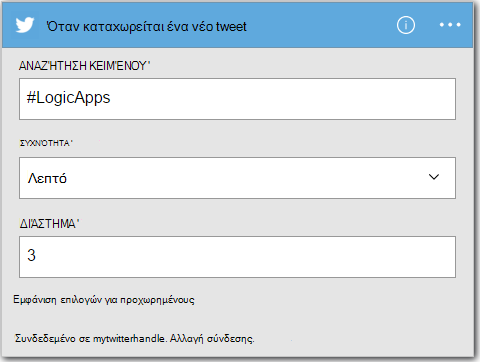

<properties
    pageTitle="Δημιουργία εφαρμογής λογικής | Microsoft Azure"
    description="Μάθετε πώς μπορείτε να δημιουργήσετε μια εφαρμογή λογική για τη σύνδεση ΑΔΑ υπηρεσιών"
    authors="jeffhollan"
    manager="dwrede"
    editor=""
    services="logic-apps"
    documentationCenter=""/>

<tags
    ms.service="logic-apps"
    ms.workload="na"
    ms.tgt_pltfrm="na"
    ms.devlang="na"
    ms.topic="get-started-article"
    ms.date="10/18/2016"
    ms.author="jehollan"/>

# Δημιουργία νέας εφαρμογής λογικής τη σύνδεση ΑΔΑ υπηρεσιών

Αυτό το θέμα δείχνει πώς γίνεται αυτό, σε λίγα λεπτά, που μπορούν να ξεκινήσουν με [Azure λογικής εφαρμογών](app-service-logic-what-are-logic-apps.md). Θα σας καθοδηγήσουμε μέσω μιας απλής ροής εργασίας που σας επιτρέπει να στείλετε ενδιαφέρον tweets ηλεκτρονικού ταχυδρομείου σας.

Για να χρησιμοποιήσετε αυτό το σενάριο, πρέπει:

- Μια συνδρομή του Azure
- Ένας λογαριασμός Twitter
- Μια Outlook.com ή φιλοξενούμενη γραμματοκιβωτίου στο Office 365

## Δημιουργία νέας εφαρμογής λογικής σε λογαριασμό ηλεκτρονικού ταχυδρομείου που tweets

1. Στον πίνακα [εργαλείων Azure πύλης](https://portal.azure.com), επιλέξτε **Δημιουργία**. 
2. Στη γραμμή αναζήτησης, αναζητήστε 'εφαρμογή λογικής' και, στη συνέχεια, επιλέξτε **Εφαρμογή λογικής**. Επίσης, μπορείτε να επιλέξετε **Δημιουργία** **Web + Mobile**, και να επιλέξτε **Εφαρμογή λογικής**. 
3. Πληκτρολογήστε ένα όνομα για την εφαρμογή σας λογικής, επιλέξτε μια θέση, την ομάδα πόρων και επιλέξτε **Δημιουργία**.  Εάν επιλέξετε **το Pin στον πίνακα εργαλείων** στην εφαρμογή λογικής θα ανοίξει αυτόματα μόλις αναπτυχθεί.  
4. Αφού ανοίξετε την εφαρμογή σας λογικής για πρώτη φορά, μπορείτε να επιλέξετε από ένα πρότυπο για να ξεκινήσετε.  Προς το παρόν, κάντε κλικ στην επιλογή **Κενή εφαρμογή λογικής** για να δημιουργήσετε αυτήν από την αρχή. 
1. Το πρώτο στοιχείο που πρέπει να δημιουργήσετε είναι το έναυσμα.  Αυτό είναι το συμβάν που θα ξεκινήσετε την εφαρμογή σας λογική.  Αναζήτηση του **twitter** στο πλαίσιο αναζήτησης έναυσμα και επιλέξτε την.
7. Τώρα θα πληκτρολογήσετε έναν όρο αναζήτησης για να ενεργοποιήσετε στην.  Τη **συχνότητα** και το **χρονικό διάστημα** θα καθορίσει τη συχνότητα εφαρμογή της λογικής θα έλεγχος για νέα tweets (και επιστροφής όλα tweets κατά τη διάρκεια που χρόνου εύρος).
    

5. Επιλέξτε το κουμπί **νέο βήμα** και, στη συνέχεια, επιλέξτε **Προσθήκη μιας ενέργειας** ή **Προσθήκη μιας συνθήκης**
6. Όταν επιλέξετε **Προσθήκη ενέργειας**, μπορείτε να κάνετε αναζήτηση από τις [διαθέσιμες γραμμές σύνδεσης](../connectors/apis-list.md) για να επιλέξετε μια ενέργεια. Για παράδειγμα, μπορείτε να επιλέξετε **Outlook.com - αποστολή μηνύματος ηλεκτρονικού ταχυδρομείου** για την αποστολή αλληλογραφίας από μια διεύθυνση outlook.com:  
    

7. Τώρα θα πρέπει να συμπληρώσετε τις παραμέτρους για το μήνυμα ηλεκτρονικού ταχυδρομείου που θέλετε:  

8. Τέλος, μπορείτε να επιλέξετε **Αποθήκευση** για να κάνετε την εφαρμογή σας λογικής live.

## Διαχείριση της εφαρμογής σας λογικής μετά τη δημιουργία

Τώρα είναι η εφαρμογή σας λογικής εγκατάσταση και λειτουργία. Να θα ελέγχει περιοδικά για tweets με τον όρο αναζήτησης που εισάγονται. Όταν εντοπίσει ένα αντίστοιχο tweet, αυτό θα σας στείλει ένα μήνυμα ηλεκτρονικού ταχυδρομείου. Τέλος, θα δείτε πώς μπορείτε να απενεργοποιήσετε την εφαρμογή ή ανατρέξτε στο θέμα Πώς κάνει.

1. Μεταβείτε στην [πύλη του Azure](https://portal.azure.com)

1. Κάντε κλικ στην επιλογή **Αναζήτηση** στην αριστερή πλευρά της οθόνης και επιλέξτε **Λογικής εφαρμογών**.

2. Κάντε κλικ στην επιλογή η νέα εφαρμογή λογικής που μόλις δημιουργήσατε για να δείτε την τρέχουσα κατάσταση και γενικές πληροφορίες.

3. Για να επεξεργαστείτε τη νέα εφαρμογή σας λογικής, κάντε κλικ στην επιλογή **Επεξεργασία**.

5. Για να απενεργοποιήσετε την εφαρμογή, κάντε κλικ στην επιλογή **Απενεργοποίηση** στη γραμμή εντολών.

1. Προβολή εκτέλεση και έναυσμα ιστορικών, για να παρακολουθείτε όταν εκτελείται το εφαρμογή της λογικής.  Μπορείτε να επιλέξετε **Ανανέωση** για να δείτε τα πιο πρόσφατα δεδομένα.

Λιγότερο από 5 λεπτά μπορέσατε να ρυθμίσετε μια απλή λογική εφαρμογή εκτελείται στο cloud. Για να μάθετε περισσότερα σχετικά με τη χρήση δυνατοτήτων λογικής εφαρμογών, ανατρέξτε στο θέμα [Χρήση λογικής εφαρμογή δυνατοτήτων]. Για να μάθετε περισσότερα σχετικά με τους ορισμούς εφαρμογής λογικής τον εαυτό τους, ανατρέξτε στο θέμα [σύνταξη ορισμών λογική εφαρμογής](app-service-logic-author-definitions.md).

<!-- Shared links -->
[Azure portal]: https://portal.azure.com
[Χρήση δυνατοτήτων εφαρμογής λογικής]: app-service-logic-create-a-logic-app.md
