<properties
    pageTitle="Δημιουργία και ρύθμιση παραμέτρων αναπτύξετε μια εφαρμογή web PHP σε Azure"
    description="Ένα πρόγραμμα εκμάθησης που δείχνει τον τρόπο για να εκτελείται στο Azure εφαρμογής υπηρεσίας μια εφαρμογή web PHP (Laravel). Μάθετε πώς μπορείτε να ρυθμίσετε τις παραμέτρους Azure εφαρμογής υπηρεσίας για να πληροί τις απαιτήσεις του πλαισίου PHP που επιλέγετε."
    services="app-service\web"
    documentationCenter="php"
    authors="cephalin"
    manager="wpickett"
    editor=""
    tags="mysql"/>

<tags
    ms.service="app-service-web"
    ms.workload="web"
    ms.tgt_pltfrm="na"
    ms.devlang="PHP"
    ms.topic="article"
    ms.date="06/03/2016" 
    ms.author="cephalin"/>

# Δημιουργία και ρύθμιση παραμέτρων αναπτύξετε μια εφαρμογή web PHP σε Azure

[AZURE.INCLUDE [tabs](../../includes/app-service-web-get-started-nav-tabs.md)]

Αυτό το πρόγραμμα εκμάθησης δείχνει πώς μπορείτε να δημιουργήσετε, να ρυθμίσετε τις παραμέτρους και αναπτύξτε μια εφαρμογή web PHP για Azure και πώς μπορείτε να ρυθμίσετε τις παραμέτρους Azure εφαρμογής υπηρεσίας για να πληροί τις απαιτήσεις της εφαρμογής web PHP. Μέχρι το τέλος του προγράμματος εκμάθησης, θα έχετε μια εργασία [Laravel](https://www.laravel.com/) εφαρμογής web εκτελείται live στο [Azure εφαρμογής υπηρεσίας](../app-service/app-service-value-prop-what-is.md).

Προγραμματιστής PHP, μπορείτε να μεταφέρετε τις αγαπημένες framework PHP να Azure. Αυτό το πρόγραμμα εκμάθησης χρησιμοποιεί Laravel απλώς ως παράδειγμα μπετόν εφαρμογής. Θα μάθετε: 

- Ανάπτυξη χρησιμοποιώντας Git
- Ορισμός PHP έκδοση
- Χρησιμοποιήστε ένα αρχείο Έναρξη που δεν βρίσκεται στον ριζικό κατάλογο εφαρμογών
- Μεταβλητές συγκεκριμένο περιβάλλον πρόσβασης
- Ενημέρωση της εφαρμογής σας στο Azure

Μπορείτε να εφαρμόσετε τι θα μάθετε εδώ άλλες εφαρμογές web PHP που αναπτύσσετε σε Azure.

>[AZURE.INCLUDE [app-service-linux](../../includes/app-service-linux.md)] 

## Προαπαιτούμενα στοιχεία

- Εγκατάσταση [PHP 5.6.x](http://php.net/downloads.php) (PHP 7 υποστήριξης είναι beta)
- Εγκατάσταση [σύνθεσης](https://getcomposer.org/download/)
- Εγκατάσταση του [Azure CLI](../xplat-cli-install.md)
- Εγκατάσταση [Git](http://www.git-scm.com/downloads)
- Αποκτήστε ένα λογαριασμό Microsoft Azure. Εάν δεν έχετε ένα λογαριασμό, μπορείτε να [εγγραφείτε για μια δωρεάν δοκιμαστική έκδοση](/pricing/free-trial/?WT.mc_id=A261C142F) ή να [ενεργοποιήσετε το Visual Studio πλεονεκτήματα συνδρομητών](/pricing/member-offers/msdn-benefits-details/?WT.mc_id=A261C142F).

>[AZURE.NOTE] Δείτε μια εφαρμογή web στην πράξη. [Δοκιμάστε εφαρμογής υπηρεσίας](http://go.microsoft.com/fwlink/?LinkId=523751) αμέσως και να δημιουργήσετε μια εφαρμογή μικρής διάρκειας starter — απαιτείται πιστωτική κάρτα, χωρίς δεσμεύσεις.

## Δημιουργία εφαρμογής PHP (Laravel) στον υπολογιστή σας την

1. Ανοίξτε μια νέα γραμμή εντολών των Windows, το παράθυρο του PowerShell, Linux κελύφους ή terminal OS X. Εκτελέστε τις ακόλουθες εντολές για να επαληθεύσετε ότι τα απαιτούμενα εργαλεία έχουν εγκατασταθεί σωστά στον υπολογιστή σας. 

        php --version
        composer --version
        azure --version
        git --version

    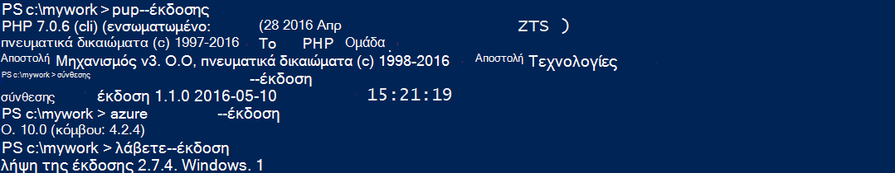

    Εάν δεν έχετε εγκαταστήσει τα εργαλεία, ανατρέξτε στο θέμα [προαπαιτούμενα στοιχεία](#Prerequisites) για τις συνδέσεις λήψης.
    
2. Εγκατάσταση Laravel ως εξής:

        composer global require "laravel/installer

3. `CD`σε έναν κατάλογο εργασίας και να δημιουργήσετε μια νέα εφαρμογή Laravel ως εξής:

        cd <working_directory>
        laravel new <app_name>

4. `CD`σε που μόλις δημιουργήθηκε `<app_name>` καταλόγου και δοκιμή της εφαρμογής, ως εξής:

        cd <app_name>
        php artisan serve
        
    Θα πρέπει να μπορείτε να μεταβείτε τώρα http://localhost:8000 σε ένα πρόγραμμα περιήγησης και να εμφανιστεί η οθόνη εκκίνησης Laravel.
    
    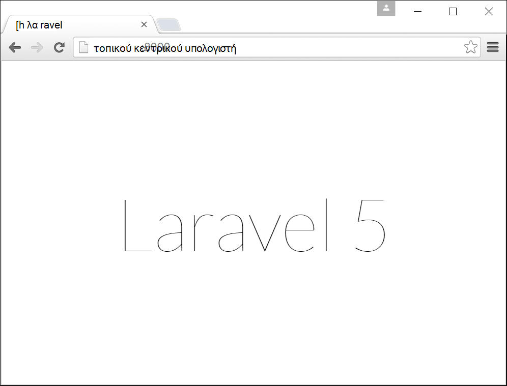
    
Επομένως, άκρο, μόλις η κανονική ροή εργασίας Laravel και, δεν είστε εδώ για να <a href="https://laravel.com/docs/5.2" rel="nofollow">Μάθετε Laravel</a>. Επομένως, ας μετακίνηση.

## Δημιουργία μιας εφαρμογής Azure web και ρύθμιση του Git ανάπτυξης

>[AZURE.NOTE] "Περιμένετε! Τι γίνεται εάν θέλω να αναπτύξετε με FTP;" Υπάρχει ένα [πρόγραμμα εκμάθησης FTP](web-sites-php-mysql-deploy-use-ftp.md) για τις ανάγκες σας. 

Με το Azure CLI, μπορείτε να δημιουργήσετε μια εφαρμογή web στο Azure εφαρμογής υπηρεσίας και να τη ρυθμίσετε για χρήση με ανάπτυξη Git με μία μόνο γραμμή της εντολής. Ας κάντε τα εξής.

1. Αλλαγή σε κατάσταση λειτουργίας ASM και συνδεθείτε στο Azure:

        azure config mode asm
        azure login
    
    Ακολουθήστε το μήνυμα βοήθειας για να συνεχίσετε τη διαδικασία σύνδεσης.
    
    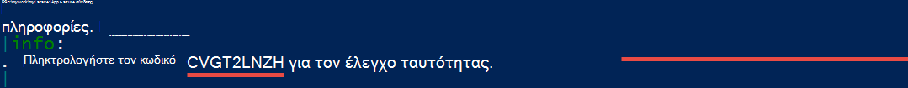

4. Εκτελέστε την εντολή για να δημιουργήσετε το Azure web app με ανάπτυξη Git. Όταν σας ζητηθεί, καθορίστε τον αριθμό της περιοχής που θέλετε.

        azure site create --git <app_name>
    
    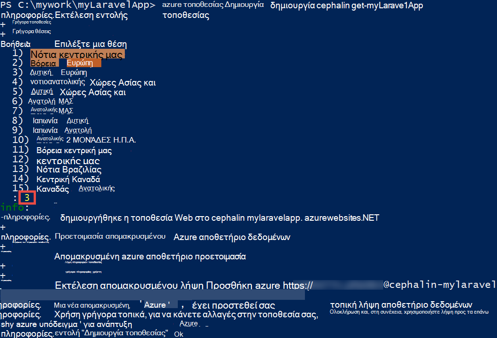
    
    >[AZURE.NOTE] Εάν έχετε ποτέ ρυθμίζετε τα διαπιστευτήρια ανάπτυξης για τη συνδρομή σας Azure, θα σας ζητηθεί να τις δημιουργήσετε. Αυτά τα διαπιστευτήρια, δεν λογαριασμός Azure τα διαπιστευτήριά σας, χρησιμοποιούνται από εφαρμογής υπηρεσίας μόνο για αναπτύξεις Git και FTP συνδέσεις. 
    
    Αυτή η εντολή δημιουργεί ένα νέο αρχείο φύλαξης Git τον τρέχοντα κατάλογο (με `git init`) και το συνδέεται με το αρχείο φύλαξης στο Azure ως έναν απομακρυσμένο Git (με `git remote add`).

<a name="configure"/>
## Ρύθμιση παραμέτρων της εφαρμογής Azure web

Για την εφαρμογή σας Laravel για να εργαστείτε στο Azure, πρέπει να πληρώσετε την προσοχή σε διάφορες αιτίες. Θα κάνετε αυτήν την άσκηση παρόμοια για το πλαίσιο PHP της επιλογής.

- Ρύθμιση παραμέτρων PHP 5.5.9 ή παραπάνω. Ανατρέξτε στο θέμα [Απαιτήσεις διακομιστή την πιο πρόσφατη Laravel 5.2](https://laravel.com/docs/5.2#server-requirements) για ολόκληρη τη λίστα των απαιτήσεων διακομιστή. Το υπόλοιπο της λίστας είναι επεκτάσεις που έχουν ήδη ενεργοποιηθεί από εγκαταστάσεις PHP του Azure. 
- Ορίστε τις μεταβλητές περιβάλλοντος της εφαρμογής σας χρειάζεται. Χρησιμοποιεί Laravel το `.env` αρχείων για εύκολη ρύθμιση των μεταβλητών περιβάλλοντος. Ωστόσο, δεδομένου του δεν είναι δυνατό να πραγματοποιηθούν στο στοιχείο ελέγχου προέλευσης (ανατρέξτε στην ενότητα [Ρύθμιση παραμέτρων περιβάλλον Laravel](https://laravel.com/docs/5.2/configuration#environment-configuration), θα μπορείτε να ορίσετε τις ρυθμίσεις εφαρμογής της εφαρμογής Azure web αντί για αυτό.
- Βεβαιωθείτε ότι καταχώρησης της εφαρμογής Laravel το δείκτη του ποντικιού, `public/index.php`, φορτώνεται πρώτα. Ανατρέξτε στο θέμα [Επισκόπηση Laravel κύκλου ζωής](https://laravel.com/docs/5.2/lifecycle#lifecycle-overview). Με άλλα λόγια, πρέπει να ορίσετε τη διεύθυνση URL ριζικό κατάλογο του web app στην οποία θα οδηγεί η `public` καταλόγου.
- Ενεργοποιήστε την επέκταση σύνθεσης στο Azure, εφόσον έχετε μια composer.json. Με αυτόν τον τρόπο, μπορείτε να αφήσετε σύνθεσης ανησυχείτε σχετικά με την απόκτηση απαιτείται πακέτα σας κατά την ανάπτυξη με το `git push`. Αυτό είναι ένα θέμα ευκολία. Εάν δεν ενεργοποιήσετε σύνθεσης αυτοματισμού, απλώς πρέπει να καταργήσετε `/vendor` από το `.gitignore` αρχείου, έτσι ώστε να περιλαμβάνει Git ("un-παραβλέπει το όρισμα") όλα τα στοιχεία στο το `vendor` καταλόγου κατά την οριστικοποίηση των και ανάπτυξη κώδικα.

Ας διαμόρφωση διαδοχικά αυτές τις εργασίες.

4. Ορισμός της έκδοσης PHP που απαιτεί την εφαρμογή σας Laravel.

        azure site set --php-version 5.6

    Ολοκληρώσετε τη ρύθμιση της έκδοσης PHP! 
    
4. Δημιουργία μιας νέας `APP_KEY` για το Azure στο web app και ορίστε την ως μια ρύθμιση εφαρμογών για το Azure web app.

        php artisan key:generate --show
        azure site appsetting add APP_KEY="<output_of_php_artisan_key:generate_--show>"

4. Επίσης, ενεργοποιήστε την Laravel εντοπισμού προκειμένου να εκτελούνται πριν από κάθε δυσνόητο `Whoops, looks like something went wrong.` σελίδας.

        azure site appsetting add APP_DEBUG=true

    Μεταβλητές περιβάλλοντος ρύθμιση είστε έτοιμοι!
    
    >[AZURE.NOTE] Περιμένετε, ας επιβραδύνει λίγο και εξηγούν τι κάνει Laravel, καθώς και τι Azure κάνει εδώ. Laravel χρησιμοποιεί το `.env` αρχείο στον ριζικό κατάλογο να παρέχετε μεταβλητές περιβάλλοντος για την εφαρμογή, όπου θα βρείτε τη γραμμή `APP_DEBUG=true` (και, επίσης, `APP_KEY=...`). Αυτή η μεταβλητή είναι δυνατή η πρόσβαση στο `config/app.php` από τον κωδικό     `'debug' => env('APP_DEBUG', false),`. [ENV()](https://laravel.com/docs/5.2/helpers#method-env) είναι μια μέθοδος Βοήθειας Laravel που χρησιμοποιεί το PHP [getenv()](http://php.net/manual/en/function.getenv.php) στην περιοχή στο παρασκήνιο.
    >
    >Ωστόσο, `.env` παραβλέπεται από Git, επειδή καλείται από το `.gitignore` αρχείο στον ριζικό κατάλογο. Απλώς τοποθετήστε, `.env`  
 στον τοπικό σας Git αποθετήριο δεν προωθείται Azure με το υπόλοιπο των αρχείων. Φυσικά, μπορείτε απλώς να καταργήσετε αυτήν τη γραμμή από `.gitignore`, αλλά θα σας έχετε ήδη δημιουργήσει ότι την οριστικοποίηση των αυτού του αρχείου σε στοιχείο ελέγχου προέλευσης δεν συνιστάται. Ωστόσο, εξακολουθείτε να χρειάζεστε έναν τρόπο για να καθορίσετε αυτές τις μεταβλητές περιβάλλοντος στο Azure. 
    >
    >Τα καλά νέα είναι ότι η εφαρμογή ρυθμίσεων στο Azure εφαρμογής υπηρεσίας υποστηρίζει [getenv()](http://php.net/manual/en/function.getenv.php)  
 στο PHP. Συνεπώς, ενώ μπορείτε να χρησιμοποιήσετε FTP ή άλλα μέσα για να αποστείλετε με μη αυτόματο τρόπο μια `.env` αρχείου σε Azure, μπορείτε να απλώς να καθορίσετε τις μεταβλητές που θέλετε ως των ρυθμίσεων της εφαρμογής Azure χωρίς μια `.env` στο Azure, όπως που μόλις κάνατε. Επιπλέον, εάν μια μεταβλητή είναι τόσο μια `.env` αρχείου και στις ρυθμίσεις του Azure εφαρμογής, η ρύθμιση Azure εφαρμογή κερδίζει.     

4. Τα τελευταία δύο εργασίες (τη ρύθμιση στον εικονικό κατάλογο και ενεργοποίηση σύνθεσης) απαιτεί την [πύλη του Azure](https://portal.azure.com), επομένως, συνδεθείτε [πύλη](https://portal.azure.com) με το λογαριασμό σας Azure.

4. Ξεκινώντας από το αριστερό μενού, κάντε κλικ στην επιλογή **Εφαρμογή υπηρεσιών** > **&lt;app_name >** > **Εργαλεία**.

    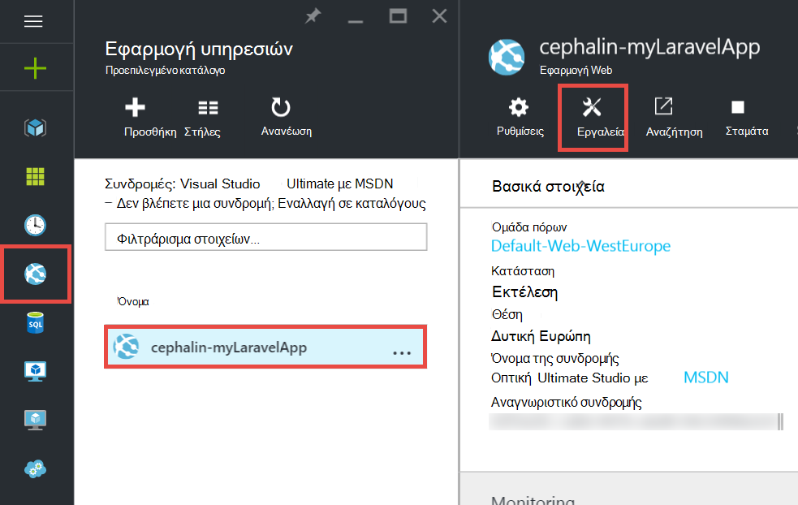
    
    >[AZURE.TIP] Εάν κάνετε κλικ στο κουμπί **Ρυθμίσεις** αντί για **Εργαλεία**, θα έχετε τη δυνατότητα να αποκτήσετε πρόσβαση στις **Ρυθμίσεις εφαρμογής**  
 blade, η οποία σας επιτρέπει να ορίσετε εκδόσεις PHP, των ρυθμίσεων της εφαρμογής, και εικονικών καταλόγων όπως που μόλις κάνατε. 
    
4. Κάντε κλικ στην επιλογή **επεκτάσεις** > **Προσθήκη** για να προσθέσετε μια επέκταση.

4. Επιλέξτε **σύνθεσης** στο την **επέκταση επιλογή** [blade](../azure-portal-overview.md) (*blade*: μια σελίδα της πύλης που ανοίγει οριζόντια).

4. Κάντε κλικ στο **OK** στο το blade **Αποδοχή νομική όρους** . 

5. Κάντε κλικ στο κουμπί **OK** στο το blade **Προσθήκη επέκτασης** .

    Όταν ολοκληρωθεί η Azure Προσθήκη την επέκταση, θα πρέπει να δείτε ένα φιλικό αναδυόμενο μήνυμα στην γωνία, καθώς και να  **σύνθεσης** που αναφέρονται σε το blade **επεκτάσεις** .

    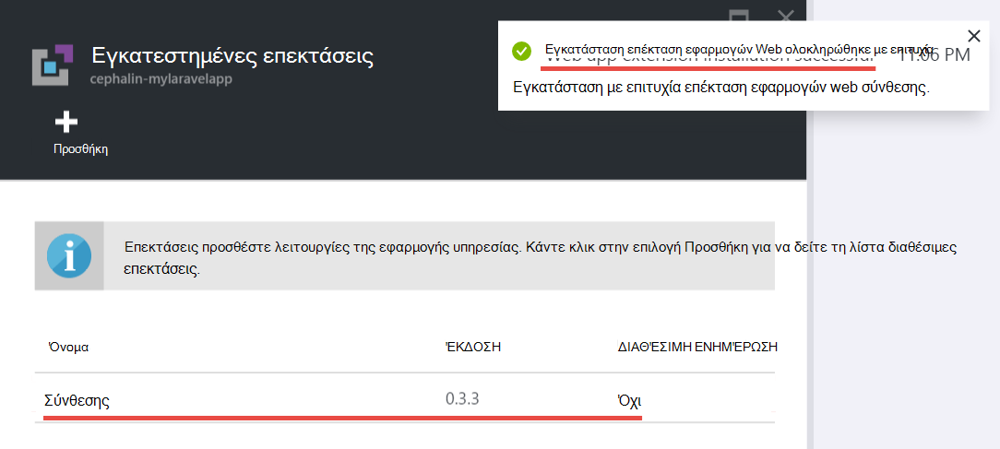

    Ενεργοποίηση σύνθεσης είστε έτοιμοι!
    
4. Πίσω στο blade της εφαρμογής σας web, κάντε κλικ στην επιλογή **Ρυθμίσεις** > **Ρυθμίσεις εφαρμογής**.

    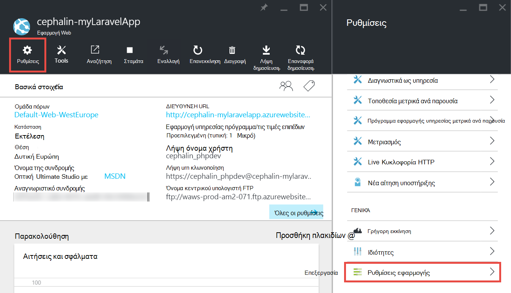

    Στο το blade **Ρυθμίσεις εφαρμογής** , σημειώστε την έκδοση PHP ορίζετε παλαιότερη έκδοση:

    

    και οι ρυθμίσεις εφαρμογής που προσθέσατε:
    
    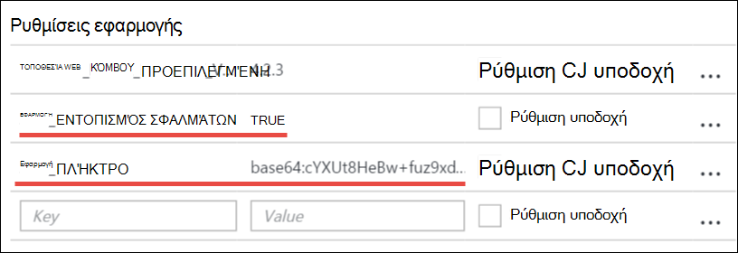

4. Κάντε κύλιση στο κάτω μέρος του blade και αλλάξτε τον ριζικό κατάλογο εικονικού ώστε να οδηγεί στη **site\wwwroot\public** αντί για **site\wwwroot**.

    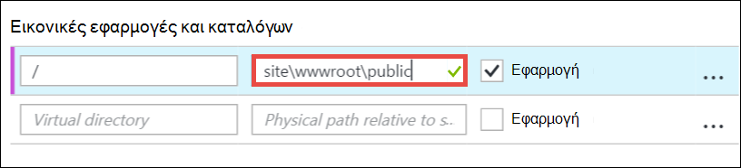

4. Κάντε κλικ στην επιλογή " **Αποθήκευση** " στο επάνω μέρος του blade.

    Ολοκληρώσετε τη ρύθμιση στον εικονικό κατάλογο! 

## Ανάπτυξη του web app με Git (και ρύθμιση μεταβλητές περιβάλλοντος)

Είστε έτοιμοι να αναπτύξετε τον κωδικό τώρα. Θα κάνετε αυτό πίσω στη γραμμή εντολών ή το terminal σας.

4. Ολοκλήρωση όλων των αλλαγών σας και να αναπτύξετε τον κωδικό στην εφαρμογή Azure web, όπως θα κάνατε σε οποιαδήποτε αποθετήριο Git:

        git add .
        git commit -m "Hurray! My first commit for my Azure app!"
        git push azure master 

    Κατά την εκτέλεση `git push`, θα σας ζητηθεί να παρέχετε τον κωδικό πρόσβασής σας Git ανάπτυξης. Εάν σας ζητηθεί να δημιουργήσετε διαπιστευτήρια ανάπτυξης σε που `azure site create` νωρίτερα, πληκτρολογήστε τον κωδικό πρόσβασης που χρησιμοποιήσατε.
    
5. Ας δούμε την εκτέλεση στο πρόγραμμα περιήγησης με την εκτέλεση αυτής της εντολής:

        azure site browse

    Το πρόγραμμα περιήγησης θα πρέπει να εμφανίζουν η οθόνη εκκίνησης Laravel.
    
    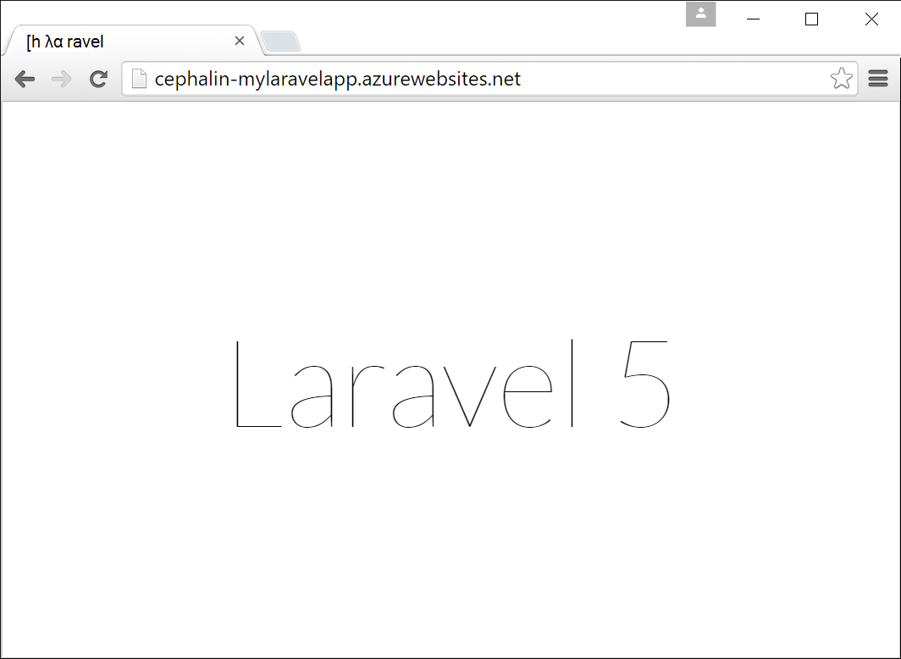
    
    Συγχαρητήρια, τώρα χρησιμοποιείτε μια εφαρμογή web Laravel Azure.
             
## Αντιμετώπιση προβλημάτων κοινών σφαλμάτων

Ακολουθούν ορισμένες τα σφάλματα που μπορεί να αντιμετωπίσετε όταν μετά από αυτό το πρόγραμμα εκμάθησης:

- [Azure CLI εμφανίζει "'τοποθεσίας' δεν είναι μια εντολή azure"](#clierror)
- [Εφαρμογή Web εμφανίζει σφάλμα HTTP 403](#http403)
- [Η εφαρμογή Web δείχνει "Whoops, φαίνεται σαν Παρουσιάστηκε κάποιο πρόβλημα."](#whoops)
- [Η εφαρμογή Web δείχνει "Δεν υποστηρίζονται μονάδα κρυπτογράφησης βρέθηκε."](#encryptor)

### Azure CLI εμφανίζει "'τοποθεσίας' δεν είναι μια εντολή azure"

Κατά την εκτέλεση `azure site *` στο το terminal γραμμής εντολών, μπορείτε να δείτε το σφάλμα`error:   'site' is not an azure command. See 'azure help'.` 

Αυτό συνήθως είναι αποτέλεσμα της αλλαγής στη λειτουργία "ARM" (Διαχείριση πόρων Azure). Για να επιλύσετε αυτό το θέμα, μεταβείτε πίσω στη λειτουργία "ASM" (Διαχείριση υπηρεσίας Azure), εκτελώντας `azure config mode asm`.

### Εφαρμογή Web εμφανίζει σφάλμα HTTP 403

Έχετε αναπτύξει την εφαρμογή web της να Azure με επιτυχία, αλλά όταν κάνετε αναζήτηση σε εφαρμογή Azure web, θα λάβετε ένα `HTTP 403` ή`You do not have permission to view this directory or page.`

Αυτό οφείλεται πιθανότατα, επειδή το web app δεν μπορείτε να βρείτε το σημείο εισόδου στην εφαρμογή Laravel. Βεβαιωθείτε ότι έχετε αλλάξει τον ριζικό κατάλογο εικονικού ώστε να οδηγεί στη `site\wwwroot\public`, όπου του Laravel `index.php` είναι (ανατρέξτε στο θέμα [Ρύθμιση παραμέτρων της εφαρμογής Azure web](#configure)).

### Η εφαρμογή Web δείχνει "Whoops, φαίνεται σαν Παρουσιάστηκε κάποιο πρόβλημα."

Έχετε αναπτύξει την εφαρμογή web της να Azure με επιτυχία, αλλά όταν κάνετε περιήγηση σε εφαρμογή Azure web, λαμβάνετε το μήνυμα δυσνόητο`Whoops, looks like something went wrong.`

Για να λάβετε ένα σφάλμα περισσότερο περιγραφικό, ενεργοποιήσετε Laravel τον εντοπισμό σφαλμάτων με τη ρύθμιση `APP_DEBUG` μεταβλητή περιβάλλοντος για να `true` (ανατρέξτε στο θέμα [Ρύθμιση παραμέτρων της εφαρμογής Azure web](#configure)).

### Η εφαρμογή Web δείχνει "Δεν υποστηρίζονται μονάδα κρυπτογράφησης βρέθηκε."

Έχετε αναπτύξει την εφαρμογή web της να Azure με επιτυχία, αλλά όταν κάνετε αναζήτηση σε εφαρμογή Azure web, θα λάβετε το παρακάτω μήνυμα σφάλματος:

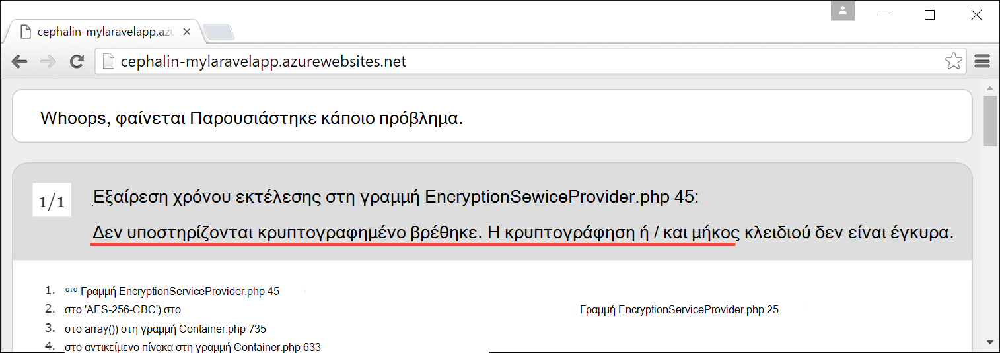
    
Αυτό είναι ένα σφάλμα εκνευριστικά, αλλά τουλάχιστον δεν είναι δυσνόητο εφόσον ενεργοποιημένη Laravel εντοπισμού. Μια αναζήτηση συνοπτικός της συμβολοσειράς σφάλματος στα φόρουμ Laravel θα σας δείξουν ότι αυτό οφείλεται δεν τη ρύθμιση του APP_KEY στο `.env`, ή στην περίπτωσή σας δεν έχει `.env` στο Azure καθόλου. Μπορείτε να διορθώσετε αυτό το πρόβλημα, προσθέτοντας τη ρύθμιση `APP_KEY` ως Azure εφαρμογής ρύθμιση (ανατρέξτε στο θέμα [Ρύθμιση παραμέτρων της εφαρμογής Azure web](#configure)).
    
## Επόμενα βήματα

Μάθετε πώς μπορείτε να προσθέσετε δεδομένα σε εφαρμογή σας, [δημιουργώντας μια βάση δεδομένων MySQL στο Azure](../store-php-create-mysql-database.md). Επίσης, δείτε πιο χρήσιμες συνδέσεις για PHP στο Azure παρακάτω:

- [Κέντρο για προγραμματιστές PHP](/develop/php/).
- [Δημιουργία εφαρμογής web από το Azure Marketplace](app-service-web-create-web-app-from-marketplace.md)
- [Ρύθμιση παραμέτρων PHP στις εφαρμογές Web Azure εφαρμογής υπηρεσίας](web-sites-php-configure.md)
- [Μετατροπή WordPress Multisite στο Azure εφαρμογής υπηρεσίας](web-sites-php-convert-wordpress-multisite.md)
- [WordPress επιχειρηματικής κατηγορίας στην Azure εφαρμογής υπηρεσίας](web-sites-php-enterprise-wordpress.md)
