<properties 
    pageTitle="Χρήση Azure CDN στο Azure εφαρμογής υπηρεσίας" 
    description="Ένα πρόγραμμα εκμάθησης που σας μαθαίνει πώς να αναπτύξετε μια εφαρμογή web σε Azure εφαρμογής υπηρεσίας που χρησιμοποιείται περιεχόμενο από μια ενσωματωμένη τελικού σημείου Azure CDN" 
    services="app-service\web,cdn" 
    documentationCenter=".net" 
    authors="cephalin" 
    manager="wpickett" 
    editor="jimbe"/>

<tags 
    ms.service="app-service" 
    ms.workload="tbd" 
    ms.tgt_pltfrm="na" 
    ms.devlang="dotnet" 
    ms.topic="article" 
    ms.date="07/01/2016" 
    ms.author="cephalin"/>


# <a name="use-azure-cdn-in-azure-app-service"></a>Χρήση Azure CDN στο Azure εφαρμογής υπηρεσίας

[Εφαρμογή υπηρεσίας](http://go.microsoft.com/fwlink/?LinkId=529714) μπορεί να ενσωματωθεί στις [Azure CDN](/services/cdn/), Προσθήκη στις εγγενή στις [Εφαρμογές Web της εφαρμογής υπηρεσίας](http://go.microsoft.com/fwlink/?LinkId=529714) καθολικής κλίμακας δυνατότητες λειτουργώντας περιεχόμενο web app καθολικά από διακομιστή κόμβους κοντά τους πελάτες σας (μπορείτε να βρείτε μια ενημερωμένη λίστα με όλες τις τρέχουσες θέσεις κόμβο [εδώ](http://msdn.microsoft.com/library/azure/gg680302.aspx)). Σε σενάρια όπως σερβίρισμα στατικές εικόνες, αυτή η ενοποίηση μπορεί να αυξήσει σημαντικά τις επιδόσεις της σας Azure εφαρμογής υπηρεσίας Web Apps και σημαντικά βελτιώνει την εμπειρία χρήστη της εφαρμογής σας web σε όλο τον κόσμο. 

Ενοποίηση Web Apps με το Azure CDN σάς παρέχει τα εξής πλεονεκτήματα:

- Ενοποίηση ανάπτυξης περιεχομένου (εικόνων, δεσμών ενεργειών και φύλλα στυλ) ως μέρος της διαδικασίας [συνεχής ανάπτυξη](app-service-continuous-deployment.md) της εφαρμογής σας στο web
- Αναβάθμιση εύκολα τα πακέτα NuGet στην εφαρμογή web στην υπηρεσία εφαρμογής Azure, όπως jQuery ή εκκίνησης εκδόσεις 
- Διαχείριση της εφαρμογής Web και το περιεχόμενό σας CDN εξυπηρέτησης από το ίδιο περιβάλλον εργασίας του Visual Studio
- Ενοποίηση του ASP.NET δέσμης και minification με Azure CDN

[AZURE.INCLUDE [app-service-web-to-api-and-mobile](../../includes/app-service-web-to-api-and-mobile.md)] 

## <a name="what-you-will-build"></a>Τι θα δημιουργήσετε ##

Θα αναπτύξετε μια εφαρμογή web σε Azure εφαρμογής υπηρεσίας, χρησιμοποιώντας το προεπιλεγμένο πρότυπο ASP.NET MVC στο Visual Studio, προσθέστε κώδικα για να εξυπηρετήσει περιεχόμενο από μια ενσωματωμένη CDN Azure, όπως μια εικόνα, ελεγκτή ενέργεια αποτελέσματα, και το προεπιλεγμένο JavaScript και CSS αρχεία, και επίσης σύνταξη κώδικα για τη ρύθμιση παραμέτρων εναλλακτικών μηχανισμό πακέτα που σερβιρίστηκε σε περίπτωση που το CDN είναι εκτός σύνδεσης.

## <a name="what-you-will-need"></a>Τι θα χρειαστείτε ##

Αυτό το πρόγραμμα εκμάθησης περιλαμβάνει τις ακόλουθες προϋποθέσεις:

-   Ενεργό [λογαριασμό Microsoft Azure](/account/)
-   Με το [Azure SDK για .NET](http://go.microsoft.com/fwlink/p/?linkid=323510&clcid=0x409)Visual Studio 2015. Εάν χρησιμοποιείτε το Visual Studio, τα βήματα μπορεί να διαφέρουν.

> [AZURE.NOTE] Χρειάζεστε ένα λογαριασμό Azure για να ολοκληρώσετε αυτό το πρόγραμμα εκμάθησης:
> + Μπορείτε να [ανοίξετε ένα λογαριασμό Azure δωρεάν](/pricing/free-trial/) - λάβετε πιστώσεων μπορείτε να χρησιμοποιήσετε για να δοκιμάσετε την πληρωμή Azure υπηρεσιών και ακόμα και αν χρησιμοποιούνται προς τα επάνω μπορείτε να διατηρήσετε το λογαριασμό και χρήση δωρεάν Azure υπηρεσίες, όπως εφαρμογές Web.
> + Μπορείτε να [ενεργοποιήσετε το Visual Studio συνδρομητών πλεονεκτήματα](/pricing/member-offers/msdn-benefits-details/) - τη συνδρομή σας Visual Studio παρέχει πιστώσεων κάθε μήνα που μπορείτε να χρησιμοποιήσετε για τις υπηρεσίες του Azure επί πληρωμή.
>
> Εάν θέλετε να γρήγορα αποτελέσματα με το Azure εφαρμογής υπηρεσίας πριν από την εγγραφή για λογαριασμό Azure, μεταβείτε στο [Δοκιμάστε εφαρμογής υπηρεσίας](http://go.microsoft.com/fwlink/?LinkId=523751), όπου μπορείτε να αμέσως δημιουργήσετε μια εφαρμογή web μικρής διάρκειας starter στην εφαρμογή υπηρεσίας. Δεν υπάρχει πιστωτικές κάρτες υποχρεωτικό, χωρίς δεσμεύσεις.

## <a name="deploy-a-web-app-to-azure-with-an-integrated-cdn-endpoint"></a>Ανάπτυξη εφαρμογής web για να Azure με ενσωματωμένη τελικού σημείου CDN ##

Σε αυτήν την ενότητα, θα αναπτύξετε το προεπιλεγμένο πρότυπο εφαρμογής ASP.NET MVC στο Visual Studio 2015 σε εφαρμογής υπηρεσίας και, στη συνέχεια, την ενοποίηση με ένα νέο τελικό σημείο CDN. Ακολουθήστε τις παρακάτω οδηγίες:

1. Στο Visual Studio 2015, να δημιουργήσετε μια νέα εφαρμογή web ASP.NET από τη γραμμή μενού μεταβαίνοντας στο **Αρχείο > Δημιουργία > έργο > Web > εφαρμογής Web ASP.NET**. Δώσετε ένα όνομα και κάντε κλικ στο **κουμπί OK**.

    

3. Επιλέξτε **MVC** και κάντε κλικ στο κουμπί **OK**.

    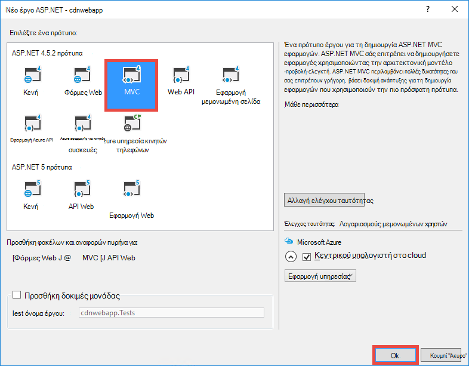

4. Εάν δεν έχετε συνδεθεί στο λογαριασμό σας στο Azure ακόμη, κάντε κλικ στο εικονίδιο λογαριασμού στην επάνω δεξιά γωνία και ακολουθήστε το παράθυρο διαλόγου για να συνδεθείτε στο λογαριασμό σας στο Azure. Όταν είστε έτοιμοι, ρύθμιση παραμέτρων της εφαρμογής σας, όπως φαίνεται παρακάτω και, στη συνέχεια, κάντε κλικ στην επιλογή **Δημιουργία** για να δημιουργήσετε ένα νέο πρόγραμμα εφαρμογής υπηρεσίας για την εφαρμογή σας.  

    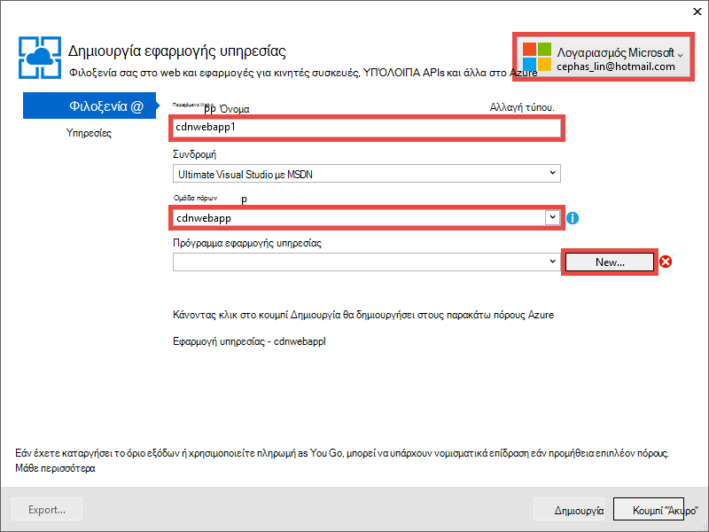

5. Ρύθμιση παραμέτρων σε νέο πρόγραμμα εφαρμογής υπηρεσίας στο παράθυρο διαλόγου, όπως φαίνεται παρακάτω και κάντε κλικ στο **κουμπί OK**. 

    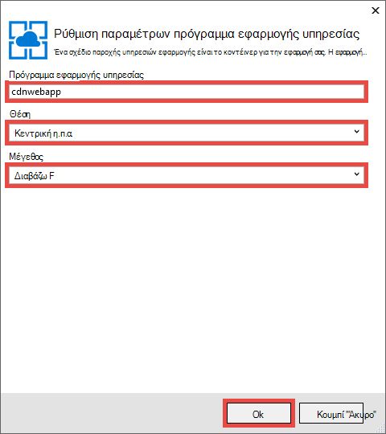

8. Κάντε κλικ στην επιλογή **Δημιουργία** για να δημιουργήσετε την εφαρμογή web.

    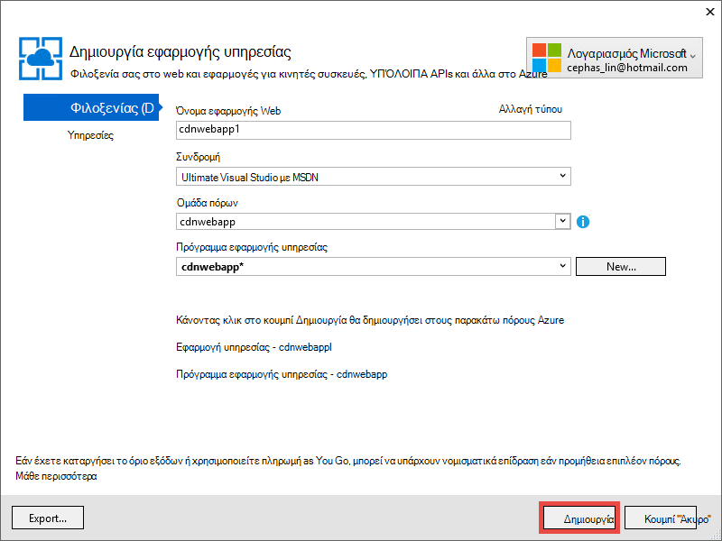

9. Όταν δημιουργηθεί η εφαρμογή ASP.NET, δημοσιεύστε το στο Azure στο παράθυρο Azure εφαρμογής υπηρεσίας δραστηριότητας κάνοντας κλικ στην επιλογή **δημοσίευση `<app name>` τώρα αυτής της εφαρμογής Web**. Κάντε κλικ στην επιλογή **Δημοσίευση** για να ολοκληρώσετε τη διαδικασία.

    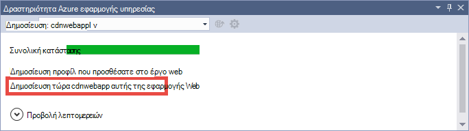

    Όταν ολοκληρωθεί η δημοσίευση, θα δείτε την εφαρμογή web που έχει δημοσιευθεί στο πρόγραμμα περιήγησης. 

1. Για να δημιουργήσετε ένα τελικό σημείο CDN, συνδεθείτε με την [πύλη του Azure](https://portal.azure.com). 
2. Κάντε κλικ στο κουμπί **+ νέο** > **πολυμέσων + CDN** > **CDN**.

    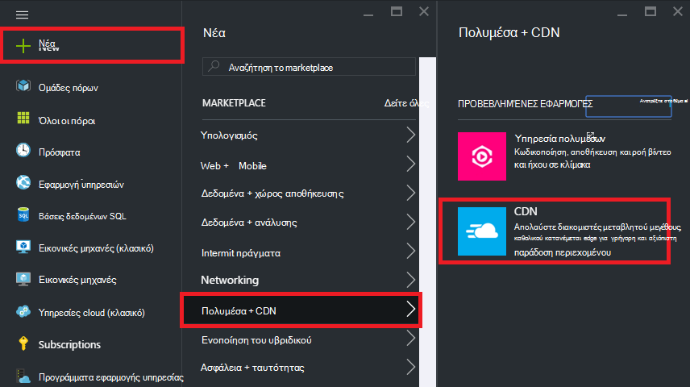

3. Καθορίστε το **CDN**, **θέση**, **ομάδα πόρων**, **Τιμολόγηση επίπεδο**και, στη συνέχεια, κάντε κλικ στην επιλογή **Δημιουργία**

    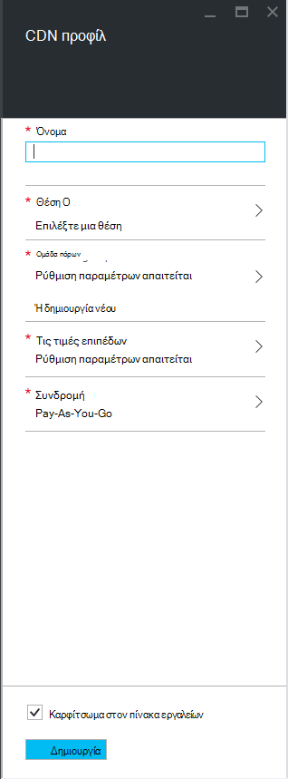   

4. Στο **Προφίλ CDN** blade, κάντε κλικ στο κουμπί **+ τελικού σημείου** . Δώσετε ένα όνομα, επιλέξτε **Web App** από την αναπτυσσόμενη λίστα **Τύπος προέλευσης** και του web app στην αναπτυσσόμενη λίστα **Origin όνομα κεντρικού υπολογιστή** και, στη συνέχεια, κάντε κλικ στην επιλογή **Προσθήκη**.  

    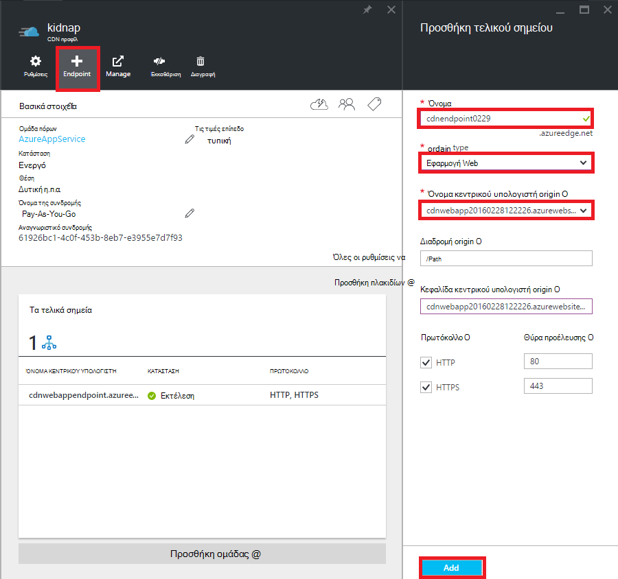


    > [AZURE.NOTE] Αφού δημιουργηθεί το τελικό σημείο CDN, το **τελικό σημείο** blade περιγράφει τη διεύθυνση URL CDN και τον τομέα προέλευσης που είναι ενσωματωμένο με το. Ωστόσο, ενδέχεται να χρειαστεί κάποιος χρόνος για τη ρύθμιση παραμέτρων του ορίου CDN νέα σε πλήρως να μεταδοθούν σε όλες τις θέσεις CDN κόμβο. 

3. Πίσω στο blade το **τελικό σημείο** , κάντε κλικ στο όνομα του τελικού σημείου CDN που μόλις δημιουργήσατε.

    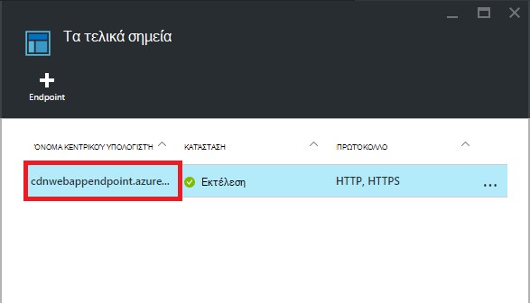

3. Κάντε κλικ στο κουμπί **Ρύθμιση παραμέτρων** . Στο blade τη **Ρύθμιση παραμέτρων** , επιλέξτε **Cache κάθε μοναδική διεύθυνση URL** στη **συμβολοσειρά σε cache συμπεριφορά ερωτήματος** αναπτυσσόμενη λίστα και, στη συνέχεια, κάντε κλικ στο κουμπί **Αποθήκευση** .


    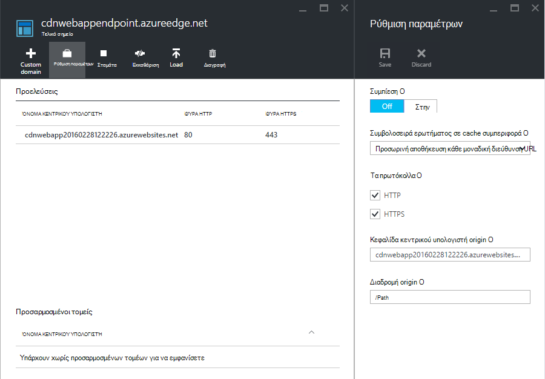

Αφού ενεργοποιήσετε αυτή, θα αποθηκευτούν προσωρινά την ίδια σύνδεση πρόσβαση με διαφορετικές συμβολοσειρές ερωτήματος ως ξεχωριστές καταχωρήσεις.

>[AZURE.NOTE] Κατά την ενεργοποίηση της συμβολοσειράς ερωτήματος δεν είναι απαραίτητο για αυτήν την ενότητα προγραμμάτων εκμάθησης, που θέλετε να το κάνετε αυτό, όπως πρώιμη όσο το δυνατόν για τη διευκόλυνσή σας από οποιαδήποτε αλλαγή εδώ πρόκειται να χρειαστεί χρόνος για μεταδοθούν σε όλους τους κόμβους CDN και δεν θέλετε οποιοδήποτε περιεχόμενο μη ερωτήματος-συμβολοσειρά-με δυνατότητα για να φορτώσει προς τα επάνω το cache CDN (Ενημέρωση περιεχομένου CDN εξετάζονται αργότερα).

2. Τώρα, μεταβείτε στη διεύθυνση τελικού σημείου CDN. Εάν το τελικό σημείο είναι έτοιμη, θα πρέπει να βλέπετε την εφαρμογή web της εμφάνισης. Εάν λάβετε ένα σφάλμα **HTTP 404** , το τελικό σημείο CDN δεν είναι έτοιμη. Ίσως χρειαστεί να περιμένετε προς τα επάνω σε μια ώρα για τη ρύθμιση παραμέτρων CDN για να μεταδοθούν σε όλους τους κόμβους άκρο. 

    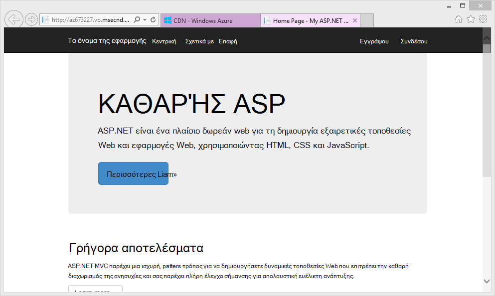

1. Στη συνέχεια, προσπαθήστε να αποκτήσει πρόσβαση στο αρχείο **~/Content/bootstrap.css** στο έργο σας ASP.NET. Στο παράθυρο του προγράμματος περιήγησης, μεταβείτε στις επιλογές * *http://*&lt;cdnName >*.azureedge.net/Content/bootstrap.css**. Στο πρόγραμμα εγκατάστασης μου, αυτή η διεύθυνση URL είναι:

        http://az673227.azureedge.net/Content/bootstrap.css

    Που αντιστοιχεί στην ακόλουθη διεύθυνση URL origin στο το τελικό σημείο CDN:

        http://cdnwebapp.azurewebsites.net/Content/bootstrap.css

    Όταν μεταβαίνετε σε * *http://*&lt;cdnName >*.azureedge.net/Content/bootstrap.css**, θα σας ζητηθεί να κάνετε λήψη του bootstrap.css που παρέχονται από την εφαρμογή web στο Azure. 

    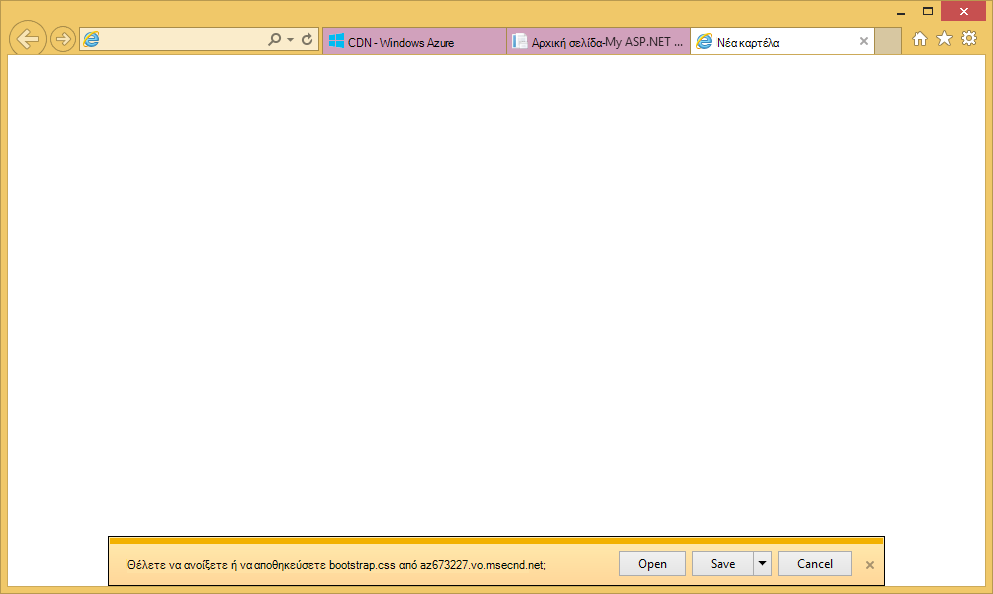

Ομοίως μπορείτε να αποκτήσετε πρόσβαση οποιαδήποτε δυνατότητα δημόσιας πρόσβασης διεύθυνση URL στο * *http://*&lt;όνομα_υπηρεσίας >*.cloudapp.net/**, απευθείας από το τελικό σημείο CDN. Για παράδειγμα:

-   Ένα αρχείο .js από τη διαδρομή/Script
-   Οποιοδήποτε αρχείο περιεχομένου από το /Content διαδρομή
-   Οποιαδήποτε ελεγκτή/ενέργεια 
-   Εάν είναι ενεργοποιημένη η συμβολοσειρά ερωτήματος σε το τελικό σημείο CDN, οποιαδήποτε διεύθυνση URL με συμβολοσειρές ερωτήματος
-   Η εφαρμογή ολόκληρο το Azure web, εάν είναι δημόσια όλο το περιεχόμενο

Σημειώστε ότι μπορεί να μην είναι πάντα καλή ιδέα (ή γενικά μια καλή ιδέα) για να εξυπηρετήσει εφαρμογής ολόκληρο το Azure web μέσω Azure CDN. Ορισμένα από τα προειδοποιήσεις είναι οι εξής:

-   Αυτή η προσέγγιση απαιτεί ολόκληρη την τοποθεσία σας να είναι δημόσια, επειδή Azure CDN δεν μπορεί να χρησιμοποιηθεί οποιαδήποτε ιδιωτικό περιεχόμενο.
-   Αν το τελικό σημείο CDN αποσυνδεθεί για οποιονδήποτε λόγο, εάν προγραμματισμένη συντήρηση ή σφάλμα χρήστη, την εφαρμογή σας ολόκληρο το web αποσυνδεθεί, εκτός εάν οι πελάτες μπορεί να ανακατευθυνθεί στη διεύθυνση URL origin * *http://*&lt;όνομα τοποθεσίας >*.azurewebsites.net/**. 
-   Ακόμα και με τις προσαρμοσμένες ρυθμίσεις Cache-Control (ανατρέξτε στο θέμα [Ρύθμιση παραμέτρων επιλογών προσωρινής αποθήκευσης για στατικά αρχεία στην εφαρμογή Azure web](#configure-caching-options-for-static-files-in-your-azure-web-app)), ένα τελικό σημείο CDN δεν βελτιώνει τις επιδόσεις της ιδιαίτερα δυναμικό περιεχόμενο. Εάν προσπαθήσατε να φορτώσετε την αρχική σελίδα από το τελικό σημείο CDN ως φαίνεται παραπάνω, παρατηρήστε ότι χρειάστηκαν τουλάχιστον 5 δευτερόλεπτα για να φορτώσετε την πρώτη φορά, η οποία είναι αρκετά απλό σελίδας της προεπιλεγμένης αρχικής σελίδας. Φανταστείτε τι θα συμβεί στην εμπειρία του προγράμματος-πελάτη, εάν αυτή η σελίδα περιέχει δυναμικό περιεχόμενο που πρέπει να ενημερώσετε κάθε λεπτό. Εξυπηρετεί δυναμικό περιεχόμενο από ένα τελικό σημείο CDN απαιτεί σύντομο cache λήξη, η οποία μεταφράζεται στο cache συχνές αποτυχίες κατά το τελικό σημείο CDN. Αυτό πονάει τις επιδόσεις της εφαρμογής Azure web και defeats το σκοπό της ένα CDN.

Η εναλλακτική λύση είναι να καθορίσετε ποιο περιεχόμενο θα χρησιμοποιηθεί από το Azure CDN με βάση κατά περίπτωση στην εφαρμογή Azure web. Για το σκοπό που ήδη έχετε δει πώς μπορείτε να αποκτήσετε πρόσβαση σε μεμονωμένα αρχεία περιεχομένου από το τελικό σημείο CDN. Να, θα σας δείξουμε πώς να χρησιμοποιηθεί ένα συγκεκριμένο ελεγκτή ενέργεια έως το τελικό σημείο CDN στο [λειτουργήσει περιεχόμενο από ενέργειες ελεγκτή μέσω Azure CDN](#serve-content-from-controller-actions-through-azure-cdn).

## <a name="configure-caching-options-for-static-files-in-your-azure-web-app"></a>Ρύθμιση παραμέτρων επιλογών σε cache για στατικά αρχεία στην εφαρμογή Azure web ##

Με ενσωμάτωση του Azure CDN στην εφαρμογή Azure web, μπορείτε να καθορίσετε πώς θέλετε να είναι προσωρινά στο το τελικό σημείο CDN στατικό περιεχόμενο. Για να το κάνετε αυτό, ανοίξτε *Web.config* από το έργο σας ASP.NET (π.χ. **cdnwebapp**) και προσθέστε μια `<staticContent>` στοιχείου για `<system.webServer>`. Το παρακάτω XML ρυθμίζει τις παραμέτρους του cache ώστε να λήγει σε 3 ημέρες.  

    <system.webServer>
      <staticContent>
        <clientCache cacheControlMode="UseMaxAge" cacheControlMaxAge="3.00:00:00"/>
      </staticContent>
      ...
    </system.webServer>

Αφού κάνετε αυτό, όλα τα αρχεία στατικό στην εφαρμογή Azure web θα παρατηρήσετε στον ίδιο κανόνα με το cache CDN. Για πιο λεπτομερές έλεγχο του ρυθμίσεις του cache, προσθέστε ένα αρχείο *Web.config* σε ένα φάκελο και εκεί τις ρυθμίσεις σας. Για παράδειγμα, προσθέστε ένα αρχείο *Web.config* στο φάκελο *\Content* και αντικαταστήστε το περιεχόμενο με το παρακάτω δείγμα XML:

    <?xml version="1.0"?>
    <configuration>
      <system.webServer>
        <staticContent>
          <clientCache cacheControlMode="UseMaxAge" cacheControlMaxAge="15.00:00:00"/>
        </staticContent>
      </system.webServer>
    </configuration>

Αυτή η ρύθμιση έχει ως αποτέλεσμα όλα τα στατική αρχεία από το φάκελο *\Content* για να είναι στο cache για 15 ημέρες.

Για περισσότερες πληροφορίες σχετικά με τον τρόπο ρύθμισης των παραμέτρων του `<clientCache>` στοιχείο, ανατρέξτε στο θέμα [Cache του προγράμματος-πελάτη &lt;clientCache >](http://www.iis.net/configreference/system.webserver/staticcontent/clientcache).

Στην επόμενη ενότητα, που θα εμφανιστούν και πώς μπορείτε να ρυθμίσετε ρυθμίσεις του cache για ελεγκτή ενέργεια αποτελέσματα στο CDN cache.

## <a name="serve-content-from-controller-actions-through-azure-cdn"></a>Εξυπηρέτηση περιεχομένου από ενέργειες ελεγκτή μέσω Azure CDN ##

Όταν ενσωματώνετε Web Apps με το Azure CDN, είναι σχετικά εύκολο για να εξυπηρετήσει περιεχόμενο από ενέργειες ελεγκτή έως το CDN Azure. Ξανά, εάν αποφασίσετε να λειτουργήσει της εφαρμογής web ολόκληρο Azure μέσω CDN σας, δεν χρειάζεται να το κάνετε αυτό καθόλου επειδή όλες οι ενέργειες ελεγκτή είναι προσβάσιμος έως το CDN ήδη. Αλλά για τους λόγους που ήδη επισημανθεί στην [ανάπτυξη μιας εφαρμογής Azure web με ενσωματωμένη τελικού σημείου CDN](#deploy-a-web-app-to-azure-with-an-integrated-cdn-endpoint), ενδέχεται να αποφασίσετε σε σχέση με αυτό και να επιλέξετε αντί για αυτό να επιλέξετε την ενέργεια ελεγκτή που θέλετε να χρησιμοποιηθεί από το Azure CDN. [Balliauw Μαρτίνος](https://twitter.com/maartenballiauw) δείχνει πώς μπορείτε να το κάνετε με μια MemeGenerator ελεγκτή [λανθάνων χρόνος μείωση στο web με το CDN Azure](http://channel9.msdn.com/events/TechDays/Techdays-2014-the-Netherlands/Reducing-latency-on-the-web-with-the-Windows-Azure-CDN)διασκεδαστικό. Να θα απλώς αναπαραγάγετε το εδώ.

Ας υποθέσουμε ότι στην εφαρμογή web που θέλετε να δημιουργήσετε memes με βάση μια νέων εικόνα Chuck Norris (φωτογραφία με [Alan Light](http://www.flickr.com/photos/alan-light/218493788/)) ως εξής:


Έχετε μια απλή `Index` ενέργεια που επιτρέπει την στους πελάτες για να καθορίσετε το υπερθετικού στην εικόνα, στη συνέχεια, δημιουργεί το meme αφού δημοσιεύσουν με την ενέργεια. Εφόσον είναι Chuck Norris, που θα περιμένατε αυτήν τη σελίδα για να γίνετε τεράστιες δημοφιλείς καθολικά. Αυτό είναι ένα καλό παράδειγμα εξυπηρετεί ημι-δυναμικό περιεχόμενο με Azure CDN. 

Ακολουθήστε τα παραπάνω βήματα για να ρυθμίσετε αυτή η ενέργεια του ελεγκτή:

1. Στο φάκελο *\Controllers* , δημιουργήστε ένα νέο αρχείο .cs που ονομάζεται *MemeGeneratorController.cs* και να αντικαταστήσετε το περιεχόμενο με τον ακόλουθο κώδικα. Αντικαταστήστε το διαδρομή αρχείου για `~/Content/chuck.bmp` και το όνομα CDN για `yourCDNName`.


        using System;
        using System.Collections.Generic;
        using System.Diagnostics;
        using System.Drawing;
        using System.IO;
        using System.Net;
        using System.Web.Hosting;
        using System.Web.Mvc;
        using System.Web.UI;

        namespace cdnwebapp.Controllers
        {
          public class MemeGeneratorController : Controller
          {
            static readonly Dictionary<string, Tuple<string ,string>> Memes = new Dictionary<string, Tuple<string, string>>();

            public ActionResult Index()
            {
              return View();
            }

            [HttpPost, ActionName("Index")]
            public ActionResult Index_Post(string top, string bottom)
            {
              var identifier = Guid.NewGuid().ToString();
              if (!Memes.ContainsKey(identifier))
              {
                Memes.Add(identifier, new Tuple<string, string>(top, bottom));
              }

              return Content("<a href=\"" + Url.Action("Show", new {id = identifier}) + "\">here's your meme</a>");
            }

            [OutputCache(VaryByParam = "*", Duration = 1, Location = OutputCacheLocation.Downstream)]
            public ActionResult Show(string id)
            {
              Tuple<string, string> data = null;
              if (!Memes.TryGetValue(id, out data))
              {
                return new HttpStatusCodeResult(HttpStatusCode.NotFound);
              }

              if (Debugger.IsAttached) // Preserve the debug experience
              {
                return Redirect(string.Format("/MemeGenerator/Generate?top={0}&bottom={1}", data.Item1, data.Item2));
              }
              else // Get content from Azure CDN
              {
                return Redirect(string.Format("http://<yourCDNName>.azureedge.net/MemeGenerator/Generate?top={0}&bottom={1}", data.Item1, data.Item2));
              }
            }

            [OutputCache(VaryByParam = "*", Duration = 3600, Location = OutputCacheLocation.Downstream)]
            public ActionResult Generate(string top, string bottom)
            {
              string imageFilePath = HostingEnvironment.MapPath("~/Content/chuck.bmp");
              Bitmap bitmap = (Bitmap)Image.FromFile(imageFilePath);

              using (Graphics graphics = Graphics.FromImage(bitmap))
              {
                SizeF size = new SizeF();
                using (Font arialFont = FindBestFitFont(bitmap, graphics, top.ToUpperInvariant(), new Font("Arial Narrow", 100), out size))
                {
                    graphics.DrawString(top.ToUpperInvariant(), arialFont, Brushes.White, new PointF(((bitmap.Width - size.Width) / 2), 10f));
                }
                using (Font arialFont = FindBestFitFont(bitmap, graphics, bottom.ToUpperInvariant(), new Font("Arial Narrow", 100), out size))
                {
                    graphics.DrawString(bottom.ToUpperInvariant(), arialFont, Brushes.White, new PointF(((bitmap.Width - size.Width) / 2), bitmap.Height - 10f - arialFont.Height));
                }
              }
              MemoryStream ms = new MemoryStream();
              bitmap.Save(ms, System.Drawing.Imaging.ImageFormat.Png);
              return File(ms.ToArray(), "image/png");
            }

            private Font FindBestFitFont(Image i, Graphics g, String text, Font font, out SizeF size)
            {
              // Compute actual size, shrink if needed
              while (true)
              {
                size = g.MeasureString(text, font);

                // It fits, back out
                if (size.Height < i.Height &&
                     size.Width < i.Width) { return font; }

                // Try a smaller font (90% of old size)
                Font oldFont = font;
                font = new Font(font.Name, (float)(font.Size * .9), font.Style);
                oldFont.Dispose();
              }
            }
          }
        }

2. Κάντε δεξί κλικ στην προεπιλεγμένη `Index()` ενέργεια και επιλέξτε **Προσθήκη προβολής**.

    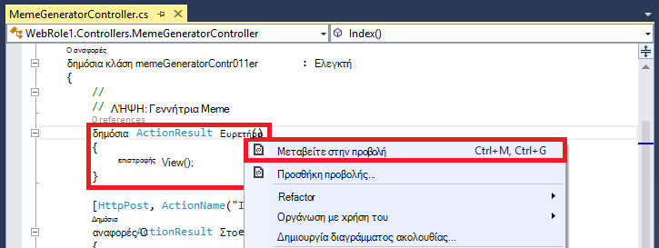

3.  Αποδεχτείτε τις παρακάτω ρυθμίσεις και κάντε κλικ στην επιλογή **Προσθήκη**.

    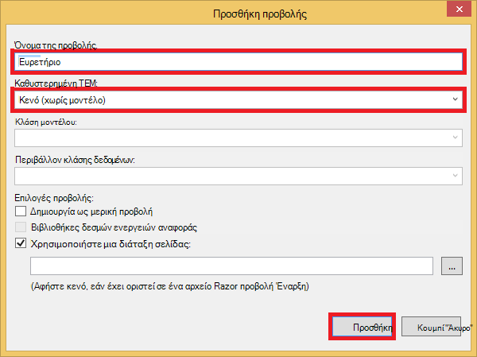

4. Ανοίξτε το νέο *Views\MemeGenerator\Index.cshtml* και αντικαταστήστε το περιεχόμενο με το παρακάτω απλό HTML για την υποβολή του υπερθετικού:

        <h2>Meme Generator</h2>
        
        <form action="" method="post">
            <input type="text" name="top" placeholder="Enter top text here" />
            <br />
            <input type="text" name="bottom" placeholder="Enter bottom text here" />
            <br />
            <input class="btn" type="submit" value="Generate meme" />
        </form>

5. Δημοσιεύστε ξανά στην εφαρμογή Azure web και μεταβείτε στις επιλογές * *http://*&lt;όνομα_υπηρεσίας >*.cloudapp.net/MemeGenerator/Index** στο πρόγραμμα περιήγησης. 

Όταν υποβάλετε τις τιμές της φόρμας για να `/MemeGenerator/Index`, η `Index_Post` ενέργεια μέθοδος επιστρέφει μια σύνδεση προς το `Show` μέθοδο ενέργεια με το αντίστοιχο αναγνωριστικό εισόδου. Όταν κάνετε κλικ στη σύνδεση, να φτάσετε τον ακόλουθο κώδικα:  

    [OutputCache(VaryByParam = "*", Duration = 1, Location = OutputCacheLocation.Downstream)]
    public ActionResult Show(string id)
    {
      Tuple<string, string> data = null;
      if (!Memes.TryGetValue(id, out data))
      {
        return new HttpStatusCodeResult(HttpStatusCode.NotFound);
      }

      if (Debugger.IsAttached) // Preserve the debug experience
      {
        return Redirect(string.Format("/MemeGenerator/Generate?top={0}&bottom={1}", data.Item1, data.Item2));
      }
      else // Get content from Azure CDN
      {
        return Redirect(string.Format("http://<yourCDNName>.azureedge.net/MemeGenerator/Generate?top={0}&bottom={1}", data.Item1, data.Item2));
      }
    }

Εάν το τοπικό πρόγραμμα εντοπισμού σφαλμάτων είναι συνδεδεμένο, θα λάβετε την εμπειρία εντοπισμού σφαλμάτων κανονική με ένα τοπικό redirect. Εάν εκτελείται στο Azure web app, στη συνέχεια, θα ανακατευθύνει σε:

    http://<yourCDNName>.azureedge.net/MemeGenerator/Generate?top=<formInput>&bottom=<formInput>

Που αντιστοιχεί στην ακόλουθη διεύθυνση URL origin σε το τελικό σημείο CDN:

    http://<yourSiteName>.azurewebsites.net/cdn/MemeGenerator/Generate?top=<formInput>&bottom=<formInput>

Μετά τη διεύθυνση URL επανεγγραφή είχαν εφαρμοστεί ο κανόνας, είναι το ίδιο το αρχείο που συμμετέχουν στο cache για το τελικό σημείο CDN:

    http://<yourSiteName>.azurewebsites.net/MemeGenerator/Generate?top=<formInput>&bottom=<formInput>

Μπορείτε να χρησιμοποιήσετε το `OutputCacheAttribute` χαρακτηριστικών σε το `Generate` μέθοδο για να καθορίσετε πώς το αποτέλεσμα ενέργεια θα πρέπει να είναι στο cache, που θα εκτελέσει Azure CDN. Ο παρακάτω κώδικας Καθορίστε μια λήξης cache 1 ώρα (3.600 δευτερόλεπτα).

    [OutputCache(VaryByParam = "*", Duration = 3600, Location = OutputCacheLocation.Downstream)]

Παρομοίως, που μπορεί να χρησιμοποιηθεί το περιεχόμενο από οποιαδήποτε ενέργεια ελεγκτή στην εφαρμογή Azure web μέσω του Azure CDN, με την επιλογή που θέλετε σε cache.

Στην επόμενη ενότητα, που θα σας δείξει πώς για να εξυπηρετήσει τα ομαδοποιημένες και minified δεσμών ενεργειών και CSS μέσω Azure CDN. 

## <a name="integrate-aspnet-bundling-and-minification-with-azure-cdn"></a>Ενοποίηση του ASP.NET δέσμης και minification με Azure CDN ##

Οι δέσμες ενεργειών και CSS φύλλα στυλ δεν αλλάζουν συχνά και είναι δάνεια υποψήφιοι για το cache Azure CDN. Λειτουργία της εφαρμογής ολόκληρο το web μέσω του Azure CDN είναι ο ευκολότερος τρόπος για να ενοποιήσετε δέσμης και minification με Azure CDN. Ωστόσο, καθώς μπορεί να επιλέξετε σε σχέση με αυτήν την προσέγγιση για τους λόγους που περιγράφονται σε [ενσωματώσουν τελικού σημείου Azure CDN με το Azure web app και το σερβίρισμα στατικό περιεχόμενο στις ιστοσελίδες σας από το Azure CDN](#deploy-a-web-app-to-azure-with-an-integrated-cdn-endpoint), που θα σας δείξει πώς να το κάνετε διατηρώντας την επιθυμητή develper εμπειρία της δέσμης ASP.NET και minification, όπως:

-   Εμπειρία σε λειτουργία εξαιρετική εντοπισμού σφαλμάτων
-   Βελτιωμένο ανάπτυξης
-   Άμεση ενημερώσεις για προγράμματα-πελάτες για αναβαθμίσεις έκδοσης δέσμης ενεργειών/CSS
-   Μηχανισμός εναλλακτικών όταν αποτύχει η το τελικό σημείο CDN
-   Ελαχιστοποίηση τροποποίηση κώδικα

Στο έργο ASP.NET που δημιουργήσατε στο [ενσωματώσουν τελικού σημείου Azure CDN με το Azure web app και το σερβίρισμα στατικό περιεχόμενο στις ιστοσελίδες σας από το Azure CDN](#deploy-a-web-app-to-azure-with-an-integrated-cdn-endpoint), ανοίξτε το *App_Start\BundleConfig.cs* και Ρίξτε μια ματιά το `bundles.Add()` κλήσεων της μεθόδου.

    public static void RegisterBundles(BundleCollection bundles)
    {
        bundles.Add(new ScriptBundle("~/bundles/jquery").Include(
                    "~/Scripts/jquery-{version}.js"));
        ...
    }

Την πρώτη `bundles.Add()` δήλωση προσθέτει μια δέσμη ενεργειών στο στον εικονικό κατάλογο `~/bundles/jquery`. Στη συνέχεια, ανοίξτε *Views\Shared\_Layout.cshtml* για να δείτε τον τρόπο απόδοσης την ετικέτα δέσμη ενεργειών. Θα πρέπει να μπορείτε να βρείτε την ακόλουθη γραμμή Razor κώδικα:

    @Scripts.Render("~/bundles/jquery")

Κατά την εκτέλεση αυτόν τον κωδικό Razor στο Azure web app, θα απόδοση ενός `<script>` ετικέτα για το πακέτο δέσμης ενεργειών με την εξής: 

    <script src="/bundles/jquery?v=FVs3ACwOLIVInrAl5sdzR2jrCDmVOWFbZMY6g6Q0ulE1"></script>

Ωστόσο, όταν εκτελείται στο Visual Studio, πληκτρολογώντας `F5`, αυτό θα απόδοση κάθε αρχείο δέσμης ενεργειών στο τη δέσμη μεμονωμένα (στην περίπτωση που παραπάνω, μόνο μία δέσμη ενεργειών αρχείο έχει τη δέσμη):

    <script src="/Scripts/jquery-1.10.2.js"></script>

Αυτό σας επιτρέπει να εντοπισμού σφαλμάτων στον κώδικα JavaScript στο περιβάλλον ανάπτυξής σας ενώ μείωση συνδέσεις ταυτόχρονες προγράμματος-πελάτη (δέσμης) και τη βελτίωση της αρχείο λήψη επιδόσεων (minification) παραγωγής. Είναι μια εξαιρετική δυνατότητα για να διατηρήσετε με ενσωμάτωση του Azure CDN. Επιπλέον, επειδή το πακέτο αποδίδονται περιέχει ήδη μια συμβολοσειρά που δημιουργείται αυτόματα την έκδοση, που θέλετε να αναπαραγάγετε αυτήν τη λειτουργικότητα, έτσι ώστε κάθε φορά που ενημερώνετε την έκδοση jQuery έως NuGet, μπορεί να ενημερωθεί στην πλευρά του προγράμματος-πελάτη όσο το δυνατόν πιο σύντομα.

Ακολουθήστε τα παρακάτω βήματα για να δέσμης ASP.NET ενοποίηση και minification με το τελικό σημείο CDN.

1. Επιστροφή στο *App_Start\BundleConfig.cs*, τροποποιήστε το `bundles.Add()` μεθόδους για να χρησιμοποιήσετε μια διαφορετική [δέσμη κατασκευή](http://msdn.microsoft.com/library/jj646464.aspx), ένα που καθορίζει μια διεύθυνση CDN. Για να το κάνετε αυτό, αντικαταστήστε το `RegisterBundles` μέθοδο ορισμού με τον ακόλουθο κώδικα:  
    
        public static void RegisterBundles(BundleCollection bundles)
        {
          bundles.UseCdn = true;
          var version = System.Reflection.Assembly.GetAssembly(typeof(Controllers.HomeController))
            .GetName().Version.ToString();
          var cdnUrl = "http://<yourCDNName>.azureedge.net/{0}?" + version;

          bundles.Add(new ScriptBundle("~/bundles/jquery", string.Format(cdnUrl, "bundles/jquery")).Include(
                "~/Scripts/jquery-{version}.js"));

          bundles.Add(new ScriptBundle("~/bundles/jqueryval", string.Format(cdnUrl, "bundles/jqueryval")).Include(
                "~/Scripts/jquery.validate*"));

          // Use the development version of Modernizr to develop with and learn from. Then, when you're
          // ready for production, use the build tool at http://modernizr.com to pick only the tests you need.
          bundles.Add(new ScriptBundle("~/bundles/modernizr", string.Format(cdnUrl, "bundles/modernizr")).Include(
                "~/Scripts/modernizr-*"));

          bundles.Add(new ScriptBundle("~/bundles/bootstrap", string.Format(cdnUrl, "bundles/bootstrap")).Include(
                "~/Scripts/bootstrap.js",
                "~/Scripts/respond.js"));

          bundles.Add(new StyleBundle("~/Content/css", string.Format(cdnUrl, "Content/css")).Include(
                "~/Content/bootstrap.css",
                "~/Content/site.css"));
        }


    Φροντίστε να αντικαταστήσετε `<yourCDNName>` με το όνομα του σας CDN Azure.

    Με απλά λόγια, ορίζετε `bundles.UseCdn = true` και προσθέσει μια προσεκτικά γραμμένη διεύθυνση URL CDN για κάθε πακέτο. Για παράδειγμα, η πρώτη κατασκευή στον κώδικα:

        new ScriptBundle("~/bundles/jquery", string.Format(cdnUrl, "bundles/jquery"))

    είναι η ίδια με: 

        new ScriptBundle("~/bundles/jquery", string.Format(cdnUrl, "http://<yourCDNName>.azureedge.net/bundles/jquery?<W.X.Y.Z>"))

    Αυτήν την κατασκευή ενημερώνει δέσμης ASP.NET και minification απόδοση αρχεία μεμονωμένα δέσμης ενεργειών όταν διορθώνεται τοπικά, αλλά χρησιμοποιήστε τη συγκεκριμένη διεύθυνση CDN για να αποκτήσετε πρόσβαση στη δέσμη ενεργειών εν λόγω. Ωστόσο, σημειώστε δύο σημαντικά χαρακτηριστικά με αυτήν τη διεύθυνση URL προσεκτικά γραμμένη CDN:
    
    - Η προέλευση για αυτήν τη διεύθυνση URL CDN είναι `http://<yourSiteName>.azurewebsites.net/bundles/jquery?<W.X.Y.Z>`, που είναι στην πραγματικότητα στον εικονικό κατάλογο της τη δέσμη ενεργειών στην εφαρμογή Web σας.
    - Επειδή χρησιμοποιείτε CDN κατασκευή, την ετικέτα δέσμης ενεργειών CDN για το πακέτο δεν περιέχει πλέον τη συμβολοσειρά που δημιουργείται αυτόματα την έκδοση του αποδίδονται διεύθυνσης URL. Χρειάζεται να δημιουργήσετε μια μοναδική έκδοση συμβολοσειρά με μη αυτόματο τρόπο κάθε φορά που τροποποιείται τη δέσμη ενεργειών για να επιβάλετε μια αποτυχημένων cache στο σας CDN Azure. Την ίδια στιγμή, αυτή η συμβολοσειρά μοναδική έκδοση πρέπει να παραμένει σταθερή έως τη διάρκεια ζωής της ανάπτυξης για να μεγιστοποιήσετε αιτήσεις στο cache στο σας CDN Azure μετά την ανάπτυξη της δέσμης.

3. Η συμβολοσειρά ερωτήματος `<W.X.Y.Z>` συγκεντρώνει από *Properties\AssemblyInfo.cs* στο έργο σας ASP.NET. Μπορείτε να έχετε μια ροή εργασίας ανάπτυξης που περιλαμβάνει τα βηματικής την έκδοση συγκρότησης κάθε φορά που δημοσιεύετε σε Azure. Ή, μπορείτε απλώς να τροποποιήσετε *Properties\AssemblyInfo.cs* στο έργο σας να αυξάνονται αυτόματα τη συμβολοσειρά έκδοσης κάθε φορά που δημιουργείτε, χρήση του χαρακτήρα μπαλαντέρ "*". Για παράδειγμα, να αλλάξετε `AssemblyVersion` όπως φαίνεται παρακάτω:
    
        [assembly: AssemblyVersion("1.0.0.*")]
    
    Τυχόν άλλες στρατηγικής για να βελτιστοποιήσετε δημιουργεί μια μοναδική συμβολοσειρά για τη διάρκεια ζωής μιας ανάπτυξης λειτουργούν εδώ.

3. Δημοσιεύστε ξανά την εφαρμογή ASP.NET και μεταβείτε στην αρχική σελίδα.
 
4. Προβάλετε τον κώδικα HTML για τη σελίδα. Θα πρέπει να μπορείτε να δείτε τη διεύθυνση URL CDN απόδοσης, με μια συμβολοσειρά μοναδικό έκδοσης κάθε φορά που κάνετε αναδημοσίευση αλλαγές σε εφαρμογή Azure web. Για παράδειγμα:  
    
        ...
        <link href="http://az673227.azureedge.net/Content/css?1.0.0.25449" rel="stylesheet"/>
        <script src="http://az673227.azureedge.net/bundles/modernizer?1.0.0.25449"></script>
        ...
        <script src="http://az673227.azureedge.net/bundles/jquery?1.0.0.25449"></script>
        <script src="http://az673227.azureedge.net/bundles/bootstrap?1.0.0.25449"></script>
        ...

5. Στο Visual Studio, σφαλμάτων την εφαρμογή του ASP.NET στο Visual Studio, πληκτρολογώντας `F5`., 

6. Προβάλετε τον κώδικα HTML για τη σελίδα. Εξακολουθείτε να βλέπετε κάθε αρχείο δέσμης ενεργειών μεμονωμένα απόδοσης, έτσι ώστε να μπορείτε να έχετε μια συνεπή εντοπισμού σφαλμάτων εμπειρία στο Visual Studio.  
    
        ...
        <link href="/Content/bootstrap.css" rel="stylesheet"/>
        <link href="/Content/site.css" rel="stylesheet"/>
        <script src="/Scripts/modernizr-2.6.2.js"></script>
        ...
        <script src="/Scripts/jquery-1.10.2.js"></script>
        <script src="/Scripts/bootstrap.js"></script>
        <script src="/Scripts/respond.js"></script>
        ...    

## <a name="fallback-mechanism-for-cdn-urls"></a>Μηχανισμός εναλλακτικών για διευθύνσεις URL CDN ##

Όταν το τελικό σημείο Azure CDN αποτύχει για οποιονδήποτε λόγο, θέλετε την ιστοσελίδα σας να είναι αρκετά Έξυπνες για να αποκτήσετε πρόσβαση σε διακομιστή Web origin ως εναλλακτική επιλογή για τη φόρτωση JavaScript ή εκκίνησης. Είναι αρκετά σοβαρά ώστε να χάσετε εικόνων στην εφαρμογή web της λόγω μη διαθεσιμότητα CDN, αλλά πολύ πιο σημαντική απώλεια λειτουργικότητας κρίσιμης σημασίας σελίδας που παρέχεται από τις δέσμες ενεργειών και φύλλα στυλ.

Η κλάση [πακέτου](http://msdn.microsoft.com/library/system.web.optimization.bundle.aspx) περιέχει μια ιδιότητα που ονομάζεται [CdnFallbackExpression](http://msdn.microsoft.com/library/system.web.optimization.bundle.cdnfallbackexpression.aspx) που σας επιτρέπει να ρυθμίσετε τις παραμέτρους εναλλακτικών μηχανισμό CDN αποτυχία. Για να χρησιμοποιήσετε αυτήν την ιδιότητα, ακολουθήστε τα παρακάτω βήματα:

1. Στο έργο σας ASP.NET, ανοίξτε *App_Start\BundleConfig.cs*, όπου έχετε προσθέσει μια διεύθυνση URL CDN σε κάθε [πακέτο κατασκευή](http://msdn.microsoft.com/library/jj646464.aspx), και προσθέστε `CdnFallbackExpression` κώδικα σε τέσσερα ψηφία, όπως φαίνεται για να προσθέσετε ένα εναλλακτικών μηχανισμό τα πακέτα προεπιλεγμένη.  
    
        public static void RegisterBundles(BundleCollection bundles)
        {
          var version = System.Reflection.Assembly.GetAssembly(typeof(BundleConfig))
            .GetName().Version.ToString();
          var cdnUrl = "http://cdnurl.azureedge.net/.../{0}?" + version;
          bundles.UseCdn = true;

          bundles.Add(new ScriptBundle("~/bundles/jquery", string.Format(cdnUrl, "bundles/jquery")) 
                { CdnFallbackExpression = "window.jquery" }
                .Include("~/Scripts/jquery-{version}.js"));

          bundles.Add(new ScriptBundle("~/bundles/jqueryval", string.Format(cdnUrl, "bundles/jqueryval")) 
                { CdnFallbackExpression = "$.validator" }
                .Include("~/Scripts/jquery.validate*"));

          // Use the development version of Modernizr to develop with and learn from. Then, when you're
          // ready for production, use the build tool at http://modernizr.com to pick only the tests you need.
          bundles.Add(new ScriptBundle("~/bundles/modernizr", string.Format(cdnUrl, "bundles/modernizer")) 
                { CdnFallbackExpression = "window.Modernizr" }
                .Include("~/Scripts/modernizr-*"));

          bundles.Add(new ScriptBundle("~/bundles/bootstrap", string.Format(cdnUrl, "bundles/bootstrap"))     
                { CdnFallbackExpression = "$.fn.modal" }
                .Include(
                        "~/Scripts/bootstrap.js",
                        "~/Scripts/respond.js"));

          bundles.Add(new StyleBundle("~/Content/css", string.Format(cdnUrl, "Content/css")).Include(
                "~/Content/bootstrap.css",
                "~/Content/site.css"));
        }

    Όταν `CdnFallbackExpression` είναι δεν είναι null, δέσμη ενεργειών έχει εισαχθεί στην HTML για να ελέγξετε εάν έχει φορτωθεί με επιτυχία τη δέσμη και, εάν όχι, πρόσβασης τη δέσμη απευθείας από το διακομιστή Web προέλευσης. Αυτή η ιδιότητα πρέπει να οριστούν σε μια παράσταση JavaScript που ελέγχει εάν το αντίστοιχο πακέτο CDN φορτώνεται σωστά. Η παράσταση που χρειάζεται για να ελέγξετε κάθε πακέτου διαφέρει ανάλογα με το περιεχόμενο. Για το παραπάνω προεπιλεγμένες ομάδες:
    
    - `window.jquery`έχει οριστεί στο .js jquery-{έκδοση}
    - `$.validator`έχει οριστεί στο jquery.validate.js
    - `window.Modernizr`έχει οριστεί στο .js modernizer-{έκδοση}
    - `$.fn.modal`έχει οριστεί στο bootstrap.js
    
    Που ίσως έχετε παρατηρήσει ότι που δεν έχει ορίσει CdnFallbackExpression για το `~/Cointent/css` πακέτου. Αυτό συμβαίνει επειδή αυτήν τη στιγμή υπάρχει ένα [σφάλμα σε System.Web.Optimization](https://aspnetoptimization.codeplex.com/workitem/104) που εισάγει μια `<script>` ετικέτα για τα CSS εναλλακτικών αντί για την αναμενόμενη `<link>` ετικέτα.
    
    Ωστόσο, υπάρχει μια καλή [Επιστροφή πακέτου στυλ](https://github.com/EmberConsultingGroup/StyleBundleFallback) που παρέχεται από την [Ομάδα συμβουλευτικές Ember](https://github.com/EmberConsultingGroup). 

2. Για να χρησιμοποιήσετε τη λύση CSS, δημιουργήστε ένα νέο αρχείο .cs στο φάκελο *App_Start* του έργου σας ASP.NET που ονομάζεται *StyleBundleExtensions.cs*και αντικαταστήστε το περιεχόμενο με τον [κωδικό από GitHub](https://github.com/EmberConsultingGroup/StyleBundleFallback/blob/master/Website/App_Start/StyleBundleExtensions.cs). 

4. Στο *App_Start\StyleFundleExtensions.cs*, μετονομάστε το χώρο ονομάτων σε χώρο ονομάτων της εφαρμογής σας ASP.NET (π.χ. **cdnwebapp**). 

3. Επιστρέψτε στο `App_Start\BundleConfig.cs` και να αντικαταστήσετε την τελευταία `bundles.Add` δήλωση με τον ακόλουθο κώδικα:  

        bundles.Add(new StyleBundle("~/Content/css", string.Format(cdnUrl, "Content/css"))
          .IncludeFallback("~/Content/css", "sr-only", "width", "1px")
          .Include(
            "~/Content/bootstrap.css",
            "~/Content/site.css"));

    Αυτή η νέα μέθοδος επέκταση χρησιμοποιεί το ίδιο ιδέα για την εισαγωγή δέσμης ενεργειών στο HTML για να ελέγξετε το DOM για το ένα αντίστοιχο όνομα κλάσης όνομα κανόνα και τιμή κανόνα που ορίζεται στο πακέτο CSS και εμπίπτει στο διακομιστή Web προέλευσης, εάν αποτύχει για να βρείτε τη συμφωνία.

4. Δημοσιεύστε ξανά σε εφαρμογή Azure web και μεταβείτε στην αρχική σελίδα. 
5. Προβάλετε τον κώδικα HTML για τη σελίδα. Πρέπει να βρείτε έχει εισαχθεί δέσμες ενεργειών παρόμοιο με το εξής:    
    
    ```
    ...
    <link href="http://az673227.azureedge.net/Content/css?1.0.0.25474" rel="stylesheet"/>
<script>(function() {
                var loadFallback,
                    len = document.styleSheets.length;
                for (var i = 0; i < len; i++) {
                    var sheet = document.styleSheets[i];
                    if (sheet.href.indexOf('http://az673227.azureedge.net/Content/css?1.0.0.25474') !== -1) {
                        var meta = document.createElement('meta');
                        meta.className = 'sr-only';
                        document.head.appendChild(meta);
                        var value = window.getComputedStyle(meta).getPropertyValue('width');
                        document.head.removeChild(meta);
                        if (value !== '1px') {
                            document.write('<link href="/Content/css" rel="stylesheet" type="text/css" />');
                        }
                    }
                }
                return true;
            }())||document.write('<script src="/Content/css"><\/script>');</script>

    <script src="http://az673227.azureedge.net/bundles/modernizer?1.0.0.25474"></script>
    <script>(window.Modernizr)||document.write('<script src="/bundles/modernizr"><\/script>');</script>
    ... 
    <script src="http://az673227.azureedge.net/bundles/jquery?1.0.0.25474"></script>
    <script>(window.jquery)||document.write('<script src="/bundles/jquery"><\/script>');</script>

    <script src="http://az673227.azureedge.net/bundles/bootstrap?1.0.0.25474"></script>
    <script>($.fn.modal)||document.write('<script src="/bundles/bootstrap"><\/script>');</script>
    ...
    ```

    Σημειώστε ότι έχει εισαχθεί δέσμη ενεργειών για τη δέσμη CSS περιέχει ακόμη το errant υπόλειμμα από το `CdnFallbackExpression` ιδιότητα στη γραμμή:

        }())||document.write('<script src="/Content/css"><\/script>');</script>

    Αλλά από το πρώτο τμήμα του το || παράσταση θα επιστρέφει πάντα true (στη γραμμή ακριβώς επάνω από που), η συνάρτηση document.write() θα εκτελεστεί ποτέ.

6. Για να ελέγξετε αν λειτουργεί η εναλλακτικών δέσμη ενεργειών, να επιστρέψετε το blade σας CDN τελικό σημείο και κάντε κλικ στην επιλογή **Διακοπή**.

    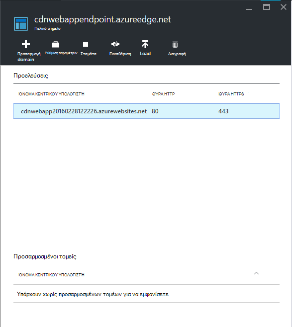

7. Ανανεώστε το παράθυρο του προγράμματος περιήγησης για την εφαρμογή Azure web. Τώρα, θα πρέπει να βλέπετε ότι το όλες οι δέσμες ενεργειών και φύλλα στυλ έχουν φορτωθεί σωστά.

## <a name="more-information"></a>Περισσότερες πληροφορίες 
- [Επισκόπηση του δικτύου Azure παροχής περιεχομένου (CDN)](../cdn/cdn-overview.md)
- [Χρήση του Azure CDN](../cdn/cdn-create-new-endpoint.md)
- [Ενοποίηση μια υπηρεσία cloud με Azure CDN](../cdn/cdn-cloud-service-with-cdn.md)
- [Δέσμης ASP.NET και Minification](http://www.asp.net/mvc/tutorials/mvc-4/bundling-and-minification)

