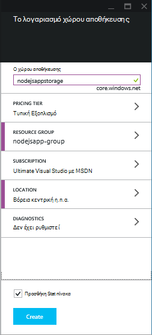
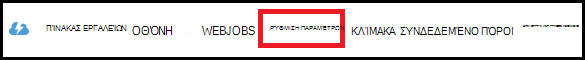
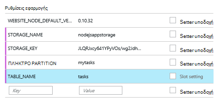

<properties
    pageTitle="Node.js εφαρμογής web με την υπηρεσία πίνακα Azure"
    description="Αυτό το πρόγραμμα εκμάθησης σας μαθαίνει πώς να χρησιμοποιείτε την υπηρεσία Azure πίνακα για την αποθήκευση δεδομένων από μια εφαρμογή Node.js το οποίο βρίσκεται στο Azure εφαρμογής υπηρεσίας Web Apps."
    tags="azure-portal"
    services="app-service\web, storage"
    documentationCenter="nodejs"
    authors="rmcmurray"
    manager="wpickett"
    editor=""/>

<tags
    ms.service="storage"
    ms.workload="storage"
    ms.tgt_pltfrm="na"
    ms.devlang="nodejs"
    ms.topic="article"
    ms.date="08/11/2016"
    ms.author="robmcm"/>

# Node.js εφαρμογής web με την υπηρεσία πίνακα Azure

## Επισκόπηση

Αυτό το πρόγραμμα εκμάθησης δείχνει πώς μπορείτε να χρησιμοποιήσετε την υπηρεσία πίνακα που παρέχεται από τη διαχείριση δεδομένων Azure για την αποθήκευση και την πρόσβαση σε δεδομένα από μια εφαρμογή [κόμβο] σε [Azure εφαρμογής υπηρεσίας](http://go.microsoft.com/fwlink/?LinkId=529714) Web Apps. Αυτό το πρόγραμμα εκμάθησης προϋποθέτει ότι έχετε κάποια εμπειρία εκ των προτέρων με χρήση του κόμβου και [Git].

Θα μάθετε:

* Πώς μπορείτε να χρησιμοποιήσετε npm (Διαχείριση πακέτου κόμβο) για να εγκαταστήσετε τις λειτουργικές μονάδες κόμβου

* Πώς μπορείτε να εργαστείτε με την υπηρεσία πίνακα Azure

* Μάθετε πώς μπορείτε να χρησιμοποιήσετε το CLI Azure για να δημιουργήσετε μια εφαρμογή web.

Ακολουθώντας αυτό το πρόγραμμα εκμάθησης, θα μπορείτε να δημιουργήσετε μια απλή που βασίζεται στο web "λίστα εκκρεμών εργασιών" εφαρμογή που σας επιτρέπει τη δημιουργία, την ανάκτηση και την ολοκλήρωση των εργασιών. Οι εργασίες είναι αποθηκευμένα στην υπηρεσία πίνακα.

Εδώ είναι οι δυνατότητες της εφαρμογής:

![Μια ιστοσελίδα που εμφανίζει μια κενή tasklist][node-table-finished]

>[AZURE.NOTE] Εάν θέλετε να γρήγορα αποτελέσματα με το Azure εφαρμογής υπηρεσίας πριν από την εγγραφή για λογαριασμό Azure, μεταβείτε στο [Δοκιμάστε εφαρμογής υπηρεσίας](http://go.microsoft.com/fwlink/?LinkId=523751), όπου μπορείτε να αμέσως δημιουργήσετε μια εφαρμογή web μικρής διάρκειας starter στην εφαρμογή υπηρεσίας. Δεν υπάρχει πιστωτικές κάρτες υποχρεωτικό, χωρίς δεσμεύσεις.

## Προαπαιτούμενα στοιχεία

Πριν να ακολουθήσετε τις οδηγίες σε αυτό το άρθρο, βεβαιωθείτε ότι έχετε εγκαταστήσει τα εξής:

* [κόμβος] έκδοση 0.10.24 ή νεότερη έκδοση

* [Git]

[AZURE.INCLUDE [create-account-and-websites-note](../../includes/create-account-and-websites-note.md)]

## Δημιουργία λογαριασμού χώρου αποθήκευσης

Δημιουργήστε ένα λογαριασμό Azure χώρου αποθήκευσης. Η εφαρμογή θα χρησιμοποιήσει αυτόν το λογαριασμό για να αποθηκεύσετε τα εκκρεμή στοιχεία.

1.  Σύνδεση στο [Azure πύλη](https://portal.azure.com/).

2. Κάντε κλικ στο εικονίδιο **Δημιουργία** στην κάτω αριστερή πλευρά της πύλης και, στη συνέχεια, κάντε κλικ στην επιλογή **δεδομένα + χώρος αποθήκευσης** > **χώρου αποθήκευσης**. Δώστε ένα μοναδικό όνομα στο λογαριασμό του χώρου αποθήκευσης και δημιουργήστε μια νέα [ομάδα πόρων](../azure-resource-manager/resource-group-overview.md) .

    

    Αφού δημιουργηθεί το λογαριασμό χώρου αποθήκευσης, το κουμπί " **ειδοποιήσεις** " θα flash πράσινο **ΕΠΙΤΥΧΊΑΣ** και blade του λογαριασμού του χώρου αποθήκευσης είναι ανοιχτό για την εμφάνιση που ανήκει η νέα ομάδα πόρων που δημιουργήσατε.

5. Στο blade του λογαριασμού του χώρου αποθήκευσης, κάντε κλικ στην επιλογή **Ρυθμίσεις** > **πλήκτρα**. Αντιγράψτε τον αριθμό-κλειδί πρωτεύοντος πρόσβαση στο Πρόχειρο.

    ![Πλήκτρο πρόσβασης][portal-storage-access-keys]

##Εγκατάσταση λειτουργικές μονάδες και δημιουργία ικριώματος

Σε αυτήν την ενότητα θα δημιουργήσετε μια νέα εφαρμογή κόμβο και χρήση npm για την προσθήκη πακέτων λειτουργική μονάδα. Για αυτήν την εφαρμογή που θα χρησιμοποιήσει τις [Express] και [Azure] λειτουργικές μονάδες. Η λειτουργική μονάδα Express παρέχει ένα πλαίσιο ελεγκτή προβολή μοντέλου για κόμβο, ενώ το Azure λειτουργικές μονάδες παρέχει τη δυνατότητα σύνδεσης με την υπηρεσία πίνακα.

### Εγκατάσταση express και δημιουργία ικριώματος

1. Από τη γραμμή εντολών, δημιουργήστε έναν νέο κατάλογο που ονομάζεται **tasklist** και μετάβαση σε αυτόν τον κατάλογο.  

2. Πληκτρολογήστε την παρακάτω εντολή για να εγκαταστήσετε τη λειτουργική μονάδα Express.

        npm install express-generator@4.2.0 -g

    Ανάλογα με το λειτουργικό σύστημα, ίσως χρειαστεί να τοποθετήσετε 'sudo' πριν από την εντολή:

        sudo npm install express-generator@4.2.0 -g

    Το αποτέλεσμα μοιάζει με το ακόλουθο παράδειγμα:

        express-generator@4.2.0 /usr/local/lib/node_modules/express-generator
        ├── mkdirp@0.3.5
        └── commander@1.3.2 (keypress@0.1.0)

    > [AZURE.NOTE] Η '-g' παραμέτρου εγκαθιστά καθολικά τη λειτουργική μονάδα. Με αυτόν τον τρόπο, μπορούμε να χρησιμοποιήσουμε **express** για τη δημιουργία ικριώματος εφαρμογής web χωρίς να χρειάζεται να πληκτρολογήσετε διαδρομή πρόσθετες πληροφορίες.

4. Για να δημιουργήσετε το ικρίωμα για την εφαρμογή, πληκτρολογήστε την εντολή **express** :

        express

    Το αποτέλεσμα αυτής της εντολής μοιάζει με το ακόλουθο παράδειγμα:

           create : .
           create : ./package.json
           create : ./app.js
           create : ./public
           create : ./public/images
           create : ./routes
           create : ./routes/index.js
           create : ./routes/users.js
           create : ./public/stylesheets
           create : ./public/stylesheets/style.css
           create : ./views
           create : ./views/index.jade
           create : ./views/layout.jade
           create : ./views/error.jade
           create : ./public/javascripts
           create : ./bin
           create : ./bin/www

           install dependencies:
             $ cd . && npm install

           run the app:
             $ DEBUG=my-application ./bin/www

    Τώρα έχετε αρκετές νέες σε καταλόγους και τα αρχεία στον κατάλογο **tasklist** .

### Εγκατάσταση πρόσθετες λειτουργικές μονάδες

Ένα από τα αρχεία που **express** δημιουργεί είναι **package.json**. Αυτό το αρχείο περιέχει μια λίστα με τις εξαρτήσεις λειτουργική μονάδα. Αργότερα, κατά την ανάπτυξη της εφαρμογής σε εφαρμογές Web της εφαρμογής υπηρεσίας, αυτό το αρχείο Καθορίζει ποιες λειτουργικές μονάδες πρέπει να έχουν εγκατασταθεί στο Azure.

Από τη γραμμή εντολών, πληκτρολογήστε την παρακάτω εντολή για να εγκαταστήσετε τις ενότητες που περιγράφονται στο αρχείο **package.json** . Ίσως χρειαστεί να χρησιμοποιήσετε 'sudo'.

    npm install

Το αποτέλεσμα αυτής της εντολής μοιάζει με το ακόλουθο παράδειγμα:

    debug@0.7.4 node_modules\debug

    cookie-parser@1.0.1 node_modules\cookie-parser
    ├── cookie-signature@1.0.3
    └── cookie@0.1.0

    [...]

Στη συνέχεια, πληκτρολογήστε την παρακάτω εντολή για να εγκαταστήσετε το [azure], [κόμβο uuid], [nconf] και [ασύγχρονης] λειτουργικές μονάδες:

    npm install azure-storage node-uuid async nconf --save

Το **--Αποθήκευση** σημαία Προσθέτει καταχωρήσεις για αυτές τις λειτουργικές μονάδες στο αρχείο **package.json** .

Το αποτέλεσμα αυτής της εντολής μοιάζει με το ακόλουθο παράδειγμα:

    async@0.9.0 node_modules\async

    node-uuid@1.4.1 node_modules\node-uuid

    nconf@0.6.9 node_modules\nconf
    ├── ini@1.2.1
    ├── async@0.2.9
    └── optimist@0.6.0 (wordwrap@0.0.2, minimist@0.0.10)

    [...]

## Δημιουργία της εφαρμογής

Τώρα είστε έτοιμοι να δημιουργήσετε την εφαρμογή.

### Δημιουργήστε ένα μοντέλο

Ένα *μοντέλο* είναι ένα αντικείμενο το οποίο αντιπροσωπεύει τα δεδομένα στην εφαρμογή σας. Για την εφαρμογή, το μοντέλο μόνο είναι ένα αντικείμενο εργασίας, το οποίο αντιπροσωπεύει ένα στοιχείο στη λίστα εκκρεμών εργασιών. Εργασίες θα έχουν τα ακόλουθα πεδία:

- PartitionKey
- RowKey
- όνομα (συμβολοσειρά)
- κατηγορία (συμβολοσειρά)
- Ολοκληρωμένη (Boolean)

**PartitionKey** και **RowKey** χρησιμοποιούνται από την υπηρεσία πίνακα ως πίνακα κλειδιά. Για περισσότερες πληροφορίες, ανατρέξτε στο θέμα [Κατανόηση του μοντέλου δεδομένων υπηρεσίας πίνακα](https://msdn.microsoft.com/library/azure/dd179338.aspx).

1. Στον κατάλογο **tasklist** , δημιουργήστε έναν νέο κατάλογο που ονομάζεται **μοντέλα**.

2. Στον κατάλογο **μοντέλα** , δημιουργήστε ένα νέο αρχείο με το όνομα **task.js**. Αυτό το αρχείο θα περιέχει το μοντέλο για τις εργασίες που δημιουργήθηκε από την εφαρμογή σας.

3. Στην αρχή του αρχείου **task.js** , προσθέστε τον ακόλουθο κώδικα για αναφορά απαιτούμενες βιβλιοθήκες:

        var azure = require('azure-storage');
        var uuid = require('node-uuid');
        var entityGen = azure.TableUtilities.entityGenerator;

4. Προσθέστε τον ακόλουθο κώδικα για να ορίσετε και να εξαγάγετε το αντικείμενο εργασίας. Αυτό το αντικείμενο είναι υπεύθυνη για τη σύνδεση με τον πίνακα.

        module.exports = Task;

        function Task(storageClient, tableName, partitionKey) {
          this.storageClient = storageClient;
          this.tableName = tableName;
          this.partitionKey = partitionKey;
          this.storageClient.createTableIfNotExists(tableName, function tableCreated(error) {
            if(error) {
              throw error;
            }
          });
        };

5. Προσθέστε τον ακόλουθο κώδικα για να ορίσετε πρόσθετες μεθόδους στο αντικείμενο εργασίας, που επιτρέπουν αλληλεπιδράσεις με δεδομένα που είναι αποθηκευμένα στον πίνακα:

        Task.prototype = {
          find: function(query, callback) {
            self = this;
            self.storageClient.queryEntities(this.tableName, query, null, function entitiesQueried(error, result) {
              if(error) {
                callback(error);
              } else {
                callback(null, result.entries);
              }
            });
          },

          addItem: function(item, callback) {
            self = this;
            // use entityGenerator to set types
            // NOTE: RowKey must be a string type, even though
            // it contains a GUID in this example.
            var itemDescriptor = {
              PartitionKey: entityGen.String(self.partitionKey),
              RowKey: entityGen.String(uuid()),
              name: entityGen.String(item.name),
              category: entityGen.String(item.category),
              completed: entityGen.Boolean(false)
            };
            self.storageClient.insertEntity(self.tableName, itemDescriptor, function entityInserted(error) {
              if(error){  
                callback(error);
              }
              callback(null);
            });
          },

          updateItem: function(rKey, callback) {
            self = this;
            self.storageClient.retrieveEntity(self.tableName, self.partitionKey, rKey, function entityQueried(error, entity) {
              if(error) {
                callback(error);
              }
              entity.completed._ = true;
              self.storageClient.updateEntity(self.tableName, entity, function entityUpdated(error) {
                if(error) {
                  callback(error);
                }
                callback(null);
              });
            });
          }
        }

6. Αποθηκεύστε και κλείστε το αρχείο **task.js** .

### Δημιουργία ενός ελεγκτή

Έναν *ελεγκτή* χειρίζεται τις αιτήσεις HTTP και αποδίδει την απάντηση HTML.

1. Στον κατάλογο **tasklist/διαδρομές** , δημιουργήστε ένα νέο αρχείο με το όνομα **tasklist.js** και ανοίξτε το σε ένα πρόγραμμα επεξεργασίας κειμένου.

2. Προσθέστε τον παρακάτω κώδικα **tasklist.js**. Αυτό φορτώνει το azure και ασύγχρονης λειτουργικές μονάδες, που χρησιμοποιούνται από **tasklist.js**. Αυτό ορίζει, επίσης, η συνάρτηση **TaskList** , η οποία μεταβιβάζεται μια παρουσία του αντικειμένου **εργασίας** ορίσαμε παλαιότερη έκδοση:

        var azure = require('azure-storage');
        var async = require('async');

        module.exports = TaskList;

3. Ορισμός ενός αντικειμένου **TaskList** .

        function TaskList(task) {
          this.task = task;
        }

4. Προσθέστε τις ακόλουθες μεθόδους **TaskList**:

        TaskList.prototype = {
          showTasks: function(req, res) {
            self = this;
            var query = new azure.TableQuery()
              .where('completed eq ?', false);
            self.task.find(query, function itemsFound(error, items) {
              res.render('index',{title: 'My ToDo List ', tasks: items});
            });
          },

          addTask: function(req,res) {
            var self = this;
            var item = req.body.item;
            self.task.addItem(item, function itemAdded(error) {
              if(error) {
                throw error;
              }
              res.redirect('/');
            });
          },

          completeTask: function(req,res) {
            var self = this;
            var completedTasks = Object.keys(req.body);
            async.forEach(completedTasks, function taskIterator(completedTask, callback) {
              self.task.updateItem(completedTask, function itemsUpdated(error) {
                if(error){
                  callback(error);
                } else {
                  callback(null);
                }
              });
            }, function goHome(error){
              if(error) {
                throw error;
              } else {
               res.redirect('/');
              }
            });
          }
        }

### Τροποποίηση app.js

1. Από τον κατάλογο **tasklist** , ανοίξτε το αρχείο **app.js** . Αυτό το αρχείο δημιουργήθηκε νωρίτερα, εκτελέστε την εντολή **express** .

2. Στην αρχή του αρχείου, προσθέστε τα εξής για να φορτώσει τη λειτουργική μονάδα azure, να ορίσετε το όνομα του πίνακα, διαμερίσματα αριθμό-κλειδί, και να ορίσει τα διαπιστευτήρια του χώρου αποθήκευσης που χρησιμοποιείται από αυτό το παράδειγμα:

        var azure = require('azure-storage');
        var nconf = require('nconf');
        nconf.env()
             .file({ file: 'config.json', search: true });
        var tableName = nconf.get("TABLE_NAME");
        var partitionKey = nconf.get("PARTITION_KEY");
        var accountName = nconf.get("STORAGE_NAME");
        var accountKey = nconf.get("STORAGE_KEY");

    > [AZURE.NOTE] nconf θα φορτώσετε τις τιμές παραμέτρων από μεταβλητές περιβάλλοντος ή το αρχείο **config.json** , το οποίο θα δημιουργήσουμε αργότερα.

3. Στο αρχείο app.js, μεταβείτε με κύλιση προς τα κάτω, όπου μπορείτε να δείτε την ακόλουθη γραμμή:

        app.use('/', routes);
        app.use('/users', users);

    Αντικαταστήστε τις παραπάνω γραμμές με τον κώδικα που φαίνεται παρακάτω. Αυτό θα προετοιμασία της παρουσίας της <strong>εργασίας</strong> με μια σύνδεση με το λογαριασμό χώρου αποθήκευσης. Αυτό που του μεταβιβάστηκε η <strong>TaskList</strong>, που θα χρησιμοποιήσετε για να επικοινωνήσετε με την υπηρεσία πίνακα:

        var TaskList = require('./routes/tasklist');
        var Task = require('./models/task');
        var task = new Task(azure.createTableService(accountName, accountKey), tableName, partitionKey);
        var taskList = new TaskList(task);

        app.get('/', taskList.showTasks.bind(taskList));
        app.post('/addtask', taskList.addTask.bind(taskList));
        app.post('/completetask', taskList.completeTask.bind(taskList));

4. Αποθηκεύστε το αρχείο **app.js** .

### Τροποποίηση της προβολής ευρετηρίου

1. Ανοίξτε το αρχείο **tasklist/views/index.jade** σε έναν επεξεργαστή κειμένου.

2. Αντικαταστήστε όλα τα περιεχόμενα του αρχείου με τον ακόλουθο κώδικα. Αυτό ορίζει μια προβολή που εμφανίζει υπάρχουσες εργασίες και περιλαμβάνει μια φόρμα για την προσθήκη νέων εργασιών και τη σήμανση υπάρχουσες ως ολοκληρωμένη.

        extends layout

        block content
          h1= title
          br

          form(action="/completetask", method="post")
            table.table.table-striped.table-bordered
              tr
                td Name
                td Category
                td Date
                td Complete
              if (typeof tasks === "undefined")
                tr
                  td
              else
                each task in tasks
                  tr
                    td #{task.name._}
                    td #{task.category._}
                    - var day   = task.Timestamp._.getDate();
                    - var month = task.Timestamp._.getMonth() + 1;
                    - var year  = task.Timestamp._.getFullYear();
                    td #{month + "/" + day + "/" + year}
                    td
                      input(type="checkbox", name="#{task.RowKey._}", value="#{!task.completed._}", checked=task.completed._)
            button.btn(type="submit") Update tasks
          hr
          form.well(action="/addtask", method="post")
            label Item Name:
            input(name="item[name]", type="textbox")
            label Item Category:
            input(name="item[category]", type="textbox")
            br
            button.btn(type="submit") Add item

3. Αποθηκεύστε και κλείστε το αρχείο **index.jade** .

### Τροποποιήστε τη διάταξη καθολικού

Το αρχείο **layout.jade** στον κατάλογο **προβολές** είναι ένα καθολικό πρότυπο για άλλα αρχεία **.jade** . Σε αυτό το βήμα θα τροποποιήσετε ώστε να χρησιμοποιεί [Εκκίνησης του Twitter](https://github.com/twbs/bootstrap), που είναι ένα κιτ εργαλείων που σας διευκολύνει να σχεδιάσετε μια εφαρμογή web ωραία εμφάνιση.

Κάντε λήψη και να εξαγάγετε τα αρχεία για [Εκκίνηση του Twitter](http://getbootstrap.com/). Αντιγράψτε το αρχείο **bootstrap.min.css** από το φάκελο εκκίνησης **css** στον κατάλογο **δημόσια/φύλλα στυλ** της εφαρμογής σας.

Από το φάκελο **προβολές** , ανοίξτε **layout.jade** και αντικαταστήστε όλα τα περιεχόμενα με τα εξής:

    doctype html
    html
      head
        title= title
        link(rel='stylesheet', href='/stylesheets/bootstrap.min.css')
        link(rel='stylesheet', href='/stylesheets/style.css')
      body.app
        nav.navbar.navbar-default
          div.navbar-header
          a.navbar-brand(href='/') My Tasks
        block content

### Δημιουργήστε ένα αρχείο ρύθμισης παραμέτρων

Για να εκτελέσετε την εφαρμογή τοπικά, θα θέτει Azure χώρο αποθήκευσης διαπιστευτηρίων σε ένα αρχείο ρύθμισης παραμέτρων. Δημιουργήστε ένα αρχείο με το όνομα * *config.json* *με την εξής JSON:

    {
        "STORAGE_NAME": "<storage account name>",
        "STORAGE_KEY": "<storage access key>",
        "PARTITION_KEY": "mytasks",
        "TABLE_NAME": "tasks"
    }

Αντικαταστήστε **όνομα λογαριασμού χώρου αποθήκευσης** με το όνομα του λογαριασμού χώρου αποθήκευσης που δημιουργήσατε νωρίτερα, και **πλήκτρο πρόσβασης χώρου αποθήκευσης** με το πλήκτρο πρωτεύοντος πρόσβασης για το λογαριασμό χώρου αποθήκευσης. Για παράδειγμα:

    {
        "STORAGE_NAME": "nodejsappstorage",
        "STORAGE_KEY": "KG0oDd..."
        "PARTITION_KEY": "mytasks",
        "TABLE_NAME": "tasks"
    }

Αποθηκεύσετε αυτό το αρχείο *ένα επίπεδο καταλόγου υψηλότερα* από τον κατάλογο **tasklist** , ως εξής:

    parent/
      |-- config.json
      |-- tasklist/

Ο λόγος για αυτήν τη διαδικασία είναι για να αποφύγετε τον έλεγχο του αρχείου ρύθμισης παραμέτρων σε στοιχείο ελέγχου προέλευσης, όπου μπορεί να γίνει δημόσια. Όταν θα σας ανάπτυξη της εφαρμογής για να Azure, θα χρησιμοποιήσουμε μεταβλητές περιβάλλοντος αντί για ένα αρχείο ρύθμισης παραμέτρων.

## Εκτελέστε την εφαρμογή τοπικά

Για να ελέγξετε την εφαρμογή στον τοπικό υπολογιστή σας, ακολουθήστε τα παρακάτω βήματα:

1. Από τη γραμμή εντολών, αλλάξτε σε καταλόγους στον κατάλογο **tasklist** .

2. Χρησιμοποιήστε την ακόλουθη εντολή για να ξεκινήσετε την εφαρμογή τοπικά:

        npm start

3. Ανοίξτε ένα πρόγραμμα περιήγησης web και μεταβείτε σε http://127.0.0.1:3000.

    Εμφανίζεται μια ιστοσελίδα που είναι παρόμοιο με το παρακάτω παράδειγμα.

    ![Μια ιστοσελίδα που εμφανίζει μια κενή tasklist][node-table-finished]

4. Για να δημιουργήσετε ένα νέο στοιχείο σε εκκρεμότητα, πληκτρολογήστε ένα όνομα και μια κατηγορία και κάντε κλικ στην επιλογή **Προσθήκη στοιχείου**. 

6. Για να επισημάνετε μια εργασία ως ολοκληρωμένη, ελέγξτε **ολοκλήρωσης** και κάντε κλικ στην επιλογή **Ενημέρωση εργασιών**.

    ![Μια εικόνα από το νέο στοιχείο στη λίστα εργασιών][node-table-list-items]

Παρόλο που η εφαρμογή εκτελείται τοπικά, που αποθηκεύονται τα δεδομένα στην υπηρεσία Azure πίνακα.

## Αναπτύξτε την εφαρμογή με το Azure

Τα βήματα σε αυτήν την ενότητα Χρησιμοποιήστε τα εργαλεία Azure γραμμής εντολών για να δημιουργήσετε μια νέα εφαρμογή web στο εφαρμογής υπηρεσίας και, στη συνέχεια, να χρησιμοποιήσετε Git για να αναπτύξετε την εφαρμογή σας. Για να εκτελέσετε αυτά τα βήματα που πρέπει να έχετε μια συνδρομή του Azure.

> [AZURE.NOTE] Αυτά τα βήματα μπορεί επίσης να εκτελεστεί χρησιμοποιώντας την [Πύλη Azure](https://portal.azure.com/). Ανατρέξτε στο θέμα [Δημιουργία και ανάπτυξη εφαρμογής web Node.js στο Azure εφαρμογής υπηρεσίας].
>
> Εάν αυτή είναι η πρώτη εφαρμογή web που έχετε δημιουργήσει, πρέπει να χρησιμοποιήσετε την πύλη του Azure για την ανάπτυξη αυτής της εφαρμογής.

Για να ξεκινήσετε, εγκαταστήστε το [Azure CLI] , πληκτρολογώντας την ακόλουθη εντολή από τη γραμμή εντολών:

    npm install azure-cli -g

### Εισαγωγή ρυθμίσεων δημοσίευση

Σε αυτό το βήμα, θα κάνετε λήψη ενός αρχείου που περιέχει πληροφορίες σχετικά με τη συνδρομή σας.

1. Εισαγάγετε την ακόλουθη εντολή:

        azure account download

    Αυτή η εντολή ενεργοποιεί ένα πρόγραμμα περιήγησης και σας μεταφέρει στη σελίδα λήψης. Εάν σας ζητηθεί, συνδεθείτε με το λογαριασμό που σχετίζεται με τη συνδρομή σας στο Azure.

    <!-- ![The download page][download-publishing-settings] -->

    Η λήψη του αρχείου αρχίζει αυτόματα. Εάν δεν έχει, μπορείτε να κάνετε κλικ στη σύνδεση στην αρχή της σελίδας με μη αυτόματο τρόπο λήψη του αρχείου. Αποθηκεύστε το αρχείο και σημειώστε τη διαδρομή του αρχείου.

2. Πληκτρολογήστε την παρακάτω εντολή για να εισαγάγετε τις ρυθμίσεις:

        azure account import <path-to-file>

    Καθορίστε τη διαδρομή και το όνομα του αρχείου ρυθμίσεων δημοσίευση που λάβατε στο προηγούμενο βήμα.

3. Μετά την εισαγωγή των ρυθμίσεων, διαγράψτε το αρχείο ρυθμίσεων δημοσίευση. Δεν είναι πλέον απαραίτητη και περιέχει ευαίσθητες πληροφορίες σχετικά με τη συνδρομή σας στο Azure.

### Δημιουργία μιας εφαρμογής web εφαρμογής υπηρεσίας

1. Από τη γραμμή εντολών, αλλάξτε σε καταλόγους στον κατάλογο **tasklist** .

2. Χρησιμοποιήστε την παρακάτω εντολή για να δημιουργήσετε μια νέα εφαρμογή web.

        azure site create --git

    Θα σας ζητηθεί για το όνομα εφαρμογής web και τη θέση. Πληκτρολογήστε ένα μοναδικό όνομα και επιλέξτε τη γεωγραφική θέση στην ίδια ως το λογαριασμό σας χώρο αποθήκευσης Azure.

    Το `--git` παραμέτρου δημιουργεί ένα αποθετήριο Git στα Azure για αυτήν την εφαρμογή web. Προετοιμάζει επίσης ένα αποθετήριο Git στον τρέχοντα κατάλογο, αν δεν υπάρχει, και προσθέτει μια [Απομακρυσμένη Git] που ονομάζεται 'azure', που χρησιμοποιείται για να δημοσιεύσετε την εφαρμογή για να Azure. Τέλος, δημιουργεί ένα αρχείο **web.config** , το οποίο περιέχει τις ρυθμίσεις που χρησιμοποιούνται από Azure για τις εφαρμογές κόμβο του κεντρικού υπολογιστή. Εάν παραλείψετε το `--git` παράμετρο, αλλά ο κατάλογος περιέχει ένα αποθετήριο Git, την εντολή θα εξακολουθούν να δημιουργήσει 'azure' απομακρυσμένο.

    Μόλις ολοκληρωθεί αυτή την εντολή, θα δείτε παρόμοιο με το εξής αποτέλεσμα. Σημειώστε ότι η γραμμή που ξεκινά με **τοποθεσία Web που δημιουργείται στο** περιέχει τη διεύθυνση URL για την εφαρμογή web.

        info:   Executing command site create
        help:   Need a site name
        Name: TableTasklist
        info:   Using location southcentraluswebspace
        info:   Executing `git init`
        info:   Creating default .gitignore file
        info:   Creating a new web site
        info:   Created web site at  tabletasklist.azurewebsites.net
        info:   Initializing repository
        info:   Repository initialized
        info:   Executing `git remote add azure https://username@tabletasklist.azurewebsites.net/TableTasklist.git`
        info:   site create command OK

    > [AZURE.NOTE] Εάν αυτή είναι η πρώτη εφαρμογής υπηρεσίας web app για τη συνδρομή σας, θα σας ζητηθεί να χρησιμοποιήσουν την πύλη Azure για τη δημιουργία της εφαρμογής web. Για περισσότερες πληροφορίες, ανατρέξτε στο θέμα [Δημιουργία και ανάπτυξη εφαρμογής web Node.js στο Azure εφαρμογής υπηρεσίας].

### Ορισμός μεταβλητές περιβάλλοντος

Σε αυτό το βήμα, θα προσθέσετε μεταβλητές περιβάλλοντος στη ρύθμιση παραμέτρων της εφαρμογής web στην Azure.
Από τη γραμμή εντολών, πληκτρολογήστε τα εξής:

    azure site appsetting add
        STORAGE_NAME=<storage account name>;STORAGE_KEY=<storage access key>;PARTITION_KEY=mytasks;TABLE_NAME=tasks

Αντικατάσταση **<storage account name>** με το όνομα του χώρου αποθήκευσης λογαριασμού που δημιουργήσατε νωρίτερα, και να αντικαταστήσετε **<storage access key>** με το πλήκτρο πρωτεύοντος πρόσβασης για το λογαριασμό χώρου αποθήκευσης. (Χρησιμοποιήστε τις ίδιες τιμές με το αρχείο config.json που δημιουργήσατε νωρίτερα.)

Εναλλακτικά, μπορείτε να ορίσετε μεταβλητές περιβάλλοντος στην [Πύλη του Azure](https://portal.azure.com/):

1.  Ανοίξτε το web app blade κάνοντας κλικ στην επιλογή **Αναζήτηση** > **Web Apps** > το όνομα της εφαρμογής web.

1.  Στο blade της εφαρμογής σας web, κάντε κλικ στην επιλογή **Όλες οι ρυθμίσεις** > **Ρυθμίσεις εφαρμογής**.

    <!--  -->

1.  Κάντε κύλιση προς τα κάτω στην ενότητα **Ρυθμίσεις εφαρμογής** και προσθέστε τα ζεύγη κλειδιού/τιμής.

    

1. Κάντε κλικ στην επιλογή **ΑΠΟΘΉΚΕΥΣΗ**.

### Δημοσίευση της εφαρμογής

Για να δημοσιεύσετε την εφαρμογή, ολοκληρώστε τα αρχεία κώδικα για να Git και, στη συνέχεια, push azure/υπόδειγμα.

1. Ορίστε τα διαπιστευτήριά σας ανάπτυξης.

        azure site deployment user set <name> <password>

2. Προσθήκη και ολοκλήρωση σας αρχεία εφαρμογών.

        git add .
        git commit -m "adding files"

3. Push η ολοκλήρωση στην εφαρμογή web εφαρμογής υπηρεσίας:

        git push azure master

    Χρησιμοποιήστε τις **κύριες** ως στον κλάδο προορισμού. Στο τέλος της ανάπτυξης, μπορείτε να δείτε μια πρόταση παρόμοιο με το ακόλουθο παράδειγμα:

        To https://username@tabletasklist.azurewebsites.net/TableTasklist.git
         * [new branch]      master -> master

4. Μόλις ολοκληρωθεί η λειτουργία push, μεταβείτε στη διεύθυνση URL εφαρμογής web προηγουμένως επιστρέφονται από το `azure create site` εντολή για να προβάλετε την εφαρμογή σας.

## Επόμενα βήματα

Ενώ τα βήματα σε αυτό το άρθρο περιγράφει με την υπηρεσία πίνακα για την αποθήκευση πληροφοριών, μπορείτε επίσης να χρησιμοποιήσετε [MongoDB](https://mlab.com/azure/). 

## Πρόσθετοι πόροι

[Azure CLI]

## Τι έχει αλλάξει
* Για οδηγίες για την αλλαγή από τοποθεσίες Web App υπηρεσία ανατρέξτε στο θέμα: [Azure εφαρμογής υπηρεσίας και τον αντίκτυπο σχετικά με τις υπάρχουσες υπηρεσίες Azure](http://go.microsoft.com/fwlink/?LinkId=529714)

<!-- URLs -->

[Δημιουργήστε και αναπτύξτε μια εφαρμογή web Node.js στο Azure εφαρμογής υπηρεσίας]: web-sites-nodejs-develop-deploy-mac.md
[Azure Developer Center]: /develop/nodejs/

[κόμβου]: http://nodejs.org
[Git]: http://git-scm.com
[Express]: http://expressjs.com
[for free]: http://windowsazure.com
[Απομακρυσμένη Git]: http://git-scm.com/docs/git-remote

[Azure CLI]: ../xplat-cli-install.md

[Azure]: https://github.com/Azure/azure-sdk-for-node
[uuid κόμβου]: https://www.npmjs.com/package/node-uuid
[nconf]: https://www.npmjs.com/package/nconf
[ασύγχρονη]: https://www.npmjs.com/package/async

[Azure Portal]: https://portal.azure.com

[Create and deploy a Node.js application to an Azure Web Site]: web-sites-nodejs-develop-deploy-mac.md
 
<!-- Image References -->

[node-table-finished]: ./media/storage-nodejs-use-table-storage-web-site/table_todo_empty.png
[node-table-list-items]: ./media/storage-nodejs-use-table-storage-web-site/table_todo_list.png
[download-publishing-settings]: ./media/storage-nodejs-use-table-storage-web-site/azure-account-download-cli.png
[portal-new]: ./media/storage-nodejs-use-table-storage-web-site/plus-new.png
[portal-storage-account]: ./media/storage-nodejs-use-table-storage-web-site/new-storage.png
[portal-quick-create-storage]: ./media/storage-nodejs-use-table-storage-web-site/quick-storage.png
[portal-storage-access-keys]: ./media/storage-nodejs-use-table-storage-web-site/manage-access-keys.png
[go-to-dashboard]: ./media/storage-nodejs-use-table-storage-web-site/go_to_dashboard.png
[web-configure]: ./media/storage-nodejs-use-table-storage-web-site/sql-task-configure.png
[app-settings-save]: ./media/storage-nodejs-use-table-storage-web-site/savebutton.png
[app-settings]: ./media/storage-nodejs-use-table-storage-web-site/storage-tasks-appsettings.png
