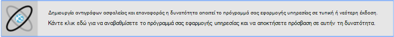

<properties 
    pageTitle="Δημιουργία αντιγράφου ασφαλείας σας εφαρμογή στο Azure" 
    description="Μάθετε πώς μπορείτε να δημιουργήσετε αντίγραφα ασφαλείας από τις εφαρμογές σας στο Azure εφαρμογής υπηρεσίας." 
    services="app-service" 
    documentationCenter="" 
    authors="cephalin" 
    manager="wpickett" 
    editor="jimbe"/>

<tags 
    ms.service="app-service" 
    ms.workload="na" 
    ms.tgt_pltfrm="na" 
    ms.devlang="na" 
    ms.topic="article" 
    ms.date="07/06/2016" 
    ms.author="cephalin"/>

# Δημιουργία αντιγράφου ασφαλείας σας εφαρμογή στο Azure

Η δυνατότητα δημιουργίας αντιγράφων ασφαλείας και επαναφοράς στο [Azure εφαρμογής υπηρεσίας](../app-service/app-service-value-prop-what-is.md) σάς επιτρέπει να δημιουργείτε εύκολα εφαρμογή δημιουργίας αντιγράφων ασφαλείας αυτόματα ή με μη αυτόματο τρόπο. Μπορείτε να επαναφέρετε την εφαρμογή σας σε μια προηγούμενη κατάσταση ή να δημιουργήσετε μια νέα εφαρμογή που βασίζεται σε ένα από την αρχική εφαρμογή δημιουργίας αντιγράφων ασφαλείας. 

Για πληροφορίες σχετικά με την επαναφορά μιας εφαρμογής από το αντίγραφο ασφαλείας, ανατρέξτε στο θέμα [Επαναφορά εφαρμογής στο Azure](web-sites-restore.md).

## Τι λαμβάνει αντίγραφα ασφαλείας 
Εφαρμογή υπηρεσίας να δημιουργήσετε αντίγραφα ασφαλείας τις ακόλουθες πληροφορίες:

* Ρύθμιση παραμέτρων εφαρμογής
* Το περιεχόμενο του αρχείου
* Οποιαδήποτε βάσεις δεδομένων SQL Azure ή σε βάσεις δεδομένων MySQL Azure (ClearDB) συνδεδεμένο με την εφαρμογή σας (μπορείτε να επιλέξετε ποιες από αυτές για να συμπεριλάβετε στο αντίγραφο ασφαλείας)

Αυτές οι πληροφορίες είναι αντίγραφα ασφαλείας για το λογαριασμό Azure χώρου αποθήκευσης και κοντέινερ που καθορίζετε. 

> [AZURE.NOTE] Κάθε αντίγραφο ασφαλείας είναι ένα πλήρες αντίγραφο χωρίς σύνδεση της εφαρμογής, δεν βηματικής ενημέρωσης.

## Απαιτήσεις και τους περιορισμούς

* Η δυνατότητα δημιουργίας αντιγράφων ασφαλείας και επαναφορά απαιτεί το πρόγραμμα εφαρμογής υπηρεσίας για να στο επίπεδο **Τυπική** ή μεγαλύτερη. Για περισσότερες πληροφορίες σχετικά με το πρόγραμμα εφαρμογής υπηρεσίας για να χρησιμοποιήσετε ένα ανώτερο επίπεδο κλίμακας, ανατρέξτε στο θέμα [κλιμάκωσης εφαρμογής στο Azure](web-sites-scale.md). Σημείωση ότι επίπεδο **Premium** επιτρέπει έναν μεγαλύτερο αριθμό ημερήσια αντίγραφα ασφαλείας από **Τυπική** σειρά.
* Χρειάζεστε ένα λογαριασμό Azure χώρου αποθήκευσης και το κοντέινερ στην ίδια συνδρομή του ως την εφαρμογή που θέλετε να δημιουργήσετε αντίγραφα ασφαλείας. Για περισσότερες πληροφορίες σχετικά με τους λογαριασμούς Azure χώρου αποθήκευσης, ανατρέξτε στις [συνδέσεις](#moreaboutstorage) στο τέλος αυτού του άρθρου.
* Δημιουργία αντιγράφων ασφαλείας μπορεί να είναι έως και 10GB εφαρμογής και βάσεων δεδομένων περιεχομένου. Θα λάβετε ένα σφάλμα εάν το μέγεθος του αντιγράφου ασφαλείας υπερβαίνει αυτό το όριο. 

## Δημιουργήστε μια μη αυτόματη δημιουργία αντιγράφων ασφαλείας

2. Στην [Πύλη του Azure](https://portal.azure.com), μεταβείτε στο blade της εφαρμογής σας, επιλέξτε **Ρυθμίσεις**, στη συνέχεια, **Δημιουργία αντιγράφων ασφαλείας**. Θα εμφανιστεί το blade **δημιουργίας αντιγράφων ασφαλείας** .
    
    ![Δημιουργία αντιγράφων ασφαλείας σελίδας][ChooseBackupsPage]

    >[AZURE.NOTE]Εάν εμφανιστεί το παρακάτω μήνυμα, κάντε κλικ για να αναβαθμίσετε το πρόγραμμά σας εφαρμογής υπηρεσίας πριν να συνεχίσετε με τη δημιουργία αντιγράφων ασφαλείας.
Για περισσότερες πληροφορίες, ανατρέξτε στο θέμα [κλιμάκωσης εφαρμογής στο Azure](web-sites-scale.md) .  
    >

3. Στο το blade **αντίγραφα ασφαλείας** , κάντε κλικ στην επιλογή **χώρου αποθήκευσης: δεν έχει ρυθμιστεί** για να ρυθμίσετε ένα λογαριασμό του χώρου αποθήκευσης.

    ![Επιλέξτε το λογαριασμό χώρου αποθήκευσης][ChooseStorageAccount]
    
4. Επιλέξτε τον προορισμό της αντιγραφής, επιλέγοντας ένα **Λογαριασμό χώρου αποθήκευσης** και **κοντέινερ**. Το λογαριασμό χώρου αποθήκευσης πρέπει να ανήκουν σε ίδια συνδρομή του ως την εφαρμογή που θέλετε να δημιουργήσετε αντίγραφα ασφαλείας. Εάν θέλετε, μπορείτε να δημιουργήσετε ένα νέο λογαριασμό του χώρου αποθήκευσης ή ένα νέο κοντέινερ στο τις αντίστοιχες λεπίδες. Όταν ολοκληρώσετε τη διαδικασία, κάντε κλικ στην **επιλογή**.
    
    
    
5. Στο το blade **Διαμόρφωση παραμέτρων ρυθμίσεων δημιουργίας αντιγράφων ασφαλείας** που εξακολουθεί να παραμένει ανοιχτή, κάντε κλικ στην επιλογή **Ρυθμίσεις της βάσης δεδομένων**, στη συνέχεια, επιλέξτε τις βάσεις δεδομένων που θέλετε να συμπεριλάβετε στο τα αντίγραφα ασφαλείας (βάση δεδομένων SQL ή MySQL), στη συνέχεια, κάντε κλικ στο κουμπί **OK**.  

    

    > [AZURE.NOTE]  Για μια βάση δεδομένων για να εμφανίζονται σε αυτήν τη λίστα, τη συμβολοσειρά σύνδεσης πρέπει να υπάρχει στην ενότητα **συμβολοσειρές σύνδεσης** από το blade **Ρυθμίσεις εφαρμογής** για την εφαρμογή σας.

6. Στο το blade **Διαμόρφωση παραμέτρων ρυθμίσεων δημιουργίας αντιγράφων ασφαλείας** , κάντε κλικ στην επιλογή **Αποθήκευση**.  

7. Στη γραμμή εντολών από το blade **αντίγραφα ασφαλείας** , κάντε κλικ στην επιλογή **Άμεση δημιουργία αντιγράφων ασφαλείας**.
    
    ![Κουμπί BackUpNow][BackUpNow]
    
    Θα δείτε ένα μήνυμα προόδου κατά τη διαδικασία δημιουργίας αντιγράφων ασφαλείας.

Αφού έχετε ρυθμίσει ένα λογαριασμό χώρου αποθήκευσης και κοντέινερ για αντίγραφα ασφαλείας, μπορείτε να κάνετε αντίγραφο ασφαλείας μιας μη αυτόματης οποιαδήποτε στιγμή.  

## Ρύθμιση παραμέτρων αυτόματη δημιουργία αντιγράφων ασφαλείας

1. Στο το blade **αντίγραφα ασφαλείας** , κάντε κλικ στην επιλογή **χρονοδιάγραμμα: δεν έχει ρυθμιστεί**. 

    
    
1. Στην το blade **Ρυθμίσεις δημιουργίας αντιγράφων ασφαλείας χρονοδιάγραμμα** , οριστεί **Προγραμματισμένης δημιουργίας αντιγράφων ασφαλείας** **στο**, στη συνέχεια, ρύθμιση παραμέτρων του χρονοδιαγράμματος δημιουργίας αντιγράφων ασφαλείας που θέλετε και κάντε κλικ στο κουμπί **OK**.
    
    ![Ενεργοποίηση αυτόματης δημιουργίας αντιγράφων ασφαλείας][SetAutomatedBackupOn]
    
4. Στο το blade **Διαμόρφωση παραμέτρων ρυθμίσεων δημιουργίας αντιγράφων ασφαλείας** που εξακολουθεί να παραμένει ανοιχτή, κάντε κλικ στο κουμπί **Ρυθμίσεις αποθήκευσης**και, στη συνέχεια, επιλέξτε τον προορισμό της αντιγραφής, επιλέγοντας ένα **Λογαριασμό χώρου αποθήκευσης** και **κοντέινερ**. Το λογαριασμό χώρου αποθήκευσης πρέπει να ανήκουν σε ίδια συνδρομή του ως την εφαρμογή που θέλετε να δημιουργήσετε αντίγραφα ασφαλείας. Εάν θέλετε, μπορείτε να δημιουργήσετε ένα νέο λογαριασμό του χώρου αποθήκευσης ή ένα νέο κοντέινερ στο τις αντίστοιχες λεπίδες. Όταν ολοκληρώσετε τη διαδικασία, κάντε κλικ στην **επιλογή**.
    
    
    
5. Στο το blade **Διαμόρφωση παραμέτρων ρυθμίσεων δημιουργίας αντιγράφων ασφαλείας** , κάντε κλικ στην επιλογή **Ρυθμίσεις της βάσης δεδομένων**, στη συνέχεια, επιλέξτε τις βάσεις δεδομένων που θέλετε να συμπεριλάβετε στο τα αντίγραφα ασφαλείας (βάση δεδομένων SQL ή MySQL), στη συνέχεια, κάντε κλικ στο κουμπί **OK**.  

    

    > [AZURE.NOTE]  Για μια βάση δεδομένων για να εμφανίζονται σε αυτήν τη λίστα, τη συμβολοσειρά σύνδεσης πρέπει να υπάρχει στην ενότητα **συμβολοσειρές σύνδεσης** από το blade **Ρυθμίσεις εφαρμογής** για την εφαρμογή σας.

6. Στο το blade **Διαμόρφωση παραμέτρων ρυθμίσεων δημιουργίας αντιγράφων ασφαλείας** , κάντε κλικ στην επιλογή **Αποθήκευση**.  

## Δημιουργίας αντιγράφων ασφαλείας μόνο ένα μέρος της εφαρμογής σας

Ορισμένες φορές δεν θέλετε να δημιουργήσετε αντίγραφα ασφαλείας όλων των στοιχείων στην εφαρμογή σας. Ακολουθούν μερικά παραδείγματα:

-   Μπορείτε [Ρύθμιση εβδομαδιαία αντίγραφα ασφαλείας](web-sites-backup.md#configure-automated-backups) της εφαρμογής που περιέχει στατικό περιεχόμενο που δεν αλλάζει ποτέ, όπως το παλιό καταχωρήσεων ιστολογίου ή εικόνες.
-   Εφαρμογή σας έχει περισσότερους από 10GB του περιεχομένου (που είναι το μέγιστο μέγεθος που μπορείτε να δημιουργήσετε αντίγραφο ασφαλείας κάθε φορά).
-   Δεν θέλετε να δημιουργήσετε αντίγραφα ασφαλείας των αρχείων καταγραφής.

Μερική δημιουργίας αντιγράφων ασφαλείας θα σας επιτρέπουν να επιλέξετε ακριβώς ποια αρχεία θέλετε να δημιουργήσετε αντίγραφα ασφαλείας.

### Αποκλεισμός αρχείων από το αντίγραφο ασφαλείας

Για να αποκλείσετε αρχείων και φακέλων από τα αντίγραφα ασφαλείας, δημιουργήστε μια `_backup.filter` αρχείων στο φάκελο D:\home\site\wwwroot της εφαρμογής και καθορίστε τη λίστα των αρχείων και φακέλων που θέλετε να αποκλείσετε στο εκεί. Ένας εύκολος τρόπος για να αποκτήσετε πρόσβαση σε αυτό είναι μέσω της [Κονσόλας Kudu](https://github.com/projectkudu/kudu/wiki/Kudu-console). 

Ας υποθέσουμε ότι έχετε μια εφαρμογή που περιέχει τα αρχεία καταγραφής και στατικές εικόνες από προηγούμενων ετών που ποτέ δεν πρόκειται να αλλάξετε. Έχετε ήδη ένα πλήρες αντίγραφο ασφαλείας της εφαρμογής που περιλαμβάνει το παλιό εικόνες. Τώρα που θέλετε να δημιουργήσετε αντίγραφο ασφαλείας της εφαρμογής καθημερινά, αλλά δεν θέλετε να πληρώσετε για την αποθήκευση αρχείων καταγραφής ή τα αρχεία στατική εικόνα που αλλάζετε ποτέ.

![Καταγράφει φάκελο][LogsFolder]
![εικόνες φακέλου][ImagesFolder]
    
Τα παρακάτω βήματα για την εμφάνιση του πώς μπορείτε να εξαιρέσετε αυτών των αρχείων από το αντίγραφο ασφαλείας.

1. Μεταβείτε στις επιλογές `http://{yourapp}.scm.azurewebsites.net/DebugConsole` και προσδιορίστε τους φακέλους που θέλετε να εξαιρέσετε από τα αντίγραφα ασφαλείας. Σε αυτό το παράδειγμα, θα θέλετε να εξαιρέσετε τα παρακάτω αρχεία και φάκελοι εμφανίζονται στο συγκεκριμένο περιβάλλον εργασίας Χρήστη:

        D:\home\site\wwwroot\Logs
        D:\home\LogFiles
        D:\home\site\wwwroot\Images\2013
        D:\home\site\wwwroot\Images\2014
        D:\home\site\wwwroot\Images\brand.png

    [AZURE.NOTE] Η τελευταία γραμμή εμφανίζει ότι μπορείτε να εξαιρέσετε αρχεία άτομα, καθώς και τους φακέλους.

2. Δημιουργήστε ένα αρχείο που ονομάζεται `_backup.filter` και τοποθέτηση παραπάνω λίστα στο αρχείο, αλλά καταργήσετε `D:\home`. Λίστα μία καταλόγου ή αρχείο ανά γραμμή. Επομένως, το περιεχόμενο του αρχείου θα πρέπει να είναι:

    \site\wwwroot\Logs \LogFiles \site\wwwroot\Images\2013 \site\wwwroot\Images\2014 \site\wwwroot\Images\brand.png

3. Η αποστολή του αρχείου για να το `D:\home\site\wwwroot\` καταλόγου της τοποθεσίας σας με τη χρήση [ftp](web-sites-deploy.md#ftp) ή κάποια άλλη μέθοδο. Εάν θέλετε, μπορείτε να δημιουργήσετε το αρχείο απευθείας στο `http://{yourapp}.scm.azurewebsites.net/DebugConsole` και να εισαγάγετε το περιεχόμενο εκεί.

4. Εκτέλεση δημιουργίας αντιγράφων ασφαλείας με τον ίδιο τρόπο που θα κάνατε κανονικά, [με μη αυτόματο τρόπο](#create-a-manual-backup) ή [αυτόματα](#configure-automated-backups).

Τώρα, οποιαδήποτε αρχεία και φακέλους που έχουν καθοριστεί στο `_backup.filter` θα εξαιρούνται από το αντίγραφο ασφαλείας. Σε αυτό το παράδειγμα, τα αρχεία καταγραφής και τα αρχεία εικόνας 2013 και 2014 θα δεν είναι πλέον να δημιουργήσει αντίγραφα ασφαλείας, καθώς και brand.png.

>[AZURE.NOTE] Μπορείτε να επαναφέρετε μερική αντίγραφα ασφαλείας της τοποθεσίας σας τον ίδιο τρόπο όπως θα κάνατε [Επαναφορά κανονικό αντίγραφο ασφαλείας](web-sites-restore.md). Η διαδικασία επαναφοράς θα κάνετε σωστά.
>
>Όταν γίνεται επαναφορά ένα πλήρες αντίγραφο ασφαλείας, όλο το περιεχόμενο στην τοποθεσία αντικαθίσταται με ό, τι υπάρχει στο αντίγραφο ασφαλείας. Εάν είναι ένα αρχείο στην τοποθεσία αλλά όχι στο αντίγραφο ασφαλείας λαμβάνει διαγραφεί. Ωστόσο, όταν γίνεται επαναφορά μερική αντίγραφο ασφαλείας, οποιοδήποτε περιεχόμενο που βρίσκεται σε έναν από τους ανεπιθύμητος καταλόγους ή οποιοδήποτε αρχείο ανεπιθύμητος, παραμένει ως έχει.

## Τον τρόπο αποθήκευσης των αντιγράφων ασφαλείας

Αφού έχετε κάνει μία ή περισσότερες αντίγραφα ασφαλείας για την εφαρμογή σας, τη δημιουργία αντιγράφων ασφαλείας θα είναι ορατό σε το **κοντέινερ** blade το λογαριασμό χώρου αποθήκευσης, καθώς και την εφαρμογή σας. Στο λογαριασμό χώρου αποθήκευσης, κάθε αντίγραφο ασφαλείας αποτελείται από ένα αρχείο .zip που περιέχει τα δεδομένα αντιγράφου ασφαλείας και ένα αρχείο .xml που περιέχει μια δήλωση των περιεχομένων του αρχείου .zip. Μπορείτε να αποσυμπίεση και αναζητήστε αυτά τα αρχεία, εάν θέλετε να έχετε πρόσβαση τα αντίγραφα ασφαλείας χωρίς στην πραγματικότητα εκτέλεση επαναφοράς εφαρμογής.

Το αντίγραφο ασφαλείας της βάσης δεδομένων για την εφαρμογή αποθηκεύονται στον ριζικό κατάλογο του αρχείου .zip. Για μια βάση δεδομένων SQL, αυτό είναι ένα αρχείο BACPAC (χωρίς επέκταση αρχείου) και μπορεί να εισαχθεί. Για να δημιουργήσετε μια νέα βάση δεδομένων SQL με βάση την εξαγωγή BACPAC, ανατρέξτε στο θέμα [Εισαγωγή ενός αρχείου BACPAC για να δημιουργήσετε μια νέα βάση δεδομένων χρήστη](http://technet.microsoft.com/library/hh710052.aspx).

> [AZURE.WARNING] Τροποποίηση οποιοδήποτε από τα αρχεία σας κοντέινερ **websitebackups** μπορεί να προκαλέσει το αντίγραφο ασφαλείας για να γίνετε και δεν είναι έγκυρες, επομένως, μη-δυνατότητα επαναφοράς.

## Επόμενα βήματα
Για πληροφορίες σχετικά με την επαναφορά μιας εφαρμογής από ένα αντίγραφο ασφαλείας, ανατρέξτε στο θέμα [Επαναφορά εφαρμογής στο Azure](web-sites-restore.md). Μπορείτε επίσης να δημιουργία αντιγράφων ασφαλείας και να επαναφέρετε εφαρμογές εφαρμογής υπηρεσίας χρησιμοποιώντας REST API (ανατρέξτε στο θέμα [Χρήση ΥΠΌΛΟΙΠΑ δημιουργίας αντιγράφων ασφαλείας και επαναφορά εφαρμογής υπηρεσίας εφαρμογών](websites-csm-backup.md)).

>[AZURE.NOTE] Εάν θέλετε να γρήγορα αποτελέσματα με το Azure εφαρμογής υπηρεσίας πριν από την εγγραφή για λογαριασμό Azure, μεταβείτε στο [Δοκιμάστε εφαρμογής υπηρεσίας](http://go.microsoft.com/fwlink/?LinkId=523751), όπου μπορείτε να αμέσως δημιουργήσετε μια εφαρμογή web μικρής διάρκειας starter στην εφαρμογή υπηρεσίας. Δεν υπάρχει πιστωτικές κάρτες υποχρεωτικό, χωρίς δεσμεύσεις.

<!-- IMAGES -->
[ChooseBackupsPage]: ./media/web-sites-backup/01ChooseBackupsPage.png
[ChooseStorageAccount]: ./media/web-sites-backup/02ChooseStorageAccount.png
[IncludedDatabases]: ./media/web-sites-backup/03IncludedDatabases.png
[BackUpNow]: ./media/web-sites-backup/04BackUpNow.png
[BackupProgress]: ./media/web-sites-backup/05BackupProgress.png
[SetAutomatedBackupOn]: ./media/web-sites-backup/06SetAutomatedBackupOn.png
[Frequency]: ./media/web-sites-backup/07Frequency.png
[StartDate]: ./media/web-sites-backup/08StartDate.png
[StartTime]: ./media/web-sites-backup/09StartTime.png
[SaveIcon]: ./media/web-sites-backup/10SaveIcon.png
[ImagesFolder]: ./media/web-sites-backup/11Images.png
[LogsFolder]: ./media/web-sites-backup/12Logs.png
[GhostUpgradeWarning]: ./media/web-sites-backup/13GhostUpgradeWarning.png
 
