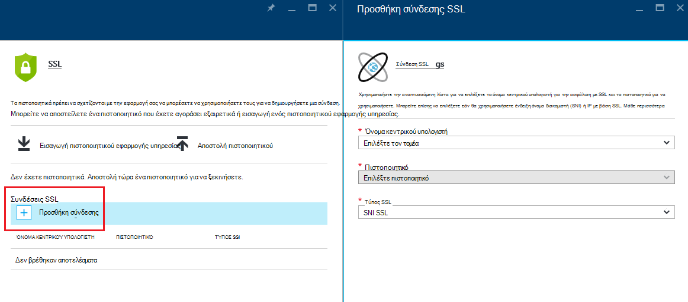
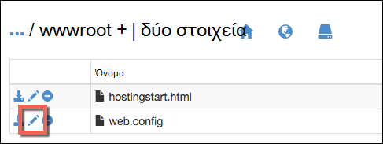

<properties
    pageTitle="Διασφάλιση της εφαρμογής του προσαρμοσμένου τομέα με το πρόθεμα HTTPS | Microsoft Azure"
    description="Μάθετε τον βαθμό ασφάλειας του προσαρμοσμένου ονόματος τομέα για την εφαρμογή σας στην υπηρεσία εφαρμογής Azure, ρυθμίζοντας τις παραμέτρους μια σύνδεση πιστοποιητικού SSL. Μπορείτε, επίσης, θα μάθετε πώς να λάβετε ένα πιστοποιητικό SSL από πολλά εργαλεία."
    services="app-service"
    documentationCenter=".net"
    authors="cephalin"
    manager="wpickett"
    editor="jimbe"
    tags="top-support-issue"/>

<tags
    ms.service="app-service"
    ms.workload="na"
    ms.tgt_pltfrm="na"
    ms.devlang="na"
    ms.topic="article"
    ms.date="08/08/2016"
    ms.author="cephalin"/>

# Διασφάλιση της εφαρμογής του προσαρμοσμένου τομέα με το πρόθεμα HTTPS

> [AZURE.SELECTOR]
- [Αγορά του πιστοποιητικού SSL στο Azure](web-sites-purchase-ssl-web-site.md)
- [Χρήση του πιστοποιητικού SSL από κάποιο άλλο σημείο](web-sites-configure-ssl-certificate.md)

Αυτό το άρθρο σάς δείχνει πώς μπορείτε να ενεργοποιήσετε HTTPS για μια εφαρμογή web, μια εφαρμογή για κινητές συσκευές παρασκηνίου ή εφαρμογής API στο [Azure εφαρμογής υπηρεσίας](../app-service/app-service-value-prop-what-is.md) που χρησιμοποιεί ένα προσαρμοσμένο όνομα τομέα. Καλύπτει μόνο διακομιστή ελέγχου ταυτότητας. Εάν χρειάζεστε αμοιβαία ελέγχου ταυτότητας (συμπεριλαμβανομένου του ελέγχου ταυτότητας του προγράμματος-πελάτη), ανατρέξτε στο θέμα [Πώς να ρυθμίσετε τις παραμέτρους TLS αμοιβαία ελέγχου ταυτότητας για εφαρμογής υπηρεσίας](app-service-web-configure-tls-mutual-auth.md).

Για να ασφαλίσετε με το πρόθεμα HTTPS εφαρμογής που περιλαμβάνει ένα προσαρμοσμένο όνομα τομέα, μπορείτε να προσθέσετε ένα πιστοποιητικό για το συγκεκριμένο όνομα τομέα. Από προεπιλογή, διασφαλίζει Azure το ** \*. azurewebsites.net** μπαλαντέρ τομέα με ένα μεμονωμένο πιστοποιητικό SSL, για τους πελάτες σας να πρόσβαση ήδη την εφαρμογή στο * *https://*&lt;Όνομα_εφαρμογής >*. azurewebsites.net**. Αλλά εάν θέλετε να χρησιμοποιήσετε έναν προσαρμοσμένο τομέα, όπως **www.contoso.com contoso.com**, ****, και ** \*. contoso.com**, τη δυνατότητα να προστατεύσετε το προεπιλεγμένο πιστοποιητικό που. Επιπλέον, όπως όλα τα [πιστοποιητικά χαρακτήρων μπαλαντέρ](https://casecurity.org/2014/02/26/pros-and-cons-of-single-domain-multi-domain-and-wildcard-certificates/), το προεπιλεγμένο πιστοποιητικό δεν είναι εξίσου ασφαλής με χρήση ενός προσαρμοσμένου τομέα και ένα πιστοποιητικό για αυτόν τον προσαρμοσμένο τομέα.   

>[AZURE.NOTE] Μπορείτε να λάβετε βοήθεια από το Azure ειδικούς οποιαδήποτε στιγμή στα [Φόρουμ του Azure](https://azure.microsoft.com/support/forums/). Για πιο εξατομικευμένη υποστήριξη, μεταβείτε στην [Υποστήριξη Azure](https://azure.microsoft.com/support/options/) και κάντε κλικ στην επιλογή **Λήψη υποστήριξης**.

## Τι χρειάζεστε
Για να προστατεύσετε το προσαρμοσμένο όνομα τομέα με το πρόθεμα HTTPS, μπορείτε να συνδέσετε ένα προσαρμοσμένο πιστοποιητικό SSL σε αυτόν τον προσαρμοσμένο τομέα στο Azure. Πριν από την βιβλιοδεσία ένα προσαρμοσμένο πιστοποιητικό, πρέπει να κάνετε τα εξής:

- **Ρύθμιση παραμέτρων του προσαρμοσμένου τομέα** - εφαρμογής υπηρεσίας επιτρέπει μόνο προσθέτοντας ένα πιστοποιητικό για ένα όνομα τομέα που έχει ήδη ρυθμιστεί στην εφαρμογή. Για οδηγίες, ανατρέξτε στο θέμα [Αντιστοίχιση ενός προσαρμοσμένου ονόματος τομέα για μια εφαρμογή του Azure](web-sites-custom-domain-name.md). 
- **Κλίμακα βασικού επιπέδου ή νεότερη έκδοση** Σχέδια εφαρμογής υπηρεσίας σε χαμηλότερες βαθμίδες τιμολόγησης δεν υποστηρίζουν την προσαρμοσμένη πιστοποιητικά SSL. Για οδηγίες, ανατρέξτε στο θέμα [κλιμάκωσης εφαρμογής στο Azure](web-sites-scale.md). 
- **Αποκτήστε ένα πιστοποιητικό SSL** - Εάν δεν έχετε ήδη ένα, πρέπει να αποκτήσετε από μια αξιόπιστη [αρχή έκδοσης πιστοποιητικών](http://en.wikipedia.org/wiki/Certificate_authority) (CA). Το πιστοποιητικό πρέπει να ικανοποιεί τις ακόλουθες απαιτήσεις:

    - Αυτό είναι υπογεγραμμένο από μια αξιόπιστη αρχή έκδοσης Πιστοποιητικών (χωρίς ιδιωτικό διακομιστές CA).
    - Περιέχει ένα ιδιωτικό κλειδί.
    - Είναι δημιουργήθηκε για ανταλλαγή κλειδιών και εξαγωγή σε ένα. Αρχείο PFX.
    - Χρησιμοποιεί τουλάχιστον κρυπτογράφηση 2048 bit.
    - Το όνομα θέματος συμφωνεί με τον προσαρμοσμένο τομέα που χρειάζεται για την ασφάλιση. Για να ασφαλίσετε πολλούς τομείς με ένα πιστοποιητικό, πρέπει να χρησιμοποιήσετε ένα χαρακτήρα μπαλαντέρ όνομα (π.χ. ** \*. contoso.com**) ή να καθορίσετε τιμές subjectAltName.
    - Συγχωνεύονται με όλα **[ενδιάμεσα πιστοποιητικά](http://en.wikipedia.org/wiki/Intermediate_certificate_authorities)** που χρησιμοποιούνται από την αρχή έκδοσης Πιστοποιητικών. Διαφορετικά, ενδέχεται να αντιμετωπίσετε προβλήματα irreproducible διαλειτουργικότητας σε ορισμένα προγράμματα-πελάτες.

        >[AZURE.NOTE] Ο ευκολότερος τρόπος για να λάβετε ένα πιστοποιητικό SSL που πληροί τις απαιτήσεις είναι να         [αγοράσετε έναν στην πύλη Azure απευθείας](web-sites-purchase-ssl-web-site.md). Σε αυτό το άρθρο θα μάθετε πώς να κάνετε με μη αυτόματο τρόπο και, στη συνέχεια, συνδέστε το με τον προσαρμοσμένο τομέα σας στην εφαρμογή υπηρεσίας.
        >   
        > **Τα πιστοποιητικά κρυπτογράφησης ελλειπτικής καμπύλης (ECC)** να εργαστείτε με εφαρμογή υπηρεσίας, αλλά εκτός του αντικειμένου αυτού του άρθρου. Εργασία με την αρχή έκδοσης Πιστοποιητικών στην τα ακριβή βήματα για να δημιουργήσετε τα πιστοποιητικά ECC.

## Βήμα 1. Αποκτήστε ένα πιστοποιητικό SSL

Επειδή οι αρχές έκδοσης πιστοποιητικών παρέχουν τους διάφορους τύπους πιστοποιητικό SSL σε διαφορετική τιμή σημεία, πρέπει να ξεκινά με αποφασίσετε ποιον τύπο πιστοποιητικού SSL να αγοράσετε. Για να προστατεύσετε ένα όνομα τομέα μόνο (**www.contoso.com**), πρέπει απλώς ένα βασικό πιστοποιητικό. Για την ασφάλιση πολλών ονομάτων τομέων (**contoso.com** *και* **www.contoso.com** 
*και* **mail.contoso.com**), χρειάζεστε ένα [πιστοποιητικό μπαλαντέρ](http://en.wikipedia.org/wiki/Wildcard_certificate) ή ένα πιστοποιητικό με [Εναλλακτικό όνομα θέματος](http://en.wikipedia.org/wiki/SubjectAltName) (`subjectAltName`).

Όταν μάθετε ποια πιστοποιητικό SSL να αγοράσετε, μπορείτε να υποβάλετε ένα πιστοποιητικό υπογραφής αίτηση (CSR) σε μια αρχή έκδοσης Πιστοποιητικών. Όταν λαμβάνετε ζητήθηκε πιστοποιητικό ξανά από την αρχή έκδοσης Πιστοποιητικών, στη συνέχεια, δημιουργούν ένα αρχείο .pfx από το πιστοποιητικό. Μπορείτε να εκτελέσετε αυτά τα βήματα χρησιμοποιώντας το εργαλείο της επιλογής σας. Ακολουθούν οδηγίες για τα κοινά εργαλεία:

- [Βήματα Certreq.exe](#bkmk_certreq) - το βοηθητικό πρόγραμμα των Windows για τη δημιουργία αιτήσεις πιστοποιητικού. Έχουν περάσει μέρος των Windows από τα Windows XP/Windows Server 2000.
- [Διαχείριση των υπηρεσιών IIS βήματα](#bkmk_iismgr) - το εργαλείο της επιλογής εάν είστε ήδη εξοικειωμένοι με αυτό.
- [Βήματα OpenSSL](#bkmk_openssl) - ένα [εργαλείο ανοιχτού κώδικα πλατφόρμες](https://www.openssl.org). Χρησιμοποιήστε το για να σας βοηθήσουν να λάβετε ένα πιστοποιητικό SSL από οποιαδήποτε πλατφόρμα.
- βήματα για τη λήψη της [subjectAltName βήματα χρησιμοποιώντας OpenSSL](#bkmk_subjectaltname) - `subjectAltName` πιστοποιητικά.

Εάν θέλετε να ελέγξετε την εγκατάσταση σε εφαρμογή υπηρεσίας πριν από την αγορά ενός πιστοποιητικού, μπορείτε να δημιουργήσετε ένα [αυτο-υπογεγραμμένο πιστοποιητικό](https://en.wikipedia.org/wiki/Self-signed_certificate). Αυτό το πρόγραμμα εκμάθησης σάς προσφέρει δύο τρόπους για τη δημιουργία του:

- [Αυτο-υπογεγραμμένο πιστοποιητικό, Certreq.exe βήματα](#bkmk_sscertreq)
- [Αυτο-υπογεγραμμένο πιστοποιητικό, OpenSSL βήματα](#bkmk_ssopenssl)

### Αποκτήστε ένα πιστοποιητικό χρησιμοποιώντας Certreq.exe

1. Δημιουργία αρχείου (π.χ. **myrequest.txt**), και αντιγράψτε σε αυτό το παρακάτω κείμενο και αποθηκεύστε το σε έναν κατάλογο εργασίας. Αντικαταστήστε το `<your-domain>` κράτησης θέσης με το όνομα του προσαρμοσμένου τομέα της εφαρμογής.

        [NewRequest]
        Subject = "CN=<your-domain>"  ; E.g. "CN=www.contoso.com", or "CN=*.contoso.com" for a wildcard certificate
        Exportable = TRUE
        KeyLength = 2048              ; Required minimum is 2048
        KeySpec = 1
        KeyUsage = 0xA0
        MachineKeySet = True
        ProviderName = "Microsoft RSA SChannel Cryptographic Provider"
        ProviderType = 12
        HashAlgorithm = SHA256

        [EnhancedKeyUsageExtension]
        OID=1.3.6.1.5.5.7.3.1         ; Server Authentication

    Για περισσότερες πληροφορίες σχετικά με τις επιλογές στο ο CSR και άλλες διαθέσιμες επιλογές, ανατρέξτε στην [τεκμηρίωση αναφοράς Certreq](https://technet.microsoft.com/library/dn296456.aspx).

4. Σε μια γραμμή εντολών, `CD` σε τον κατάλογο εργασίας και εκτελέστε την ακόλουθη εντολή για να δημιουργήσετε το CSR:

        certreq -new myrequest.txt myrequest.csr

    **myrequest.CSR** τώρα δημιουργείται στο τρέχον κατάλογος εργασίας σας.

5. Υποβολή **myrequest.csr** σε μια αρχή έκδοσης Πιστοποιητικών για να αποκτήσετε ένα πιστοποιητικό SSL. Μπορείτε είτε αποστολή του αρχείου ή αντιγράψτε το περιεχόμενο από ένα πρόγραμμα επεξεργασίας κειμένου σε μια φόρμα web.

    Για μια λίστα με τις αρχές έκδοσης πιστοποιητικών αξιόπιστες από τη Microsoft, ανατρέξτε στο θέμα [πρόγραμμα αξιόπιστο πιστοποιητικών ρίζας της Microsoft: συμμετέχοντες][cas].

6. Μόλις η αρχή έκδοσης Πιστοποιητικών απάντησε σε εσάς με ένα πιστοποιητικό (. Αρχείο Προαιρετικό), αποθηκεύστε την στον κατάλογό σας εργασία. Στη συνέχεια, εκτελέστε την ακόλουθη εντολή για να ολοκληρωθεί ο CSR σε εκκρεμότητα.

        certreq -accept -user <certificate-name>.cer

    Αυτή η εντολή αποθηκεύει το τελικό πιστοποιητικό στο χώρο αποθήκευσης πιστοποιητικών των Windows.

6. Εάν η CA σας χρησιμοποιεί ενδιάμεσα πιστοποιητικά, εγκαταστήστε τις πριν να συνεχίσετε. Συνήθως προκύπτουν ως ξεχωριστό στοιχείο λήψης από την αρχή έκδοσης Πιστοποιητικών και σε διάφορες μορφές για τύπους διακομιστή web διαφορετικά. Επιλέξτε την έκδοση για Microsoft IIS.

    Αφού έχετε κάνει λήψη τα πιστοποιητικά, κάντε δεξί κλικ σε κάθε μία από αυτές στην Εξερεύνηση των Windows και επιλέξτε  **Εγκατάσταση πιστοποιητικού**. Χρησιμοποιήστε τις προεπιλεγμένες τιμές του **Οδηγού εισαγωγής πιστοποιητικών**και συνεχίστε να επιλέγετε **Επόμενο** μέχρι να ολοκληρωθεί η εισαγωγή.

7. Για να εξαγάγετε το πιστοποιητικό SSL από το χώρο αποθήκευσης πιστοποιητικού, πατήστε το πλήκτρο `Win` + `R` και να εκτελέσετε **certmgr.msc** εκκίνηση διαχείριση πιστοποιητικών. Επιλέξτε **προσωπικά** > **πιστοποιητικά**. Στη στήλη **Εκδοθεί να** , θα πρέπει να μπορείτε να δείτε μια καταχώρηση με το όνομα του προσαρμοσμένου τομέα σας και την αρχή έκδοσης Πιστοποιητικών που χρησιμοποιήσατε για τη δημιουργία του πιστοποιητικού στη στήλη **Εκδοθεί από** .

    ![Εισαγωγή εικόνας του πιστοποιητικού διαχειριστή εδώ][certmgr]

9. Κάντε δεξί κλικ στο πιστοποιητικό και επιλέξτε **Όλες τις εργασίες** > **Εξαγωγή**. Στον **Οδηγό εξαγωγής πιστοποιητικών**, κάντε κλικ στο κουμπί **Επόμενο**, στη συνέχεια, επιλέξτε **Ναι, εξαγωγή του ιδιωτικού κλειδιού**και, στη συνέχεια, κάντε ξανά κλικ στο κουμπί **Επόμενο** .

    ![Εξαγάγετε το ιδιωτικό κλειδί][certwiz1]

10. Επιλέξτε **Ανταλλαγή προσωπικών πληροφοριών - PKCS #12**, **συμπεριλάβετε όλα τα πιστοποιητικά στη διαδρομή πιστοποίησης εάν είναι δυνατόν**και **Εξαγωγή όλων των σύνθετων ιδιοτήτων**. Στη συνέχεια, κάντε κλικ στο κουμπί **Επόμενο**.

    ![συμπεριλάβετε όλα τα πιστοποιητικά και σύνθετες ιδιότητες][certwiz2]

11. Επιλέξτε **τον κωδικό πρόσβασης**, και, στη συνέχεια, πληκτρολογήστε και επιβεβαιώστε τον κωδικό πρόσβασης. Κάντε κλικ στο κουμπί **Επόμενο**.

    ![Καθορίστε έναν κωδικό πρόσβασης][certwiz3]

12. Δώστε μια διαδρομή και ένα όνομα αρχείου για το πιστοποιητικό που έχει εξαχθεί, με την επέκταση **.pfx**. Κάντε κλικ στο κουμπί **Επόμενο** για να ολοκληρώσετε.

    ![Δώστε μια διαδρομή αρχείου][certwiz4]

Τώρα είστε έτοιμοι να στείλετε το εξαγόμενο αρχείο PFX σε εφαρμογής υπηρεσίας. Ανατρέξτε στο θέμα [βήμα 2. Αποστολή και να δεσμεύσετε το προσαρμοσμένο πιστοποιητικό SSL](#bkmk_configuressl).

### Αποκτήστε ένα πιστοποιητικό χρησιμοποιώντας τη διαχείριση των υπηρεσιών IIS

1. Μπορείτε να δημιουργείτε μια CSR με τη διαχείριση των υπηρεσιών IIS για να στείλετε στην αρχή έκδοσης πιστοποιητικών. Για περισσότερες πληροφορίες σχετικά με δημιουργία έναν αντιπρόσωπο εξυπηρέτησης Πελατών, ανατρέξτε στο θέμα [αίτηση για ένα πιστοποιητικό διακομιστή Internet (7 των υπηρεσιών IIS)][iiscsr].

3. Υποβολή σας CSR σε μια αρχή έκδοσης Πιστοποιητικών για να λάβετε ένα πιστοποιητικό SSL. Για μια λίστα με τις αρχές έκδοσης πιστοποιητικών αξιόπιστες από τη Microsoft, ανατρέξτε στο θέμα [πρόγραμμα αξιόπιστο πιστοποιητικών ρίζας της Microsoft: συμμετέχοντες][cas].

3. Ολοκληρώστε το CSR με το πιστοποιητικό που στέλνει την αρχή έκδοσης Πιστοποιητικών που παρέχετε. Για περισσότερες πληροφορίες σχετικά με την ολοκλήρωση του CSR, ανατρέξτε στο θέμα [εγκατάσταση ενός πιστοποιητικού διακομιστή Internet (7 των υπηρεσιών IIS)][installcertiis].

4. Εάν η CA σας χρησιμοποιεί ενδιάμεσα πιστοποιητικά, εγκαταστήστε τις πριν να συνεχίσετε. Συνήθως προκύπτουν ως ξεχωριστό στοιχείο λήψης από την αρχή έκδοσης Πιστοποιητικών και σε διάφορες μορφές για τύπους διακομιστή web διαφορετικά. Επιλέξτε την έκδοση για Microsoft IIS.

    Αφού έχετε κάνει λήψη τα πιστοποιητικά, κάντε δεξί κλικ σε κάθε μία από αυτές στην Εξερεύνηση των Windows και επιλέξτε **Εγκατάσταση πιστοποιητικού**. 
    Χρησιμοποιήστε τις προεπιλεγμένες τιμές του **Οδηγού εισαγωγής πιστοποιητικών**και συνεχίστε να επιλέγετε **Επόμενο** μέχρι να ολοκληρωθεί η εισαγωγή.

4. Εξαγάγετε το πιστοποιητικό SSL από τη διαχείριση των υπηρεσιών IIS. Για περισσότερες πληροφορίες σχετικά με την εξαγωγή του πιστοποιητικού, ανατρέξτε στο θέμα [Εξαγωγή πιστοποιητικό διακομιστή (7 των υπηρεσιών IIS)][exportcertiis]. 

    >[AZURE.IMPORTANT] Στον **Οδηγό εξαγωγής πιστοποιητικού**, βεβαιωθείτε ότι έχετε επιλέξει **Ναι, εξαγωγή του ιδιωτικού κλειδιού**  
    >
    >![Εξαγάγετε το ιδιωτικό κλειδί][certwiz1]  
    >
    > και επιλέξτε επίσης **Ανταλλαγή προσωπικών πληροφοριών - PKCS #12**, **συμπεριλάβετε όλα τα πιστοποιητικά στη διαδρομή πιστοποίησης εάν είναι δυνατόν**και     **Εξαγωγή όλων των σύνθετων ιδιοτήτων**.
    >
    >![συμπεριλάβετε όλα τα πιστοποιητικά και σύνθετες ιδιότητες][certwiz2]

Τώρα είστε έτοιμοι να στείλετε το εξαγόμενο αρχείο PFX σε εφαρμογής υπηρεσίας. Ανατρέξτε στο θέμα [βήμα 2. Αποστολή και να δεσμεύσετε το προσαρμοσμένο πιστοποιητικό SSL](#bkmk_configuressl).

### Αποκτήστε ένα πιστοποιητικό χρησιμοποιώντας OpenSSL

1. Σε μια γραμμή εντολών terminal, `CD` σε έναν κατάλογο εργασίας δημιουργούν ένα ιδιωτικό κλειδί και εξυπηρέτησης Πελατών, εκτελώντας την ακόλουθη εντολή:

        openssl req -sha256 -new -nodes -keyout myserver.key -out server.csr -newkey rsa:2048

2. Όταν σας ζητηθεί, πληκτρολογήστε τις κατάλληλες πληροφορίες. Για παράδειγμα:

        Country Name (2 letter code)
        State or Province Name (full name) []: Washington
        Locality Name (eg, city) []: Redmond
        Organization Name (eg, company) []: Microsoft
        Organizational Unit Name (eg, section) []: Azure
        Common Name (eg, YOUR name) []: www.microsoft.com
        Email Address []:

        Please enter the following 'extra' attributes to be sent with your certificate request

        A challenge password []:

    Όταν ολοκληρώσετε τη διαδικασία, πρέπει να έχετε δύο αρχεία στον κατάλογό σας εργασία: **myserver.key** και **server.csr**. 
    Το **server.csr** περιέχει το CSR και χρειάζεστε **myserver.key** αργότερα.

3. Υποβολή σας CSR σε μια αρχή έκδοσης Πιστοποιητικών για να λάβετε ένα πιστοποιητικό SSL. Για μια λίστα με τις αρχές έκδοσης πιστοποιητικών αξιόπιστες από τη Microsoft, ανατρέξτε στο θέμα [πρόγραμμα αξιόπιστο πιστοποιητικών ρίζας της Microsoft: συμμετέχοντες][cas].

4. Μόλις η αρχή έκδοσης Πιστοποιητικών στέλνει το πιστοποιητικό που ζητείται, αποθηκεύστε το σε ένα αρχείο με το όνομα **myserver.crt** στον κατάλογό σας εργασία. Εάν CA σας παρέχει το σε μορφή κειμένου, απλώς αντιγράψτε το περιεχόμενο στην **myserver.crt** σε έναν επεξεργαστή κειμένου και αποθηκεύστε το. Το αρχείο σας θα πρέπει να είναι ως εξής:

        -----BEGIN CERTIFICATE-----
        MIIDJDCCAgwCCQCpCY4o1LBQuzANBgkqhkiG9w0BAQUFADBUMQswCQYDVQQGEwJV
        UzELMAkGA1UECBMCV0ExEDAOBgNVBAcTB1JlZG1vbmQxEDAOBgNVBAsTB0NvbnRv
        c28xFDASBgNVBAMTC2NvbnRvc28uY29tMB4XDTE0MDExNjE1MzIyM1oXDTE1MDEx
        NjE1MzIyM1owVDELMAkGA1UEBhMCVVMxCzAJBgNVBAgTAldBMRAwDgYDVQQHEwdS
        ZWRtb25kMRAwDgYDVQQLEwdDb250b3NvMRQwEgYDVQQDEwtjb250b3NvLmNvbTCC
        ASIwDQYJKoZIhvcNAQEBBQADggEPADCCAQoCggEBAN96hBX5EDgULtWkCRK7DMM3
        enae1LT9fXqGlbA7ScFvFivGvOLEqEPD//eLGsf15OYHFOQHK1hwgyfXa9sEDPMT
        3AsF3iWyF7FiEoR/qV6LdKjeQicJ2cXjGwf3G5vPoIaYifI5r0lhgOUqBxzaBDZ4
        xMgCh2yv7NavI17BHlWyQo90gS2X5glYGRhzY/fGp10BeUEgIs3Se0kQfBQOFUYb
        ktA6802lod5K0OxlQy4Oc8kfxTDf8AF2SPQ6BL7xxWrNl/Q2DuEEemjuMnLNxmeA
        Ik2+6Z6+WdvJoRxqHhleoL8ftOpWR20ToiZXCPo+fcmLod4ejsG5qjBlztVY4qsC
        AwEAATANBgkqhkiG9w0BAQUFAAOCAQEAVcM9AeeNFv2li69qBZLGDuK0NDHD3zhK
        Y0nDkqucgjE2QKUuvVSPodz8qwHnKoPwnSrTn8CRjW1gFq5qWEO50dGWgyLR8Wy1
        F69DYsEzodG+shv/G+vHJZg9QzutsJTB/Q8OoUCSnQS1PSPZP7RbvDV9b7Gx+gtg
        7kQ55j3A5vOrpI8N9CwdPuimtu6X8Ylw9ejWZsnyy0FMeOPpK3WTkDMxwwGxkU3Y
        lCRTzkv6vnHrlYQxyBLOSafCB1RWinN/slcWSLHADB6R+HeMiVKkFpooT+ghtii1
        A9PdUQIhK9bdaFicXPBYZ6AgNVuGtfwyuS5V6ucm7RE6+qf+QjXNFg==
        -----END CERTIFICATE-----

5. Στο το terminal γραμμής εντολών, εκτελέστε την ακόλουθη εντολή για να εξαγάγετε **myserver.pfx** από **myserver.key** και **myserver.crt**:

        openssl pkcs12 -export -out myserver.pfx -inkey myserver.key -in myserver.crt

    Όταν σας ζητηθεί, καθορίστε έναν κωδικό πρόσβασης για την ασφάλιση το αρχείο .pfx.

    > [AZURE.NOTE] Εάν η CA σας χρησιμοποιεί ενδιάμεσα πιστοποιητικά, πρέπει να συμπεριλάβετε τους με το `-certfile` παραμέτρου. Συνήθως προκύπτουν ως ξεχωριστό στοιχείο λήψης από την αρχή έκδοσης Πιστοποιητικών και σε διάφορες μορφές για τύπους διακομιστή web διαφορετικά. Επιλέξτε την έκδοση με το `.pem` επέκταση.
    >
    > Σας `openssl -export` εντολή θα πρέπει να μοιάζει με το παρακάτω παράδειγμα, η οποία δημιουργεί ένα αρχείο .pfx που περιλαμβάνει το ενδιάμεσα πιστοποιητικά από το αρχείο **ενδιάμεσου cets.pem** :
    >  
    > `openssl pkcs12 -chain -export -out myserver.pfx -inkey myserver.key -in myserver.crt -certfile intermediate-cets.pem`

Τώρα είστε έτοιμοι να στείλετε το εξαγόμενο αρχείο PFX σε εφαρμογής υπηρεσίας. Ανατρέξτε στο θέμα [βήμα 2. Αποστολή και να δεσμεύσετε το προσαρμοσμένο πιστοποιητικό SSL](#bkmk_configuressl).

### Αποκτήστε ένα πιστοποιητικό SubjectAltName χρησιμοποιώντας OpenSSL

1. Δημιουργήστε ένα αρχείο με το όνομα **sancert.cnf**, αντιγράψτε το ακόλουθο κείμενο σε αυτό και αποθηκεύστε το σε έναν κατάλογο εργασίας:

        # -------------- BEGIN custom sancert.cnf -----
        HOME = .
        oid_section = new_oids
        [ new_oids ]
        [ req ]
        default_days = 730
        distinguished_name = req_distinguished_name
        encrypt_key = no
        string_mask = nombstr
        req_extensions = v3_req # Extensions to add to certificate request
        [ req_distinguished_name ]
        countryName = Country Name (2 letter code)
        countryName_default =
        stateOrProvinceName = State or Province Name (full name)
        stateOrProvinceName_default =
        localityName = Locality Name (eg, city)
        localityName_default =
        organizationalUnitName  = Organizational Unit Name (eg, section)
        organizationalUnitName_default  =
        commonName              = Your common name (eg, domain name)
        commonName_default      = www.mydomain.com
        commonName_max = 64
        [ v3_req ]
        subjectAltName=DNS:ftp.mydomain.com,DNS:blog.mydomain.com,DNS:*.mydomain.com
        # -------------- END custom sancert.cnf -----

    Στη γραμμή που αρχίζει με `subjectAltName`, αντικαταστήστε την τιμή με όλα τα ονόματα τομέα που θέλετε να διασφαλίσετε (επιπλέον  `commonName`). Για παράδειγμα:

        subjectAltName=DNS:sales.contoso.com,DNS:support.contoso.com,DNS:fabrikam.com

    Δεν χρειάζεται να αλλάξετε οποιοδήποτε άλλο πεδίο, συμπεριλαμβανομένων των `commonName`. Θα σας ζητηθεί να τα καθορίσετε στο τα επόμενα λίγα βήματα.

1. Σε μια γραμμή εντολών terminal, `CD` σε τον κατάλογο εργασίας και εκτελέστε την ακόλουθη εντολή:

        openssl req -sha256 -new -nodes -keyout myserver.key -out server.csr -newkey rsa:2048 -config sancert.cnf

2. Όταν σας ζητηθεί, πληκτρολογήστε τις κατάλληλες πληροφορίες. Για παράδειγμα:

        Country Name (2 letter code) []: US
        State or Province Name (full name) []: Washington
        Locality Name (eg, city) []: Redmond
        Organizational Unit Name (eg, section) []: Azure
        Your common name (eg, domain name) []: www.microsoft.com

    Αφού ολοκληρώσετε τη διαδικασία, πρέπει να έχετε δύο αρχεία στον κατάλογό σας εργασία: **myserver.key** και **server.csr**. 
    Το **server.csr** περιέχει το CSR και χρειάζεστε **myserver.key** αργότερα.

3. Υποβολή σας CSR σε μια αρχή έκδοσης Πιστοποιητικών για να λάβετε ένα πιστοποιητικό SSL. Για μια λίστα με τις αρχές έκδοσης πιστοποιητικών αξιόπιστες από τη Microsoft, ανατρέξτε στο θέμα [πρόγραμμα αξιόπιστο πιστοποιητικών ρίζας της Microsoft: συμμετέχοντες][cas].

4. Μόλις η αρχή έκδοσης Πιστοποιητικών στέλνει το πιστοποιητικό που ζητείται, αποθηκεύστε το σε ένα αρχείο με το όνομα **myserver.crt**. Εάν CA σας παρέχει το σε μορφή κειμένου, απλώς αντιγράψτε το περιεχόμενο στην **myserver.crt** σε έναν επεξεργαστή κειμένου και αποθηκεύστε το. Το αρχείο πρέπει να είναι ως εξής:

        -----BEGIN CERTIFICATE-----
        MIIDJDCCAgwCCQCpCY4o1LBQuzANBgkqhkiG9w0BAQUFADBUMQswCQYDVQQGEwJV
        UzELMAkGA1UECBMCV0ExEDAOBgNVBAcTB1JlZG1vbmQxEDAOBgNVBAsTB0NvbnRv
        c28xFDASBgNVBAMTC2NvbnRvc28uY29tMB4XDTE0MDExNjE1MzIyM1oXDTE1MDEx
        NjE1MzIyM1owVDELMAkGA1UEBhMCVVMxCzAJBgNVBAgTAldBMRAwDgYDVQQHEwdS
        ZWRtb25kMRAwDgYDVQQLEwdDb250b3NvMRQwEgYDVQQDEwtjb250b3NvLmNvbTCC
        ASIwDQYJKoZIhvcNAQEBBQADggEPADCCAQoCggEBAN96hBX5EDgULtWkCRK7DMM3
        enae1LT9fXqGlbA7ScFvFivGvOLEqEPD//eLGsf15OYHFOQHK1hwgyfXa9sEDPMT
        3AsF3iWyF7FiEoR/qV6LdKjeQicJ2cXjGwf3G5vPoIaYifI5r0lhgOUqBxzaBDZ4
        xMgCh2yv7NavI17BHlWyQo90gS2X5glYGRhzY/fGp10BeUEgIs3Se0kQfBQOFUYb
        ktA6802lod5K0OxlQy4Oc8kfxTDf8AF2SPQ6BL7xxWrNl/Q2DuEEemjuMnLNxmeA
        Ik2+6Z6+WdvJoRxqHhleoL8ftOpWR20ToiZXCPo+fcmLod4ejsG5qjBlztVY4qsC
        AwEAATANBgkqhkiG9w0BAQUFAAOCAQEAVcM9AeeNFv2li69qBZLGDuK0NDHD3zhK
        Y0nDkqucgjE2QKUuvVSPodz8qwHnKoPwnSrTn8CRjW1gFq5qWEO50dGWgyLR8Wy1
        F69DYsEzodG+shv/G+vHJZg9QzutsJTB/Q8OoUCSnQS1PSPZP7RbvDV9b7Gx+gtg
        7kQ55j3A5vOrpI8N9CwdPuimtu6X8Ylw9ejWZsnyy0FMeOPpK3WTkDMxwwGxkU3Y
        lCRTzkv6vnHrlYQxyBLOSafCB1RWinN/slcWSLHADB6R+HeMiVKkFpooT+ghtii1
        A9PdUQIhK9bdaFicXPBYZ6AgNVuGtfwyuS5V6ucm7RE6+qf+QjXNFg==
        -----END CERTIFICATE-----

5. Στο το terminal γραμμής εντολών, εκτελέστε την ακόλουθη εντολή για να εξαγάγετε **myserver.pfx** από **myserver.key** και **myserver.crt**:

        openssl pkcs12 -export -out myserver.pfx -inkey myserver.key -in myserver.crt

    Όταν σας ζητηθεί, καθορίστε έναν κωδικό πρόσβασης για την ασφάλιση το αρχείο .pfx.

    > [AZURE.NOTE] Εάν η CA σας χρησιμοποιεί ενδιάμεσα πιστοποιητικά, πρέπει να συμπεριλάβετε τους με το `-certfile` παραμέτρου. Συνήθως προκύπτουν ως ξεχωριστό στοιχείο λήψης από την αρχή έκδοσης Πιστοποιητικών και σε διάφορες μορφές για τύπους διακομιστή web διαφορετικά. Επιλέξτε την έκδοση με το `.pem` επέκταση).
    >
    > Σας `openssl -export` εντολή θα πρέπει να μοιάζει με το παρακάτω παράδειγμα, η οποία δημιουργεί ένα αρχείο .pfx που περιλαμβάνει το ενδιάμεσα πιστοποιητικά από το αρχείο **ενδιάμεσου cets.pem** :
    >  
    > `openssl pkcs12 -chain -export -out myserver.pfx -inkey myserver.key -in myserver.crt -certfile intermediate-cets.pem`

Τώρα είστε έτοιμοι να στείλετε το εξαγόμενο αρχείο PFX σε εφαρμογής υπηρεσίας. Ανατρέξτε στο θέμα [βήμα 2. Αποστολή και να δεσμεύσετε το προσαρμοσμένο πιστοποιητικό SSL](#bkmk_configuressl).

### Δημιουργία αυτο-υπογεγραμμένο πιστοποιητικό χρησιμοποιώντας Certreq.exe ###

>[AZURE.IMPORTANT] Τα πιστοποιητικά αυτόματης υπογραφής είναι για σκοπούς δοκιμής μόνο. Τα περισσότερα προγράμματα περιήγησης επιστρέφουν σφάλματα όταν επισκέπτεστε μια τοποθεσία Web που προστατεύεται από αυτο-υπογεγραμμένο πιστοποιητικό. Ορισμένα προγράμματα περιήγησης μπορεί να αρνηθεί ακόμη και για να μεταβείτε στην τοποθεσία. 

1. Δημιουργήστε ένα αρχείο κειμένου (π.χ. **mycert.txt**), αντιγράψτε σε αυτό το παρακάτω κείμενο και αποθηκεύστε το αρχείο σε έναν κατάλογο εργασίας. Αντικαταστήστε το `<your-domain>` κράτησης θέσης με το όνομα του προσαρμοσμένου τομέα της εφαρμογής.

        [NewRequest]
        Subject = "CN=<your-domain>"  ; E.g. "CN=www.contoso.com", or "CN=*.contoso.com" for a wildcard certificate
        Exportable = TRUE
        KeyLength = 2048              ; KeyLength can be 2048, 4096, 8192, or 16384 (required minimum is 2048)
        KeySpec = 1
        KeyUsage = 0xA0
        MachineKeySet = True
        ProviderName = "Microsoft RSA SChannel Cryptographic Provider"
        ProviderType = 12
        HashAlgorithm = SHA256
        RequestType = Cert            ; Self-signed certificate
        ValidityPeriod = Years
        ValidityPeriodUnits = 1

        [EnhancedKeyUsageExtension]
        OID=1.3.6.1.5.5.7.3.1         ; Server Authentication

    Η παράμετρος σημαντικό είναι `RequestType = Cert`, που καθορίζει ένα αυτο-υπογεγραμμένο πιστοποιητικό. 
    Για περισσότερες πληροφορίες σχετικά με τις επιλογές στο ο CSR και άλλες διαθέσιμες επιλογές, ανατρέξτε στην [τεκμηρίωση αναφοράς Certreq](https://technet.microsoft.com/library/dn296456.aspx).

4. Στη γραμμή εντολών, `CD` για να τον κατάλογο εργασίας και εκτελέστε την ακόλουθη εντολή:

        certreq -new mycert.txt mycert.crt
    
    Τώρα έχει εγκατασταθεί το νέο σας αυτο-υπογεγραμμένο πιστοποιητικό στο χώρο αποθήκευσης πιστοποιητικών.

7. Για να εξαγάγετε το πιστοποιητικό από το χώρο αποθήκευσης πιστοποιητικού, πατήστε το πλήκτρο `Win` + `R` και να εκτελέσετε **certmgr.msc** εκκίνηση διαχείριση πιστοποιητικών. Επιλέξτε **προσωπικά** > **πιστοποιητικά**. Στη στήλη **Εκδοθεί να** , θα πρέπει να μπορείτε να δείτε μια καταχώρηση με το όνομα του προσαρμοσμένου τομέα σας και την αρχή έκδοσης Πιστοποιητικών που χρησιμοποιήσατε για τη δημιουργία του πιστοποιητικού στη στήλη **Εκδοθεί από** .

    ![Εισαγωγή εικόνας του πιστοποιητικού διαχειριστή εδώ][certmgr]

9. Κάντε δεξί κλικ στο πιστοποιητικό και επιλέξτε **Όλες τις εργασίες** > **Εξαγωγή**. Στον **Οδηγό εξαγωγής πιστοποιητικών**, κάντε κλικ στο κουμπί **Επόμενο**, στη συνέχεια, επιλέξτε **Ναι, εξαγωγή του ιδιωτικού κλειδιού**και, στη συνέχεια, κάντε ξανά κλικ στο κουμπί **Επόμενο** .

    ![Εξαγάγετε το ιδιωτικό κλειδί][certwiz1]

10. Επιλέξτε **Ανταλλαγή προσωπικών πληροφοριών - PKCS #12**, **συμπεριλάβετε όλα τα πιστοποιητικά στη διαδρομή πιστοποίησης εάν είναι δυνατόν**και **Εξαγωγή όλων των σύνθετων ιδιοτήτων**. Στη συνέχεια, κάντε κλικ στο κουμπί **Επόμενο**.

    ![συμπεριλάβετε όλα τα πιστοποιητικά και σύνθετες ιδιότητες][certwiz2]

11. Επιλέξτε **τον κωδικό πρόσβασης**, και, στη συνέχεια, πληκτρολογήστε και επιβεβαιώστε τον κωδικό πρόσβασης. Κάντε κλικ στο κουμπί **Επόμενο**.

    ![Καθορίστε έναν κωδικό πρόσβασης][certwiz3]

12. Δώστε μια διαδρομή και ένα όνομα αρχείου για το πιστοποιητικό που έχει εξαχθεί, με την επέκταση **.pfx**. Κάντε κλικ στο κουμπί **Επόμενο** για να ολοκληρώσετε.

    ![Δώστε μια διαδρομή αρχείου][certwiz4]

Τώρα είστε έτοιμοι να στείλετε το εξαγόμενο αρχείο PFX σε εφαρμογής υπηρεσίας. Ανατρέξτε στο θέμα [βήμα 2. Αποστολή και να δεσμεύσετε το προσαρμοσμένο πιστοποιητικό SSL](#bkmk_configuressl).

###Δημιουργία αυτο-υπογεγραμμένο πιστοποιητικό χρησιμοποιώντας OpenSSL ###

>[AZURE.IMPORTANT] Τα πιστοποιητικά αυτόματης υπογραφής είναι για σκοπούς δοκιμής μόνο. Τα περισσότερα προγράμματα περιήγησης επιστρέφουν σφάλματα όταν επισκέπτεστε μια τοποθεσία Web που προστατεύεται από αυτο-υπογεγραμμένο πιστοποιητικό. Ορισμένα προγράμματα περιήγησης μπορεί να αρνηθεί ακόμη και για να μεταβείτε στην τοποθεσία. 

1. Δημιουργήστε ένα αρχείο κειμένου με το όνομα **serverauth.cnf**, στη συνέχεια, αντιγράψτε το περιεχόμενο παρακάτω σε αυτό και, στη συνέχεια, αποθηκεύστε το σε έναν κατάλογο εργασίας:

        [ req ]
        default_bits           = 2048
        default_keyfile        = privkey.pem
        distinguished_name     = req_distinguished_name
        attributes             = req_attributes
        x509_extensions        = v3_ca

        [ req_distinguished_name ]
        countryName         = Country Name (2 letter code)
        countryName_min         = 2
        countryName_max         = 2
        stateOrProvinceName     = State or Province Name (full name)
        localityName            = Locality Name (eg, city)
        0.organizationName      = Organization Name (eg, company)
        organizationalUnitName      = Organizational Unit Name (eg, section)
        commonName          = Common Name (eg, your app's domain name)
        commonName_max          = 64
        emailAddress            = Email Address
        emailAddress_max        = 40

        [ req_attributes ]
        challengePassword       = A challenge password
        challengePassword_min       = 4
        challengePassword_max       = 20

        [ v3_ca ]
         subjectKeyIdentifier=hash
         authorityKeyIdentifier=keyid:always,issuer:always
         basicConstraints = CA:false
         keyUsage=nonRepudiation, digitalSignature, keyEncipherment
         extendedKeyUsage = serverAuth

2. Σε μια γραμμή εντολών terminal, `CD` σε τον κατάλογο εργασίας και εκτελέστε την ακόλουθη εντολή:

        openssl req -sha256 -x509 -nodes -days 365 -newkey rsa:2048 -keyout myserver.key -out myserver.crt -config serverauth.cnf

    Αυτή η εντολή δημιουργεί δύο αρχεία: **myserver.crt** (αυτο-υπογεγραμμένο πιστοποιητικό) και **myserver.key** (ιδιωτικό κλειδί), με βάση τις ρυθμίσεις στο **serverauth.cnf**.

3. Εξαγάγετε το πιστοποιητικό σε ένα αρχείο .pfx, εκτελέστε την παρακάτω εντολή:

        openssl pkcs12 -export -out myserver.pfx -inkey myserver.key -in myserver.crt

    Όταν σας ζητηθεί, καθορίστε έναν κωδικό πρόσβασης για την ασφάλιση το αρχείο .pfx.

Τώρα είστε έτοιμοι να στείλετε το εξαγόμενο αρχείο PFX σε εφαρμογής υπηρεσίας. Ανατρέξτε στο θέμα [βήμα 2. Αποστολή και να δεσμεύσετε το προσαρμοσμένο πιστοποιητικό SSL](#bkmk_configuressl).

## Βήμα 2. Αποστολή και να δεσμεύσετε το προσαρμοσμένο πιστοποιητικό SSL

Πριν να μετακινήσετε, εξετάστε την ενότητα [ό, τι χρειάζεστε](#bkmk_domainname) και επιβεβαιώστε ότι:

- έχετε έναν προσαρμοσμένο τομέα που αντιστοιχεί σε εφαρμογή της Azure,
- εφαρμογή σας εκτελείται στο **βασικό** επίπεδο ή νεότερη έκδοση, και
- έχετε ένα πιστοποιητικό SSL για τον προσαρμοσμένο τομέα από μια αρχή έκδοσης Πιστοποιητικών.

1. Στο πρόγραμμα περιήγησης, ανοίξτε το ** [πύλη Azure.](https://portal.azure.com/)**
2.  Κάντε κλικ στην επιλογή **Εφαρμογή υπηρεσίας** στην αριστερή πλευρά της σελίδας.
3.  Κάντε κλικ στο όνομα της εφαρμογής στην οποία θέλετε να εκχωρήσετε αυτό το πιστοποιητικό. 
4.  Στις **Ρυθμίσεις**, κάντε κλικ στην επιλογή **πιστοποιητικά SSL**
5.  Κάντε κλικ στην επιλογή **Αποστολή πιστοποιητικού**
6.  Επιλέξτε το αρχείο .pfx που εξαγάγατε στο [βήμα 1](#bkmk_getcert) και να καθορίσετε τον κωδικό πρόσβασης που θα δημιουργήσετε πριν από. Στη συνέχεια, κάντε κλικ στην επιλογή **Αποστολή** για να αποστείλετε το πιστοποιητικό. Τώρα θα πρέπει να βλέπετε αποσταλεί πιστοποιητικού πίσω στο blade το **πιστοποιητικό SSL** .
7. Το **ssl συνδέσεις** ενότητα κάντε κλικ στο στοιχείο **Προσθήκη συνδέσεων**
8. Στο η **Προσθήκη σύνδεσης SSL** blade Χρησιμοποιήστε αναπτυσσόμενη λίστα για να επιλέξετε το όνομα τομέα για την ασφάλιση με SSL και το πιστοποιητικό για να χρησιμοποιήσετε. Μπορείτε επίσης να επιλέξετε εάν θα χρησιμοποιήσετε **[Ένδειξη όνομα διακομιστή (SNI)](http://en.wikipedia.org/wiki/Server_Name_Indication)** ή IP με βάση SSL.

    

       •    IP based SSL associates a certificate with a domain name by mapping the dedicated public IP address of the server to the domain name. This requires each domain name (contoso.com, fabricam.com, etc.) associated with your service to have a dedicated IP address. This is the traditional          method of associating SSL certificates with a web server.
       •    SNI based SSL is an extension to SSL and **[Transport Layer Security](http://en.wikipedia.org/wiki/Transport_Layer_Security)** (TLS) that allows multiple domains to share the same IP address, with separate security certificates for each domain. Most modern browsers (including Internet Explorer, Chrome, Firefox and Opera) support SNI, however older browsers may not support SNI. For more information on SNI, see the **[Server Name Indication](http://en.wikipedia.org/wiki/Server_Name_Indication)** article on Wikipedia.
     
9. Κάντε κλικ στην επιλογή **Προσθήκη σύνδεσης** για να αποθηκεύσετε τις αλλαγές και να ενεργοποιήσετε το SSL.

## Βήμα 3. Αλλάξτε την αντιστοίχιση ονόματος τομέα (IP βάσει SSL μόνο)

Εάν χρησιμοποιείτε μόνο συνδέσεις **SNI SSL** , παραλείψτε αυτήν την ενότητα. Πολλές συνδέσεις **SNI SSL** μπορούν να συνεργαστούν το υπάρχον κοινόχρηστο τη διεύθυνση IP που έχουν εκχωρηθεί σε εφαρμογή της. Ωστόσο, εάν δημιουργήσετε μια σύνδεση **IP βάσει SSL** , εφαρμογής υπηρεσίας δημιουργεί μια αποκλειστική διεύθυνση IP για τη σύνδεση επειδή το **IP βάσει SSL** απαιτεί ένα. Μόνο μία αφοσιωμένη IP μπορούν να δημιουργηθούν με τη διεύθυνση, επομένως μπορούν να προστεθούν μόνο μία σύνδεση **IP βάσει SSL** .

Λόγω αυτό αποκλειστική διεύθυνση IP, θα πρέπει να ρυθμίσετε περαιτέρω την εφαρμογή σας, εάν:

- Απλώς που [χρησιμοποιείται μια εγγραφή A για να αντιστοιχίσετε τον προσαρμοσμένο τομέα σας](web-sites-custom-domain-name.md#a) για την εφαρμογή του Azure και, η προσθήκη μιας σύνδεσης **IP βάσει SSL** . Σε αυτό το σενάριο, θα πρέπει να αντιστοιχίσετε ξανά την υπάρχουσα μια εγγραφή στην οποία θα οδηγεί η αποκλειστική διεύθυνση IP, ακολουθώντας τα παρακάτω βήματα:

    1. Αφού έχετε ρυθμίσει τις παραμέτρους μιας IP με βάση σύνδεση SSL, έχει ανατεθεί μια αποκλειστική διεύθυνση IP για την εφαρμογή σας. Μπορείτε να βρείτε αυτήν τη διεύθυνση IP στη σελίδα **προσαρμοσμένο τομέα** στην περιοχή ρυθμίσεις της εφαρμογής, προς τα δεξιά, επάνω από την ενότητα **ονόματα** . Θα καταχωρείται ως **Εξωτερική διεύθυνση IP**
    
        

    2. [Αντιστοιχίσετε ξανά την εγγραφή Α για το προσαρμοσμένο όνομα τομέα για αυτήν τη νέα διεύθυνση IP](web-sites-custom-domain-name.md#a).

- Έχετε ήδη μία ή περισσότερες συνδέσεις **SNI SSL** στην εφαρμογή και που μόλις προσθέσατε μια σύνδεση **IP βάσει SSL** . Όταν η σύνδεση ολοκληρωθεί, τον * &lt;Όνομα_εφαρμογής >*. azurewebsites.net σημεία όνομα τομέα για τη νέα διεύθυνση IP. Επομένως, οποιαδήποτε υπάρχουσα [Αντιστοίχιση CNAME από τον προσαρμοσμένο τομέα](web-sites-custom-domain-name.md#cname) για να * &lt;Όνομα_εφαρμογής >*. azurewebsites.net, όπως αυτά που το **SNI SSL** ασφαλούς, λαμβάνει επίσης την κυκλοφορία σε τη νέα διεύθυνση, η οποία δημιουργείται για το **IP SSL που βασίζονται** μόνο. Σε αυτό το σενάριο, πρέπει να στείλετε την κυκλοφορία **SNI SSL** προς την αρχική διεύθυνση IP κοινόχρηστο, ακολουθώντας τα παρακάτω βήματα:

    1. Προσδιορίστε όλες τις [αντιστοιχίσεις CNAME των προσαρμοσμένων τομέων](web-sites-custom-domain-name.md#cname) για την εφαρμογή που έχει μια σύνδεση **SNI SSL** .

    2. Αντιστοιχίσετε ξανά κάθε εγγραφή CNAME για **sni.** &lt;Όνομα_εφαρμογής >. azurewebsites.net αντί για &lt;Όνομα_εφαρμογής >. azurewebsites.net.

## Βήμα 4. Δοκιμή HTTPS για τον προσαρμοσμένο τομέα σας

Το μόνο που απομένει να κάνετε είναι τώρα για να βεβαιωθείτε ότι λειτουργεί η HTTPS για τον προσαρμοσμένο τομέα σας. Στα διάφορα προγράμματα περιήγησης, μεταβείτε στη `https://<your.custom.domain>` για να δείτε ότι το εξυπηρετεί την εφαρμογή σας.

- Εάν η εφαρμογή σας παρέχει πιστοποιητικού σφάλματα επικύρωσης, πιθανό να χρησιμοποιείτε ένα αυτο-υπογεγραμμένο πιστοποιητικό.

- Εάν που δεν είναι πεζών και κεφαλαίων γραμμάτων, που μπορεί να σας έχει απομείνει ανάληψη ενδιάμεσα πιστοποιητικά κατά την εξαγωγή πιστοποιητικού .pfx. Επιστρέψτε στο [ό, τι χρειάζεστε](#bkmk_domainname) για να επαληθεύσετε ότι σας CSR πληροί όλες τις απαιτήσεις με εφαρμογή υπηρεσίας.

## Επιβολή HTTPS στην εφαρμογή σας

Εάν θέλετε να επιτρέψετε την πρόσβαση της εφαρμογής σας HTTP, παραλείψτε αυτό το βήμα. Η εφαρμογή υπηρεσίας *δεν* επιβολή HTTPS, ώστε οι επισκέπτες μπορούν να εξακολουθείτε να έχετε πρόσβαση μέσω HTTP την εφαρμογή σας. Εάν θέλετε να επιβάλετε HTTPS για την εφαρμογή σας, μπορείτε να ορίσετε έναν κανόνα αναδιατύπωση στο το `web.config` αρχείου για την εφαρμογή σας. Κάθε εφαρμογή εφαρμογής υπηρεσίας έχει αυτό το αρχείο, ανεξάρτητα από το πλαίσιο γλώσσα της εφαρμογής σας.

> [AZURE.NOTE] Υπάρχει συγκεκριμένη γλώσσα ανακατεύθυνσης των αιτήσεων. ASP.NET MVC να χρησιμοποιήσετε το φίλτρο [RequireHttps](http://msdn.microsoft.com/library/system.web.mvc.requirehttpsattribute.aspx) αντί για τον κανόνα αναδιατύπωση στο `web.config` (ανατρέξτε στο θέμα [ανάπτυξη μιας ασφαλούς εφαρμογής ASP.NET MVC 5 σε μια εφαρμογή web](web-sites-dotnet-deploy-aspnet-mvc-app-membership-oauth-sql-database.md)).

Ακολουθήστε τα παρακάτω βήματα:

1. Μεταβείτε στην κονσόλα εντοπισμού σφαλμάτων Kudu για την εφαρμογή σας. Η διεύθυνσή της είναι `https://<appname>.scm.azurewebsites.net/DebugConsole`.

2. Στην κονσόλα εντοπισμού σφαλμάτων, CD για να `D:\home\site\wwwroot`.

3. Άνοιγμα `web.config` κάνοντας κλικ στο κουμπί μολυβιού.

    

    Εάν αναπτύξετε την εφαρμογή σας με το Visual Studio ή Git, η εφαρμογή υπηρεσίας δημιουργεί αυτόματα τις κατάλληλες `web.config` για την εφαρμογή σας .NET, PHP, Node.js ή Python στη ρίζα της εφαρμογής. 
    Εάν `web.config` δεν υπάρχει, εκτελέστε `touch web.config` στη γραμμή εντολών βασίζεται στο web για τη δημιουργία του. Εναλλακτικά, μπορείτε να δημιουργήσετε στο έργο σας τοπικό και αναπτύξτε ξανά τον κωδικό.

4. Εάν είχατε για να δημιουργήσετε ένα `web.config`, αντιγράψτε τον παρακάτω κώδικα σε αυτό και να το αποθηκεύσετε. Εάν ανοίξετε ένα υπάρχον web.config και, στη συνέχεια, πρέπει απλώς να αντιγράψετε ολόκληρη `<rule>` Προσθήκη ετικετών σε σας `web.config`του `configuration/system.webServer/rewrite/rules` στοιχείο.

        <?xml version="1.0" encoding="UTF-8"?>
        <configuration>
          <system.webServer>
            <rewrite>
              <rules>
                <!-- BEGIN rule TAG FOR HTTPS REDIRECT -->
                <rule name="Force HTTPS" enabled="true">
                  <match url="(.*)" ignoreCase="false" />
                  <conditions>
                    <add input="{HTTPS}" pattern="off" />
                  </conditions>
                  <action type="Redirect" url="https://{HTTP_HOST}/{R:1}" appendQueryString="true" redirectType="Permanent" />
                </rule>
                <!-- END rule TAG FOR HTTPS REDIRECT -->
              </rules>
            </rewrite>
          </system.webServer>
        </configuration>

    Αυτός ο κανόνας επιστρέφει HTTP 301 (permanent redirect) για το πρωτόκολλο HTTPS κάθε φορά που ο χρήστης ζητήσει μια σελίδα με χρήση HTTP. Το ανακατευθύνει από http://contoso.com σε https://contoso.com.

    >[AZURE.IMPORTANT] Εάν υπάρχουν ήδη άλλες `<rule>` των ετικετών στο σας `web.config`, στη συνέχεια, τοποθετήστε το αντιγραμμένο `<rule>` ετικέτα πριν από την άλλη `<rule>` ετικέτες.

4. Αποθηκεύστε το αρχείο στην κονσόλα Kudu εντοπισμού σφαλμάτων. Αυτό θα πρέπει να τεθούν σε ισχύ αμέσως ανακατευθύνετε όλες τις αιτήσεις σε HTTPS.

Για περισσότερες πληροφορίες σχετικά με τη λειτουργική μονάδα επανεγγραφή διεύθυνσης URL των υπηρεσιών IIS, ανατρέξτε στην τεκμηρίωση [Επανεγγραφή διεύθυνσης URL](http://www.iis.net/downloads/microsoft/url-rewrite) .

## Περισσότεροι πόροι ##
- [Κέντρο αξιοπιστίας της Microsoft Azure](/support/trust-center/security/)
- [Επιλογές ρύθμισης παραμέτρων ξεκλείδωτη σε τοποθεσίες Web Azure](/blog/2014/01/28/more-to-explore-configuration-options-unlocked-in-windows-azure-web-sites/)
- [Ενεργοποιήσετε την καταγραφή διαγνωστικών](web-sites-enable-diagnostic-log.md)
- [Ρύθμιση παραμέτρων εφαρμογών web στο Azure εφαρμογής υπηρεσίας](web-sites-configure.md)
- [Πύλη διαχείρισης Azure](https://manage.windowsazure.com)

>[AZURE.NOTE] Εάν θέλετε να γρήγορα αποτελέσματα με το Azure εφαρμογής υπηρεσίας πριν από την εγγραφή για λογαριασμό Azure, μεταβείτε στο [Δοκιμάστε εφαρμογής υπηρεσίας](http://go.microsoft.com/fwlink/?LinkId=523751), όπου μπορείτε να αμέσως δημιουργήσετε μια εφαρμογή μικρής διάρκειας starter στην εφαρμογή υπηρεσίας. Δεν υπάρχει πιστωτικές κάρτες υποχρεωτικό, χωρίς δεσμεύσεις.

[customdomain]: web-sites-custom-domain-name.md
[iiscsr]: http://technet.microsoft.com/library/cc732906(WS.10).aspx
[cas]: http://social.technet.microsoft.com/wiki/contents/articles/31634.microsoft-trusted-root-certificate-program-participants-v-2016-april.aspx
[installcertiis]: http://technet.microsoft.com/library/cc771816(WS.10).aspx
[exportcertiis]: http://technet.microsoft.com/library/cc731386(WS.10).aspx
[openssl]: http://www.openssl.org/
[portal]: https://manage.windowsazure.com/
[tls]: http://en.wikipedia.org/wiki/Transport_Layer_Security
[staticip]: ./media/web-sites-configure-ssl-certificate/staticip.png
[website]: ./media/web-sites-configure-ssl-certificate/sslwebsite.png
[scale]: ./media/web-sites-configure-ssl-certificate/sslscale.png
[standard]: ./media/web-sites-configure-ssl-certificate/sslreserved.png
[pricing]: /pricing/details/
[configure]: ./media/web-sites-configure-ssl-certificate/sslconfig.png
[uploadcert]: ./media/web-sites-configure-ssl-certificate/ssluploadcert.png
[uploadcertdlg]: ./media/web-sites-configure-ssl-certificate/ssluploaddlg.png
[sslbindings]: ./media/web-sites-configure-ssl-certificate/sslbindings.png
[sni]: http://en.wikipedia.org/wiki/Server_Name_Indication
[certmgr]: ./media/web-sites-configure-ssl-certificate/waws-certmgr.png
[certwiz1]: ./media/web-sites-configure-ssl-certificate/waws-certwiz1.png
[certwiz2]: ./media/web-sites-configure-ssl-certificate/waws-certwiz2.png
[certwiz3]: ./media/web-sites-configure-ssl-certificate/waws-certwiz3.png
[certwiz4]: ./media/web-sites-configure-ssl-certificate/waws-certwiz4.png

