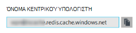
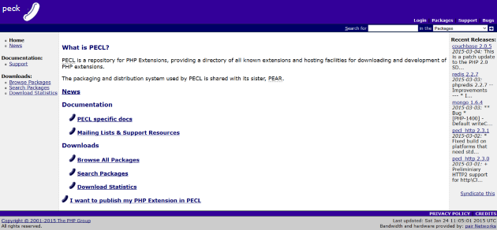
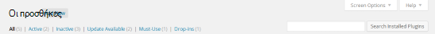
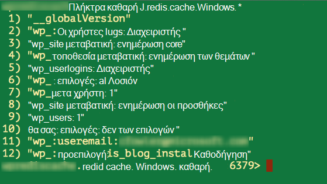

<properties
    pageTitle="Σύνδεση μια εφαρμογή web στο Azure εφαρμογής υπηρεσίας στο Redis Cache μέσω του πρωτοκόλλου Memcache | Microsoft Azure"
    description="Σύνδεση μια εφαρμογή web στο Azure εφαρμογής υπηρεσίας στο Cache Redis χρησιμοποιεί το πρωτόκολλο Memcache"
    services="app-service\web"
    documentationCenter="php"
    authors="SyntaxC4"
    manager="wpickett"
    editor="riande"/>

<tags
    ms.service="app-service-web"
    ms.devlang="php"
    ms.topic="get-started-article"
    ms.tgt_pltfrm="windows"
    ms.workload="na"
    ms.date="02/29/2016"
    ms.author="cfowler"/>

# <a name="connect-a-web-app-in-azure-app-service-to-redis-cache-via-the-memcache-protocol"></a>Σύνδεση μια εφαρμογή web στο Azure εφαρμογής υπηρεσίας στο Redis Cache μέσω του πρωτοκόλλου Memcache

Σε αυτό το άρθρο, θα μάθετε πώς να συνδεθείτε μια εφαρμογή web WordPress στο [Azure εφαρμογής υπηρεσίας](http://go.microsoft.com/fwlink/?LinkId=529714) σε [Azure Redis Cache] [ 12] χρησιμοποιώντας το [Memcache] [ 13] πρωτόκολλο. Εάν έχετε μια υπάρχουσα εφαρμογή web που χρησιμοποιεί ένα διακομιστή Memcached για προσωρινή αποθήκευση στη μνήμη, μπορείτε να μετεγκατάσταση Azure εφαρμογής υπηρεσίας και να χρησιμοποιήσετε τη λύση σε cache ιδίου κατασκευαστή στο Microsoft Azure με μικρή ή καμία αλλαγή σε κώδικα της εφαρμογής σας. Επιπλέον, μπορείτε να χρησιμοποιήσετε το υπάρχον Memcache γνώσεις για να δημιουργήσετε ιδιαίτερα μεταβλητού μεγέθους, κατανεμημένες εφαρμογές στο Azure εφαρμογής υπηρεσίας με Azure Redis Cache για προσωρινή αποθήκευση στη μνήμη, κατά τη χρήση πλαισίων δημοφιλών εφαρμογών, όπως το .NET, PHP, Node.js, Java και Python.  

Εφαρμογή υπηρεσίας Web Apps επιτρέπει σε αυτό το σενάριο εφαρμογής με η προσαρμογή συμβατότητας Memcache εφαρμογές Web, το οποίο είναι ένα τοπικό διακομιστή Memcached που λειτουργεί ως ένα διακομιστή μεσολάβησης Memcache για προσωρινή αποθήκευση κλήσεων στο Azure Redis Cache. Αυτή η δυνατότητα επιτρέπει οποιαδήποτε εφαρμογή που σας ενημερώνει για χρησιμοποιώντας το πρωτόκολλο Memcache σε cache δεδομένα με Redis Cache. Αυτή η επιδιόρθωση συμβατότητας Memcache λειτουργεί στο επίπεδο πρωτόκολλο, ώστε να μπορεί να χρησιμοποιηθεί από οποιαδήποτε εφαρμογή ή εφαρμογή framework με την προϋπόθεση ότι επικοινωνεί με το πρωτόκολλο Memcache.

[AZURE.INCLUDE [app-service-web-to-api-and-mobile](../../includes/app-service-web-to-api-and-mobile.md)] 

## <a name="prerequisites"></a>Προαπαιτούμενα στοιχεία

Η προσαρμογή συμβατότητας Memcache εφαρμογές Web μπορεί να χρησιμοποιηθεί με οποιαδήποτε εφαρμογή, υπό την προϋπόθεση επικοινωνεί με το πρωτόκολλο Memcache. Για το συγκεκριμένο παράδειγμα, η εφαρμογή αναφορά είναι μια τοποθεσία με WordPress που μπορεί να καθοριστεί από το Azure Marketplace.

Ακολουθήστε τα βήματα που περιγράφονται σε αυτά τα άρθρα:

* [Προμήθεια μια παρουσία της υπηρεσίας Redis Cache του Azure][0]
* [Ανάπτυξη μιας τοποθεσίας με WordPress στο Azure][1]

Όταν έχετε ολοκληρώσει την τοποθεσία μεταβλητού μεγέθους WordPress αναπτύσσεται και μια παρουσία Redis Cache παρασχεθεί θα είστε έτοιμοι να συνεχίσετε με την ενεργοποίηση η προσαρμογή συμβατότητας Memcache στο Azure εφαρμογής υπηρεσίας Web Apps.

## <a name="enable-the-web-apps-memcache-shim"></a>Ενεργοποίηση η προσαρμογή συμβατότητας Memcache εφαρμογών Web

Για να ρυθμίσετε τις παραμέτρους προσαρμογής συμβατότητας Memcache, πρέπει να δημιουργήσετε τρεις των ρυθμίσεων της εφαρμογής. Αυτό μπορεί να γίνει χρησιμοποιώντας μια ποικιλία μεθόδων συμπεριλαμβανομένου του [Azure πύλη](http://go.microsoft.com/fwlink/?LinkId=529715), στην [κλασική πύλη][3], τα [Cmdlet του PowerShell Azure] [ 5] ή το [περιβάλλον γραμμής εντολών Azure][5]. Για τους σκοπούς της αυτήν τη δημοσίευση, θα χρησιμοποιήσουν την [Πύλη Azure] [ 4] για να ορίσετε τις ρυθμίσεις εφαρμογής. Τις παρακάτω τιμές μπορεί να ανακτηθεί από blade **Ρυθμίσεις** του Redis Cache παρουσίας.


### <a name="add-redishost-app-setting"></a>Προσθήκη REDIS_HOST εφαρμογή ρύθμισης

Είναι η πρώτη ρύθμιση εφαρμογής που πρέπει να δημιουργήσετε το **REDIS\_HOST** ρύθμιση app. Αυτή η ρύθμιση ορίζει τον προορισμό στην οποία η προσαρμογή συμβατότητας προωθεί τις πληροφορίες του cache. Η τιμή που απαιτείται για τη ρύθμιση της εφαρμογής REDIS_HOST μπορεί να ανακτηθεί από το blade **Ιδιότητες** της παρουσίας σας Redis Cache.



Ορίστε το κλειδί για τη ρύθμιση της εφαρμογής για να **REDIS\_HOST** και την τιμή της ρύθμισης εφαρμογής για το **όνομα κεντρικού υπολογιστή** της παρουσίας του Redis Cache.


### <a name="add-rediskey-app-setting"></a>Προσθήκη REDIS_KEY εφαρμογή ρύθμισης

Η δεύτερη ρύθμιση εφαρμογής που πρέπει να δημιουργήσετε είναι το **REDIS\_ΚΛΕΙΔΊ** ρύθμιση app. Αυτή η ρύθμιση παρέχει το διακριτικό του ελέγχου ταυτότητας που απαιτούνται για την ασφαλή πρόσβαση την παρουσία Redis Cache. Μπορείτε να ανακτήσετε την τιμή που απαιτείται για τη ρύθμιση της εφαρμογής REDIS_KEY από τα **πλήκτρα πρόσβασης** blade της παρουσίας του Redis Cache.


Ορίστε το κλειδί για τη ρύθμιση της εφαρμογής για να **REDIS\_ΚΛΕΙΔΊ** και την τιμή της ρύθμισης εφαρμογής για το **Πρωτεύον κλειδί** της παρουσίας του Redis Cache.


### <a name="add-memcacheshimredisenable-app-setting"></a>Προσθήκη MEMCACHESHIM_REDIS_ENABLE εφαρμογή ρύθμισης

Η τελευταία ρύθμιση εφαρμογής χρησιμοποιείται για να ενεργοποιήσετε την προσαρμογή συμβατότητας Memcache στις εφαρμογές Web, που χρησιμοποιεί το REDIS_HOST και REDIS_KEY για να συνδεθείτε στο cache Redis Azure και προώθηση του cache κλήσεις. Ορίστε το κλειδί για τη ρύθμιση της εφαρμογής για να **MEMCACHESHIM\_REDIS\_ΕΝΕΡΓΟΠΟΊΗΣΗ** και την τιμή στην **τιμή true**.


Μόλις ολοκληρώσετε την προσθήκη τις ρυθμίσεις εφαρμογής τρεις (3), κάντε κλικ στην επιλογή **Αποθήκευση**.

## <a name="enable-memcache-extension-for-php"></a>Ενεργοποίηση της επέκτασης Memcache για PHP

Με τη σειρά για την εφαρμογή για να μιλήσετε το πρωτόκολλο Memcache, είναι απαραίτητο για να εγκαταστήσετε την επέκταση Memcache σε PHP--το πλαίσιο γλώσσα για την τοποθεσία σας WordPress.

### <a name="download-the-phpmemcache-extension"></a>Κάντε λήψη του php_memcache επέκτασης

Αναζήτηση για να [PECL][6]. Στην κατηγορία σε cache, κάντε κλικ στην επιλογή [memcache][7]. Στην περιοχή στοιχεία λήψης στήλη, κάντε κλικ στη σύνδεση DLL.



Κάντε λήψη του τη σύνδεση νήματος μη ασφαλή (Κατεύθυνση) x86 για την έκδοση του PHP με δυνατότητα στις εφαρμογές Web. (Η προεπιλογή είναι PHP 5.4)


### <a name="enable-the-phpmemcache-extension"></a>Ενεργοποιήστε την επέκταση php_memcache

Μετά τη λήψη του αρχείου, αποσυμπίεση και στείλτε το **php\_memcache.dll** σε το **δ:\\αρχική\\τοποθεσία\\wwwroot\\Ανακύκλωσης\\κείμενο\\ ** καταλόγου. Μετά την php_memcache.dll αποστολή στο web app, πρέπει να ενεργοποιήσετε την επέκταση με το χρόνο εκτέλεσης PHP. Για να ενεργοποιήσετε την επέκταση Memcache στην πύλη του Azure, ανοίξτε το blade **Ρυθμίσεις εφαρμογής** για την εφαρμογή web, στη συνέχεια, προσθέστε μια νέα ρύθμιση εφαρμογής με το κλειδί του **PHP\_ΕΠΕΚΤΆΣΕΙΣ** και την τιμή **Ανακύκλωσης\\κείμενο\\php_memcache.dll**.


> [AZURE.NOTE] Εάν η εφαρμογή web πρέπει να φορτώσετε πολλές επεκτάσεις PHP, η τιμή του PHP_EXTENSIONS πρέπει να είναι μια λίστα οριοθετημένο με κόμματα σχετικές διαδρομές στα αρχεία DLL.


Αφού ολοκληρώσετε τη διαδικασία, κάντε κλικ στην επιλογή **Αποθήκευση**.

## <a name="install-memcache-wordpress-plugin"></a>Εγκατάσταση προσθήκης Memcache WordPress

> [AZURE.NOTE] Μπορείτε επίσης να κάνετε λήψη της [Προσθήκης Cache αντικειμένων Memcached](https://wordpress.org/plugins/memcached/) από WordPress.org.

Στη σελίδα WordPress προσθήκες, κάντε κλικ στην επιλογή **Add New**.



Στο πλαίσιο αναζήτησης, πληκτρολογήστε **memcached** και πατήστε το πλήκτρο **Enter**.


Εύρεση **Cache αντικειμένων Memcached** στη λίστα και, στη συνέχεια, κάντε κλικ στο κουμπί **Εγκατάσταση τώρα**.


### <a name="enable-the-memcache-wordpress-plugin"></a>Ενεργοποίηση της προσθήκης Memcache WordPress

>[AZURE.NOTE] Ακολουθήστε τις οδηγίες σε αυτό το ιστολόγιο σχετικά με [τον τρόπο για να ενεργοποιήσετε την επέκταση τοποθεσιών στις εφαρμογές Web] [ 8] για να εγκαταστήσετε το Visual Studio Team Services.

Στο το `wp-config.php` αρχείων, προσθέστε τον ακόλουθο κώδικα πάνω από τον κόμβο Επεξεργασία σχολίου κοντά στο τέλος του αρχείου.

```php
$memcached_servers = array(
    'default' => array('localhost:' . getenv("MEMCACHESHIM_PORT"))
);
```

Όταν έχει έχουν επικολληθεί αυτόν τον κωδικό, Μονακό αποθηκεύει αυτόματα το έγγραφο.

Το επόμενο βήμα είναι να ενεργοποιήσετε την προσθήκη cache αντικειμένων. Αυτό γίνεται με μεταφορά και απόθεση **cache.php αντικείμενο** από το φάκελο **Τμήματος Web-περιεχομένου/προσθήκες/memcached** στο φάκελο **περιεχομένου τμήματος Web** για να ενεργοποιήσετε τη λειτουργία Memcache αντικειμένων στο Cache.


Τώρα που το αρχείο **cache.php αντικείμενο** βρίσκεται στο φάκελο **wp περιεχόμενο** , το Cache αντικειμένων Memcached τώρα είναι ενεργοποιημένη.


## <a name="verify-the-memcache-object-cache-plugin-is-functioning"></a>Επαληθεύστε λειτουργεί η προσθήκη Memcache Cache αντικειμένων

Όλα τα βήματα για να ενεργοποιήσετε την προσαρμογή συμβατότητας Memcache εφαρμογές Web είναι τώρα ολοκληρωθεί. Μόνο αριστερά είναι για να επαληθεύσετε ότι τα δεδομένα είναι συμπληρώνετε σας παρουσία Redis Cache.

### <a name="enable-the-non-ssl-port-support-in-azure-redis-cache"></a>Ενεργοποιήσετε την υποστήριξη χωρίς SSL θύρα στο Azure Redis Cache

>[AZURE.NOTE] Κατά την εγγραφή σε αυτό το άρθρο, το CLI Redis δεν υποστηρίζει SSL συνδεσιμότητας, επομένως, απαιτούνται τα παρακάτω βήματα.

Στην πύλη του Azure, αναζητήστε την παρουσία Redis Cache που δημιουργήσατε για αυτήν την εφαρμογή web. Όταν το cache blade είναι ανοιχτό, κάντε κλικ στο εικονίδιο **Ρυθμίσεις** .


Επιλέξτε **Access θύρες** από τη λίστα.


Κάντε κλικ στην επιλογή " **όχι** " για **να επιτρέπεται η πρόσβαση μόνο μέσω SSL**.


Θα δείτε ότι τώρα έχει οριστεί η θύρα μη SSL. Κάντε κλικ στην επιλογή **Αποθήκευση**.


### <a name="connect-to-azure-redis-cache-from-redis-cli"></a>Σύνδεση σε Azure Redis Cache από redis cli

>[AZURE.NOTE] Αυτό το βήμα προϋποθέτει redis που είναι εγκατεστημένο τοπικά στον υπολογιστή σας στην ανάπτυξη. [Εγκατάσταση Redis τοπικά με αυτές τις οδηγίες][9].

Ανοίξτε την κονσόλα γραμμής εντολών της επιλογής και πληκτρολογήστε την ακόλουθη εντολή:

```shell
redis-cli –h <hostname-for-redis-cache> –a <primary-key-for-redis-cache> –p 6379
```

Αντικαταστήστε το ** &lt;όνομα κεντρικού υπολογιστή για redis cache&gt; ** με το όνομα κεντρικού υπολογιστή πραγματική xxxxx.redis.cache.windows.net και το ** &lt;πρωτεύοντος κλειδιού για redis cache&gt; ** με το πλήκτρο πρόσβασης για το cache, στη συνέχεια, πατήστε το πλήκτρο **Enter**. Μόλις το CLI έχει συνδεθεί με την παρουσία Redis Cache, θεμάτων οποιαδήποτε εντολή redis. Στο παρακάτω στιγμιότυπο, να έχετε επιλέξει να παρουσιάζουν τα πλήκτρα.



Η κλήση για να παραθέσετε τα πλήκτρα πρέπει να επιστρέψει μια τιμή. Εάν όχι, δοκιμάστε περιήγηση στην εφαρμογή web και δοκιμάστε ξανά.

## <a name="conclusion"></a>Ολοκλήρωση

Συγχαρητήρια! Η εφαρμογή WordPress τώρα διαθέτει μια κεντρική σε μνήμη cache για βοήθεια στη αυξανόμενου μεταγωγή. Να θυμάστε, η προσαρμογή συμβατότητας Memcache εφαρμογές Web μπορούν να χρησιμοποιηθούν με οποιοδήποτε πρόγραμμα-πελάτη Memcache ανεξάρτητα από τη γλώσσα προγραμματισμού ή πλαίσιο εργασίας εφαρμογών. Για να παρέχετε σχόλια ή για να υποβάλετε ερωτήσεις σχετικά με την προσαρμογή συμβατότητας Memcache εφαρμογές Web, καταχώρηση στα [Φόρουμ MSDN] [ 10] ή [Stackoverflow][11].

>[AZURE.NOTE] Εάν θέλετε να γρήγορα αποτελέσματα με το Azure εφαρμογής υπηρεσίας πριν από την εγγραφή για λογαριασμό Azure, μεταβείτε στο [Δοκιμάστε εφαρμογής υπηρεσίας](http://go.microsoft.com/fwlink/?LinkId=523751), όπου μπορείτε να αμέσως δημιουργήσετε μια εφαρμογή web μικρής διάρκειας starter στην εφαρμογή υπηρεσίας. Δεν υπάρχει πιστωτικές κάρτες υποχρεωτικό, χωρίς δεσμεύσεις.

## <a name="whats-changed"></a>Τι έχει αλλάξει
* Για οδηγίες για την αλλαγή από τοποθεσίες Web App υπηρεσία ανατρέξτε στο θέμα: [Azure εφαρμογής υπηρεσίας και τις επιπτώσεις της σχετικά με τις υπάρχουσες υπηρεσίες Azure](http://go.microsoft.com/fwlink/?LinkId=529714)


[0]: ../redis-cache/cache-dotnet-how-to-use-azure-redis-cache.md#create-a-cache
[1]: http://bit.ly/1t0KxBQ
[2]: http://manage.windowsazure.com
[3]: http://portal.azure.com
[4]: ../powershell-install-configure.md
[5]: /downloads
[6]: http://pecl.php.net
[7]: http://pecl.php.net/package/memcache
[8]: http://blog.syntaxc4.net/post/2015/02/05/how-to-enable-a-site-extension-in-azure-websites.aspx
[9]: http://redis.io/download#installation
[10]: https://social.msdn.microsoft.com/Forums/home?forum=windowsazurewebsitespreview
[11]: http://stackoverflow.com/questions/tagged/azure-web-sites
[12]: /services/cache/
[13]: http://memcached.org
