<properties
   pageTitle="Δημιουργία μιας εφαρμογής web ASP.NET 5 στον κώδικα Visual Studio"
   description="Αυτό το πρόγραμμα εκμάθησης παρουσιάζει πώς μπορείτε να δημιουργήσετε μια εφαρμογή web ASP.NET 5 χρήση κώδικα Visual Studio."
   services="app-service\web"
   documentationCenter=".net"
   authors="erikre"
   manager="wpickett"
   editor="jimbe"/>

<tags
    ms.service="app-service-web" 
    ms.workload="web" 
    ms.tgt_pltfrm="dotnet" 
    ms.devlang="na" 
    ms.topic="article" 
    ms.date="02/26/2016" 
    ms.author="cephalin"/>

# Δημιουργία μιας εφαρμογής web ASP.NET 5 στον κώδικα Visual Studio

## Επισκόπηση

Αυτό το πρόγραμμα εκμάθησης θα μάθετε πώς να δημιουργήσετε μια εφαρμογή web ASP.NET 5 χρησιμοποιώντας [Visual Studio κωδικό (και στο κωδικός)](http://code.visualstudio.com//Docs/whyvscode) και την αναπτύξει [Azure εφαρμογής υπηρεσίας](../app-service/app-service-value-prop-what-is.md). 

> [AZURE.NOTE] Παρόλο που αυτό το άρθρο αναφέρεται σε εφαρμογές web, ισχύει επίσης για το API εφαρμογές και εφαρμογές για κινητές συσκευές. 

ASP.NET 5 είναι μια σημαντική επανασχεδιασμού του ASP.NET. ASP.NET 5 είναι ένα νέο πλαίσιο Άνοιγμα προέλευσης και την πλατφόρμα για τη δημιουργία εφαρμογές web σύγχρονο βασίζεται στο cloud χρησιμοποιώντας .NET. Για περισσότερες πληροφορίες, ανατρέξτε στο θέμα [Εισαγωγή στις ASP.NET 5](http://docs.asp.net/en/latest/conceptual-overview/aspnet.html). Για πληροφορίες σχετικά με τις εφαρμογές web Azure εφαρμογής υπηρεσίας, ανατρέξτε στο θέμα [Επισκόπηση εφαρμογές Web](app-service-web-overview.md).

[AZURE.INCLUDE [app-service-web-try-app-service.md](../../includes/app-service-web-try-app-service.md)]

## Προαπαιτούμενα στοιχεία  

* Εγκαταστήστε [και στο κώδικα](http://code.visualstudio.com/Docs/setup).
* Εγκατάσταση [Node.js](http://nodejs.org) - Node.js είναι μια πλατφόρμα για τη δημιουργία εφαρμογών διακομιστή γρήγορα και με χρήση της JavaScript. Ο κόμβος είναι το περιβάλλον εκτέλεσης (κόμβο) και [npm](http://www.npmjs.com/) είναι ο διευθυντής πακέτου για λειτουργικές μονάδες κόμβο. Θα χρησιμοποιήσετε npm να scaffold μια εφαρμογή web ASP.NET 5 σε αυτό το πρόγραμμα εκμάθησης.
* Εγκατάσταση Git - μπορείτε να το εγκαταστήσετε από οποιαδήποτε από αυτές τις τοποθεσίες: [Chocolatey](https://chocolatey.org/packages/git) ή [git scm.com](http://git-scm.com/downloads). Εάν είστε νέος χρήστης του Git, επιλέξτε [git scm.com](http://git-scm.com/downloads) και την επιλογή για **Χρήση Git από τη γραμμή εντολών των Windows**. Όταν εγκαταστήσετε Git, θα χρειαστεί επίσης να ορίσετε το όνομα χρήστη Git και ηλεκτρονικού ταχυδρομείου όπως απαιτείται αργότερα στην εκμάθηση (κατά την εκτέλεση μιας ολοκλήρωσης από τον κώδικα και στο).  

## Εγκατάσταση του ASP.NET 5 και DNX
5/DNX ASP.NET (το περιβάλλον εκτέλεσης .NET) είναι μια λιτής στοίβα .NET για τη δημιουργία σύγχρονο cloud και σε εφαρμογές web που εκτελούνται σε λειτουργικό σύστημα OS X, Linux και Windows. Περιλαμβάνει έχει δημιουργηθεί από το μηδέν προς τα επάνω για να παρέχουν ένα πλαίσιο ανάπτυξης βελτιστοποιημένη για εφαρμογές που έχουν αναπτυχθεί στο cloud είτε εκτέλεση εσωτερικής εγκατάστασης. Αποτελείται από λειτουργική στοιχεία με ελάχιστους επιβάρυνσης, ώστε να μπορείτε να διατηρήσετε ευελιξία κατά τη δημιουργία λύσεων του.

Αυτό το πρόγραμμα εκμάθησης έχει σχεδιαστεί για να ξεκινήσετε τη δημιουργία εφαρμογών με τις πιο πρόσφατες εκδόσεις ανάπτυξης του ASP.NET 5 και DNX. Οι παρακάτω οδηγίες αφορούν ειδικά για Windows. Για πιο λεπτομερείς οδηγίες εγκατάστασης για το λειτουργικό σύστημα OS X, Linux και των Windows, ανατρέξτε στο θέμα [εγκατάσταση 5 ASP.NET και DNX](https://code.visualstudio.com/Docs/ASPnet5#_installing-aspnet-5-and-dnx). 

1. Για να εγκαταστήσετε το .NET έκδοση Manager (DNVM) στα Windows, ανοίξτε μια γραμμή εντολών και εκτελέστε την ακόλουθη εντολή.

        @powershell -NoProfile -ExecutionPolicy unrestricted -Command "&{$Branch='dev';iex ((new-object net.webclient).DownloadString('https://raw.githubusercontent.com/aspnet/Home/dev/dnvminstall.ps1'))}"

    Αυτό θα κάνετε λήψη της δέσμης ενεργειών DNVM και να το τοποθετήσετε σε κατάλογο του προφίλ χρήστη σας. 

2. **Επανεκκινήστε τα Windows** για να ολοκληρωθεί η εγκατάσταση DNVM. 

    Μετά την επανεκκίνηση των Windows, μπορείτε να ανοίξετε τη γραμμή εντολών για να επαληθεύσετε τη θέση του DNVM, πληκτρολογώντας τα εξής:

        where dnvm

    Γραμμή εντολών θα εμφανιστεί μια διαδρομή παρόμοια με την ακόλουθη.

    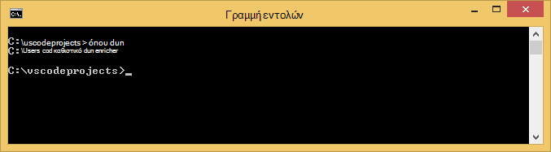

3. Τώρα που έχετε DNVM, πρέπει να χρησιμοποιείτε για να κάνετε λήψη DNX για να εκτελέσετε τις εφαρμογές σας. Εκτελέστε την ακόλουθη στη γραμμή εντολών:

        dnvm upgrade

    Επαλήθευση του DNVM και προβάλετε το ενεργό περιβάλλον εκτέλεσης, πληκτρολογώντας τα εξής στη γραμμή εντολών:

        dnvm list

    Γραμμή εντολών θα εμφανίζουν τις λεπτομέρειες του ενεργού χρόνου εκτέλεσης.

    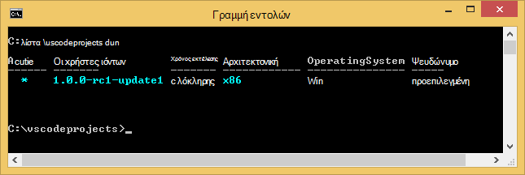

    Εάν αναφέρονται περισσότερες από μία χρόνου εκτέλεσης DNX, μπορείτε να επιλέξετε να εισαγάγετε τα εξής (ή μια πιο πρόσφατη έκδοση) στη γραμμή εντολών για να ορίσετε το ενεργό περιβάλλον εκτέλεσης DNX. Ρυθμίστε την ίδια έκδοση που χρησιμοποιείται από τη γεννήτρια ASP.NET 5 όταν δημιουργείτε την εφαρμογή web της παρακάτω σε αυτό το πρόγραμμα εκμάθησης. *Δεν μπορεί να πρέπει να αλλάξετε το ενεργό περιβάλλον εκτέλεσης, αν έχει ρυθμιστεί να την πιο πρόσφατη διαθέσιμη.*

        dnvm use 1.0.0-update1 –p

> [AZURE.NOTE] Για πιο λεπτομερείς οδηγίες εγκατάστασης για το λειτουργικό σύστημα OS X, Linux και των Windows, ανατρέξτε στο θέμα [εγκατάσταση 5 ASP.NET και DNX](https://code.visualstudio.com/Docs/ASPnet5#_installing-aspnet-5-and-dnx). 

## Δημιουργία της εφαρμογής web 

Αυτή η ενότητα σας δείχνει πώς μπορείτε να scaffold μια νέα εφαρμογή web ASP.NET εφαρμογής. Θα μπορείτε να χρησιμοποιήσετε τη Διαχείριση πακέτου κόμβου (npm) για να εγκαταστήσετε το [Yeoman](http://yeoman.io/) (εργαλείο ικριώματος εφαρμογών - κώδικα και στο ισοδύναμο της του Visual Studio **Αρχείο > νέο έργο** λειτουργίας), [Grunt](http://gruntjs.com/) (δρομέα εργασίας JavaScript) και [Bower](http://bower.io/) (Διαχείριση πακέτου πλευρά του προγράμματος-πελάτη). 

1. Ανοίξτε μια γραμμή εντολών με δικαιώματα διαχειριστή και μεταβείτε στη θέση όπου θέλετε να δημιουργήσετε το έργο σας ASP.NET. Για παράδειγμα, να δημιουργήσετε έναν κατάλογο *vscodeprojects* στη ρίζα της γ:\.

2. Πληκτρολογήστε τα εξής στη γραμμή εντολών για την εγκατάσταση Yeoman και τα εργαλεία υποστήριξης.

        npm install -g yo grunt-cli generator-aspnet bower

    > [AZURE.NOTE] Ενδέχεται να εμφανιστεί μια προειδοποίηση που υποδεικνύει την ύπαρξη ότι η έκδοση npm είναι ενημερωμένα. Αυτή η προειδοποίηση δεν θα πρέπει να επηρεάζει αυτό το πρόγραμμα εκμάθησης.

3. Πληκτρολογήστε τα εξής στη γραμμή εντολών για να δημιουργήσετε το φάκελο έργου και scaffold της εφαρμογής.

        yo aspnet

4. Χρησιμοποιήστε τα πλήκτρα βέλους για να επιλέξετε τον τύπο **Βασικές εφαρμογής Web** από το μενού γεννήτρια ASP.NET 5 και πατήστε το πλήκτρο ** &lt;Enter >**.

    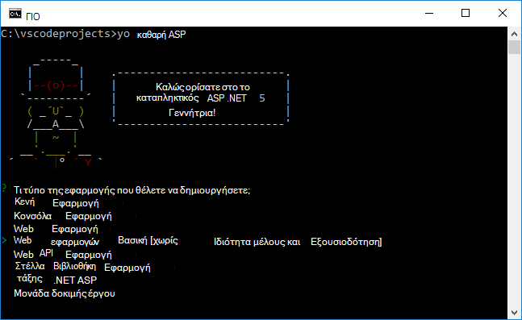

5. Ορίστε το όνομα της νέας εφαρμογής web ASP.NET σε **SampleWebApp**. Καθώς αυτό το όνομα χρησιμοποιείται σε όλο το πρόγραμμα εκμάθησης, εάν επιλέξετε ένα διαφορετικό όνομα, θα χρειαστεί να αντικαταστήσετε το για κάθε παρουσία του **SampleWebApp**. Όταν πατήσετε ** &lt;Enter >**, Yeoman θα δημιουργήσετε ένα νέο φάκελο που ονομάζεται **SampleWebApp** και τα απαραίτητα αρχεία για τη νέα εφαρμογή.

6. Στη γραμμή εντολών, αλλάξτε σε καταλόγους στον νέο φάκελο έργου:

        cd SampleWebApp

7. Επίσης στη γραμμή εντολών, για να εγκαταστήσετε τα απαραίτητα πακέτα NuGet για να εκτελέσετε την εφαρμογή, εισαγάγετε την ακόλουθη εντολή:

        dnu restore

8. Ανοίξτε και στο κώδικα, πληκτρολογώντας τα εξής στη γραμμή εντολών:

        code .

## Εκτελέστε την εφαρμογή web τοπικά

Τώρα που έχετε δημιουργήσει την εφαρμογή web και ανάκτηση όλα τα πακέτα NuGet για την εφαρμογή, μπορείτε να εκτελέσετε τοπικά στην εφαρμογή web.

1. Από την **Παλέτα εντολή** ΣΎΓΚΡΙΣΗ κώδικα, πληκτρολογήστε τα εξής για να εμφανίσετε τις επιλογές διαθέσιμες εντολή "Εκτέλεση":

        dnx: Run Command

    > [AZURE.NOTE] Εάν ο διακομιστής Omnisharp δεν εκτελείται τη συγκεκριμένη στιγμή, θα ξεκινήσει προς τα επάνω. Εισαγάγετε ξανά την παραπάνω εντολή.

    Στη συνέχεια, επιλέξτε την παρακάτω εντολή για να εκτελέσετε την εφαρμογή web της:
        
        dnx web - (SampleWebApp)

    Το παράθυρο εντολών θα εμφανίζεται ότι έχει ξεκινήσει η εφαρμογή. Εάν το παράθυρο εντολών δεν εμφανίζεται αυτό το μήνυμα, επιλέξτε το κάτω αριστερό corning και στο κώδικα για σφάλματα στο έργο σας.
    
    > [AZURE.NOTE]Έκδοση εντολής από την **Παλέτα εντολή** απαιτεί μια **>** στην αρχή της γραμμής εντολών. Μπορείτε να προβάλετε τις λεπτομέρειες που σχετίζονται με την εντολή **web** στο αρχείο *project.json* .   
    > Εάν η εντολή δεν εμφανίζεται ή δεν είναι διαθέσιμη, ίσως χρειαστεί να εγκαταστήσετε την επέκταση C#. Εκτέλεση `>Extensions: Install Extension` και `ext install c#` να εγκαταστήσετε τις επεκτάσεις C#.

2. Ανοίξτε ένα πρόγραμμα περιήγησης και μεταβείτε στην ακόλουθη διεύθυνση URL.

    **http://localhost:5000**

    Προεπιλεγμένη σελίδα του web app θα εμφανίζεται ως εξής.

    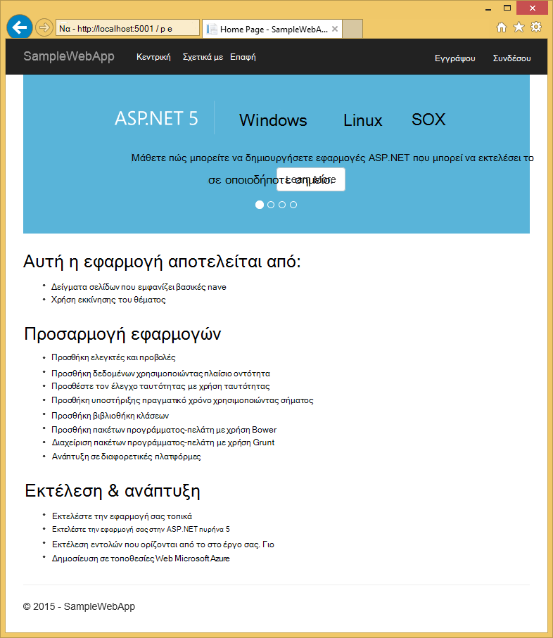

3. Κλείστε το πρόγραμμα περιήγησης. Στο **Παράθυρο γραμμής εντολών**, πατήστε το **Συνδυασμό πλήκτρων Ctrl + C** για να τερματίσετε την εφαρμογή και να κλείσετε το **Παράθυρο γραμμής εντολών**. 

## Δημιουργία εφαρμογής web στην πύλη του Azure

Ακολουθήστε τα παρακάτω βήματα θα σας καθοδηγήσει Δημιουργία εφαρμογής web στην πύλη του Azure.

1. Συνδεθείτε [πύλη του Azure](https://portal.azure.com).

2. Κάντε κλικ στην επιλογή " **ΔΗΜΙΟΥΡΓΊΑ** " στο επάνω αριστερό μέρος της πύλης.

3. Κάντε κλικ στην επιλογή **Web Apps > Web App**.

    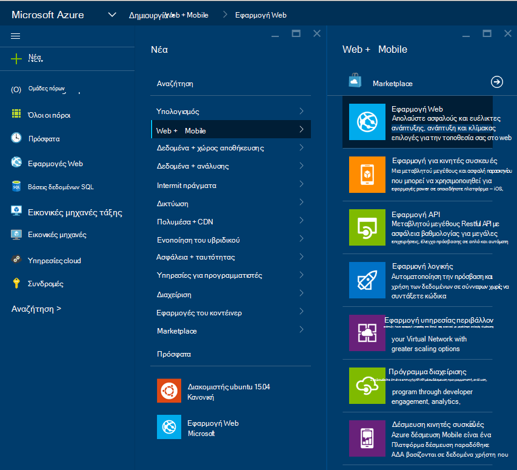

4. Πληκτρολογήστε μια τιμή για **το όνομα**, όπως **SampleWebAppDemo**. Σημειώστε ότι αυτό το όνομα πρέπει να είναι μοναδικό και την πύλη θα η επιβολή που όταν προσπαθείτε να εισαγάγετε το όνομα. Επομένως, εάν επιλέξετε μια διαφορετική τιμή enter, θα χρειαστεί να αντικαταστήσετε αυτήν την τιμή για κάθε παρουσία του **SampleWebAppDemo** που βλέπετε σε αυτό το πρόγραμμα εκμάθησης. 

5. Επιλέξτε μια υπάρχουσα **Εφαρμογή υπηρεσίας πρόγραμμα** ή δημιουργήστε ένα νέο. Εάν δημιουργήσετε ένα νέο πρόγραμμα, επιλέξτε το επίπεδο τιμολόγησης, θέση και άλλες επιλογές. Για περισσότερες πληροφορίες σχετικά με σχέδια εφαρμογής υπηρεσίας, ανατρέξτε στο άρθρο, [Επισκόπηση αναλυτικά σχέδια Azure εφαρμογής υπηρεσίας](../app-service/azure-web-sites-web-hosting-plans-in-depth-overview.md).

    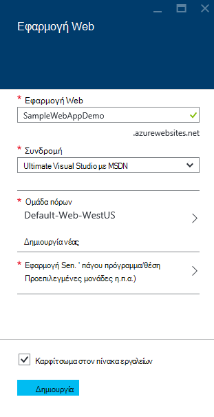

6. Κάντε κλικ στην επιλογή **Δημιουργία**.

    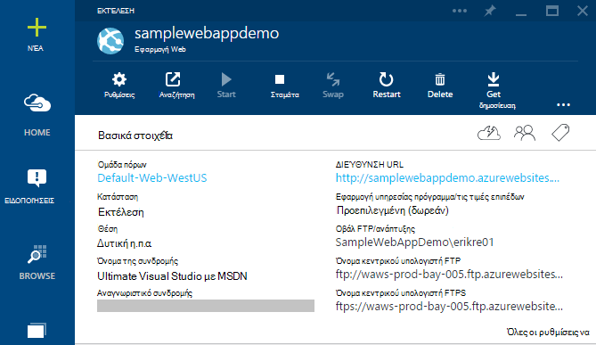

## Ενεργοποίηση της δημοσίευσης Git για τη νέα εφαρμογή web

Git είναι ένα σύστημα ελέγχου κατανέμεται έκδοση που μπορείτε να χρησιμοποιήσετε για να αναπτύξετε την εφαρμογή web της εφαρμογής υπηρεσίας Azure. Θα μπορείτε να αποθηκεύσετε τον κωδικό γράφετε για την εφαρμογή web της σε ένα τοπικό αρχείο φύλαξης Git και θα αναπτύξετε τον κωδικό για να Azure πατώντας σε έναν απομακρυσμένο χώρο αποθήκευσης.   

1. Σύνδεση στο [Azure πύλη](https://portal.azure.com).

2. Κάντε κλικ στο κουμπί **Αναζήτηση**.

3. Κάντε κλικ στην επιλογή **Εφαρμογές Web** για να προβάλετε μια λίστα με τις εφαρμογές web που σχετίζονται με τη συνδρομή σας στο Azure.

4. Επιλέξτε την εφαρμογή web που δημιουργήσατε σε αυτό το πρόγραμμα εκμάθησης.

5. Στο blade την εφαρμογή web, κάντε κλικ στην επιλογή **Ρυθμίσεις** > **συνεχούς ανάπτυξης**. 

    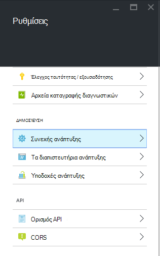

6. Κάντε κλικ στην επιλογή **Επιλέξτε προέλευσης > τοπικό αποθετήριο Git**.

7. Κάντε κλικ στο **κουμπί OK**.

    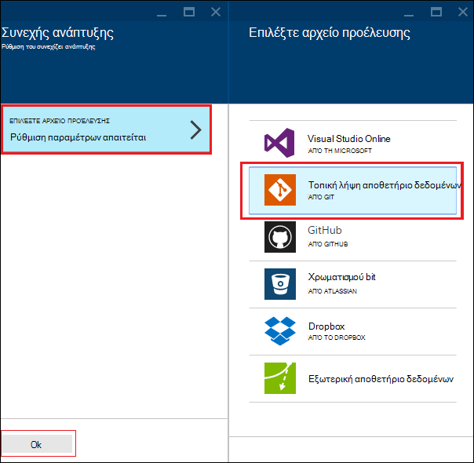

8. Εάν δεν έχετε ορίσει προηγουμένως διαπιστευτήρια ανάπτυξης για τη δημοσίευση μια εφαρμογή web ή άλλων εφαρμογών εφαρμογής υπηρεσίας, ρυθμίσετε τώρα:

    * Κάντε κλικ στην επιλογή **Ρυθμίσεις** > **ανάπτυξης διαπιστευτήρια**. Θα εμφανιστεί το blade **Ορισμός διαπιστευτηρίων ανάπτυξης** .

    * Δημιουργήστε ένα όνομα χρήστη και τον κωδικό πρόσβασης.  Θα χρειαστείτε αυτόν τον κωδικό πρόσβασης αργότερα κατά τη ρύθμιση του Git.

    * Κάντε κλικ στην επιλογή **Αποθήκευση**.

9. Στο blade της εφαρμογής σας web, κάντε κλικ στην επιλογή **Ρυθμίσεις > Ιδιότητες**. Η διεύθυνση URL του απομακρυσμένου αποθετηρίου Git που θα αναπτύξετε για να εμφανίζεται στην περιοχή **Διεύθυνση URL GIT**.

10. Αντιγράψτε την τιμή **Διεύθυνσης URL GIT** για μελλοντική χρήση στην εκμάθηση.

    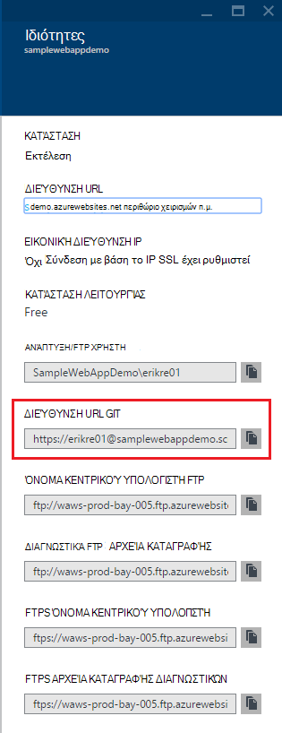

## Δημοσίευση της εφαρμογής web σας στο Azure εφαρμογής υπηρεσίας

Σε αυτήν την ενότητα, θα δημιουργήσετε ένα τοπικό αρχείο φύλαξης Git και push από χώρο αποθήκευσης που να Azure για να αναπτύξετε την εφαρμογή web της σε Azure.

1. ΣΎΓΚΡΙΣΗ κώδικα, ενεργοποιήστε την επιλογή **Git** στην αριστερή γραμμή περιήγησης.

    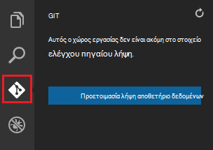

2. Επιλέξτε την **Προετοιμασία git αποθετήριο δεδομένων** για να βεβαιωθείτε ότι είναι του χώρου εργασίας σας στο στοιχείο ελέγχου πηγαίου git. 

    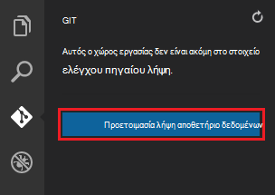

3. Ανοίξτε το παράθυρο εντολών και αλλάξτε σε καταλόγους στον κατάλογο της εφαρμογής web. Στη συνέχεια, εισαγάγετε την ακόλουθη εντολή:

        git config core.autocrlf false

    Αυτή η εντολή αποτρέπει ένα ζήτημα σχετικά με το κείμενο όπου συμπεριλαμβάνονται καταλήξεις CRLF και καταλήξεις LF.

4. ΣΎΓΚΡΙΣΗ κώδικα, προσθέστε ένα μήνυμα ολοκλήρωσης και κάντε κλικ στο εικονίδιο ελέγχου **Ολοκλήρωση όλων** .

    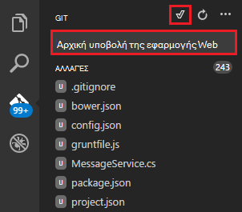

5. Μετά την ολοκλήρωση επεξεργασίας Git, θα δείτε ότι δεν υπάρχουν αρχεία που εμφανίζεται στο παράθυρο Git στην περιοχή **αλλαγές**. 

    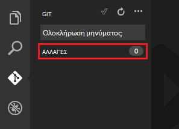

6. Επαναφέρετε το παράθυρο εντολών όπου δείχνει τη γραμμή εντολών στον κατάλογο όπου βρίσκεται η εφαρμογή web της.

7. Δημιουργήστε μια απομακρυσμένη αναφορά για την προώθηση ενημερώσεις σε εφαρμογή web της, χρησιμοποιώντας τη διεύθυνση URL Git (που τελειώνουν σε ".git") που αντιγράψατε προηγουμένως.

        git remote add azure [URL for remote repository]

8. Ρύθμιση παραμέτρων Git για να αποθηκεύσετε τοπικά τα διαπιστευτήριά σας, ώστε αυτές θα προσαρτηθεί αυτόματα τις εντολές push που δημιουργούνται από κώδικα και στο.

        git config credential.helper store

9. Προωθήσετε τις αλλαγές σας σε Azure, πληκτρολογώντας την ακόλουθη εντολή. Μετά από αυτό αρχικό push για Azure, θα μπορείτε να το κάνετε όλων των εντολών push από κώδικα και στο. 

        git push -u azure master

    Θα σας ζητηθεί για τον κωδικό πρόσβασης που δημιουργήσατε νωρίτερα σε Azure. **Σημείωση: Τον κωδικό πρόσβασής σας δεν θα είναι ορατό.**

    Το αποτέλεσμα από την παραπάνω εντολή τελειώνει με ένα μήνυμα ότι είναι επιτυχής ανάπτυξης.

        remote: Deployment successful.
        To https://user@testsite.scm.azurewebsites.net/testsite.git
        [new branch]      master -> master

> [AZURE.NOTE] Εάν κάνετε αλλαγές για την εφαρμογή σας, να αναδημοσιεύετε απευθείας στον κώδικα και στο χρησιμοποιώντας τις ενσωματωμένες λειτουργίες Git με την επιλογή **Ολοκλήρωση όλων** ακολουθούμενο από την επιλογή **Push** . Θα βρείτε την επιλογή **Push** διαθέσιμη στο αναπτυσσόμενο μενού δίπλα στα κουμπιά **Ολοκλήρωση όλων** και να **ανανεώσετε** .

Εάν χρειάζεται να συνεργαστείτε σε ένα έργο, πρέπει να λάβετε υπόψη προώθηση σε GitHub ανάμεσα στα προώθηση σε Azure.

## Εκτελέστε την εφαρμογή στο Azure
Τώρα που έχετε αναπτύξει την εφαρμογή web της, ας εκτελέστε την εφαρμογή ενώ φιλοξενείται στο Azure. 

Αυτό μπορεί να γίνει με δύο τρόπους:

* Ανοίξτε ένα πρόγραμμα περιήγησης και πληκτρολογήστε το όνομα της εφαρμογής web ως εξής.   

        http://SampleWebAppDemo.azurewebsites.net
 
* Στην πύλη του Azure, εντοπίστε το blade εφαρμογής web για την εφαρμογή web σας και κάντε κλικ στο κουμπί **Αναζήτηση** για να δείτε την εφαρμογή σας 
* στο προεπιλεγμένο πρόγραμμα περιήγησης.

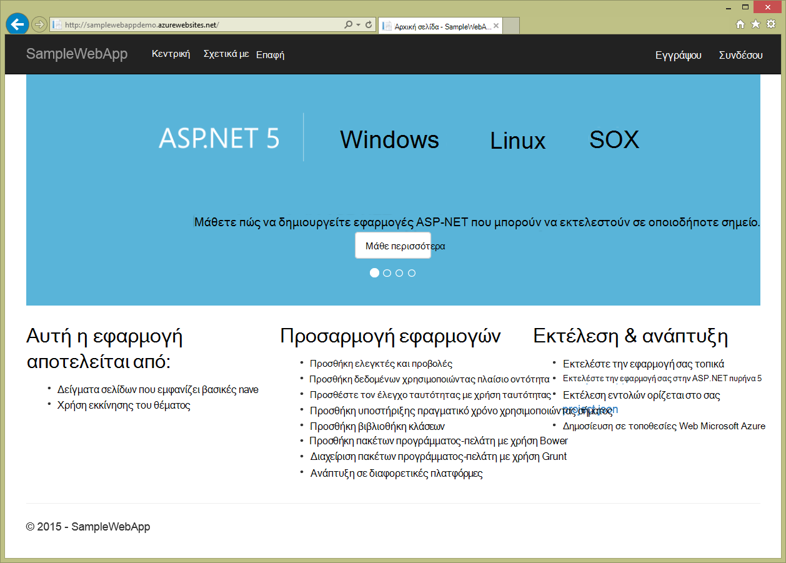

## Σύνοψη
Σε αυτό το πρόγραμμα εκμάθησης, μάθατε πώς να δημιουργήσετε μια εφαρμογή web στον κώδικα και στο και να αναπτύξετε για Azure. Για περισσότερες πληροφορίες σχετικά με τη ΣΎΓΚΡΙΣΗ κώδικα, ανατρέξτε στο άρθρο, [Γιατί κώδικα Visual Studio;](https://code.visualstudio.com/Docs/) Για πληροφορίες σχετικά με τις εφαρμογές web της εφαρμογής υπηρεσίας, ανατρέξτε στο θέμα [Επισκόπηση εφαρμογές Web](app-service-web-overview.md). 
