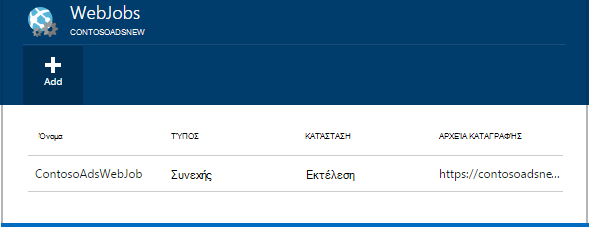
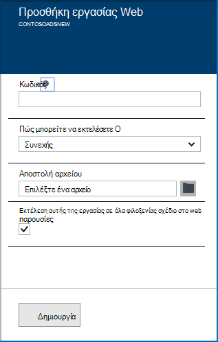
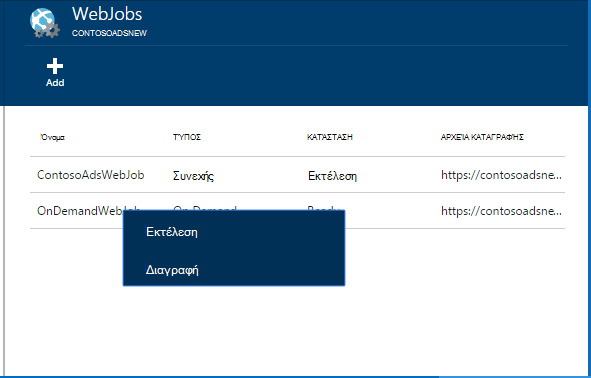
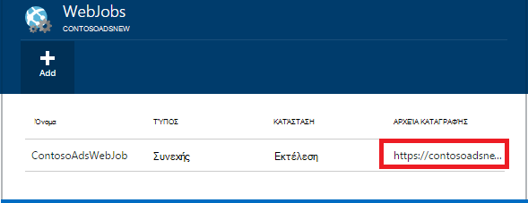

<properties 
    pageTitle="Εκτέλεση εργασιών παρασκηνίου με WebJobs" 
    description="Μάθετε πώς μπορείτε να εκτελέσετε εργασίες στο παρασκήνιο στις εφαρμογές Azure web." 
    services="app-service" 
    documentationCenter="" 
    authors="tdykstra" 
    manager="wpickett" 
    editor="jimbe"/>

<tags 
    ms.service="app-service" 
    ms.workload="na" 
    ms.tgt_pltfrm="na" 
    ms.devlang="na" 
    ms.topic="article" 
    ms.date="04/27/2016" 
    ms.author="tdykstra"/>

# <a name="run-background-tasks-with-webjobs"></a>Εκτέλεση εργασιών παρασκηνίου με WebJobs

## <a name="overview"></a>Επισκόπηση

Μπορείτε να εκτελέσετε προγράμματα ή δέσμες ενεργειών σε WebJobs στην εφαρμογή web της [Εφαρμογής υπηρεσίας](http://go.microsoft.com/fwlink/?LinkId=529714) με τρεις τρόπους: κατ ' απαίτηση, συνεχώς, ή σε ένα χρονοδιάγραμμα. Δεν υπάρχει χωρίς πρόσθετο κόστος για να χρησιμοποιήσετε WebJobs.

Αυτό το άρθρο παρουσιάζει τον τρόπο ανάπτυξης WebJobs, με την [Πύλη Azure](https://portal.azure.com). Για πληροφορίες σχετικά με τον τρόπο ανάπτυξης με χρήση του Visual Studio ή μια διαδικασία συνεχούς παράδοσης, δείτε [πώς μπορείτε να αναπτύξετε WebJobs Azure στις εφαρμογές Web Apps](websites-dotnet-deploy-webjobs.md).

Το SDK WebJobs Azure απλοποιεί πολλά WebJobs προγραμματισμού εργασιών. Για περισσότερες πληροφορίες, ανατρέξτε στο θέμα [Τι είναι το SDK WebJobs](websites-dotnet-webjobs-sdk.md).

 Azure συναρτήσεις (αυτήν τη στιγμή στην έκδοση preview) είναι ένας άλλος τρόπος για να εκτελέσετε τα προγράμματα και τις δέσμες ενεργειών σε Azure εφαρμογής υπηρεσίας. Για περισσότερες πληροφορίες, ανατρέξτε στο θέμα [Επισκόπηση Azure συναρτήσεις](../azure-functions/functions-overview.md).

[AZURE.INCLUDE [app-service-web-to-api-and-mobile](../../includes/app-service-web-to-api-and-mobile.md)] 

## <a name="acceptablefiles"></a>Τύποι αρχείων αποδεκτή για δέσμες ενεργειών ή προγράμματα

Γίνονται δεκτές τους παρακάτω τύπους αρχείων:

* . cmd., .bat, .exe (χρησιμοποιώντας windows cmd)
* .ps1 (με χρήση του powershell)
* .Sh (χρησιμοποιώντας πάρτι)
* .PHP (χρησιμοποιώντας php)
* .PY (χρησιμοποιώντας python)
* .js (χρησιμοποιώντας κόμβου)
* .jar (χρησιμοποιώντας java)

## <a name="CreateOnDemand"></a>Δημιουργήστε μια ενεργοποίηση απαιτήσεων WebJob στην πύλη

1. Στο το blade **Web App** από την [Πύλη Azure](https://portal.azure.com), κάντε κλικ στην επιλογή **όλες τις ρυθμίσεις > WebJobs** για να εμφανίσετε το blade **WebJobs** .
    
    
    
5. Κάντε κλικ στην επιλογή **Προσθήκη**. Εμφανίζεται το παράθυρο διαλόγου **Προσθήκη WebJob** .
    
    
    
2. Στην περιοχή **όνομα**, δώστε ένα όνομα για το WebJob. Το όνομα πρέπει να ξεκινά με ένα γράμμα ή έναν αριθμό και δεν μπορεί να περιέχει ειδικούς χαρακτήρες, εκτός από "-" και "_".
    
4. Στο παράθυρο διαλόγου **τον τρόπο εκτέλεσης** , επιλέξτε **Εκτέλεση ζήτηση**.
    
3. Στο παράθυρο διαλόγου **Αποστολή αρχείου** , κάντε κλικ στο εικονίδιο του φακέλου και αναζητήστε το αρχείο zip που περιέχει τη δέσμη ενεργειών. Το αρχείο zip πρέπει να περιέχει το εκτελέσιμο αρχείο (.exe. cmd. .bat .sh .php .py .js), καθώς και οποιαδήποτε αρχεία υποστήριξης που απαιτείται για την εκτέλεση του προγράμματος ή δέσμης ενεργειών.
    
5. Επιλέξτε **Δημιουργία** για να αποστείλετε τη δέσμη ενεργειών σε εφαρμογή web. 
    
    Το όνομα που ορίσατε για το WebJob εμφανίζεται στη λίστα το blade **WebJobs** .
    
6. Για να εκτελέσετε το WebJob, κάντε δεξί κλικ στο όνομά της στη λίστα και κάντε κλικ στην επιλογή **Εκτέλεση**.
    
    
    
## <a name="CreateContinuous"></a>Δημιουργήστε ένα συνεχώς εκτελείται WebJob

1. Για να δημιουργήσετε μια συνεχώς εκτέλεση WebJob, ακολουθήστε τα ίδια βήματα για τη δημιουργία ενός WebJob που εκτελείται μόνο μία φορά, αλλά στο πλαίσιο **τον τρόπο εκτέλεσης** , επιλέξτε **συνεχούς**.

2. Για έναρξη ή διακοπή μια συνεχόμενη WebJob, κάντε δεξί κλικ το WebJob στη λίστα και κάντε κλικ στην επιλογή **Έναρξη** ή **Διακοπή**.
    
> [AZURE.NOTE] Εάν η εφαρμογή web της εκτελείται σε περισσότερες από μία παρουσία, μια συνεχώς εκτελείται WebJob θα εκτελείται σε όλες τις παρουσίες. Στη ζήτηση και την προγραμματισμένη WebJobs εκτελείται σε μια μεμονωμένη παρουσία επιλεγεί από το Windows Azure εξισορρόπησης φόρτου.
    
> Για συνεχή WebJobs για την εκτέλεση αξιόπιστα και σε όλες τις εμφανίσεις, ενεργοποιήστε τα πάντα σε * ρύθμιση παραμέτρων για την εφαρμογή web διαφορετικά αυτές μπορεί να σταματήσει να εκτελείται όταν η τοποθεσία της υπηρεσίας παροχής φιλοξενίας SCM έχει παραμείνει αδρανής για μεγάλο χρονικό διάστημα.

## <a name="CreateScheduledCRON"></a>Δημιουργήστε μια προγραμματισμένη WebJob χρησιμοποιώντας μια παράσταση CRON

Αυτή η τεχνική είναι διαθέσιμες σε εφαρμογές Web που εκτελούνται σε λειτουργία Basic, τυπική ή Premium και απαιτεί τη ρύθμιση **Πάντα στην** να ενεργοποιούνται με την εφαρμογή.

Για να μετατρέψετε ένα WebJob ζήτηση σε σε μια προγραμματισμένη WebJob, απλώς συμπεριλάβετε μια `settings.job` αρχείο στη ρίζα της το αρχείο zip WebJob. Αυτό το αρχείο JSON θα πρέπει να συμπεριλάβετε μια `schedule` ιδιότητα με μια [παράσταση CRON](https://en.wikipedia.org/wiki/Cron), ανά παρακάτω παράδειγμα.

Η παράσταση CRON αποτελείται από 6 πεδία: `{second} {minute} {hour} {day} {month} {day of the week}`.

Για παράδειγμα, για να ενεργοποιήσετε το WebJob κάθε 15 λεπτά, σας `settings.job` να έχουν:

```json
{
    "schedule": "0 */15 * * * *"
}
``` 

Άλλα παραδείγματα χρονοδιάγραμμα CRON:

- Κάθε ώρα (δηλαδή κάθε φορά που το πλήθος των λεπτών είναι 0):`0 0 * * * *` 
- Κάθε ώρα από 9 ΠΜ σε 5 μ.μ.:`0 0 9-17 * * *` 
- Στις 9:30 πμ καθημερινά:`0 30 9 * * *`
- Στις 9:30 πμ κάθε ημέρα της εβδομάδας:`0 30 9 * * 1-5`

**Σημείωση**: κατά την ανάπτυξη μιας WebJob από το Visual Studio, βεβαιωθείτε ότι για να επισημάνετε το `settings.job` ιδιότητες αρχείου ως "Αντίγραφο εάν νεότερη".


## <a name="CreateScheduled"></a>Δημιουργήστε μια προγραμματισμένη WebJob χρησιμοποιώντας το χρονοδιάγραμμα Azure

Το παρακάτω εναλλακτικό τεχνική χρησιμοποιεί το χρονοδιάγραμμα Azure. Σε αυτήν την περίπτωση, το WebJob δεν έχει καμία απευθείας γνώση του χρονοδιαγράμματος. Αντί για αυτό, το χρονοδιάγραμμα Azure λαμβάνει έχει ρυθμιστεί για να ενεργοποιήσετε το WebJob σε ένα χρονοδιάγραμμα. 

Πύλη του Azure ακόμη δεν έχει τη δυνατότητα να δημιουργήσετε μια προγραμματισμένη WebJob, αλλά μέχρι που είναι η προσθήκη της δυνατότητας μπορείτε να το κάνετε με τη χρήση της [κλασικής πύλη](http://manage.windowsazure.com).

1. Στην [κλασική πύλη](http://manage.windowsazure.com) μεταβείτε στη σελίδα WebJob και κάντε κλικ στην επιλογή **Προσθήκη**.

1. Στο παράθυρο διαλόγου **τον τρόπο εκτέλεσης** , επιλέξτε **Εκτέλεση στο χρονοδιάγραμμα**.
    
    ![Νέα προγραμματισμένη εργασία][NewScheduledJob]
    
2. Επιλέξτε την **Περιοχή του χρονοδιαγράμματος** για την εργασία σας και, στη συνέχεια, κάντε κλικ στο βέλος στην κάτω δεξιά πλευρά του παραθύρου διαλόγου για να προχωρήσετε στην επόμενη οθόνη.

3. Στο παράθυρο διαλόγου **Δημιουργία εργασίας** , επιλέξτε τον τύπο **περιοδικότητας** που θέλετε: **εφάπαξ εργασία** ή **περιοδική εργασία**.
    
    ![Περιοδικότητα χρονοδιαγράμματος][SchdRecurrence]
    
4. Επίσης, επιλέξετε μια ώρα **έναρξης** : **τώρα** ή **σε μια συγκεκριμένη χρονική στιγμή**.
    
    ![Ώρα έναρξης χρονοδιαγράμματος][SchdStart]
    
5. Εάν θέλετε να ξεκινήσετε μια συγκεκριμένη στιγμή, επιλέξτε σας τιμές ώρας έναρξης στην περιοχή **Ξεκινώντας με βάση**.
    
    ![Έναρξη χρονοδιαγράμματος σε μια συγκεκριμένη χρονική στιγμή][SchdStartOn]
    
6. Εάν επιλέξατε μια επαναλαμβανόμενη εργασία, έχετε την **να επαναληφθεί κάθε** επιλογή για να καθορίσετε τη συχνότητα εμφάνισης και την επιλογή " **Που τελειώνουν σε** " για να καθορίσετε μια ώρα λήξης.
    
    ![Περιοδικότητα χρονοδιαγράμματος][SchdRecurEvery]
    
7. Εάν επιλέξετε **εβδομάδες**, μπορείτε να επιλέξετε το πλαίσιο **Σε ένα συγκεκριμένο χρονοδιάγραμμα** και να καθορίσετε τις ημέρες της εβδομάδας που θέλετε να εκτελείται η εργασία.
    
    ![Χρονοδιάγραμμα ημέρες της εβδομάδας][SchdWeeksOnParticular]
    
8. Εάν επιλέξετε **μήνες** και επιλέξτε το πλαίσιο **Σε ένα συγκεκριμένο χρονοδιάγραμμα** , μπορείτε να ορίσετε η εργασία να εκτελείται κατά συγκεκριμένο αρίθμηση **ημέρες** του μήνα. 
    
    ![Χρονοδιάγραμμα συγκεκριμένες ημερομηνίες του μήνα][SchdMonthsOnPartDays]
    
9. Εάν επιλέξετε **Ημέρες της εβδομάδας**, μπορείτε να επιλέξετε ποια ημέρα ή ημέρες της εβδομάδας του μήνα που θέλετε να εκτελέσετε στο η εργασία.
    
    ![Προγραμματισμός συγκεκριμένη εβδομάδα ημέρες σε ένα μήνα][SchdMonthsOnPartWeekDays]
    
10. Τέλος, μπορείτε επίσης να χρησιμοποιήσετε την επιλογή **των εμφανίσεων** για να επιλέξετε ποια εβδομάδα του μήνα (πρώτα, το δεύτερο, τρίτο κ.λπ.) που θέλετε η εργασία να εκτελείται κατά τις ημέρες της εβδομάδας που καθορίσατε.
    
    ![Προγραμματισμός συγκεκριμένη εβδομάδα ημέρες για τη συγκεκριμένη εβδομάδες σε έναν μήνα][SchdMonthsOnPartWeekDaysOccurences]
    
11. Αφού έχετε δημιουργήσει μία ή περισσότερες εργασίες, τα ονόματά τους θα εμφανίζονται στην καρτέλα WebJobs με την κατάστασή τους, πληκτρολογήστε χρονοδιάγραμμα και άλλες πληροφορίες. Πληροφορίες ιστορικού σχετικά με την τελευταία 30 WebJobs διατηρούνται.
    
    ![Λίστα με τις εργασίες][WebJobsListWithSeveralJobs]
    
### <a name="Scheduler"></a>Προγραμματισμένες εργασίες και το χρονοδιάγραμμα Azure

Προγραμματισμένες εργασίες μπορούν να ρυθμιστούν περαιτέρω στις σελίδες Azure Scheduler της [κλασικής πύλη](http://manage.windowsazure.com).

1.  Στη σελίδα WebJobs, κάντε κλικ στην επιλογή σύνδεση **Χρονοδιάγραμμα** του έργου για να μεταβείτε στη σελίδα της πύλης του Azure Scheduler. 
    
    ![Σύνδεση με το χρονοδιάγραμμα Azure][LinkToScheduler]
    
2. Στη σελίδα χρονοδιάγραμμα, κάντε κλικ στην επιλογή της εργασίας.
    
    ![Εργασία στη σελίδα πύλης του χρονοδιαγράμματος][SchedulerPortal]
    
3. Ανοίγει η σελίδα **ενέργεια εργασίας** , όπου μπορείτε να πραγματοποιήσετε περαιτέρω την εργασία. 
    
    ![Ενέργεια εργασίας PageInScheduler][JobActionPageInScheduler]
    
## <a name="ViewJobHistory"></a>Προβολή του ιστορικού εργασίας

1. Για να προβάλετε το ιστορικό εκτέλεσης μιας εργασίας, συμπεριλαμβανομένων των εργασιών που δημιουργήθηκαν με το SDK WebJobs, κάντε κλικ στην επιλογή την αντίστοιχη σύνδεση κάτω από τη στήλη **αρχεία καταγραφής** από την blade WebJobs. (Μπορείτε να χρησιμοποιήσετε το εικονίδιο Πρόχειρο για να αντιγράψετε τη διεύθυνση URL της σελίδας αρχείο καταγραφής στο Πρόχειρο, εάν θέλετε.)
    
    
        
2. Κάνοντας κλικ στη σύνδεση ανοίγει τη σελίδα λεπτομερειών για το WebJob. Αυτή η σελίδα εμφανίζει το όνομα του στην εντολή Εκτέλεση, το τελευταίο φορές εκτελέσατε, και το επιτυχίας ή αποτυχίας. Στην περιοχή **πρόσφατες εργασία εκτελείται**, κάντε κλικ στην επιλογή για να εμφανίσετε περισσότερες λεπτομέρειες.
    
    ![WebJobDetails][WebJobDetails]
    
3. Εμφανίζεται η σελίδα **Λεπτομερειών εκτέλεση WebJob** . Κάντε κλικ στο **Κουμπί εναλλαγής εξόδου** για να δείτε το κείμενο των περιεχομένων του αρχείου καταγραφής. Το αρχείο καταγραφής εξόδου είναι σε μορφή κειμένου. 
    
    ![Εκτέλεση λεπτομέρειες της εργασίας Web][WebJobRunDetails]
    
4. Για να δείτε το αποτέλεσμα κειμένου σε ένα ξεχωριστό παράθυρο προγράμματος περιήγησης, κάντε κλικ στη σύνδεση **λήψης** . Για να λάβετε το ίδιο το κείμενο, κάντε δεξί κλικ στη σύνδεση και χρησιμοποιήστε τις επιλογές του προγράμματος περιήγησης για να αποθηκεύσετε τα περιεχόμενα του αρχείου.
    
    ![Κάντε λήψη του αρχείου καταγραφής εξόδου][DownloadLogOutput]
    
5. Η σύνδεση **WebJobs** στο επάνω μέρος της σελίδας παρέχει έναν εύχρηστο τρόπο για να μεταβείτε σε μια λίστα με WebJobs στον πίνακα εργαλείων του ιστορικού.
    
    ![Σύνδεση με λίστα WebJobs][WebJobsLinkToDashboardList]
    
    ![Λίστα των WebJobs στον πίνακα εργαλείων ιστορικού][WebJobsListInJobsDashboard]
    
    Κάνοντας κλικ σε μία από αυτές τις συνδέσεις σας μεταφέρει στη σελίδα λεπτομέρειες WebJob για την εργασία που επιλέξατε.


## <a name="WHPNotes"></a>Σημειώσεις
    
- Εφαρμογές Web σε κατάσταση λειτουργίας δωρεάν να λήξει το χρονικό όριο μετά την 20 λεπτά, εάν υπάρχουν χωρίς αιτήσεις για την τοποθεσία scm (ανάπτυξη) και στην πύλη του web app δεν ανοίγουν στο Azure. Αιτήσεις για την πραγματική τοποθεσία δεν θα επαναφορά αυτό.
- Κωδικός για ένα έργο συνεχής πρέπει να εγγραφούν για την εκτέλεση σε κατάσταση συνεχούς επανάληψης.
- Συνεχής εργασίες εκτελείται συνεχώς μόνο όταν η εφαρμογή web είναι προς τα επάνω.
- Βασική και τυπικές λειτουργίες προσφορά τα πάντα σε των δυνατοτήτων που, όταν είναι ενεργοποιημένη, αποτρέπει την πώς να γίνετε αδράνειας εφαρμογές web.
- Μόνο, μπορείτε να προσθέσετε συνεχώς εκτελεί WebJobs. Εντοπισμός σφαλμάτων προγραμματισμένη ή σε ζήτηση WebJobs δεν υποστηρίζεται.

## <a name="NextSteps"></a>Επόμενα βήματα
 
Για περισσότερες πληροφορίες, ανατρέξτε στο θέμα [Πόροι προτεινόμενα Azure WebJobs][WebJobsRecommendedResources].

[PSonWebJobs]:http://blogs.msdn.com/b/nicktrog/archive/2014/01/22/running-powershell-web-jobs-on-azure-websites.aspx
[WebJobsRecommendedResources]:http://go.microsoft.com/fwlink/?LinkId=390226

[OnDemandWebJob]: ./media/web-sites-create-web-jobs/01aOnDemandWebJob.png
[WebJobsList]: ./media/web-sites-create-web-jobs/02aWebJobsList.png
[NewContinuousJob]: ./media/web-sites-create-web-jobs/03aNewContinuousJob.png
[NewScheduledJob]: ./media/web-sites-create-web-jobs/04aNewScheduledJob.png
[SchdRecurrence]: ./media/web-sites-create-web-jobs/05SchdRecurrence.png
[SchdStart]: ./media/web-sites-create-web-jobs/06SchdStart.png
[SchdStartOn]: ./media/web-sites-create-web-jobs/07SchdStartOn.png
[SchdRecurEvery]: ./media/web-sites-create-web-jobs/08SchdRecurEvery.png
[SchdWeeksOnParticular]: ./media/web-sites-create-web-jobs/09SchdWeeksOnParticular.png
[SchdMonthsOnPartDays]: ./media/web-sites-create-web-jobs/10SchdMonthsOnPartDays.png
[SchdMonthsOnPartWeekDays]: ./media/web-sites-create-web-jobs/11SchdMonthsOnPartWeekDays.png
[SchdMonthsOnPartWeekDaysOccurences]: ./media/web-sites-create-web-jobs/12SchdMonthsOnPartWeekDaysOccurences.png
[RunOnce]: ./media/web-sites-create-web-jobs/13RunOnce.png
[WebJobsListWithSeveralJobs]: ./media/web-sites-create-web-jobs/13WebJobsListWithSeveralJobs.png
[WebJobLogs]: ./media/web-sites-create-web-jobs/14WebJobLogs.png
[WebJobDetails]: ./media/web-sites-create-web-jobs/15WebJobDetails.png
[WebJobRunDetails]: ./media/web-sites-create-web-jobs/16WebJobRunDetails.png
[DownloadLogOutput]: ./media/web-sites-create-web-jobs/17DownloadLogOutput.png
[WebJobsLinkToDashboardList]: ./media/web-sites-create-web-jobs/18WebJobsLinkToDashboardList.png
[WebJobsListInJobsDashboard]: ./media/web-sites-create-web-jobs/19WebJobsListInJobsDashboard.png
[LinkToScheduler]: ./media/web-sites-create-web-jobs/31LinkToScheduler.png
[SchedulerPortal]: ./media/web-sites-create-web-jobs/32SchedulerPortal.png
[JobActionPageInScheduler]: ./media/web-sites-create-web-jobs/33JobActionPageInScheduler.png
 
