<properties 
    pageTitle="Δημιουργία εφαρμογής ASP.NET MVC με auth και SQL DB και ανάπτυξη σε Azure εφαρμογής υπηρεσίας" 
    description="Μάθετε πώς μπορείτε να αναπτύξετε μια εφαρμογή ASP.NET MVC 5 με μια βάση δεδομένων SQL υποστήριξης, προσθέστε τον έλεγχο ταυτότητας και εξουσιοδότηση και αναπτύξετε για Azure." 
    services="app-service\web" 
    documentationCenter=".net" 
    authors="Rick-Anderson" 
    writer="Rick-Anderson" 
    manager="wpickett" 
    editor=""/>

<tags 
    ms.service="app-service-web" 
    ms.workload="web" 
    ms.tgt_pltfrm="na" 
    ms.devlang="dotnet" 
    ms.topic="article" 
    ms.date="03/21/2016" 
    ms.author="riande"/> 

# Δημιουργία εφαρμογής ASP.NET MVC με auth και SQL DB και ανάπτυξη σε Azure εφαρμογής υπηρεσίας

Αυτό το πρόγραμμα εκμάθησης δείχνει πώς μπορείτε να δημιουργήσετε μια εφαρμογή web ASP.NET MVC 5 ασφαλούς που σας επιτρέπει να οι χρήστες θα συνδέονται με τα διαπιστευτήρια από το Facebook ή Google. Η εφαρμογή είναι μια απλή λίστα επαφών που χρησιμοποιείται από το πλαίσιο οντότητα ADO.NET για πρόσβαση στη βάση δεδομένων. Θα μπορείτε να αναπτύξετε την εφαρμογή σε [Azure εφαρμογής υπηρεσίας](http://go.microsoft.com/fwlink/?LinkId=529714). 

Στην ολοκλήρωση το πρόγραμμα εκμάθησης, θα έχετε μια εφαρμογή ασφαλούς web που βασίζονται σε δεδομένα του και εκτελείται στο cloud και χρήση μιας βάσης δεδομένων cloud. Η ακόλουθη απεικόνιση παρουσιάζει τη σελίδα σύνδεσης για την ολοκληρωμένη εφαρμογή.

![σελίδα σύνδεσης][rxb]

Θα μάθετε:

* Τρόπος για τη δημιουργία ασφαλούς έργου web ASP.NET MVC 5 στο Visual Studio.
* Πώς μπορείτε να τον έλεγχο ταυτότητας και επιτρέπουν στους χρήστες που συνδέονται με τα διαπιστευτήρια από τους λογαριασμούς Google ή το Facebook (social παροχής ελέγχου ταυτότητας με χρήση [OAuth 2.0](http://oauth.net/2 "http://oauth.net/2")).
* Πώς μπορείτε να τον έλεγχο ταυτότητας και εξουσιοδότηση χρηστών που καταχώρηση σε μια βάση δεδομένων που ελέγχονται από την εφαρμογή (τοπικό έλεγχος ταυτότητας με χρήση [ASP.NET ταυτότητας](http://asp.net/identity/)).
* Πώς να χρησιμοποιείτε το ADO.NET οντότητα Framework 6 κώδικα πρώτη για ανάγνωση και εγγραφή δεδομένων σε μια βάση δεδομένων SQL.
* Πώς να χρησιμοποιήσετε μετεγκαταστάσεις πρώτο κώδικα Framework οντότητα για να αναπτύξετε μια βάση δεδομένων.
* Μάθετε πώς μπορείτε να αποθηκεύσετε σχεσιακών δεδομένων στο cloud χρησιμοποιώντας τη βάση δεδομένων SQL Azure.
* Μάθετε πώς μπορείτε να αναπτύξετε ένα έργο web που χρησιμοποιεί μια βάση δεδομένων για μια [εφαρμογή web](http://go.microsoft.com/fwlink/?LinkId=529714) στο Azure εφαρμογής υπηρεσίας.

>[AZURE.NOTE] Αυτή είναι μια μεγάλη πρόγραμμα εκμάθησης. Εάν θέλετε μια σύντομη εισαγωγή Azure εφαρμογής υπηρεσίας και του Visual Studio έργα web, ανατρέξτε στο θέμα [Δημιουργία εφαρμογής web ASP.NET στο Azure εφαρμογής υπηρεσίας](web-sites-dotnet-get-started.md). Για την αντιμετώπιση προβλημάτων πληροφορίες, ανατρέξτε στην ενότητα [Αντιμετώπιση προβλημάτων](#troubleshooting) .
>
>Ή εάν θέλετε να γρήγορα αποτελέσματα με το Azure εφαρμογής υπηρεσίας πριν από την εγγραφή στο λογαριασμό του Azure, μεταβείτε στην [Δοκιμάστε εφαρμογής υπηρεσίας](http://go.microsoft.com/fwlink/?LinkId=523751), όπου μπορείτε να αμέσως δημιουργήσετε μια εφαρμογή web μικρής διάρκειας starter στην εφαρμογή υπηρεσίας. Δεν υπάρχει πιστωτικές κάρτες υποχρεωτικό, χωρίς δεσμεύσεις.

## Προαπαιτούμενα στοιχεία

Για να ολοκληρώσετε αυτό το πρόγραμμα εκμάθησης, χρειάζεστε ένα λογαριασμό Microsoft Azure. Εάν δεν έχετε ένα λογαριασμό, μπορείτε να [ενεργοποιήσετε το Visual Studio πλεονεκτήματα συνδρομητή](/pricing/member-offers/msdn-benefits-details/?WT.mc_id=A261C142F) ή να [εγγραφείτε για μια δωρεάν δοκιμαστική έκδοση](/pricing/free-trial/?WT.mc_id=A261C142F).

Για να ρυθμίσετε το περιβάλλον ανάπτυξης, πρέπει να εγκαταστήσετε το [Visual Studio 2013 ενημερωμένη έκδοση 5](http://go.microsoft.com/fwlink/?LinkId=390521) ή νεότερη έκδοση, και την πιο πρόσφατη έκδοση του [Azure SDK για .NET](http://go.microsoft.com/fwlink/?linkid=324322&clcid=0x409). Σε αυτό το άρθρο έχει συνταχθεί για το Visual Studio ενημέρωση 4 και SDK 2.8.1. Εργασία τις ίδιες οδηγίες για το Visual Studio 2015 με την πιο πρόσφατη [SDK Azure για το .NET](http://go.microsoft.com/fwlink/?linkid=518003&clcid=0x409) εγκατασταθεί, αλλά ορισμένες οθόνες θα είναι διαφορετικά από τις εικόνες.

## Δημιουργία μιας εφαρμογής ASP.NET MVC 5

### Δημιουργία έργου

1. Από το μενού **αρχείο** , κάντε κλικ στην επιλογή **Νέο έργο**.

    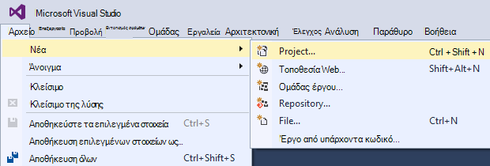

1. Στο παράθυρο διαλόγου **Νέο έργο** , αναπτύξτε **C#** επιλέξτε **Web** στην περιοχή **Εγκατεστημένα πρότυπα**και, στη συνέχεια, επιλέξτε **Την εφαρμογή Web ASP.NET**. Δώστε ένα όνομα της εφαρμογής **ContactManager**και, στη συνέχεια, κάντε κλικ στο κουμπί **OK**.

    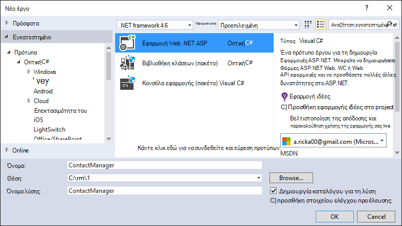
 
    **Σημείωση:** Βεβαιωθείτε ότι έχετε εισαγάγει "ContactManager". Μπλοκ κώδικα, τα οποία θα η νεότερη έκδοση αντιγραφή λαμβάνεται ως δεδομένο ότι το όνομα του έργου είναι ContactManager. 

1. Στο παράθυρο διαλόγου **Νέο έργο ASP.NET** , επιλέξτε το πρότυπο **MVC** . Επαλήθευση του **ελέγχου ταυτότητας** έχει οριστεί σε **Μεμονωμένων λογαριασμών χρήστη**, έχει γίνει ανάληψη ελέγχου του **κεντρικού υπολογιστή στο cloud** και **Εφαρμογής υπηρεσίας** είναι επιλεγμένο.

    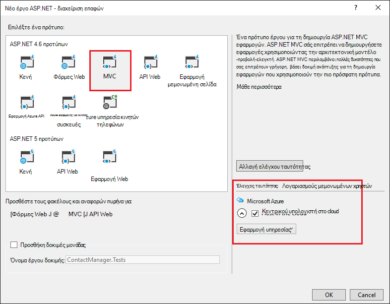

1. Κάντε κλικ στο **κουμπί OK**.

1. Εμφανίζεται το παράθυρο διαλόγου **Ρύθμιση παραμέτρων του Microsoft Azure ρυθμίσεις του Web App** . Ίσως χρειαστεί να συνδεθείτε Εάν δεν το έχετε κάνει ήδη, ή να πληκτρολογήσετε πάλι τα διαπιστευτήριά σας, εάν η σύνδεσή σας είναι έχει λήξει.

1. Προαιρετικά - αλλαγή την τιμή στο **όνομα εφαρμογής Web** πλαισίου (ανατρέξτε στην παρακάτω εικόνα).

    Η διεύθυνση URL της εφαρμογής web θα .azurewebsites {name} .net, ώστε το όνομα πρέπει να είναι μοναδικό στον τομέα azurewebsites.net. Ο Οδηγός ρύθμισης παραμέτρων προτείνει ένα μοναδικό όνομα προσαρτώντας έναν αριθμό στο όνομα του έργου "ContactManager" και που είναι λεπτομερές για αυτό το πρόγραμμα εκμάθησης.

5. Στην **ομάδα πόρων** αναπτυσσόμενη λίστα, επιλέξτε μια υπάρχουσα ομάδα ή **Δημιουργία νέας ομάδας πόρων**(ανατρέξτε στην παρακάτω εικόνα). 

    Εάν προτιμάτε, μπορείτε να επιλέξετε μια ομάδα πόρων που έχετε ήδη. Αλλά εάν δημιουργήσετε μια νέα ομάδα πόρων και μόνο το χρησιμοποιήσετε για αυτό το πρόγραμμα εκμάθησης, θα είναι εύκολο να διαγράψετε όλους τους πόρους Azure που δημιουργήσατε για το πρόγραμμα εκμάθησης, όταν ολοκληρώσετε την εργασία με αυτά. Για πληροφορίες σχετικά με τις ομάδες πόρων, ανατρέξτε στο θέμα [Επισκόπηση της διαχείρισης πόρων Azure](../azure-resource-manager/resource-group-overview.md). 

5. Στο **πρόγραμμα εφαρμογής υπηρεσίας** αναπτυσσόμενη επιλογή επιλογή ένα υπάρχον σχέδιο ή **Δημιουργία νέας εφαρμογής υπηρεσίας Σχεδιασμός**(ανατρέξτε στην παρακάτω εικόνα).

    Εάν προτιμάτε, μπορείτε να επιλέξετε ένα πρόγραμμα εφαρμογής υπηρεσίας που έχετε ήδη. Για πληροφορίες σχετικά με τα σχέδια εφαρμογής υπηρεσίας, ανατρέξτε στο θέμα [Επισκόπηση αναλυτικά σχέδια Azure εφαρμογής υπηρεσίας](../app-service/azure-web-sites-web-hosting-plans-in-depth-overview.md). 

1. Πατήστε **Εξερεύνηση πρόσθετες Azure υπηρεσίες** για να προσθέσετε μια βάση δεδομένων SQL.

    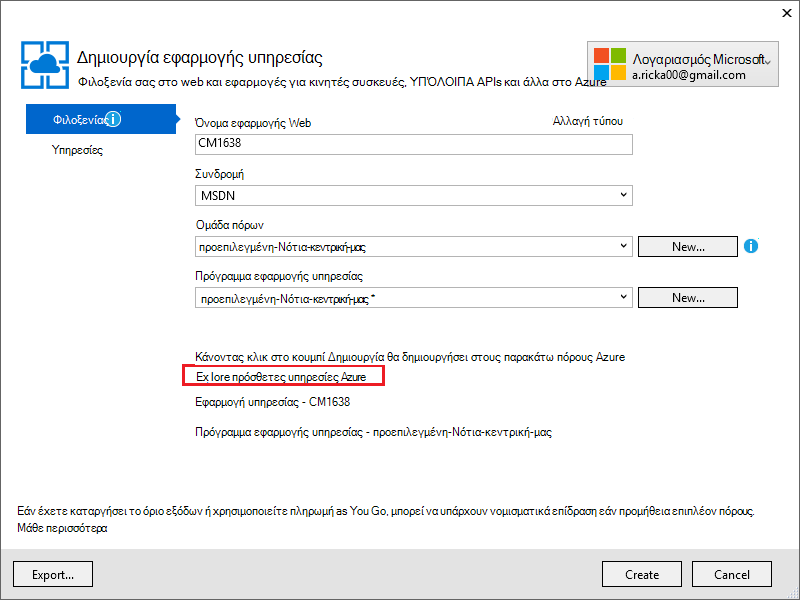

1. Πατήστε το **+** εικονίδιο για να προσθέσετε μια βάση δεδομένων SQL.

    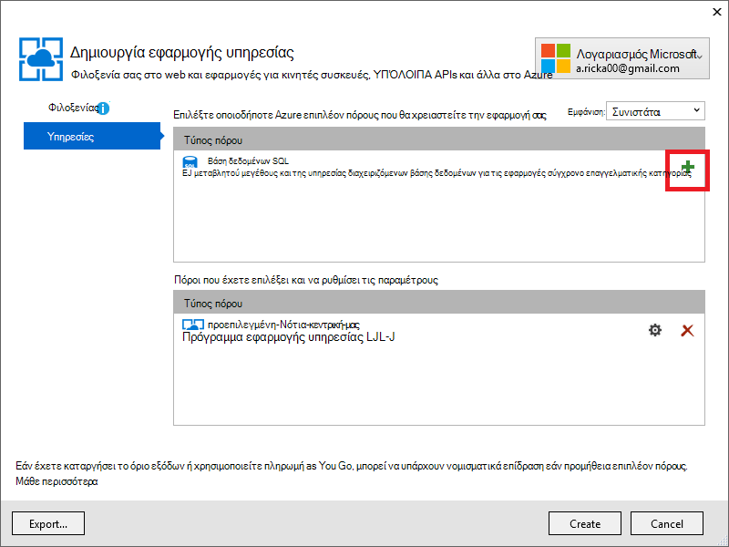

1. Πατήστε **Δημιουργία** στο παράθυρο διαλόγου **Ρύθμιση παραμέτρων της βάσης δεδομένων SQL** :

    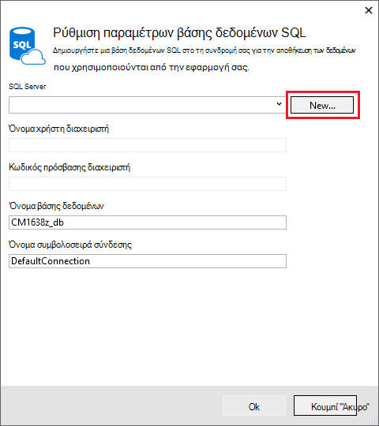

1. Πληκτρολογήστε ένα όνομα για το διαχειριστή και έναν ισχυρό κωδικό πρόσβασης.

    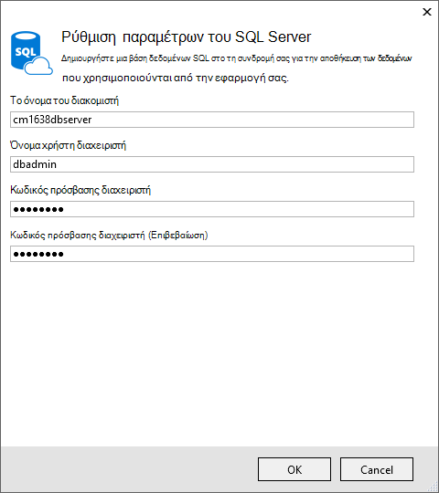

    Το όνομα του διακομιστή πρέπει να είναι μοναδικό. Μπορεί να περιέχει πεζά γράμματα, αριθμητικά ψηφία και παύλες. Δεν μπορεί να περιέχει ένα τελικό ενωτικό. Το όνομα χρήστη και τον κωδικό πρόσβασης είναι νέα διαπιστευτήρια που δημιουργείτε για το νέο διακομιστή. 

    Εάν έχετε ήδη ένα διακομιστή βάσης δεδομένων, μπορείτε να επιλέξετε που αντί να δημιουργήσετε μία. Οι διακομιστές βάσης δεδομένων είναι ένα πολύτιμο πόρων και γενικά που θέλετε να δημιουργήσετε πολλές βάσεις δεδομένων στον ίδιο διακομιστή για σκοπούς δοκιμής και ανάπτυξη αντί να δημιουργήσετε ένα διακομιστή βάσης δεδομένων ανά βάση δεδομένων. Ωστόσο, για αυτό το πρόγραμμα εκμάθησης χρειάζεστε μόνο ο διακομιστής προσωρινά, και με τη δημιουργία διακομιστή στην ίδια ομάδα πόρων με την τοποθεσία web που διευκολύνουν την για να διαγράψετε και τα δύο πόρους εφαρμογή και βάση δεδομένων web, διαγράφοντας την ομάδα των πόρων, όταν ολοκληρώσετε την εργασία με το πρόγραμμα εκμάθησης. 

    Εάν επιλέξετε έναν υπάρχοντα διακομιστή βάσης δεδομένων, βεβαιωθείτε ότι το web app και βάση δεδομένων είναι στην ίδια περιοχή.

    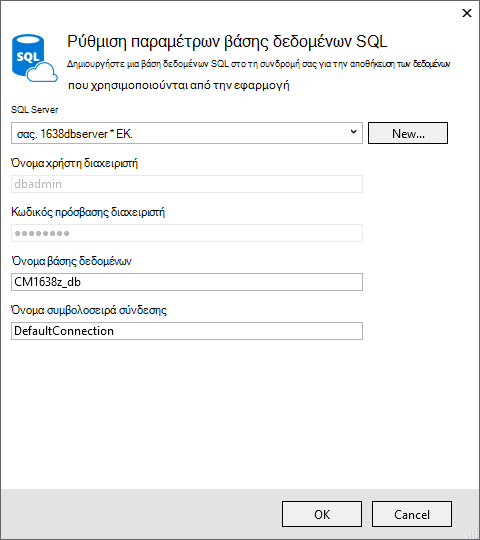

4. Πατήστε **Δημιουργία**.

    Visual Studio δημιουργεί το project web ContactManager, δημιουργεί την ομάδα πόρων και πρόγραμμα εφαρμογής υπηρεσίας που καθορίσατε, και δημιουργεί μια εφαρμογή web στο Azure εφαρμογής υπηρεσίας με το όνομα που καθορίσατε.

### Ορίστε την κεφαλίδα και το υποσέλιδο

1. Στην **Εξερεύνηση λύσεων** , ανοίξτε το αρχείο *Layout.cshtml* στο φάκελο *Views\Shared* .

    ![_Layout.cshtml στην Εξερεύνηση λύσεων][newapp004]

1. Αντικαταστήστε το ActionLink στο αρχείο *Layout.cshtml* με τον ακόλουθο κώδικα.

    @Html.ActionLink("CMΕπίδειξη","Ευρετήριο","Επαφές", νέα {περιοχή =" "}, δημιουργία { @class ="στη γραμμή περιήγησης-εμπορικής επωνυμίας"})
                   

    Βεβαιωθείτε ότι μπορείτε να αλλάξετε την τρίτη παράμετρο από την "Κεντρική" στις "Επαφές". Το παραπάνω σήμανσης θα δημιουργήσετε μια σύνδεση "Επαφές" σε κάθε σελίδα στη μέθοδο ευρετηρίου του ελεγκτή επαφές. Αλλάξτε το όνομα της εφαρμογής στην κεφαλίδα και το υποσέλιδο από "Εφαρμογή ASP.NET μου" και "Όνομα εφαρμογής" σε "Διαχείριση επαφών" και "Εκατοστά επίδειξη". 
 
### Εκτελέστε την εφαρμογή τοπικά

1. Πατήστε το συνδυασμό πλήκτρων CTRL + F5 για να εκτελέσετε την εφαρμογή.

    Η αρχική σελίδα εφαρμογής εμφανίζεται το προεπιλεγμένο πρόγραμμα περιήγησης.

    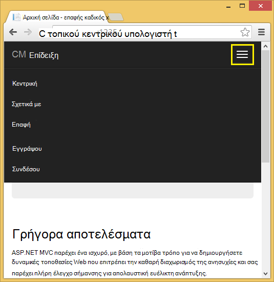

Αυτό είναι το μόνο που χρειάζεται να το κάνετε τώρα για να δημιουργήσετε την εφαρμογή που θα αναπτύξετε να Azure. 

## Ανάπτυξη της εφαρμογής για να Azure

1. Στο Visual Studio, κάντε δεξί κλικ στο έργο στην **Εξερεύνηση λύσεων** και επιλέξτε **Δημοσίευση** από το μενού περιβάλλοντος.

    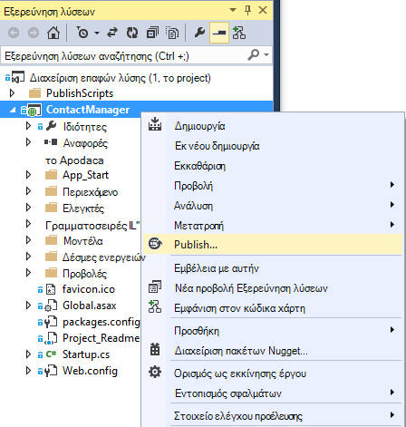
    
    Ανοίγει ο οδηγός **Δημοσίευση Web** .

1. Στο παράθυρο διαλόγου **Δημοσίευση Web** , κάντε κλικ στο κουμπί **Δημοσίευση**.

    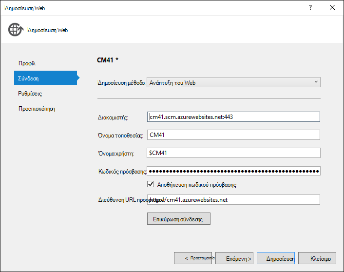

    Η εφαρμογή που δημιουργήσατε εκτελείται τώρα στο cloud. Την επόμενη φορά που ανάπτυξη της εφαρμογής, πρόκειται να αναπτυχθούν μόνο τα αρχεία τροποποιημένο (ή νέα).

    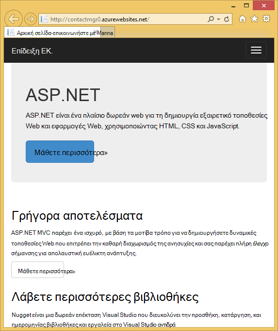

## Ενεργοποίηση SSL για το έργο ##

1. Στην **Εξερεύνηση λύσεων**, κάντε κλικ στο έργο **ContactManager** και, στη συνέχεια, κάντε κλικ στην επιλογή F4 για να ανοίξετε το παράθυρο " **Ιδιότητες** ".

3. Αλλαγή **με δυνατότητα SSL** στην **τιμή True**. 

4. Αντιγράψτε τη **διεύθυνση URL SSL**.

    Η διεύθυνση URL SSL θα είναι https://localhost:44300 / εκτός και εάν έχετε δημιουργήσει προηγουμένως εφαρμογές web SSL.

    ![Ενεργοποίηση SSL][rxSSL]
 
1. Στην **Εξερεύνηση λύσεων**, κάντε δεξί κλικ στο έργο **Διαχείριση επαφών** και κάντε κλικ στην επιλογή **Ιδιότητες**.

1. Κάντε κλικ στην καρτέλα **Web** .

1. Αλλάξτε τη **Διεύθυνση Url του Project** για να χρησιμοποιήσετε τη διεύθυνση **SSL URL** και αποθηκεύστε τη σελίδα (στοιχείο ελέγχου S).

    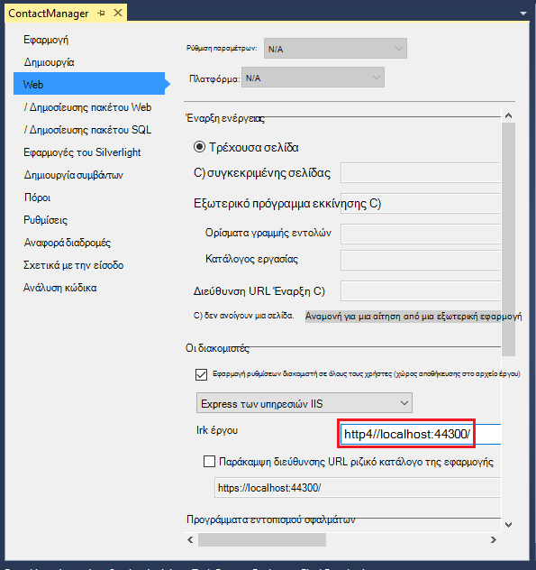
 
1. Επιβεβαιώστε ότι Internet Explorer είναι το πρόγραμμα περιήγησης που ενεργοποιεί το Visual Studio, όπως φαίνεται στην παρακάτω εικόνα:

    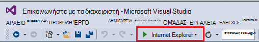

    Στον επιλογέα πρόγραμμα περιήγησης σάς επιτρέπει να καθορίσετε το πρόγραμμα περιήγησης που ενεργοποιεί το Visual Studio. Μπορείτε να επιλέξετε πολλά προγράμματα περιήγησης και να έχετε το Visual Studio ενημέρωση κάθε πρόγραμμα περιήγησης, όταν κάνετε αλλαγές. Για περισσότερες πληροφορίες ανατρέξτε στο θέμα [Χρήση του προγράμματος περιήγησης σύνδεση στο Visual Studio 2013](http://www.asp.net/visual-studio/overview/2013/using-browser-link).

    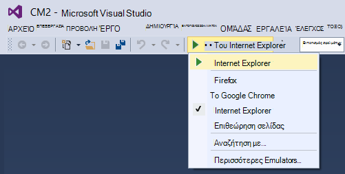

1. Πατήστε το συνδυασμό πλήκτρων CTRL + F5 για να εκτελέσετε την εφαρμογή. Κάντε κλικ στο κουμπί **Ναι** για να ξεκινήσει η διαδικασία αξιόπιστο το πιστοποιητικό αυτόματης υπογραφής που δημιούργησε Express των υπηρεσιών IIS.

     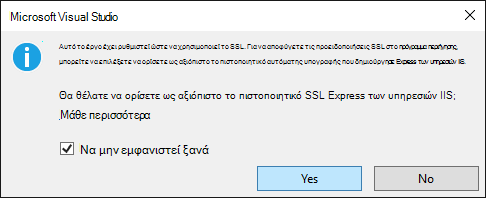

1. Διαβάστε το παράθυρο διαλόγου **Προειδοποίηση ασφαλείας** και, στη συνέχεια, κάντε κλικ στην επιλογή **Ναι** εάν θέλετε να εγκαταστήσετε το πιστοποιητικό που αντιπροσωπεύει **τοπικού κεντρικού υπολογιστή**.

    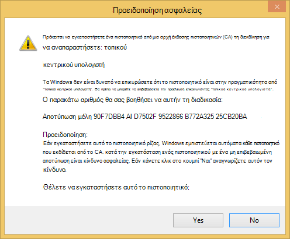

1. IE εμφανίζει την *κεντρική* σελίδα και υπάρχουν καμία προειδοποίηση SSL.

     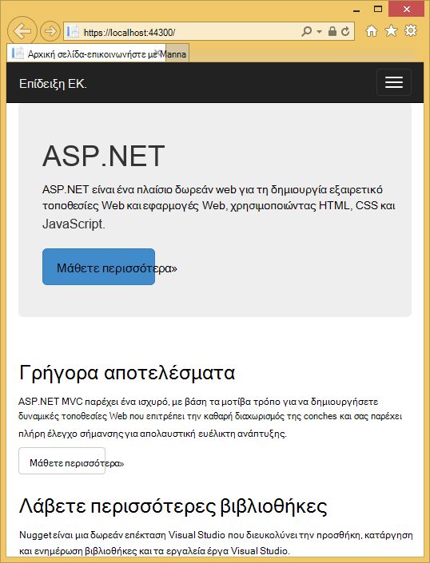

     Internet Explorer είναι μια καλή επιλογή όταν χρησιμοποιείτε SSL, επειδή αποδέχεται το πιστοποιητικό και εμφανίζει HTTPS περιεχόμενο χωρίς μια προειδοποίηση. Microsoft Edge και του Google Chrome αποδοχή επίσης το πιστοποιητικό. Firefox χρησιμοποιεί το δικό του χώρο αποθήκευσης πιστοποιητικών, ώστε να εμφανίζεται μια προειδοποίηση.

     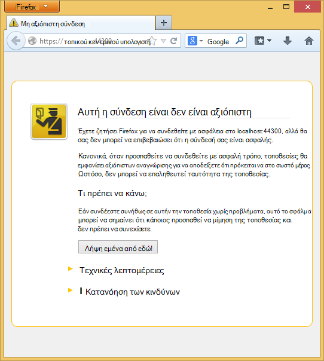

## Προσθήκη βάσης δεδομένων με την εφαρμογή

Στη συνέχεια, θα μπορείτε να ενημερώσετε την εφαρμογή για να προσθέσετε τη δυνατότητα για να εμφανίσετε και να ενημερώσετε τις επαφές και αποθήκευση των δεδομένων σε μια βάση δεδομένων. Η εφαρμογή θα χρησιμοποιήσει το πλαίσιο οντότητα (EF) για να δημιουργήσετε τη βάση δεδομένων και για να διαβάσετε και να ενημερώσετε δεδομένα.

### Προσθήκη κλάσεων μοντέλο δεδομένων για τις επαφές

Μπορείτε να ξεκινήσετε με τη δημιουργία ενός μοντέλου δεδομένων απλής στον κώδικα.

1. Στην **Εξερεύνηση λύσεων**, κάντε δεξί κλικ στο φάκελο μοντέλα, κάντε κλικ στην επιλογή **Προσθήκη**και, στη συνέχεια **τάξης**.

    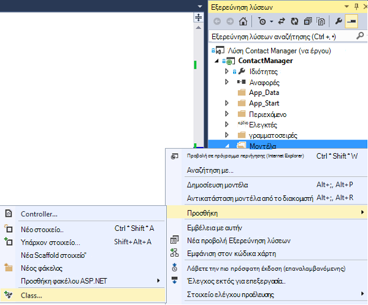

2. Στο παράθυρο διαλόγου **Προσθήκη νέου στοιχείου** , δώστε ένα όνομα στο νέο αρχείο κλάσης *Contact.cs*και, στη συνέχεια, κάντε κλικ στην επιλογή **Προσθήκη**.

    ![Προσθήκη νέου στοιχείου διαλόγου][adddb002]

3. Αντικαταστήστε τα περιεχόμενα του αρχείου Contact.cs με τον ακόλουθο κώδικα.

        using System.ComponentModel.DataAnnotations;
        using System.Globalization;
        namespace ContactManager.Models
        {
            public class Contact
            {
                public int ContactId { get; set; }
                public string Name { get; set; }
                public string Address { get; set; }
                public string City { get; set; }
                public string State { get; set; }
                public string Zip { get; set; }
                [DataType(DataType.EmailAddress)]
                public string Email { get; set; }
            }
        }
Η **επικοινωνία** κλάση ορίζει τα δεδομένα που θα αποθηκεύσετε για κάθε επαφή, καθώς και ένα πρωτεύον κλειδί, *αναγνωριστικό επαφής*, που είναι απαραίτητες για τη βάση δεδομένων.

### Δημιουργία ιστοσελίδων που επιτρέπουν στους χρήστες της εφαρμογής για να εργαστείτε με τις επαφές

Η δυνατότητα ικριώματος ASP.NET MVC να δημιουργήσετε αυτόματα κώδικα που εκτελεί δημιουργία, ανάγνωση, ενημέρωση και διαγραφή ενέργειες (CRUD). 

1. Δημιουργία του έργου **(Ctrl + Shift + B)**. (Πρέπει να δημιουργείτε του έργου πριν από τη χρήση του μηχανισμού ικριώματος.)
 
1. Στην **Εξερεύνηση λύσεων**, κάντε δεξί κλικ στο φάκελο ελεγκτές και κάντε κλικ στην επιλογή **Προσθήκη**και, στη συνέχεια, κάντε κλικ στην επιλογή **ελεγκτή**.

    ![Προσθήκη ελεγκτή στο μενού περιβάλλοντος ελεγκτές φακέλου][addcode001]

5. Στο παράθυρο διαλόγου **Προσθήκη Scaffold** , επιλέξτε **Ελεγκτή 5 MVC με προβολές, χρησιμοποιώντας EF** και, στη συνέχεια, κάντε κλικ στην επιλογή **Προσθήκη**.
    
    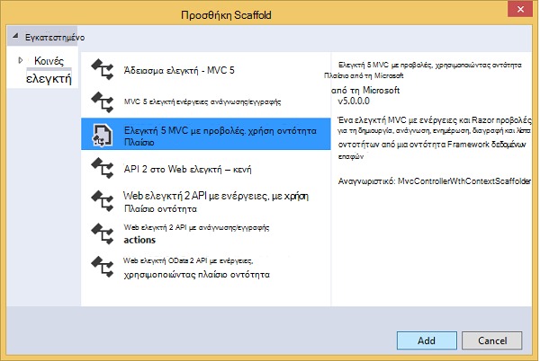

1. Στο αναπτυσσόμενο πλαίσιο **κλάση μοντέλου** , επιλέξτε **επαφή (ContactManager.Models)**. (Ανατρέξτε στην παρακάτω εικόνα.)

1. Στην **κλάσης περιβάλλον δεδομένων**, επιλέξτε **ApplicationDbContext (ContactManager.Models)**. Το **ApplicationDbContext** θα χρησιμοποιηθεί για την ιδιότητα μέλους DB και τα δεδομένα μας.

    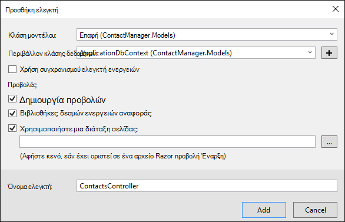

1. Κάντε κλικ στην επιλογή **Προσθήκη**.

   Visual Studio δημιουργεί έναν ελεγκτή με μεθόδους και προβολές για λειτουργίες CRUD βάσης δεδομένων για τα αντικείμενα της **επαφής** .

## Ενεργοποίηση μετεγκαταστάσεις, να δημιουργήσετε τη βάση δεδομένων, να προσθέσετε δείγματα δεδομένων και ένα σύνολο αρχικών τιμών δεδομένων ##

Η επόμενη εργασία είναι να ενεργοποιήσετε τη δυνατότητα [Πρώτη μετεγκαταστάσεις κώδικα](http://msdn.microsoft.com/library/hh770484.aspx) για να δημιουργήσετε πίνακες βάσεων δεδομένων με βάση το μοντέλο δεδομένων που έχετε δημιουργήσει.

1. Στο μενού **Εργαλεία** , επιλέξτε **Διαχείριση πακέτου NuGet** και, στη συνέχεια, **Κονσόλα διαχείρισης πακέτου**.

    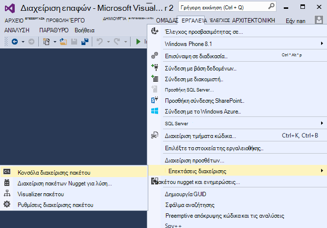

2. Στο παράθυρο **Κονσόλα διαχείρισης πακέτου** , εισαγάγετε την ακόλουθη εντολή:

        enable-migrations

    Η εντολή **Ενεργοποίηση μετεγκαταστάσεις** δημιουργεί ένα φάκελο *μετεγκαταστάσεις* και τοποθετεί σε αυτόν το φάκελο ένα αρχείο *Configuration.cs* που μπορείτε να επεξεργαστείτε σπείρεται τη βάση δεδομένων και ρύθμισης παραμέτρων μετεγκαταστάσεις. 

2. Στο παράθυρο **Κονσόλα διαχείρισης πακέτου** , εισαγάγετε την ακόλουθη εντολή:

        add-migration Initial

    Η εντολή **Προσθήκη μετεγκατάστασης αρχικό** δημιουργεί ένα αρχείο που ονομάζεται ** &lt;date_stamp&gt;αρχικό** στο φάκελο *μετεγκαταστάσεις* . Ο κώδικας σε αυτό το αρχείο δημιουργεί πίνακες της βάσης δεδομένων. Η πρώτη παράμετρος ( **αρχικό** ) χρησιμοποιείται για να δημιουργήσετε το όνομα του αρχείου. Μπορείτε να δείτε τα νέα αρχεία κλάσης στην **Εξερεύνηση λύσεων**.

    Στην **αρχική** κλάση, τη μέθοδο **του** δημιουργεί τον πίνακα επαφών και τη μέθοδο **προς τα κάτω** (χρησιμοποιούνται όταν θέλετε να επιστρέψετε στην προηγούμενη κατάσταση) αποθέτει την.

3. Ανοίξτε το αρχείο *Migrations\Configuration.cs* . 

4. Προσθέστε τα ακόλουθα `using` πρόταση. 

         using ContactManager.Models;

5. Αντικατάσταση της μεθόδου *σπόρων* με τον ακόλουθο κώδικα:

        protected override void Seed(ContactManager.Models.ApplicationDbContext context)
        {
            context.Contacts.AddOrUpdate(p => p.Name,
               new Contact
               {
                   Name = "Debra Garcia",
                   Address = "1234 Main St",
                   City = "Redmond",
                   State = "WA",
                   Zip = "10999",
                   Email = "debra@example.com",
               },
                new Contact
                {
                    Name = "Thorsten Weinrich",
                    Address = "5678 1st Ave W",
                    City = "Redmond",
                    State = "WA",
                    Zip = "10999",
                    Email = "thorsten@example.com",
                },
                new Contact
                {
                    Name = "Yuhong Li",
                    Address = "9012 State st",
                    City = "Redmond",
                    State = "WA",
                    Zip = "10999",
                    Email = "yuhong@example.com",
                },
                new Contact
                {
                    Name = "Jon Orton",
                    Address = "3456 Maple St",
                    City = "Redmond",
                    State = "WA",
                    Zip = "10999",
                    Email = "jon@example.com",
                },
                new Contact
                {
                    Name = "Diliana Alexieva-Bosseva",
                    Address = "7890 2nd Ave E",
                    City = "Redmond",
                    State = "WA",
                    Zip = "10999",
                    Email = "diliana@example.com",
                }
                );
        }

    Αυτός ο κωδικός προετοιμάζει (σπόρων) της βάσης δεδομένων με τις πληροφορίες επαφής. Για περισσότερες πληροφορίες σχετικά με την καλλιέργεια της βάσης δεδομένων, ανατρέξτε στο θέμα [Seeding και Demand DBs Framework εντοπισμού οντότητα (EF)](http://blogs.msdn.com/b/rickandy/archive/2013/02/12/seeding-and-debugging-entity-framework-ef-dbs.aspx). Δημιουργήστε το έργο για να επαληθεύσετε υπάρχουν σφάλματα μεταγλώττισης.

6. Στην **Κονσόλα διαχείρισης πακέτου** , πληκτρολογήστε την εντολή:

        update-database

    ![Κονσόλα διαχείρισης πακέτου εντολές][addcode009]

    Η **Ενημέρωση-βάση δεδομένων** εκτελείται η πρώτη μετεγκατάσταση που δημιουργεί μια βάση δεδομένων. Από προεπιλογή, η βάση δεδομένων δημιουργείται ως βάση δεδομένων SQL Server Express LocalDB. 

7. Πατήστε το συνδυασμό πλήκτρων CTRL + F5 για να εκτελέσετε την εφαρμογή και, στη συνέχεια, κάντε κλικ στη σύνδεση **Επίδειξη Εκατοστών** ; ή μεταβείτε https://localhost:(port#)/εκατοστών. 

    Η εφαρμογή εμφανίζει τα δεδομένα σπόρων και παρέχει συνδέσεις επεξεργασία, λεπτομέρειες και διαγραφή. Μπορείτε να δημιουργήσετε, να επεξεργαστείτε, να διαγράψετε και να προβάλετε τα δεδομένα.

    ![Προβολή MVC των δεδομένων][rx2]

## Προσθήκη μιας υπηρεσίας παροχής OAuth2

>[AZURE.NOTE] Για λεπτομερείς οδηγίες σχετικά με τη χρήση του Google και το Facebook για προγραμματιστές τοποθεσιών πύλης, αυτό προγραμμάτων εκμάθησης συνδέσεις σε προγράμματα εκμάθησης στην τοποθεσία του ASP.NET. Ωστόσο, Google και το Facebook να αλλάξετε τις τοποθεσίες τους πιο συχνά από αυτά τα προγράμματα εκμάθησης είναι ενημερωθεί και τώρα είναι ενημερωμένα. Εάν έχετε προβλήματα κατά την ακολουθώντας τις οδηγίες, ανατρέξτε στο θέμα το σχόλιο Disqus διαθέσιμης στο τέλος αυτού του προγράμματος εκμάθησης για μια λίστα με τι έχει αλλάξει. 

[OAuth] (http://oauth.net/ "http://OAuth.NET/") είναι ένα ανοιχτό πρωτόκολλο που επιτρέπει ασφαλείς εξουσιοδότησης σε απλό και των τυπικών μέθοδο από εφαρμογές web, φορητούς και επιτραπέζιους. Το πρότυπο internet ASP.NET MVC χρησιμοποιεί διακριτικό για να εκθέσετε Facebook, Twitter, Google και Microsoft ως υπηρεσιών παροχής ελέγχου ταυτότητας. Αν και αυτό το πρόγραμμα εκμάθησης χρησιμοποιεί μόνο Google ως την υπηρεσία παροχής ελέγχου ταυτότητας, μπορείτε εύκολα να τροποποιήσετε τον κώδικα για να χρησιμοποιήσετε οποιαδήποτε από αυτές τις υπηρεσίες παροχής. Τα βήματα για την υλοποίηση άλλες υπηρεσίες παροχής είναι παρόμοια με τα βήματα που βλέπετε σε αυτό το πρόγραμμα εκμάθησης. Για να χρησιμοποιήσετε Facebook με μια υπηρεσία παροχής ελέγχου ταυτότητας, ανατρέξτε στο θέμα [Εφαρμογή 5 MVC με το Facebook, Twitter, LinkedIn και το Google OAuth2 καθολικής σύνδεσης ](http://www.asp.net/mvc/tutorials/mvc-5/create-an-aspnet-mvc-5-app-with-facebook-and-google-oauth2-and-openid-sign-on).

Εκτός από τον έλεγχο ταυτότητας, αυτό το πρόγραμμα εκμάθησης χρησιμοποιεί ρόλους για την υλοποίηση της εξουσιοδότησης. Μόνο για αυτούς τους χρήστες που προσθέτετε στο ρόλο *canEdit* έχουν τη δυνατότητα να αλλάξετε τα δεδομένα (δηλαδή, δημιουργία, επεξεργασία ή διαγραφή επαφών).

1. Ακολουθήστε τις οδηγίες στο θέμα [Εφαρμογή 5 MVC με το Facebook, Twitter, LinkedIn και το Google OAuth2 καθολικής σύνδεσης](http://www.asp.net/mvc/tutorials/mvc-5/create-an-aspnet-mvc-5-app-with-facebook-and-google-oauth2-and-openid-sign-on#goog) στην περιοχή **Δημιουργία εφαρμογής Google για OAuth 2 για να ορίσετε μια εφαρμογή Google για το OAuth2**.

3. Εκτέλεση και δοκιμή της εφαρμογής για να βεβαιωθείτε ότι μπορείτε να συνδεθείτε με χρήση ελέγχου ταυτότητας Google.

2. Εάν θέλετε να δημιουργήσετε κουμπιά κοινωνικών login με εικονίδια υπηρεσίας παροχής, ανατρέξτε στο θέμα [αρκετά κοινωνικών login κουμπιά για ASP.NET MVC 5](http://www.jerriepelser.com/blog/pretty-social-login-buttons-for-asp-net-mvc-5)

## Χρησιμοποιώντας την ιδιότητα μέλους API

Σε αυτήν την ενότητα θα προσθέσετε ένα τοπικό χρήστη και ο ρόλος *canEdit* στη βάση δεδομένων του συμμετοχή ως μέλος. Μόνο οι χρήστες στο ρόλο *canEdit* θα μπορείτε να επεξεργαστείτε τα δεδομένα. Βέλτιστη πρακτική είναι να τους ρόλους όνομα από τις ενέργειες που μπορούν να εκτελούν, ώστε να είναι προτιμότερη *canEdit* πάνω από ένα ρόλο που ονομάζεται *διαχείρισης*. Όταν η εφαρμογή σας εξελίσσεται, μπορείτε να προσθέσετε νέους ρόλους όπως *canDeleteMembers* και όχι το μικρότερο περιγραφικό *superAdmin*.

1. Ανοίξτε το αρχείο *migrations\configuration.cs* και προσθέστε το εξής `using` προτάσεις:

        using Microsoft.AspNet.Identity;
        using Microsoft.AspNet.Identity.EntityFramework;

1. Προσθέστε την ακόλουθη μέθοδο **AddUserAndRole** την κλάση:

        bool AddUserAndRole(ContactManager.Models.ApplicationDbContext context)
        {
            IdentityResult ir;
            var rm = new RoleManager<IdentityRole>
                (new RoleStore<IdentityRole>(context));
            ir = rm.Create(new IdentityRole("canEdit"));
            var um = new UserManager<ApplicationUser>(
                new UserStore<ApplicationUser>(context));
            var user = new ApplicationUser()
            {
                UserName = "user1@contoso.com",
            };
            ir = um.Create(user, "P_assw0rd1");
            if (ir.Succeeded == false)
                return ir.Succeeded;
            ir = um.AddToRole(user.Id, "canEdit");
            return ir.Succeeded;
        }

1. Καλέστε τη νέα μέθοδο από τη μέθοδο **σπόρων** :

        protected override void Seed(ContactManager.Models.ApplicationDbContext context)
        {
            AddUserAndRole(context);
            context.Contacts.AddOrUpdate(p => p.Name,
                // Code removed for brevity
        }

    Οι παρακάτω εικόνες εμφανίζει τις αλλαγές *σπόρων* μέθοδο:

    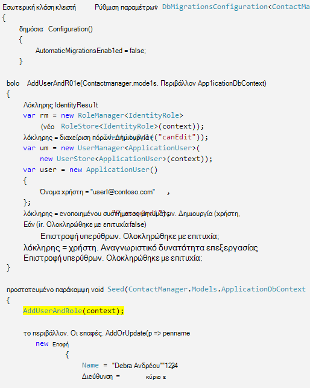

    Αυτός ο κώδικας δημιουργεί ένα νέο ρόλο που ονομάζεται *canEdit*, δημιουργεί έναν νέο χρήστη τοπικού *user1@contoso.com*, και προσθέτει *user1@contoso.com* στο ρόλο *canEdit* . Για περισσότερες πληροφορίες, ανατρέξτε στο θέμα [προγράμματα εκμάθησης για το ASP.NET ταυτότητας](http://www.asp.net/identity/overview/features-api) στην τοποθεσία του ASP.NET.

## Χρήση προσωρινό κώδικα για την προσθήκη νέας κοινωνικών Login τους χρήστες για το canEdit ρόλων  ##

Σε αυτήν την ενότητα θα τροποποιήσετε προσωρινά τη μέθοδο **ExternalLoginConfirmation** στον ελεγκτή λογαριασμό για να προσθέσετε νέους χρήστες την εγγραφή σας με μια υπηρεσία παροχής διακριτικό στο ρόλο *canEdit* . Θα σας ελπίζετε να παρέχουν ένα εργαλείο παρόμοια με [WSAT](http://msdn.microsoft.com/library/ms228053.aspx) στο μέλλον που σας επιτρέπουν να δημιουργήσετε και να επεξεργαστείτε τους λογαριασμούς χρηστών και ρόλων. Μέχρι τότε, που μπορείτε να εκτελέσετε την ίδια λειτουργία χρησιμοποιώντας προσωρινό κώδικα.

1. Ανοίξτε το αρχείο **Controllers\AccountController.cs** και περιηγηθείτε στη μέθοδο **ExternalLoginConfirmation** .

1. Προσθέστε την ακόλουθη κλήση **AddToRoleAsync** ακριβώς πριν από την κλήση **SignInAsync** .

        await UserManager.AddToRoleAsync(user.Id, "canEdit");

   Ο κώδικας παραπάνω προσθέτει το χρήστη που μόλις καταχωρημένες το ρόλο "canEdit", η οποία παρέχει πρόσβαση σε μεθόδους ενέργεια που αλλάζουν τα δεδομένα (edit). Το παρακάτω τμήμα κώδικα εμφανίζει τη νέα γραμμή του κώδικα στο περιβάλλον.

          // POST: /Account/ExternalLoginConfirmation
          [HttpPost]
          [AllowAnonymous]
          [ValidateAntiForgeryToken]
          public async Task ExternalLoginConfirmation(ExternalLoginConfirmationViewModel model, string returnUrl)
          {
             if (User.Identity.IsAuthenticated)
             {
                return RedirectToAction("Index", "Manage");
             }
             if (ModelState.IsValid)
             {
                // Get the information about the user from the external login provider
                var info = await AuthenticationManager.GetExternalLoginInfoAsync();
                if (info == null)
                {
                   return View("ExternalLoginFailure");
                }
                var user = new ApplicationUser { UserName = model.Email, Email = model.Email };
                var result = await UserManager.CreateAsync(user);
                if (result.Succeeded)
                {
                   result = await UserManager.AddLoginAsync(user.Id, info.Login);
                   if (result.Succeeded)
                   {
                      await UserManager.AddToRoleAsync(user.Id, "canEdit");
                      await SignInManager.SignInAsync(user, isPersistent: false, rememberBrowser: false);
                      return RedirectToLocal(returnUrl);
                   }
                }
                AddErrors(result);
             }
             ViewBag.ReturnUrl = returnUrl;
             return View(model);
          }

Αργότερα στην εκμάθηση θα αναπτύξετε της εφαρμογής σε Azure, όπου που θα καταγραφής καθολικής με Google ή κάποια άλλη υπηρεσία παροχής ελέγχου ταυτότητας άλλου κατασκευαστή. Αυτό θα προσθέσετε το λογαριασμό που μόλις καταχωρημένες στο ρόλο *canEdit* . Όλα τα άτομα που εντοπίζει διεύθυνση URL της εφαρμογής web σας και να έχει ένα Αναγνωριστικό Google, στη συνέχεια, να καταχώρηση και να ενημερώσετε τη βάση δεδομένων. Για να αποτρέψετε την εκτέλεση που άλλα άτομα, μπορείτε να διακόψετε την τοποθεσία. Θα έχετε τη δυνατότητα για να επαληθεύσετε ποιος είναι στο ρόλο *canEdit* εξετάζοντας τη βάση δεδομένων.

Στην **Κονσόλα διαχείρισης πακέτου** πατήσετε το πλήκτρο ΕΠΑΝΩ ΒΕΛΟΣ για να εμφανίσετε την ακόλουθη εντολή:

        Update-Database

Η μέθοδος **σπόρων** εκτελείται η εντολή **Ενημέρωση-βάσης δεδομένων** και που εκτελείται τη μέθοδο **AddUserAndRole** που προσθέσατε προηγουμένως. Η μέθοδος **AddUserAndRole** δημιουργεί ο χρήστης *user1@contoso.com* και εκείνη προσθέτει το ρόλο *canEdit* .

## Προστασία της εφαρμογής με SSL και το χαρακτηριστικό εξουσιοδότηση ##

Σε αυτήν την ενότητα μπορείτε να εφαρμόσετε το χαρακτηριστικό [εξουσιοδότηση](http://msdn.microsoft.com/library/system.web.mvc.authorizeattribute.aspx) για να περιορίσετε την πρόσβαση σε τις μεθόδους ενέργεια. Οι ανώνυμοι χρήστες θα μπορούν να δουν μόνο τη μέθοδο ενέργεια **ευρετηρίου** του ελεγκτή οικίας. Καταχωρημένες οι χρήστες θα μπορούν να δουν τα δεδομένα (το **ευρετήριο** και **Λεπτομέρειες** σελίδες του ελεγκτή ΕΚ.), σελίδα πληροφορίες και τη σελίδα επαφή. Μόνο οι χρήστες το ρόλο *canEdit* θα μπορούν να access ενέργεια μεθόδους που αλλάζουν τα δεδομένα.

1. Ανοίξτε το αρχείο *App_Start\FilterConfig.cs* και να αντικαταστήσετε τη μέθοδο *RegisterGlobalFilters* με την εξής (η οποία προσθέτει δύο φίλτρων):

        public static void RegisterGlobalFilters(GlobalFilterCollection filters)
        {
            filters.Add(new HandleErrorAttribute());
            filters.Add(new System.Web.Mvc.AuthorizeAttribute());
            filters.Add(new RequireHttpsAttribute());
        }
        
    Αυτός ο κωδικός προσθέτει το φίλτρο [εξουσιοδότηση](http://msdn.microsoft.com/library/system.web.mvc.authorizeattribute.aspx) και το φίλτρο [RequireHttps](http://msdn.microsoft.com/library/system.web.mvc.requirehttpsattribute.aspx) στην εφαρμογή. Το φίλτρο [εξουσιοδότηση](http://msdn.microsoft.com/library/system.web.mvc.authorizeattribute.aspx) αποτρέπει την πρόσβαση σε όλες τις μεθόδους στην εφαρμογή ανώνυμους χρήστες. Θα χρησιμοποιήσετε το χαρακτηριστικό [AllowAnonymous](http://blogs.msdn.com/b/rickandy/archive/2012/03/23/securing-your-asp-net-mvc-4-app-and-the-new-allowanonymous-attribute.aspx) για να εξαιρεθείτε από την απαίτηση εξουσιοδότησης σε μερικά μεθόδων, ώστε οι ανώνυμοι χρήστες να συνδεθείτε και να προβάλετε την αρχική σελίδα. Το [RequireHttps](http://msdn.microsoft.com/library/system.web.mvc.requirehttpsattribute.aspx) απαιτεί όλη την πρόσβαση στην εφαρμογή web να είναι έως HTTPS.

    Εναλλακτική προσέγγιση είναι να προσθέσετε το χαρακτηριστικό [εξουσιοδότηση](http://msdn.microsoft.com/library/system.web.mvc.authorizeattribute.aspx) και το χαρακτηριστικό [RequireHttps](http://msdn.microsoft.com/library/system.web.mvc.requirehttpsattribute.aspx) σε κάθε ελεγκτή, αλλά να θεωρείται βέλτιστη πρακτική ασφαλείας για να εφαρμόσετε σε ολόκληρη την εφαρμογή. Με την προσθήκη καθολικά, κάθε νέα μέθοδος ελεγκτή και μια ενέργεια που μπορείτε να προσθέσετε αυτόματα είναι προστατευμένο--δεν χρειάζεται να θυμάστε να εφαρμόσετε τους. Για περισσότερες πληροφορίες ανατρέξτε στο θέμα [ασφάλιση της εφαρμογής σας ASP.NET MVC και το νέο χαρακτηριστικό AllowAnonymous](http://blogs.msdn.com/b/rickandy/archive/2012/03/23/securing-your-asp-net-mvc-4-app-and-the-new-allowanonymous-attribute.aspx). 

1. Προσθέστε το χαρακτηριστικό [AllowAnonymous](http://blogs.msdn.com/b/rickandy/archive/2012/03/23/securing-your-asp-net-mvc-4-app-and-the-new-allowanonymous-attribute.aspx) τη μέθοδο **ευρετηρίου** του ελεγκτή κεντρική. Το χαρακτηριστικό [AllowAnonymous](http://blogs.msdn.com/b/rickandy/archive/2012/03/23/securing-your-asp-net-mvc-4-app-and-the-new-allowanonymous-attribute.aspx) σάς επιτρέπει να λευκή λίστα τις μεθόδους που θέλετε να εξαιρεθείτε από εξουσιοδότησης. 

        public class HomeController : Controller
        {
          [AllowAnonymous]
          public ActionResult Index()
          {
             return View();
          }

    Εάν κάνετε μια καθολική αναζήτηση για *AllowAnonymous*, θα δείτε ότι χρησιμοποιείται στις μεθόδους σύνδεσης και την καταγραφή του ελεγκτή λογαριασμού.

1. Στο *CmController.cs*, προσθέστε `[Authorize(Roles = "canEdit")]` για τις μεθόδους HttpGet και HttpPost που αλλάζουν τα δεδομένα (δημιουργία, επεξεργασία, διαγραφή, κάθε μέθοδο ενέργεια εκτός από το ευρετήριο και λεπτομέρειες) στον ελεγκτή *εκατοστών* . Ένα τμήμα του κώδικα ολοκληρωμένη φαίνεται παρακάτω: 

        // GET: Cm/Create
        [Authorize(Roles = "canEdit")]
        public ActionResult Create()
        {
           return View(new Contact { Address = "123 N 456 W",
            City="Great Falls", Email = "ab@cd.com", Name="Joe Smith", State="MT",
           Zip = "59405"});
        }
        // POST: Cm/Create
        // To protect from overposting attacks, please enable the specific properties you want to bind to, for 
        // more details see http://go.microsoft.com/fwlink/?LinkId=317598.
        [HttpPost]
        [ValidateAntiForgeryToken]
         [Authorize(Roles = "canEdit")]
        public ActionResult Create([Bind(Include = "ContactId,Name,Address,City,State,Zip,Email")] Contact contact)
        {
            if (ModelState.IsValid)
            {
                db.Contacts.Add(contact);
                db.SaveChanges();
                return RedirectToAction("Index");
            }
            return View(contact);
        }
        // GET: Cm/Edit/5
        [Authorize(Roles = "canEdit")]
        public ActionResult Edit(int? id)
        {
            if (id == null)
            {
                return new HttpStatusCodeResult(HttpStatusCode.BadRequest);
            }
            Contact contact = db.Contacts.Find(id);
            if (contact == null)
            {
                return HttpNotFound();
            }
            return View(contact);
        }
        
1. Πατήστε το συνδυασμό πλήκτρων CTRL + F5 για να εκτελέσετε την εφαρμογή.

1. Εάν εξακολουθείτε να είστε συνδεδεμένοι από μια προηγούμενη περίοδο λειτουργίας, πατήσετε τη σύνδεση **αποσυνδεθείτε** .

1. Κάντε κλικ στο **σχετικά με το** πρόγραμμα ή **επαφή** συνδέσεις. Ανακατευθύνεστε στη σελίδα login επειδή οι ανώνυμοι χρήστες δεν είναι δυνατό να προβάλετε αυτές τις σελίδες.

1. Κάντε κλικ στη σύνδεση **Καταχώρηση ως έναν νέο χρήστη** και να προσθέσετε ένα τοπικό χρήστη με το ηλεκτρονικό ταχυδρομείο *joe@contoso.com*. Επαληθεύστε *Αλέξανδρος* μπορούν να προβάλουν κεντρική, πληροφορίες και να επικοινωνήσετε σελίδες. 

    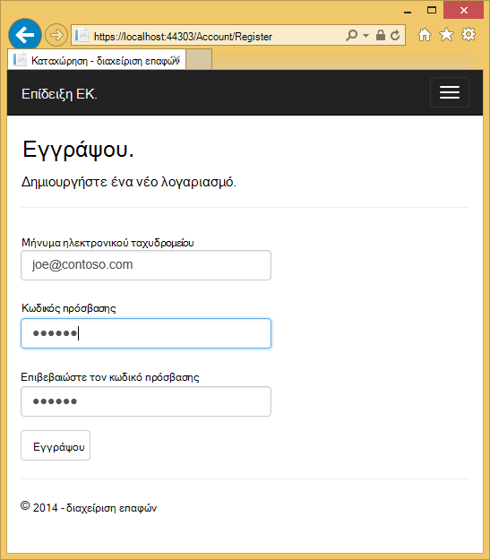

1. Κάντε κλικ στη σύνδεση *Επίδειξη Εκατοστών* και βεβαιωθείτε ότι μπορείτε να δείτε τα δεδομένα.

1. Κάντε κλικ σε μια σύνδεση επεξεργασία στη σελίδα, θα ανακατευθυνθείτε στη σελίδα login (επειδή το ρόλο *canEdit* δεν προστίθεται ένα νέο τοπικό χρήστη).

1. Συνδεθείτε ως *user1@contoso.com* με κωδικό πρόσβασης του "P_assw0rd1" (το "0" σε "word" είναι μηδέν). Ανακατευθύνεστε στη σελίδα επεξεργασία που είχατε επιλέξει προηγουμένως. 
2. 

    Εάν δεν μπορείτε να συνδεθείτε με αυτόν το λογαριασμό και τον κωδικό πρόσβασης, δοκιμάστε να αντιγράψετε τον κωδικό πρόσβασης από τον κωδικό προέλευσης και επικόλλησή του. Εάν εξακολουθεί να είναι δυνατή η σύνδεση, ελέγξτε τη στήλη **όνομα χρήστη** του πίνακα **AspNetUsers** για να επαληθεύσετε *user1@contoso.com* προστέθηκε. 

1. Επαλήθευση μπορείτε να κάνετε αλλαγές στα δεδομένα.

## Ανάπτυξη της εφαρμογής Azure

1. Στο Visual Studio, κάντε δεξί κλικ στο έργο στην **Εξερεύνηση λύσεων** και επιλέξτε **Δημοσίευση** από το μενού περιβάλλοντος.

    ![Δημοσίευση στο μενού περιβάλλοντος έργου][firsdeploy003]

    Ανοίγει ο οδηγός **Δημοσίευση Web** .

1. Κάντε κλικ στην καρτέλα " **Ρυθμίσεις** " στην αριστερή πλευρά του παραθύρου διαλόγου **Δημοσίευση Web** . 

2. Στην περιοχή **ApplicationDbContext** , επιλέξτε τη βάση δεδομένων που δημιουργήσατε κατά τη δημιουργία του έργου.
   

1. Στην περιοχή **ContactManagerContext**, επιλέξτε **Εκτέλεση πρώτη μετεγκαταστάσεις κώδικα**.

    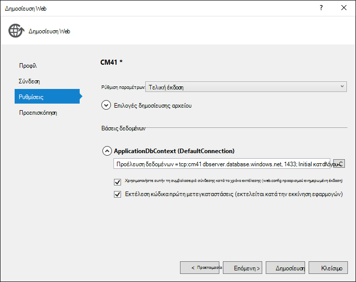

1. Κάντε κλικ στο κουμπί **Δημοσίευση**.

1. Συνδεθείτε ως *user1@contoso.com* (με τον κωδικό πρόσβασης του "P_assw0rd1") και βεβαιωθείτε ότι μπορείτε να επεξεργαστείτε δεδομένα.

1. Αποσυνδεθείτε.

1. Μεταβείτε στην [Κονσόλα Google τους προγραμματιστές](https://console.developers.google.com/) και στην καρτέλα ενημέρωση **διαπιστευτηρίων** την ανακατεύθυνση URIS και JavaScript Orgins για να χρησιμοποιήσετε τη διεύθυνση URL Azure.

1. Συνδεθείτε χρησιμοποιώντας Google ή το Facebook. Που θα προσθέσετε το λογαριασμό Google ή το Facebook στο ρόλο **canEdit** . Εάν λάβετε ένα σφάλμα HTTP 400 με το μήνυμα *την ανακατεύθυνση URI στην πρόσκληση σε: https://contactmanager {version}.azurewebsites.net/signin-google μου δεν συμφωνεί με μια καταχωρημένες redirect URI.*, θα πρέπει να περιμένετε μέχρι να μεταβιβάζονται τις αλλαγές που κάνατε. Εάν λάβετε αυτό το σφάλμα μετά από περισσότερες από μερικά λεπτά, επαληθεύστε την URIs είναι σωστά.

### Διακοπή της εφαρμογής web να εμποδίσετε άλλα άτομα από την καταχώρηση  

1. Στην **Εξερεύνηση Server**, μεταβείτε στο **Azure > εφαρμογής υπηρεσίας > {σας ομάδα πόρων} > {την εφαρμογή web της}**.

4. Κάντε δεξί κλικ στην εφαρμογή web και επιλέξτε **Διακοπή**. 

    Εναλλακτικά, από την [Πύλη Azure](https://portal.azure.com/), μπορείτε να μεταβείτε στο blade του web app, στη συνέχεια, κάντε κλικ στο εικονίδιο **Διακοπή** στο επάνω μέρος του blade.

    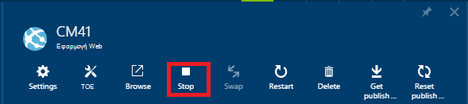

### Κατάργηση AddToRoleAsync, δημοσίευση και έλεγχος

1. Σχόλια ή να καταργήσετε τον παρακάτω κώδικα από τη μέθοδο **ExternalLoginConfirmation** στον ελεγκτή λογαριασμό:

        await UserManager.AddToRoleAsync(user.Id, "canEdit");

1. Δημιουργήστε το έργο (η οποία αποθηκεύει τις αλλαγές του αρχείου και επαληθεύει δεν έχετε σφάλματα μεταγλώττισης).

5. Κάντε δεξί κλικ στο έργο στην **Εξερεύνηση λύσεων** και επιλέξτε **Δημοσίευση**.

       
    
4. Κάντε κλικ στο κουμπί **Έναρξη Preview** . Μόνο τα αρχεία που πρέπει να ενημερωθούν αναπτύσσονται.

5. Ξεκινήστε την εφαρμογή web από το Visual Studio ή από την πύλη. **Δεν θα μπορείτε να δημοσιεύσετε ενώ έχει διακοπεί η εφαρμογή web**.

    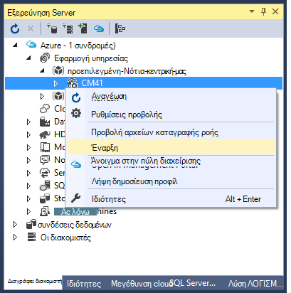

5. Επιστρέψτε στο Visual Studio και κάντε κλικ στο κουμπί **Δημοσίευση**.

3. Εφαρμογή της Azure ανοίγει στο προεπιλεγμένο πρόγραμμα περιήγησης. Εάν είστε συνδεδεμένοι, αποσυνδεθείτε, ώστε να μπορείτε να προβάλετε την αρχική σελίδα ως ανώνυμος χρήστης.  

4. Κάντε κλικ στη σύνδεση **για** . Θα ανακατευθυνθείτε στο αρχείο καταγραφής στη σελίδα.

5. Κάντε κλικ στη σύνδεση **καταχώρηση** στο αρχείο καταγραφής της σελίδας και δημιουργία λογαριασμού τοπικού. Θα χρησιμοποιήσουμε αυτού του λογαριασμού τοπικού για να επαληθεύσετε μπορείτε να αποκτήσετε πρόσβαση στις σελίδες ανάγνωσης μόνο, αλλά δεν μπορείτε να αποκτήσετε πρόσβαση σε σελίδες που αλλάζουν τα δεδομένα (που προστατεύονται από το ρόλο *canEdit* ). Αργότερα στην εκμάθηση θα καταργήσετε πρόσβασης του λογαριασμού τοπικού. 

    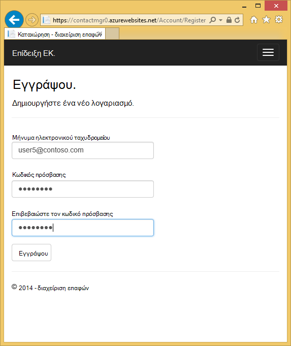

1. Βεβαιωθείτε ότι μπορείτε να περιηγηθείτε στις σελίδες *σχετικά με το* και *επαφή* .

    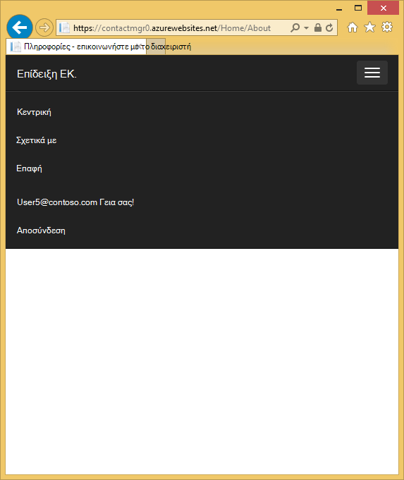

1. Κάντε κλικ στη σύνδεση **Εκατοστών επίδειξη** για να μεταβείτε στον ελεγκτή **εκατοστών** . Εναλλακτικά, μπορείτε να προσαρτήσετε *εκατοστών* στη διεύθυνση URL. 

    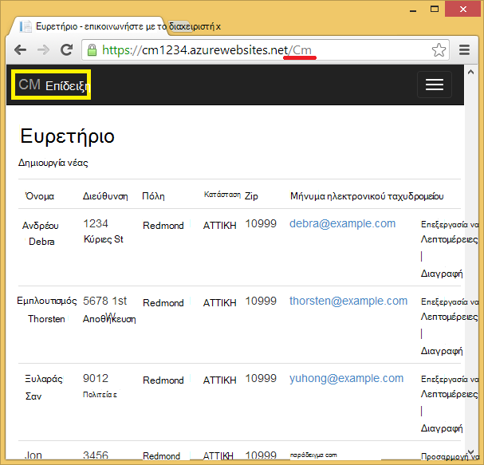
 
1. Κάντε κλικ στην επιλογή σύνδεση επεξεργασίας. 

    Ανακατευθύνεστε στη σελίδα login. 

2. Στην περιοχή **χρησιμοποιείτε κάποια άλλη υπηρεσία για να συνδεθείτε**, κάντε κλικ στην επιλογή Google ή Facebook και καταγραφής με το λογαριασμό που έχετε ήδη καταχωρήσει. (Εάν εργάζεστε γρήγορα και δεν έχει λήξει το σας cookie περιόδου λειτουργίας, που θα συνδέεται αυτόματα με το λογαριασμό Google ή το Facebook είχατε χρησιμοποιήσει στο παρελθόν.)

2. Βεβαιωθείτε ότι μπορείτε να επεξεργαστείτε δεδομένα ενώ είστε συνδεδεμένοι σε αυτόν το λογαριασμό.

    **Σημείωση:** Που δεν είναι δυνατό να αποσυνδέεστε από το Google από αυτό εφαρμογή και να συνδεθείτε σε ένα λογαριασμό διαφορετικό google με το ίδιο πρόγραμμα περιήγησης. Εάν χρησιμοποιείτε ένα πρόγραμμα περιήγησης, θα πρέπει να μεταβείτε στο Google και αποσυνδεθείτε. Μπορείτε να συνδεθείτε με έναν άλλο λογαριασμό από την ίδια υπηρεσία ελέγχου ταυτότητας τρίτου (όπως Google) χρησιμοποιώντας ένα διαφορετικό πρόγραμμα περιήγησης.

    Εάν δεν έχετε συμπληρώσει το πρώτο και το τελευταίο όνομα των πληροφοριών του λογαριασμού σας Google, θα παρουσιαστεί ένα NullReferenceException.

## Εξετάστε το SQL Azure DB ##

1. Στην **Εξερεύνηση Server**, μεταβείτε στο **Azure > βάσεις δεδομένων SQL > {τη βάση δεδομένων}**

2. Κάντε δεξί κλικ τη βάση δεδομένων και, στη συνέχεια, επιλέξτε **Άνοιγμα στην Εξερεύνηση αντικειμένου SQL Server**.
 
    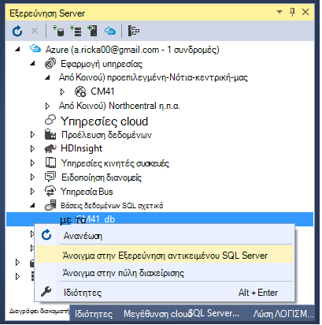
 
3. Εάν δεν έχετε συνδεθεί αυτήν τη βάση δεδομένων προηγουμένως, ίσως σας ζητηθεί να προσθέσετε έναν κανόνα τείχους προστασίας για να ενεργοποιήσετε την πρόσβαση για την τρέχουσα διεύθυνση IP. Η διεύθυνση IP θα προ-γέμισμα. Απλώς κάντε κλικ στην επιλογή **Προσθήκη κανόνα τείχους προστασίας** για να ενεργοποιήσετε την πρόσβαση.

    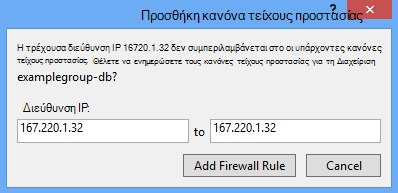

3. Συνδεθείτε με τη βάση δεδομένων με το όνομα χρήστη και τον κωδικό πρόσβασης που καθορίσατε όταν δημιουργήσατε το διακομιστή βάσης δεδομένων. 
 
1. Κάντε δεξί κλικ στον πίνακα **AspNetUsers** και επιλέξτε **Προβολή δεδομένων**.

    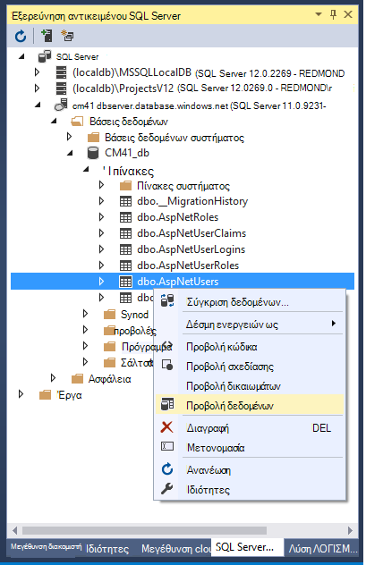
 
1. Σημειώστε το αναγνωριστικό από το λογαριασμό Google που έχουν καταχωρηθεί να ενσωματωθεί το ρόλο **canEdit** και το αναγνωριστικό του *user1@contoso.com*. Αυτά πρέπει να είναι το μόνο οι χρήστες στο ρόλο **canEdit** . (Θα επαληθεύσετε που στο επόμενο βήμα.)

    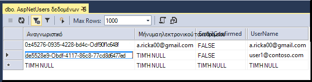
 
2. Στην **Εξερεύνηση αντικειμένου SQL Server**, κάντε δεξί κλικ στην **AspNetUserRoles** και επιλέξτε **Προβολή δεδομένων**.

    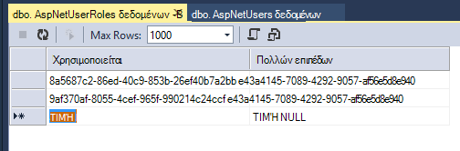
 
3. Βεβαιωθείτε ότι το **αναγνωριστικό χρήστη** είναι από *user1@contoso.com* και το λογαριασμό Google που έχουν καταχωρηθεί. 

## Αντιμετώπιση προβλημάτων

Εάν αντιμετωπίσετε προβλήματα, εδώ θα βρείτε ορισμένες προτάσεις για το τι να δοκιμάσετε.

* Σφάλματα προμήθειας SQL βάσης δεδομένων - βεβαιωθείτε ότι έχετε επιλέξει το τρέχον SDK εγκατεστημένο. Εκδόσεις πριν από την 2.8.1 έχουν ένα σφάλμα το οποίο σε ορισμένα σενάρια προκαλεί σφάλματα όταν ΣΎΓΚΡΙΣΗ προσπαθεί να δημιουργήσετε το διακομιστή βάσης δεδομένων ή τη βάση δεδομένων.
* Μήνυμα σφάλματος "η λειτουργία δεν υποστηρίζεται για τον τύπο προσφοράς συνδρομής" κατά τη δημιουργία Azure πόρων - όπως περιγράφεται παραπάνω.
* Σφάλματα κατά την ανάπτυξη - μπορείτε να μεταβείτε στο άρθρο [βασικές ανάπτυξης ASP.NET](web-sites-dotnet-get-started.md) . Που είναι απλούστερο σενάριο ανάπτυξης και εάν έχετε το ίδιο πρόβλημα εκεί αυτό μπορεί να είναι πιο εύκολο να απομονώσετε. Για παράδειγμα, σε ορισμένες εταιρικά περιβάλλοντα ένα εταιρικό τείχος προστασίας ενδέχεται να μην ανάπτυξη Web να κάνουν τα είδη των συνδέσεων σε Azure που απαιτεί.
* Δεν υπάρχει επιλογή για να επιλέξετε συμβολοσειρά σύνδεσης του οδηγού δημοσίευση Web κατά την ανάπτυξη - Εάν χρησιμοποιήσατε μια διαφορετική μέθοδο για να δημιουργήσετε Azure τους πόρους σας (για παράδειγμα, που προσπαθείτε να αναπτύξετε μια εφαρμογή web και μια βάση δεδομένων SQL που δημιουργήσατε στην πύλη), τη βάση δεδομένων SQL ενδέχεται να μην είναι συσχετισμένη με την εφαρμογή web. Η λύση ευκολότερος είναι για να δημιουργήσετε μια νέα εφαρμογή web και τη βάση δεδομένων με τη χρήση και στο, όπως φαίνεται στην εκμάθηση. Δεν χρειάζεται να ξεκινήσετε το πρόγραμμα εκμάθησης - στον Οδηγό δημοσίευση Web μπορείτε να επιλέξετε για να δημιουργήσετε μια νέα εφαρμογή web και λάβετε το ίδιο Azure πόρων δημιουργίας παράθυρο διαλόγου που λαμβάνετε κατά τη δημιουργία του έργου.
* Οδηγίες για την πύλη για προγραμματιστές Google ή το Facebook είναι ενημερωμένα - δείτε το σχόλιο Disqus διαθέσιμης στο τέλος αυτού του προγράμματος εκμάθησης.

## Επόμενα βήματα

Έχετε δημιουργήσει μια βασική εφαρμογή web ASP.NET MVC που πραγματοποιεί έλεγχο ταυτότητας χρηστών. Για περισσότερες πληροφορίες σχετικά με τις κοινές εργασίες ελέγχου ταυτότητας και τον τρόπο για να διατηρήσει ασφαλείς ευαίσθητα δεδομένα, δείτε τα παρακάτω προγράμματα εκμάθησης.

- [Δημιουργία ασφαλούς εφαρμογής web ASP.NET MVC 5 με το αρχείο καταγραφής στο μήνυμα ηλεκτρονικού ταχυδρομείου επιβεβαίωσης και επαναφορά κωδικού πρόσβασης](http://www.asp.net/mvc/overview/getting-started/create-an-aspnet-mvc-5-web-app-with-email-confirmation-and-password-reset)
- [Εφαρμογή ASP.NET MVC 5 με SMS και το ηλεκτρονικό ταχυδρομείο Έλεγχος ταυτότητας δύο παραγόντων](http://www.asp.net/mvc/overview/getting-started/aspnet-mvc-5-app-with-sms-and-email-two-factor-authentication)
- [Βέλτιστες πρακτικές για την ανάπτυξη κωδικούς πρόσβασης και άλλα ευαίσθητα δεδομένα σε ASP.NET και Azure](http://www.asp.net/identity/overview/features-api/best-practices-for-deploying-passwords-and-other-sensitive-data-to-aspnet-and-azure) 
- [Δημιουργία εφαρμογής ASP.NET MVC 5 με το Facebook και το Google OAuth2](http://www.asp.net/mvc/tutorials/mvc-5/create-an-aspnet-mvc-5-app-with-facebook-and-google-oauth2-and-openid-sign-on ) Αυτό περιλαμβάνει οδηγίες σχετικά με τον τρόπο για να προσθέσετε δεδομένα προφίλ για την καταχώρηση χρήστη DB και για λεπτομερείς οδηγίες σχετικά με τη χρήση του Facebook ως μια υπηρεσία παροχής ελέγχου ταυτότητας.
- [Γρήγορα αποτελέσματα με το ASP.NET MVC 5](http://www.asp.net/mvc/tutorials/mvc-5/introduction/getting-started)

Για μια πιο σύνθετη πρόγραμμα εκμάθησης σχετικά με τη χρήση του πλαισίου οντότητα, ανατρέξτε στο θέμα [Γρήγορα αποτελέσματα με EF και MVC](http://www.asp.net/mvc/tutorials/getting-started-with-ef-using-mvc/creating-an-entity-framework-data-model-for-an-asp-net-mvc-application).

Αυτό το πρόγραμμα εκμάθησης έχει συνταχθεί από [Rick Anderson](http://blogs.msdn.com/b/rickandy/) (Twitter [@RickAndMSFT](https://twitter.com/RickAndMSFT)) με τη βοήθεια από τον Tom ο Δημητρίου και ο Κωνσταντίνος Dorrans (Twitter [@blowdart](https://twitter.com/blowdart)). 

***Please αφήσετε σχόλια*** σε τι σας αρέσει ή τι θα θέλατε να δείτε η βελτιωμένη, όχι μόνο σχετικά με το ίδιο το πρόγραμμα εκμάθησης, αλλά και σχετικά με τα προϊόντα που δείχνει το. Τα σχόλιά σας θα Βοηθήστε μας να δίνετε προτεραιότητα σε βελτιώσεις. Επίσης, μπορείτε να ζητήσετε και να ψηφίσετε στη νέα θέματα στην [Εμφάνιση εμένα πώς με κώδικα](http://aspnet.uservoice.com/forums/228522-show-me-how-with-code).

## Τι έχει αλλάξει

* Για οδηγίες για την αλλαγή από τοποθεσίες Web App υπηρεσία ανατρέξτε στο θέμα: [Azure εφαρμογής υπηρεσίας και τον αντίκτυπο σχετικά με τις υπάρχουσες υπηρεσίες Azure](http://go.microsoft.com/fwlink/?LinkId=529714)

<!-- bookmarks -->
[Add an OAuth Provider]: #addOauth
[Using the Membership API]:#mbrDB
[Create a Data Deployment Script]:#ppd
[Update the Membership Database]:#ppd2

[setupwindowsazureenv]: #bkmk_setupwindowsazure
[createapplication]: #bkmk_createmvc4app
[deployapp1]: #bkmk_deploytowindowsazure1
[deployapp11]: #bkmk_deploytowindowsazure11
[adddb]: #bkmk_addadatabase

<!-- images-->
[rx2]: ./media/web-sites-dotnet-deploy-aspnet-mvc-app-membership-oauth-sql-database/rx2.png

[rx5]: ./media/web-sites-dotnet-deploy-aspnet-mvc-app-membership-oauth-sql-database-vs2013/rx5.png
[rx6]: ./media/web-sites-dotnet-deploy-aspnet-mvc-app-membership-oauth-sql-database-vs2013/rx6.png
[rx7]: ./media/web-sites-dotnet-deploy-aspnet-mvc-app-membership-oauth-sql-database-vs2013/rx7.png
[rx8]: ./media/web-sites-dotnet-deploy-aspnet-mvc-app-membership-oauth-sql-database-vs2013/rx8.png
[rx9]: ./media/web-sites-dotnet-deploy-aspnet-mvc-app-membership-oauth-sql-database-vs2013/rx9.png

[rxb]: ./media/web-sites-dotnet-deploy-aspnet-mvc-app-membership-oauth-sql-database/rxb.png

[rxSSL]: ./media/web-sites-dotnet-deploy-aspnet-mvc-app-membership-oauth-sql-database/rxSSL.png

[rxNOT]: ./media/web-sites-dotnet-deploy-aspnet-mvc-app-membership-oauth-sql-database-vs2013/rxNOT.png
[rxNOT2]: ./media/web-sites-dotnet-deploy-aspnet-mvc-app-membership-oauth-sql-database-vs2013/rxNOT2.png

[rxNOT]: ./media/web-sites-dotnet-deploy-aspnet-mvc-app-membership-oauth-sql-database-vs2013/rxNOT.png
[rxNOT]: ./media/web-sites-dotnet-deploy-aspnet-mvc-app-membership-oauth-sql-database-vs2013/rxNOT.png
[rxNOT]: ./media/web-sites-dotnet-deploy-aspnet-mvc-app-membership-oauth-sql-database-vs2013/rxNOT.png
[rr1]: ./media/web-sites-dotnet-deploy-aspnet-mvc-app-membership-oauth-sql-database-vs2013/rr1.png

[rxPrevDB]: ./media/web-sites-dotnet-deploy-aspnet-mvc-app-membership-oauth-sql-database-vs2013/rxPrevDB.png

[rxWSnew]: ./media/web-sites-dotnet-deploy-aspnet-mvc-app-membership-oauth-sql-database-vs2013/rxWSnew2.png
[rxCreateWSwithDB]: ./media/web-sites-dotnet-deploy-aspnet-mvc-app-membership-oauth-sql-database-vs2013/rxCreateWSwithDB.png

[setup007]: ./media/web-sites-dotnet-deploy-aspnet-mvc-app-membership-oauth-sql-database-vs2013/dntutmobile-setup-azure-site-004.png

[newapp004]: ./media/web-sites-dotnet-deploy-aspnet-mvc-app-membership-oauth-sql-database/dntutmobile-createapp-004.png

[firsdeploy003]: ./media/web-sites-dotnet-deploy-aspnet-mvc-app-membership-oauth-sql-database/dntutmobile-deploy1-publish-001.png

[adddb002]: ./media/web-sites-dotnet-deploy-aspnet-mvc-app-membership-oauth-sql-database/dntutmobile-adddatabase-002.png
[addcode001]: ./media/web-sites-dotnet-deploy-aspnet-mvc-app-membership-oauth-sql-database/dntutmobile-controller-add-context-menu.png

[addcode008]: ./media/web-sites-dotnet-deploy-aspnet-mvc-app-membership-oauth-sql-database-vs2013/dntutmobile-migrations-package-manager-menu.png
[addcode009]: ./media/web-sites-dotnet-deploy-aspnet-mvc-app-membership-oauth-sql-database/dntutmobile-migrations-package-manager-console.png

[Important information about ASP.NET in Azure web apps]: #aspnetwindowsazureinfo
[Next steps]: #nextsteps

[ImportPublishSettings]: ./media/web-sites-dotnet-deploy-aspnet-mvc-app-membership-oauth-sql-database-vs2013/ImportPublishSettings.png
 
