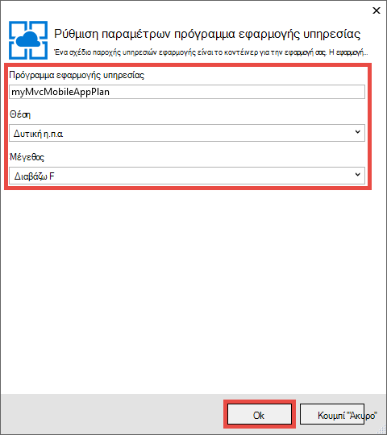
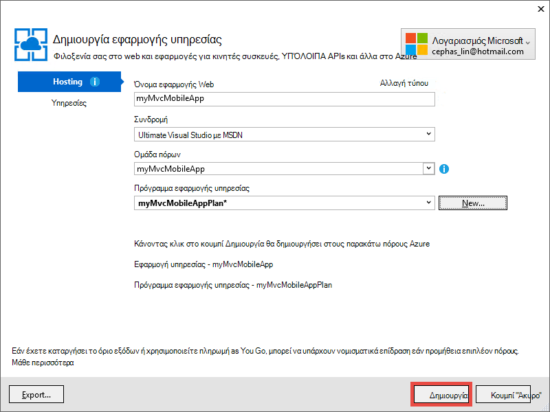

<properties 
    pageTitle="Ανάπτυξη εφαρμογής κινητή web ASP.NET MVC 5 στο Azure εφαρμογής υπηρεσίας" 
    description="Ένα πρόγραμμα εκμάθησης που σας μαθαίνει πώς να αναπτύξετε μια εφαρμογή web σε Azure εφαρμογής υπηρεσίας με χρήση δυνατοτήτων για κινητές συσκευές σε εφαρμογή web ASP.NET MVC 5." 
    services="app-service" 
    documentationCenter=".net" 
    authors="cephalin" 
    manager="wpickett" 
    editor="jimbe"/>

<tags 
    ms.service="app-service" 
    ms.workload="na" 
    ms.tgt_pltfrm="na" 
    ms.devlang="dotnet" 
    ms.topic="article" 
    ms.date="01/12/2016" 
    ms.author="cephalin;riande"/>

# Ανάπτυξη εφαρμογής κινητή web ASP.NET MVC 5 στο Azure εφαρμογής υπηρεσίας

Αυτό το πρόγραμμα εκμάθησης θα μάθετε τα βασικά στοιχεία σχετικά με τον τρόπο για να δημιουργήσετε μια εφαρμογή web ASP.NET MVC 5 που είναι φιλική mobile και να αναπτύξετε για Azure εφαρμογής υπηρεσίας. Σε αυτό το πρόγραμμα εκμάθησης, θα πρέπει [οπτική το Studio Express 2013 για το Web] [ Visual Studio Express 2013] ή την επαγγελματική έκδοση του Visual Studio εάν που έχετε ήδη. Μπορείτε να χρησιμοποιήσετε το [Visual Studio 2015] , αλλά τα στιγμιότυπα οθόνης θα είναι διαφορετικές και πρέπει να χρησιμοποιήσετε τα πρότυπα 4.x ASP.NET.

[AZURE.INCLUDE [create-account-and-websites-note](../../includes/create-account-and-websites-note.md)]

## Τι θα δημιουργείτε

Για αυτό το πρόγραμμα εκμάθησης, θα προσθέσετε δυνατοτήτων για κινητές συσκευές στην απλή εφαρμογή διάσκεψης καταχώρηση που παρέχεται με το [starter project][StarterProject]. Το παρακάτω στιγμιότυπο οθόνης εμφανίζει τις περιόδους λειτουργίας ASP.NET στην ολοκληρωμένη εφαρμογή, όπως φαίνεται στο το προσομοίωσης περιήγησης στα εργαλεία για προγραμματιστές του Internet Explorer 11 F12.

![][FixedSessionsByTag]

Μπορείτε να χρησιμοποιήσετε τα εργαλεία για προγραμματιστές του Internet Explorer 11 F12 και το [εργαλείο Fiddler] [ Fiddler] για τον εντοπισμό σφαλμάτων της εφαρμογής σας. 

## Θα μάθετε δεξιότητες

Εδώ θα βρείτε τι θα μάθετε:

-   Πώς μπορείτε να χρησιμοποιήσετε Visual Studio 2013 για να δημοσιεύσετε την εφαρμογή web σας απευθείας σε μια εφαρμογή web στο Azure εφαρμογής υπηρεσίας.
-   Πώς τα πρότυπα ASP.NET MVC 5 χρησιμοποιούν το πλαίσιο CSS εκκίνησης για τη βελτίωση της εμφάνισης σε κινητές συσκευές
-   Πώς μπορείτε να δημιουργήσετε προβολές mobile συγκεκριμένο στόχευσης συγκεκριμένων κινητή τα προγράμματα περιήγησης, όπως το iPhone και Android
-   Πώς να δημιουργείτε προβολές αποκρίνεται (προβολές που αποκρίνεται σε διάφορα προγράμματα περιήγησης όλες τις συσκευές)

## Ρυθμίστε το περιβάλλον ανάπτυξης

Ρύθμιση του περιβάλλον ανάπτυξής σας μέσω της εγκατάστασης του SDK Azure για το .NET 2.5.1 ή νεότερη έκδοση. 

1. Για να εγκαταστήσετε το SDK Azure για το .NET, κάντε κλικ στη σύνδεση παρακάτω. Εάν δεν έχετε εγκαταστήσει ακόμη Visual Studio 2013, θα εγκατασταθούν κατά τη σύνδεση. Αυτό το πρόγραμμα εκμάθησης απαιτεί Visual Studio 2013. [Azure SDK για το Visual Studio 2013][AzureSDKVs2013]
1. Στο παράθυρο του προγράμματος εγκατάστασης πλατφόρμας Web, κάντε κλικ στην επιλογή **εγκατάσταση** και συνεχίσετε με την εγκατάσταση.

Θα χρειαστεί επίσης ένα πρόγραμμα περιήγησης για κινητό προσομοίωσης. Θα λειτουργούν οποιοδήποτε από τα εξής:

-   Προσομοίωσης περιήγησης στα [Εργαλεία για προγραμματιστές του Internet Explorer 11 F12] [ EmulatorIE11] (χρησιμοποιείται σε όλα τα στιγμιότυπα οθόνης κινητού προγράμματος περιήγησης). Έχει υποδείγματα συμβολοσειρά παράγοντα χρήστη για το Windows Phone 8, Windows Phone 7 και Apple iPad.
-   Πρόγραμμα περιήγησης προσομοίωσης στο [Google Chrome DevTools][EmulatorChrome]. Περιέχει προκαθορισμένες ρυθμίσεις για πολλές συσκευές Android, καθώς και Apple iPhone, Apple iPad και Amazon Kindle Fire. Το προσομοιώνει επίσης συμβάντα αφής.
-   [Κινητές συσκευές προσομοίωσης opera][EmulatorOpera]

Έργα του Visual Studio με C\# πηγαίος κώδικας είναι διαθέσιμες ώστε να συνοδεύουν αυτό το θέμα:

-   [Λήψη Starter έργου][StarterProject]
-   [Ολοκλήρωση της λήψης του έργου][CompletedProject]

##Αναπτύξτε το έργο starter σε μια εφαρμογή Azure web

1.  Λήψη εφαρμογής διάσκεψης καταχώρηση [έργου starter][StarterProject].

2.  Στη συνέχεια, στην Εξερεύνηση των Windows, κάντε δεξιό κλικ στο αρχείο ZIP λήψης και επιλέξτε *Ιδιότητες*.

3.  Στο παράθυρο διαλόγου **Ιδιότητες** , επιλέξτε το κουμπί **Αναίρεση αποκλεισμού** . (Η κατάργηση του αποκλεισμού δεν επιτρέπει μια προειδοποίηση ασφαλείας που προκύπτει όταν προσπαθείτε να χρησιμοποιήσετε ένα αρχείο *.zip* που έχετε λάβει από το web.)

4.  Κάντε δεξί κλικ στο αρχείο ZIP και επιλέξτε **Εξαγωγή όλων** για να αποσυμπίεση του αρχείου. 

5.  Στο Visual Studio, ανοίξτε το αρχείο *C#\Mvc5Mobile.sln* .

6.  Στην Εξερεύνηση λύσεων, κάντε δεξί κλικ στο έργο και κάντε κλικ στο κουμπί **Δημοσίευση**.

    ![][DeployClickPublish]

7.  Στη δημοσίευση Web, κάντε κλικ στην επιλογή **Microsoft Azure εφαρμογής υπηρεσίας**.

    ![][DeployClickWebSites]

8.  Εάν δεν έχετε ήδη συνδεθεί στο Azure, κάντε κλικ στην επιλογή **Προσθήκη λογαριασμού**.

    ![][DeploySignIn]

9.  Ακολουθήστε τις οδηγίες για να συνδεθείτε στο λογαριασμό σας στο Azure.

11. Παράθυρο διαλόγου εφαρμογή υπηρεσίας τώρα θα πρέπει να εμφανίζουν που κατά την είσοδο. Κάντε κλικ στην επιλογή **νέα**.

    ![][DeployNewWebsite]  

12. Στο πεδίο **Όνομα εφαρμογής Web** , καθορίστε ένα μοναδικό εφαρμογή πρόθεμα όνομα. Θα είναι το όνομα της εφαρμογής web πλήρως προσδιορισμένο * &lt;πρόθεμα >*. azurewebsites.net. Επίσης, επιλέξτε ή καθορίστε ένα νέο όνομα ομάδας πόρων σε **ομάδα πόρων**. Στη συνέχεια, κάντε κλικ στην επιλογή **Δημιουργία** για να δημιουργήσετε ένα νέο πρόγραμμα εφαρμογής υπηρεσίας.

    ![][DeploySiteSettings]

13. Ρύθμιση παραμέτρων στο νέο πρόγραμμα εφαρμογής υπηρεσίας και κάντε κλικ στο **κουμπί OK**. 

    

13. Επιστρέψτε στο παράθυρο διαλόγου Δημιουργία εφαρμογής υπηρεσίας, κάντε κλικ στην επιλογή **Δημιουργία**.

     

13. Μετά από το Azure πόροι δημιουργούνται, δημοσίευση Web παραθύρου διαλόγου θα συμπληρωθεί με τις ρυθμίσεις για τη νέα εφαρμογή. Κάντε κλικ στο κουμπί **Δημοσίευση**.

    ![][DeployPublishSite]

    Μόλις Visual Studio ολοκληρωθεί η δημοσίευση του έργου starter στην εφαρμογή Azure web, ανοίγει το πρόγραμμα περιήγησης υπολογιστή για να εμφανίσετε το πραγματικό web app.

14. Ξεκινήστε το πρόγραμμα περιήγησης για κινητό προσομοίωσης, αντιγράψτε τη διεύθυνση URL για την εφαρμογή διάσκεψης (*<prefix>*. azurewebsites.net) σε το προσομοίωσης, και, στη συνέχεια, κάντε κλικ στο κουμπί επάνω δεξιά και επιλέξτε **Αναζήτηση κατά ετικέτα**. Εάν χρησιμοποιείτε τον Internet Explorer 11 ως το προεπιλεγμένο πρόγραμμα περιήγησης, απλώς πρέπει να πληκτρολογήσετε `F12`, στη συνέχεια, `Ctrl+8`, και, στη συνέχεια, αλλάξτε το προφίλ του προγράμματος περιήγησης σε **Windows Phone**. Η παρακάτω εικόνα δείχνει την προβολή *AllTags* με κατακόρυφο προσανατολισμό (από την επιλογή **Αναζήτηση κατά ετικέτα**).

    ![][AllTags]

>[AZURE.TIP] Ενώ μπορείτε να προσθέσετε την εφαρμογή σας MVC 5 από μέσα σε Visual Studio, μπορείτε να δημοσιεύσετε την εφαρμογή web της Azure ξανά για να επιβεβαιώσετε την εφαρμογή web ζωντανή απευθείας από το πρόγραμμα περιήγησης για κινητό ή ένα πρόγραμμα περιήγησης προσομοιωτή.

Η οθόνη είναι πολύ μπορεί να διαβαστεί σε μια κινητή συσκευή. Επίσης ήδη, μπορείτε να δείτε ορισμένα από τα οπτικά εφέ εφαρμόζεται από το πλαίσιο εκκίνησης CSS.
Κάντε κλικ στη σύνδεση **ASP.NET** .

![][SessionsByTagASP.NET]

Η προβολή ετικέτα ASP.NET είναι προσαρμόζεται ζουμ στην οθόνη, η οποία εκκίνησης κάνει αυτόματα για εσάς. Ωστόσο, μπορείτε να βελτιώσετε αυτής της προβολής για να ταιριάζουν καλύτερα το πρόγραμμα περιήγησης για κινητό. Για παράδειγμα, η στήλη **ημερομηνία** είναι δύσκολο να διαβάσετε. Αργότερα στην εκμάθηση θα αλλάξετε την προβολή *AllTags* ώστε να είναι φιλική mobile.

##Πλαίσιο εκκίνησης CSS

Δημιουργία του 5 MVC πρότυπο είναι ενσωματωμένη υποστήριξη εκκίνησης. Έχετε ήδη δει πώς βελτιώνει αμέσως διαφορετικές προβολές στην εφαρμογή σας. Για παράδειγμα, τη γραμμή περιήγησης στο επάνω μέρος είναι συμπτυσσόμενο αυτόματα όταν είναι μικρότερη του πλάτους του προγράμματος περιήγησης. Στο πρόγραμμα περιήγησης υπολογιστή, δοκιμάστε την αλλαγή μεγέθους του παραθύρου περιήγησης και δείτε πώς τη γραμμή περιήγησης αλλάζει την εμφάνιση και αίσθηση. Αυτό είναι το σχέδιο αποκρίνεται web που είναι ενσωματωμένο στο εκκίνησης.

Για να δείτε πώς θα φαίνεται το Web app χωρίς εκκίνησης, ανοίξτε *εφαρμογή\_Έναρξη\\BundleConfig.cs* και σχόλιο τις γραμμές που περιέχουν *bootstrap.js* και *bootstrap.css*. Ο ακόλουθος κώδικας εμφανίζει τις τελευταίες δύο προτάσεις από το `RegisterBundles` μέθοδο μετά την αλλαγή:

     bundles.Add(new ScriptBundle("~/bundles/bootstrap").Include(
              //"~/Scripts/bootstrap.js",
              "~/Scripts/respond.js"));

    bundles.Add(new StyleBundle("~/Content/css").Include(
              //"~/Content/bootstrap.css",
              "~/Content/site.css"));

Πατήστε το πλήκτρο `Ctrl+F5` για να εκτελέσετε την εφαρμογή.

Παρατηρήστε ότι η γραμμή περιήγησης συμπτυσσόμενες είναι τώρα ακριβώς συνήθεις λίστα χωρίς σειρά. Κάντε ξανά κλικ στο κουμπί **Αναζήτηση κατά ετικέτα** και, στη συνέχεια, κάντε κλικ στην επιλογή **ASP.NET**.
Στην προβολή κινητού προσομοίωσης, μπορείτε να δείτε τώρα που δεν είναι πλέον προσαρμόζεται ζουμ στην οθόνη και που πρέπει να κάνετε κύλιση προς το πλάι για να δείτε τη δεξιά πλευρά του πίνακα.

![][SessionsByTagASP.NETNoBootstrap]

Αναιρέσετε τις αλλαγές σας και ανανεώστε το πρόγραμμα περιήγησης κινητές συσκευές για να επιβεβαιώσετε ότι έχει γίνει επαναφορά της εμφάνισης φιλικούς προς mobile.

Δεν είναι συγκεκριμένη για ASP.NET MVC 5 εκκίνησης και μπορείτε να επωφεληθείτε από αυτές τις δυνατότητες σε οποιαδήποτε εφαρμογή web. Αλλά τώρα ενσωματωμένη στο πρότυπο έργου ASP.NET MVC 5, ώστε η εφαρμογή MVC 5 Web σας να επωφεληθείτε από εκκίνησης από προεπιλογή.

Για περισσότερες πληροφορίες σχετικά με την εκκίνησης, μεταβείτε στο το [εκκίνησης] [ BootstrapSite] τοποθεσίας.

Στην επόμενη ενότητα θα δείτε πώς μπορείτε να παράσχετε συγκεκριμένες προβολές mobile-πρόγραμμα περιήγησης.

##Παράκαμψη του προβολές, τις διατάξεις και μερικές προβολές

Μπορείτε να παρακάμψετε οποιαδήποτε προβολή (συμπεριλαμβανομένων των διατάξεων και μερικές προβολές) για κινητές συσκευές προγράμματα περιήγησης σε γενικές γραμμές, για ένα μεμονωμένα κινητού προγράμματος περιήγησης ή για οποιοδήποτε συγκεκριμένο πρόγραμμα περιήγησης. Για να παρέχουν μια προβολή κινητού συγκεκριμένο, μπορείτε να αντιγράψετε ένα αρχείο προβολής και να προσθέσετε *. Κινητό* στο όνομα του αρχείου. Για παράδειγμα, για να δημιουργήσετε μια προβολή κινητού *ευρετήριο* , μπορείτε να αντιγράψετε *προβολές\\για οικιακή χρήση\\Index.cshtml* να *προβολές\\για οικιακή χρήση\\Index.Mobile.cshtml*.

Σε αυτήν την ενότητα, θα δημιουργήσετε ένα αρχείο mobile συγκεκριμένη διάταξη.

Για να ξεκινήσετε, αντιγράψτε *προβολές\\κοινόχρηστα\\\_Layout.cshtml* να *προβολές\\κοινόχρηστα\\\_Layout.Mobile.cshtml*. Άνοιγμα * \_Layout.Mobile.cshtml* και να αλλάξετε τον τίτλο από την **Εφαρμογή MVC5** **MVC5**εφαρμογή (κινητό τηλέφωνο).

Σε κάθε `Html.ActionLink` κλήσεων για τη γραμμή περιήγησης, καταργήστε την "Αναζήτηση" σε κάθε σύνδεση *ActionLink*. Ο ακόλουθος κώδικας εμφανίζει την ολοκληρωμένη `<ul class="nav navbar-nav">` ετικέτα του αρχείου διάταξη για κινητές συσκευές.

    <ul class="nav navbar-nav">
        <li>@Html.ActionLink("Home", "Index", "Home")</li>
        <li>@Html.ActionLink("Date", "AllDates", "Home")</li>
        <li>@Html.ActionLink("Speaker", "AllSpeakers", "Home")</li>
        <li>@Html.ActionLink("Tag", "AllTags", "Home")</li>
    </ul>

Αντιγραφή του *προβολές\\για οικιακή χρήση\\AllTags.cshtml* αρχείων για να *προβολές\\για οικιακή χρήση\\AllTags.Mobile.cshtml*. Ανοίξτε το νέο αρχείο και να αλλάξετε το `<h2>` στοιχείο από το "Ετικέτες" σε "ετικέτες (Μ)":

    <h2>Tags (M)</h2>

Μεταβείτε στη σελίδα ετικέτες χρησιμοποιώντας ένα πρόγραμμα περιήγησης υπολογιστή και χρησιμοποιώντας προσομοίωσης κινητού προγράμματος περιήγησης. Το πρόγραμμα περιήγησης για κινητό προσομοίωσης εμφανίζει τις δύο αλλαγές που κάνατε (ο τίτλος από * \_Layout.Mobile.cshtml* και ο τίτλος από *AllTags.Mobile.cshtml*).

![][AllTagsMobile_LayoutMobile]

Αντίθετα, δεν έχει αλλάξει εμφάνισης του υπολογιστή (με τίτλους από * \_Layout.cshtml* και *AllTags.cshtml*).

![][AllTagsMobile_LayoutMobileDesktop]

##Δημιουργία προβολών αφορούν συγκεκριμένα το πρόγραμμα περιήγησης

Εκτός από τις προβολές συγκεκριμένο mobile και αφορούν συγκεκριμένα το επιφάνειας εργασίας, μπορείτε να δημιουργήσετε προβολές για ένα μεμονωμένο πρόγραμμα περιήγησης. Για παράδειγμα, μπορείτε να δημιουργήσετε προβολές που αφορούν συγκεκριμένα το iPhone ή το πρόγραμμα περιήγησης Android. Σε αυτήν την ενότητα, θα δημιουργήσετε μια διάταξη για το πρόγραμμα περιήγησης iPhone και μια έκδοση iPhone της προβολής *AllTags* .

Ανοίξτε το αρχείο *Global.asax* και προσθέστε τον ακόλουθο κώδικα στο κάτω μέρος του `Application_Start` μέθοδο.

    DisplayModeProvider.Instance.Modes.Insert(0, new DefaultDisplayMode("iPhone")
    {
        ContextCondition = (context => context.GetOverriddenUserAgent().IndexOf
            ("iPhone", StringComparison.OrdinalIgnoreCase) >= 0)
    });

Αυτός ο κωδικός καθορίζει μια νέα λειτουργία εμφάνισης με το όνομα "iPhone", το οποίο θα γίνει αντιστοίχιση κάθε εισερχόμενη αίτηση. Εάν η εισερχόμενη αίτηση ικανοποιεί τις συνθήκες που ορίζονται (δηλαδή, εάν τον παράγοντα χρήστη περιέχει τη συμβολοσειρά "iPhone"), θα φαίνεται ASP.NET MVC για προβολές του οποίου το όνομα περιέχει το επίθημα "iPhone".

>[AZURE.NOTE] Κατά την προσθήκη λειτουργίες προβολής κινητού αφορούν συγκεκριμένα το πρόγραμμα περιήγησης, για παράδειγμα για iPhone και Android, φροντίστε να ρυθμίσετε το πρώτο όρισμα `0` (εισαγωγή στο επάνω μέρος της λίστας) για να βεβαιωθείτε ότι η λειτουργία αφορούν συγκεκριμένα το πρόγραμμα περιήγησης υπερισχύει του προτύπου κινητές συσκευές (*. Mobile.cshtml). Εάν το πρότυπο κινητές συσκευές είναι στο επάνω μέρος της λίστας αντί για αυτό, θα είναι επιλεγμένη πάνω από τον λειτουργίας προβλεπόμενο προβολής (το πρώτο wins match και το πρότυπο κινητή αντιστοιχεί σε όλα τα προγράμματα περιήγησης κινητές συσκευές). 

Στον κώδικα, κάντε δεξί κλικ `DefaultDisplayMode`, επιλέξτε **επίλυση**και, στη συνέχεια, επιλέξτε `using System.Web.WebPages;`. Αυτό προσθέτει μια αναφορά σε το `System.Web.WebPages` χώρο ονομάτων, πού το `DisplayModeProvider` και `DefaultDisplayMode` τύποι ορίζονται.

![][ResolveDefaultDisplayMode]

Εναλλακτικά, μπορείτε να προσθέσετε μόνο με μη αυτόματο τρόπο την ακόλουθη γραμμή για να το `using` ενότητα του αρχείου.

    using System.Web.WebPages;

Αποθηκεύστε τις αλλαγές. Αντιγραφή του *προβολές\\κοινόχρηστα\\\_Layout.Mobile.cshtml* αρχείων για να *προβολές\\κοινόχρηστα\\\_Layout.iPhone.cshtml*. Ανοίξτε το νέο αρχείο και, στη συνέχεια, να αλλάξετε τον τίτλο από `MVC5 Application (Mobile)` να `MVC5 Application (iPhone)`.

Αντιγραφή του *προβολές\\για οικιακή χρήση\\AllTags.Mobile.cshtml* αρχείων για να *προβολές\\για οικιακή χρήση\\AllTags.iPhone.cshtml*. Στο νέο αρχείο, αλλάξτε το `<h2>` στοιχείου από το "ετικέτες (Μ)" για "Ετικέτες (iPhone)".

Εκτελέστε την εφαρμογή. Εκτελέστε ένα πρόγραμμα περιήγησης για κινητό προσομοίωσης, βεβαιωθείτε ότι το παράγοντα χρήστη έχει οριστεί σε "iPhone" και μεταβείτε στην προβολή *AllTags* . Εάν χρησιμοποιείτε το προσομοίωσης στα εργαλεία για προγραμματιστές του Internet Explorer 11 F12, ρυθμίστε τις παραμέτρους προσομοίωσης με το εξής:

-   Πρόγραμμα περιήγησης προφίλ = **Windows Phone**
-   Συμβολοσειρά παράγοντα χρήστη = **προσαρμοσμένη**
-   Προσαρμοσμένη συμβολοσειρά = **Apple-iPhone5C1/1001.525**

Το παρακάτω στιγμιότυπο οθόνης εμφανίζει την προβολή *AllTags* απόδοση το προσομοίωσης στα εργαλεία για προγραμματιστές Internet Explorer 11 F12 με τη συμβολοσειρά παράγοντα χρήστη προσαρμοσμένη (αυτή είναι μια συμβολοσειρά παράγοντα χρήστη iPhone 5 C).

![][AllTagsIPhone_LayoutIPhone]

Στο πρόγραμμα περιήγησης κινητές συσκευές, επιλέξτε τη σύνδεση **των ηχείων** . Επειδή δεν υπάρχει προβολή κινητού (*AllSpeakers.Mobile.cshtml*), η προεπιλεγμένη προβολή ηχεία (*AllSpeakers.cshtml*) απόδοσης με χρήση της προβολής διάταξη για κινητές συσκευές (*\_Layout.Mobile.cshtml*). Όπως φαίνεται παρακάτω, τον τίτλο **MVC5 εφαρμογής (κινητό)** έχει οριστεί στο * \_Layout.Mobile.cshtml*.

![][AllSpeakers_LayoutMobile]

Μπορείτε να απενεργοποιήσετε καθολικά μια προεπιλεγμένη προβολή (μη κινητές συσκευές) από απόδοσης μέσα σε μια διάταξη για κινητές συσκευές, ορίζοντας `RequireConsistentDisplayMode` για να `true` στο το *προβολές\\\_ViewStart.cshtml* αρχείου, ως εξής:

    @{
        Layout = "~/Views/Shared/_Layout.cshtml";
        DisplayModeProvider.Instance.RequireConsistentDisplayMode = true;
    }

Όταν `RequireConsistentDisplayMode` έχει οριστεί σε `true`, τη διάταξη για κινητές συσκευές (*\_Layout.Mobile.cshtml*) χρησιμοποιείται μόνο για προβολές κινητών (δηλαδή όταν το αρχείο προβολής είναι μέρος της φόρμας * **ViewName**. Mobile.cshtml*). Ενδέχεται να θέλετε να ορίσετε `RequireConsistentDisplayMode` να `true` Εάν σας διάταξη για κινητές συσκευές δεν λειτουργεί καλά με τις προβολές μη κινητές συσκευές. Το παρακάτω στιγμιότυπο οθόνης εμφανίζει τον τρόπο που τη σελίδα *ηχεία* αποδίδεται όταν `RequireConsistentDisplayMode` έχει οριστεί σε `true` (χωρίς τη συμβολοσειρά "(κινητό)" στη γραμμή περιήγησης στο επάνω μέρος).

![][AllSpeakers_LayoutMobileOverridden]

Μπορείτε να απενεργοποιήσετε τη λειτουργία συνεπή προβολή σε μια συγκεκριμένη προβολή, ορίζοντας `RequireConsistentDisplayMode` να `false` στο αρχείο προβολής. Το παρακάτω σήμανσης στο το *προβολές\\για οικιακή χρήση\\AllSpeakers.cshtml* αρχείων σύνολα `RequireConsistentDisplayMode` να `false`:

    @model IEnumerable<string>

    @{
        ViewBag.Title = "All speakers";
        DisplayModeProvider.Instance.RequireConsistentDisplayMode = false;
    }

Σε αυτήν την ενότητα θα σας έχετε δει πώς μπορείτε να δημιουργήσετε διατάξεις για κινητές συσκευές και προβολές και πώς μπορείτε να δημιουργήσετε διατάξεις και τις προβολές για συγκεκριμένες συσκευές όπως iPhone.
Ωστόσο, το βασικό πλεονέκτημα του πλαισίου εκκίνησης CSS είναι τη διάταξη αποκρίνεται, γεγονός που σημαίνει ότι ένα μεμονωμένο φύλλο στυλ μπορούν να εφαρμοστούν σε υπολογιστή, τηλέφωνο και tablet προγράμματα περιήγησης για να δημιουργήσετε μια συνεπή εμφάνιση και αίσθηση. Στην επόμενη ενότητα θα δείτε πώς μπορείτε να αξιοποιήσετε εκκίνησης για τη δημιουργία προβολών φιλικούς προς mobile.

##Βελτίωση της λίστας των ηχείων

Όπως ακριβώς είδατε, την προβολή *των ηχείων* είναι αναγνώσιμο, αλλά οι συνδέσεις που είναι μικρές και είναι δύσκολο να πατήσετε σε μια κινητή συσκευή. Σε αυτήν την ενότητα, θα κάνετε την προβολή *AllSpeakers* φιλικούς προς mobile, που εμφανίζει συνδέσεις μεγάλα, πατήστε εύκολο και περιέχει ένα πλαίσιο αναζήτησης για να βρείτε γρήγορα τα ηχεία.

Μπορείτε να χρησιμοποιήσετε το στυλ εκκίνησης [συνδεδεμένη λίστα ομάδας][] για να βελτιώσετε την προβολή *των ηχείων* . Στο *προβολές\\για οικιακή χρήση\\AllSpeakers.cshtml*, αντικαταστήστε τα περιεχόμενα του αρχείου Razor με τον παρακάτω κώδικα.

     @model IEnumerable<string>

    @{
        ViewBag.Title = "All Speakers";
    }

    <h2>Speakers</h2>

    

        @foreach (var speaker in Model)
        {
            @Html.ActionLink(speaker, "SessionsBySpeaker", new { speaker }, new { @class = "list-group-item" })
        }
    

Το `class="list-group"` χαρακτηριστικό στο το `
` ετικέτα εφαρμόζεται το στυλ λίστας εκκίνησης, και το `class="input-group-item"` χαρακτηριστικό ισχύει στυλ στοιχείου εκκίνησης λίστας για κάθε σύνδεση.

Ανανεώστε το πρόγραμμα περιήγησης για κινητό. Την ενημερωμένη προβολή μοιάζει κάπως έτσι:

![][AllSpeakersFixed]

Το στυλ εκκίνησης [ομάδα συνδεδεμένη λίστα][] καθιστά το ολόκληρο πλαίσιο για κάθε σύνδεση με δυνατότητα επιλογής, το οποίο είναι πολύ καλύτερη εμπειρία χρήστη. Μεταβείτε στην προβολή επιφάνειας εργασίας και να παρακολουθήσετε την συνεπή εμφάνιση και αίσθηση.

![][AllSpeakersFixedDesktop]

Παρόλο που το προβολής προγράμματος περιήγησης για κινητές συσκευές βελτιώθηκε, είναι δύσκολο να περιηγηθείτε στη μεγάλη λίστα των ηχείων. Εκκίνησης δεν παρέχει μια αναζήτηση φίλτρο λειτουργίες εκτός του-οι έτοιμες, αλλά μπορείτε να την προσθέσετε με μερικές γραμμές κώδικα. Που θα πρώτα προσθέστε ένα πλαίσιο αναζήτησης στην προβολή, στη συνέχεια, συνδεθείτε με τον κώδικα JavaScript για τη λειτουργία φίλτρου. Στο *προβολές\\για οικιακή χρήση\\AllSpeakers.cshtml*, προσθέστε μια \<φόρμας\> ετικέτα αμέσως μετά το \<h2\> tag, όπως φαίνεται παρακάτω:

    @model IEnumerable<string>

    @{
        ViewBag.Title = "All Speakers";
    }

    <h2>Speakers</h2>

    <form class="input-group">
        
        <input type="text" class="form-control" placeholder="Search speaker">
    </form>
     
    

        @foreach (var speaker in Model)
        {
            @Html.ActionLink(speaker, 
                             "SessionsBySpeaker", 
                             new { speaker }, 
                             new { @class = "list-group-item" })
        }
    

Σημειώστε ότι το `<form>` και `<input>` ετικέτες και τα δύο έχουν τα εκκίνησης στυλ που εφαρμόζονται σε αυτά. Το `` στοιχείο προσθέτει μια εκκίνησης [glyphicon][] στο πλαίσιο αναζήτησης.

Στο φάκελο *δεσμών ενεργειών* , προσθέστε ένα αρχείο JavaScript που ονομάζεται *filter.js*. Ανοίξτε το αρχείο και επικολλήστε τον ακόλουθο κώδικα σε αυτήν:

    $(function () {

        // reset the search form when the page loads
        $("form").each(function () {
            this.reset();
        });

        // wire up the events to the <input> element for search/filter
        $("input").bind("keyup change", function () {
            var searchtxt = this.value.toLowerCase();
            var items = $(".list-group-item");

            // show all speakers that begin with the typed text and hide others
            for (var i = 0; i < items.length; i++) {
                var val = items[i].text.toLowerCase();
                val = val.substring(0, searchtxt.length);
                if (val == searchtxt) {
                    $(items[i]).show();
                }
                else {
                    $(items[i]).hide();
                }
            }
        });
    });

Πρέπει επίσης να περιλαμβάνουν filter.js σε σας καταχωρημένες πακέτα. Άνοιγμα *εφαρμογή\_Έναρξη\\BundleConfig.cs* και να αλλάξετε το πρώτο πακέτα. Αλλαγή της πρώτης `bundles.Add` δήλωση (για το πακέτο **jquery** ) για να συμπεριλάβετε *δέσμες ενεργειών\\filter.js*, ως εξής:

     bundles.Add(new ScriptBundle("~/bundles/jquery").Include(
                "~/Scripts/jquery-{version}.js",
                "~/Scripts/filter.js"));

Το πακέτο **jquery** ήδη απόδοσης από την προεπιλογή * \_διάταξη* προβολή. Αργότερα, μπορείτε να χρησιμοποιήσετε τον ίδιο κώδικα JavaScript για να εφαρμόσετε τη λειτουργία φίλτρου σε άλλες προβολές λίστας.

Ανανεώστε το πρόγραμμα περιήγησης για κινητό και μεταβείτε στην προβολή *AllSpeakers* . Στο πλαίσιο αναζήτησης, πληκτρολογήστε "sc". Στη λίστα των ηχείων θα πρέπει τώρα να φιλτραριστούν σύμφωνα με τη συμβολοσειρά αναζήτησης.

![][AllSpeakersFixedSearchBySC]

##Βελτίωση της λίστας "ετικέτες"

Όπως την προβολή *των ηχείων* , η προβολή *ετικέτες* είναι αναγνώσιμο, αλλά οι συνδέσεις είναι μικρό και δυσδιάκριτο πατήστε στην κινητή συσκευή. Μπορείτε να διορθώσετε την προβολή *ετικέτες* τον ίδιο τρόπο που μπορείτε να το διορθώσετε την προβολή *των ηχείων* , εάν χρησιμοποιείτε τις αλλαγές κώδικα που περιγράφεται παραπάνω, αλλά με την εξής `Html.ActionLink` η σύνταξη της μεθόδου στο *προβολές\\για οικιακή χρήση\\AllTags.cshtml*:

    @Html.ActionLink(tag, 
                     "SessionsByTag", 
                     new { tag }, 
                     new { @class = "list-group-item" })

Το πρόγραμμα περιήγησης υπολογιστή ανανεωμένα έχει ως εξής:

![][AllTagsFixedDesktop]

Και πρόγραμμα περιήγησης του κινητού ανανεωθεί μοιάζει ως εξής: 

![][AllTagsFixed]

>[AZURE.NOTE] Εάν παρατηρήσετε ότι η αρχική μορφοποίηση λίστας είναι εξακολουθούν να υπάρχουν στο πρόγραμμα περιήγησης του κινητού και αναρωτιέστε τι συνέβη με το στυλ ωραία εκκίνησης, αυτό είναι ένα αντικείμενο από την προηγούμενη ενέργεια για να δημιουργήσετε προβολές κινητών συγκεκριμένες. Ωστόσο, τώρα που χρησιμοποιείτε στο πλαίσιο CSS εκκίνησης για να δημιουργήσετε ένα σχέδιο web αποκρίνεται, μεταβείτε κεφαλών και καταργήστε αυτές τις προβολές συγκεκριμένο mobile και τις προβολές mobile συγκεκριμένη διάταξη. Αφού το έχετε κάνει, πρόγραμμα περιήγησης του κινητού ανανεωθεί θα εμφανίσει το στυλ εκκίνησης.

##Βελτίωση της λίστας ημερομηνιών

Μπορείτε να βελτιώσετε την προβολή *ημερομηνιών* όπως βελτιωμένη τις προβολές *των ηχείων* και *ετικέτες* , εάν χρησιμοποιείτε τις αλλαγές κώδικα που περιγράφεται παραπάνω, αλλά με την εξής `Html.ActionLink` η σύνταξη της μεθόδου στο *προβολές\\για οικιακή χρήση\\AllDates.cshtml*:

    @Html.ActionLink(date.ToString("ddd, MMM dd, h:mm tt"), 
                     "SessionsByDate", 
                     new { date }, 
                     new { @class = "list-group-item" })

Θα εμφανιστεί μια προβολή ανανεωμένα περιήγησης του κινητού ως εξής:

![][AllDatesFixed]

Μπορείτε να βελτιώσετε περαιτέρω την προβολή *ημερομηνίες* οργανώνοντας τις τιμές ημερομηνίας-ώρας κατά ημερομηνία. Αυτό μπορεί να γίνει με το στυλ εκκίνησης [πίνακες][] . Αντικατάσταση των περιεχομένων του *προβολές\\για οικιακή χρήση\\AllDates.cshtml* αρχείων με τον ακόλουθο κώδικα:

    @model IEnumerable<DateTime>

    @{
        ViewBag.Title = "All Dates";
    }

    <h2>Dates</h2>

    @foreach (var dategroup in Model.GroupBy(x=>x.Date))
    {
        

            

                @dategroup.Key.ToString("ddd, MMM dd")
            

            

                @foreach (var date in dategroup)
                {
                    @Html.ActionLink(date.ToString("h:mm tt"), 
                                     "SessionsByDate", 
                                     new { date }, 
                                     new { @class = "list-group-item" })
                }
            

        

    }

Αυτός ο κώδικας δημιουργεί μια ξεχωριστή `
` ετικέτα για κάθε διακριτές ημερομηνία στη λίστα, και χρησιμοποιεί τη [συνδεδεμένη λίστα ομάδας][] για τις αντίστοιχες συνδέσεις όπως και πριν. Ακολουθεί το πρόγραμμα περιήγησης για κινητό μοιάζει όταν αυτός ο κώδικας εκτελείται:

![][AllDatesFixed2]

Μετάβαση στο πρόγραμμα περιήγησης υπολογιστή. Ξανά, σημειώστε το συνεπή εμφάνιση.

![][AllDatesFixed2Desktop]

##Βελτίωση της προβολής SessionsTable

Σε αυτήν την ενότητα, θα κάνετε την προβολή *SessionsTable* πιο φιλικό mobile. Αυτή η αλλαγή είναι εκτενέστερη τις προηγούμενες αλλαγές.

Στο πρόγραμμα περιήγησης του κινητού, πατήστε το κουμπί της **ετικέτας** , στη συνέχεια, πληκτρολογήστε `asp` στο πλαίσιο αναζήτησης.

![][AllTagsFixedSearchByASP]

Πατήστε τη σύνδεση **ASP.NET** .

![][SessionsTableTagASP.NET]

Όπως μπορείτε να δείτε την εμφάνιση μορφοποιείται ως πίνακα, που έχει σχεδιαστεί αυτήν τη στιγμή για να προβληθούν στο πρόγραμμα περιήγησης υπολογιστή. Ωστόσο, είναι λίγο δυσανάγνωστες στο πρόγραμμα περιήγησης για κινητό. Για να διορθώσετε αυτό το πρόβλημα, ανοίξτε *προβολές\\για οικιακή χρήση\\SessionsTable.cshtml* και, στη συνέχεια, αντικαταστήστε τα περιεχόμενα του αρχείου με τον ακόλουθο κώδικα:

    @model IEnumerable<Mvc5Mobile.Models.Session>

    <h2>@ViewBag.Title</h2>

    

        

            @foreach (var session in Model)
            {
                

                    

                        @Html.ActionLink(session.Title, 
                                         "SessionByCode", 
                                         new { session.Code }, 
                                         new { @class="list-group-item active" })
                        

                            

                                @Html.Partial("_SpeakersLinks", session)
                            

                            

                                @session.DateText
                            

                            

                                @Html.Partial("_TagsLinks", session)
                            

                        

                    

                

            }
        

    

Ο κώδικας κάνει 3 πράγματα:

-   χρησιμοποιεί την εκκίνησης [προσαρμοσμένης λίστας συνδεδεμένων ομάδα][] για να μορφοποιήσετε τις πληροφορίες περιόδου λειτουργίας κατακόρυφα, έτσι ώστε όλες αυτές οι πληροφορίες είναι αναγνώσιμο στο πρόγραμμα περιήγησης για κινητό (χρησιμοποιώντας κλάσεις όπως λίστα ομάδα-στοιχείο-κειμένου)
-   εφαρμόζει το [σύστημα πλέγματος][] στη διάταξη, ώστε τα στοιχεία περιόδου λειτουργίας οριζόντια ροής στο πρόγραμμα περιήγησης υπολογιστή και κατακόρυφα στο πρόγραμμα περιήγησης του κινητού (χρησιμοποιώντας την κλάση στήλης-md-4)
-   χρησιμοποιεί το [αποκρίνεται βοηθητικά προγράμματα][] για να αποκρύψετε τις ετικέτες περιόδου λειτουργίας κατά την προβολή στο πρόγραμμα περιήγησης του κινητού (χρησιμοποιώντας την κλάση κρυφών xs)

Μπορείτε επίσης να πατήσετε μια σύνδεση τίτλου για να μεταβείτε στην αντίστοιχη περίοδο λειτουργίας. Η παρακάτω εικόνα απεικονίζει τις αλλαγές κώδικα.

![][FixedSessionsByTag]

Το σύστημα εκκίνησης πλέγματος που έχετε εφαρμόσει αυτόματα Τακτοποιεί τις περιόδους λειτουργίας κατακόρυφα στο πρόγραμμα περιήγησης του κινητού. Επίσης, θα παρατηρήσετε ότι δεν εμφανίζονται οι ετικέτες. Μετάβαση στο πρόγραμμα περιήγησης υπολογιστή.

![][SessionsTableFixedTagASP.NETDesktop]

Στο πρόγραμμα περιήγησης υπολογιστή, σημειώστε ότι τώρα εμφανίζονται οι ετικέτες. Επίσης, μπορείτε να δείτε ότι το σύστημα εκκίνησης πλέγματος που εφαρμόσατε Τακτοποιεί τα στοιχεία περιόδου λειτουργίας σε δύο στήλες. Εάν μπορείτε να μεγεθύνετε το πρόγραμμα περιήγησης, θα δείτε ότι η ρύθμιση αλλάζει σε τρεις στήλες.

##Βελτίωση της προβολής SessionByCode

Τέλος, θα μπορείτε να διορθώσετε την προβολή *SessionByCode* ώστε να είναι φιλική mobile.

Στο πρόγραμμα περιήγησης του κινητού, πατήστε το κουμπί της **ετικέτας** , στη συνέχεια, πληκτρολογήστε `asp` στο πλαίσιο αναζήτησης.

![][AllTagsFixedSearchByASP]

Πατήστε τη σύνδεση **ASP.NET** . Εμφανίζονται οι περίοδοι λειτουργίας για την ετικέτα ASP.NET.

![][FixedSessionsByTag]

Επιλέξτε τη σύνδεση που **δημιουργείτε μια μεμονωμένη εφαρμογή σελίδας με ASP.NET και AngularJS** .

![][SessionByCode3-644]

Η προεπιλεγμένη προβολή επιφάνειας εργασίας είναι εντάξει, αλλά μπορείτε να βελτιώσετε την εμφάνιση εύκολα με χρήση ορισμένων στοιχείων Γραφικών εκκίνησης.

Άνοιγμα *προβολές\\για οικιακή χρήση\\SessionByCode.cshtml* και να αντικαταστήσετε το περιεχόμενο με τις ακόλουθες σημάνσεις:

    @model Mvc5Mobile.Models.Session

    @{
        ViewBag.Title = "Session details";
    }
    <h3>@Model.Title (@Model.Code)</h3>
    

        <strong>@Model.DateText</strong> in <strong>@Model.Room</strong>
    

    

        

            Speakers
        

        @foreach (var speaker in Model.Speakers)
        {
            @Html.ActionLink(speaker, 
                             "SessionsBySpeaker", 
                             new { speaker }, 
                             new { @class="panel-body" })
        }
    

    
@Model.Abstract

    

        

            Tags
        

        @foreach (var tag in Model.Tags)
        {
            @Html.ActionLink(tag, 
                             "SessionsByTag", 
                             new { tag }, 
                             new { @class = "panel-body" })
        }
    

Η νέα σήμανσης χρησιμοποιεί εκκίνησης πίνακες στυλ για να βελτιώσετε την προβολή κινητού. 

Ανανεώστε το πρόγραμμα περιήγησης για κινητό. Η παρακάτω εικόνα απεικονίζει τις αλλαγές κώδικα που μόλις κάνατε:

![][SessionByCodeFixed3-644]

## Αναδίπλωση και αναθεώρηση

Αυτό το πρόγραμμα εκμάθησης έχει σας δείξει πώς μπορείτε να χρησιμοποιήσετε ASP.NET MVC 5 για την ανάπτυξη εφαρμογών Web φιλικούς προς mobile. Περιλαμβάνουν τα εξής:

-   Ανάπτυξη μιας εφαρμογής ASP.NET MVC 5 σε μια εφαρμογή web της εφαρμογής υπηρεσίας
-   Χρήση εκκίνησης για τη δημιουργία διάταξης web αποκρίνεται στην εφαρμογή σας MVC 5
-   Παράκαμψη διάταξη, προβολών και μερικές προβολές, τόσο καθολικά και για μεμονωμένα μια προβολή
-   Διάταξη στοιχείων ελέγχου και μερική παράκαμψη επιβολής χρησιμοποιώντας το `RequireConsistentDisplayMode` ιδιότητας
-   Δημιουργία προβολών που στοχεύουν σε συγκεκριμένα προγράμματα περιήγησης, όπως το πρόγραμμα περιήγησης iPhone
-   Εφαρμογή εκκίνησης στυλ Razor κώδικα

## Δείτε επίσης

-   [9 βασικές αρχές σχεδίασης web αποκρίνεται](http://blog.froont.com/9-basic-principles-of-responsive-web-design/)
-   [Εκκίνησης][BootstrapSite]
-   [Επίσημο ιστολόγιο εκκίνησης][]
-   [Εκμάθηση εκκίνησης Twitter από το πρόγραμμα εκμάθησης Δημοκρατία][]
-   [Το Αναδειχτείτε εκκίνησης][]
-   [W3C σύσταση Web κινητής εφαρμογής βέλτιστες πρακτικές][]
-   [Σύσταση υποψηφίου W3C για ερωτήματα πολυμέσων][]

## Τι έχει αλλάξει
* Για οδηγίες για την αλλαγή από τοποθεσίες Web App υπηρεσία ανατρέξτε στο θέμα: [Azure εφαρμογής υπηρεσίας και τον αντίκτυπο σχετικά με τις υπάρχουσες υπηρεσίες Azure](http://go.microsoft.com/fwlink/?LinkId=529714)

<!-- Internal Links -->
[Deploy the starter project to an Azure web app]: #bkmk_DeployStarterProject
[Bootstrap CSS Framework]: #bkmk_bootstrap
[Override the Views, Layouts, and Partial Views]: #bkmk_overrideviews
[Create Browser-Specific Views]:#bkmk_browserviews
[Improve the Speakers List]: #bkmk_Improvespeakerslist
[Improve the Tags List]: #bkmk_improvetags
[Improve the Dates List]: #bkmk_improvedates
[Improve the SessionsTable View]: #bkmk_improvesessionstable
[Improve the SessionByCode View]: #bkmk_improvesessionbycode

<!-- External Links -->
[Visual Studio Express 2013]: http://www.visualstudio.com/downloads/download-visual-studio-vs#d-express-web
[Visual Studio 2015]: https://www.visualstudio.com/downloads/download-visual-studio-vs
[AzureSDKVs2013]: http://go.microsoft.com/fwlink/p/?linkid=323510&clcid=0x409
[Fiddler]: http://www.fiddler2.com/fiddler2/
[EmulatorIE11]: http://msdn.microsoft.com/library/ie/dn255001.aspx
[EmulatorChrome]: https://developers.google.com/chrome-developer-tools/docs/mobile-emulation
[EmulatorOpera]: http://www.opera.com/developer/tools/mobile/
[StarterProject]: http://go.microsoft.com/fwlink/?LinkID=398780&clcid=0x409
[CompletedProject]: http://go.microsoft.com/fwlink/?LinkID=398781&clcid=0x409
[BootstrapSite]: http://getbootstrap.com/
[WebPIAzureSdk23NetVS13]: ./media/web-sites-dotnet-deploy-aspnet-mvc-mobile-app/WebPIAzureSdk23NetVS13.png
[ομάδα συνδεδεμένη λίστα]: http://getbootstrap.com/components/#list-group-linked
[glyphicon]: http://getbootstrap.com/components/#glyphicons
[πίνακες]: http://getbootstrap.com/components/#panels
[προσαρμοσμένη λίστα συνδεδεμένων ομάδας]: http://getbootstrap.com/components/#list-group-custom-content
[πλέγμα συστήματος]: http://getbootstrap.com/css/#grid
[βοηθητικά προγράμματα αποκρίνεται]: http://getbootstrap.com/css/#responsive-utilities
[Επίσημο ιστολόγιο εκκίνησης]: http://blog.getbootstrap.com/
[Εκμάθηση εκκίνησης Twitter από το πρόγραμμα εκμάθησης Δημοκρατία]: http://www.tutorialrepublic.com/twitter-bootstrap-tutorial/
[Το Αναδειχτείτε εκκίνησης]: http://www.bootply.com/
[W3C σύσταση Web κινητής εφαρμογής βέλτιστες πρακτικές]: http://www.w3.org/TR/mwabp/
[Σύσταση υποψηφίου W3C για ερωτήματα πολυμέσων]: http://www.w3.org/TR/css3-mediaqueries/

<!-- Images -->
[DeployClickPublish]: ./media/web-sites-dotnet-deploy-aspnet-mvc-mobile-app/deploy-to-azure-website-1.png
[DeployClickWebSites]: ./media/web-sites-dotnet-deploy-aspnet-mvc-mobile-app/deploy-to-azure-website-2.png
[DeploySignIn]: ./media/web-sites-dotnet-deploy-aspnet-mvc-mobile-app/deploy-to-azure-website-3.png
[DeployUsername]: ./media/web-sites-dotnet-deploy-aspnet-mvc-mobile-app/deploy-to-azure-website-4.png
[DeployPassword]: ./media/web-sites-dotnet-deploy-aspnet-mvc-mobile-app/deploy-to-azure-website-5.png
[DeployNewWebsite]: ./media/web-sites-dotnet-deploy-aspnet-mvc-mobile-app/deploy-to-azure-website-6.png
[DeploySiteSettings]: ./media/web-sites-dotnet-deploy-aspnet-mvc-mobile-app/deploy-to-azure-website-7.png
[DeployPublishSite]: ./media/web-sites-dotnet-deploy-aspnet-mvc-mobile-app/deploy-to-azure-website-8.png
[MobileHomePage]: ./media/web-sites-dotnet-deploy-aspnet-mvc-mobile-app/mobile-home-page.png
[FixedSessionsByTag]: ./media/web-sites-dotnet-deploy-aspnet-mvc-mobile-app/SessionsByTag-ASP.NET-Fixed.png
[AllTags]: ./media/web-sites-dotnet-deploy-aspnet-mvc-mobile-app/AllTags.png
[SessionsByTagASP.NET]: ./media/web-sites-dotnet-deploy-aspnet-mvc-mobile-app/SessionsByTag-ASP.NET.png
[SessionsByTagASP.NETNoBootstrap]: ./media/web-sites-dotnet-deploy-aspnet-mvc-mobile-app/SessionsByTag-ASP.NET-NoBootstrap.png
[AllTagsMobile_LayoutMobile]: ./media/web-sites-dotnet-deploy-aspnet-mvc-mobile-app/AllTagsMobile-_LayoutMobile.png
[AllTagsMobile_LayoutMobileDesktop]: ./media/web-sites-dotnet-deploy-aspnet-mvc-mobile-app/AllTagsMobile-_LayoutMobile-Desktop.png
[ResolveDefaultDisplayMode]: ./media/web-sites-dotnet-deploy-aspnet-mvc-mobile-app/Resolve-DefaultDisplayMode.png
[AllTagsIPhone_LayoutIPhone]: ./media/web-sites-dotnet-deploy-aspnet-mvc-mobile-app/AllTagsIPhone-_LayoutIPhone.png
[AllSpeakers_LayoutMobile]: ./media/web-sites-dotnet-deploy-aspnet-mvc-mobile-app/AllSpeakers-_LayoutMobile.png
[AllSpeakers_LayoutMobileOverridden]: ./media/web-sites-dotnet-deploy-aspnet-mvc-mobile-app/AllSpeakers-_LayoutMobile-Overridden.png
[AllSpeakersFixed]: ./media/web-sites-dotnet-deploy-aspnet-mvc-mobile-app/AllSpeakers-Fixed.png
[AllSpeakersFixedDesktop]: ./media/web-sites-dotnet-deploy-aspnet-mvc-mobile-app/AllSpeakers-Fixed-Desktop.png
[AllSpeakersFixedSearchBySC]: ./media/web-sites-dotnet-deploy-aspnet-mvc-mobile-app/AllSpeakers-Fixed-SearchBySC.png
[AllTagsFixedDesktop]: ./media/web-sites-dotnet-deploy-aspnet-mvc-mobile-app/AllTags-Fixed-Desktop.png 
[AllTagsFixed]: ./media/web-sites-dotnet-deploy-aspnet-mvc-mobile-app/AllTags-Fixed.png
[AllDatesFixed]: ./media/web-sites-dotnet-deploy-aspnet-mvc-mobile-app/AllDates-Fixed.png
[AllDatesFixed2]: ./media/web-sites-dotnet-deploy-aspnet-mvc-mobile-app/AllDates-Fixed2.png
[AllDatesFixed2Desktop]: ./media/web-sites-dotnet-deploy-aspnet-mvc-mobile-app/AllDates-Fixed2-Desktop.png
[AllTagsFixedSearchByASP]: ./media/web-sites-dotnet-deploy-aspnet-mvc-mobile-app/AllTags-Fixed-SearchByASP.png
[SessionsTableTagASP.NET]: ./media/web-sites-dotnet-deploy-aspnet-mvc-mobile-app/SessionsTable-Tag-ASP.NET.png
[SessionsTableFixedTagASP.NETDesktop]: ./media/web-sites-dotnet-deploy-aspnet-mvc-mobile-app/SessionsTable-Fixed-Tag-ASP.NET-Desktop.png
[SessionByCode3-644]: ./media/web-sites-dotnet-deploy-aspnet-mvc-mobile-app/SessionByCode-3-644.png
[SessionByCodeFixed3-644]: ./media/web-sites-dotnet-deploy-aspnet-mvc-mobile-app/SessionByCode-Fixed-3-644.png
 
