<properties
    pageTitle="Ανάπτυξη εφαρμογής ASP.NET Azure εφαρμογής υπηρεσίας χρήση του Visual Studio | Microsoft Azure"
    description="Μάθετε πώς μπορείτε να αναπτύξετε ένα έργο web ASP.NET σε μια νέα εφαρμογή web στην υπηρεσία εφαρμογής Azure, χρήση του Visual Studio."
    services="app-service\web"
    documentationCenter=".net"
    authors="tdykstra"
    manager="wpickett"
    editor=""/>

<tags
    ms.service="app-service-web"
    ms.workload="web"
    ms.tgt_pltfrm="na"
    ms.devlang="dotnet"
    ms.topic="get-started-article"
    ms.date="07/22/2016"
    ms.author="rachelap"/>

# Ανάπτυξη μιας εφαρμογής web ASP.NET Azure εφαρμογής υπηρεσίας, χρήση του Visual Studio

[AZURE.INCLUDE [tabs](../../includes/app-service-web-get-started-nav-tabs.md)]

## Επισκόπηση

Αυτό το πρόγραμμα εκμάθησης δείχνει τον τρόπο για την ανάπτυξη μιας εφαρμογής web ASP.NET σε μια [εφαρμογή web στο Azure εφαρμογής υπηρεσίας](app-service-web-overview.md) με χρήση του Visual Studio 2015.

Το πρόγραμμα εκμάθησης προϋποθέτει ότι έχετε ένα προγραμματιστής ASP.NET που έχει χωρίς προηγούμενη εμπειρία με τη χρήση Azure. Όταν ολοκληρώσετε την εργασία, θα έχετε μια εφαρμογή web απλό προς τα επάνω και την εκτέλεση στο cloud.

Θα μάθετε:

* Μάθετε πώς μπορείτε να δημιουργήσετε μια νέα εφαρμογή της εφαρμογής υπηρεσίας web, ενώ μπορείτε να δημιουργήσετε ένα νέο έργο web στο Visual Studio.
* Μάθετε πώς μπορείτε να αναπτύξετε ένα έργο web σε μια εφαρμογή web της εφαρμογής υπηρεσίας με χρήση του Visual Studio.

Το διάγραμμα παρουσιάζει ενέργειες που κάνετε από το πρόγραμμα εκμάθησης.

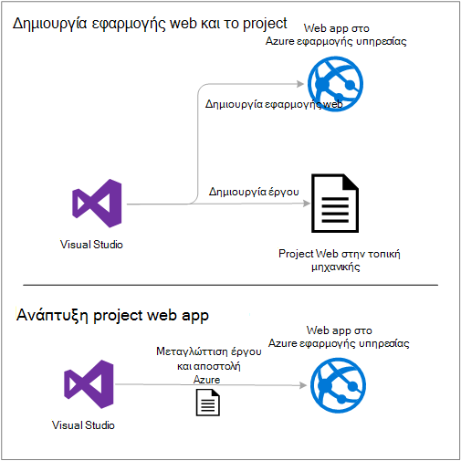

Στο τέλος του προγράμματος εκμάθησης, μια ενότητα [Αντιμετώπιση προβλημάτων](#troubleshooting) παρέχει ιδέες σχετικά με το τι να κάνετε εάν κάτι που δεν έχει αποτέλεσμα, και μια ενότητα [επόμενα βήματα](#next-steps) παρέχει συνδέσεις με άλλα προγράμματα εκμάθησης που περιγράφουν περισσότερες βάθος σχετικά με τον τρόπο χρήσης του Azure εφαρμογής υπηρεσίας.

Καθώς πρόκειται για ένα πρόγραμμα εκμάθησης γρήγορα αποτελέσματα, το project web που εμφανίζει τον τρόπο ανάπτυξης είναι μια απλή έκθεση που δεν χρησιμοποιεί μια βάση δεδομένων και δεν περιλαμβάνεται η άδεια ή τον έλεγχο ταυτότητας. Για συνδέσεις σε θέματα ανάπτυξης για προχωρημένους, δείτε [πώς μπορείτε να αναπτύξετε μια εφαρμογή Azure web](web-sites-deploy.md).

Εκτός από το χρόνο που απαιτείται για την εγκατάσταση του SDK Azure για .NET, αυτό το πρόγραμμα εκμάθησης θα χρειαστεί περίπου 10 έως 15 λεπτά για να ολοκληρωθεί.

## Προαπαιτούμενα στοιχεία

* Το πρόγραμμα εκμάθησης προϋποθέτει ότι έχετε χρησιμοποιήσει το ASP.NET MVC και του Visual Studio. Εάν χρειάζεστε μια εισαγωγή, ανατρέξτε στο θέμα [Γρήγορα αποτελέσματα με το ASP.NET MVC 5](http://www.asp.net/mvc/overview/getting-started/introduction/getting-started).

* Χρειάζεστε ένα λογαριασμό Azure. Μπορείτε να [ανοίξετε ένα δωρεάν λογαριασμό Azure](/pricing/free-trial/?WT.mc_id=A261C142F) ή να [ενεργοποιήσετε το Visual Studio συνδρομητής οφέλη](/pricing/member-offers/msdn-benefits-details/?WT.mc_id=A261C142F). 

    Εάν θέλετε να γρήγορα αποτελέσματα με το Azure εφαρμογής υπηρεσίας πριν εγγραφείτε για ένα λογαριασμό Azure, μεταβείτε στο [Δοκιμάστε εφαρμογής υπηρεσίας](http://go.microsoft.com/fwlink/?LinkId=523751). Μπορείτε να δημιουργήσετε μια εφαρμογή μικρής διάρκειας starter στο εφαρμογής υπηρεσίας — απαιτείται πιστωτική κάρτα και χωρίς δεσμεύσεις.

## Ρυθμίστε το περιβάλλον ανάπτυξης

Το πρόγραμμα εκμάθησης έχει συνταχθεί για Visual Studio 2015 με το [Azure SDK για .NET](../dotnet-sdk.md) 2.9 ή νεότερη έκδοση. 

* [Λήψη την πιο πρόσφατη SDK Azure για το Visual Studio 2015](http://go.microsoft.com/fwlink/?linkid=518003). Το SDK εγκαθιστά Visual Studio 2015, εάν δεν το έχετε ήδη.

    >[AZURE.NOTE] Ανάλογα με το πόσες από τις εξαρτήσεις SDK που έχετε ήδη στον υπολογιστή σας, η εγκατάσταση του SDK μπορεί να διαρκέσει μεγάλο χρονικό διάστημα, από μερικά λεπτά για να μισή ώρα ή περισσότερα.

Εάν διαθέτετε το Visual Studio 2013 και προτιμάτε να χρησιμοποιήσετε αυτό, μπορείτε να [κάνετε λήψη την πιο πρόσφατη SDK Azure για το Visual Studio 2013](http://go.microsoft.com/fwlink/?LinkID=324322). Ορισμένες οθόνες μπορεί να φαίνεται διαφορετικό από τις εικόνες.

## Ρύθμιση παραμέτρων ενός νέου έργου web

Το επόμενο βήμα είναι να δημιουργήσετε ένα έργο web στο Visual Studio και μια εφαρμογή web στο Azure εφαρμογής υπηρεσίας. Σε αυτήν την ενότητα του προγράμματος εκμάθησης μπορείτε να ρυθμίσετε το νέο έργο web. 

1. Ανοίξτε το Visual Studio 2015.

2. Κάντε κλικ στην επιλογή **Αρχείο > Δημιουργία > έργου**.

3. Στο παράθυρο διαλόγου **Νέο έργο** , κάντε κλικ στην επιλογή **Visual C# > Web > εφαρμογής Web ASP.NET**.

3. Βεβαιωθείτε ότι είναι επιλεγμένο το **.NET Framework 4.5.2** ως πλαίσιο προορισμού.

4.  [Azure εφαρμογή ιδέες](../application-insights/app-insights-overview.md) παρακολουθεί την εφαρμογή web της διαθεσιμότητας, επιδόσεων και χρήση. Το πλαίσιο ελέγχου **Προσθήκη εφαρμογής ιδέες για το έργο** είναι επιλεγμένο από προεπιλογή την πρώτη φορά που δημιουργείτε ένα έργο web μετά την εγκατάσταση του Visual Studio. Καταργήστε το πλαίσιο ελέγχου, εάν είναι επιλεγμένο, αλλά δεν θέλετε να δοκιμάσετε ιδέες εφαρμογής.

4. Δώστε ένα όνομα της εφαρμογής **MyExample**και, στη συνέχεια, κάντε κλικ στο κουμπί **OK**.

    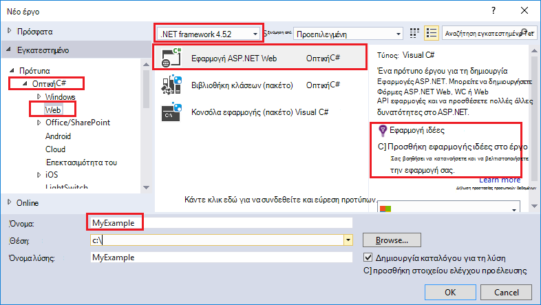

5. Στο παράθυρο διαλόγου **Νέο έργο ASP.NET** , επιλέξτε το πρότυπο **MVC** και, στη συνέχεια, κάντε κλικ στην επιλογή **Αλλαγή ελέγχου ταυτότητας**.

    Για αυτό το πρόγραμμα εκμάθησης, μπορείτε να αναπτύξετε ένα έργο web ASP.NET MVC. Εάν θέλετε να μάθετε πώς μπορείτε να αναπτύξετε ένα έργο ASP.NET Web API, ανατρέξτε στην ενότητα [επόμενα βήματα](#next-steps) . 

    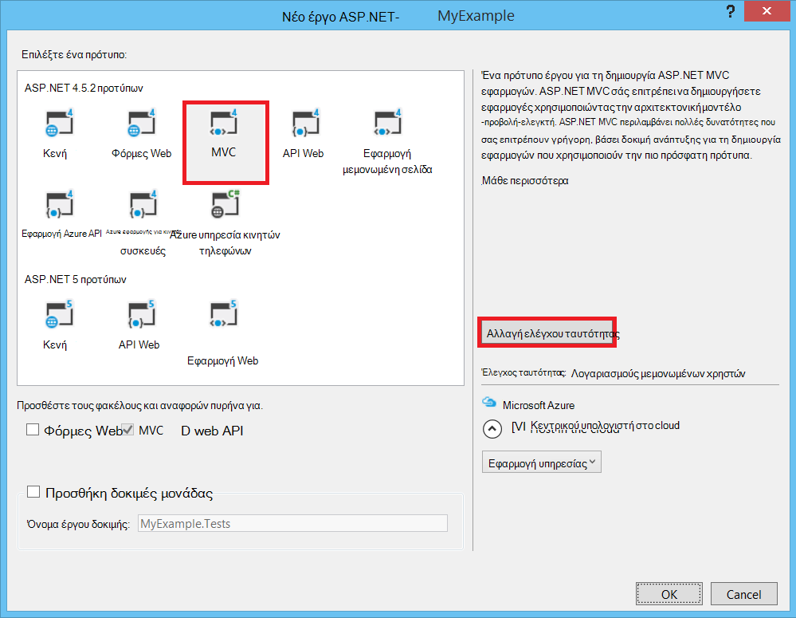

6. Στο παράθυρο διαλόγου **Αλλαγή ελέγχου ταυτότητας** , κάντε κλικ στην επιλογή **Χωρίς έλεγχο ταυτότητας**και, στη συνέχεια, κάντε κλικ στο κουμπί **OK**.

    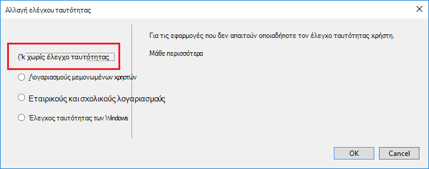

    Για αυτό το πρόγραμμα εκμάθησης ξεκινήσατε ανάπτυξη μια απλή εφαρμογή που δεν έχει καταγραφής του χρήστη.

5. Στην ενότητα **Microsoft Azure** του παραθύρου διαλόγου **Νέο έργο ASP.NET** , βεβαιωθείτε ότι είναι επιλεγμένο το πλαίσιο ελέγχου **κεντρικού υπολογιστή στο cloud** και ότι είναι επιλεγμένο το **Εφαρμογής υπηρεσίας** στην αναπτυσσόμενη λίστα.

    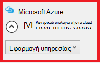

    Αυτές οι ρυθμίσεις άμεσες Visual Studio για να δημιουργήσετε μια εφαρμογή Azure web για το έργο σας web.

6. Κάντε κλικ στο κουμπί **OK**

## Ρύθμιση παραμέτρων Azure πόρους για μια νέα εφαρμογή web

Τώρα μπορείτε να καταλάβετε Visual Studio σχετικά με τους πόρους Azure που θέλετε να δημιουργήσετε.

5. Στο παράθυρο διαλόγου **Δημιουργία εφαρμογής υπηρεσίας** , κάντε κλικ στην επιλογή **Προσθήκη λογαριασμού**και, στη συνέχεια, πραγματοποιήστε είσοδο στο Azure με το Αναγνωριστικό και τον κωδικό πρόσβασης του λογαριασμού που χρησιμοποιείτε για να διαχειριστείτε τη συνδρομή σας στο Azure.

    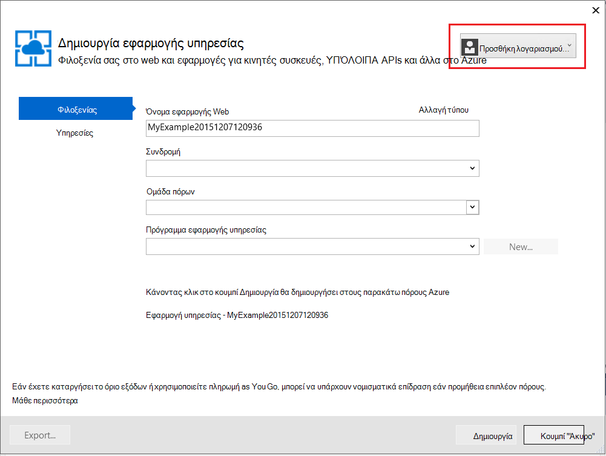

    Εάν έχετε ήδη συνδεθεί προηγουμένως στον ίδιο υπολογιστή, ενδέχεται να μην βλέπετε το κουμπί **Προσθήκη λογαριασμού** . Σε αυτή την περίπτωση, μπορείτε να παραλείψετε αυτό το βήμα ή ίσως χρειαστεί να πληκτρολογήσετε πάλι τα διαπιστευτήριά σας.
 
3. Πληκτρολογήστε ένα **Όνομα εφαρμογής Web** που είναι μοναδικές στον τομέα *azurewebsites.net* . Για παράδειγμα, μπορείτε να ονομάσετε το MyExample με αριθμούς προς τα δεξιά για να είναι μοναδικό, όπως MyExample810. Εάν ένα προεπιλεγμένο όνομα web δημιουργείται για εσάς, θα είναι μοναδικό και μπορείτε να το χρησιμοποιήσετε.

    Εάν κάποιος άλλος έχει χρησιμοποιήσει ήδη το όνομα που πληκτρολογείτε, μπορείτε να δείτε ένα κόκκινο θαυμαστικό προς τα δεξιά αντί για ένα πράσινο σημάδι ελέγχου και πρέπει να εισαγάγετε ένα διαφορετικό όνομα.

    Η διεύθυνση URL για την εφαρμογή σας είναι το όνομα συν *. azurewebsites.net*. Για παράδειγμα, εάν το όνομα είναι `MyExample810`, η διεύθυνση URL είναι `myexample810.azurewebsites.net`.

    Μπορείτε επίσης να χρησιμοποιήσετε έναν προσαρμοσμένο τομέα με μια εφαρμογή Azure web. Για περισσότερες πληροφορίες, ανατρέξτε στο θέμα [Ρύθμιση παραμέτρων ενός προσαρμοσμένου ονόματος τομέα στο Azure εφαρμογής υπηρεσίας](web-sites-custom-domain-name.md).

6. Κάντε κλικ στο κουμπί **Δημιουργία** δίπλα στο πλαίσιο **Ομάδα πόρων** και, στη συνέχεια, πληκτρολογήστε "MyExample" ή κάποιο άλλο όνομα εάν προτιμάτε. 

    

    Μια ομάδα πόρων είναι μια συλλογή Azure πόρων όπως εφαρμογές web, βάσεις δεδομένων και ΣΠΣ. Για ένα πρόγραμμα εκμάθησης, είναι συνήθως προτιμότερο να δημιουργήσετε μια νέα ομάδα πόρων επειδή που διευκολύνει την διαγραφή σε ένα βήμα Azure πόροι που θα δημιουργήσετε για το πρόγραμμα εκμάθησης. Για περισσότερες πληροφορίες, ανατρέξτε στο θέμα [Επισκόπηση της διαχείρισης πόρων Azure](../azure-resource-manager/resource-group-overview.md).

4. Κάντε κλικ στο κουμπί **Δημιουργία** δίπλα στην επιλογή **Εφαρμογή υπηρεσίας Σχεδιασμός** αναπτυσσόμενο μενού.

    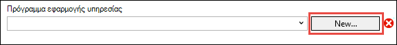

    Εμφανίζεται το παράθυρο διαλόγου **Ρύθμιση παραμέτρων πρόγραμμα εφαρμογής υπηρεσίας** .

    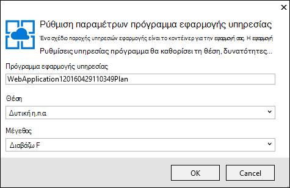

    Στα παρακάτω βήματα, μπορείτε να ρυθμίσετε ένα πρόγραμμα εφαρμογής υπηρεσίας για τη νέα ομάδα πόρων. Ένα πρόγραμμα εφαρμογής υπηρεσίας καθορίζει τους πόρους υπολογισμού που εκτελεί την εφαρμογή web της σε. Για παράδειγμα, εάν επιλέξετε το επίπεδο δωρεάν, την εφαρμογή API εκτελείται σε κοινόχρηστο ΣΠΣ, ενώ για ορισμένες σειρές επί πληρωμή εκτελείται σε αποκλειστική VM. Για περισσότερες πληροφορίες, ανατρέξτε στο θέμα [Επισκόπηση προγράμματος εφαρμογής υπηρεσίας](../app-service/azure-web-sites-web-hosting-plans-in-depth-overview.md).

5. Στο παράθυρο διαλόγου **Ρύθμιση παραμέτρων πρόγραμμα εφαρμογής υπηρεσίας** , πληκτρολογήστε "MyExamplePlan" ή κάποιο άλλο όνομα εάν προτιμάτε.

5. Στην αναπτυσσόμενη λίστα **θέση** , επιλέξτε τη θέση που βρίσκεται πιο κοντά σε εσάς.

    Αυτή η ρύθμιση καθορίζει ποιες Azure κέντρο δεδομένων της εφαρμογής σας θα εκτελείται σε. Για αυτό το πρόγραμμα εκμάθησης, μπορείτε να επιλέξετε οποιαδήποτε περιοχή και δεν θα μπορεί να είναι αρκετά εμφανείς διαφορά. Αλλά για μια εφαρμογή παραγωγής, που θέλετε να είναι όσο το δυνατό στα προγράμματα-πελάτες που πρόσβαση σε αυτήν, για να ελαχιστοποιήσετε [λανθάνων χρόνος](http://www.bing.com/search?q=web%20latency%20introduction&qs=n&form=QBRE&pq=web%20latency%20introduction&sc=1-24&sp=-1&sk=&cvid=eefff99dfc864d25a75a83740f1e0090)σας server.

5. Στο την αναπτυσσόμενη λίστα **μέγεθος** , κάντε κλικ στην επιλογή **δωρεάν**.

    Για αυτό το πρόγραμμα εκμάθησης, η σειρά δωρεάν τιμολόγησης παρέχει καλή αρκετό επιδόσεων.

6. Στο παράθυρο διαλόγου **Ρύθμιση παραμέτρων πρόγραμμα εφαρμογής υπηρεσίας** , κάντε κλικ στο **κουμπί OK**.

7. Στο παράθυρο διαλόγου **Δημιουργία εφαρμογής υπηρεσίας** , κάντε κλικ στην επιλογή **Δημιουργία**.

## Visual Studio δημιουργεί την εφαρμογή web και έργου

Σε ένα μικρό χρονικό διάστημα, συνήθως λιγότερο από ένα λεπτό, Visual Studio δημιουργεί το project web και την εφαρμογή web.  

Το παράθυρο **"Εξερεύνηση λύσεων"** εμφανίζει τα αρχεία και φακέλους στο νέο έργο.

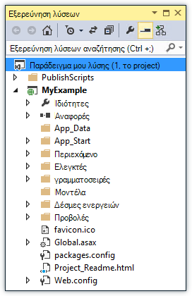

Το παράθυρο **Azure εφαρμογής υπηρεσίας δραστηριότητα** εμφανίζει ότι έχει δημιουργηθεί η εφαρμογή web.

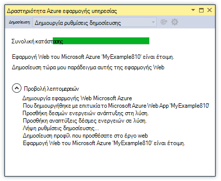

Παράθυρο της **Εξερεύνησης Cloud** σάς επιτρέπει να προβάλετε και να διαχειριστείτε Azure πόρων, συμπεριλαμβανομένης της νέας εφαρμογής web που μόλις δημιουργήσατε.

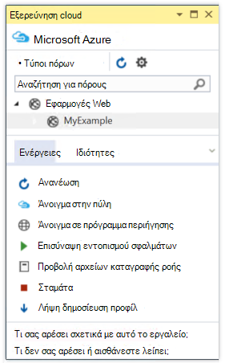
    
## Αναπτύξτε το έργο web στην εφαρμογή Azure web

Σε αυτήν την ενότητα, μπορείτε να αναπτύξετε το έργο web στην εφαρμογή web.

1. Στην **Εξερεύνηση λύσεων**, κάντε δεξί κλικ στο έργο και επιλέξτε **Δημοσίευση**.

    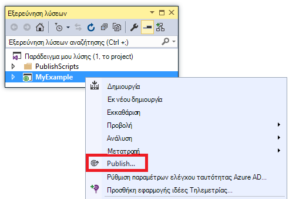

    Σε μερικά δευτερόλεπτα, εμφανίζεται ο οδηγός **Δημοσίευση Web** . Ο οδηγός ανοίγει μια *Δημοσίευση προφίλ* που περιέχει τις ρυθμίσεις για την ανάπτυξη του project web για τη νέα εφαρμογή web.

    Στο προφίλ δημοσίευση περιλαμβάνει ένα όνομα χρήστη και τον κωδικό πρόσβασης για ανάπτυξη.  Αυτά τα διαπιστευτήρια που έχουν δημιουργηθεί για εσάς και δεν χρειάζεται να εισαγάγετε τους. Ο κωδικός πρόσβασης είναι κρυπτογραφημένες στο κρυφό αρχείο συγκεκριμένο χρήστη στο το `Properties\PublishProfiles` φακέλου.
 
8. Στην καρτέλα **σύνδεση** του οδηγού **Δημοσίευση Web** , κάντε κλικ στο κουμπί **Επόμενο**.

    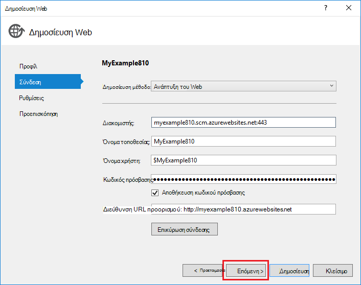

    Επόμενο είναι η καρτέλα **Ρυθμίσεις** . Εδώ μπορείτε να αλλάξετε τη ρύθμιση παραμέτρων Δόμηση για να αναπτύξετε ένα Δόμηση εντοπισμού σφαλμάτων για [τον εντοπισμό σφαλμάτων απομακρυσμένο](../app-service-web/web-sites-dotnet-troubleshoot-visual-studio.md#remotedebug). Στην καρτέλα επίσης παρέχει διάφορες [Επιλογές δημοσίευση αρχείου](https://msdn.microsoft.com/library/dd465337.aspx#Anchor_2).

10. Στην καρτέλα **Ρυθμίσεις** , κάντε κλικ στο κουμπί **Επόμενο**.

    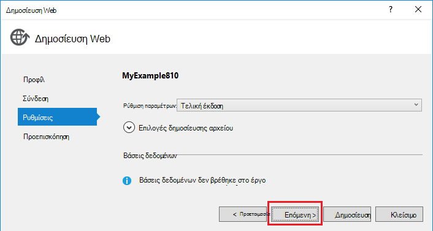

    Ακολουθεί η καρτέλα " **Προεπισκόπηση** ". Εδώ έχετε τη δυνατότητα για να δείτε τι αρχεία που πρόκειται να αντιγραφούν από το έργο σας στην εφαρμογή API. Όταν την ανάπτυξη ενός έργου για μια εφαρμογή API που έχετε ήδη αναπτυχθεί σε προηγούμενη έκδοση, αντιγράφονται μόνο τα αρχεία που τροποποιήθηκαν. Εάν θέλετε να δείτε μια λίστα με τι θα αντιγραφούν, μπορείτε να κάνετε κλικ στο κουμπί **Έναρξη Preview** .

11. Στην καρτέλα " **Προεπισκόπηση** ", κάντε κλικ στο κουμπί **Δημοσίευση**.

    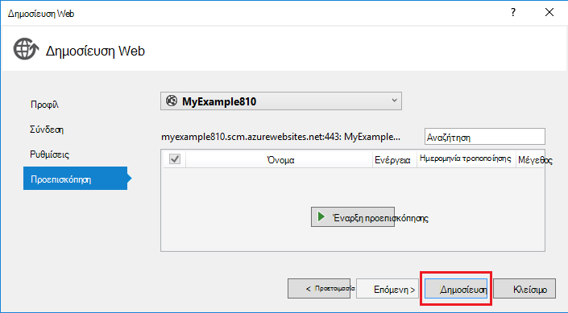

    Όταν κάνετε κλικ στο κουμπί " **Δημοσίευση**", το Visual Studio αρχίζει τη διαδικασία αντιγραφής τα αρχεία στο διακομιστή Azure. Αυτό μπορεί να διαρκέσει ένα ή δύο λεπτά.

    Το **αποτέλεσμα** και **Azure εφαρμογής υπηρεσίας δραστηριότητας** windows εμφάνιση ελήφθησαν ποιες ενέργειες ανάπτυξης και αναφορών επιτυχή ολοκλήρωση της ανάπτυξης.

    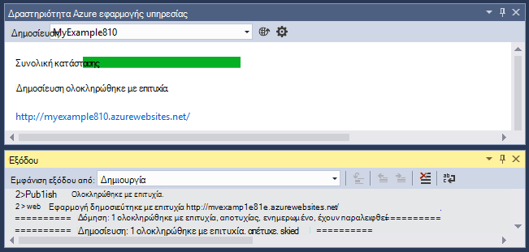

    Κατά την επιτυχή ανάπτυξη, το προεπιλεγμένο πρόγραμμα περιήγησης ανοίγει αυτόματα στη διεύθυνση URL της εφαρμογής web αναπτύσσονται και τώρα εκτελείται η εφαρμογή που δημιουργήσατε στο cloud. Η διεύθυνση URL στη γραμμή διευθύνσεων του προγράμματος περιήγησης δείχνει ότι η εφαρμογή web φορτώνεται από το Internet.

    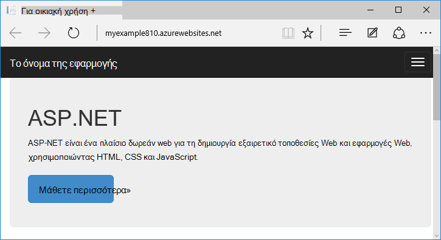

    > [AZURE.TIP]Μπορείτε να ενεργοποιήσετε τη γραμμή εργαλείων **Web μία κάντε κλικ στην επιλογή δημοσίευση** για γρήγορη ανάπτυξη. Κάντε κλικ στην επιλογή **Προβολή > γραμμές εργαλείων**, και, στη συνέχεια, επιλέξτε **Web μία κάντε κλικ στο κουμπί Δημοσίευση**. Μπορείτε να χρησιμοποιήσετε τη γραμμή εργαλείων για να επιλέξετε ένα προφίλ, κάντε κλικ σε ένα κουμπί για να δημοσιεύσετε, ή ένα κουμπί για να ανοίξετε τον οδηγό **Δημοσίευσης Web** .
    > 

## Αντιμετώπιση προβλημάτων

Εάν αντιμετωπίσετε κάποιο πρόβλημα καθώς προχωράτε με αυτό το πρόγραμμα εκμάθησης, βεβαιωθείτε ότι χρησιμοποιείτε την πιο πρόσφατη έκδοση του Azure SDK για το .NET. Ο ευκολότερος τρόπος για να το κάνετε είναι να [κάνετε λήψη του SDK Azure Visual Studio 2015](http://go.microsoft.com/fwlink/?linkid=518003). Εάν έχετε εγκαταστήσει την τρέχουσα έκδοση, το πρόγραμμα εγκατάστασης πλατφόρμας Web σάς ενημερώνει ότι δεν χρειάζεται καμία εγκατάσταση.

Εάν είστε σε ένα εταιρικό δίκτυο και προσπαθείτε να αναπτύξετε Azure εφαρμογής υπηρεσίας μέσω του τείχους προστασίας, βεβαιωθείτε ότι οι θύρες 443 και 8172 είναι ανοιχτό για ανάπτυξη Web. Εάν δεν μπορείτε να ανοίξετε αυτές τις θύρες, ανατρέξτε στην επόμενη ενότητα επόμενα βήματα για άλλες επιλογές ανάπτυξης.

Αφού έχετε την εφαρμογή web ASP.NET εκτελείται στο Azure εφαρμογής υπηρεσίας, που μπορεί να θέλετε για να μάθετε περισσότερα σχετικά με τις δυνατότητες του Visual Studio που θα απλοποιήσει αντιμετώπισης προβλημάτων. Για πληροφορίες σχετικά με την καταγραφή, ο απομακρυσμένος εντοπισμός σφαλμάτων και περισσότερες πληροφορίες, ανατρέξτε στο θέμα [Αντιμετώπιση προβλημάτων Azure web apps στο Visual Studio](web-sites-dotnet-troubleshoot-visual-studio.md).

## Επόμενα βήματα

Σε αυτό το πρόγραμμα εκμάθησης, είδατε πώς μπορείτε να δημιουργήσετε μια εφαρμογή web απλές και αναπτύσσετε σε μια εφαρμογή Azure web. Ακολουθούν ορισμένες σχετικά θέματα και τους πόρους για να μάθετε περισσότερα σχετικά με το Azure εφαρμογής υπηρεσίας:

* Παρακολουθήστε και διαχειριστείτε την εφαρμογή web σας στην [πύλη του Azure](https://portal.azure.com/). 

    Για περισσότερες πληροφορίες, ανατρέξτε στο θέμα [Επισκόπηση της πύλης Azure](/services/management-portal/) και [Ρύθμιση παραμέτρων web apps στο Azure εφαρμογής υπηρεσίας](web-sites-configure.md).

* Ανάπτυξη ένα υπάρχον έργο web σε μια νέα εφαρμογή web, χρήση του Visual Studio

    Κάντε δεξί κλικ στο έργο στην **Εξερεύνηση λύσεων**και, στη συνέχεια, κάντε κλικ στο κουμπί **Δημοσίευση**. Επιλέξτε **Microsoft Azure εφαρμογής υπηρεσίας** ως προορισμό δημοσίευση και, στη συνέχεια, κάντε κλικ στην επιλογή **Δημιουργία**. Τα παράθυρα διαλόγου, στη συνέχεια, είναι ίδια όπως και τι που έχετε δει σε αυτό το πρόγραμμα εκμάθησης.

* Ανάπτυξη ενός έργου web από το στοιχείο ελέγχου προέλευσης

    Για πληροφορίες σχετικά με την [Αυτοματοποίηση ανάπτυξης](http://www.asp.net/aspnet/overview/developing-apps-with-windows-azure/building-real-world-cloud-apps-with-windows-azure/continuous-integration-and-continuous-delivery) από ένα [σύστημα ελέγχου προέλευσης](http://www.asp.net/aspnet/overview/developing-apps-with-windows-azure/building-real-world-cloud-apps-with-windows-azure/source-control), ανατρέξτε στο θέμα [Γρήγορα αποτελέσματα με το web apps στο Azure εφαρμογής υπηρεσίας](app-service-web-get-started.md) και [πώς μπορείτε να αναπτύξετε μια εφαρμογή Azure web](web-sites-deploy.md).

* Ανάπτυξη μιας API Web ASP.NET εφαρμογής API στο Azure εφαρμογής υπηρεσίας

    Είδατε πώς μπορείτε να δημιουργήσετε μια παρουσία του Azure εφαρμογής υπηρεσίας που προορίζεται κυρίως για να φιλοξενήσετε μια τοποθεσία Web. Επίσης, εφαρμογής υπηρεσίας προσφέρει δυνατότητες για τη φιλοξενία API Web, όπως CORS υποστήριξης και υποστήριξη API μετα-δεδομένων για τη δημιουργία κώδικα προγράμματος-πελάτη. Μπορείτε να χρησιμοποιήσετε δυνατότητες API σε μια εφαρμογή web, αλλά εάν θέλετε κυρίως για τη φιλοξενία του API σε μια παρουσία της εφαρμογής υπηρεσίας, μια **εφαρμογή API** θα είναι η καλύτερη επιλογή. Για περισσότερες πληροφορίες, ανατρέξτε στο θέμα [Γρήγορα αποτελέσματα με το API εφαρμογές και ASP.NET στο Azure εφαρμογής υπηρεσίας](../app-service-api/app-service-api-dotnet-get-started.md). 

* Προσθέστε ένα προσαρμοσμένο όνομα τομέα και το SSL

    Για πληροφορίες σχετικά με τη χρήση SSL και τον δικό σας τομέα (για παράδειγμα, www.contoso.com αντί για contoso.azurewebsites.net), ανατρέξτε στους ακόλουθους πόρους:

    * [Ρύθμιση των παραμέτρων ενός προσαρμοσμένου ονόματος τομέα στο Azure εφαρμογής υπηρεσίας](web-sites-custom-domain-name.md)
    * [Ενεργοποίηση HTTPS για μια τοποθεσία Web του Azure](web-sites-configure-ssl-certificate.md)

* Διαγραφή ομάδας πόρων που περιέχει την εφαρμογή web της και τις σχετικές Azure πόροι όταν ολοκληρώσετε την εργασία με αυτά.

    Για πληροφορίες σχετικά με τον τρόπο εργασίας με τις ομάδες πόρων στην πύλη του Azure, ανατρέξτε στο θέμα [Ανάπτυξη πόρους με πρότυπα διαχείρισης πόρων και Azure πύλη](../resource-group-template-deploy-portal.md).   

*   Για περισσότερα παραδείγματα τη δημιουργία μιας εφαρμογής Web ASP.NET στην εφαρμογή υπηρεσίας, ανατρέξτε στο θέμα [Δημιουργία και ανάπτυξη της εφαρμογής web ASP.NET στο Azure εφαρμογής υπηρεσίας](https://github.com/Microsoft/HealthClinic.biz/wiki/Create-and-deploy-an-ASP.NET-web-app-in-Azure-App-Service) και [Δημιουργία και ανάπτυξη της εφαρμογής για κινητές συσκευές στο Azure εφαρμογής υπηρεσίας](https://github.com/Microsoft/HealthClinic.biz/wiki/Create-and-deploy-a-mobile-app-in-Azure-App-Service) από τη σύνδεση [HealthClinic.biz](https://github.com/Microsoft/HealthClinic.biz) 2015 [επίδειξη](https://blogs.msdn.microsoft.com/visualstudio/2015/12/08/connectdemos-2015-healthclinic-biz/). Για περισσότερες γρήγορες εκκινήσεις από την επίδειξη HealthClinic.biz, ανατρέξτε στο θέμα [Γρήγορες εκκινήσεις εργαλεία για προγραμματιστές Azure](https://github.com/Microsoft/HealthClinic.biz/wiki/Azure-Developer-Tools-Quickstarts).
