<properties 
    pageTitle="Δημιουργία εφαρμογής Azure γραμμής εταιρικά με έλεγχο ταυτότητας AD FS | Microsoft Azure" 
    description="Μάθετε πώς μπορείτε να δημιουργήσετε μια εφαρμογή γραμμής εταιρικά στο Azure εφαρμογής υπηρεσίας που πραγματοποιεί έλεγχο ταυτότητας με STS εσωτερικής εγκατάστασης. Αυτό το πρόγραμμα εκμάθησης ως προορισμό AD FS ως το STS εσωτερικής εγκατάστασης." 
    services="app-service\web" 
    documentationCenter=".net" 
    authors="cephalin" 
    manager="wpickett" 
    editor=""/>

<tags 
    ms.service="app-service-web" 
    ms.devlang="dotnet" 
    ms.topic="article" 
    ms.tgt_pltfrm="na" 
    ms.workload="web" 
    ms.date="08/31/2016" 
    ms.author="cephalin"/>

# Δημιουργία εφαρμογής Azure γραμμής εταιρικά με έλεγχο ταυτότητας AD FS

Σε αυτό το άρθρο θα μάθετε πώς να δημιουργήσετε μια εφαρμογή γραμμής εταιρικά ASP.NET MVC στο [Azure εφαρμογής υπηρεσίας](../app-service/app-service-value-prop-what-is.md) με μια εσωτερική [Υπηρεσίες Active Directory Federation Services](http://technet.microsoft.com/library/hh831502.aspx) ως την υπηρεσία παροχής ταυτότητας. Να εργαστείτε σε αυτό το σενάριο, όταν θέλετε να δημιουργήσετε εφαρμογές γραμμής εταιρικά στο Azure εφαρμογής υπηρεσίας αλλά εταιρεία σας απαιτεί καταλόγου δεδομένων να είναι αποθηκευμένο επιτόπου.

>[AZURE.NOTE] Για μια επισκόπηση από τις επιλογές ελέγχου ταυτότητας και εξουσιοδότησης διάφορων εταιρικών για Azure εφαρμογής υπηρεσίας, ανατρέξτε στο θέμα [Έλεγχος ταυτότητας με καταλόγου Active Directory εσωτερικής εγκατάστασης στην εφαρμογή Azure](web-sites-authentication-authorization.md).

## Τι θα δημιουργήσετε ##

Θα μπορείτε να δημιουργήσετε μια βασική εφαρμογή ASP.NET στο Azure εφαρμογής υπηρεσίας Web Apps με τις εξής δυνατότητες:

- Πραγματοποιεί έλεγχο ταυτότητας χρηστών σε σχέση με AD FS
- Χρησιμοποιεί `[Authorize]` για να εξουσιοδοτήσετε χρήστες για διάφορες ενέργειες
- Ρύθμιση παραμέτρων για στατική τόσο για τον εντοπισμό σφαλμάτων στο Visual Studio και τη δημοσίευση εφαρμογής υπηρεσίας Web Apps (ρύθμιση παραμέτρων μόνο μία φορά, εντοπισμός σφαλμάτων και δημοσίευση οποιαδήποτε στιγμή)  

## Τι χρειάζεστε ##

[AZURE.INCLUDE [free-trial-note](../../includes/free-trial-note.md)]

Χρειάζεστε τα εξής για να ολοκληρώσετε αυτό το πρόγραμμα εκμάθησης:

- Μια εσωτερική ανάπτυξης AD FS (για μια περιγραφή για να ολοκληρωμένες το εργαστήριο δοκιμών που χρησιμοποιούνται σε αυτό το πρόγραμμα εκμάθησης, ανατρέξτε στο θέμα [Δοκιμή εργαστήριο: STS μεμονωμένη με AD FS σε Εικονική Azure (για δοκιμή μόνο)](https://blogs.msdn.microsoft.com/cephalin/2014/12/21/test-lab-standalone-sts-with-ad-fs-in-azure-vm-for-test-only/))
- Δικαιώματα για να δημιουργήσετε βασίζεστε πάρτι αξιοπιστίας AD FS διαχείρισης
- Visual Studio 2013 ενημέρωση 4 ή νεότερη έκδοση
- [Azure SDK 2.8.1](http://go.microsoft.com/fwlink/p/?linkid=323510&clcid=0x409) ή νεότερη έκδοση

## Χρήση του δείγματος εφαρμογής για το πρότυπο γραμμής εταιρικά ##

Το δείγμα εφαρμογής σε αυτό το πρόγραμμα εκμάθησης, [WebApp-WSFederation-DotNet)](https://github.com/AzureADSamples/WebApp-WSFederation-DotNet), δημιουργείται από την ομάδα Azure Active Directory. Επειδή το AD FS υποστηρίζει Ομοσπονδία WS, μπορείτε να το χρησιμοποιήσετε ως πρότυπο για να δημιουργήσετε εφαρμογές γραμμής εταιρικά με ευκολία. Που έχει τις εξής δυνατότητες:

- Χρησιμοποιεί [WS Ομοσπονδία](http://msdn.microsoft.com/library/bb498017.aspx) για τον έλεγχο ταυτότητας με μια εσωτερική AD FS ανάπτυξης
- Είσοδος και sign-out λειτουργίες
- Χρησιμοποιεί [Microsoft.Owin](http://www.asp.net/aspnet/overview/owin-and-katana/an-overview-of-project-katana) (αντί για το Windows Foundation ταυτότητας), το οποίο αποτελεί τη μελλοντική του ASP.NET και απλουστεύοντας για να ορίσετε για τον έλεγχο ταυτότητας και εξουσιοδότηση από WIF

## Ρυθμίστε το δείγμα εφαρμογής ##

2.  Κλωνοποίηση ή λήψη της λύσης δείγμα στο [WebApp-WSFederation-DotNet](https://github.com/AzureADSamples/WebApp-WSFederation-DotNet) στον κατάλογο του τοπικού σας.

    > [AZURE.NOTE] Τις οδηγίες στην ενότητα [README.md](https://github.com/AzureADSamples/WebApp-WSFederation-DotNet/blob/master/README.md) σας δείξουν πώς μπορείτε να ρυθμίσετε την εφαρμογή με το Azure Active Directory. Αλλά σε αυτό το πρόγραμμα εκμάθησης, που έχετε ρυθμίσει με AD FS, επομένως, αντί για αυτό, ακολουθήστε τα βήματα που περιγράφονται εδώ.

3.  Ανοίξτε τη λύση και, στη συνέχεια, ανοίξτε Controllers\AccountController.cs στην **Εξερεύνηση λύσεων**.

    Θα δείτε ότι ο κώδικας ζητήματα απλώς πρόκλησης ελέγχου ταυτότητας για τον έλεγχο ταυτότητας του χρήστη που χρησιμοποιεί το WS ομοσπονδίας. Έλεγχος ταυτότητας όλα έχει ρυθμιστεί σε App_Start\Startup.Auth.cs.

4.  Άνοιγμα App_Start\Startup.Auth.cs. Στο το `ConfigureAuth` μέθοδο, σημειώστε τη γραμμή:

        app.UseWsFederationAuthentication(
            new WsFederationAuthenticationOptions
            {
                Wtrealm = realm,
                MetadataAddress = metadata                                      
            });

    Στον κόσμο OWIN, αυτό τμήματος κώδικα είναι στην πραγματικότητα το ελάχιστο πρέπει να ρυθμίσετε τον έλεγχο ταυτότητας WS ομοσπονδίας. Είναι πολύ πιο απλή και κομψή περισσότερα από WIF, όπου έχει εισαχθεί Web.config με XML σε όλο το σημείο. Τις πληροφορίες μόνο που χρειάζεστε είναι η του υπολογιστή Βοήθειας (RP) αναγνωριστικό και τη διεύθυνση URL του αρχείου μετα-δεδομένων της υπηρεσίας σας AD FS. Ακολουθεί ένα παράδειγμα:

    -   Αναγνωριστικό RP:`https://contoso.com/MyLOBApp`
    -   Διεύθυνση μετα-δεδομένων:`http://adfs.contoso.com/FederationMetadata/2007-06/FederationMetadata.xml`

5.  Στο App_Start\Startup.Auth.cs, αλλάξτε τους ακόλουθους ορισμούς στατική συμβολοσειρά:  
    <pre class="prettyprint">
    ιδιωτική στατική συμβολοσειρά τομέα = ConfigurationManager.AppSettings["ida:<mark>RPIdentifier</mark>"]; <mark><del>aadInstance ιδιωτικό στατική συμβολοσειράς = ConfigurationManager.AppSettings["ida:AADInstance"];</del></mark> 
     <mark><del>μισθωτή ιδιωτικό στατική συμβολοσειράς = ConfigurationManager.AppSettings["ida:Tenant"];</del></mark> 
     <mark><del>μετα-δεδομένων ιδιωτικό στατική συμβολοσειράς = συμβολοσειρά. Μορφοποίηση ("{0} / {1} /federationmetadata/2007-06/federationmetadata.xml", aadInstance, μισθωτή)-</del></mark> 
     <mark>μετα-δεδομένων ιδιωτικό στατική συμβολοσειράς = συμβολοσειρά. Μορφοποίηση ("https:// {0} /federationmetadata/2007-06/federationmetadata.xml", ConfigurationManager.AppSettings["ida:ADFS"]),</mark>

    <mark><del>αρχή της συμβολοσειράς = String.Format (CultureInfo.InvariantCulture, aadInstance, μισθωτή);</del></mark>
    </pre>

6.  Τώρα, κάντε τις αντίστοιχες αλλαγές στο αρχείο Web.config. Ανοίξτε το αρχείο Web.config και να τροποποιήσετε τις ακόλουθες ρυθμίσεις εφαρμογής:  
    <pre class="prettyprint">
    &lt;appSettings&gt;
    &lt;add key="webpages:Version" value="3.0.0.0" /&gt;
    &lt;add key="webpages:Enabled" value="false" /&gt;
    &lt;add key="ClientValidationEnabled" value="true" /&gt;
    &lt;add key="UnobtrusiveJavaScriptEnabled" value="true" /&gt;
      <mark><del>&lt;add key="ida:Wtrealm" value="[Enter the App ID URI of WebApp-WSFederation-DotNet https://contoso.onmicrosoft.com/WebApp-WSFederation-DotNet]" /&gt;</del></mark>
      <mark><del>&lt;add key="ida:AADInstance" value="https://login.windows.net" /&gt;</del></mark>
      <mark><del>&lt;add key="ida:Tenant" value="[Enter tenant name, e.g. contoso.onmicrosoft.com]" /&gt;</del></mark>
      <mark>&lt;add key="ida:RPIdentifier" value="[Enter the relying party identifier όπως έχει ρυθμιστεί στο AD FS, π.χ. https://localhost:44320 /] "/&gt;</mark>
      <mark>&lt;Προσθήκη κλειδιού = τιμή"ida: ADFS"="[εισαγάγετε το FQDN του υπηρεσιών AD FS, π.χ. adfs.contoso.com]"/&gt; </mark>        

    &lt;/appSettings&gt;
    </pre>

    Συμπληρώστε τις κύριες τιμές με βάση το αντίστοιχο περιβάλλον.

7.  Δημιουργία της εφαρμογής για να βεβαιωθείτε ότι δεν υπάρχουν σφάλματα.

Που είναι. Τώρα το δείγμα εφαρμογής είναι έτοιμη για να εργαστείτε με AD FS. Εξακολουθείτε να χρειάζεστε για να ρυθμίσετε μια αξιόπιστη RP με αυτήν την εφαρμογή στο AD FS αργότερα.

## Ανάπτυξη της εφαρμογής δείγμα να Azure εφαρμογής υπηρεσίας Web Apps

Εδώ, μπορείτε να δημοσιεύσετε της εφαρμογής σε μια εφαρμογή web στις εφαρμογές Web της εφαρμογής υπηρεσίας διατηρώντας το περιβάλλον εντοπισμού σφαλμάτων. Σημειώστε ότι πρόκειται να δημοσιεύσετε την εφαρμογή πριν που έχει μια αξιόπιστη RP με AD FS, ώστε ο έλεγχος ταυτότητας εξακολουθεί να μην λειτουργεί ακόμη. Ωστόσο, εάν μπορείτε να το κάνετε τώρα μπορείτε να έχετε τη διεύθυνση URL του web app που μπορείτε να χρησιμοποιήσετε για να ρυθμίσετε τις παραμέτρους της αξιοπιστίας RP αργότερα.

1. Κάντε δεξιό κλικ στο έργο σας και επιλέξτε **Δημοσίευση**.

    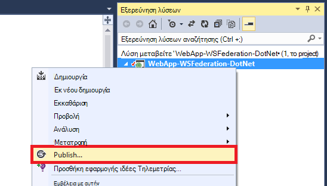

2. Επιλέξτε **Microsoft Azure εφαρμογής υπηρεσίας**.
3. Εάν δεν έχετε πραγματοποιήσει είσοδο σε Azure, κάντε κλικ στην επιλογή **Sign In** και χρησιμοποιήστε το λογαριασμό Microsoft Azure τη συνδρομή σας για να συνδεθείτε.
4. Αφού εισέλθετε, κάντε κλικ στην επιλογή **Δημιουργία** για να δημιουργήσετε μια εφαρμογή web.
5. Συμπληρώστε όλα τα απαιτούμενα πεδία. Πρόκειται να συνδεθείτε με εσωτερική δεδομένων αργότερα, ώστε να μην δημιουργήσετε μια βάση δεδομένων για αυτήν την εφαρμογή web.

    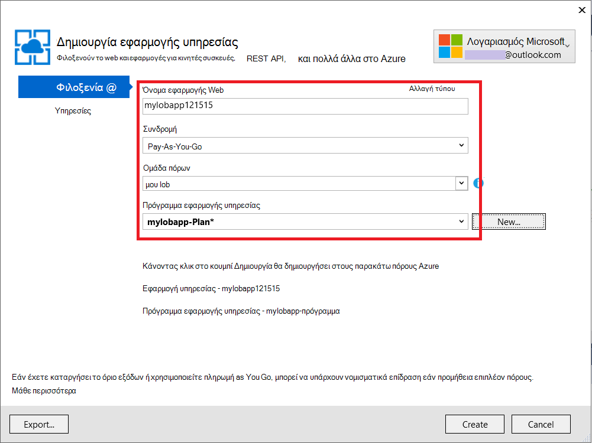

6. Κάντε κλικ στην επιλογή **Δημιουργία**. Μετά τη δημιουργία της εφαρμογής web, ανοίγει το παράθυρο διαλόγου δημοσίευση Web.
7. Στη **Διεύθυνση URL προορισμού**, αλλάξτε **http** σε **https**. Αντιγραφή ολόκληρη τη διεύθυνση URL σε ένα πρόγραμμα επεξεργασίας κειμένου για μελλοντική χρήση. Στη συνέχεια, κάντε κλικ στο κουμπί **Δημοσίευση**.

    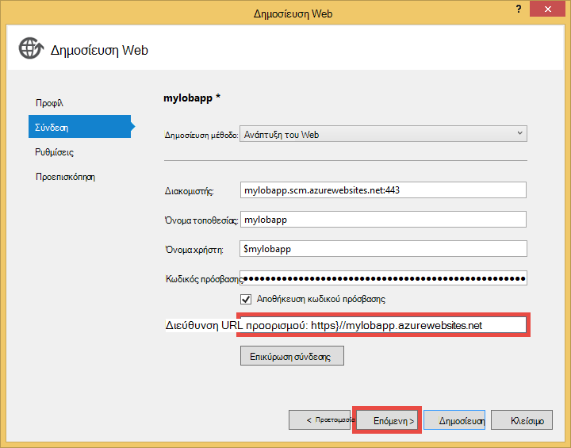

11. Στο Visual Studio, ανοίξτε **Web.Release.config** στο έργο σας. Εισαγάγετε το παρακάτω δείγμα XML σε το `<configuration>` ετικέτα και αντικαταστήστε την τιμή του κλειδιού με τη διεύθυνση URL της εφαρμογής web σας δημοσίευση.  
    <pre class="prettyprint">
&lt;appSettings&gt;
   &lt;Προσθήκη κλειδιού = τιμή "ida: RPIdentifier" = "<mark>[π.χ., https://mylobapp.azurewebsites.net/]</mark>" xdt:Transform = "στοιχείο SetAttributes" xdt:Locator="Match(key)" /&gt;
&lt;/appSettings&gt;</pre>

Όταν ολοκληρώσετε τη διαδικασία, έχετε δύο αναγνωριστικά RP έχει ρυθμιστεί στο έργο σας, μία για το περιβάλλον εντοπισμού σφαλμάτων στο Visual Studio και μία για την εφαρμογή web που έχει δημοσιευθεί στο Azure. Θα ρυθμίσετε μια αξιόπιστη RP για κάθε ένα από τα δύο περιβάλλοντα σε AD FS. Κατά τον εντοπισμό σφαλμάτων, τις ρυθμίσεις εφαρμογής στο Web.config που χρησιμοποιούνται για να κάνετε **Εντοπισμός σφαλμάτων** ρύθμιση των παραμέτρων σας λειτουργεί με AD FS. Όταν δημοσιευτεί (από προεπιλογή, η ρύθμιση παραμέτρων **έκδοσης** δημοσιεύεται), μια που έχουν μετατραπεί Web.config αποστολή που ενσωματώνει τις αλλαγές των ρυθμίσεων εφαρμογής στο Web.Release.config.

Εάν θέλετε να επισυνάψετε το δημοσιευμένο web app στο Azure για το πρόγραμμα εντοπισμού σφαλμάτων (δηλαδή πρέπει να αποστείλετε σύμβολα εντοπισμού σφαλμάτων του κώδικα στο δημοσιευμένο web app), μπορείτε να δημιουργήσετε μια κλωνοποίηση της ρύθμισης παραμέτρων εντοπισμού σφαλμάτων για τον εντοπισμό σφαλμάτων Azure, αλλά με το δικό του προσαρμοσμένου μετασχηματισμού Web.config (π.χ., Web.AzureDebug.config) που χρησιμοποιεί τις ρυθμίσεις εφαρμογής από το Web.Release.config. Αυτό σας επιτρέπει να διατηρήσετε μια στατική ρύθμιση παραμέτρων σε διαφορετικά περιβάλλοντα του.

## Ρύθμιση παραμέτρων υπολογιστή αξιοπιστίας πάρτι AD FS διαχείρισης ##

Τώρα θα πρέπει να ρυθμίσετε τις παραμέτρους μιας αξιοπιστίας RP AD FS διαχείρισης για να χρησιμοποιήσετε την εφαρμογή του δείγματος και στην πραγματικότητα τον έλεγχο ταυτότητας με AD FS. Θα πρέπει να ρυθμίσετε δύο ξεχωριστές αξιοπιστίας RP, μία για το περιβάλλον εντοπισμού σφαλμάτων και μία για την εφαρμογή web που έχει δημοσιευθεί σας.

> [AZURE.NOTE] Βεβαιωθείτε ότι μπορείτε να επαναλάβετε τα παρακάτω βήματα για τα δύο περιβάλλοντα σας.

4.  Στο διακομιστή σας AD FS, συνδεθείτε με τα διαπιστευτήρια που έχουν δικαιώματα διαχείρισης σε AD FS.
5.  Ανοίξτε τη Διαχείριση AD FS. Κάντε δεξί κλικ σε **πάρτι Relationships\Relying AD FS\Trusted εμπιστεύεται** και επιλέξτε **Προσθήκη αξιοπιστίας βασίζεστε κατασκευαστή**.

    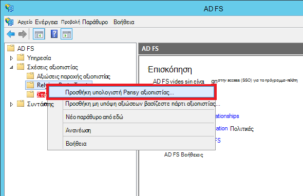

5.  Στη σελίδα **Επιλογή αρχείου προέλευσης δεδομένων** , επιλέξτε **μη αυτόματη εισαγωγή δεδομένων σχετικά με τον**. 

    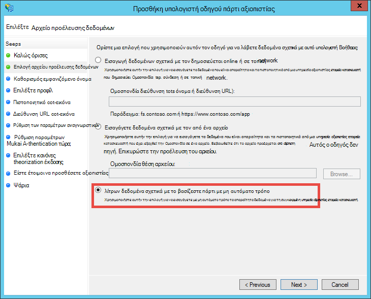

6.  Στη σελίδα **Καθορισμός εμφανιζόμενο όνομα** , πληκτρολογήστε ένα εμφανιζόμενο όνομα για την εφαρμογή και κάντε κλικ στο κουμπί **Επόμενο**.
7.  Στη σελίδα **Επιλέξτε πρωτόκολλο** , κάντε κλικ στο κουμπί **Επόμενο**.
8.  Στη σελίδα **Ρύθμιση παραμέτρων πιστοποιητικού** , κάντε κλικ στο κουμπί **Επόμενο**.

    > [AZURE.NOTE] Δεδομένου ότι θα πρέπει να χρησιμοποιείτε HTTPS ήδη, κρυπτογραφημένο διακριτικά είναι προαιρετικό. Εάν θέλετε πραγματικά να κρυπτογραφήσετε διακριτικά από AD FS σε αυτήν τη σελίδα, πρέπει επίσης να προσθέσετε λογική αποκρυπτογράφηση διακριτικό στον κώδικά σας. Για περισσότερες πληροφορίες, ανατρέξτε στο θέμα [μη αυτόματη ρύθμιση παραμέτρων ενδιάμεσο OWIN WS-Ομοσπονδία και αποδοχή κρυπτογραφημένο διακριτικά](http://chris.59north.com/post/2014/08/21/Manually-configuring-OWIN-WS-Federation-middleware-and-accepting-encrypted-tokens.aspx).
  
5.  Πριν από τη μετακίνηση στο επόμενο βήμα, χρειάζεστε ένα τμήμα πληροφοριών από το έργο Visual Studio. Στις ιδιότητες του έργου, σημειώστε το **SSL διεύθυνση URL** της εφαρμογής. 

    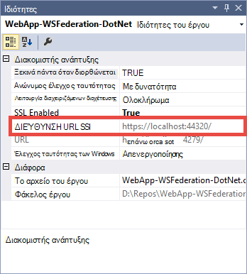

6.  Επιστρέψτε στο AD FS διαχείρισης, στη σελίδα **Ρύθμιση παραμέτρων διεύθυνση URL** του **Προσθέσετε βασίζεστε πάρτι αξιοπιστίας οδηγού**, επιλέξτε **Ενεργοποίηση υποστήριξης για το πρωτόκολλο παθητικές WS Ομοσπονδία** και πληκτρολογήστε τη διεύθυνση URL SSL του έργου σας Visual Studio που σημειώσατε στο προηγούμενο βήμα. Στη συνέχεια, κάντε κλικ στο κουμπί **Επόμενο**.

    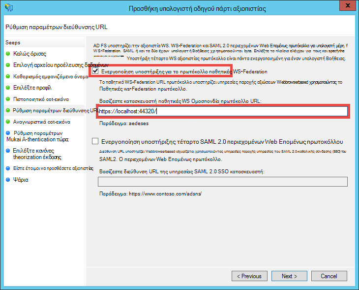

    > [AZURE.NOTE] Διεύθυνση URL καθορίζει πού να στείλετε το πρόγραμμα-πελάτη όταν ολοκληρωθεί με επιτυχία τον έλεγχο ταυτότητας. Για το περιβάλλον εντοπισμού σφαλμάτων, θα πρέπει να είναι <code>https://localhost:&lt;port&gt;/</code>. Για την εφαρμογή web που έχει δημοσιευθεί, θα πρέπει να τη διεύθυνση URL της εφαρμογής web.

7.  Στη σελίδα **Ρύθμιση παραμέτρων αναγνωριστικά** , βεβαιωθείτε ότι το έργο σας διεύθυνση URL SSL εμφανίζεται ήδη και κάντε κλικ στο κουμπί **Επόμενο**. Κάντε κλικ στο κουμπί **Επόμενο** πλήρως μέχρι το τέλος του οδηγού με προεπιλεγμένες επιλογές.

    > [AZURE.NOTE] Στο App_Start\Startup.Auth.cs του έργου σας Visual Studio, αυτό το αναγνωριστικό είναι αντιστοιχισμένος σε σχέση με την τιμή του <code>WsFederationAuthenticationOptions.Wtrealm</code> κατά τον έλεγχο ταυτότητας ομόσπονδη. Από προεπιλογή, η διεύθυνση URL της εφαρμογής από το προηγούμενο βήμα προστίθεται ως αναγνωριστικό RP.

8.  Τώρα έχετε ολοκληρώσει τη ρύθμιση των παραμέτρων της εφαρμογής RP για το έργο σας σε AD FS. Στη συνέχεια, να ρυθμίσετε τις παραμέτρους αυτής της εφαρμογής για να στείλετε το αξιώσεων που απαιτούνται από την εφαρμογή σας. Το παράθυρο διαλόγου **Επεξεργασία κανόνων διεκδίκηση** ανοίγει από προεπιλογή για εσάς στο τέλος του οδηγού, ώστε να μπορείτε να ξεκινήσετε αμέσως. Ας ρυθμίσει τουλάχιστον τα παρακάτω αξιώσεων (με σχήματα σε παρενθέσεις):

    -   Όνομα (http://schemas.xmlsoap.org/ws/2005/05/identity/claims/name) - χρησιμοποιούνται από ASP.NET για hydrate `User.Identity.Name`.
    -   Κύριο όνομα χρήστη (http://schemas.xmlsoap.org/ws/2005/05/identity/claims/upn) - χρησιμοποιείται για να προσδιορίσει μοναδικά τους χρήστες στην εταιρεία.
    -   Ιδιότητες μελών ομάδας ως ρόλους (http://schemas.microsoft.com/ws/2008/06/identity/claims/role) - μπορούν να χρησιμοποιηθούν με `[Authorize(Roles="role1, role2,...")]` διακοσμητικού για να εξουσιοδοτήσετε ελεγκτές/ενέργειες. Στην πραγματικότητα, αυτή η προσέγγιση μπορεί να μην το περισσότερες performant για άδεια ρόλο. Εάν οι χρήστες σας AD ανήκουν σε εκατοντάδες ομάδες ασφαλείας, θα μετατραπούν σε εκατοντάδες αξιώσεων ρόλος στο διακριτικό SAML. Εναλλακτική προσέγγιση είναι να στείλετε ένα μεμονωμένο ρόλο διεκδίκηση υπό όρους ανάλογα με συμμετοχή του χρήστη σε μια συγκεκριμένη ομάδα. Ωστόσο, θα σας θα Διατηρήστε το απλό για αυτό το πρόγραμμα εκμάθησης.
    -   Όνομα Αναγνωριστικό (http://schemas.xmlsoap.org/ws/2005/05/identity/claims/nameidentifier) - μπορούν να χρησιμοποιηθούν για την επικύρωση των κινδύνων. Για περισσότερες πληροφορίες σχετικά με τον τρόπο ώστε να λειτουργεί με την επικύρωση καταπολέμησης της πλαστογράφησης, ανατρέξτε στην ενότητα **Προσθήκη γραμμής εταιρικά λειτουργικότητας** του [Δημιουργία μιας γραμμής εταιρικά Azure εφαρμογής με έλεγχο ταυτότητας Azure Active Directory](web-sites-dotnet-lob-application-azure-ad.md#bkmk_crud).

    > [AZURE.NOTE] Οι τύποι διεκδίκηση πρέπει να ρυθμίσετε τις παραμέτρους για την εφαρμογή σας προσδιορίζεται από τις ανάγκες της εφαρμογής σας. Για τη λίστα των απαιτήσεων υποστηρίζεται από εφαρμογές Azure Active Directory (δηλαδή αξιοπιστίας RP), για παράδειγμα, ανατρέξτε στο θέμα [τύποι διεκδίκηση και υποστηρίζονται διακριτικού](http://msdn.microsoft.com/library/azure/dn195587.aspx).

8.  Στο παράθυρο διαλόγου Επεξεργασία διεκδίκηση κανόνες, κάντε κλικ στην επιλογή **Προσθήκη κανόνα**.
9.  Ρύθμιση παραμέτρων του ονόματος, UPN και ρόλων αξιώσεων, όπως φαίνεται στο στιγμιότυπο οθόνης και κάντε κλικ στο κουμπί **Τέλος**.

    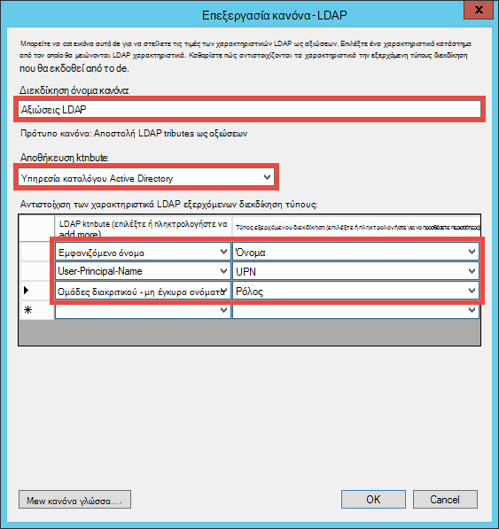

    Στη συνέχεια, μπορείτε να δημιουργήσετε ένα όνομα μεταβατικές Αναγνωριστικό διεκδίκηση χρησιμοποιώντας τα βήματα που παρουσιάζεται στο [Όνομα αναγνωριστικά σε διεκδικήσεων SAML](http://blogs.msdn.com/b/card/archive/2010/02/17/name-identifiers-in-saml-assertions.aspx).

9.  Κάντε ξανά κλικ στην επιλογή **Προσθήκη κανόνα** .
10. Επιλέξτε **Αποστολή αξιώσεων χρησιμοποιώντας έναν προσαρμοσμένο κανόνα** και κάντε κλικ στο κουμπί **Επόμενο**.
11. Επικολλήστε την παρακάτω γλώσσα κανόνα στο πλαίσιο **Προσαρμογή κανόνα** , ονομάστε τον κανόνα **Ανά αναγνωριστικό περιόδου λειτουργίας** και κάντε κλικ στο κουμπί **Τέλος**.  
    <pre class="prettyprint">
    C1: [τύπος == "http://schemas.microsoft.com/ws/2008/06/identity/claims/windowsaccountname"] &amp; &amp; 
    c2: [τύπος == "http://schemas.microsoft.com/ws/2008/06/identity/claims/authenticationinstant"] = > Προσθήκη (Αποθήκευση = "_OpaqueIdStore", οι τύποι = ("<mark>http://contoso.com/internal/sessionid</mark>"), ερωτήματος = "{0} { 1}. {2}. {3}. {4} ", παραμέτρου ="useEntropy", παραμέτρου = c1. Τιμή, παραμέτρου = c1. OriginalIssuer, παραμέτρου = "", παραμέτρου = c2. Τιμή).
    </pre>

    Προσαρμοσμένο κανόνα σας θα πρέπει να μοιάζει με αυτό το στιγμιότυπο οθόνης:

    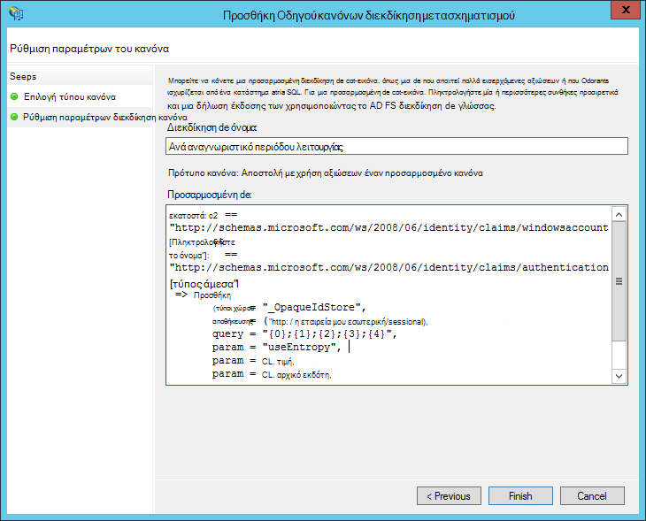

9.  Κάντε ξανά κλικ στην επιλογή **Προσθήκη κανόνα** .
10. Επιλέξτε **μια εισερχόμενη απαίτηση μετασχηματισμός** και κάντε κλικ στο κουμπί **Επόμενο**.
11. Ρύθμιση παραμέτρων του κανόνα, όπως φαίνεται στο στιγμιότυπο οθόνης (χρησιμοποιώντας τον τύπο διεκδίκηση που δημιουργήσατε στον προσαρμοσμένο κανόνα) και κάντε κλικ στο κουμπί **Τέλος**.

    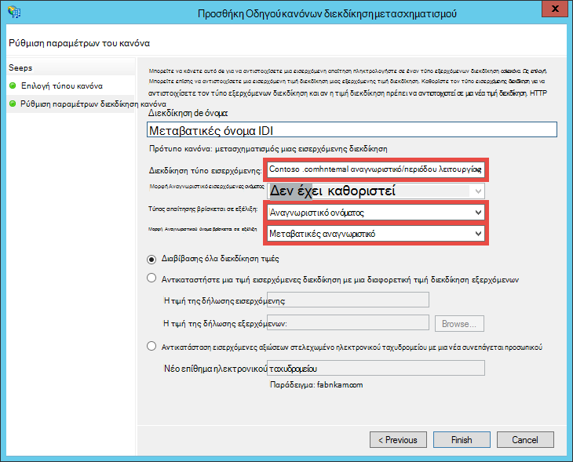

    Για λεπτομερείς πληροφορίες σχετικά με τα βήματα για τη διεκδίκηση μεταβατικές Αναγνωριστικό ονόματος, ανατρέξτε στην ενότητα [Όνομα αναγνωριστικά σε διεκδικήσεων SAML](http://blogs.msdn.com/b/card/archive/2010/02/17/name-identifiers-in-saml-assertions.aspx).

12. Στο παράθυρο διαλόγου **Επεξεργασία διεκδίκηση κανόνες** , κάντε κλικ στο κουμπί **εφαρμογή** . Αυτό θα πρέπει τώρα να μοιάζει ως το παρακάτω στιγμιότυπο οθόνης:

    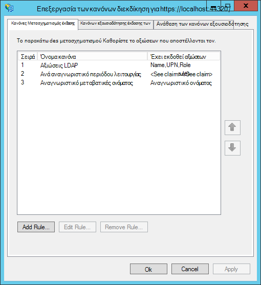

    > [AZURE.NOTE] Ξανά, βεβαιωθείτε ότι επαναλάβετε αυτά τα βήματα για το περιβάλλον εντοπισμού σφαλμάτων και το δημοσιευμένο περιεχόμενο web app.

## Δοκιμή ομόσπονδη ελέγχου ταυτότητας για την εφαρμογή σας

Είστε έτοιμοι να δοκιμάσετε λογικής ελέγχου ταυτότητας της εφαρμογής σας σε σχέση με AD FS. Σε περιβάλλον μου εργαστήριο AD FS, έχω μια δοκιμής χρήστη που ανήκει σε μια ομάδα δοκιμής στο Active Directory (AD).

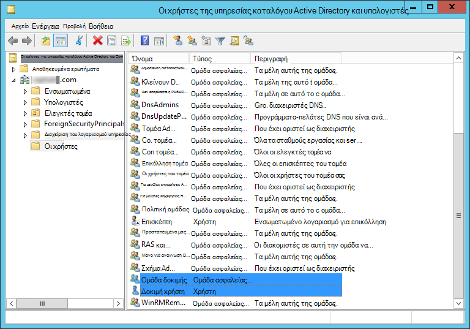

Για να ελέγξετε τον έλεγχο ταυτότητας του προγράμματος εντοπισμού σφαλμάτων, μόνο που πρέπει να το κάνετε τώρα είναι τύπου `F5`. Εάν θέλετε να ελέγξετε τον έλεγχο ταυτότητας στο δημοσιευμένο web app, μεταβείτε στη διεύθυνση URL.

Μετά τη φόρτωση της εφαρμογής web, κάντε κλικ στην επιλογή **Sign In**. Τώρα θα πρέπει να λάβετε ένα παράθυρο διαλόγου σύνδεση ή τη σελίδα σύνδεσης που σερβιρίστηκε με AD FS, ανάλογα με τη μέθοδο ελέγχου ταυτότητας που επιλέγεται από AD FS. Παρακάτω θα δείτε τι εμφανίζεται στον Internet Explorer 11.

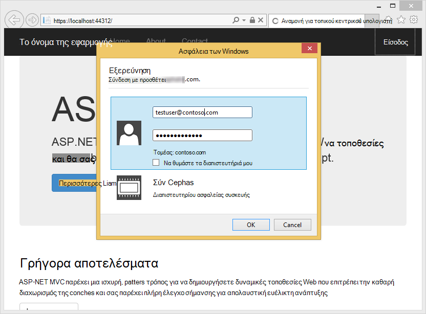

Μόλις συνδεθείτε με ένα χρήστη στον τομέα AD της ανάπτυξης AD FS, θα πρέπει να δείτε τώρα στην κεντρική σελίδα ξανά με **Γεια σας, <User Name>!** στην γωνία. Παρακάτω θα δείτε τι εμφανίζεται.

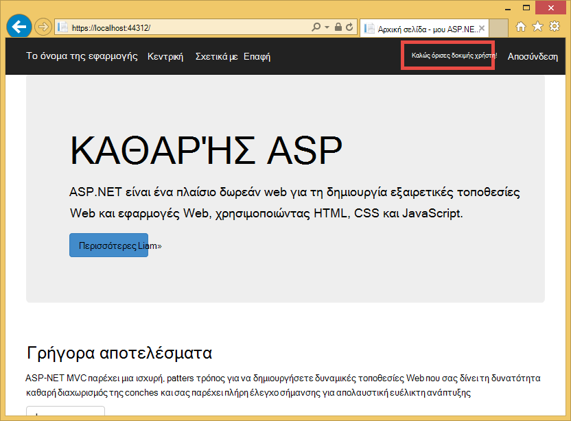

Μέχρι στιγμής, που έχετε ολοκληρώθηκε με επιτυχία με τους εξής τρόπους:

- Η εφαρμογή σας έχει φτάσει με επιτυχία AD FS και ένα αναγνωριστικό που ταιριάζει RP βρίσκεται στη βάση δεδομένων AD FS
- AD FS έχει με επιτυχία έλεγχος ταυτότητας ενός χρήστη AD και redirect να επιστρέψετε στην αρχική σελίδα της εφαρμογής
- AD FS ως αποστολή με επιτυχία το αίτημα όνομα (http://schemas.xmlsoap.org/ws/2005/05/identity/claims/name) στην εφαρμογή σας, όπως υποδεικνύεται από το γεγονός ότι το όνομα χρήστη εμφανίζεται στη γωνία. 

Εάν λείπει το αίτημα όνομα, θα έχετε δει **Hello,!**. Αν κοιτάξετε Views\Shared\_LoginPartial.cshtml, μπορείτε να βρείτε ότι χρησιμοποιεί `User.Identity.Name` για να εμφανίσετε το όνομα χρήστη. Όπως προαναφέρθηκε, εάν είναι διαθέσιμη στο διακριτικό SAML την απαίτηση όνομα του χρήστη με έλεγχο ταυτότητας, ASP.NET ενύδρων αυτήν την ιδιότητα με αυτό. Για να δείτε όλα τα αξιώσεων που αποστέλλονται με AD FS, τοποθετήστε ένα σημείο διακοπής σε Controllers\HomeController.cs, στη μέθοδο ενέργεια ευρετηρίου. Αφού ο χρήστης έχει ελεγχθεί η ταυτότητα, εξετάστε το `System.Security.Claims.Current.Claims` συλλογή.

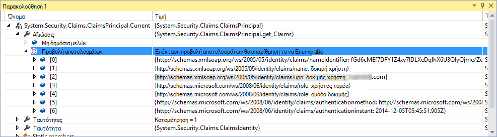 

## Εξουσιοδότηση χρηστών για το συγκεκριμένο ελεγκτές ή ενέργειες

Εφόσον έχετε συμπεριλάβει μελών ομάδας ως αξιώσεων ρόλο στη ρύθμιση παραμέτρων σας RP αξιοπιστίας, μπορείτε να χρησιμοποιείτε τους απευθείας στο το `[Authorize(Roles="...")]` διακοσμητικού για ελεγκτές και ενέργειες. Σε μια εφαρμογή γραμμής εταιρικά με το μοτίβο δημιουργία ανάγνωση-ενημέρωσης διαγραφής (CRUD), μπορείτε να εξουσιοδοτήσετε συγκεκριμένους ρόλους για να αποκτήσετε πρόσβαση σε κάθε ενέργεια. Προς το παρόν, θα απλώς να δοκιμάσετε αυτή η δυνατότητα στον υπάρχοντα ελεγκτή κεντρική.

1. Άνοιγμα Controllers\HomeController.cs.
2. Διακόσμηση το `About` και `Contact` ενέργεια μεθόδους παρόμοιο με τον ακόλουθο κώδικα, χρησιμοποιώντας ασφαλείας ομάδα μελών που έχει το χρήστη με έλεγχο ταυτότητας.  
    <pre class="prettyprint">
    <mark>[Εγκρίνετε (Ρόλοι = "Δοκιμή ομάδας")]</mark> 
    δημόσια ActionResult About() {ViewBag.Message = "Εφαρμογή περιγραφή τη σελίδα σας.".

        return View();
    }

    <mark>[Εγκρίνετε (Ρόλοι = "Domain Admins")]</mark> 
    δημόσια ActionResult Contact() {ViewBag.Message = "Επαφών τη σελίδα σας.".

        return View();
    }  </pre>

    Εφόσον να προσθέσει **Δοκιμή χρήστη** σε **Ομάδα δοκιμής** μου περιβάλλον εργαστήριο AD FS, που θα χρησιμοποιήσετε δοκιμής ομάδας για να ελέγξετε εξουσιοδότησης στο `About`. Για `Contact`, που θα ελέγξετε αρνητική πεζών-κεφαλαίων **Domain Admins**, στις οποίες ανήκουν οι **Δοκιμή χρήστη** δεν.

3. Ξεκινήστε το πρόγραμμα εντοπισμού σφαλμάτων πληκτρολογώντας `F5` και πραγματοποιήστε είσοδο στο και, στη συνέχεια, κάντε κλικ στην επιλογή **σχετικά με το**. Τώρα που θα πρέπει προβάλετε το `~/About/Index` σελίδα με επιτυχία, εάν το χρήστη με έλεγχο ταυτότητας είναι εξουσιοδοτημένοι για αυτήν την ενέργεια.
4. Τώρα, κάντε κλικ στην επιλογή **επαφή**, οι οποίες σε περίπτωση μου δεν θα πρέπει να εγκρίνουν **Δοκιμής χρήστη** για την ενέργεια. Ωστόσο, το πρόγραμμα περιήγησης ανακατευθύνεται σε AD FS, το οποίο τελικά εμφανίζει αυτό το μήνυμα:

    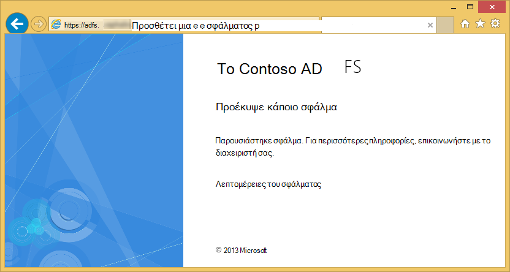

    Εάν ερευνήσει αυτό το σφάλμα στο πρόγραμμα προβολής συμβάντων στο διακομιστή AD FS, θα δείτε αυτό το μήνυμα εξαίρεσης:  
    <pre class="prettyprint">
   Microsoft.IdentityServer.Web.InvalidRequestException: MSIS7042: <mark>την ίδια περίοδο λειτουργίας περιήγησης προγράμματος-πελάτη έχει κάνει '6' αιτήσεις τα τελευταία '11' δευτερόλεπτα.</mark> Για λεπτομέρειες, επικοινωνήστε με το διαχειριστή σας.
   στο Microsoft.IdentityServer.Web.Protocols.PassiveProtocolHandler.UpdateLoopDetectionCookie (WrappedHttpListenerContext περιβάλλον) στο Microsoft.IdentityServer.Web.Protocols.WSFederation.WSFederationProtocolHandler.SendSignInResponse (WSFederationContext περιβάλλοντος, απόκριση MSISSignInResponse) στο Microsoft.IdentityServer.Web.PassiveProtocolListener.ProcessProtocolRequest (ProtocolContext protocolContext, PassiveProtocolHandler protocolHandler) στο Microsoft.IdentityServer.Web.PassiveProtocolListener.OnGetContext (WrappedHttpListenerContext περιβάλλον) </pre>

    Ο λόγος για αυτό το σφάλμα είναι ότι από προεπιλογή, MVC επιστρέφει μια 401 εξουσιοδότηση όταν δεν έχετε δικαίωμα ρόλοι χρήστη. Αυτό ενεργοποιεί μια αίτηση επανάληψη του ελέγχου ταυτότητας για την υπηρεσία παροχής ταυτότητας (AD FS). Επειδή το ήδη τον έλεγχο ταυτότητας χρήστη, AD FS επιστρέφει στην ίδια σελίδα, η οποία, στη συνέχεια, ζητήματα άλλο 401, τη δημιουργία ενός βρόχου redirect. Υπερισχύει του AuthorizeAttribute `HandleUnauthorizedRequest` μέθοδο με απλή λογική για να εμφανίσετε μια τιμή που έχει νόημα αντί να συνεχίσετε την επανάληψη redirect.

5. Δημιουργήστε ένα αρχείο του έργου που ονομάζεται AuthorizeAttribute.cs και επικολλήστε τον ακόλουθο κώδικα σε αυτήν.

        using System;
        using System.Web.Mvc;
        using System.Web.Routing;
        
        namespace WebApp_WSFederation_DotNet
        {
            [AttributeUsage(AttributeTargets.Class | AttributeTargets.Method, Inherited = true, AllowMultiple = true)]
            public class AuthorizeAttribute : System.Web.Mvc.AuthorizeAttribute
            {
                protected override void HandleUnauthorizedRequest(AuthorizationContext filterContext)
                {
                    if (filterContext.HttpContext.Request.IsAuthenticated)
                    {
                        filterContext.Result = new System.Web.Mvc.HttpStatusCodeResult((int)System.Net.HttpStatusCode.Forbidden);
                    }
                    else
                    {
                        base.HandleUnauthorizedRequest(filterContext);
                    }
                }
            }
        }

    Ο κώδικας παράκαμψη στέλνει μια HTTP 403 (Απαγορεύεται) αντί για HTTP 401 (εξουσιοδότηση) στις περιπτώσεις με έλεγχο ταυτότητας, αλλά μη εξουσιοδοτημένη.

6. Εκτέλεση του προγράμματος εντοπισμού σφαλμάτων ξανά με `F5`. Κάνοντας κλικ στην επιλογή **επαφής** τώρα εμφανίζει ένα πιο ενημερωτικό (μολονότι μη ελκυστικά) μήνυμα σφάλματος:

    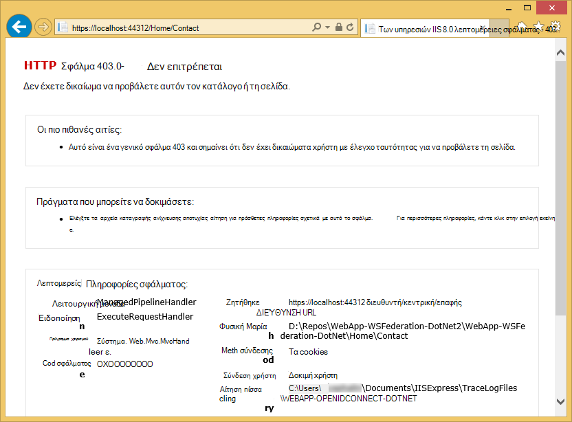

7. Δημοσιεύστε ξανά την εφαρμογή για να Azure εφαρμογής υπηρεσίας Web Apps και ελέγξτε τη συμπεριφορά της εφαρμογής live.

## Σύνδεση με τα δεδομένα εσωτερικής εγκατάστασης

Ένα λόγο για τον οποίο θα θέλατε για την υλοποίηση της εφαρμογής σας γραμμής εταιρικά με AD FS αντί για το Azure Active Directory είναι θέματα συμμόρφωσης με διατήρηση εταιρεία δεδομένων απενεργοποίηση εσωτερικής εγκατάστασης. Αυτό μπορεί επίσης να σημαίνει ότι το web app στο Azure πρέπει να εσωτερική βάσεις δεδομένων της access, επειδή δεν μπορείτε να χρησιμοποιήσετε [Βάση δεδομένων SQL](/services/sql-database/) ως η σειρά δεδομένων για τις εφαρμογές web.

Azure εφαρμογής υπηρεσίας Web Apps υποστηρίζει πρόσβαση σε βάσεις δεδομένων εσωτερικής εγκατάστασης με δύο προσεγγίσεις: [Υβριδική συνδέσεις](../biztalk-services/integration-hybrid-connection-overview.md) και [Εικονικού δίκτυα](web-sites-integrate-with-vnet.md). Για περισσότερες πληροφορίες, ανατρέξτε στο θέμα [υβριδική συνδέσεις με Azure εφαρμογής υπηρεσίας Web Apps και ενοποίηση με χρήση VNET](https://azure.microsoft.com/blog/2014/10/30/using-vnet-or-hybrid-conn-with-websites/).

## Επιπλέον πόρους

- [Προστασία της εφαρμογής με SSL και το χαρακτηριστικό εξουσιοδότηση](web-sites-dotnet-deploy-aspnet-mvc-app-membership-oauth-sql-database.md#protect-the-application-with-ssl-and-the-authorize-attribute)
- [Ο έλεγχος ταυτότητας με καταλόγου Active Directory εσωτερικής εγκατάστασης στην εφαρμογή Azure](web-sites-authentication-authorization.md)
- [Δημιουργία εφαρμογής Azure γραμμής εταιρικά με έλεγχο ταυτότητας Azure Active Directory](web-sites-dotnet-lob-application-azure-ad.md)
- [Χρησιμοποιήστε την επιλογή εταιρικό ελέγχου ταυτότητας εσωτερικής εγκατάστασης (ADFS) με ASP.NET στο Visual Studio 2013](http://www.cloudidentity.com/blog/2014/02/12/use-the-on-premises-organizational-authentication-option-adfs-with-asp-net-in-visual-studio-2013/)
- [Μετεγκατάσταση VS2013 Web έργου από WIF στο Katana](http://www.cloudidentity.com/blog/2014/09/15/MIGRATE-A-VS2013-WEB-PROJECT-FROM-WIF-TO-KATANA/)
- [Επισκόπηση των υπηρεσιών καταλόγου Active Directory Federation](http://technet.microsoft.com/library/hh831502.aspx)
- [Προδιαγραφή WS Ομοσπονδία 1.1](http://download.boulder.ibm.com/ibmdl/pub/software/dw/specs/ws-fed/WS-Federation-V1-1B.pdf?S_TACT=105AGX04&S_CMP=LP)

