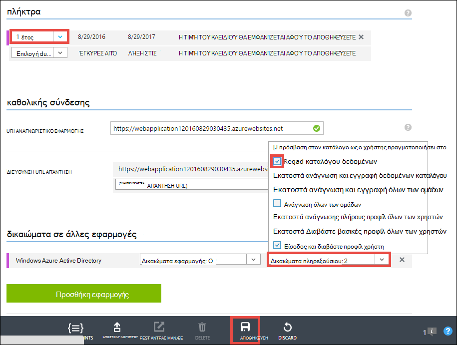

<properties 
    pageTitle="Δημιουργία εφαρμογής Azure γραμμής εταιρικά με έλεγχο ταυτότητας Azure Active Directory | Microsoft Azure" 
    description="Μάθετε πώς μπορείτε να δημιουργήσετε μια εφαρμογή της γραμμής εταιρικά ASP.NET MVC στο Azure εφαρμογής υπηρεσίας που πραγματοποιεί έλεγχο ταυτότητας με το Azure Active Directory" 
    services="app-service\web, active-directory" 
    documentationCenter=".net" 
    authors="cephalin" 
    manager="wpickett" 
    editor=""/>

<tags 
    ms.service="app-service-web" 
    ms.devlang="dotnet" 
    ms.topic="article" 
    ms.tgt_pltfrm="na" 
    ms.workload="web" 
    ms.date="09/01/2016" 
    ms.author="cephalin"/>

# Δημιουργία εφαρμογής Azure γραμμής εταιρικά με έλεγχο ταυτότητας Azure Active Directory #

Αυτό το άρθρο σάς δείχνει πώς μπορείτε να δημιουργήσετε μια εφαρμογή γραμμής εταιρικά .NET [Azure εφαρμογής υπηρεσίας Web Apps](http://go.microsoft.com/fwlink/?LinkId=529714) χρησιμοποιώντας το [ελέγχου ταυτότητας / εξουσιοδότησης](../app-service/app-service-authentication-overview.md) τη δυνατότητα. Εμφανίζει επίσης τον τρόπο χρήσης του [Azure Active Directory Graph API](https://msdn.microsoft.com/Library/Azure/Ad/Graph/api/api-catalog) για ερωτήματα καταλόγου δεδομένων στην εφαρμογή.

Ο μισθωτής Azure Active Directory που χρησιμοποιείτε μπορεί να είναι ένα μόνο Azure καταλόγου. Εναλλακτικά, μπορεί να είναι [συγχρονιστεί με την εσωτερική εγκατάσταση υπηρεσίας καταλόγου Active Directory](../active-directory/active-directory-aadconnect.md) για να δημιουργήσετε μια μεμονωμένη εμπειρία καθολικής σύνδεσης για τους εργαζόμενους που είναι εσωτερικής εγκατάστασης και απομακρυσμένα. Σε αυτό το άρθρο χρησιμοποιεί τον κατάλογο προεπιλογή για το λογαριασμό σας Azure.

## Τι θα δημιουργήσετε ##

Θα δημιουργήσετε μια απλή εφαρμογή δημιουργία ανάγνωση-ενημέρωσης διαγραφής (CRUD) γραμμής εταιρικά στις εφαρμογές Web της εφαρμογής υπηρεσίας ότι κομμάτια λειτουργούν στοιχεία με τις ακόλουθες δυνατότητες:

- Πραγματοποιεί έλεγχο ταυτότητας χρηστών σε σχέση με Azure Active Directory
- Τα ερωτήματα καταλόγου χρήστες και ομάδες με χρήση [Azure Active Directory Graph API](http://msdn.microsoft.com/library/azure/hh974476.aspx)
- Χρήση του προτύπου ASP.NET MVC *Χωρίς έλεγχο ταυτότητας*

Εάν χρειάζεστε έλεγχο πρόσβασης βάσει ρόλων (RBAC) για την εφαρμογή σας γραμμής εταιρικά στο Azure, ανατρέξτε στο [Επόμενο βήμα](#next).

## Τι χρειάζεστε ##

[AZURE.INCLUDE [free-trial-note](../../includes/free-trial-note.md)]

Χρειάζεστε τα εξής για να ολοκληρώσετε αυτό το πρόγραμμα εκμάθησης:

- Ένα μισθωτή του Azure Active Directory με χρήστες σε διάφορες ομάδες
- Δικαιώματα για να δημιουργήσετε εφαρμογές στο μισθωτή του Azure Active Directory
- Visual Studio 2013 ενημέρωση 4 ή νεότερη έκδοση
- [Azure SDK 2.8.1 ή νεότερη έκδοση](https://azure.microsoft.com/downloads/)

## Δημιουργία και ανάπτυξη μιας εφαρμογής web σε Azure ##

1. Από το Visual Studio, κάντε κλικ στο **αρχείο** > **Δημιουργία** > **έργου**.

2. Επιλέξτε **Εφαρμογή Web ASP.NET**, ονομάστε το έργο σας και κάντε κλικ στο κουμπί **OK**.

3. Επιλέξτε το πρότυπο **MVC** και, στη συνέχεια, αλλάξτε τον έλεγχο ταυτότητας με **Χωρίς τον έλεγχο ταυτότητας**. Βεβαιωθείτε ότι είναι επιλεγμένο **κεντρικού υπολογιστή στο Cloud** και κάντε κλικ στο **κουμπί OK**.

    

4. Στο παράθυρο διαλόγου **Δημιουργία εφαρμογής υπηρεσίας** , κάντε κλικ στην επιλογή **Προσθήκη λογαριασμού** (και, στη συνέχεια, στην αναπτυσσόμενη λίστα **Προσθήκη λογαριασμού** ) για να συνδεθείτε λογαριασμό σας στο Azure.

5. Αφού συνδεθεί σε ρύθμιση παραμέτρων της εφαρμογής web σας. Δημιουργήστε μια ομάδα πόρων και ένα νέο πρόγραμμα εφαρμογής υπηρεσίας κάνοντας κλικ στο κουμπί **Δημιουργία** αντίστοιχα. Κάντε κλικ στην επιλογή **Εξερεύνηση πρόσθετες Azure υπηρεσίες** για να συνεχίσετε.

    

6. Στην καρτέλα **υπηρεσίες** , κάντε κλικ στην επιλογή **+** για να προσθέσετε μια βάση δεδομένων SQL για την εφαρμογή σας. 

    

7. Στη **Ρύθμιση παραμέτρων της βάσης δεδομένων SQL**, κάντε κλικ στην επιλογή **Δημιουργία** για να δημιουργήσετε μια παρουσία του SQL Server.

8. **Ρύθμιση παραμέτρων του SQL Server**, ρυθμίσει τις παραμέτρους του παρουσία του SQL Server. Στη συνέχεια, κάντε κλικ στο κουμπί **OK**, **OK**και **Δημιουργία** για να ξεκινήσετε τη δημιουργία της εφαρμογής στο Azure.

9. **Azure εφαρμογής υπηρεσίας δραστηριότητας**, μπορείτε να δείτε όταν ολοκληρωθεί η δημιουργία της εφαρμογής. Κάντε κλικ στην επιλογή * *δημοσίευση &lt; *όνομα_εφαρμογής*> αυτό Web App τώρα**στη συνέχεια, κάντε κλικ στην επιλογή **δημοσίευση **. 

    Μόλις ολοκληρωθεί η Visual Studio, ανοίγει η εφαρμογή δημοσίευση στο πρόγραμμα περιήγησης. 

    

## Ρύθμιση παραμέτρων ελέγχου ταυτότητας και καταλόγου πρόσβασης

1. Συνδεθείτε [πύλη του Azure](https://portal.azure.com).

2. Από το αριστερό μενού, κάντε κλικ στην επιλογή **Εφαρμογή υπηρεσιών** > **&lt;*όνομα_εφαρμογής*>** > **ελέγχου ταυτότητας / εξουσιοδότησης **.

    

3. Ενεργοποίηση ελέγχου ταυτότητας Azure Active Directory, κάνοντας κλικ **στην** > **Azure Active Directory** > **Express** > **OK**.

    

4. Κάντε κλικ στην επιλογή **Αποθήκευση** στη γραμμή εντολών.

    

    Όταν οι ρυθμίσεις ελέγχου ταυτότητας αποθηκεύονται με επιτυχία, δοκιμάστε την περιήγηση για την εφαρμογή σας ξανά στο πρόγραμμα περιήγησης. Οι προεπιλεγμένες ρυθμίσεις επιβολή ελέγχου ταυτότητας σε ολόκληρη την εφαρμογή. Εάν δεν είστε ήδη συνδεδεμένοι, ανακατευθύνεστε σε οθόνη login. Αφού συνδεθεί σε, μπορείτε να δείτε την εφαρμογή σας με ασφάλεια με HTTPS. Στη συνέχεια, πρέπει να ενεργοποιήσετε την πρόσβαση στα δεδομένα του καταλόγου. 

5. Μεταβείτε στην [πύλη κλασική](https://manage.windowsazure.com).

6. Από το αριστερό μενού, κάντε κλικ στην επιλογή **Υπηρεσία καταλόγου Active Directory** > **Προεπιλεγμένη καταλόγου** > **εφαρμογές** > **&lt;*όνομα_εφαρμογής*> **.

    

    Αυτή είναι η εφαρμογή Azure Active Directory που δημιουργείται εφαρμογής υπηρεσίας για εσάς για να ενεργοποιήσετε την άδεια / δυνατότητα ελέγχου ταυτότητας.

7. Κάντε κλικ στην επιλογή **χρήστες** και **ομάδες** , για να βεβαιωθείτε ότι έχετε ορισμένες χρήστες και ομάδες στον κατάλογο. Εάν δεν δημιουργήσετε μερικούς δοκιμαστικούς χρήστες και ομάδες.

    

7. Κάντε κλικ στην επιλογή **Ρύθμιση παραμέτρων** για να ρυθμίσετε τις παραμέτρους αυτής της εφαρμογής.

8. Κάντε κύλιση προς τα κάτω στην ενότητα **πλήκτρα** και προσθέστε έναν αριθμό-κλειδί, επιλέγοντας μια διάρκεια. Στη συνέχεια, κάντε κλικ στην επιλογή **Δικαιώματα με ανάθεση** και επιλέξτε **Ανάγνωση καταλόγου δεδομένων**. Κάντε κλικ στην επιλογή **Αποθήκευση**.

    

8. Όταν οι ρυθμίσεις σας αποθηκεύονται, πραγματοποιήστε κύλιση πίσω στην ενότητα **πλήκτρα** και κάντε κλικ στο κουμπί **Αντιγραφή** για να αντιγράψετε τον αριθμό-κλειδί προγράμματος-πελάτη. 

    

    >[AZURE.IMPORTANT] Αν μεταβείτε μακριά από αυτήν τη σελίδα τώρα, δεν θα μπορούν να έχουν πρόσβαση σε αυτό το κλειδί προγράμματος-πελάτη ποτέ ξανά.

9. Στη συνέχεια, πρέπει να ρυθμίσετε τις παραμέτρους της εφαρμογής web σας με αυτό το κλειδί. Συνδεθείτε στην [Εξερεύνηση των πόρων Azure](https://resources.azure.com) με το λογαριασμό σας Azure.

10. Στο επάνω μέρος της σελίδας, κάντε κλικ στην επιλογή **Ανάγνωσης/εγγραφής** για να κάνετε αλλαγές στην Εξερεύνηση του Azure πόρων.

    

11. Βρείτε τις ρυθμίσεις ελέγχου ταυτότητας για την εφαρμογή σας, που βρίσκεται στο συνδρομές > * *&lt;*subscriptionname*>** > **resourceGroups** > **&lt;*resourcegroupname*>** > **υπηρεσίες παροχής** > **Microsoft.Web** > **τοποθεσίες** > **&lt;*όνομα_εφαρμογής*>** > **config** > **authsettings **.

12. Κάντε κλικ στην επιλογή **Επεξεργασία**.

    

13. Στο παράθυρο επεξεργασίας, ορίστε το `clientSecret` και `additionalLoginParams` ιδιότητες ως εξής.

        ...
        "clientSecret": "<client key from the Azure Active Directory application>",
        ...
        "additionalLoginParams": ["response_type=code id_token", "resource=https://graph.windows.net"],
        ...

14. Κάντε κλικ στην επιλογή **Τοποθέτηση** στο επάνω μέρος για να υποβάλετε τις αλλαγές σας.

    

14. Τώρα, για να ελέγξετε εάν έχετε το διακριτικό εξουσιοδότηση πρόσβασης το API Azure Active Directory Graph, απλώς μεταβείτε * *https://&lt;*όνομα_εφαρμογής*>.azurewebsites.net/.auth/me** στο πρόγραμμα περιήγησης. Εάν έχετε ρυθμίσει τα πάντα σωστά, θα πρέπει να βλέπετε το `access_token` ιδιότητα στην απάντηση JSON.

    Το `~/.auth/me` διαδρομή URL γίνεται από έλεγχος ταυτότητας της εφαρμογής υπηρεσίας / εξουσιοδότησης για να σας δώσει όλες τις πληροφορίες που σχετίζονται με την περίοδο λειτουργίας με έλεγχο ταυτότητας. Για περισσότερες πληροφορίες, ανατρέξτε στο θέμα [Έλεγχος ταυτότητας και εξουσιοδότησης στο Azure εφαρμογής υπηρεσίας](../app-service/app-service-authentication-overview.md).

    >[AZURE.NOTE] Το `access_token` έχει μια περίοδο λήξης. Ωστόσο, έλεγχος ταυτότητας της εφαρμογής υπηρεσίας / εξουσιοδότησης παρέχει λειτουργικότητα διακριτικού ανανέωσης με `~/.auth/refresh`. Για περισσότερες πληροφορίες σχετικά με τον τρόπο για να τον χρησιμοποιήσετε, ανατρέξτε στο θέμα     [Εφαρμογή υπηρεσίας διακριτικό του χώρου αποθήκευσης](https://cgillum.tech/2016/03/07/app-service-token-store/).

Στη συνέχεια, θα το κάνετε κάτι χρήσιμο με δεδομένα του καταλόγου.

## Προσθήκη γραμμής εταιρικά λειτουργιών για την εφαρμογή σας

Τώρα, μπορείτε να δημιουργήσετε μια απλή παρακολούθηση στοιχείων εργασιών CRUD.  

5.  Στο φάκελο ~\Models, να δημιουργήσετε ένα αρχείο κλάσης που ονομάζεται WorkItem.cs και να αντικαταστήσετε `public class WorkItem {...}` με τον ακόλουθο κώδικα:

        using System.ComponentModel.DataAnnotations;

        public class WorkItem
        {
            [Key]
            public int ItemID { get; set; }
            public string AssignedToID { get; set; }
            public string AssignedToName { get; set; }
            public string Description { get; set; }
            public WorkItemStatus Status { get; set; }
        }

        public enum WorkItemStatus
        {
            Open,
            Investigating,
            Resolved,
            Closed
        }

7.  Δημιουργήστε το έργο για να διευκολύνετε την πρόσβαση της λογικής ικριώματος το νέο μοντέλο στο Visual Studio.

8.  Προσθήκη νέου στοιχείου scaffolded `WorkItemsController` στο φάκελο ~\Controllers (κάντε δεξί κλικ **ελεγκτές**, τοποθετήστε το δείκτη για **Προσθήκη**και επιλέξτε **νέο στοιχείο scaffolded**). 

9.  Επιλέξτε **Ελεγκτή 5 MVC με προβολές, χρησιμοποιώντας πλαίσιο οντότητα** και κάντε κλικ στην επιλογή **Προσθήκη**.

10. Επιλέξτε το μοντέλο που έχετε δημιουργήσει, στη συνέχεια, κάντε κλικ στην επιλογή **+** και, στη συνέχεια, **Προσθήκη** για να προσθέσετε ένα περιβάλλον δεδομένων και, στη συνέχεια, κάντε κλικ στην επιλογή **Προσθήκη**.

    

14. Στο ~\Views\WorkItems\Create.cshtml (αυτόματα scaffolded στοιχείο), βρείτε το `Html.BeginForm` μέθοδο Βοήθειας και να κάνετε τις ακόλουθες αλλαγές επισήμανση:  
<pre class="prettyprint">
    @modelWebApplication1.Models.WorkItem

    @{ViewBag.Title = &quot;Δημιουργία&quot;; }

    &lt;H2&gt;Δημιουργία&lt;/h2&gt;

    @using(Html.BeginForm (<mark>&quot;Δημιουργία&quot;, &quot;WorkItems&quot;, FormMethod.Post, νέο {αναγνωριστικό = &quot;κύρια φόρμα&quot; }</mark>)) {@Html.AntiForgeryToken()

        &lt;div class=&quot;form-horizontal&quot;&gt;
            &lt;h4&gt;WorkItem&lt;/h4&gt;
            &lt;hr /&gt;
            @Html.ValidationSummary(true, &quot;&quot;, new { @class = &quot;text-danger&quot; })
            &lt;div class=&quot;form-group&quot;&gt;
                @Html.LabelFor(model =&gt; model.AssignedToID, htmlAttributes: new { @class = &quot;control-label col-md-2&quot; })
                &lt;div class=&quot;col-md-10&quot;&gt;
                    @Html.EditorFor(model =&gt; model.AssignedToID, new { htmlAttributes = new { @class = &quot;form-control&quot;<mark>, @type = &quot;hidden&quot;</mark> } })
                    @Html.ValidationMessageFor(model =&gt; model.AssignedToID, &quot;&quot;, new { @class = &quot;text-danger&quot; })
                &lt;/div&gt;
            &lt;/div&gt;

            &lt;div class=&quot;form-group&quot;&gt;
                @Html.LabelFor(model =&gt; model.AssignedToName, htmlAttributes: new { @class = &quot;control-label col-md-2&quot; })
                &lt;div class=&quot;col-md-10&quot;&gt;
                    @Html.EditorFor(model =&gt; model.AssignedToName, new { htmlAttributes = new { @class = &quot;form-control&quot; } })
                    @Html.ValidationMessageFor(model =&gt; model.AssignedToName, &quot;&quot;, new { @class = &quot;text-danger&quot; })
                &lt;/div&gt;
            &lt;/div&gt;

            &lt;div class=&quot;form-group&quot;&gt;
                @Html.LabelFor(model =&gt; model.Description, htmlAttributes: new { @class = &quot;control-label col-md-2&quot; })
                &lt;div class=&quot;col-md-10&quot;&gt;
                    @Html.EditorFor(model =&gt; model.Description, new { htmlAttributes = new { @class = &quot;form-control&quot; } })
                    @Html.ValidationMessageFor(model =&gt; model.Description, &quot;&quot;, new { @class = &quot;text-danger&quot; })
                &lt;/div&gt;
            &lt;/div&gt;

            &lt;div class=&quot;form-group&quot;&gt;
                @Html.LabelFor(model =&gt; model.Status, htmlAttributes: new { @class = &quot;control-label col-md-2&quot; })
                &lt;div class=&quot;col-md-10&quot;&gt;
                    @Html.EnumDropDownListFor(model =&gt; model.Status, htmlAttributes: new { @class = &quot;form-control&quot; })
                    @Html.ValidationMessageFor(model =&gt; model.Status, &quot;&quot;, new { @class = &quot;text-danger&quot; })
                &lt;/div&gt;
            &lt;/div&gt;

            &lt;div class=&quot;form-group&quot;&gt;
                &lt;div class=&quot;col-md-offset-2 col-md-10&quot;&gt;
                    &lt;input type=&quot;submit&quot; value=&quot;Create&quot; class=&quot;btn btn-default&quot;<mark> id=&quot;submit-button&quot;</mark> /&gt;
                &lt;/div&gt;
            &lt;/div&gt;
        &lt;/div&gt;
    }

    &lt;div&gt;
    @Html.ActionLink(&quot;Επιστροφή στη λίστα&quot;, &quot;ευρετήριο&quot;) &lt;/div    &gt;

    @sectionΔέσμες ενεργειών { @Scripts.Render( &quot;~/bundles/jqueryval&quot;)     <mark> &lt;δέσμης ενεργειών&gt; 
     / / κωδικός επιλογέα ατόμων/ομάδων var maxResultsPerPage = 14;         Εισαγωγή δεδομένων VAR = document.getElementById (&quot;AssignedToName&quot;);

            // Access token from request header, and tenantID from claims identity
            var token = &quot;@Request.Headers[&quot;X-MS-TOKEN-AAD-ACCESS-TOKEN&quot;]&quot;;
            var tenant =&quot;@(System.Security.Claims.ClaimsPrincipal.Current.Claims
                            .Where(c => c.Type == &quot;http://schemas.microsoft.com/identity/claims/tenantid&quot;)
                            .Select(c => c.Value).SingleOrDefault())&quot;;

            var picker = new AadPicker(maxResultsPerPage, input, token, tenant);

            // Submit the selected user/group to be asssigned.
            $(&quot;#submit-button&quot;).click({ picker: picker }, function () {
                if (!picker.Selected())
                    return;
                $(&quot;#main-form&quot;).get()[0].elements[&quot;AssignedToID&quot;].value = picker.Selected().objectId;
            });
        &lt;/script&gt;</mark>
    }
    </pre>
    
    Λάβετε υπόψη ότι `token` και `tenant` που χρησιμοποιούνται από το `AadPicker` αντικειμένου για την πραγματοποίηση κλήσεων Azure Active Directory Graph API. Θα προσθέσετε `AadPicker` αργότερα.   
    
    >[AZURE.NOTE] Μπορείτε να λάβετε απλώς καθώς και `token` και `tenant` από την πλευρά του προγράμματος-πελάτη με `~/.auth/me`, αλλά αυτή θα ήταν μια κλήση πρόσθετου διακομιστή. Για παράδειγμα:
    >  
    >     $.ajax({
    >         dataType: "json",
    >         url: "/.auth/me",
    >         success: function (data) {
    >             var token = data[0].access_token;
    >             var tenant = data[0].user_claims
    >                             .find(c => c.typ === 'http://schemas.microsoft.com/identity/claims/tenantid')
    >                             .val;
    >         }
    >     });
    
15. Κάντε τις ίδιες αλλαγές με ~ \Views\WorkItems\Edit.cshtml.

15. Το `AadPicker` αντικείμενο έχει οριστεί σε μια δέσμη ενεργειών που χρειάζεστε για να προσθέσετε στο έργο σας. Κάντε δεξί κλικ στο φάκελο ~\Scripts, τοποθετήστε το δείκτη για **Προσθήκη**και κάντε κλικ στην επιλογή **αρχείο JavaScript**. Τύπος `AadPickerLibrary` για το όνομα αρχείου και κάντε κλικ στο **κουμπί OK**.

16. Αντιγράψτε το περιεχόμενο από [εδώ](https://raw.githubusercontent.com/cephalin/active-directory-dotnet-webapp-roleclaims/master/WebApp-RoleClaims-DotNet/Scripts/AadPickerLibrary.js) σε ~ \Scripts\AadPickerLibrary.js.

    Στη δέσμη ενεργειών, το `AadPicker` αντικείμενο καλέσει [Azure Active Directory Graph API](https://msdn.microsoft.com/Library/Azure/Ad/Graph/api/api-catalog) για να πραγματοποιήσετε αναζήτηση για χρήστες και ομάδες που ταιριάζουν με την είσοδο.  

17. ~\Scripts\AadPickerLibrary.js χρησιμοποιεί επίσης το [widget jQuery αυτόματης καταχώρησης περιβάλλοντος εργασίας Χρήστη](https://jqueryui.com/autocomplete/). Πρέπει να προσθέσετε jQuery περιβάλλοντος εργασίας Χρήστη στο έργο σας. Κάντε δεξί κλικ του έργου σας στο και κάντε κλικ στην επιλογή **Διαχείριση πακέτων NuGet**.

18. Στη NuGet πακέτου διαχείριση, κάντε κλικ στο κουμπί Αναζήτηση, πληκτρολογήστε **jquery ui** στη γραμμή αναζήτησης και κάντε κλικ στην επιλογή **jQuery.UI.Combined**.

    

19. Στο δεξιό παράθυρο, κάντε κλικ στην επιλογή **εγκατάσταση**και, στη συνέχεια, κάντε κλικ στο κουμπί **OK** για να συνεχίσετε.

19. Ανοίξτε ~\App_Start\BundleConfig.cs και να κάνετε τις ακόλουθες αλλαγές επισήμανση:  
    <pre class="prettyprint">
    δημόσια στατική void RegisterBundles(BundleCollection bundles) {πακέτα. Προσθήκη (νέο ScriptBundle (&quot;~/bundles/jquery&quot;). Συμπεριλάβετε ( &quot;~/Scripts/jquery-{version}.js&quot;<mark>, &quot;~/Scripts/jquery-ui-{version}.js&quot;, &quot;~/Scripts/AadPickerLibrary.js&quot;</mark>));

        bundles.Add(new ScriptBundle(&quot;~/bundles/jqueryval&quot;).Include(
                    &quot;~/Scripts/jquery.validate*&quot;));

        // Use the development version of Modernizr to develop with and learn from. Then, when you&#39;re
        // ready for production, use the build tool at http://modernizr.com to pick only the tests you need.
        bundles.Add(new ScriptBundle(&quot;~/bundles/modernizr&quot;).Include(
                    &quot;~/Scripts/modernizr-*&quot;));

        bundles.Add(new ScriptBundle(&quot;~/bundles/bootstrap&quot;).Include(
                    &quot;~/Scripts/bootstrap.js&quot;,
                    &quot;~/Scripts/respond.js&quot;));

        bundles.Add(new StyleBundle(&quot;~/Content/css&quot;).Include(
                    &quot;~/Content/bootstrap.css&quot;,
                    &quot;~/Content/site.css&quot;<mark>,
                    &quot;~/Content/themes/base/jquery-ui.css&quot;</mark>));
    }
    </pre>

    Υπάρχουν περισσότερες performant τρόποι για να διαχειριστείτε αρχεία JavaScript και CSS στην εφαρμογή. Ωστόσο, για λόγους ευκολίας μόνο πρόκειται να συμπεριληφθεί η piggyback στην τα πακέτα που φορτώνονται με κάθε προβολή.

12. Τέλος, στο ~ \Global.asax, προσθέστε την ακόλουθη γραμμή κώδικα σε το `Application_Start()` μέθοδο. `Ctrl`+`.`σε κάθε ονομασίας σφάλμα ανάλυση για να διορθώσετε το πρόβλημα.

        AntiForgeryConfig.UniqueClaimTypeIdentifier = ClaimTypes.NameIdentifier;
    
    > [AZURE.NOTE] Χρειάζεστε αυτήν τη γραμμή κώδικα, επειδή χρησιμοποιεί το προεπιλεγμένο πρότυπο MVC <code>[ValidateAntiForgeryToken]</code> διακοσμητικού σε ορισμένες από τις ενέργειες. Λόγω της συμπεριφοράς που περιγράφεται από [Brock Allen](https://twitter.com/BrockLAllen) στο     [MVC 4, AntiForgeryToken και αξιώσεων](http://brockallen.com/2012/07/08/mvc-4-antiforgerytoken-and-claims/) ΚΑΤΑΧΏΡΗΣΉ σας HTTP ενδέχεται να αποτύχει καταπολέμησης της πλαστογράφησης διακριτικού επικύρωσης, επειδή:

    > - Azure Active Directory δεν στέλνει το http://schemas.microsoft.com/accesscontrolservice/2010/07/claims/identityprovider, που είναι απαραίτητη από προεπιλογή, το διακριτικό καταπολέμησης της πλαστογράφησης.
    > - Εάν Azure Active Directory είναι κατάλογος συγχρονιστεί με AD FS, AD FS να θεωρούνται αξιόπιστα από προεπιλογή δεν στέλνει την αίτηση http://schemas.microsoft.com/accesscontrolservice/2010/07/claims/identityprovider είτε, παρόλο που μπορείτε να ρυθμίσετε με μη αυτόματο τρόπο AD FS για να στείλετε το αίτημα αυτό.

    > `ClaimTypes.NameIdentifies`Καθορίζει το αίτημα `http://schemas.xmlsoap.org/ws/2005/05/identity/claims/nameidentifier`, που παρέχουν Azure Active Directory.  

20. Στη συνέχεια, να δημοσιεύσετε τις αλλαγές σας. Κάντε δεξιό κλικ στο έργο σας και κάντε κλικ στο κουμπί **Δημοσίευση**.

21. Κάντε κλικ στην επιλογή **Ρυθμίσεις**, βεβαιωθείτε ότι υπάρχει μια συμβολοσειρά σύνδεσης στη βάση δεδομένων SQL, επιλέξτε **Ενημέρωση βάσης δεδομένων** για να κάνετε τις αλλαγές διάταξης για το μοντέλο, και κάντε κλικ στο κουμπί **Δημοσίευση**.

    

22. Στο πρόγραμμα περιήγησης, μεταβείτε στις επιλογές https://&lt;*όνομα_εφαρμογής*>.azurewebsites.net/workitems και κάντε κλικ στην επιλογή **Δημιουργία νέου**.

23. Κάντε κλικ στο πλαίσιο **AssignedToName** . Τώρα θα πρέπει να βλέπετε χρήστες και ομάδες από το μισθωτή του Azure Active Directory σε μια αναπτυσσόμενη λίστα. Μπορείτε να πληκτρολογήσετε για να φιλτράρετε ή να χρησιμοποιήσετε το `Up` ή `Down` κλειδί ή κάντε κλικ για να επιλέξετε το χρήστη ή την ομάδα. 

    

24. Κάντε κλικ στην επιλογή **Δημιουργία** για να αποθηκεύσετε τις αλλαγές. Στη συνέχεια, κάντε κλικ στην επιλογή **Επεξεργασία** στο στοιχείο εργασίας που έχουν δημιουργηθεί για να παρακολουθήσετε την ίδια συμπεριφορά.

Congrats, τώρα χρησιμοποιείτε μια εφαρμογή γραμμής εταιρικά Azure με πρόσβαση καταλόγου! Υπάρχει πολύ περισσότερες μπορείτε να κάνετε με το API του γραφήματος. Ανατρέξτε στο θέμα [αναφορά API Azure AD Graph](https://msdn.microsoft.com/library/azure/ad/graph/api/api-catalog).

## Επόμενο βήμα

Εάν χρειάζεστε έλεγχο πρόσβασης βάσει ρόλων (RBAC) για την εφαρμογή σας γραμμής εταιρικά στο azure, ανατρέξτε στο θέμα [WebApp-RoleClaims-DotNet](https://github.com/Azure-Samples/active-directory-dotnet-webapp-roleclaims) για ένα δείγμα από την ομάδα του Azure Active Directory. Σας δείχνει πώς μπορείτε να ενεργοποιήσετε τους ρόλους για την εφαρμογή σας Azure Active Directory και, στη συνέχεια, επιτρέπουν στους χρήστες με το `[Authorize]` διακόσμηση.

Εάν η εφαρμογή της γραμμής εταιρικά χρειάζεται πρόσβαση σε δεδομένα εσωτερικής εγκατάστασης, ανατρέξτε στο θέμα [πρόσβαση στην εσωτερική εγκατάσταση πόρων με χρήση της υβριδικής συνδέσεις στο Azure εφαρμογής υπηρεσίας](web-sites-hybrid-connection-get-started.md).

## Επιπλέον πόρους

- [Έλεγχος ταυτότητας και εξουσιοδότησης στο Azure εφαρμογής υπηρεσίας](../app-service/app-service-authentication-overview.md)
- [Ο έλεγχος ταυτότητας με καταλόγου Active Directory εσωτερικής εγκατάστασης στην εφαρμογή Azure](web-sites-authentication-authorization.md)
- [Δημιουργία εφαρμογής γραμμής εταιρικά στο Azure με έλεγχο ταυτότητας AD FS](web-sites-dotnet-lob-application-adfs.md)
- [Έλεγχος ταυτότητας εφαρμογής υπηρεσίας και του Azure AD Graph API](https://cgillum.tech/2016/03/25/app-service-auth-aad-graph-api/)
- [Δείγματα Microsoft Azure Active Directory και την τεκμηρίωση](https://github.com/AzureADSamples)
- [Υποστηρίζονται καταλόγου Azure Active Directory τύποι διεκδίκηση και διακριτικού](http://msdn.microsoft.com/library/azure/dn195587.aspx)

[Protect the Application with SSL and the Authorize Attribute]: web-sites-dotnet-deploy-aspnet-mvc-app-membership-oauth-sql-database.md#protect-the-application-with-ssl-and-the-authorize-attribute
