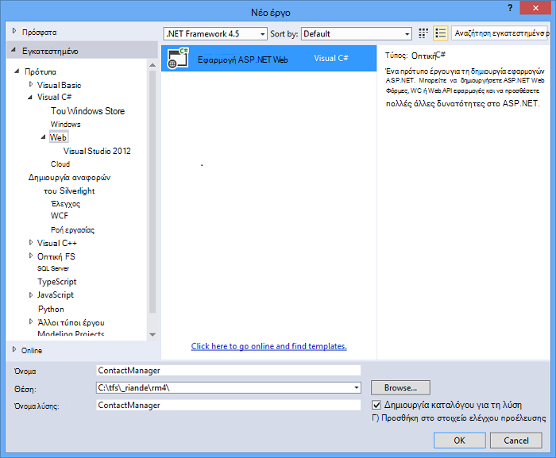
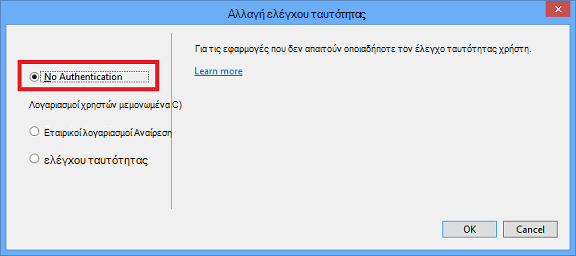
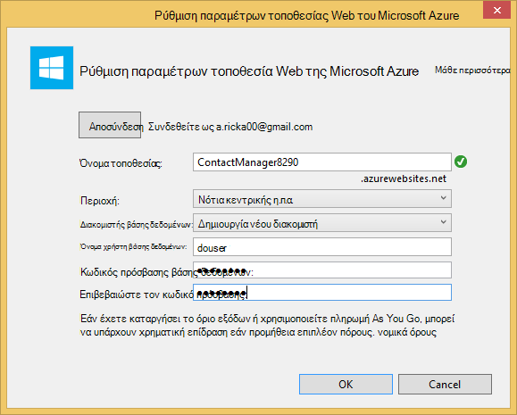
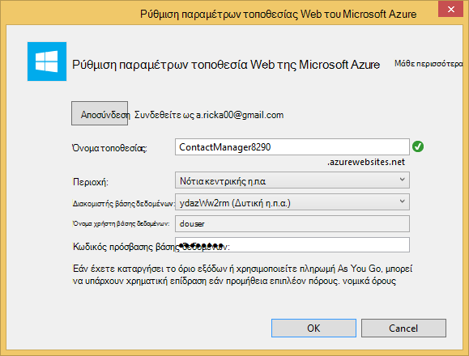
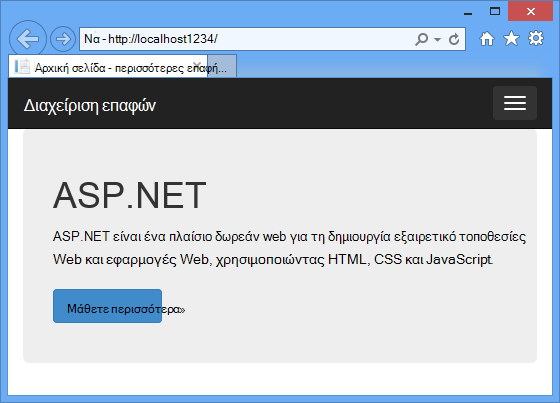
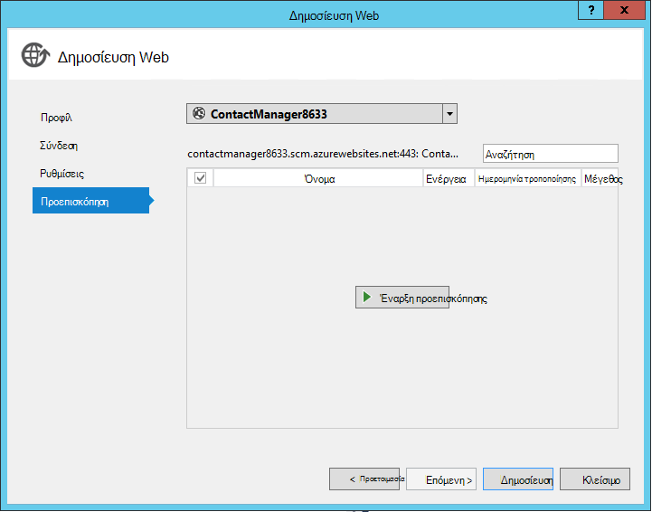
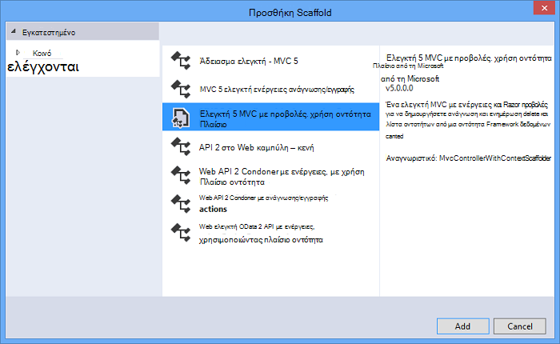
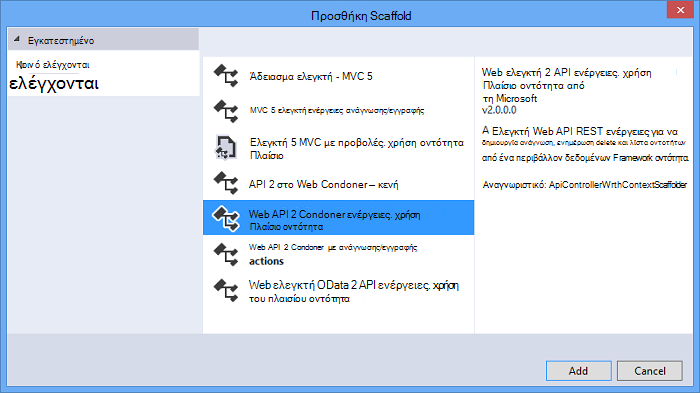
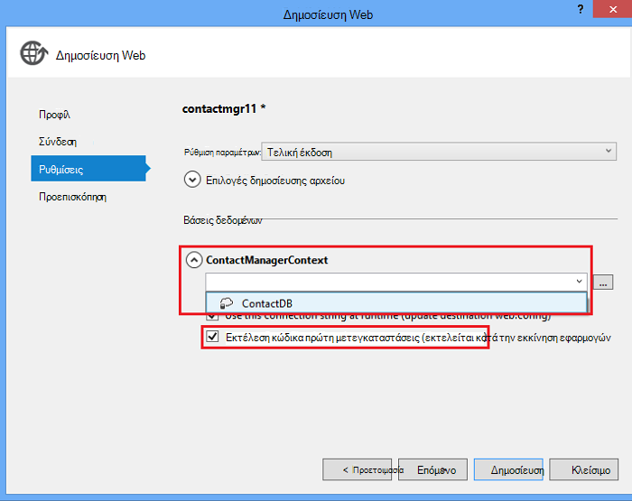

<properties 
    pageTitle="Δημιουργία μιας υπηρεσίας ΥΠΌΛΟΙΠΑ χρήση ASP.NET Web API και βάση δεδομένων SQL του Azure εφαρμογής υπηρεσίας" 
    description="Ένα πρόγραμμα εκμάθησης που σας μαθαίνει πώς να αναπτύξετε μια εφαρμογή που χρησιμοποιεί το API Web ASP.NET σε μια εφαρμογή Azure web με χρήση του Visual Studio." 
    services="app-service\web" 
    documentationCenter=".net" 
    authors="Rick-Anderson" 
    writer="Rick-Anderson" 
    manager="wpickett" 
    editor=""/>

<tags 
    ms.service="app-service-web" 
    ms.workload="web" 
    ms.tgt_pltfrm="na" 
    ms.devlang="dotnet" 
    ms.topic="article" 
    ms.date="02/29/2016" 
    ms.author="riande"/>

# Δημιουργία μιας υπηρεσίας ΥΠΌΛΟΙΠΑ χρήση ASP.NET Web API και βάση δεδομένων SQL του Azure εφαρμογής υπηρεσίας

Αυτό το πρόγραμμα εκμάθησης δείχνει πώς μπορείτε να αναπτύξετε μια εφαρμογή web ASP.NET σε μια [Υπηρεσία εφαρμογών Azure](http://go.microsoft.com/fwlink/?LinkId=529714) χρησιμοποιώντας τον Οδηγό δημοσίευσης Web στο Visual Studio 2013 ή στο Visual Studio 2013 Κοινότητας Edition. 

Μπορείτε να ανοίξετε ένα λογαριασμό Azure δωρεάν και, εάν δεν έχετε ήδη Visual Studio 2013, το SDK εγκαθιστά αυτόματα Visual Studio 2013 για το Web Express. Επομένως, μπορείτε να ξεκινήσετε ανάπτυξη για Azure εντελώς για δωρεάν.

Αυτό το πρόγραμμα εκμάθησης προϋποθέτει ότι έχετε χωρίς προηγούμενη εμπειρία με χρήση Azure. Στην ολοκλήρωση αυτό το πρόγραμμα εκμάθησης, θα έχετε μια εφαρμογή web απλό προς τα επάνω και την εκτέλεση στο cloud.
 
Θα μάθετε:

* Μάθετε πώς μπορείτε να ενεργοποιήσετε τον υπολογιστή σας για την ανάπτυξη Azure μέσω της εγκατάστασης του SDK Azure.
* Μάθετε πώς μπορείτε να δημιουργήσετε ένα έργο Visual Studio ASP.NET MVC 5 και να το δημοσιεύσετε σε μια εφαρμογή του Azure.
* Μάθετε πώς μπορείτε να χρησιμοποιήσετε το API Web ASP.NET για να ενεργοποιήσετε τις κλήσεις Restful API.
* Μάθετε πώς μπορείτε να χρησιμοποιήσετε μια βάση δεδομένων SQL για την αποθήκευση δεδομένων στο Azure.
* Μάθετε πώς μπορείτε να δημοσιεύσετε ενημερωμένες εκδόσεις εφαρμογών Azure.

Θα μπορείτε να δημιουργήσετε μια εφαρμογή web απλής λίστας επαφών που είναι ενσωματωμένος στο ASP.NET MVC 5 και χρησιμοποιεί το πλαίσιο οντότητα ADO.NET για πρόσβαση στη βάση δεδομένων. Η παρακάτω εικόνα εμφανίζει την ολοκληρωμένη εφαρμογή:

![στιγμιότυπο οθόνης της τοποθεσίας web][intro001]

<!-- the next line produces the "Set up the development environment" section as see at http://azure.microsoft.com/documentation/articles/web-sites-dotnet-get-started/ -->
[AZURE.INCLUDE [create-account-and-websites-note](../../includes/create-account-and-websites-note.md)]

### Δημιουργία έργου

1. Εκκινήστε το Visual Studio 2013.
1. Από το μενού **αρχείο** , κάντε κλικ στην επιλογή **Νέο έργο**.
3. Στο παράθυρο διαλόγου **Νέο έργο** , αναπτύξτε το στοιχείο **Visual C#** επιλέξτε **Web** και, στη συνέχεια, επιλέξτε **Την εφαρμογή Web ASP.NET**. Δώστε ένα όνομα στην εφαρμογή **ContactManager** και κάντε κλικ στο κουμπί **OK**.

    

1. Στο παράθυρο διαλόγου **Νέο έργο ASP.NET** , επιλέξτε το πρότυπο **MVC** , ελέγξτε **Το API Web** και, στη συνέχεια, κάντε κλικ στην επιλογή **Αλλαγή ελέγχου ταυτότητας**.

1. Στο παράθυρο διαλόγου **Αλλαγή ελέγχου ταυτότητας** , κάντε κλικ στην επιλογή **Χωρίς έλεγχο ταυτότητας**και, στη συνέχεια, κάντε κλικ στο κουμπί **OK**.

    

    Το δείγμα εφαρμογής που δημιουργείτε δεν θα έχετε δυνατότητες που απαιτείται από τους χρήστες για να συνδεθείτε. Για πληροφορίες σχετικά με το πώς μπορείτε να υλοποιήσετε δυνατότητες ελέγχου ταυτότητας και εξουσιοδότησης, ανατρέξτε στην ενότητα [Επόμενα βήματα](#nextsteps) στο τέλος αυτού του προγράμματος εκμάθησης. 

1. Στο παράθυρο διαλόγου **Νέο έργο ASP.NET** , βεβαιωθείτε ότι είναι επιλεγμένο το **κεντρικού υπολογιστή στο Cloud** και κάντε κλικ στο κουμπί **OK**.

Εάν δεν έχετε δεν ήδη πραγματοποιήσει είσοδο στο Azure, θα σας ζητηθεί να εισέλθετε.

1. Ο Οδηγός ρύθμισης παραμέτρων θα προτείνει ένα μοναδικό όνομα που βασίζεται σε *ContactManager* (ανατρέξτε στο θέμα η παρακάτω εικόνα). Επιλέξτε μια περιοχή κοντά σας. Μπορείτε να χρησιμοποιήσετε [azurespeed.com](http://www.azurespeed.com/ "AzureSpeed.com") για να βρείτε το μικρότερο κέντρο δεδομένων λανθάνων χρόνος. 
2. Εάν δεν έχετε δημιουργήσει ένα διακομιστή βάσης δεδομένων πριν από την, επιλέξτε **Δημιουργία νέου διακομιστή**, πληκτρολογήστε ένα όνομα βάσης δεδομένων χρήστη και τον κωδικό πρόσβασης.

    

Εάν έχετε ένα διακομιστή βάσης δεδομένων, χρησιμοποιήστε που για να δημιουργήσετε μια νέα βάση δεδομένων. Οι διακομιστές βάσης δεδομένων είναι ένα πολύτιμο πόρων και γενικά που θέλετε να δημιουργήσετε πολλές βάσεις δεδομένων στον ίδιο διακομιστή για σκοπούς δοκιμής και ανάπτυξη αντί να δημιουργήσετε ένα διακομιστή βάσης δεδομένων ανά βάση δεδομένων. Βεβαιωθείτε ότι την τοποθεσία web σας και βάση δεδομένων είναι στην ίδια περιοχή.

### Ορίστε την κεφαλίδα και το υποσέλιδο

1. Στην **Εξερεύνηση λύσεων**, αναπτύξτε το φάκελο *Views\Shared* και ανοίξτε το αρχείο *_Layout.cshtml* .

    ![_Layout.cshtml στην Εξερεύνηση λύσεων][newapp004]

1. Αντικαταστήστε τα περιεχόμενα του αρχείου *Views\Shared_Layout.cshtml* με τον ακόλουθο κώδικα:

        <!DOCTYPE html>
        <html lang="en">
        <head>
            <meta charset="utf-8" />
            <title>@ViewBag.Title - Contact Manager</title>
            <link href="~/favicon.ico" rel="shortcut icon" type="image/x-icon" />
            <meta name="viewport" content="width=device-width" />
            @Styles.Render("~/Content/css")
            @Scripts.Render("~/bundles/modernizr")
        </head>
        <body>
            <header>
                

                    

                        
@Html.ActionLink("Contact Manager", "Index", "Home")

                    

                

            </header>
            

                @RenderSection("featured", required: false)
                <section class="content-wrapper main-content clear-fix">
                    @RenderBody()
                </section>
            

            <footer>
                

                    

                        
&copy; @DateTime.Now.Year - Contact Manager

                    

                

            </footer>
            @Scripts.Render("~/bundles/jquery")
            @RenderSection("scripts", required: false)
        </body>
        </html>
            
Τις σημάνσεις παραπάνω αλλάζει το όνομα της εφαρμογής από το "Εφαρμογής ASP.NET μου" σε "Διαχείριση επαφών" και αυτό καταργούνται οι συνδέσεις προς **οικιακή χρήση**, **για** και **επαφή**.

### Εκτελέστε την εφαρμογή τοπικά

1. Πατήστε το συνδυασμό πλήκτρων CTRL + F5 για να εκτελέσετε την εφαρμογή.
Η αρχική σελίδα εφαρμογής εμφανίζεται το προεπιλεγμένο πρόγραμμα περιήγησης.
    

Αυτό είναι το μόνο που χρειάζεται να το κάνετε τώρα για να δημιουργήσετε την εφαρμογή που θα αναπτύξετε να Azure. Νεότερη έκδοση που θα προσθέσετε λειτουργικότητα βάσης δεδομένων.

## Ανάπτυξη της εφαρμογής για να Azure

1. Στο Visual Studio, κάντε δεξί κλικ στο έργο στην **Εξερεύνηση λύσεων** και επιλέξτε **Δημοσίευση** από το μενού περιβάλλοντος.

    ![Δημοσίευση στο μενού περιβάλλοντος έργου][PublishVSSolution]

    Ανοίγει ο οδηγός **Δημοσίευση Web** .

12. Κάντε κλικ στο κουμπί **Δημοσίευση**.

Visual Studio αρχίζει τη διαδικασία αντιγραφής τα αρχεία στο διακομιστή Azure. Στο παράθυρο **εξόδου** εμφανίζει ποιες ενέργειες ανάπτυξης ελήφθησαν αναφορές και επιτυχή ολοκλήρωση της ανάπτυξης.

14. Το προεπιλεγμένο πρόγραμμα περιήγησης ανοίγει αυτόματα στη διεύθυνση URL της τοποθεσίας ανεπτυγμένος.

    Η εφαρμογή που δημιουργήσατε εκτελείται τώρα στο cloud.
    
    ![Στην αρχική σελίδα λίστα εκκρεμών εργασιών που εκτελούνται στο Azure][rxz2]

## Προσθήκη βάσης δεδομένων με την εφαρμογή

Στη συνέχεια, θα μπορείτε να ενημερώσετε την εφαρμογή MVC για να προσθέσετε τη δυνατότητα για να εμφανίσετε και να ενημερώσετε τις επαφές και αποθήκευση των δεδομένων σε μια βάση δεδομένων. Η εφαρμογή θα χρησιμοποιεί το πλαίσιο οντότητα για να δημιουργήσετε τη βάση δεδομένων και για να διαβάσετε και να ενημερώσετε δεδομένα στη βάση δεδομένων.

### Προσθήκη κλάσεων μοντέλο δεδομένων για τις επαφές

Μπορείτε να ξεκινήσετε με τη δημιουργία ενός μοντέλου δεδομένων απλής στον κώδικα.

1. Στην **Εξερεύνηση λύσεων**, κάντε δεξί κλικ στο φάκελο μοντέλα, κάντε κλικ στην επιλογή **Προσθήκη**και, στη συνέχεια **τάξης**.

    ![Προσθήκη τάξης στο μενού περιβάλλοντος φακέλου μοντέλα][adddb001]

2. Στο παράθυρο διαλόγου **Προσθήκη νέου στοιχείου** , δώστε ένα όνομα στο νέο αρχείο κλάσης *Contact.cs*και, στη συνέχεια, κάντε κλικ στην επιλογή **Προσθήκη**.

    ![Προσθήκη νέου στοιχείου διαλόγου][adddb002]

3. Αντικαταστήστε τα περιεχόμενα του αρχείου Contacts.cs με τον ακόλουθο κώδικα.

        using System.Globalization;
        namespace ContactManager.Models
        {
            public class Contact
            {
                public int ContactId { get; set; }
                public string Name { get; set; }
                public string Address { get; set; }
                public string City { get; set; }
                public string State { get; set; }
                public string Zip { get; set; }
                public string Email { get; set; }
                public string Twitter { get; set; }
                public string Self
                {
                    get { return string.Format(CultureInfo.CurrentCulture,
                         "api/contacts/{0}", this.ContactId); }
                    set { }
                }
            }
        }

Η **επικοινωνία** κλάση ορίζει τα δεδομένα που θα αποθηκεύσετε για κάθε επαφή, καθώς και ένα πρωτεύον κλειδί, αναγνωριστικό επαφής, που είναι απαραίτητες για τη βάση δεδομένων. Μπορείτε να λάβετε περισσότερες πληροφορίες σχετικά με τα μοντέλα δεδομένων στην ενότητα [Επόμενα βήματα](#nextsteps) στο τέλος αυτού του προγράμματος εκμάθησης.

### Δημιουργία ιστοσελίδων που επιτρέπουν στους χρήστες της εφαρμογής για να εργαστείτε με τις επαφές

Το MVC ASP.NET τη δυνατότητα ικριώματος να δημιουργήσετε αυτόματα κώδικα που εκτελεί δημιουργία, ανάγνωση, ενημέρωση και διαγραφή ενέργειες (CRUD).

## Προσθήκη ενός ελεγκτή και μια προβολή για τα δεδομένα

1. Στην **Εξερεύνηση λύσεων**, αναπτύξτε το φάκελο ελεγκτές.

3. Δημιουργία του έργου **(Ctrl + Shift + B)**. (Πρέπει να δημιουργείτε του έργου πριν από τη χρήση ικριώματος μηχανισμό.) 

4. Κάντε δεξί κλικ στο φάκελο ελεγκτές και κάντε κλικ στην επιλογή **Προσθήκη**και, στη συνέχεια, κάντε κλικ στην επιλογή **ελεγκτή**.

    ![Προσθήκη ελεγκτή στο μενού περιβάλλοντος ελεγκτές φακέλου][addcode001]

1. Στο παράθυρο διαλόγου **Προσθήκη Scaffold** , επιλέξτε **MVC ελεγκτή με προβολές, χρησιμοποιώντας πλαίσιο οντότητα** και κάντε κλικ στην επιλογή **Προσθήκη**.

 

6. Ορίστε το όνομα του ελεγκτή σε **HomeController**. Επιλέξτε την **επαφή** ως τάξη σας μοντέλο. Κάντε κλικ στο κουμπί **νέο περιβάλλον δεδομένων** και αποδεχτείτε την προεπιλεγμένη "ContactManager.Models.ContactManagerContext" για τον **νέο τύπο δεδομένων περιβάλλοντος**. Κάντε κλικ στην επιλογή **Προσθήκη**.

    Ένα παράθυρο διαλόγου θα σας ζητηθεί από: "ένα αρχείο με το όνομα HomeController υπάρχει ήδη. Θέλετε να αντικαταστήσετε; ". Κάντε κλικ στο κουμπί **Ναι**. Θα σας αντικατάσταση την κεντρική ελεγκτή που δημιουργήθηκε με το νέο έργο. Θα χρησιμοποιήσουμε το νέο ελεγκτή για οικιακή χρήση, για τη λίστα επαφών.

    Visual Studio δημιουργεί μεθόδους ελεγκτή και τις προβολές για λειτουργίες CRUD βάσης δεδομένων για τα αντικείμενα της **επαφής** .

## Ενεργοποίηση μετεγκαταστάσεις, να δημιουργήσετε τη βάση δεδομένων, να προσθέσετε δείγματα δεδομένων και ένα σύνολο αρχικών τιμών δεδομένων ##

Η επόμενη εργασία είναι να ενεργοποιήσετε τη δυνατότητα [Πρώτη μετεγκαταστάσεις κώδικα](http://curah.microsoft.com/55220) προκειμένου να δημιουργήσετε τη βάση δεδομένων που βασίζεται σε μοντέλο δεδομένων που δημιουργήσατε.

1. Στο μενού **Εργαλεία** , επιλέξτε **Διαχείριση πακέτου βιβλιοθήκη** και, στη συνέχεια, **Κονσόλα διαχείρισης πακέτου**.

    ![Κονσόλα διαχείρισης πακέτου στο μενού "Εργαλεία"][addcode008]

2. Στο παράθυρο **Κονσόλα διαχείρισης πακέτου** , εισαγάγετε την ακόλουθη εντολή:

        enable-migrations 
  
    Η εντολή **Ενεργοποίηση μετεγκαταστάσεις** δημιουργεί ένα φάκελο *μετεγκαταστάσεις* και τοποθετεί σε αυτόν το φάκελο ένα αρχείο *Configuration.cs* που μπορείτε να επεξεργαστείτε για να ρυθμίσετε τις παραμέτρους μετεγκαταστάσεις. 

2. Στο παράθυρο **Κονσόλα διαχείρισης πακέτου** , εισαγάγετε την ακόλουθη εντολή:

        add-migration Initial

    Η εντολή **Προσθήκη μετεγκατάστασης αρχικό** δημιουργεί μια κλάση με το όνομα ** &lt;date_stamp&gt;αρχικό** που δημιουργεί μια βάση δεδομένων. Η πρώτη παράμετρος ( *αρχικό* ) είναι αυθαίρετο και χρησιμοποιούνται για να δημιουργήσετε το όνομα του αρχείου. Μπορείτε να δείτε τα νέα αρχεία κλάσης στην **Εξερεύνηση λύσεων**.

    Στην **αρχική** κλάση, τη μέθοδο **του** δημιουργεί τον πίνακα επαφών και τη μέθοδο **προς τα κάτω** (χρησιμοποιούνται όταν θέλετε να επιστρέψετε στην προηγούμενη κατάσταση) αποθέτει την.

3. Ανοίξτε το αρχείο *Migrations\Configuration.cs* . 

4. Προσθέστε τα παρακάτω πεδία ονομάτων. 

         using ContactManager.Models;

5. Αντικατάσταση της μεθόδου *σπόρων* με τον ακόλουθο κώδικα:
        
        protected override void Seed(ContactManager.Models.ContactManagerContext context)
        {
            context.Contacts.AddOrUpdate(p => p.Name,
               new Contact
               {
                   Name = "Debra Garcia",
                   Address = "1234 Main St",
                   City = "Redmond",
                   State = "WA",
                   Zip = "10999",
                   Email = "debra@example.com",
                   Twitter = "debra_example"
               },
                new Contact
                {
                    Name = "Thorsten Weinrich",
                    Address = "5678 1st Ave W",
                    City = "Redmond",
                    State = "WA",
                    Zip = "10999",
                    Email = "thorsten@example.com",
                    Twitter = "thorsten_example"
                },
                new Contact
                {
                    Name = "Yuhong Li",
                    Address = "9012 State st",
                    City = "Redmond",
                    State = "WA",
                    Zip = "10999",
                    Email = "yuhong@example.com",
                    Twitter = "yuhong_example"
                },
                new Contact
                {
                    Name = "Jon Orton",
                    Address = "3456 Maple St",
                    City = "Redmond",
                    State = "WA",
                    Zip = "10999",
                    Email = "jon@example.com",
                    Twitter = "jon_example"
                },
                new Contact
                {
                    Name = "Diliana Alexieva-Bosseva",
                    Address = "7890 2nd Ave E",
                    City = "Redmond",
                    State = "WA",
                    Zip = "10999",
                    Email = "diliana@example.com",
                    Twitter = "diliana_example"
                }
                );
        }

    Αυτός ο κωδικός παραπάνω θα προετοιμάσει τη βάση δεδομένων με τις πληροφορίες επαφής. Για περισσότερες πληροφορίες σχετικά με την καλλιέργεια της βάσης δεδομένων, ανατρέξτε στο θέμα [Demand DBs Framework εντοπισμού οντότητα (EF)](http://blogs.msdn.com/b/rickandy/archive/2013/02/12/seeding-and-debugging-entity-framework-ef-dbs.aspx).

1. Στην **Κονσόλα διαχείρισης πακέτου** , πληκτρολογήστε την εντολή:

        update-database

    ![Κονσόλα διαχείρισης πακέτου εντολές][addcode009]

    Η **ενημερωμένη έκδοση-βάσης δεδομένων** εκτελείται η πρώτη μετεγκατάσταση που δημιουργεί μια βάση δεδομένων. Από προεπιλογή, η βάση δεδομένων δημιουργείται ως βάση δεδομένων SQL Server Express LocalDB.

1. Πατήστε το συνδυασμό πλήκτρων CTRL + F5 για να εκτελέσετε την εφαρμογή. 

Η εφαρμογή εμφανίζει τα δεδομένα σπόρων και παρέχει συνδέσεις επεξεργασία, λεπτομέρειες και διαγραφή.

![Προβολή MVC των δεδομένων][rxz3]

## Επεξεργασία της προβολής

1. Ανοίξτε το αρχείο *Views\Home\Index.cshtml* . Στο επόμενο βήμα, θα σας θα αντικαταστήσει τις σημάνσεις που δημιουργήθηκε με κώδικα που χρησιμοποιεί [jQuery](http://jquery.com/) και [Knockout.js](http://knockoutjs.com/). Αυτόν τον νέο κωδικό ανακτά τη λίστα των επαφών από με χρήση του web API και JSON και, στη συνέχεια, συνδέει τα δεδομένα επαφής με το περιβάλλον εργασίας Χρήστη με χρήση knockout.js. Για περισσότερες πληροφορίες, ανατρέξτε στην ενότητα [Επόμενα βήματα](#nextsteps) στο τέλος αυτού του προγράμματος εκμάθησης. 

2. Αντικαταστήστε τα περιεχόμενα του αρχείου με τον ακόλουθο κώδικα.

        @model IEnumerable<ContactManager.Models.Contact>
        @{
            ViewBag.Title = "Home";
        }
        @section Scripts {
            @Scripts.Render("~/bundles/knockout")
            
        }
        <ul id="contacts" data-bind="foreach: contacts">
            <li class="ui-widget-content ui-corner-all">
                <h1 data-bind="text: Name" class="ui-widget-header"></h1>
                

                

                    ,
                    
                    
                

                

                
Email?

                

                
Twitter?

                
<a data-bind="attr: { href: Self }, click: $root.removeContact" class="removeContact ui-state-default ui-corner-all">Remove</a>

            </li>
        </ul>
        <form id="addContact" data-bind="submit: addContact">
            <fieldset>
                <legend>Add New Contact</legend>
                <ol>
                    <li>
                        <label for="Name">Name</label>
                        <input type="text" name="Name" />
                    </li>
                    <li>
                        <label for="Address">Address</label>
                        <input type="text" name="Address" >
                    </li>
                    <li>
                        <label for="City">City</label>
                        <input type="text" name="City" />
                    </li>
                    <li>
                        <label for="State">State</label>
                        <input type="text" name="State" />
                    </li>
                    <li>
                        <label for="Zip">Zip</label>
                        <input type="text" name="Zip" />
                    </li>
                    <li>
                        <label for="Email">E-mail</label>
                        <input type="text" name="Email" />
                    </li>
                    <li>
                        <label for="Twitter">Twitter</label>
                        <input type="text" name="Twitter" />
                    </li>
                </ol>
                <input type="submit" value="Add" />
            </fieldset>
        </form>

3. Κάντε δεξί κλικ στο φάκελο περιεχομένου και κάντε κλικ στην επιλογή **Προσθήκη**και, στη συνέχεια, κάντε κλικ στην επιλογή **Νέο στοιχείο...**.

    ![Προσθήκη φύλλου στυλ στο μενού περιβάλλοντος περιεχομένου φακέλου][addcode005]

4. Στο παράθυρο διαλόγου **Προσθήκη νέου στοιχείου** , πληκτρολογήστε **στυλ** στο πλαίσιο αναζήτησης επάνω δεξιά και, στη συνέχεια, επιλέξτε το **Φύλλο στυλ**.
    ![Προσθήκη νέου στοιχείου διαλόγου][rxStyle]

5. Ονομάστε το αρχείο *Contacts.css* και κάντε κλικ στην επιλογή **Προσθήκη**. Αντικαταστήστε τα περιεχόμενα του αρχείου με τον ακόλουθο κώδικα.
    
        .column {
            float: left;
            width: 50%;
            padding: 0;
            margin: 5px 0;
        }
        form ol {
            list-style-type: none;
            padding: 0;
            margin: 0;
        }
        form li {
            padding: 1px;
            margin: 3px;
        }
        form input[type="text"] {
            width: 100%;
        }
        #addContact {
            width: 300px;
            float: left;
            width:30%;
        }
        #contacts {
            list-style-type: none;
            margin: 0;
            padding: 0;
            float:left;
            width: 70%;
        }
        #contacts li {
            margin: 3px 3px 3px 0;
            padding: 1px;
            float: left;
            width: 300px;
            text-align: center;
            background-image: none;
            background-color: #F5F5F5;
        }
        #contacts li h1
        {
            padding: 0;
            margin: 0;
            background-image: none;
            background-color: Orange;
            color: White;
            font-family: Trebuchet MS, Tahoma, Verdana, Arial, sans-serif;
        }
        .removeContact, .viewImage
        {
            padding: 3px;
            text-decoration: none;
        }

    Θα χρησιμοποιήσουμε αυτό το φύλλο στυλ για τη διάταξη, χρώματα και στυλ που χρησιμοποιούνται στην εφαρμογή διαχείριση επαφών.

6. Ανοίξτε το αρχείο *App_Start\BundleConfig.cs* .

7. Προσθέστε τον ακόλουθο κώδικα για την καταχώρηση της προσθήκης(http://knockoutjs.com/index.html "KO") [απώθησης].

        bundles.Add(new ScriptBundle("~/bundles/knockout").Include(
                    "~/Scripts/knockout-{version}.js"));
    Αυτό το δείγμα χρησιμοποιώντας απώθησης για να απλοποιήσετε δυναμικής κώδικα JavaScript που χειρίζεται τα πρότυπα οθόνης.

8. Τροποποιήστε την καταχώρηση περιεχόμενα/css για να καταχωρήσετε το φύλλο στυλ *contacts.css* . Αλλάξτε την ακόλουθη γραμμή:

                 bundles.Add(new StyleBundle("~/Content/css").Include(
                   "~/Content/bootstrap.css",
                   "~/Content/site.css"));
Για να:

        bundles.Add(new StyleBundle("~/Content/css").Include(
                   "~/Content/bootstrap.css",
                   "~/Content/contacts.css",
                   "~/Content/site.css"));

1. Στην κονσόλα διαχείρισης πακέτου, εκτελέστε την ακόλουθη εντολή για να εγκαταστήσετε το απώθησης.

        Install-Package knockoutjs

## Προσθέστε έναν ελεγκτή για τη διασύνδεση Web API Restful

1. Στην **Εξερεύνηση λύσεων**, κάντε δεξί κλικ ελεγκτές και κάντε κλικ στην επιλογή **Προσθήκη** και, στη συνέχεια, **ελεγκτή...** 

1. Στο παράθυρο διαλόγου **Προσθήκη Scaffold** , εισαγάγετε **Ελεγκτή 2 API Web ενέργειες, χρησιμοποιώντας πλαίσιο οντότητα** και, στη συνέχεια, κάντε κλικ στην επιλογή **Προσθήκη**.

    

4. Στο παράθυρο διαλόγου **Προσθήκη ελεγκτή** , πληκτρολογήστε "ContactsController" ως το όνομα του ελεγκτή. Επιλέξτε "Επαφή (ContactManager.Models)" για την **κλάση μοντέλου**.  Διατηρήστε την προεπιλεγμένη τιμή για την **κλάση περιβάλλον δεδομένων**. 

6. Κάντε κλικ στην επιλογή **Προσθήκη**.

### Εκτελέστε την εφαρμογή τοπικά

1. Πατήστε το συνδυασμό πλήκτρων CTRL + F5 για να εκτελέσετε την εφαρμογή.

    ![Σελίδα ευρετηρίου][intro001]

2. Εισαγάγετε μια επαφή και κάντε κλικ στην επιλογή **Προσθήκη**. Η εφαρμογή επιστρέφει στην αρχική σελίδα και εμφανίζει την επαφή που έχετε εισαγάγει.

    ![Σελίδα ευρετηρίου με στοιχεία λίστας εκκρεμών εργασιών][addwebapi004]

3. Στο πρόγραμμα περιήγησης, Προσάρτηση **/api/contacts** στη διεύθυνση URL.

    Η διεύθυνση URL που προκύπτει θα μοιάζει με api/http://localhost:1234/επαφές. Το RESTful API web που προσθέσατε επιστρέφει τις αποθηκευμένες επαφές. Firefox και Chrome θα εμφανίζουν τα δεδομένα σε μορφή XML.

    ![Σελίδα ευρετηρίου με στοιχεία λίστας εκκρεμών εργασιών][rxFFchrome]
    

    IE θα σας ζητηθεί να ανοίξετε ή να αποθηκεύσετε τις επαφές.

    ![Παράθυρο διαλόγου αποθήκευση API Web][addwebapi006]
    
    
    Μπορείτε να ανοίξετε το επιστρεφόμενο επαφές στο Σημειωματάριο ή σε ένα πρόγραμμα περιήγησης.
    
    Αυτό το αποτέλεσμα μπορεί να χρησιμοποιηθεί από άλλη εφαρμογή όπως κινητή ιστοσελίδα ή την εφαρμογή.

    ![Παράθυρο διαλόγου αποθήκευση API Web][addwebapi007]

    **Προειδοποίηση ασφαλείας**: σε αυτό το σημείο, η εφαρμογή σας είναι ασφαλή και ευάλωτο σε επίθεση CSRF. Αργότερα στην εκμάθηση θα αφαιρέσουμε αυτή την ευπάθεια. Για περισσότερες πληροφορίες ανατρέξτε στο θέμα [επιθέσεις αποτροπή διατοποθεσιακή αίτηση πλαστογράφησης (CSRF)][prevent-csrf-attacks].
## Προσθήκη προστασίας XSRF

Αίτηση διατοποθεσιακή πλαστογράφησης (γνωστό και ως XSRF ή CSRF) είναι μια επίθεση σύμφωνα με τις εφαρμογές web που φιλοξενείται με την οποία μια τοποθεσία Web του κακόβουλο μπορούν να επηρεάσουν την αλληλεπίδραση μεταξύ ενός προγράμματος περιήγησης του υπολογιστή-πελάτη και μιας τοποθεσίας Web θεωρείται αξιόπιστο από συγκεκριμένο πρόγραμμα περιήγησης. Αυτές οι επιθέσεις γίνονται πιθανές επειδή προγράμματα περιήγησης web θα σας στείλει κωδικοί ελέγχου ταυτότητας αυτόματα με κάθε αίτηση σε μια τοποθεσία Web. Το παράδειγμα κανονικής είναι ένα cookie ελέγχου ταυτότητας, όπως ASP. Δελτίο ελέγχου ταυτότητας φορμών του Δικτύου. Ωστόσο, μπορεί να είναι στοχευμένες τοποθεσίες Web που χρησιμοποιούν οποιαδήποτε μόνιμη ελέγχου ταυτότητας μηχανισμό (όπως ελέγχου ταυτότητας των Windows, Basic και κ.λπ.) από αυτές τις επιθέσεις.

Επίθεση XSRF διαφέρει από μια επίθεση ηλεκτρονικού "ψαρέματος". Επιθέσεις ψαρέματος απαιτούν επικοινωνίας από το θύμα. Σε μια επίθεση ηλεκτρονικού "ψαρέματος", μια τοποθεσία Web του κακόβουλο θα μίμηση του αποτελέσματος στην τοποθεσία Web προορισμού και πέσετε θύμα είναι ξεγελαστείτε ώστε να παρέχουν ευαίσθητες πληροφορίες για το εισβολέας. Σε μια επίθεση XSRF, υπάρχει συχνά χωρίς αλληλεπίδραση απαραίτητες από το θύμα. Αντίθετα, ο εισβολέας βασίζεστε στο πρόγραμμα περιήγησης αυτόματη αποστολή όλων των σχετικών cookies στην τοποθεσία Web προορισμού.

Για περισσότερες πληροφορίες, ανατρέξτε στο θέμα το [Ανοιχτό έργο ασφαλείας εφαρμογών Web](https://www.owasp.org/index.php/Main_Page) (OWASP) [XSRF](https://www.owasp.org/index.php/Cross-Site_Request_Forgery_(CSRF)).

1. Στην **Εξερεύνηση λύσεων**, δεξιά **ContactManager** έργο και κάντε κλικ στην επιλογή **Προσθήκη** και, στη συνέχεια, κάντε κλικ στην επιλογή **τάξης**.

2. Ονομάστε το αρχείο *ValidateHttpAntiForgeryTokenAttribute.cs* και προσθέστε τον ακόλουθο κώδικα:

        using System;
        using System.Collections.Generic;
        using System.Linq;
        using System.Net;
        using System.Net.Http;
        using System.Web.Helpers;
        using System.Web.Http.Controllers;
        using System.Web.Http.Filters;
        using System.Web.Mvc;
        namespace ContactManager.Filters
        {
            public class ValidateHttpAntiForgeryTokenAttribute : AuthorizationFilterAttribute
            {
                public override void OnAuthorization(HttpActionContext actionContext)
                {
                    HttpRequestMessage request = actionContext.ControllerContext.Request;
                    try
                    {
                        if (IsAjaxRequest(request))
                        {
                            ValidateRequestHeader(request);
                        }
                        else
                        {
                            AntiForgery.Validate();
                        }
                    }
                    catch (HttpAntiForgeryException e)
                    {
                        actionContext.Response = request.CreateErrorResponse(HttpStatusCode.Forbidden, e);
                    }
                }
                private bool IsAjaxRequest(HttpRequestMessage request)
                {
                    IEnumerable<string> xRequestedWithHeaders;
                    if (request.Headers.TryGetValues("X-Requested-With", out xRequestedWithHeaders))
                    {
                        string headerValue = xRequestedWithHeaders.FirstOrDefault();
                        if (!String.IsNullOrEmpty(headerValue))
                        {
                            return String.Equals(headerValue, "XMLHttpRequest", StringComparison.OrdinalIgnoreCase);
                        }
                    }
                    return false;
                }
                private void ValidateRequestHeader(HttpRequestMessage request)
                {
                    string cookieToken = String.Empty;
                    string formToken = String.Empty;
                    IEnumerable<string> tokenHeaders;
                    if (request.Headers.TryGetValues("RequestVerificationToken", out tokenHeaders))
                    {
                        string tokenValue = tokenHeaders.FirstOrDefault();
                        if (!String.IsNullOrEmpty(tokenValue))
                        {
                            string[] tokens = tokenValue.Split(':');
                            if (tokens.Length == 2)
                            {
                                cookieToken = tokens[0].Trim();
                                formToken = tokens[1].Trim();
                            }
                        }
                    }
                    AntiForgery.Validate(cookieToken, formToken);
                }
            }
        }

1. Προσθέστε την ακόλουθη πρόταση *χρησιμοποιώντας* στον ελεγκτή συμβάσεις, ώστε να έχετε πρόσβαση στο χαρακτηριστικό **[ValidateHttpAntiForgeryToken]** .

        using ContactManager.Filters;

1. Προσθέστε το χαρακτηριστικό **[ValidateHttpAntiForgeryToken]** για να τις μεθόδους δημοσίευση από το **ContactsController** για την προστασία από απειλές XSRF. Θα προσθέτετε τις μεθόδους ενέργεια "PutContact", "PostContact" και **DeleteContact** .

        [ValidateHttpAntiForgeryToken]
            public IHttpActionResult PutContact(int id, Contact contact)
            {

1. Ενημερώστε την ενότητα *δεσμών ενεργειών* του αρχείου *Views\Home\Index.cshtml* για να συμπεριλάβετε κώδικα για να λάβετε τα διακριτικά XSRF.

         @section Scripts {
            @Scripts.Render("~/bundles/knockout")
            
         }

## Δημοσίευση της ενημερωμένης έκδοσης εφαρμογών σε Azure και βάσης δεδομένων SQL

Για να δημοσιεύσετε την εφαρμογή, μπορείτε να επαναλάβετε τη διαδικασία που ακολουθήσατε νωρίτερα.

1. Στην **Εξερεύνηση λύσεων**, κάντε δεξί κλικ στο έργο και επιλέξτε **Δημοσίευση**.

    ![Δημοσίευση][rxP]

5. Κάντε κλικ στην καρτέλα **Ρυθμίσεις** .
    

1. Στην περιοχή **ContactsManagerContext(ContactsManagerContext)**, κάντε κλικ στο εικονίδιο **v** για να αλλάξετε *συμβολοσειρά απομακρυσμένης σύνδεσης* στη συμβολοσειρά σύνδεσης για τη βάση δεδομένων επαφών. Κάντε κλικ στην επιλογή **ContactDB**.

    

7. Επιλέξτε το πλαίσιο για **Εκτέλεση κώδικα πρώτη μετεγκαταστάσεις (εκτελείται κατά την εκκίνηση εφαρμογών)**.

1. Κάντε κλικ στο κουμπί **Επόμενο** και, στη συνέχεια, κάντε κλικ στην επιλογή **Προεπισκόπηση**. Visual Studio εμφανίζει μια λίστα με τα αρχεία που θα προστεθούν ή θα ενημερωθεί.

8. Κάντε κλικ στο κουμπί **Δημοσίευση**.
Αφού ολοκληρωθεί η ανάπτυξη, ανοίγει το πρόγραμμα περιήγησης στην αρχική σελίδα της εφαρμογής.

    ![Σελίδα ευρετηρίου με τις επαφές χωρίς][intro001]

    Το Visual Studio δημοσίευση διαδικασία αυτόματα έχει ρυθμιστεί η συμβολοσειρά σύνδεσης στο αρχείο *Web.config* ανεπτυγμένος ώστε να οδηγεί στη βάση δεδομένων SQL. Έχει επίσης ρυθμιστεί πρώτη μετεγκαταστάσεις κώδικα για να γίνεται αυτόματα αναβάθμιση της βάσης δεδομένων στην πιο πρόσφατη έκδοση την πρώτη φορά που η εφαρμογή πρόσβαση στη βάση δεδομένων μετά την ανάπτυξη.

    Ως αποτέλεσμα αυτήν τη ρύθμιση, πρώτο κώδικα δημιούργησε τη βάση δεδομένων με την εκτέλεση του κώδικα στο **αρχικό** τάξη που δημιουργήσατε νωρίτερα. Το επιλύθηκε την πρώτη φορά που η εφαρμογή προσπαθήσατε να αποκτήσετε πρόσβαση στη βάση δεδομένων μετά την ανάπτυξη.

9. Εισαγάγετε μια επαφή με αυτόν που χρησιμοποιήσατε κατά την εκτέλεση της εφαρμογής τοπικά, για να επαληθεύσετε ότι ανάπτυξη δεδομένων ολοκληρώθηκε με επιτυχία.

Όταν δείτε ότι το στοιχείο εισαγωγή αποθηκεύεται και εμφανίζεται στη σελίδα Διαχείριση επαφών, μπορείτε να γνωρίζετε ότι το έχει αποθηκευτεί στη βάση δεδομένων.

![Σελίδα ευρετηρίου με επαφές][addwebapi004]

Η εφαρμογή εκτελείται τώρα στο cloud, με βάση δεδομένων SQL για την αποθήκευση των δεδομένων. Μετά την ολοκλήρωση της δοκιμής της εφαρμογής στο Azure, διαγράψτε το. Η εφαρμογή είναι δημόσια και δεν διαθέτει μηχανισμό για να περιορίσετε την πρόσβαση.

>[AZURE.NOTE] Εάν θέλετε να γρήγορα αποτελέσματα με το Azure εφαρμογής υπηρεσίας πριν από την εγγραφή για λογαριασμό Azure, μεταβείτε στο [Δοκιμάστε εφαρμογής υπηρεσίας](http://go.microsoft.com/fwlink/?LinkId=523751), όπου μπορείτε να αμέσως δημιουργήσετε μια εφαρμογή web μικρής διάρκειας starter στην εφαρμογή υπηρεσίας. Δεν υπάρχει πιστωτικές κάρτες υποχρεωτικό, χωρίς δεσμεύσεις.

## Επόμενα βήματα

Μια πραγματική εφαρμογή απαιτείται έλεγχος ταυτότητας και εξουσιοδότηση και θα μπορείτε να χρησιμοποιήσετε τη βάση δεδομένων συμμετοχή ως μέλος για το σκοπό. Το πρόγραμμα εκμάθησης [ανάπτυξη μιας εφαρμογής ασφαλούς MVC ASP.NET με διακριτικό, συμμετοχή και βάση δεδομένων SQL](web-sites-dotnet-deploy-aspnet-mvc-app-membership-oauth-sql-database.md) βασίζεται σε αυτό το πρόγραμμα εκμάθησης και εμφανίζει τον τρόπο για την ανάπτυξη μιας εφαρμογής web με την ιδιότητα μέλους βάση δεδομένων.

Ένας άλλος τρόπος για την αποθήκευση δεδομένων σε μια εφαρμογή του Azure είναι να χρησιμοποιήσετε Azure χώρο αποθήκευσης, που παρέχει χώρο αποθήκευσης μη σχεσιακών δεδομένων στη φόρμα αντικείμενα BLOB και πινάκων. Οι ακόλουθες συνδέσεις παρέχουν περισσότερες πληροφορίες σχετικά με το API Web, ASP.NET MVC και παράθυρο Azure.
 

* [Γρήγορα αποτελέσματα με το πλαίσιο οντότητα χρησιμοποιώντας MVC][EFCodeFirstMVCTutorial]
* [Εισαγωγή στο ASP.NET MVC 5](http://www.asp.net/mvc/tutorials/mvc-5/introduction/getting-started)
* [Το πρώτο API Web ASP.NET](http://www.asp.net/web-api/overview/getting-started-with-aspnet-web-api/tutorial-your-first-web-api)
* [Εντοπισμός σφαλμάτων WAWS](web-sites-dotnet-troubleshoot-visual-studio.md)

Αυτό το πρόγραμμα εκμάθησης και το δείγμα εφαρμογής έχει συνταχθεί από [Rick Anderson](http://blogs.msdn.com/b/rickandy/) (Twitter [@RickAndMSFT](https://twitter.com/RickAndMSFT)) με τη βοήθεια από τον Tom ο Δημητρίου και ο Κωνσταντίνος Dorrans (Twitter [@blowdart](https://twitter.com/blowdart)). 

Πληκτρολογήστε σχόλια για αποχώρηση από το τι σας αρέσει ή τι θα θέλατε να δείτε βελτιωμένη, όχι μόνο σχετικά με το ίδιο το πρόγραμμα εκμάθησης, αλλά και σχετικά με τα προϊόντα που δείχνει το. Τα σχόλιά σας θα Βοηθήστε μας να δίνετε προτεραιότητα σε βελτιώσεις. Συνεχίζουμε να ειδικά ενδιαφέρει να μάθετε πόσο που σας ενδιαφέρουν στην περισσότερες αυτοματισμού για τη διαδικασία από τη ρύθμιση των παραμέτρων και την ανάπτυξη της βάσης δεδομένων συμμετοχή ως μέλος. 

## Τι έχει αλλάξει
* Για οδηγίες για την αλλαγή από τοποθεσίες Web App υπηρεσία ανατρέξτε στο θέμα: [Azure εφαρμογής υπηρεσίας και τον αντίκτυπο σχετικά με τις υπάρχουσες υπηρεσίες Azure](http://go.microsoft.com/fwlink/?LinkId=529714)

<!-- bookmarks -->
[Add an OAuth Provider]: #addOauth
[Add Roles to the Membership Database]:#mbrDB
[Create a Data Deployment Script]:#ppd
[Update the Membership Database]:#ppd2
[setupdbenv]: #bkmk_setupdevenv
[setupwindowsazureenv]: #bkmk_setupwindowsazure
[createapplication]: #bkmk_createmvc4app
[deployapp1]: #bkmk_deploytowindowsazure1
[adddb]: #bkmk_addadatabase
[addcontroller]: #bkmk_addcontroller
[addwebapi]: #bkmk_addwebapi
[deploy2]: #bkmk_deploydatabaseupdate

<!-- links -->
[EFCodeFirstMVCTutorial]: http://www.asp.net/mvc/tutorials/getting-started-with-ef-using-mvc/creating-an-entity-framework-data-model-for-an-asp-net-mvc-application
[dbcontext-link]: http://msdn.microsoft.com/library/system.data.entity.dbcontext(v=VS.103).aspx

<!-- images-->
[rxE]: ./media/web-sites-dotnet-rest-service-aspnet-api-sql-database/rxE.png
[rxP]: ./media/web-sites-dotnet-rest-service-aspnet-api-sql-database/rxP.png
[rx22]: ./media/web-sites-dotnet-rest-service-aspnet-api-sql-database/
[rxb2]: ./media/web-sites-dotnet-rest-service-aspnet-api-sql-database/rxb2.png
[rxz]: ./media/web-sites-dotnet-rest-service-aspnet-api-sql-database/rxz.png
[rxzz]: ./media/web-sites-dotnet-rest-service-aspnet-api-sql-database/rxzz.png
[rxz2]: ./media/web-sites-dotnet-rest-service-aspnet-api-sql-database/rxz2.png
[rxz3]: ./media/web-sites-dotnet-rest-service-aspnet-api-sql-database/rxz3.png
[rxStyle]: ./media/web-sites-dotnet-rest-service-aspnet-api-sql-database/rxStyle.png
[rxz4]: ./media/web-sites-dotnet-rest-service-aspnet-api-sql-database/rxz4.png
[rxz44]: ./media/web-sites-dotnet-rest-service-aspnet-api-sql-database/rxz44.png
[rxNewCtx]: ./media/web-sites-dotnet-rest-service-aspnet-api-sql-database/rxNewCtx.png
[rxPrevDB]: ./media/web-sites-dotnet-rest-service-aspnet-api-sql-database/rxPrevDB.png
[rxOverwrite]: ./media/web-sites-dotnet-rest-service-aspnet-api-sql-database/rxOverwrite.png
[rxPWS]: ./media/web-sites-dotnet-rest-service-aspnet-api-sql-database/rxPWS.png
[rxNewCtx]: ./media/web-sites-dotnet-rest-service-aspnet-api-sql-database/rxNewCtx.png
[rxAddApiController]: ./media/web-sites-dotnet-rest-service-aspnet-api-sql-database/rxAddApiController.png
[rxFFchrome]: ./media/web-sites-dotnet-rest-service-aspnet-api-sql-database/rxFFchrome.png
[intro001]: ./media/web-sites-dotnet-rest-service-aspnet-api-sql-database/dntutmobil-intro-finished-web-app.png
[rxCreateWSwithDB]: ./media/web-sites-dotnet-rest-service-aspnet-api-sql-database/rxCreateWSwithDB.png
[setup007]: ./media/web-sites-dotnet-rest-service-aspnet-api-sql-database/dntutmobile-setup-azure-site-004.png
[setup009]: ../Media/dntutmobile-setup-azure-site-006.png
[newapp002]: ./media/web-sites-dotnet-rest-service-aspnet-api-sql-database/dntutmobile-createapp-002.png
[newapp004]: ./media/web-sites-dotnet-rest-service-aspnet-api-sql-database/dntutmobile-createapp-004.png
[firsdeploy007]: ./media/web-sites-dotnet-rest-service-aspnet-api-sql-database/dntutmobile-deploy1-publish-005.png
[firsdeploy009]: ./media/web-sites-dotnet-rest-service-aspnet-api-sql-database/dntutmobile-deploy1-publish-007.png
[adddb001]: ./media/web-sites-dotnet-rest-service-aspnet-api-sql-database/dntutmobile-adddatabase-001.png
[adddb002]: ./media/web-sites-dotnet-rest-service-aspnet-api-sql-database/dntutmobile-adddatabase-002.png
[addcode001]: ./media/web-sites-dotnet-rest-service-aspnet-api-sql-database/dntutmobile-controller-add-context-menu.png
[addcode002]: ./media/web-sites-dotnet-rest-service-aspnet-api-sql-database/dntutmobile-controller-add-controller-dialog.png
[addcode004]: ./media/web-sites-dotnet-rest-service-aspnet-api-sql-database/dntutmobile-controller-modify-index-context.png
[addcode005]: ./media/web-sites-dotnet-rest-service-aspnet-api-sql-database/dntutmobile-controller-add-contents-context-menu.png
[addcode007]: ./media/web-sites-dotnet-rest-service-aspnet-api-sql-database/dntutmobile-controller-modify-bundleconfig-context.png
[addcode008]: ./media/web-sites-dotnet-rest-service-aspnet-api-sql-database/dntutmobile-migrations-package-manager-menu.png
[addcode009]: ./media/web-sites-dotnet-rest-service-aspnet-api-sql-database/dntutmobile-migrations-package-manager-console.png
[addwebapi004]: ./media/web-sites-dotnet-rest-service-aspnet-api-sql-database/dntutmobile-webapi-added-contact.png
[addwebapi006]: ./media/web-sites-dotnet-rest-service-aspnet-api-sql-database/dntutmobile-webapi-save-returned-contacts.png
[addwebapi007]: ./media/web-sites-dotnet-rest-service-aspnet-api-sql-database/dntutmobile-webapi-contacts-in-notepad.png
[Add XSRF Protection]: #xsrf
[WebPIAzureSdk20NetVS12]: ./media/web-sites-dotnet-rest-service-aspnet-api-sql-database/WebPIAzureSdk20NetVS12.png
[Add XSRF Protection]: #xsrf
[ImportPublishSettings]: ./media/web-sites-dotnet-rest-service-aspnet-api-sql-database/ImportPublishSettings.png
[ImportPublishProfile]: ./media/web-sites-dotnet-rest-service-aspnet-api-sql-database/ImportPublishProfile.png
[PublishVSSolution]: ./media/web-sites-dotnet-rest-service-aspnet-api-sql-database/PublishVSSolution.png
[ValidateConnection]: ./media/web-sites-dotnet-rest-service-aspnet-api-sql-database/ValidateConnection.png
[WebPIAzureSdk20NetVS12]: ./media/web-sites-dotnet-rest-service-aspnet-api-sql-database/WebPIAzureSdk20NetVS12.png
[prevent-csrf-attacks]: http://www.asp.net/web-api/overview/security/preventing-cross-site-request-forgery-(csrf)-attacks
 
