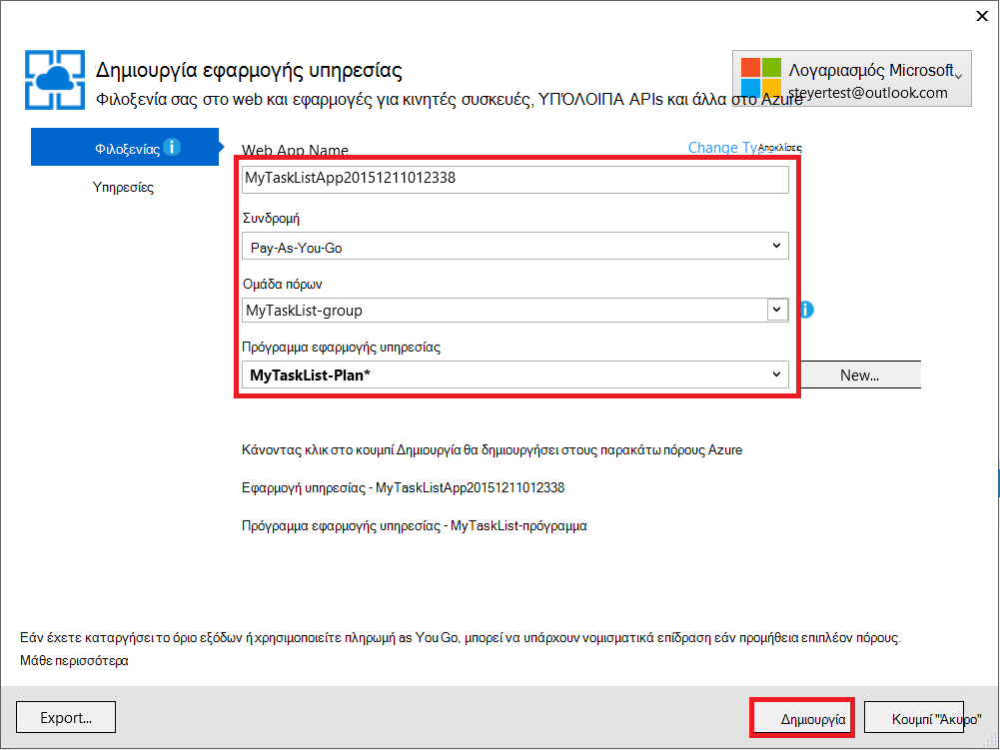
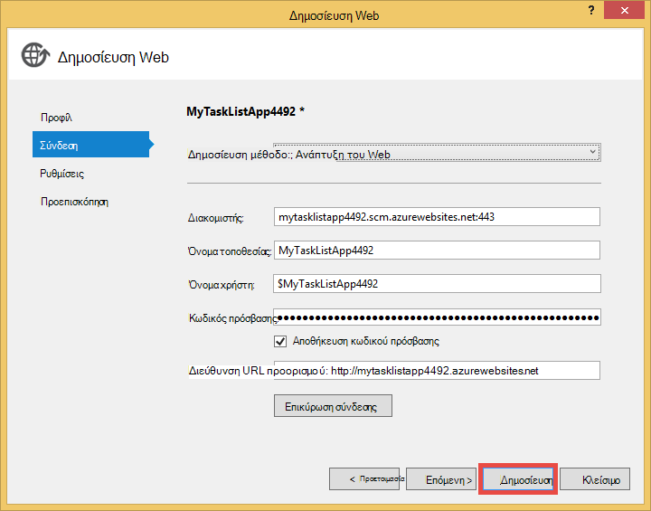

<properties 
    pageTitle="Δημιουργία εφαρμογής web στο Azure που συνδέεται με MongoDB εκτελείται σε μια εικονική μηχανή" 
    description="Ένα πρόγραμμα εκμάθησης που σας μαθαίνει πώς μπορείτε να χρησιμοποιήσετε Git για να αναπτύξετε μια εφαρμογή ASP.NET Azure εφαρμογής υπηρεσίας, συνδεδεμένοι MongoDB σε μια Azure εικονική μηχανή."
    tags="azure-portal" 
    services="app-service\web, virtual-machines" 
    documentationCenter=".net" 
    authors="cephalin" 
    manager="wpickett" 
    editor=""/>

<tags 
    ms.service="app-service-web" 
    ms.workload="web" 
    ms.tgt_pltfrm="na" 
    ms.devlang="dotnet" 
    ms.topic="article" 
    ms.date="02/29/2016" 
    ms.author="cephalin"/>

# Δημιουργία εφαρμογής web στο Azure που συνδέεται με MongoDB εκτελείται σε μια εικονική μηχανή

Χρήση Git, μπορείτε να αναπτύξετε μια εφαρμογή του ASP.NET για Azure εφαρμογής υπηρεσίας Web Apps. Σε αυτό το πρόγραμμα εκμάθησης, θα δημιουργήσετε μια απλή προσκηνίου MVC ASP.NET εφαρμογή λίστα εργασιών που συνδέεται με μια βάση δεδομένων MongoDB εκτελείται σε μια εικονική μηχανή στο Azure.  [MongoDB] [ MongoDB] είναι μια δημοφιλή Άνοιγμα αρχείου προέλευσης, βάσης δεδομένων NoSQL υψηλών επιδόσεων. Μετά την εκτέλεση και της δοκιμής της εφαρμογής ASP.NET στον υπολογιστή σας ανάπτυξης, θα μπορείτε να αποστείλετε την εφαρμογή υπηρεσίας Web εφαρμογών χρησιμοποιώντας Git.

>[AZURE.NOTE] Εάν θέλετε να γρήγορα αποτελέσματα με το Azure εφαρμογής υπηρεσίας πριν από την εγγραφή για λογαριασμό Azure, μεταβείτε στο [Δοκιμάστε εφαρμογής υπηρεσίας](http://go.microsoft.com/fwlink/?LinkId=523751), όπου μπορείτε να αμέσως δημιουργήσετε μια εφαρμογή web μικρής διάρκειας starter στην εφαρμογή υπηρεσίας. Δεν υπάρχει πιστωτικές κάρτες υποχρεωτικό, χωρίς δεσμεύσεις.

## Γνωσιακή φόντου ##

Για αυτό το πρόγραμμα εκμάθησης, παρόλο που δεν απαιτείται είναι χρήσιμη γνώσεων από τα εξής:

* Το C# πρόγραμμα οδήγησης για MongoDB. Για περισσότερες πληροφορίες σχετικά με την ανάπτυξη εφαρμογών C# έναντι MongoDB, ανατρέξτε στο MongoDB [Κέντρο γλώσσας CSharp][MongoC#LangCenter]. 
* Το ASP .NET framework εφαρμογής web. Μπορείτε να μάθετε όλες οι πληροφορίες για το στην τοποθεσία του [τοποθεσία Web ASP.net][ASP.NET].
* Το πλαίσιο εφαρμογή web ASP .NET MVC. Μπορείτε να μάθετε όλες οι πληροφορίες για το στην τοποθεσία του [τοποθεσία Web ASP.NET MVC][MVCWebSite].
* Azure. Μπορείτε να ξεκινήσετε να χρησιμοποιείτε ανάγνωσης στο [Azure][WindowsAzure].

## Προαπαιτούμενα στοιχεία ##

- [Visual Studio Express 2013 για Web]  [ VSEWeb] ή [Visual Studio 2013] [VSUlt]
- [Azure SDK για .NET](http://go.microsoft.com/fwlink/p/?linkid=323510&clcid=0x409)
- Μια ενεργή συνδρομή στο Microsoft Azure

[AZURE.INCLUDE [create-account-and-websites-note](../../includes/create-account-and-websites-note.md)]

 
## Δημιουργήστε μια εικονική μηχανή και εγκατάσταση MongoDB ##

Αυτό το πρόγραμμα εκμάθησης προϋποθέτει ότι έχετε δημιουργήσει μια εικονική μηχανή στο Azure. Αφού δημιουργήσετε την εικονική μηχανή πρέπει να εγκαταστήσετε MongoDB στον υπολογιστή εικονικές:

* Για να δημιουργήσετε μια εικονική μηχανή Windows και να εγκαταστήσετε το MongoDB, ανατρέξτε στο θέμα [Εγκατάσταση MongoDB σε εικονικές υπολογιστή με Windows Server στο Azure][InstallMongoOnWindowsVM].

Αφού δημιουργηθεί η εικονική μηχανή στο Azure και εγκαταστήσει MongoDB, φροντίστε να θυμάται το όνομα DNS του υπολογιστή εικονικές ("testlinuxvm.cloudapp.net", για παράδειγμα) και της θύρας εξωτερικού για MongoDB που καθορίσατε στο το τελικό σημείο.  Χρειάζεστε αυτές τις πληροφορίες αργότερα στην εκμάθηση.

## Δημιουργία της εφαρμογής ##

Σε αυτήν την ενότητα θα δημιουργήσετε μια εφαρμογή του ASP.NET που ονομάζεται "Λίστα εργασιών μου" με χρήση του Visual Studio και εκτελέστε μια αρχική ανάπτυξη Azure εφαρμογής υπηρεσίας Web εφαρμογές. Θα εκτελείτε την εφαρμογή τοπικά, αλλά θα συνδεθείτε με το εικονικό μηχάνημα σε Azure και να χρησιμοποιήσετε την παρουσία MongoDB που δημιουργήσατε εκεί.

1. Στο Visual Studio, κάντε κλικ στην επιλογή **Νέο έργο**.

    ![Έναρξη νέου έργου σελίδας][StartPageNewProject]

1. Στο παράθυρο **Νέου έργου** , στο αριστερό παράθυρο, επιλέξτε **Visual C#**και, στη συνέχεια, επιλέξτε **Web**. Στο μεσαίο παράθυρο, επιλέξτε **Την εφαρμογή Web ASP.NET**. Στο κάτω μέρος, ονομάστε το έργο σας "MyTaskListApp" και, στη συνέχεια, κάντε κλικ στο κουμπί **OK**.

    ![Παράθυρο διαλόγου νέου έργου][NewProjectMyTaskListApp]

1. Στο παράθυρο διαλόγου **Νέο έργο ASP.NET** , επιλέξτε **MVC**και, στη συνέχεια, κάντε κλικ στο κουμπί **OK**.

    ![Επιλέξτε το πρότυπο MVC][VS2013SelectMVCTemplate]

1. Εάν δεν έχετε ήδη εισέλθει στο Microsoft Azure, θα σας ζητηθεί να εισέλθετε. Ακολουθήστε τις οδηγίες για να συνδεθείτε στο Azure.
2. Αφού εισέλθετε, μπορείτε να ξεκινήσετε τη ρύθμιση των παραμέτρων την εφαρμογή web της εφαρμογής υπηρεσίας. Καθορίστε το **όνομα του Web App**, **σχέδιο παροχής υπηρεσιών εφαρμογής**, **ομάδα πόρων**και **περιοχής**και, στη συνέχεια, κάντε κλικ στην επιλογή **Δημιουργία**.

    

1. Αφού το έργο ολοκληρώνει τη δημιουργία, περιμένετε για την εφαρμογή web να δημιουργηθούν σε Azure εφαρμογής υπηρεσίας που αναφέρεται στο παράθυρο του **Azure εφαρμογής υπηρεσίας δραστηριότητας** . Στη συνέχεια, κάντε κλικ στην επιλογή **Δημοσίευση MyTaskListApp τώρα αυτής της εφαρμογής Web**.

1. Κάντε κλικ στο κουμπί **Δημοσίευση**.

    

    Μετά την προεπιλεγμένη εφαρμογή ASP.NET δημοσιεύεται Azure εφαρμογής υπηρεσίας Web Apps, θα γίνει εκκίνηση στο πρόγραμμα περιήγησης.

## Εγκαταστήστε το πρόγραμμα οδήγησης MongoDB C#

MongoDB προσφέρει υποστήριξη πλευρά του προγράμματος-πελάτη για εφαρμογές C# μέσω ενός προγράμματος οδήγησης, το οποίο πρέπει να εγκαταστήσετε στον υπολογιστή σας τοπικής ανάπτυξης. Το πρόγραμμα οδήγησης C# διατίθεται μέσω NuGet.

Για να εγκαταστήσετε το πρόγραμμα οδήγησης MongoDB C#:

1. Στην **Εξερεύνηση λύσεων**, κάντε δεξί κλικ στο έργο **MyTaskListApp** και επιλέξτε **Διαχείριση NuGetPackages**.

    ![Διαχείριση πακέτων NuGet][VS2013ManageNuGetPackages]

2. Στο παράθυρο **Διαχείριση πακέτων NuGet** , στο αριστερό παράθυρο, κάντε κλικ στην επιλογή **Online**. Στο πλαίσιο **Αναζήτησης Online** στη δεξιά πλευρά, πληκτρολογήστε "mongodb.driver".  Κάντε κλικ στην επιλογή **εγκατάσταση** για να εγκαταστήσετε το πρόγραμμα οδήγησης.

    ![Αναζήτηση για MongoDB C# πρόγραμμα οδήγησης][SearchforMongoDBCSharpDriver]

3. Κάντε κλικ στην επιλογή **να αποδοχή** για να αποδεχτείτε την 10gen, τους όρους άδειας χρήσης Inc..

4. Κάντε κλικ στο κουμπί **Κλείσιμο** μετά την εγκατάσταση του προγράμματος οδήγησης.
    ![Εγκατεστημένο MongoDB C# πρόγραμμα οδήγησης][MongoDBCsharpDriverInstalled]

Τώρα είναι εγκατεστημένο το πρόγραμμα οδήγησης MongoDB C#.  Αναφορές για τις βιβλιοθήκες **MongoDB.Bson**, **MongoDB.Driver**και **MongoDB.Driver.Core** έχουν προστεθεί στο έργο.

![Αναφορές MongoDB C# πρόγραμμα οδήγησης][MongoDBCSharpDriverReferences]

## Προσθήκη ενός μοντέλου ##
Στην **Εξερεύνηση λύσεων**, κάντε δεξί κλικ στο φάκελο *μοντέλα* και **Προσθήκη** μιας νέας **κλάσης** και ονομάστε το *TaskModel.cs*.  Στο *TaskModel.cs*, αντικαταστήστε τον υπάρχοντα κωδικό με τον ακόλουθο κώδικα:

    using System;
    using System.Collections.Generic;
    using System.Linq;
    using System.Web;
    using MongoDB.Bson.Serialization.Attributes;
    using MongoDB.Bson.Serialization.IdGenerators;
    using MongoDB.Bson;
    
    namespace MyTaskListApp.Models
    {
        public class MyTask
        {
            [BsonId(IdGenerator = typeof(CombGuidGenerator))]
            public Guid Id { get; set; }
    
            [BsonElement("Name")]
            public string Name { get; set; }
    
            [BsonElement("Category")]
            public string Category { get; set; }
    
            [BsonElement("Date")]
            public DateTime Date { get; set; }
    
            [BsonElement("CreatedDate")]
            public DateTime CreatedDate { get; set; }
    
        }
    }

## Προσθέστε το επίπεδο πρόσβασης δεδομένων ##
Στην **Εξερεύνηση λύσεων**, κάντε δεξί κλικ *MyTaskListApp* έργου και **Προσθήκη** ένα **Νέο φάκελο** που ονομάζεται *DAL*.  Κάντε δεξί κλικ στο φάκελο *DAL* και **Προσθήκη** μιας νέας **κλάσης**. Ονομάστε το αρχείο κλάσης *Dal.cs*.  Στο *Dal.cs*, αντικαταστήστε τον υπάρχοντα κωδικό με τον ακόλουθο κώδικα:

    using System;
    using System.Collections.Generic;
    using System.Linq;
    using System.Web;
    using MyTaskListApp.Models;
    using MongoDB.Driver;
    using MongoDB.Bson;
    using System.Configuration;
    
    
    namespace MyTaskListApp
    {
        public class Dal : IDisposable
        {
            private MongoServer mongoServer = null;
            private bool disposed = false;
    
            // To do: update the connection string with the DNS name
            // or IP address of your server. 
            //For example, "mongodb://testlinux.cloudapp.net"
            private string connectionString = "mongodb://mongodbsrv20151211.cloudapp.net";
    
            // This sample uses a database named "Tasks" and a 
            //collection named "TasksList".  The database and collection 
            //will be automatically created if they don't already exist.
            private string dbName = "Tasks";
            private string collectionName = "TasksList";
    
            // Default constructor.        
            public Dal()
            {
            }
    
            // Gets all Task items from the MongoDB server.        
            public List<MyTask> GetAllTasks()
            {
                try
                {
                    var collection = GetTasksCollection();
                    return collection.Find(new BsonDocument()).ToList();
                }
                catch (MongoConnectionException)
                {
                    return new List<MyTask>();
                }
            }
    
            // Creates a Task and inserts it into the collection in MongoDB.
            public void CreateTask(MyTask task)
            {
                var collection = GetTasksCollectionForEdit();
                try
                {
                    collection.InsertOne(task);
                }
                catch (MongoCommandException ex)
                {
                    string msg = ex.Message;
                }
            }
    
            private IMongoCollection<MyTask> GetTasksCollection()
            {
                MongoClient client = new MongoClient(connectionString);
                var database = client.GetDatabase(dbName);
                var todoTaskCollection = database.GetCollection<MyTask>(collectionName);
                return todoTaskCollection;
            }
    
            private IMongoCollection<MyTask> GetTasksCollectionForEdit()
            {
                MongoClient client = new MongoClient(connectionString);
                var database = client.GetDatabase(dbName);
                var todoTaskCollection = database.GetCollection<MyTask>(collectionName);
                return todoTaskCollection;
            }
    
            # region IDisposable
    
            public void Dispose()
            {
                this.Dispose(true);
                GC.SuppressFinalize(this);
            }
    
            protected virtual void Dispose(bool disposing)
            {
                if (!this.disposed)
                {
                    if (disposing)
                    {
                        if (mongoServer != null)
                        {
                            this.mongoServer.Disconnect();
                        }
                    }
                }
    
                this.disposed = true;
            }
    
            # endregion
        }
    }

## Προσθέστε έναν ελεγκτή ##
Ανοίξτε το αρχείο *Controllers\HomeController.cs* στην **Εξερεύνηση λύσεων** και να αντικαταστήσετε τον υπάρχοντα κωδικό με τα εξής:

    using System;
    using System.Collections.Generic;
    using System.Linq;
    using System.Web;
    using System.Web.Mvc;
    using MyTaskListApp.Models;
    using System.Configuration;
    
    namespace MyTaskListApp.Controllers
    {
        public class HomeController : Controller, IDisposable
        {
            private Dal dal = new Dal();
            private bool disposed = false;
            //
            // GET: /MyTask/
    
            public ActionResult Index()
            {
                return View(dal.GetAllTasks());
            }
    
            //
            // GET: /MyTask/Create
    
            public ActionResult Create()
            {
                return View();
            }
    
            //
            // POST: /MyTask/Create
    
            [HttpPost]
            public ActionResult Create(MyTask task)
            {
                try
                {
                    dal.CreateTask(task);
                    return RedirectToAction("Index");
                }
                catch
                {
                    return View();
                }
            }
    
            public ActionResult About()
            {
                return View();
            }
    
            # region IDisposable
    
            new protected void Dispose()
            {
                this.Dispose(true);
                GC.SuppressFinalize(this);
            }
    
            new protected virtual void Dispose(bool disposing)
            {
                if (!this.disposed)
                {
                    if (disposing)
                    {
                        this.dal.Dispose();
                    }
                }
    
                this.disposed = true;
            }
    
            # endregion
    
        }
    }

## Ρυθμίστε τα στυλ ##
Για να αλλάξετε τον τίτλο στο επάνω μέρος της σελίδας, ανοίξτε το *Views\Shared\\_Layout.cshtml* αρχείου στην **Εξερεύνηση λύσεων** και αντικατάσταση "Όνομα εφαρμογής" στην κεφαλίδα στη γραμμή περιήγησης με "Μου εφαρμογή λίστας εργασιών", έτσι ώστε να μοιάζει κάπως έτσι:

    @Html.ActionLink("My Task List Application", "Index", "Home", null, new { @class = "navbar-brand" })

Για να ρυθμίσετε το μενού λίστας εργασιών, ανοίξτε το αρχείο *\Views\Home\Index.cshtml* και να αντικαταστήσετε τον υπάρχοντα κωδικό με τον ακόλουθο κώδικα:
    
    @model IEnumerable<MyTaskListApp.Models.MyTask>
    
    @{
        ViewBag.Title = "My Task List";
    }
    
    <h2>My Task List</h2>
    
    <table border="1">
        <tr>
            <th>Task</th>
            <th>Category</th>
            <th>Date</th>
            
        </tr>
    
    @foreach (var item in Model) {
        <tr>
            <td>
                @Html.DisplayFor(modelItem => item.Name)
            </td>
            <td>
                @Html.DisplayFor(modelItem => item.Category)
            </td>
            <td>
                @Html.DisplayFor(modelItem => item.Date)
            </td>
            
        </tr>
    }
    
    </table>
    
  @Html.Partial("Create", new MyTaskListApp.Models.MyTask())

Για να προσθέσετε τη δυνατότητα να δημιουργήσετε μια νέα εργασία, κάντε δεξί κλικ το *Views\Home\\ * φάκελο και **Προσθήκη** μιας **προβολής**.  Το όνομα της προβολής *Δημιουργία*. Αντικαταστήστε τον κώδικα με τα εξής:

    @model MyTaskListApp.Models.MyTask
    
    
    
    
    
    @using (Html.BeginForm("Create", "Home")) {
        @Html.ValidationSummary(true)
        <fieldset>
            <legend>New Task</legend>
    
            

                @Html.LabelFor(model => model.Name)
            

            

                @Html.EditorFor(model => model.Name)
                @Html.ValidationMessageFor(model => model.Name)
            

    
            

                @Html.LabelFor(model => model.Category)
            

            

                @Html.EditorFor(model => model.Category)
                @Html.ValidationMessageFor(model => model.Category)
            

    
            

                @Html.LabelFor(model => model.Date)
            

            

                @Html.EditorFor(model => model.Date)
                @Html.ValidationMessageFor(model => model.Date)
            

    
            

                <input type="submit" value="Create" />
            

        </fieldset>
    }

**Εξερεύνηση λύσεων** θα πρέπει να μοιάζει ως εξής:

![Εξερεύνηση λύσεων][SolutionExplorerMyTaskListApp]

## Ορίστε τη συμβολοσειρά σύνδεσης MongoDB ##
Στην **Εξερεύνηση λύσεων**, ανοίξτε το αρχείο *DAL/Dal.cs* . Βρείτε την ακόλουθη γραμμή κώδικα:

    private string connectionString = "mongodb://<vm-dns-name>";

Αντικατάσταση `<vm-dns-name>` με το όνομα DNS του υπολογιστή εικονικές εκτελείται MongoDB που δημιουργήσατε στο βήμα [δημιουργήσετε μια εικονική μηχανή και εγκατάσταση του MongoDB][] αυτού του προγράμματος εκμάθησης.  Για να βρείτε το όνομα DNS του υπολογιστή σας εικονικές, μεταβείτε στην πύλη του Azure, επιλέξτε **εικονικές μηχανές**και εύρεση **Του ονόματος του DNS**.

Εάν το όνομα DNS η εικονική μηχανή είναι "testlinuxvm.cloudapp.net" και MongoDB ακρόαση στη θύρα προεπιλεγμένη 27017, η γραμμή συμβολοσειρά σύνδεσης του κώδικα θα μοιάζει κάπως:

    private string connectionString = "mongodb://testlinuxvm.cloudapp.net";

Εάν το τελικό σημείο εικονική μηχανή καθορίζει μια διαφορετική εξωτερική θύρα MongoDB, μπορείτε να καθορίστε τη θύρα στη συμβολοσειρά σύνδεσης:

    private string connectionString = "mongodb://testlinuxvm.cloudapp.net:12345";

Για περισσότερες πληροφορίες σχετικά με MongoDB συμβολοσειρές σύνδεσης, ανατρέξτε στο θέμα [συνδέσεις][MongoConnectionStrings].

## Δοκιμή της τοπικής ανάπτυξης ##

Για να εκτελέσετε την εφαρμογή σας στον υπολογιστή σας ανάπτυξης, επιλέξτε **Έναρξη εντοπισμού** από το μενού **Εντοπισμός σφαλμάτων** ή πατήστε **F5**. Των υπηρεσιών IIS Express ξεκινά και ανοίγει ένα πρόγραμμα περιήγησης και ενεργοποιεί το αρχική σελίδα της εφαρμογής.  Μπορείτε να προσθέσετε μια νέα εργασία, το οποίο θα προστεθεί στη βάση δεδομένων του MongoDB που εκτελείται στον υπολογιστή σας εικονικές στο Azure.

![Η εφαρμογή λίστας εργασιών μου][TaskListAppBlank]

## Δημοσίευση σε εφαρμογές Web Azure εφαρμογής υπηρεσίας

Σε αυτήν την ενότητα θα μπορείτε να δημοσιεύσετε τις αλλαγές σας να Azure εφαρμογής υπηρεσίας Web Apps.

1. Στην Εξερεύνηση λύσεων, κάντε ξανά δεξί κλικ **MyTaskListApp** και κάντε κλικ στο κουμπί **Δημοσίευση**.
2. Κάντε κλικ στο κουμπί **Δημοσίευση**.

    Τώρα θα πρέπει να βλέπετε την εφαρμογή web της εκτελείται στο Azure εφαρμογής υπηρεσίας και πρόσβαση στη βάση δεδομένων MongoDB σε εικονικές μηχανές Windows Azure.

## Σύνοψη ##

Τώρα έχετε αναπτύξει με επιτυχία την εφαρμογή ASP.NET με το Azure εφαρμογής υπηρεσίας Web Apps. Για να δείτε την εφαρμογή web:

1. Συνδεθείτε στην πύλη του Azure.
2. Κάντε κλικ στην επιλογή **εφαρμογές Web**. 
3. Επιλέξτε την εφαρμογή web της στη λίστα **Εφαρμογών Web** .

Για περισσότερες πληροφορίες σχετικά με την ανάπτυξη εφαρμογών C# έναντι MongoDB, ανατρέξτε στο θέμα [Κέντρο γλώσσας CSharp][MongoC#LangCenter]. 

[AZURE.INCLUDE [app-service-web-whats-changed](../../includes/app-service-web-whats-changed.md)]
 

<!-- HYPERLINKS -->

[AzurePortal]: http://manage.windowsazure.com
[WindowsAzure]: http://www.windowsazure.com
[MongoC#LangCenter]: http://docs.mongodb.org/ecosystem/drivers/csharp/
[MVCWebSite]: http://www.asp.net/mvc
[ASP.NET]: http://www.asp.net/
[MongoConnectionStrings]: http://www.mongodb.org/display/DOCS/Connections
[MongoDB]: http://www.mongodb.org
[InstallMongoOnWindowsVM]: ../virtual-machines/virtual-machines-windows-classic-install-mongodb.md
[VSEWeb]: http://www.microsoft.com/visualstudio/eng/2013-downloads#d-2013-express
[VSUlt]: http://www.microsoft.com/visualstudio/eng/2013-downloads

<!-- IMAGES -->

[StartPageNewProject]: ./media/web-sites-dotnet-store-data-mongodb-vm/NewProject.png
[NewProjectMyTaskListApp]: ./media/web-sites-dotnet-store-data-mongodb-vm/NewProjectMyTaskListApp.png
[VS2013SelectMVCTemplate]: ./media/web-sites-dotnet-store-data-mongodb-vm/VS2013SelectMVCTemplate.png
[VS2013DefaultMVCApplication]: ./media/web-sites-dotnet-store-data-mongodb-vm/VS2013DefaultMVCApplication.png
[VS2013ManageNuGetPackages]: ./media/web-sites-dotnet-store-data-mongodb-vm/VS2013ManageNuGetPackages.png
[SearchforMongoDBCSharpDriver]: ./media/web-sites-dotnet-store-data-mongodb-vm/SearchforMongoDBCSharpDriver.png
[MongoDBCsharpDriverInstalled]: ./media/web-sites-dotnet-store-data-mongodb-vm/MongoDBCsharpDriverInstalled.png
[MongoDBCSharpDriverReferences]: ./media/web-sites-dotnet-store-data-mongodb-vm/MongoDBCSharpDriverReferences.png
[SolutionExplorerMyTaskListApp]: ./media/web-sites-dotnet-store-data-mongodb-vm/SolutionExplorerMyTaskListApp.png
[TaskListAppBlank]: ./media/web-sites-dotnet-store-data-mongodb-vm/TaskListAppBlank.png
[WAWSCreateWebSite]: ./media/web-sites-dotnet-store-data-mongodb-vm/WAWSCreateWebSite.png
[WAWSDashboardMyTaskListApp]: ./media/web-sites-dotnet-store-data-mongodb-vm/WAWSDashboardMyTaskListApp.png
[Image9]: ./media/web-sites-dotnet-store-data-mongodb-vm/RepoReady.png
[Image10]: ./media/web-sites-dotnet-store-data-mongodb-vm/GitInstructions.png
[Image11]: ./media/web-sites-dotnet-store-data-mongodb-vm/GitDeploymentComplete.png

<!-- TOC BOOKMARKS -->
[Δημιουργήστε μια εικονική μηχανή και εγκατάσταση MongoDB]: #virtualmachine
[Create and run the My Task List ASP.NET application on your development computer]: #createapp
[Create an Azure web site]: #createwebsite
[Deploy the ASP.NET application to the web site using Git]: #deployapp
 