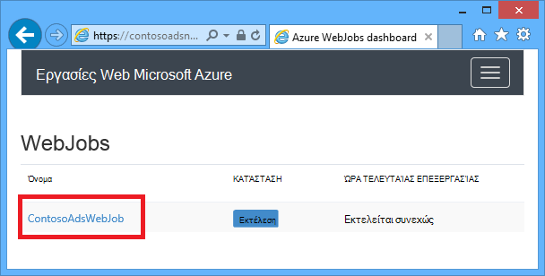
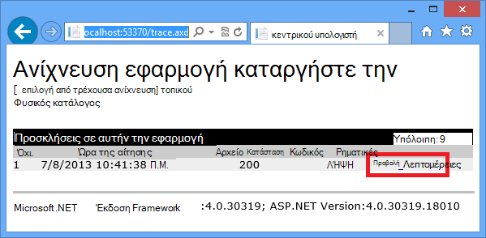
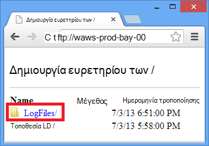
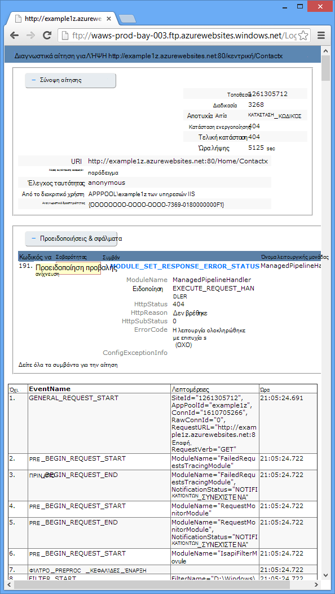

<properties 
    pageTitle="Αντιμετώπιση προβλημάτων σε μια εφαρμογή web στην υπηρεσία εφαρμογής Azure χρήση του Visual Studio" 
    description="Μάθετε πώς μπορείτε να αντιμετωπίσετε εφαρμογής Azure web με χρήση απομακρυσμένου εντοπισμού σφαλμάτων, ανίχνευσης και εργαλεία καταγραφής που είναι ενσωματωμένος στο Visual Studio 2013." 
    services="app-service" 
    documentationCenter=".net" 
    authors="tdykstra" 
    manager="wpickett" 
    editor=""/>

<tags 
    ms.service="app-service" 
    ms.workload="na" 
    ms.tgt_pltfrm="na" 
    ms.devlang="dotnet" 
    ms.topic="article" 
    ms.date="08/29/2016" 
    ms.author="rachelap"/>

# Αντιμετώπιση προβλημάτων σε μια εφαρμογή web στην υπηρεσία εφαρμογής Azure χρήση του Visual Studio

## Επισκόπηση

Αυτό το πρόγραμμα εκμάθησης δείχνει πώς μπορείτε να χρησιμοποιήσετε εργαλεία του Visual Studio που εντοπισμό σφαλμάτων σε μια εφαρμογή web στην [Εφαρμογή υπηρεσίας](http://go.microsoft.com/fwlink/?LinkId=529714), εκτελώντας σε [λειτουργία εντοπισμού σφαλμάτων](http://www.visualstudio.com/get-started/debug-your-app-vs.aspx) από απόσταση ή με την προβολή αρχεία καταγραφής εφαρμογών και αρχεία καταγραφής του διακομιστή web.

[AZURE.INCLUDE [app-service-web-to-api-and-mobile](../../includes/app-service-web-to-api-and-mobile.md)]

Θα μάθετε:

* Ποιες λειτουργίες διαχείρισης Azure web app είναι διαθέσιμες στο Visual Studio.
* Πώς να χρησιμοποιήσετε την προβολή απομακρυσμένης Visual Studio για να κάνετε γρήγορη αλλαγές σε μια εφαρμογή web απομακρυσμένης.
* Πώς μπορείτε να εκτελέσετε λειτουργία εντοπισμού σφαλμάτων απομακρυσμένα κατά ένα έργο εκτελείται στο Azure, τόσο για μια εφαρμογή web και για μια WebJob.
* Πώς μπορείτε να δημιουργήσετε αρχεία καταγραφής ανίχνευσης εφαρμογής και να τα προβάλετε ενώ η εφαρμογή είναι η δημιουργία τους.
* Πώς μπορείτε να προβάλετε αρχεία καταγραφής διακομιστή web, όπως οι λεπτομέρειες μηνύματα σφάλματος και απέτυχε η αίτηση ανίχνευση.
* Μάθετε πώς μπορείτε να στείλετε αρχεία καταγραφής διαγνωστικών για χώρο αποθήκευσης Azure λογαριασμού και να τα προβάλετε εκεί.

Εάν έχετε το Visual Studio Ultimate, μπορείτε επίσης να χρησιμοποιήσετε [IntelliTrace](http://msdn.microsoft.com/library/vstudio/dd264915.aspx) για τον εντοπισμό σφαλμάτων. IntelliTrace δεν καλύπτεται σε αυτό το πρόγραμμα εκμάθησης.

## Προαπαιτούμενα στοιχεία

Αυτό το πρόγραμμα εκμάθησης λειτουργεί με το περιβάλλον ανάπτυξης, το web project και το Azure web app που έχετε ορίσει στο [Γρήγορα αποτελέσματα με το Azure και ASP.NET][GetStarted]. Για τις ενότητες WebJobs, θα χρειαστείτε την εφαρμογή που δημιουργείτε στο [Γρήγορα αποτελέσματα με το Azure SDK WebJobs][GetStartedWJ].

Τα δείγματα κώδικα που εμφανίζονται σε αυτό το πρόγραμμα εκμάθησης είναι για μια εφαρμογή web C# MVC, αλλά οι διαδικασίες αντιμετώπισης προβλημάτων είναι η ίδια για τις εφαρμογές του Visual Basic και φόρμες Web.

Το πρόγραμμα εκμάθησης προϋποθέτει ότι χρησιμοποιείτε το Visual Studio 2015 ή 2013. Εάν χρησιμοποιείτε το Visual Studio 2013, οι δυνατότητες WebJobs απαιτούν [Ενημέρωση 4](http://go.microsoft.com/fwlink/?LinkID=510314) ή νεότερη έκδοση. 

Τα αρχεία καταγραφής ροής η δυνατότητα λειτουργεί μόνο για τις εφαρμογές που στοχεύουν .NET Framework 4 ή νεότερη έκδοση.

## Διαχείριση και ρύθμιση παραμέτρων της εφαρμογής Web

Visual Studio παρέχει πρόσβαση σε ένα υποσύνολο των συναρτήσεων διαχείρισης εφαρμογών web και ρυθμίσεις παραμέτρων που είναι διαθέσιμες στην [Πύλη του Azure](http://go.microsoft.com/fwlink/?LinkId=529715). Σε αυτήν την ενότητα θα δείτε τι είναι διαθέσιμο, χρησιμοποιώντας την **Εξερεύνηση διακομιστή**. Για να δείτε τις πιο πρόσφατες δυνατότητες Azure ενοποίησης, δοκιμάστε **Cloud Explorer** επίσης. Μπορείτε να ανοίξετε και τα δύο παράθυρα από το μενού " **Προβολή** ". 

1. Εάν δεν έχετε ήδη εισέλθει για να Azure στο Visual Studio, κάντε κλικ στο κουμπί **σύνδεση με το Azure** στην **Εξερεύνηση Server**.

    Μια εναλλακτική λύση είναι να εγκαταστήσετε ένα πιστοποιητικό διαχείρισης που επιτρέπει την πρόσβαση στο λογαριασμό σας. Εάν επιλέξετε να εγκαταστήσετε ένα πιστοποιητικό, κάντε δεξί κλικ στον κόμβο **Azure** στην **Εξερεύνηση Server**και, στη συνέχεια, κάντε κλικ στην επιλογή **Διαχείριση και συνδρομές του φίλτρου** από το μενού περιβάλλοντος. Στο παράθυρο διαλόγου **Διαχείριση Azure συνδρομές** , κάντε κλικ στην καρτέλα **πιστοποιητικά** και, στη συνέχεια, κάντε κλικ στην επιλογή **Εισαγωγή**. Ακολουθήστε τις οδηγίες για να κάνετε λήψη και, στη συνέχεια, εισαγάγετε ένα αρχείο συνδρομή (ονομάζεται επίσης ένα αρχείο *.publishsettings* ) για το λογαριασμό σας Azure.

    > [AZURE.NOTE]
    > Εάν κάνετε λήψη ενός αρχείου εγγραφής, αποθηκεύστε το σε ένα φάκελο εκτός του κατάλογοι κώδικα προέλευσης (για παράδειγμα, στο φάκελο Downloads) και, στη συνέχεια, διαγράψτε το μόλις ολοκληρωθεί η εισαγωγή. Κακόβουλο χρήστη που αποκτά πρόσβαση στο αρχείο συνδρομή να επεξεργασία, δημιουργία και διαγραφή των υπηρεσιών Azure σας.

    Για περισσότερες πληροφορίες σχετικά με τη σύνδεση σε Azure πόρους από το Visual Studio, ανατρέξτε στο θέμα [Διαχείριση λογαριασμών, συνδρομές και ρόλοι διαχείρισης](http://go.microsoft.com/fwlink/?LinkId=324796#BKMK_AccountVCert).

2. Στην **Εξερεύνηση Server**, αναπτύξτε **Azure** και ανάπτυξη της **Εφαρμογής υπηρεσίας**.

3. Αναπτύξτε την ομάδα πόρων που περιλαμβάνει την εφαρμογή web που δημιουργήσατε [γρήγορα]αποτελέσματα με το Azure και ASP.NET[GetStarted], και, στη συνέχεια, κάντε δεξί κλικ στον κόμβο εφαρμογής web και κάντε κλικ στην επιλογή **Ρυθμίσεις προβολής**.

    

    Εμφανίζεται η καρτέλα **Azure Web App** και μπορείτε να δείτε εκεί το web app διαχείρισης και ρύθμισης παραμέτρων εργασίες που είναι διαθέσιμες στο Visual Studio.

    

    Σε αυτό το πρόγραμμα εκμάθησης θα χρησιμοποιείτε την καταγραφή και ανίχνευση αναπτυσσόμενες λίστες. Επίσης, θα χρησιμοποιήσετε απομακρυσμένου εντοπισμού σφαλμάτων, αλλά θα μπορείτε να χρησιμοποιήσετε μια διαφορετική μέθοδο για να την ενεργοποιήσετε.
   
    Για πληροφορίες σχετικά με τα πλαίσια των ρυθμίσεων της εφαρμογής και συμβολοσειρές σύνδεσης σε αυτό το παράθυρο, ανατρέξτε στο θέμα [Azure εφαρμογές Web: πώς συμβολοσειρές εφαρμογής και σύνδεση συμβολοσειρές εργασίας](http://blogs.msdn.com/b/windowsazure/archive/2013/07/17/windows-azure-web-sites-how-application-strings-and-connection-strings-work.aspx).

    Εάν θέλετε να εκτελέσετε μια εργασία διαχείρισης για την εφαρμογή web που δεν είναι δυνατό να ολοκληρωθεί σε αυτό το παράθυρο, κάντε κλικ στην επιλογή **Άνοιγμα στην πύλη διαχείρισης** για να ανοίξετε ένα παράθυρο προγράμματος περιήγησης στην πύλη του Azure.

## Πρόσβαση σε αρχεία εφαρμογής web στην Εξερεύνηση Server

Συνήθως αναπτύξετε ένα έργο web με το `customErrors` σημαία στο αρχείο Web.config οριστεί `On` ή `RemoteOnly`, δηλαδή δεν λαμβάνετε ένα μήνυμα σφάλματος χρήσιμο όταν κάτι πάει καλά. Για πολλά σφάλματα μόνο λάβετε είναι μια σελίδα, όπως ένα από τα εξής από αυτές.

**Σφάλμα διακομιστή στην εφαρμογή '/':**

**Παρουσιάστηκε σφάλμα:**

**Στην τοποθεσία Web δεν είναι δυνατή η εμφάνιση της σελίδας**

Συχνά ο ευκολότερος τρόπος για να βρείτε την αιτία του σφάλματος είναι για να ενεργοποιήσετε την μηνύματα σφάλματος λεπτομερείς, τα οποία το πρώτο από την προηγούμενη στιγμιότυπα οθόνης εξηγεί πώς μπορείτε να κάνετε. Που απαιτεί μια αλλαγή στο αρχείο Web.config ανεπτυγμένος. Θα μπορούσε να επεξεργαστείτε το αρχείο *Web.config* του έργου και να αναπτύξτε ξανά το έργο, ή να δημιουργήσετε μια [Μετασχηματισμός Web.config](http://www.asp.net/mvc/tutorials/deployment/visual-studio-web-deployment/web-config-transformations) και να αναπτύξετε μια Δόμηση εντοπισμού σφαλμάτων, αλλά υπάρχει μια πιο γρήγορος τρόπος: στην **Εξερεύνηση λύσεων** μπορείτε να προβάλετε απευθείας και να επεξεργαστείτε αρχεία στην εφαρμογή web απομακρυσμένης χρησιμοποιώντας τη δυνατότητα *απομακρυσμένης προβολής* .

1. Στην **Εξερεύνηση Server**, αναπτύξτε **Azure**, ανάπτυξη **Εφαρμογής υπηρεσίας**, αναπτύξτε την ομάδα πόρων που βρίσκεται στην εφαρμογή web της και, στη συνέχεια, αναπτύξτε τον κόμβο για την εφαρμογή web.

    Μπορείτε να δείτε τους κόμβους που παρέχουν πρόσβαση σε αρχεία περιεχομένου και αρχεία καταγραφής του web app.

2. Αναπτύξτε τον κόμβο **αρχεία** και κάντε διπλό κλικ στο αρχείο *Web.config* .

    

    Visual Studio ανοίγει το αρχείο Web.config από την εφαρμογή web απομακρυσμένης και εμφανίζει [Remote] δίπλα στο όνομα αρχείου στη γραμμή τίτλου.

3. Προσθέστε την ακόλουθη γραμμή για να το `system.web` στοιχείο:

    `<customErrors mode="Off"></customErrors>`

    

4. Ανανεώστε το πρόγραμμα περιήγησης που εμφανίζει το μήνυμα σφάλματος μη βοηθητικής και τώρα λαμβάνετε ένα μήνυμα σφάλματος λεπτομερείς, όπως το παρακάτω παράδειγμα:

    

    (Το σφάλμα εμφανίζεται δημιουργήθηκε με την προσθήκη στη γραμμή που εμφανίζεται σε κόκκινο χρώμα *Views\Home\Index.cshtml*.)

Επεξεργασία του αρχείου Web.config είναι μόνο ένα παράδειγμα σενάρια στην οποία τη δυνατότητα να διαβάσετε και να επεξεργαστείτε αρχεία σε εφαρμογή Azure web της κάνει ευκολότερη την αντιμετώπιση προβλημάτων.

## Απομακρυσμένη εντοπισμού σφαλμάτων εφαρμογών web

Εάν το μήνυμα σφάλματος λεπτομερείς δεν παρέχει επαρκείς πληροφορίες και δεν μπορείτε να δημιουργήσετε ξανά το σφάλμα τοπικά, είναι ένας άλλος τρόπος για την αντιμετώπιση προβλημάτων για την εκτέλεση σε κατάσταση εντοπισμού σφαλμάτων από απόσταση. Μπορείτε να ορίσετε σημεία διακοπής χειριστείτε μνήμης απευθείας, βήμα μέσω κώδικα και ή αλλάξτε τη διαδρομή κώδικα. 

Ο απομακρυσμένος εντοπισμός σφαλμάτων δεν λειτουργεί σε Express εκδόσεις του Visual Studio.

Αυτή η ενότητα δείχνει τον τρόπο εντοπισμού σφαλμάτων από μακριά χρησιμοποιώντας το έργο που δημιουργείτε [γρήγορα]αποτελέσματα με το Azure και ASP.NET[GetStarted].

1. Ανοίξτε το έργο web που δημιουργήσατε [γρήγορα]αποτελέσματα με το Azure και ASP.NET[GetStarted].

1. Άνοιγμα *Controllers\HomeController.cs*.

2. Διαγραφή του `About()` μέθοδο και εισαγάγετε τον ακόλουθο κώδικα στη θέση.

        public ActionResult About()
        {
            string currentTime = DateTime.Now.ToLongTimeString();
            ViewBag.Message = "The current time is " + currentTime;
            return View();
        }

2. [Ορίστε ένα σημείο διακοπής](http://www.visualstudio.com/get-started/debug-your-app-vs.aspx) σε το `ViewBag.Message` γραμμής.

1. Στην **Εξερεύνηση λύσεων**, κάντε δεξί κλικ στο έργο και κάντε κλικ στο κουμπί **Δημοσίευση**.

2. Στην αναπτυσσόμενη λίστα **προφίλ** , επιλέξτε το ίδιο προφίλ που χρησιμοποιήσατε [γρήγορα]αποτελέσματα με το Azure και ASP.NET[GetStarted].

3. Κάντε κλικ στην καρτέλα **Ρυθμίσεις** , και αλλαγή **ρύθμισης παραμέτρων** για τον **εντοπισμό σφαλμάτων**και, στη συνέχεια, κάντε κλικ στο κουμπί **Δημοσίευση**.

    

4. Μετά την ανάπτυξη ολοκληρωθεί και το πρόγραμμα περιήγησης ανοίγει στη διεύθυνση URL Azure της εφαρμογής web, κλείστε το πρόγραμμα περιήγησης.

5. Στην **Εξερεύνηση Server**, κάντε δεξί κλικ σε εφαρμογή web της και, στη συνέχεια, κάντε κλικ στην επιλογή **Επισύναψη εντοπισμού σφαλμάτων**. 

    

    Το πρόγραμμα περιήγησης ανοίγει αυτόματα στην αρχική σελίδα σας εκτελείται στο Azure. Ίσως χρειαστεί να περιμένετε 20 δευτερόλεπτα ή για να Azure ρυθμίζει το διακομιστή για τον εντοπισμό σφαλμάτων. Αυτή η καθυστέρηση συμβαίνει μόνο την πρώτη φορά που εκτελείται σε λειτουργία εντοπισμού σφαλμάτων σε μια εφαρμογή web. Οι επόμενες φορές μέσα την επόμενη 48 ώρες κατά την εκκίνηση εντοπισμού ξανά εκεί δεν θα έχετε μια καθυστέρηση.

    **Σημείωση:** Εάν έχετε τυχόν προβλήματα κατά την εκκίνηση του προγράμματος εντοπισμού σφαλμάτων, δοκιμάστε να το κάνετε χρησιμοποιώντας την **Εξερεύνηση Cloud** αντί για **Εξερεύνηση Server**.

6. Κάντε κλικ στην επιλογή **σχετικά με το** στο μενού.

    Visual Studio σταματά σε το σημείο διακοπής και τον κωδικό εκτελείται στο Azure, δεν στον τοπικό σας υπολογιστή.

7. Τοποθετήστε το δείκτη επάνω από το `currentTime` μεταβλητή για να δείτε την τιμή ώρας.

    

    Ο χρόνος που βλέπετε είναι η ώρα Azure διακομιστή, που μπορεί να είναι σε διαφορετική ζώνη ώρας από τον τοπικό σας υπολογιστή.

8. Πληκτρολογήστε μια νέα τιμή για το `currentTime` μεταβλητές, όπως "Τώρα εκτελείται στο Azure".

5. Πατήστε το πλήκτρο F5 να συνεχίσει να εκτελείται.

    Σελίδα πληροφορίες εκτελείται στο Azure εμφανίζει τη νέα τιμή που εισαγάγατε σε τη μεταβλητή currentTime.

    

## Απομακρυσμένη WebJobs εντοπισμού σφαλμάτων

Αυτή η ενότητα δείχνει τον τρόπο εντοπισμού σφαλμάτων απομακρυσμένα χρησιμοποιώντας την εφαρμογή web και project μπορείτε να δημιουργήσετε [γρήγορα](websites-dotnet-webjobs-sdk.md)αποτελέσματα με το SDK WebJobs Azure. 

Οι δυνατότητες που εμφανίζονται σε αυτήν την ενότητα είναι διαθέσιμη μόνο στο Visual Studio 2013 με ενημερωμένη έκδοση 4 ή νεότερη έκδοση. 

Ο απομακρυσμένος εντοπισμός σφαλμάτων λειτουργεί μόνο με συνεχή WebJobs. Προγραμματισμένη και σε ζήτηση WebJobs δεν υποστηρίζουν τον εντοπισμό σφαλμάτων.

1. Ανοίξτε το έργο web που δημιουργήσατε στο [Γρήγορα αποτελέσματα με το Azure SDK WebJobs][GetStartedWJ].

1. Στο έργο ContosoAdsWebJob, ανοίξτε *Functions.cs*.

2. [Ορίστε ένα σημείο διακοπής](http://www.visualstudio.com/get-started/debug-your-app-vs.aspx) σε η πρώτη πρόταση στο το `GnerateThumbnail` μέθοδο.

    

1. Στην **Εξερεύνηση λύσεων**, κάντε δεξί κλικ στο έργο web (μην το έργο WebJob) και κάντε κλικ στο κουμπί **Δημοσίευση**.

2. Στην αναπτυσσόμενη λίστα **προφίλ** , επιλέξτε το ίδιο προφίλ που χρησιμοποιήσατε σε [Γρήγορα αποτελέσματα με το SDK WebJobs Azure](websites-dotnet-webjobs-sdk.md).

3. Κάντε κλικ στην καρτέλα **Ρυθμίσεις** , και αλλαγή **ρύθμισης παραμέτρων** για τον **εντοπισμό σφαλμάτων**και, στη συνέχεια, κάντε κλικ στο κουμπί **Δημοσίευση**.

    Ανάπτυξη Visual Studio στο web και WebJob έργα και ανοίγει το πρόγραμμα περιήγησης στη διεύθυνση URL Azure της εφαρμογής web.

5. Στην **Εξερεύνηση Server** ανάπτυξη **Azure > εφαρμογής υπηρεσίας > σας ομάδα πόρων > εφαρμογή web της > WebJobs > συνεχούς**, και, στη συνέχεια, κάντε δεξί κλικ **ContosoAdsWebJob**.

7. Κάντε κλικ στην επιλογή **Επισύναψη εντοπισμού σφαλμάτων**. 

    

    Το πρόγραμμα περιήγησης ανοίγει αυτόματα στην αρχική σελίδα σας εκτελείται στο Azure. Ίσως χρειαστεί να περιμένετε 20 δευτερόλεπτα ή για να Azure ρυθμίζει το διακομιστή για τον εντοπισμό σφαλμάτων. Αυτή η καθυστέρηση συμβαίνει μόνο την πρώτη φορά που εκτελείται σε λειτουργία εντοπισμού σφαλμάτων σε μια εφαρμογή web. Την επόμενη φορά που μπορείτε να επισυνάψετε το πρόγραμμα εντοπισμού σφαλμάτων εκεί δεν θα μια καθυστέρηση, εάν το κάνετε εντός 48 ωρών.

6. Στο πρόγραμμα περιήγησης web που ανοίγει στην αρχική σελίδα του Contoso διαφημίσεις, δημιουργήστε μια νέα ad. 

    Τη δημιουργία ενός ad έχει ως αποτέλεσμα ένα μήνυμα ουρά να δημιουργηθεί, το οποίο θα να εντοπιστεί από την WebJob και να υποβάλλονται σε επεξεργασία. Όταν το SDK WebJobs καλεί τη συνάρτηση για να επεξεργαστείτε το μήνυμα ουρά, ο κώδικας θα πατήσετε το σημείο διακοπής.

7. Όταν το πρόγραμμα εντοπισμού σφαλμάτων αλλαγές σε το σημείο διακοπής, μπορείτε να εξετάσετε και να αλλάξετε τις τιμές μεταβλητών κατά την εκτέλεση του προγράμματος στο cloud. Στην παρακάτω εικόνα το πρόγραμμα εντοπισμού σφαλμάτων εμφανίζει τα περιεχόμενα του αντικειμένου blobInfo που μεταβιβάστηκε στη μέθοδο GenerateThumbnail.

    
 
5. Πατήστε το πλήκτρο F5 να συνεχίσει να εκτελείται.

    Η μέθοδος GenerateThumbnail ολοκληρώσει τη δημιουργία τη μικρογραφία.

6. Στο πρόγραμμα περιήγησης, ανανεώστε τη σελίδα ευρετηρίου και μπορείτε να δείτε τη μικρογραφία.

6. Στο Visual Studio, πατήστε το πλήκτρο SHIFT + F5 για να διακόψετε τον εντοπισμό σφαλμάτων.

7. Στην **Εξερεύνηση Server**, κάντε δεξί κλικ στον κόμβο ContosoAdsWebJob και κάντε κλικ στην επιλογή **Προβολή πίνακα εργαλείων**.

8. Πραγματοποιήστε είσοδο με τα διαπιστευτήρια Azure σας και, στη συνέχεια, κάντε κλικ στο όνομα WebJob για να μεταβείτε στη σελίδα για τον WebJob. 

    

    Στον πίνακα εργαλείων που εμφανίζει τη συνάρτηση GenerateThumbnail εκτελεστεί πρόσφατα.

    (Την επόμενη φορά που κάνετε κλικ στην επιλογή **Προβολή πίνακα εργαλείων**, δεν χρειάζεται να εισέλθετε και το πρόγραμμα περιήγησης μεταβαίνει απευθείας στη σελίδα για την WebJob.)

9. Επιλέξτε το όνομα συνάρτησης για να δείτε λεπτομέρειες σχετικά με την εκτέλεση της συνάρτησης.

    

Εάν σας συνάρτηση [συντάξατε αρχεία καταγραφής](websites-dotnet-webjobs-sdk-storage-queues-how-to.md#logs), που θα μπορούσε να κάντε κλικ στην επιλογή **ToggleOutput** για να δείτε τους.

## Σημειώσεις σχετικά με το απομακρυσμένο εντοπισμό σφαλμάτων

* Δεν συνιστάται η εκτέλεση σε κατάσταση εντοπισμού σφαλμάτων στο παραγωγής. Εάν η εφαρμογή web της παραγωγής δεν κλιμακωθεί ανάληψη σε πολλές παρουσίες server, τον εντοπισμό σφαλμάτων θα αποτρέψει την απάντηση σε άλλες αιτήσεις στο διακομιστή web. Εάν έχετε πολλές παρουσίες διακομιστή web, κατά τη σύνδεση για το πρόγραμμα εντοπισμού σφαλμάτων θα λάβετε μια τυχαία παρουσία και έχετε δεν υπάρχει τρόπος για να εξασφαλίσετε ότι οι επόμενες περιήγησης αιτήσεις θα μεταβείτε σε αυτήν την παρουσία. Επίσης, συνήθως δεν αναπτύξετε μια Δόμηση εντοπισμού σφαλμάτων παραγωγή και προγράμματος μεταγλώττισης βελτιστοποιήσεις για την έκδοση εκδόσεις μπορεί να αδύνατη για να εμφανίσετε τι συμβαίνει γραμμή προς γραμμή στον κώδικα προέλευσης. Για την αντιμετώπιση προβλημάτων παραγωγής, την καλύτερη πόρος είναι εφαρμογής web και ανίχνευση αρχεία καταγραφής του διακομιστή.

* Αποφύγετε μεγάλη σταματά σε σημεία διακοπής όταν απομακρυσμένου εντοπισμού σφαλμάτων. Azure χειρίζεται μια διεργασία που έχει διακοπεί για περισσότερο από μερικά λεπτά ως διεργασία δεν ανταποκρίνεται, και το πρόγραμμα του.

* Ενώ κάνετε εντοπισμό σφαλμάτων, ο διακομιστής στέλνει δεδομένα στο Visual Studio, το οποίο μπορεί να επηρεάσει τις χρεώσεις εύρους ζώνης. Για πληροφορίες σχετικά με τις χρεώσεις εύρους ζώνης, ανατρέξτε στο θέμα [Azure τις πληροφορίες τιμολόγησης](/pricing/calculator/).

* Βεβαιωθείτε ότι το `debug` χαρακτηριστικό το `compilation` στοιχείο στο αρχείο *Web.config* έχει οριστεί στην τιμή true. Έχει οριστεί true από προεπιλογή, όταν δημοσιεύετε μια ρύθμιση παραμέτρων Δόμηση εντοπισμού σφαλμάτων.

        <system.web>
          <compilation debug="true" targetFramework="4.5" />
          <httpRuntime targetFramework="4.5" />
        </system.web>

* Εάν διαπιστώσετε ότι το πρόγραμμα εντοπισμού σφαλμάτων δεν θα Βηματική εκτέλεση κώδικα που θέλετε να εντοπίσετε σφάλματα, ίσως χρειαστεί να αλλάξετε τη ρύθμιση μόνο μου κώδικα.  Για περισσότερες πληροφορίες, ανατρέξτε στο θέμα [Περιορισμός βηματισμός απλώς μου κωδικό](http://msdn.microsoft.com/library/vstudio/y740d9d3.aspx#BKMK_Restrict_stepping_to_Just_My_Code).

* Χρονόμετρο ξεκινά στο διακομιστή κατά την ενεργοποίηση της απομακρυσμένης δυνατότητας εντοπισμού σφαλμάτων και μετά από 48 ώρες της δυνατότητας απενεργοποιείται αυτόματα. Αυτό το όριο 48 ωρών γίνεται για λόγους ασφαλείας και επιδόσεων. Μπορείτε εύκολα να ενεργοποιήσετε τη δυνατότητα επιστρέψτε στην όσες φορές θέλετε. Συνιστάμε να κλείσετε το απενεργοποιημένο όταν δεν ενεργά εντοπισμού.

* Με μη αυτόματο τρόπο, μπορείτε να επισυνάψετε το πρόγραμμα εντοπισμού σφαλμάτων σε οποιαδήποτε διεργασία, όχι μόνο διεργασία του web app (w3wp.exe). Για περισσότερες πληροφορίες σχετικά με το πώς μπορείτε να χρησιμοποιήσετε τη λειτουργία εντοπισμού σφαλμάτων στο Visual Studio, ανατρέξτε στο θέμα [Εντοπισμός σφαλμάτων στο Visual Studio](http://msdn.microsoft.com/library/vstudio/sc65sadd.aspx).

## Επισκόπηση αρχείων καταγραφής διαγνωστικών

Μια εφαρμογή του ASP.NET που εκτελείται σε μια εφαρμογή Azure web να δημιουργήσετε τα παρακάτω είδη των αρχείων καταγραφής:

* **Αρχεία καταγραφής ανίχνευσης εφαρμογής** 
  Η εφαρμογή δημιουργεί αυτά τα αρχεία καταγραφής καλώντας μεθόδους της κλάσης [System.Diagnostics.Trace](http://msdn.microsoft.com/library/system.diagnostics.trace.aspx) .
* **Αρχεία καταγραφής του διακομιστή Web** 
  Ο διακομιστής web δημιουργεί μια καταχώρηση αρχείου καταγραφής για κάθε αίτηση HTTP στην εφαρμογή web.
* **Αρχεία καταγραφής μήνυμα λεπτομερείς σφαλμάτων** 
  Ο διακομιστής web δημιουργεί μια σελίδα HTML με ορισμένες πρόσθετες πληροφορίες για το αποτυχημένων αιτήσεων HTTP (αυτά που έχει ως αποτέλεσμα κωδικός κατάστασης 400 ή μεγαλύτερο). 
* **Απέτυχε η αίτηση αρχείων καταγραφής ανίχνευσης** 
  Ο διακομιστής web δημιουργεί ένα αρχείο XML με ανίχνευση λεπτομερείς πληροφορίες για αποτυχημένων αιτήσεων HTTP. Ο διακομιστής web παρέχει επίσης ένα αρχείο XSL για να μορφοποιήσετε το XML σε ένα πρόγραμμα περιήγησης.
  
Καταγραφή επηρεάζει επιδόσεις εφαρμογής web, ώστε να Azure σάς δίνει τη δυνατότητα να ενεργοποιήσετε ή να απενεργοποιήσετε κάθε τύπο του αρχείου καταγραφής, όπως απαιτείται. Για τα αρχεία καταγραφής εφαρμογών, μπορείτε να καθορίσετε ότι πρέπει να γράφονται μόνο τα αρχεία καταγραφής από ένα συγκεκριμένο επίπεδο της σοβαρότητας. Όταν δημιουργείτε μια νέα εφαρμογή web, από προεπιλογή όλες καταγραφή είναι απενεργοποιημένη.

Τα αρχεία καταγραφής είναι γραμμένες σε αρχεία σε ένα φάκελο *LogFiles* στο σύστημα αρχείων της εφαρμογής web και είναι προσβάσιμα μέσω FTP. Αρχεία καταγραφής διακομιστή Web και τα αρχεία καταγραφής εφαρμογών επίσης μπορούν να εγγραφούν σε ένα λογαριασμό αποθήκευσης Azure. Μπορείτε να διατηρήσετε ένα μεγαλύτερο όγκο αρχείων καταγραφής σε ένα λογαριασμό του χώρου αποθήκευσης από αυτούς του ορίσματος είναι δυνατή στο σύστημα αρχείων. Είστε υποχρεωμένοι να το μέγιστο 100 megabyte των αρχείων καταγραφής όταν χρησιμοποιείτε το σύστημα αρχείων. (Αρχεία καταγραφής του συστήματος αρχείων είναι μόνο για μικρής διάρκειας διατήρησης. Azure διαγράφει παλιά αρχεία καταγραφής για να κάνετε χώρο για νέα μετά το όριο.)  

## Δημιουργία και προβολή αρχείων καταγραφής ανίχνευσης εφαρμογής

Σε αυτήν την ενότητα θα κάνετε τις ακόλουθες εργασίες:

* Προσθήκη δηλώσεις ανίχνευση στο έργο web που δημιουργήσατε στο [Γρήγορα αποτελέσματα με το Azure και ASP.NET][GetStarted].
* Προβολή των αρχείων καταγραφής, όταν εκτελείτε το έργο τοπικά.
* Προβάλετε τα αρχεία καταγραφής που δημιουργούνται από την εφαρμογή που εκτελείται στο Azure. 

Για πληροφορίες σχετικά με τη δημιουργία εφαρμογής συνδέεται WebJobs, ανατρέξτε στο θέμα [πώς μπορείτε να εργαστείτε με το χώρο αποθήκευσης Azure ουρά χρησιμοποιώντας το SDK WebJobs - πώς να συντάξετε αρχεία καταγραφής](websites-dotnet-webjobs-sdk-storage-queues-how-to.md#logs). Οι παρακάτω οδηγίες για την προβολή αρχείων καταγραφής και έλεγχος πώς είναι αποθηκευμένα στο Azure ισχύουν επίσης για αρχεία καταγραφής εφαρμογών που δημιουργήθηκε από WebJobs. 

### Προσθήκη δηλώσεις ανίχνευση στην εφαρμογή

1. Άνοιγμα *Controllers\HomeController.cs*, και να αντικαταστήσετε το `Index`, `About`, και `Contact` μεθόδους με τον ακόλουθο κώδικα για να προσθέσετε `Trace` προτάσεις και μια `using` δήλωση για `System.Diagnostics`:

        public ActionResult Index()
        {
            Trace.WriteLine("Entering Index method");
            ViewBag.Message = "Modify this template to jump-start your ASP.NET MVC application.";
            Trace.TraceInformation("Displaying the Index page at " + DateTime.Now.ToLongTimeString());
            Trace.WriteLine("Leaving Index method");
            return View();
        }
        
        public ActionResult About()
        {
            Trace.WriteLine("Entering About method");
            ViewBag.Message = "Your app description page.";
            Trace.TraceWarning("Transient error on the About page at " + DateTime.Now.ToShortTimeString());
            Trace.WriteLine("Leaving About method");
            return View();
        }
        
        public ActionResult Contact()
        {
            Trace.WriteLine("Entering Contact method");
            ViewBag.Message = "Your contact page.";
            Trace.TraceError("Fatal error on the Contact page at " + DateTime.Now.ToLongTimeString());
            Trace.WriteLine("Leaving Contact method");
            return View();
        }       

2. Προσθήκη μιας `using System.Diagnostics;` δήλωση στο επάνω μέρος του αρχείου.
                
### Προβάλετε την έξοδο ανίχνευση τοπικά

3. Πατήστε το πλήκτρο F5 για να εκτελέσετε την εφαρμογή σε κατάσταση εντοπισμού σφαλμάτων.

    Προεπιλεγμένη λειτουργίας ακρόασης ανίχνευσης εγγράφει όλα τα δεδομένα εξόδου ανίχνευσης στο παράθυρο **εξόδου** , μαζί με άλλες εξόδου εντοπισμού σφαλμάτων. Η παρακάτω εικόνα εμφανίζει το αποτέλεσμα από τις προτάσεις ανίχνευση που έχετε προσθέσει στο το `Index` μέθοδο.

    

    Τα ακόλουθα βήματα δείχνουν πώς μπορείτε να προβάλετε ανίχνευση εξόδου σε μια ιστοσελίδα, χωρίς τη μεταγλώττιση σε κατάσταση εντοπισμού σφαλμάτων.

2. Ανοίξτε το αρχείο Web.config εφαρμογής (αυτό που βρίσκεται στο φάκελο του project) και προσθέστε μια `<system.diagnostics>` στοιχείο στο τέλος του αρχείου ακριβώς πριν από το κλείσιμο `</configuration>` στοιχείο:

        <system.diagnostics>
            <trace>
              <listeners>
                <add name="WebPageTraceListener"
                    type="System.Web.WebPageTraceListener, 
                    System.Web, 
                    Version=4.0.0.0, 
                    Culture=neutral,
                    PublicKeyToken=b03f5f7f11d50a3a" />
              </listeners>
            </trace>
          </system.diagnostics>

    Το `WebPageTraceListener` σας επιτρέπει να προβάλλετε ανίχνευση εξόδου κάνοντας αναζήτηση για `/trace.axd`.

3. Προσθέστε ένα <a href="http://msdn.microsoft.com/library/vstudio/6915t83k(v=vs.100).aspx">στοιχείο ανίχνευσης</a> στην περιοχή `<system.web>` στο αρχείο Web.config, όπως το παρακάτω παράδειγμα:

        <trace enabled="true" writeToDiagnosticsTrace="true" mostRecent="true" pageOutput="false" />

3. Πατήστε το συνδυασμό πλήκτρων CTRL + F5 για να εκτελέσετε την εφαρμογή.

4. Στη γραμμή διευθύνσεων του παραθύρου του προγράμματος περιήγησης, προσθέστε *trace.axd* στη διεύθυνση URL και, στη συνέχεια, πατήστε το πλήκτρο Enter (η διεύθυνση URL θα είναι παρόμοια με http://localhost:53370/trace.axd).

5. Στη σελίδα **Ανίχνευση εφαρμογής** , κάντε κλικ στην επιλογή **Προβολή λεπτομερειών** στην πρώτη γραμμή (όχι τη γραμμή BrowserLink).

    

    Εμφανίζεται η σελίδα **Λεπτομερειών αίτηση** και, στην ενότητα **Πληροφορίες ανίχνευσης** μπορείτε να δείτε το αποτέλεσμα από τις προτάσεις ανίχνευση που έχετε προσθέσει στο το `Index` μέθοδο.

    

    Από προεπιλογή, `trace.axd` είναι διαθέσιμη μόνο τοπικά. Εάν θέλετε να την κάνετε διαθέσιμη από ένα απομακρυσμένο web app, μπορείτε να προσθέσετε `localOnly="false"` για να το `trace` στοιχείο στο αρχείο *Web.config* , όπως φαίνεται στο ακόλουθο παράδειγμα:

        <trace enabled="true" writeToDiagnosticsTrace="true" localOnly="false" mostRecent="true" pageOutput="false" />

    Ωστόσο, ενεργοποίηση `trace.axd` σε μια γραμμή παραγωγής εφαρμογής web γενικά δεν συνιστάται για λόγους ασφαλείας και στις ακόλουθες ενότητες, θα δείτε μια πιο εύκολο τρόπο ανάγνωσης αρχείων καταγραφής ανίχνευσης σε μια εφαρμογή Azure web.

### Προβάλετε την έξοδο ανίχνευση στο Azure

1. Στην **Εξερεύνηση λύσεων**, κάντε δεξί κλικ στο έργο web και κάντε κλικ στο κουμπί **Δημοσίευση**.

2. Στο παράθυρο διαλόγου **Δημοσίευση Web** , κάντε κλικ στο κουμπί **Δημοσίευση**.

    Μετά τη Visual Studio δημοσιεύει ενημέρωση σας, ανοίγει ένα παράθυρο προγράμματος περιήγησης στην αρχική σελίδα σας (αν υποθέσουμε ότι δεν μπορείτε να απαλείψετε **Διεύθυνση URL προορισμού** στην καρτέλα **σύνδεση** ).

3. Στην **Εξερεύνηση Server**, κάντε δεξί κλικ σε εφαρμογή web της και επιλέξτε **Προβολή αρχείων καταγραφής ροής**. 

    

    Στο παράθυρο **εξόδου** εμφανίζει που συνδέονται με την υπηρεσία καταγραφής ροής και προσθέτει μια γραμμή ειδοποίησης κάθε λεπτό που εκτείνεται χωρίς ένα αρχείο καταγραφής για να εμφανίσετε.

    

4. Στο παράθυρο του προγράμματος περιήγησης που εμφανίζει την αρχική σελίδα της εφαρμογής, κάντε κλικ στην επιλογή " **επαφή**".

    Μέσα σε λίγα δευτερόλεπτα την έξοδο από το επίπεδο σφάλματος ανίχνευση που προσθέσατε για να το `Contact` μέθοδο εμφανίζεται στο παράθυρο **εξόδου** .

    

    Visual Studio μόνο εμφανίζει σφάλμα επιπέδου ανιχνεύσεις επειδή αυτή είναι η προεπιλεγμένη ρύθμιση όταν ενεργοποιείτε το αρχείο καταγραφής παρακολούθηση της υπηρεσίας. Όταν δημιουργείτε μια νέα εφαρμογή Azure web, η καταγραφή όλων είναι απενεργοποιημένη από προεπιλογή, όπως περιγράφηκε όταν ανοίγει η σελίδα "Ρυθμίσεις" παλαιότερη έκδοση:

    

    Ωστόσο, όταν έχετε επιλέξει **Προβολή αρχείων καταγραφής ροής**, η Visual Studio αλλάζει αυτόματα **Logging(File System) εφαρμογή** **σφάλματος**, γεγονός που σημαίνει ότι αναφέρονται αρχείων καταγραφής σφαλμάτων επιπέδου. Για να δείτε όλα τα αρχεία καταγραφής ανίχνευσης, μπορείτε να αλλάξετε αυτήν τη ρύθμιση για να **λεπτομερές**. Όταν επιλέγετε ένα επίπεδο σοβαρότητας κάτω από το σφάλμα, όλα τα αρχεία καταγραφής για υψηλότερα επίπεδα σοβαρότητας επίσης αναφέρονται. Επομένως, όταν επιλέγετε λεπτομερές, βλέπετε επίσης πληροφορίες, προειδοποίηση και αρχείων καταγραφής σφαλμάτων.  

4. Στην **Εξερεύνηση Server**, κάντε δεξί κλικ στην εφαρμογή web και, στη συνέχεια, κάντε κλικ στην επιλογή **Ρυθμίσεις προβολής** , όπως κάνατε προηγουμένως.

5. Αλλάξτε την **Εφαρμογή καταγραφής (σύστημα αρχείων)** σε **λεπτομερές**και, στη συνέχεια, κάντε κλικ στην επιλογή **Αποθήκευση**.
 
    

6. Στο παράθυρο του προγράμματος περιήγησης που τώρα που εμφανίζει τη σελίδα **επαφής** σας, κάντε κλικ στην επιλογή **για οικιακή χρήση**, στη συνέχεια, κάντε κλικ στην επιλογή **σχετικά με**και, στη συνέχεια, κάντε κλικ στην επιλογή **επαφή**.

    Μέσα σε μερικά δευτερόλεπτα, στο παράθυρο **εξόδου** εμφανίζει ολόκληρο το αποτέλεσμα της ανίχνευσης.

    

    Σε αυτήν την ενότητα ενεργοποιημένη και απενεργοποιημένη καταγραφής χρησιμοποιώντας ρυθμίσεις Azure web app. Μπορείτε επίσης να ενεργοποιήσετε και να απενεργοποιήσετε την ανίχνευση ακροατών, τροποποιώντας το αρχείο Web.config. Ωστόσο, τροποποιώντας το αρχείο Web.config έχει ως αποτέλεσμα τον τομέα εφαρμογής για να Κάδος Ανακύκλωσης, ενώ η ενεργοποίηση της καταγραφής μέσω τη ρύθμιση παραμέτρων της εφαρμογής web δεν κάνετε αυτό. Εάν το πρόβλημα διαρκεί μεγάλο χρονικό διάστημα για την αναπαραγωγή, ή είναι περιοδικά, ανακύκλωσης του τομέα εφαρμογής μπορεί να "Αυτόματη Διόρθωση" και να επιβάλετε μπορείτε να περιμένετε μέχρι να συμβαίνει αυτό ξανά. Ενεργοποίηση Διαγνωστικά στο Azure δεν κάνετε αυτό, ώστε να μπορείτε να ξεκινήσετε αμέσως καταγραφή πληροφοριών σφάλματος.

### Δυνατότητες παράθυρο εξόδου

Στην καρτέλα **Αρχεία καταγραφής Azure** στο παράθυρο **εξόδου** περιλαμβάνει πολλά κουμπιά και ένα πλαίσιο κειμένου:

Αυτά τα εκτελούν τις ακόλουθες λειτουργίες:

* Καταργήστε την επιλογή στο παράθυρο **εξόδου** .
* Ενεργοποίηση ή απενεργοποίηση αναδίπλωση κειμένου.
* Έναρξη ή διακοπή παρακολούθησης αρχεία καταγραφής.
* Καθορίστε την οποία συνδέεται για την παρακολούθηση.
* Κάντε λήψη των αρχείων καταγραφής.
* Φιλτράρισμα με βάση μια συμβολοσειρά αναζήτησης ή μια κανονική έκφραση αρχεία καταγραφής.
* Κλείστε το παράθυρο **εξόδου** .

Εάν εισαγάγετε μια συμβολοσειρά αναζήτησης ή κανονική παράσταση, Visual Studio φίλτρα καταγραφή πληροφοριών στον υπολογιστή-πελάτη. Αυτό σημαίνει ότι μπορείτε να εισαγάγετε τα κριτήρια μετά τα αρχεία καταγραφής εμφανίζονται στο παράθυρο **εξόδου** και μπορείτε να αλλάξετε τα κριτήρια φιλτραρίσματος χωρίς να χρειάζεται να δημιουργήσετε ξανά τα αρχεία καταγραφής.

## Προβολή αρχείων καταγραφής διακομιστή web

Αρχεία καταγραφής του διακομιστή Web εγγραφή όλων των δραστηριοτήτων HTTP για την εφαρμογή web. Για να τα δείτε στο παράθυρο **εξόδου** , πρέπει να ενεργοποιήσετε για την εφαρμογή web και να υποδείξετε στο Visual Studio, που θέλετε να παρακολουθείτε τους. 

1. Στην καρτέλα **Ρύθμισης παραμέτρων εφαρμογής Web Azure** που ανοίξατε από την **Εξερεύνηση διακομιστών**, αλλαγή καταγραφής διακομιστή Web **σε**και, στη συνέχεια, κάντε κλικ στην επιλογή **Αποθήκευση**.

    

2. Στο παράθυρο **εξόδου** , κάντε κλικ στο κουμπί **Καθορισμός που συνδέεται Azure για την παρακολούθηση** .
    
    

3. Στο παράθυρο διαλόγου **Επιλογές καταγραφής Azure** , επιλέξτε **αρχεία καταγραφής του διακομιστή Web**και, στη συνέχεια, κάντε κλικ στο κουμπί **OK**.

    

4. Στο παράθυρο του προγράμματος περιήγησης που εμφανίζει την εφαρμογή web, κάντε κλικ στην επιλογή **για οικιακή χρήση**, στη συνέχεια, κάντε κλικ στην επιλογή **σχετικά με**και, στη συνέχεια, κάντε κλικ στην επιλογή **επαφή**.

    Τα αρχεία καταγραφής εφαρμογής γενικά εμφανίζονται πρώτο, ακολουθούμενο από τα αρχεία καταγραφής του διακομιστή web. Ίσως χρειαστεί να περιμένετε λίγο για τα αρχεία καταγραφής για να εμφανίζονται. 

    

Από προεπιλογή, όταν ενεργοποιείτε πρώτα τα αρχεία καταγραφής του διακομιστή web με χρήση του Visual Studio, Azure συντάσσει τα αρχεία καταγραφής στο σύστημα αρχείων. Ως εναλλακτική λύση, μπορείτε να χρησιμοποιήσετε την πύλη του Azure για να καθορίσετε αυτόν το διακομιστή web πρέπει να γράφονται αρχεία καταγραφής σε ένα κοντέινερ αντικειμένων blob σε ένα λογαριασμό του χώρου αποθήκευσης.

Εάν χρησιμοποιείτε την πύλη για να ενεργοποιήσετε την καταγραφή με ένα λογαριασμό Azure αποθήκευσης διακομιστή web και, στη συνέχεια, απενεργοποιήστε την καταγραφή στο Visual Studio, όταν ενεργοποιείτε ξανά την καταγραφή στο Visual Studio ρυθμίσεων λογαριασμού χώρου αποθήκευσης επαναφέρονται. 

## Προβολή αρχείων καταγραφής μήνυμα λεπτομερείς σφαλμάτων

Αρχεία καταγραφής σφαλμάτων λεπτομερείς παρέχουν ορισμένες πρόσθετες πληροφορίες σχετικά με τις αιτήσεις HTTP που έχει ως αποτέλεσμα κωδικοί απόκρισης σφάλματος (400 ή παραπάνω). Για να δείτε τους στο παράθυρο **εξόδου** , πρέπει να τους επιτρέπουν για την εφαρμογή web και να υποδείξετε στο Visual Studio, που θέλετε να παρακολουθείτε τους.

1. Στην καρτέλα **Ρύθμισης παραμέτρων εφαρμογής Web Azure** που ανοίξατε από την **Εξερεύνηση διακομιστών**, αλλαγή **Λεπτομερή μηνύματα σφάλματος** σε **σε**και, στη συνέχεια, κάντε κλικ στην επιλογή **Αποθήκευση**.

    

2. Στο παράθυρο **εξόδου** , κάντε κλικ στο κουμπί **Καθορισμός που συνδέεται Azure για την παρακολούθηση** .

3. Στο παράθυρο διαλόγου **Επιλογές καταγραφής Azure** , κάντε κλικ στην επιλογή **όλα τα αρχεία καταγραφής**και, στη συνέχεια, κάντε κλικ στο κουμπί **OK**.

    

4. Στη γραμμή διευθύνσεων του παραθύρου του προγράμματος περιήγησης, προσθέστε έναν επιπλέον χαρακτήρα στη διεύθυνση URL για να προκαλέσουν σφάλμα 404 (για παράδειγμα, `http://localhost:53370/Home/Contactx`), και πατήστε το πλήκτρο Enter.

    Μετά από μερικά δευτερόλεπτα το αρχείο καταγραφής σφαλμάτων λεπτομερείς εμφανίζεται στο παράθυρο του Visual Studio **εξόδου** .

    

    Control + κλικ στη σύνδεση για να δείτε το αποτέλεσμα του αρχείου καταγραφής έχει μορφοποιηθεί με ένα πρόγραμμα περιήγησης:

    

## Λήψη αρχείων καταγραφής του συστήματος αρχείων

Οποιαδήποτε αρχεία καταγραφής που μπορείτε να παρακολουθείτε στο παράθυρο **εξόδου** μπορεί επίσης να ληφθεί ως αρχείο *.zip* . 

1. Στο παράθυρο **εξόδου** , κάντε κλικ στην επιλογή **Λήψη ροής αρχεία καταγραφής**.

    

    Εξερεύνηση αρχείων ανοίγει στο φάκελο *Λήψεις* με το επιλεγμένο αρχείο που έχετε λάβει.

    

2. Εξαγωγή του αρχείου *.zip* και δείτε την ακόλουθη δομή φακέλων:

    

    * Αρχεία καταγραφής ανίχνευσης εφαρμογής είναι σε *.txt* αρχεία στο φάκελο *LogFiles\Application* .
    * Αρχεία καταγραφής του διακομιστή Web βρίσκονται στα αρχεία *καταγραφής* στο φάκελο *LogFiles\http\RawLogs* . Μπορείτε να χρησιμοποιήσετε ένα εργαλείο όπως [Καταγραφής ανάλυσης](http://www.microsoft.com/download/details.aspx?displaylang=en&id=24659) για να προβάλετε και να χειρίζονται αυτά τα αρχεία.
    * Αρχεία καταγραφής μήνυμα σφάλματος λεπτομερείς είναι σε *.html* αρχεία στο φάκελο *LogFiles\DetailedErrors* .

    (Ο φάκελος *αναπτύξεις* είναι για αρχεία που έχουν δημιουργηθεί από το στοιχείο ελέγχου προέλευσης δημοσίευσης, δεν έχει όλα τα στοιχεία που σχετίζονται με Visual Studio δημοσίευσης. Ο φάκελος *Git* είναι για ανιχνεύσεις που σχετίζονται με το στοιχείο ελέγχου πηγαίου δημοσίευσης και το αρχείο καταγραφής αρχείο υπηρεσίας ροής.)  

## Προβολή αρχείων καταγραφής αποθήκευσης

Αρχεία καταγραφής ανίχνευσης εφαρμογής επίσης μπορούν να σταλούν στον λογαριασμό Azure χώρου αποθήκευσης και μπορείτε να τα προβάλετε στο Visual Studio. Για να γίνει ότι θα πρέπει να δημιουργήσετε ένα λογαριασμό του χώρου αποθήκευσης, ενεργοποίηση αποθήκευσης αρχείων καταγραφής στην κλασική πύλη και προβολή στην καρτέλα **αρχεία καταγραφής** του παραθύρου του **Azure Web App** .

Μπορείτε να στείλετε αρχεία καταγραφής σε κάποιο ή όλα από τρεις προορισμούς:

* Το σύστημα αρχείων.
* Πίνακες λογαριασμού χώρου αποθήκευσης.
* Χώρος αποθήκευσης αντικειμένων blob του λογαριασμού.

Μπορείτε να καθορίσετε ένα επίπεδο σοβαρότητας διαφορετικό για κάθε προορισμό. 

Πίνακες διευκολύνουν την προβολή λεπτομερειών των αρχείων καταγραφής online και υποστηρίζουν ροή; Μπορείτε να ερωτήματος αρχεία καταγραφής σε πίνακες και να δείτε νέα αρχεία καταγραφής, όπως αυτά που δημιουργούνται. Αντικείμενα BLOB να μπορείτε εύκολα να κάνετε λήψη αρχείων καταγραφής σε αρχεία και να αναλύσετε τα χρησιμοποιώντας HDInsight, επειδή HDInsight γνωρίζει πώς μπορείτε να εργαστείτε με το χώρο αποθήκευσης αντικειμένων blob. Για περισσότερες πληροφορίες, ανατρέξτε στο θέμα **Hadoop και MapReduce** στο [Επιλογές αποθήκευσης δεδομένων (δόμησης ρεαλιστικό Cloud εφαρμογές με το Azure)](http://www.asp.net/aspnet/overview/developing-apps-with-windows-azure/building-real-world-cloud-apps-with-windows-azure/data-storage-options).

Έχετε τη συγκεκριμένη στιγμή ρυθμίστε λεπτομερές επίπεδο, αρχεία καταγραφής του αρχείου συστήματος Ακολουθήστε τα παρακάτω βήματα θα σας καθοδηγήσουν τη ρύθμιση του επιπέδου αρχεία καταγραφής πληροφοριών για να μεταβείτε στο χώρο αποθήκευσης πινάκων λογαριασμού. Επίπεδο πληροφοριών σημαίνει ότι όλα τα αρχεία καταγραφής δημιουργούνται με την κλήση `Trace.TraceInformation`, `Trace.TraceWarning`, και `Trace.TraceError` θα εμφανίζονται, αλλά δεν τα αρχεία καταγραφής δημιουργούνται με την κλήση `Trace.WriteLine`.

Λογαριασμοί χώρου αποθήκευσης παρέχουν περισσότερο χώρο αποθήκευσης και περισσότερο διάρκειας διατήρησης για τα αρχεία καταγραφής σε σύγκριση με το σύστημα αρχείων. Ένα άλλο πλεονέκτημα της αποστολή αρχείων καταγραφής ανίχνευσης εφαρμογή με το χώρο αποθήκευσης είναι ότι λαμβάνετε ορισμένες πρόσθετες πληροφορίες με κάθε αρχείο καταγραφής που δεν μπορείτε να λάβετε από αρχεία καταγραφής του συστήματος αρχείων.

5. Κάντε δεξιό κλικ στο **χώρο αποθήκευσης** κάτω από τον κόμβο Azure και, στη συνέχεια, κάντε κλικ στην επιλογή **Δημιουργία λογαριασμού χώρου αποθήκευσης**.

3. Στο παράθυρο διαλόγου **Δημιουργία λογαριασμού χώρου αποθήκευσης** , πληκτρολογήστε ένα όνομα για το λογαριασμό χώρου αποθήκευσης. 

    Το όνομα πρέπει να πρέπει να είναι μοναδικό (άλλος λογαριασμός Azure αποθήκευσης μπορούν να έχουν το ίδιο όνομα). Εάν το όνομα που εισάγετε χρησιμοποιείται ήδη που θα έχετε την ευκαιρία να την αλλάξετε.

    Τη διεύθυνση URL για πρόσβαση στο λογαριασμό σας χώρου αποθήκευσης θα είναι *{name}*. core.windows.net. 

5. Ορίστε την **περιοχή ή ομάδα συσχέτισης** αναπτυσσόμενη λίστα στην περιοχή πλησιέστερη σε εσάς.

    Αυτή η ρύθμιση καθορίζει ποιες Azure κέντρο δεδομένων θα φιλοξενήσει το λογαριασμό χώρου αποθήκευσης. Για αυτό το πρόγραμμα εκμάθησης την επιλογή σας δεν θα κάνει μια σημαντική διαφορά, αλλά για μια εφαρμογή web παραγωγής θέλετε διακομιστή web και του λογαριασμού σας χώρο αποθήκευσης να είναι στην ίδια περιοχή για την Ελαχιστοποίηση λανθάνοντος χρόνου και δεδομένων εξόδου χρεώσεων. Η εφαρμογή web (το οποίο θα πρέπει να δημιουργήσετε αργότερα) θα πρέπει να εκτελούνται σε μια περιοχή όσο το δυνατό για τα προγράμματα περιήγησης πρόσβαση σε εφαρμογή web της προκειμένου να Ελαχιστοποίηση λανθάνοντος χρόνου.

6. Ορίστε την αναπτυσσόμενη λίστα **αναπαραγωγής** σε **τοπικά πλεονάζοντα**. 

    Όταν είναι ενεργοποιημένη η παν αναπαραγωγής για ένα λογαριασμό του χώρου αποθήκευσης, το αποθηκευμένο περιεχόμενο αναπαράγεται σε έναν δευτερεύοντα κέντρο δεδομένων για την ενεργοποίηση ανακατεύθυνσης σε αυτήν τη θέση σε περίπτωση μια κύρια καταστροφή στην κύρια θέση. Αναπαραγωγή παν μπορούν να περιλαμβάνουν πρόσθετο κόστος. Για τους λογαριασμούς δοκιμής και ανάπτυξη, γενικά δεν θέλετε να πληρώσετε για την αναπαραγωγή παν. Για περισσότερες πληροφορίες, ανατρέξτε στο θέμα [Δημιουργία, διαχείριση, ή διαγραφή ενός λογαριασμού χώρου αποθήκευσης](../storage-create-storage-account/#replication-options).

5. Κάντε κλικ στην επιλογή **Δημιουργία**. 

      

1. Στο παράθυρο του Visual Studio **Azure Web App** , κάντε κλικ στην καρτέλα **αρχεία καταγραφής** και, στη συνέχεια, κάντε κλικ στην επιλογή **Ρύθμιση παραμέτρων καταγραφής στην πύλη διαχείρισης**.

    <!-- todo:screenshot of new portal if the VS page link goes to new portal -->
    

    Έτσι ανοίγει στην καρτέλα **Ρύθμιση παραμέτρων** στην κλασική πύλη για την εφαρμογή web σας.

2. Στην καρτέλα **Ρύθμιση παραμέτρων** της πύλης κλασική, κάντε κύλιση προς τα κάτω στην ενότητα Διαγνωστικά εφαρμογής και, στη συνέχεια, να αλλάξετε την **Εφαρμογή καταγραφής (χώρος αποθήκευσης πινάκων)** σε **στην**.

3. Αλλάξτε το **επίπεδο καταγραφής συμβάντων** με **τις πληροφορίες**.

4. Κάντε κλικ στην επιλογή **Διαχείριση χώρου αποθήκευσης του πίνακα**.

    

    Στο παράθυρο διαλόγου **Διαχείριση χώρου αποθήκευσης πίνακα για τα Διαγνωστικά εφαρμογή** , μπορείτε να επιλέξετε το λογαριασμό χώρου αποθήκευσης, εάν έχετε περισσότερες από μία. Μπορείτε να δημιουργήσετε έναν νέο πίνακα ή να χρησιμοποιήσετε ένα υπάρχον.

    

6. Στο πλαίσιο **Διαχείριση χώρου αποθήκευσης πίνακα για τα Διαγνωστικά εφαρμογής** , κάντε κλικ στο σημάδι ελέγχου για να κλείσετε το πλαίσιο.

6. Στην καρτέλα **Ρύθμιση παραμέτρων** της πύλης κλασική, κάντε κλικ στην επιλογή **Αποθήκευση**.

7. Στο παράθυρο του προγράμματος περιήγησης που εμφανίζει την εφαρμογή web app, κάντε κλικ στην επιλογή **για οικιακή χρήση**, στη συνέχεια, κάντε κλικ στην επιλογή **σχετικά με το**και, στη συνέχεια, κάντε κλικ στην επιλογή **επαφή**.

    Τις πληροφορίες σύνδεσης που δημιουργήθηκαν με την περιήγηση σε αυτές τις ιστοσελίδες θα εγγραφεί με το λογαριασμό χώρου αποθήκευσης.

8. Στην καρτέλα **αρχεία καταγραφής** του παραθύρου **Azure Web App** στο Visual Studio, κάντε κλικ στην επιλογή **Ανανέωση** στην περιοχή **Διαγνωστικών σύνοψη**.

    

    Ενότητα **Διαγνωστικών σύνοψη** εμφανίζει αρχεία καταγραφής για το τελευταίο 15 λεπτά από προεπιλογή. Μπορείτε να αλλάξετε την περίοδο για να δείτε περισσότερα αρχεία καταγραφής. 

    (Εάν λάβετε ένα σφάλμα "Πίνακας δεν βρέθηκε", βεβαιωθείτε ότι έχετε αναζήτηση στις σελίδες που κάνετε την ανίχνευση αφού έχετε ενεργοποιήσει την **Εφαρμογή καταγραφής (αποθήκευση)** και αφού κάνατε κλικ στην επιλογή **Αποθήκευση**.)

    

    Παρατηρήστε ότι σε αυτήν την προβολή βλέπετε **Διαδικασία Αναγνωριστικό** και **Αναγνωριστικό νήματος** για κάθε αρχείο καταγραφής, το οποίο δεν μπορείτε να λάβετε με τα αρχεία καταγραφής του συστήματος αρχείων. Μπορείτε να δείτε πρόσθετα πεδία, προβάλλοντας απευθείας στον πίνακα Azure χώρου αποθήκευσης.

8. Κάντε κλικ στην επιλογή **Προβολή όλα τα αρχεία καταγραφής εφαρμογών**.

    Ο πίνακας αρχείου καταγραφής ανίχνευσης εμφανίζεται στο πρόγραμμα προβολής πίνακα Azure χώρου αποθήκευσης.
   
    (Εάν λάβετε ένα σφάλμα "ακολουθία περιέχει χωρίς στοιχεία", ανοίξτε την **Εξερεύνηση διακομιστή**, αναπτύξτε τον κόμβο για το λογαριασμό χώρου αποθήκευσης κάτω από τον κόμβο **Azure** , και, στη συνέχεια, κάντε δεξί κλικ σε **πίνακες** και κάντε κλικ στην επιλογή **Ανανέωση**.)

    

    Αυτή η προβολή εμφανίζει πρόσθετα πεδία δεν βλέπετε σε τυχόν άλλες προβολές. Αυτή η προβολή σάς επιτρέπει επίσης να φιλτράρετε αρχεία καταγραφής χρησιμοποιώντας ειδικές UI Δόμηση ερωτήματος για τη δημιουργία ενός ερωτήματος. Για περισσότερες πληροφορίες, ανατρέξτε στο θέμα εργασία με πόρους πίνακα - φιλτράρισμα οντοτήτων [Περιήγηση πόρων αποθήκευσης με την Εξερεύνηση διακομιστή](http://msdn.microsoft.com/library/ff683677.aspx).

7. Για να δείτε τις λεπτομέρειες για μία γραμμή, κάντε διπλό κλικ σε μία από τις γραμμές.

    

## Προβολή αρχείων καταγραφής ανίχνευσης αποτυχημένων αιτήσεων

Αρχεία καταγραφής ανίχνευσης αποτυχημένων αιτήσεων είναι χρήσιμα όταν πρέπει να κατανοήσετε τις λεπτομέρειες του πώς χειρίζεται μια αίτηση HTTP, σε σενάρια, όπως η διεύθυνση URL επανεγγραφή ή έλεγχο ταυτότητας προβλήματα των υπηρεσιών IIS. 

Εφαρμογές Azure web χρησιμοποιήσουν την ίδια λειτουργία ανίχνευσης αποτυχημένων αιτήσεων που έχει γίνει διαθέσιμη με το IIS 7.0 και νεότερες εκδόσεις. Δεν έχετε πρόσβαση στις ρυθμίσεις των υπηρεσιών IIS που ρυθμίσετε τις παραμέτρους των σφαλμάτων να συνδεθεί, ωστόσο. Όταν ενεργοποιήσετε την παρακολούθηση των αποτυχημένων αιτήσεων, καταγράφονται όλα τα σφάλματα. 

Μπορείτε να ενεργοποιήσετε την παρακολούθηση των αποτυχημένων αιτήσεων με χρήση του Visual Studio, αλλά δεν μπορείτε να τα προβάλετε στο Visual Studio. Αυτά τα αρχεία καταγραφής είναι αρχεία XML. Η υπηρεσία καταγραφής ροής παρακολουθεί μόνο τα αρχεία που θεωρείται ότι είναι ευανάγνωστο σε λειτουργία απλού κειμένου: αρχεία *.txt*, *.html*και *καταγραφής* .

Μπορείτε να προβάλετε αρχεία καταγραφής ανίχνευσης αποτυχίας αίτηση σε ένα πρόγραμμα περιήγησης απευθείας μέσω της τοποθεσίας FTP ή τοπικά μετά τη χρήση ενός εργαλείου FTP για να κάνετε λήψη τους στον τοπικό σας υπολογιστή. Σε αυτήν την ενότητα που θα προβάλετε στο πρόγραμμα περιήγησης απευθείας.

1. Στην καρτέλα της **ρύθμισης παραμέτρων** του παραθύρου του **Azure Web App** που ανοίξατε από την **Εξερεύνηση διακομιστών**, αλλαγή **Απέτυχε η αίτηση ανίχνευσης** **σε**και, στη συνέχεια, κάντε κλικ στην επιλογή **Αποθήκευση**.

    

4. Στη γραμμή διευθύνσεων του παραθύρου του προγράμματος περιήγησης που εμφανίζει την εφαρμογή web, προσθέστε έναν επιπλέον χαρακτήρα στη διεύθυνση URL και κάντε κλικ στο κουμπί Enter για να προκαλέσουν σφάλμα 404.

    Αυτό έχει ως αποτέλεσμα ένα αρχείο καταγραφής ανίχνευσης αίτηση απέτυχε να δημιουργηθεί και ακολουθήστε τα παρακάτω βήματα δείχνουν πώς μπορείτε να προβάλετε ή να κάνετε λήψη του αρχείου καταγραφής.

2. Στο Visual Studio, στην καρτέλα **ρύθμισης παραμέτρων** του παραθύρου **Azure Web App** , κάντε κλικ στην επιλογή **Άνοιγμα στην πύλη διαχείρισης**.

3. Στο την [Πύλη Azure](https://portal.azure.com) blade **Ρυθμίσεις** για την εφαρμογή web σας, κάντε κλικ στο κουμπί **ανάπτυξης διαπιστευτήρια**και, στη συνέχεια, πληκτρολογήστε ένα νέο όνομα χρήστη και τον κωδικό πρόσβασης.

    

    ** Όταν συνδέεστε στο, πρέπει να χρησιμοποιήσετε το πλήρες όνομα του χρήστη με το όνομα της εφαρμογής web το πρόθεμα σε αυτό. Για παράδειγμα, εάν εισάγετε "myid" ως το όνομα χρήστη σας και την τοποθεσία "myexample", μπορείτε να συνδεθείτε ως "myexample\myid".

5. Σε ένα νέο παράθυρο του προγράμματος περιήγησης, μεταβείτε στη διεύθυνση URL που εμφανίζεται στην περιοχή **όνομα κεντρικού υπολογιστή FTP** ή **όνομα κεντρικού υπολογιστή FTPS** στο το blade **Web App** για την εφαρμογή web σας. 

6. Συνδεθείτε χρησιμοποιώντας τα διαπιστευτήρια FTP που δημιουργήσατε νωρίτερα (μαζί με το πρόθεμα όνομα εφαρμογής web για το όνομα χρήστη).

    Το πρόγραμμα περιήγησης εμφανίζει το ριζικό φάκελο του web app.

6. Ανοίξτε το φάκελο *LogFiles* .

    

7. Ανοίξτε το φάκελο που ονομάζεται W3SVC συν μια αριθμητική τιμή.

    

    Ο φάκελος περιέχει αρχεία XML για τυχόν σφάλματα που έχουν καταγραφεί αφού έχετε ενεργοποιήσει την παρακολούθηση των αποτυχημένων αιτήσεων και ένα αρχείο XSL που μπορούν να χρησιμοποιούν ένα πρόγραμμα περιήγησης για να μορφοποιήσετε το XML.

    

8. Κάντε κλικ στο αρχείο XML για την αίτηση αποτυχίας που θέλετε να δείτε τις πληροφορίες ανίχνευσης για.

    Η παρακάτω εικόνα εμφανίζει μέρος των πληροφοριών ανίχνευσης για ένα δείγμα σφάλμα.

    

## Επόμενα βήματα

Είδατε πώς Visual Studio διευκολύνει την προβολή αρχείων καταγραφής που δημιουργήθηκαν από μια εφαρμογή Azure web. Οι παρακάτω ενότητες παρέχουν συνδέσεις σε περισσότερους πόρους για σχετικά θέματα:

* Αντιμετώπιση προβλημάτων του Azure web app
* Εντοπισμός σφαλμάτων στο Visual Studio 
* Εντοπισμός σφαλμάτων στο Azure Remote
* Ανίχνευση σε εφαρμογές ASP.NET
* Ανάλυση αρχεία καταγραφής του διακομιστή web
* Ανάλυση απέτυχε η αίτηση αρχείων καταγραφής ανίχνευσης
* Υπηρεσίες Cloud εντοπισμού σφαλμάτων

### Αντιμετώπιση προβλημάτων του Azure web app

Για περισσότερες πληροφορίες σχετικά με την αντιμετώπιση web apps στο Azure εφαρμογής υπηρεσίας, ανατρέξτε στους ακόλουθους πόρους:

* [Πώς μπορείτε να παρακολουθείτε εφαρμογές web](/manage/services/web-sites/how-to-monitor-websites/)
* [Διερεύνηση απώλειες μνήμης στις εφαρμογές Azure Web με το Visual Studio 2013](http://blogs.msdn.com/b/visualstudioalm/archive/2013/12/20/investigating-memory-leaks-in-azure-web-sites-with-visual-studio-2013.aspx). Microsoft ALM δημοσίευση ιστολογίου σχετικά με τις δυνατότητες του Visual Studio για την ανάλυση διαχειριζόμενο θέματα μνήμης.
* [Azure web apps εργαλεία online που πρέπει να γνωρίζετε σχετικά με το](/blog/2014/03/28/windows-azure-websites-online-tools-you-should-know-about-2/). Δημοσίευση ιστολογίου από την Amit Apple.

Για βοήθεια σχετικά με μια συγκεκριμένη ερώτηση αντιμετώπισης προβλημάτων, ξεκινήστε ένα νήμα σε ένα από τα φόρουμ του παρακάτω:

* [Φόρουμ του Azure στην τοποθεσία του ASP.NET](http://forums.asp.net/1247.aspx/1?Azure+and+ASP+NET).
* [Φόρουμ του Azure στο MSDN](http://social.msdn.microsoft.com/Forums/windowsazure/).
* [StackOverflow.com](http://www.stackoverflow.com).

### Εντοπισμός σφαλμάτων στο Visual Studio 

Για περισσότερες πληροφορίες σχετικά με το πώς μπορείτε να χρησιμοποιήσετε τη λειτουργία εντοπισμού σφαλμάτων στο Visual Studio, ανατρέξτε στο θέμα [Εντοπισμός σφαλμάτων στο Visual Studio](http://msdn.microsoft.com/library/vstudio/sc65sadd.aspx) MSDN και [Συμβουλές για τον εντοπισμό σφαλμάτων με το Visual Studio 2010](http://weblogs.asp.net/scottgu/archive/2010/08/18/debugging-tips-with-visual-studio-2010.aspx).

### Εντοπισμός σφαλμάτων στο Azure Remote

Για περισσότερες πληροφορίες σχετικά με το απομακρυσμένο εντοπισμό σφαλμάτων για εφαρμογές Azure web και WebJobs, ανατρέξτε στους ακόλουθους πόρους:

* [Εισαγωγή στις απομακρυσμένου εντοπισμού σφαλμάτων Azure εφαρμογής υπηρεσίας Web Apps](/blog/2014/05/06/introduction-to-remote-debugging-on-azure-web-sites/).
* [Εισαγωγή στο τμήμα απομακρυσμένου εντοπισμού Azure εφαρμογής υπηρεσίας Web Apps 2 - μέσα σε απομακρυσμένο εντοπισμό σφαλμάτων](/blog/2014/05/07/introduction-to-remote-debugging-azure-web-sites-part-2-inside-remote-debugging/)
* [Εισαγωγή στις απομακρυσμένο εντοπισμό σφαλμάτων σε εφαρμογές Web της υπηρεσίας εφαρμογής Azure τμήμα 3 - περιβάλλοντος πολλών παρουσιών και GIT](/blog/2014/05/08/introduction-to-remote-debugging-on-azure-web-sites-part-3-multi-instance-environment-and-git/)
* [WebJobs εντοπισμού (βίντεο)](https://www.youtube.com/watch?v=ncQm9q5ZFZs&list=UU_SjTh-ZltPmTYzAybypB-g&index=1)

Εάν η εφαρμογή web της χρησιμοποιεί ένα Azure Web API ή υπηρεσίες Mobile παρασκηνίου και πρέπει να εντοπισμός σφαλμάτων που, ανατρέξτε στο θέμα [Εντοπισμού παρασκηνίου .NET στο Visual Studio](http://blogs.msdn.com/b/azuremobile/archive/2014/03/14/debugging-net-backend-in-visual-studio.aspx).

### Ανίχνευση σε εφαρμογές ASP.NET

Δεν υπάρχουν διαθέσιμες χωρίς βάθος και ενημερωμένο εισαγωγές στην ανίχνευση ASP.NET στο Internet. Τα καλύτερα αποτελέσματα, μπορείτε να κάνετε είναι γρήγορα αποτελέσματα με το παλιό εισαγωγικό υλικά γραμμένο για φόρμες Web επειδή δεν υπάρχει ακόμα MVC και που συμπληρώνουν με νεότερη ιστολόγιο δημοσιεύσεις που εστιάζουν σε συγκεκριμένα θέματα. Ορισμένες καλή σημεία για να ξεκινήσετε είναι στους παρακάτω πόρους:

* [Παρακολούθηση και Τηλεμετρίας (δόμησης Cloud ρεαλιστικό εφαρμογές με το Azure)](http://www.asp.net/aspnet/overview/developing-apps-with-windows-azure/building-real-world-cloud-apps-with-windows-azure/monitoring-and-telemetry).  Ηλεκτρονικά βιβλία κεφάλαιο με συστάσεις για την ανίχνευση στο Azure cloud εφαρμογές.
* [Ανίχνευση του ASP.NET](http://msdn.microsoft.com/library/ms972204.aspx) 
  Παλιοί αλλά εξακολουθείτε να ένας χρήσιμος πόρος για μια βασική εισαγωγή το θέμα.
* [Ανίχνευση ακροατών](http://msdn.microsoft.com/library/4y5y10s7.aspx) 
  Πληροφορίες σχετικά με την ανίχνευση ακροατών, αλλά δεν αναφέρετε το [WebPageTraceListener](http://msdn.microsoft.com/library/system.web.webpagetracelistener.aspx).
* [Αναλυτικές οδηγίες: Ενοποίηση ανίχνευση ASP.NET με System.Diagnostics ανίχνευσης](http://msdn.microsoft.com/library/b0ectfxd.aspx) 
  Αυτό πολύ παλιό, αλλά περιλαμβάνει ορισμένες πρόσθετες πληροφορίες που το εισαγωγικό άρθρο δεν καλύπτει.
* [Ανίχνευση στις προβολές Razor ASP.NET MVC](http://blogs.msdn.com/b/webdev/archive/2013/07/16/tracing-in-asp-net-mvc-razor-views.aspx) 
  Εκτός από την ανίχνευση στο Razor προβολές, την καταχώρηση εξηγεί επίσης πώς μπορείτε να δημιουργήσετε ένα φίλτρο σφάλματος για να συνδεθείτε όλες οι ανεπίλυτη εξαιρέσεις σε μια εφαρμογή του MVC. Για πληροφορίες σχετικά με τον τρόπο σύνδεσης όλες οι ανεπίλυτη εξαιρέσεις σε μια εφαρμογή Web φορμών, ανατρέξτε στο παράδειγμα Global.asax στο [Παράδειγμα ολοκλήρωσης για προγράμματα χειρισμού σφαλμάτων](http://msdn.microsoft.com/library/bb397417.aspx) στο MSDN. MVC είτε φόρμες Web, εάν θέλετε να συνδεθείτε ορισμένες εξαιρέσεις αλλά μπορείτε να επιτρέψετε στο πλαίσιο προεπιλεγμένη χειρισμό ισχύουν για τους, μπορείτε να τραβήξετε και επανεμφάνιση όπως στο ακόλουθο παράδειγμα:

        try
        {
           // Your code that might cause an exception to be thrown.
        }
        catch (Exception ex)
        {
            Trace.TraceError("Exception: " + ex.ToString());
            throw;
        } 

* [Ροή Διαγνωστικά ανίχνευση καταγραφής από το Azure γραμμής εντολών (σύμβολο συν γρήγορη ματιά!)](http://www.hanselman.com/blog/StreamingDiagnosticsTraceLoggingFromTheAzureCommandLinePlusGlimpse.aspx) 
  Πώς μπορείτε να χρησιμοποιήσετε τη γραμμή εντολών για να κάνετε τι αυτό το πρόγραμμα εκμάθησης δείχνει πώς μπορείτε να κάνετε στο Visual Studio. [Γρήγορη ματιά](http://www.hanselman.com/blog/IfYoureNotUsingGlimpseWithASPNETForDebuggingAndProfilingYoureMissingOut.aspx) είναι ένα εργαλείο για τον εντοπισμό σφαλμάτων εφαρμογών ASP.NET. 
* [Χρήση εφαρμογών Web καταγραφή και διαγνωστικά - με τον Αλέξανδρο Ebbo](/documentation/videos/azure-web-site-logging-and-diagnostics/) και [ροή αρχεία καταγραφής από τις εφαρμογές Web - με τον Αλέξανδρο Ebbo](/documentation/videos/log-streaming-with-azure-web-sites/) 
  Βίντεο, Scott Hanselman και Ebbo Αλέξανδρος.

Για την καταγραφή σφαλμάτων, εναλλακτική λύση για τη σύνταξη το δικό σας κώδικα ανίχνευση είναι να χρησιμοποιήσετε ένα πλαίσιο καταγραφή Άνοιγμα προέλευσης όπως [ELMAH](http://nuget.org/packages/elmah/). Για περισσότερες πληροφορίες, ανατρέξτε στο θέμα [καταχωρήσεις ιστολογίου του Scott Hanselman σχετικά με ELMAH](http://www.hanselman.com/blog/NuGetPackageOfTheWeek7ELMAHErrorLoggingModulesAndHandlersWithSQLServerCompact.aspx).

Επίσης, σημειώστε ότι δεν χρειάζεται να χρησιμοποιήσετε ASP.NET ή System.Diagnostics ανίχνευσης εάν θέλετε να λάβετε ροής αρχεία καταγραφής από το Azure. Η υπηρεσία ροή καταγραφής Azure web app θα κατευθύνετε οποιοδήποτε αρχείο *.txt*, *.html*ή *καταγραφής* που εντοπίζει στο φάκελο *LogFiles* . Επομένως, θα μπορούσατε να δημιουργήσετε το δικό σας σύστημα καταγραφής που γράφει στο σύστημα αρχείων του web app και το αρχείο σας θα αυτόματα ροής και θα κάνει λήψη. Το μόνο που πρέπει να κάνετε είναι κώδικα εφαρμογής εγγραφής που δημιουργεί αρχεία στο φάκελο *d:\home\logfiles* . 

### Ανάλυση αρχεία καταγραφής του διακομιστή web

Για περισσότερες πληροφορίες σχετικά με την ανάλυση αρχεία καταγραφής του διακομιστή web, ανατρέξτε στους ακόλουθους πόρους:

* [LogParser](http://www.microsoft.com/download/details.aspx?id=24659) 
  Ένα εργαλείο για την προβολή δεδομένων σε αρχεία καταγραφής του διακομιστή web (αρχεία*καταγραφής* ).
* [Αντιμετώπιση προβλημάτων σε θέματα απόδοσης των υπηρεσιών IIS ή σφάλματα εφαρμογών χρησιμοποιώντας LogParser](http://www.iis.net/learn/troubleshoot/performance-issues/troubleshooting-iis-performance-issues-or-application-errors-using-logparser) 
  Μια εισαγωγή σχετικά με το εργαλείο ανάλυσης καταγραφής που μπορείτε να χρησιμοποιήσετε για να αναλύσετε τα αρχεία καταγραφής του διακομιστή web.
* [Καταχωρήσεις ιστολογίου από Robert McMurray σχετικά με τη χρήση LogParser](http://blogs.msdn.com/b/robert_mcmurray/archive/tags/logparser/) 
* [Ο κωδικός κατάστασης HTTP στο IIS 7.0, των υπηρεσιών IIS 7.5 και των υπηρεσιών IIS 8.0](http://support.microsoft.com/kb/943891)

### Ανάλυση απέτυχε η αίτηση αρχείων καταγραφής ανίχνευσης

Τοποθεσία Web του Microsoft TechNet περιλαμβάνει μια ενότητα [Με χρήση απέτυχε η αίτηση ανίχνευσης](http://www.iis.net/learn/troubleshoot/using-failed-request-tracing) που μπορεί να είναι χρήσιμο για να κατανοήσετε τον τρόπο χρήσης αυτών των αρχείων καταγραφής. Ωστόσο, παρούσα τεκμηρίωση εστιάζει κυρίως σχετικά με τη ρύθμιση παρακολούθηση των αποτυχημένων αιτήσεων στις υπηρεσίες IIS, το οποίο δεν μπορείτε να πραγματοποιήσετε στις εφαρμογές Web Azure.

[GetStarted]: web-sites-dotnet-get-started.md
[GetStartedWJ]: websites-dotnet-webjobs-sdk.md
 
