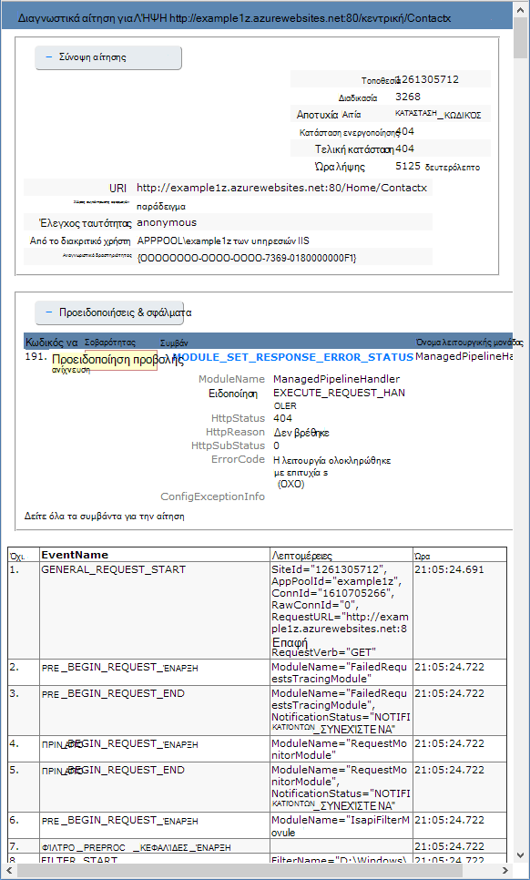

<properties
    pageTitle="Ενεργοποίηση της καταγραφής διαγνωστικών για τις εφαρμογές web στο Azure εφαρμογής υπηρεσίας"
    description="Μάθετε πώς μπορείτε να ενεργοποιήσετε την καταγραφή διαγνωστικών και προσθήκη οργάνων στην εφαρμογή σας, καθώς και πώς μπορείτε να αποκτήσετε πρόσβαση στις πληροφορίες που καταγράφονται από Azure."
    services="app-service"
    documentationCenter=".net"
    authors="cephalin"
    manager="wpickett"
    editor="jimbe"/>

<tags
    ms.service="app-service"
    ms.workload="na"
    ms.tgt_pltfrm="na"
    ms.devlang="na"
    ms.topic="article"
    ms.date="06/06/2016"
    ms.author="cephalin"/>

# Ενεργοποίηση της καταγραφής διαγνωστικών για τις εφαρμογές web στο Azure εφαρμογής υπηρεσίας

## Επισκόπηση

Azure παρέχει ενσωματωμένα διαγνωστικά εργαλεία για να σας βοηθήσει με τον εντοπισμό σφαλμάτων σε μια [εφαρμογή υπηρεσίας web app](http://go.microsoft.com/fwlink/?LinkId=529714). Σε αυτό το άρθρο θα μάθετε πώς μπορείτε να ενεργοποιήσετε την καταγραφή διαγνωστικών και προσθήκη οργάνων στην εφαρμογή σας, καθώς και πώς μπορείτε να αποκτήσετε πρόσβαση στις πληροφορίες που καταγράφονται από Azure.

Σε αυτό το άρθρο χρησιμοποιεί την [Πύλη Azure](https://portal.azure.com)Azure PowerShell και περιβάλλον γραμμής εντολών του Azure (Azure CLI) για να εργαστείτε με αρχεία καταγραφής διαγνωστικών. Για πληροφορίες σχετικά με την εργασία με αρχεία καταγραφής διαγνωστικών χρήση του Visual Studio, ανατρέξτε στο θέμα [Αντιμετώπιση προβλημάτων Azure στο Visual Studio](web-sites-dotnet-troubleshoot-visual-studio.md).

[AZURE.INCLUDE [app-service-web-to-api-and-mobile](../../includes/app-service-web-to-api-and-mobile.md)]

## Διαγνωστικά διακομιστή Web και τα Διαγνωστικά εφαρμογής

Εφαρμογές web της εφαρμογής υπηρεσίας παρέχουν διαγνωστικών λειτουργικότητα για πληροφορίες καταγραφής από το διακομιστή web και την εφαρμογή web. Αυτά τα λογικά διαχωρίζονται σε **Διαγνωστικά διακομιστή web** και τα **Διαγνωστικά εφαρμογής**.

### Διαγνωστικά διακομιστή Web

Μπορείτε να ενεργοποιήσετε ή να απενεργοποιήσετε τα παρακάτω είδη των αρχείων καταγραφής:

- **Λεπτομερής καταγραφή σφαλμάτων** - λεπτομερείς πληροφορίες για τους κωδικούς κατάστασης HTTP που δηλώνουν αποτυχία (κωδικός κατάστασης 400 ή μεγαλύτερη). Αυτό μπορεί να περιέχει πληροφορίες που μπορούν να σας βοηθήσουν να προσδιορίσετε γιατί ο διακομιστής επέστρεψε τον κωδικό σφάλματος.
- **Απέτυχε η αίτηση ανίχνευσης** - λεπτομερείς πληροφορίες σχετικά με αποτυχημένων αιτήσεων, όπως μια ανίχνευση τα στοιχεία των υπηρεσιών IIS που χρησιμοποιείται για την επεξεργασία της αίτησης και την ώρα που λαμβάνονται σε κάθε στοιχείο. Αυτό μπορεί να είναι χρήσιμο εάν προσπαθείτε να αυξήσετε απόδοση της τοποθεσίας ή να απομονώσετε τι προκαλεί ένα συγκεκριμένο σφάλμα HTTP θα επιστραφεί.
- **Καταγραφή διακομιστή web** - πληροφορίες σχετικά με τις συναλλαγές HTTP χρησιμοποιώντας τη [μορφή αρχείου εκτεταμένης καταγραφής W3C](http://msdn.microsoft.com/library/windows/desktop/aa814385.aspx). Αυτό είναι χρήσιμο κατά τον καθορισμό συνολική μετρικά τοποθεσίας, όπως τον αριθμό των χειρισμού των αιτήσεων ή πόσες αιτήσεις είναι από μια συγκεκριμένη διεύθυνση IP.

### Διαγνωστικά εφαρμογής

Εφαρμογή Διαγνωστικά σάς επιτρέπει να καταγράψετε τις πληροφορίες που παράγονται από μια εφαρμογή web. Εφαρμογές ASP.NET μπορούν να χρησιμοποιήσουν την κλάση [System.Diagnostics.Trace](http://msdn.microsoft.com/library/36hhw2t6.aspx) την καταγραφή πληροφοριών στο αρχείο καταγραφής διαγνωστικών εφαρμογών. Για παράδειγμα:

    System.Diagnostics.Trace.TraceError("If you're seeing this, something bad happened");

Κατά το χρόνο εκτέλεσης, μπορείτε να ανακτήσετε αυτά τα αρχεία καταγραφής για να βοηθήσουν στην αντιμετώπιση προβλημάτων. Για περισσότερες πληροφορίες, ανατρέξτε στο θέμα [Αντιμετώπιση προβλημάτων Azure web apps στο Visual Studio](web-sites-dotnet-troubleshoot-visual-studio.md).

Εφαρμογές web της εφαρμογής υπηρεσίας συνδεθείτε επίσης πληροφορίες ανάπτυξης κατά τη δημοσίευση περιεχομένου σε μια εφαρμογή web. Αυτό συμβαίνει αυτόματα και δεν υπάρχουν ρυθμίσεις παραμέτρων για την καταγραφή ανάπτυξης. Καταγραφή από την ανάπτυξη σάς επιτρέπει να προσδιορίσετε γιατί απέτυχε μια ανάπτυξη. Για παράδειγμα, εάν χρησιμοποιείτε μια δέσμη ενεργειών ανάπτυξης προσαρμοσμένο, μπορείτε να χρησιμοποιήσετε καταγραφής ανάπτυξης για να προσδιορίσετε γιατί αποτυγχάνει τη δέσμη ενεργειών.

## Πώς μπορείτε να ενεργοποιήσετε Διαγνωστικά

Για να ενεργοποιήσετε Διαγνωστικά στην [Πύλη του Azure](https://portal.azure.com), μεταβείτε το blade για την εφαρμογή web της και κάντε κλικ στην επιλογή **Ρυθμίσεις > αρχεία καταγραφής διαγνωστικών**.

<!-- todo:cleanup dogfood addresses in screenshot -->

Όταν ενεργοποιείτε την **εφαρμογή Διαγνωστικά** μπορείτε επίσης να επιλέξετε το **επίπεδο**. Αυτή η ρύθμιση σάς επιτρέπει να φιλτράρετε τις πληροφορίες που καταγράφονται στις πληροφορίες **ενημερωτικό**, **Προειδοποίηση** ή **σφάλμα** . Αυτή η ρύθμιση σε **λεπτομερές** θα καταγράψει όλες τις πληροφορίες που παράγονται από την εφαρμογή.

> [AZURE.NOTE] Σε αντίθεση με την αλλαγή στο αρχείο web.config, ενεργοποίηση εφαρμογής Διαγνωστικά ή αλλάζοντας τα επίπεδα αρχείο καταγραφής διαγνωστικών δεν Κάδος Ανακύκλωσης τομέα εφαρμογής που η εφαρμογή θα εκτελείται σε.

Στην [κλασική πύλη](https://manage.windowsazure.com) Web app **Ρύθμιση παραμέτρων** καρτέλα, μπορείτε να επιλέξετε **το σύστημα αρχείων** για την **καταγραφή της διακομιστή web**ή του **χώρου αποθήκευσης** . Επιλογή **χώρου αποθήκευσης** σάς επιτρέπει να επιλέξετε ένα λογαριασμό του χώρου αποθήκευσης και, στη συνέχεια ένα κοντέινερ αντικειμένων blob που θα εγγραφούν τα αρχεία καταγραφής. Όλα τα άλλα αρχεία καταγραφής για τα **Διαγνωστικά τοποθεσίας** εγγράφονται στο σύστημα αρχείων.

Στην καρτέλα **Ρύθμιση παραμέτρων** εφαρμογής Web [κλασική πύλη](https://manage.windowsazure.com) έχει επίσης πρόσθετες ρυθμίσεις για τα Διαγνωστικά εφαρμογής:

* **Το σύστημα αρχείων** - αποθηκεύει τις πληροφορίες διαγνωστικών της εφαρμογής στο σύστημα αρχείων εφαρμογής web. Αυτά τα αρχεία μπορεί να είναι προσβάσιμη από FTP ή να λάβει ως μια αρχειοθήκη Zip με τη χρήση του Azure PowerShell ή Azure περιβάλλον γραμμής εντολών (Azure CLI).
* **Χώρος αποθήκευσης πινάκων** - αποθηκεύει τις πληροφορίες διαγνωστικών εφαρμογή το καθορισμένο όνομα λογαριασμού χώρου αποθήκευσης Azure και πίνακα.
* **Χώρος αποθήκευσης αντικειμένων blob** - αποθηκεύει τις πληροφορίες διαγνωστικών εφαρμογής στο καθορισμένο κοντέινερ Azure λογαριασμού χώρου αποθήκευσης και αντικειμένων blob.
* **Περίοδος διατήρησης** - από προεπιλογή, αρχεία καταγραφής δεν διαγράφονται αυτόματα από το **χώρο αποθήκευσης αντικειμένων blob**. Επιλέξτε **Ορισμός διατήρησης** και πληκτρολογήστε τον αριθμό των ημερών για να διατηρήσετε τα αρχεία καταγραφής εάν θέλετε να διαγράψετε αυτόματα αρχεία καταγραφής.

>[AZURE.NOTE] Αν [αναδημιουργήσετε πλήκτρων πρόσβασης του λογαριασμού σας στο χώρο αποθήκευσης](storage-create-storage-account.md#view-copy-and-regenerate-storage-access-keys), θα πρέπει να επαναφέρετε τη ρύθμιση παραμέτρων καταγραφής αντίστοιχα για να χρησιμοποιήσετε τα πλήκτρα με τα ενημερωμένα. Για να το κάνετε αυτό:
>
> 1. Στην καρτέλα **Ρύθμιση παραμέτρων** , ορίστε τη δυνατότητα καταγραφής αντίστοιχα σε **Απενεργοποίηση**. Αποθηκεύστε τη ρύθμιση.
> 2. Ενεργοποίηση καταγραφής για το χώρο αποθήκευσης αντικειμένων blob λογαριασμού ή τον πίνακα ξανά. Αποθηκεύστε τη ρύθμιση.

Οποιονδήποτε συνδυασμό του συστήματος αρχείων, χώρος αποθήκευσης πινάκων ή χώρο αποθήκευσης αντικειμένων blob μπορεί να ενεργοποιηθεί ταυτόχρονα και έχετε ρυθμίσεις παραμέτρων επιπέδου καταγραφής μεμονωμένα. Για παράδειγμα, ίσως θελήσετε να συνδεθείτε σφαλμάτων και προειδοποιήσεων στο χώρο αποθήκευσης αντικειμένων blob ως μακροπρόθεσμη λύση καταγραφής, κατά την ενεργοποίηση της καταγραφής συστήματος αρχείων με ένα επίπεδο λεπτομερές.

Ενώ όλες τις τρεις θέσεις αποθήκευσης παρέχει τις ίδιες βασικές πληροφορίες για καταγραφής συμβάντων, **χώρος αποθήκευσης πινάκων** και **χώρος αποθήκευσης αντικειμένων blob** αρχείου καταγραφής πρόσθετες πληροφορίες όπως το Αναγνωριστικό εμφάνισης, το Αναγνωριστικό του νήματος και ένα πιο λεπτομερές χρονικής σήμανσης (μορφή υποδιαίρεσης) από καταγραφής για **το σύστημα αρχείων**.

> [AZURE.NOTE] Πληροφορίες που είναι αποθηκευμένες στο **χώρο αποθήκευσης πινάκων** ή το **χώρο αποθήκευσης αντικειμένων blob** είναι δυνατή μόνο με τη χρήση ενός προγράμματος-πελάτη του χώρου αποθήκευσης ή μια εφαρμογή η οποία απευθείας να εργαστείτε με αυτά τα συστήματα αποθήκευσης. Για παράδειγμα, Visual Studio 2013 περιέχει ένα Εξερεύνηση χώρου αποθήκευσης που μπορούν να χρησιμοποιηθούν για την Εξερεύνηση χώρου αποθήκευσης πίνακα ή blob και HDInsight να αποκτήσετε πρόσβαση σε δεδομένα που είναι αποθηκευμένα στο χώρο αποθήκευσης αντικειμένων blob. Μπορείτε επίσης να συντάξετε μια εφαρμογή που έχει πρόσβαση σε χώρο αποθήκευσης Azure χρησιμοποιώντας μία από το [Azure SDK](/downloads/#).

> [AZURE.NOTE] Διαγνωστικά επίσης μπορεί να ενεργοποιηθεί από το Azure PowerShell χρησιμοποιώντας το cmdlet **Set-AzureWebsite** . Εάν δεν έχετε εγκαταστήσει Azure PowerShell ή δεν έχετε ρυθμίσει τις παραμέτρους για να χρησιμοποιήσετε τη συνδρομή σας στο Azure, δείτε [πώς μπορείτε να χρησιμοποιήσετε Azure PowerShell](/develop/nodejs/how-to-guides/powershell-cmdlets/).

##Τρόπος: κάντε λήψη των αρχείων καταγραφής

Διαγνωστικών πληροφοριών που είναι αποθηκευμένες στο σύστημα αρχείων εφαρμογής web είναι δυνατή η πρόσβαση απευθείας με χρήση FTP. Μπορεί επίσης να ληφθεί ως αρχειοθέτηση Zip με τη χρήση του PowerShell Azure ή το περιβάλλον γραμμής εντολών Azure.

Η δομή καταλόγου που είναι αποθηκευμένα τα αρχεία καταγραφής σε είναι ως εξής:

* **Αρχεία καταγραφής εφαρμογών** - /LogFiles/εφαρμογή /. Αυτός ο φάκελος περιέχει ένα ή περισσότερα αρχεία κειμένου που περιέχει τις πληροφορίες που παράγονται από την καταγραφή εφαρμογής.

* **Απέτυχε η αίτηση ανιχνεύσεις** - / LogFiles/W3SVC ### /. Αυτός ο φάκελος περιέχει ένα αρχείο XSL και ένα ή περισσότερα αρχεία XML. Βεβαιωθείτε ότι κάνετε λήψη του αρχείου XSL στο ίδιο κατάλογο, όπως αρχεία XML, επειδή το αρχείο XSL παρέχει λειτουργικότητα για τη μορφοποίηση και το φιλτράρισμα των περιεχομένων των αρχείων XML κατά την προβολή στον Internet Explorer.

* **Αρχεία καταγραφής σφαλμάτων λεπτομερείς** - /LogFiles/DetailedErrors /. Αυτός ο φάκελος περιέχει ένα ή περισσότερα αρχεία .htm που παρέχουν αναλυτικές πληροφορίες για τυχόν σφάλματα HTTP που έχουν προκύψει.

* **Αρχεία καταγραφής του διακομιστή web** - /LogFiles/http/RawLogs. Αυτός ο φάκελος περιέχει ένα ή περισσότερα αρχεία κείμενο μορφοποιημένο χρησιμοποιώντας τη [μορφή αρχείου εκτεταμένης καταγραφής W3C](http://msdn.microsoft.com/library/windows/desktop/aa814385.aspx).

* **Αρχεία καταγραφής από την ανάπτυξη** - / LogFiles/Git. Αυτός ο φάκελος περιέχει αρχεία καταγραφής που δημιουργούνται από τις διεργασίες εσωτερικό ανάπτυξης που χρησιμοποιείται από εφαρμογές Azure web, καθώς και αρχεία καταγραφής για αναπτύξεις Git.

### FTP

Για να αποκτήσετε πρόσβαση σε πληροφορίες διαγνωστικών μέσω FTP, επισκεφθείτε πίνακα **εργαλείων** της εφαρμογής web στην [κλασική πύλη](https://manage.windowsazure.com). Στην ενότητα **γρήγορη ματιά** , χρησιμοποιήστε τη σύνδεση **FTP αρχεία καταγραφής διαγνωστικών** για να αποκτήσετε πρόσβαση στα αρχεία καταγραφής χρησιμοποιώντας FTP. Η καταχώρηση **Ανάπτυξης/FTP χρήστη** αναφέρει το όνομα χρήστη που θα χρησιμοποιηθεί για να αποκτήσετε πρόσβαση στην τοποθεσία FTP.

> [AZURE.NOTE] Εάν δεν έχει οριστεί η καταχώρηση **Ανάπτυξης/FTP χρήστη** ή έχετε ξεχάσει τον κωδικό πρόσβασης για τον συγκεκριμένο χρήστη, μπορείτε να δημιουργήσετε έναν νέο χρήστη και τον κωδικό πρόσβασης, χρησιμοποιώντας τη σύνδεση **Επαναφορά διαπιστευτηρίων ανάπτυξης** στην ενότητα **γρήγορη ματιά** του πίνακα **εργαλείων**.

### Κάντε λήψη του με το Azure PowerShell

Για να κάνετε λήψη των αρχείων καταγραφής, ξεκινήστε μια νέα παρουσία του Azure PowerShell και χρησιμοποιήστε την ακόλουθη εντολή:

    Save-AzureWebSiteLog -Name webappname

Αυτό θα αποθηκεύσει τα αρχεία καταγραφής για την εφαρμογή web που καθορίζεται από το **-όνομα** παραμέτρου σε ένα αρχείο με το όνομα **logs.zip** στον τρέχοντα κατάλογο.

> [AZURE.NOTE] Εάν δεν έχετε εγκαταστήσει Azure PowerShell ή δεν έχετε ρυθμίσει τις παραμέτρους για να χρησιμοποιήσετε τη συνδρομή σας στο Azure, δείτε [πώς μπορείτε να χρησιμοποιήσετε Azure PowerShell](/develop/nodejs/how-to-guides/powershell-cmdlets/).

### Λήψη με Azure περιβάλλον γραμμής εντολών

Για να κάνετε λήψη των αρχείων καταγραφής χρησιμοποιώντας το περιβάλλον γραμμής εντολών Azure, ανοίξτε μια νέα γραμμή εντολών, PowerShell, πάρτι ή περιόδου λειτουργίας τερματικού και εισαγάγετε την ακόλουθη εντολή:

    azure site log download webappname

Αυτό θα αποθηκεύσει τα αρχεία καταγραφής για την εφαρμογή web με το όνομα 'webappname' σε ένα αρχείο με το όνομα **diagnostics.zip** στον τρέχοντα κατάλογο.

> [AZURE.NOTE] Εάν δεν έχετε εγκαταστήσει το περιβάλλον γραμμής εντολών Azure (Azure CLI) ή δεν έχετε ρυθμίσει τις παραμέτρους για να χρησιμοποιήσετε τη συνδρομή σας στο Azure, δείτε [πώς μπορείτε να χρησιμοποιήσετε CLI Azure](../xplat-cli-install.md).

## Πώς μπορείτε να: προβολή αρχείων καταγραφής στην εφαρμογή ιδέες

Visual Studio εφαρμογή ιδέες παρέχει εργαλεία για φιλτράρισμα και την αναζήτηση αρχείων καταγραφής και για αντιστοιχίας τα αρχεία καταγραφής με αιτήσεις και άλλα συμβάντα.

1. Προσθήκη SDK ιδέες για την εφαρμογή στο έργο σας στο Visual Studio.
 * Στην Εξερεύνηση λύσεων, κάντε δεξί κλικ στην επιλογή το έργο σας και επιλέξτε Προσθήκη εφαρμογής ιδέες. Θα καθοδηγηθείτε βήματα που περιλαμβάνουν τη δημιουργία ενός πόρου ιδέες εφαρμογής. [Μάθε περισσότερα](../application-insights/app-insights-asp-net.md)
2. Προσθέστε το πακέτο του προγράμματος ανίχνευσης ακρόασης στο έργο σας.
 * Κάντε δεξί κλικ στην επιλογή το έργο σας και επιλέξτε Διαχείριση πακέτων NuGet. Επιλέξτε `Microsoft.ApplicationInsights.TraceListener` [Μάθετε περισσότερα](../application-insights/app-insights-asp-net-trace-logs.md)
3. Αποστείλετε το έργο σας και εκτελέστε το για να δημιουργήσετε δεδομένα του αρχείου καταγραφής.
4. Στην [Πύλη του Azure](https://portal.azure.com/), αναζητήστε το νέο πόρο ιδέες εφαρμογής και ανοίξτε **αναζήτησης**. Θα δείτε τα δεδομένα σας καταγραφής, μαζί με την αίτηση, τη χρήση και άλλων τηλεμετρίας. Ορισμένες τηλεμετρίας ενδέχεται να χρειαστούν μερικά λεπτά για να παραδίδεται: κάντε κλικ στην επιλογή Ανανέωση. [Μάθε περισσότερα](../application-insights/app-insights-diagnostic-search.md)

[Μάθετε περισσότερα σχετικά με τις επιδόσεις παρακολούθησης με ιδέες εφαρμογής](../application-insights/app-insights-azure-web-apps.md)

##Πώς μπορείτε να: ροή αρχείων καταγραφής

Κατά την ανάπτυξη μιας εφαρμογής, συχνά είναι χρήσιμο για να δείτε τις πληροφορίες καταγραφής στο κοντά σε πραγματικό χρόνο. Αυτό μπορεί να πραγματοποιηθεί από ροής πληροφοριών καταγραφής περιβάλλον ανάπτυξής σας με τη χρήση του PowerShell Azure ή το περιβάλλον γραμμής εντολών Azure.

> [AZURE.NOTE] Ορισμένοι τύποι buffer καταγραφή από την εγγραφή στο αρχείο καταγραφής, το οποίο μπορεί να έχει ως αποτέλεσμα εκτός σειράς συμβάντα στη ροή. Για παράδειγμα, μια καταχώρηση αρχείου καταγραφής εφαρμογής που εμφανίζεται όταν ένας χρήστης επισκεφθεί μια σελίδα ενδέχεται να εμφανίζεται στη ροή πριν από την αντίστοιχη εγγραφή αρχείου καταγραφής HTTP για την αίτηση σελίδας.

> [AZURE.NOTE] Ροή καταγραφής θα ροή επίσης πληροφορίες γραμμένο σε οποιοδήποτε αρχείο κειμένου που είναι αποθηκευμένα σε το **δ:\\αρχική\\LogFiles\\ ** φακέλου.

### Η ροή με το Azure PowerShell

Για να ροή πληροφορίες σύνδεσης, ξεκινήστε μια νέα παρουσία του Azure PowerShell και χρησιμοποιήστε την ακόλουθη εντολή:

    Get-AzureWebSiteLog -Name webappname -Tail

Αυτό θα συνδεθείτε με την εφαρμογή web που καθορίζεται από το **-όνομα** παραμέτρου και αρχίστε να ροής πληροφοριών στο παράθυρο PowerShell καθώς προκύπτουν συμβάντα του αρχείου καταγραφής στην εφαρμογή web. Τις πληροφορίες που είναι γραμμένο σε αρχεία που τελειώνουν σε .txt, καταγραφής ή .htm που είναι αποθηκευμένα στον κατάλογο /LogFiles (κεντρική/δ: / logfiles) θα να διοχετεύονται σε τοπική κονσόλα.

Για να φιλτράρετε συγκεκριμένα συμβάντα, όπως σφάλματα, χρησιμοποιήστε το **-μήνυμα** παραμέτρου. Για παράδειγμα:

    Get-AzureWebSiteLog -Name webappname -Tail -Message Error

Για να φιλτράρετε τύπους συγκεκριμένο αρχείο καταγραφής, όπως HTTP, χρησιμοποιήστε το **-διαδρομή** παραμέτρου. Για παράδειγμα:

    Get-AzureWebSiteLog -Name webappname -Tail -Path http

Για να δείτε μια λίστα με τις διαθέσιμες διαδρομές, χρησιμοποιήστε την παράμετρο - ListPath.

> [AZURE.NOTE] Εάν δεν έχετε εγκαταστήσει Azure PowerShell ή δεν έχετε ρυθμίσει τις παραμέτρους για να χρησιμοποιήσετε τη συνδρομή σας στο Azure, δείτε [πώς μπορείτε να χρησιμοποιήσετε Azure PowerShell](/develop/nodejs/how-to-guides/powershell-cmdlets/).

### Η ροή με Azure περιβάλλον γραμμής εντολών

Για να ροή πληροφορίες σύνδεσης, ανοίξτε μια νέα γραμμή εντολών, PowerShell, πάρτι ή περιόδου λειτουργίας τερματικού και εισαγάγετε την ακόλουθη εντολή:

    azure site log tail webappname

Αυτό θα συνδεθείτε στην εφαρμογή web με το όνομα 'webappname' και να ξεκινήσει η ροή πληροφοριών στο παράθυρο καθώς προκύπτουν συμβάντα του αρχείου καταγραφής στην εφαρμογή web. Τις πληροφορίες που είναι γραμμένο σε αρχεία που τελειώνουν σε .txt, καταγραφής ή .htm που είναι αποθηκευμένα στον κατάλογο /LogFiles (κεντρική/δ: / logfiles) θα να διοχετεύονται σε τοπική κονσόλα.

Για να φιλτράρετε συγκεκριμένα συμβάντα, όπως σφάλματα, χρησιμοποιήστε το **--φίλτρο** παραμέτρου. Για παράδειγμα:

    azure site log tail webappname --filter Error

Για να φιλτράρετε τύπους συγκεκριμένο αρχείο καταγραφής, όπως HTTP, χρησιμοποιήστε το **--διαδρομή** παραμέτρου. Για παράδειγμα:

    azure site log tail webappname --path http

> [AZURE.NOTE] Εάν δεν έχετε εγκαταστήσει το περιβάλλον γραμμής εντολών Azure ή δεν έχετε ρυθμίσει τις παραμέτρους για να χρησιμοποιήσετε τη συνδρομή σας στο Azure, δείτε [πώς μπορείτε να χρησιμοποιήσετε Azure περιβάλλον γραμμής εντολών](../xplat-cli-install.md).

##Πώς μπορείτε να: Κατανόηση των αρχείων καταγραφής διαγνωστικών

### Αρχεία καταγραφής διαγνωστικών εφαρμογής

Εφαρμογή Διαγνωστικά αποθηκεύει πληροφορίες σε συγκεκριμένη μορφή για εφαρμογές .NET, ανάλογα με το αν μπορείτε να αποθηκεύσετε αρχεία καταγραφής για το σύστημα αρχείων, χώρος αποθήκευσης πινάκων ή χώρο αποθήκευσης αντικειμένων blob. Το βασικό σύνολο των δεδομένων που είναι αποθηκευμένα είναι το ίδιο σε τρεις αποθήκευσης τύπους - την ημερομηνία και ώρα του συμβάντος, το Αναγνωριστικό της διαδικασίας που δημιούργησε το συμβάν, ο τύπος συμβάντος (πληροφορίες, προειδοποίηση, σφάλματος) και το μήνυμα συμβάντος.

__Το σύστημα αρχείων__

Κάθε γραμμή είστε συνδεδεμένοι στο σύστημα αρχείων ή λήφθηκαν ροής θα είναι με την εξής μορφή:

    {Date}  PID[{process id}] {event type/level} {message}

Για παράδειγμα, ένα συμβάν σφάλματος θα μοιάζει με το εξής:

    2014-01-30T16:36:59  PID[3096] Error       Fatal error on the page!

Καταγραφή στο σύστημα αρχείων παρέχει τις πιο βασικές πληροφορίες από τις τρεις διαθέσιμες μεθόδους, παρέχοντας μόνο την ώρα, αναγνωριστικό διεργασίας, επίπεδο συμβάντων και μήνυμα.

__Χώρος αποθήκευσης πινάκων__

Κατά τη σύνδεση με το χώρο αποθήκευσης πίνακα, πρόσθετες ιδιότητες χρησιμοποιούνται για να διευκολύνετε την αναζήτηση δεδομένων που αποθηκεύονται σε του πίνακα, καθώς και πιο λεπτομερείς πληροφορίες σχετικά με το συμβάν. Οι ακόλουθες ιδιότητες (στήλες) που χρησιμοποιούνται για κάθε οντότητα (γραμμή) που είναι αποθηκευμένα στον πίνακα.

Όνομα ιδιότητας|Τιμή/μορφοποίηση
---|---
PartitionKey|Ημερομηνία/ώρα της εκδήλωσης σε μορφή yyyyMMddHH
RowKey|Μια τιμή GUID που προσδιορίζει με μοναδικό τρόπο αυτή η οντότητα
Χρονική σήμανση|Την ημερομηνία και την ώρα που προέκυψε το συμβάν
EventTickCount|Την ημερομηνία και την ώρα που προέκυψε το συμβάν, σε μορφή υποδιαίρεσης (μεγαλύτερη ακρίβεια)
ApplicationName|Το όνομα της εφαρμογής web
Επίπεδο|Επίπεδο συμβάντων (π.χ. σφάλμα, προειδοποίηση, πληροφορίες)
Αναγνωριστικό συμβάντος|Το Αναγνωριστικό συμβάντος αυτού του συμβάντος

Η προεπιλεγμένη τιμή 0 Εάν καθοριστεί κανένα
Αναγνωριστικό εμφάνισης|Παρουσία της εφαρμογής web που προέκυψε το ακόμα και σε
Αναγνωριστικό προϊόντος|Αναγνωριστικό διεργασίας
TID|Το Αναγνωριστικό νήματος του νήματος που παράγει το συμβάν
Μήνυμα|Μήνυμα λεπτομερειών συμβάντος

__Χώρος αποθήκευσης αντικειμένων blob__

Κατά τη σύνδεση στο χώρο αποθήκευσης blob, δεδομένα είναι αποθηκευμένα σε μορφή τιμών διαχωρισμένων με κόμμα (CSV). Παρόμοιο με το χώρο αποθήκευσης πινάκων, πρόσθετα πεδία καταγράφονται για την παροχή πιο λεπτομερείς πληροφορίες σχετικά με το συμβάν. Οι ακόλουθες ιδιότητες χρησιμοποιούνται για κάθε γραμμή του CSV:

Όνομα ιδιότητας|Τιμή/μορφοποίηση
---|---
Ημερομηνία|Την ημερομηνία και την ώρα που προέκυψε το συμβάν
Επίπεδο|Επίπεδο συμβάντων (π.χ. σφάλμα, προειδοποίηση, πληροφορίες)
ApplicationName|Το όνομα της εφαρμογής web
Αναγνωριστικό εμφάνισης|Παρουσία της εφαρμογής web που προέκυψε το συμβάν σε
EventTickCount|Την ημερομηνία και την ώρα που προέκυψε το συμβάν, σε μορφή υποδιαίρεσης (μεγαλύτερη ακρίβεια)
Αναγνωριστικό συμβάντος|Το Αναγνωριστικό συμβάντος αυτού του συμβάντος

Η προεπιλεγμένη τιμή 0 Εάν καθοριστεί κανένα
Αναγνωριστικό προϊόντος|Αναγνωριστικό διεργασίας
TID|Το Αναγνωριστικό νήματος του νήματος που παράγει το συμβάν
Μήνυμα|Μήνυμα λεπτομερειών συμβάντος

Τα δεδομένα που είναι αποθηκευμένα σε ένα αντικείμενο blob θα μοιάζει με το εξής:

    date,level,applicationName,instanceId,eventTickCount,eventId,pid,tid,message
    2014-01-30T16:36:52,Error,mywebapp,6ee38a,635266966128818593,0,3096,9,An error occurred

> [AZURE.NOTE] Στην πρώτη γραμμή του αρχείου καταγραφής θα περιέχει τις κεφαλίδες στήλης όπως αντιπροσωπεύονται σε αυτό το παράδειγμα.

### Απέτυχε η αίτηση ανιχνεύσεις

Απέτυχε η αίτηση ανιχνεύσεις είναι αποθηκευμένα σε αρχεία XML που ονομάζεται __fr ### .xml__. Για να κάνετε πιο εύκολη για να προβάλετε τις πληροφορίες καταγραφής, παρέχεται ένα φύλλο στυλ XSL με το όνομα __freb.xsl__ στον ίδιο κατάλογο με τα αρχεία XML. Ανοίγει ένα από τα αρχεία XML στον Internet Explorer, θα χρησιμοποιήσει το φύλλο στυλ XSL για την παροχή μια μορφοποιημένη εμφάνιση των πληροφοριών παρακολούθησης. Αυτό θα εμφανίζονται παρόμοιο με το εξής:

### Αρχεία καταγραφής σφαλμάτων λεπτομερείς

Αρχεία καταγραφής σφαλμάτων λεπτομερείς είναι έγγραφα HTML που παρέχουν πιο λεπτομερείς πληροφορίες σχετικά με σφάλματα HTTP που έχουν προκύψει. Δεδομένου ότι είναι απλά έγγραφα HTML, αυτοί μπορούν να προβληθούν χρησιμοποιώντας ένα πρόγραμμα περιήγησης web.

### Αρχεία καταγραφής του διακομιστή Web

Τα αρχεία καταγραφής του διακομιστή web έχουν μορφοποιηθεί χρησιμοποιώντας τη [μορφή αρχείου εκτεταμένης καταγραφής W3C](http://msdn.microsoft.com/library/windows/desktop/aa814385.aspx). Αυτές οι πληροφορίες μπορεί να διαβαστεί χρησιμοποιώντας ένα πρόγραμμα επεξεργασίας κειμένου ή να αναλυθεί χρησιμοποιώντας βοηθητικά προγράμματα όπως το [Αρχείο καταγραφής ανάλυσης](http://go.microsoft.com/fwlink/?LinkId=246619).

> [AZURE.NOTE] Τα αρχεία καταγραφής που παράγονται από εφαρμογές Azure web δεν υποστηρίζουν τα πεδία __s-όνομα υπολογιστή__, __s-ip__ή __στρατηγικής συνεργασίας ανά χώρα έκδοσης__ .

##Επόμενα βήματα

- [Πώς μπορείτε να παρακολουθείτε εφαρμογές Web](/manage/services/web-sites/how-to-monitor-websites/)
- [Αντιμετώπιση προβλημάτων Azure web apps στο Visual Studio](web-sites-dotnet-troubleshoot-visual-studio.md)
- [Ανάλυση καταγράφει την εφαρμογή web σε HDInsight](http://gallery.technet.microsoft.com/scriptcenter/Analyses-Windows-Azure-web-0b27d413)

> [AZURE.NOTE] Εάν θέλετε να γρήγορα αποτελέσματα με το Azure εφαρμογής υπηρεσίας πριν από την εγγραφή για λογαριασμό Azure, μεταβείτε στο [Δοκιμάστε εφαρμογής υπηρεσίας](http://go.microsoft.com/fwlink/?LinkId=523751), όπου μπορείτε να αμέσως δημιουργήσετε μια εφαρμογή web μικρής διάρκειας starter στην εφαρμογή υπηρεσίας. Δεν υπάρχει πιστωτικές κάρτες υποχρεωτικό, χωρίς δεσμεύσεις.

## Τι έχει αλλάξει
* Για οδηγίες για την αλλαγή από τοποθεσίες Web App υπηρεσία ανατρέξτε στο θέμα: [Azure εφαρμογής υπηρεσίας και τον αντίκτυπο σχετικά με τις υπάρχουσες υπηρεσίες Azure](http://go.microsoft.com/fwlink/?LinkId=529714)
* Για έναν οδηγό για την αλλαγή της πύλης παλιά νέα πύλη ανατρέξτε στο θέμα: [αναφορά για την πύλη του Azure περιήγηση](http://go.microsoft.com/fwlink/?LinkId=529715)
 
