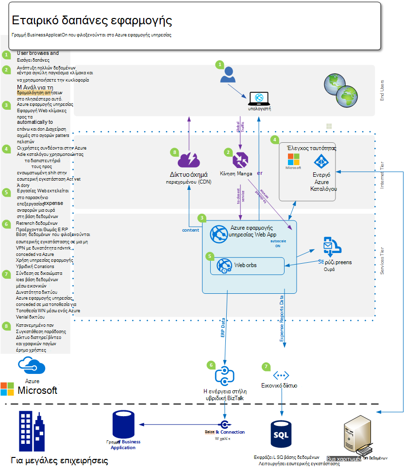
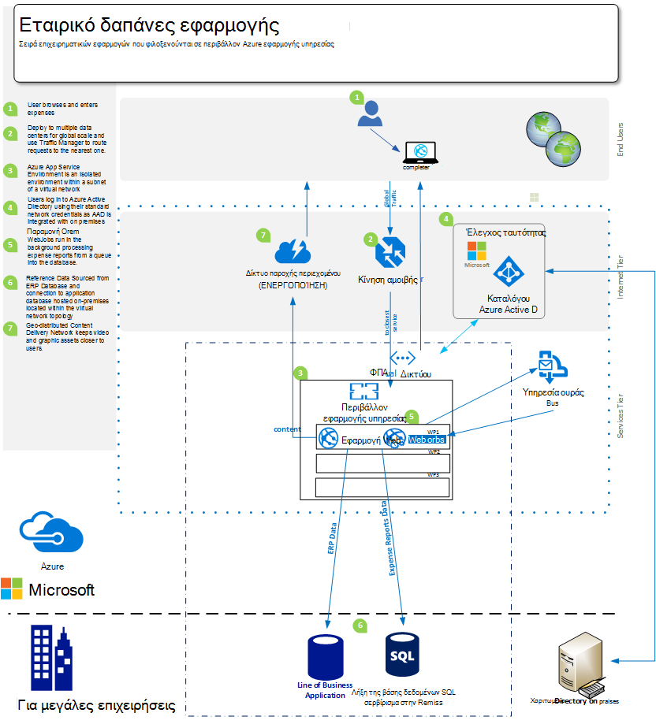
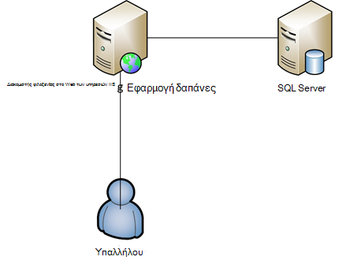

<properties 
    pageTitle="Azure εφαρμογής υπηρεσίας Web Apps προσφορές για μεγάλες επιχειρήσεις" 
    description="Δείχνει πώς μπορείτε να χρησιμοποιήσετε Azure εφαρμογής υπηρεσίας Web Apps για να δημιουργήσετε για μεγάλες επιχειρήσεις λύσεις τοποθεσίας Web για την επιχείρησή σας" 
    services="app-service\web" 
    documentationCenter="" 
    authors="apwestgarth" 
    manager="wpickett" 
    editor=""/>

<tags 
    ms.service="app-service-web" 
    ms.workload="web" 
    ms.tgt_pltfrm="na" 
    ms.devlang="na" 
    ms.topic="article" 
    ms.date="07/29/2016" 
    ms.author="anwestg"/>

# Azure εφαρμογής υπηρεσίας Web Apps προσφορές για μεγάλες επιχειρήσεις λευκή βίβλος #

Την ανάγκη να μειώσετε το κόστος και παράδοση λύσεις IT ταχύτερη σε περιβάλλον γρήγορη δημιουργεί νέες προκλήσεις για προγραμματιστές, οι επαγγελματίες τεχνολογιών πληροφορικής και οι διαχειριστές. Αυξανόμενη που αναζητούν οι χρήστες για τις εφαρμογές web γραμμής επιχειρήσεις (LOB) να είναι γρήγορη, αποκρίνεται και διαθέσιμα από οποιαδήποτε συσκευή. Την ίδια στιγμή, επιχειρήσεις προσπαθείτε να αξιοποίηση της αυξημένη παραγωγικότητα και της αποτελεσματικότητας που παρέχεται από την ενοποίηση με το cloud και κινητές συσκευές υπηρεσίες, αυτό μπορεί να είναι κάτι τόσο απλή όσο η καθολικής σύνδεσης όλες τις συσκευές με χρήση της υπηρεσίας καταλόγου Active Directory για συνεργασία στο Office 365 με τη χρήση δεδομένων από μια εσωτερική εφαρμογή LOB που χρησιμοποιεί τα με τη σειρά δεδομένων από την εφαρμογή εταιρεία του Salesforce τα μηνύματα μεταφέρονται. [Azure εφαρμογής υπηρεσίας Web Apps](http://go.microsoft.com/fwlink/?LinkId=529714) είναι μια υπηρεσία cloud επιχειρηματικής κατηγορίας για ανάπτυξη, δοκιμή και εκτελούν web και εφαρμογές για κινητές συσκευές, Web APIs και γενικό τοποθεσίες Web που διαθέτετε. Μπορεί να χρησιμοποιηθεί για να εκτελέσετε εταιρικές τοποθεσίες Web, τοποθεσίες intranet, επιχειρηματικών εφαρμογών και ψηφιακές εκστρατείες μάρκετινγκ καθολικού δικτύου του κέντρα δεδομένων βελτιστοποιημένη για κλίμακα και τη διαθεσιμότητα, μαζί με την υποστήριξη για την ενοποίηση λόγω των συνεχών και μοντέρνα DevOps πρακτικές.  

Αυτήν τη λευκή βίβλο επισημαίνει τις δυνατότητες της υπηρεσίας [Web Apps](/services/app-service/web/) συγκεκριμένα εστιασμένη σε εφαρμογές Web LOB, που καλύπτεται από μετεγκατάσταση των υπαρχουσών εφαρμογών web και ανάπτυξη του νέες εφαρμογές web LOB την πλατφόρμα που εκτελούνται. 

## Ακροατηρίου ##

Οι επαγγελματίες τεχνολογιών πληροφορικής, αρχιτέκτονες και διαχειριστές που αναζητάτε για τη μετεγκατάσταση στο το φόρτο εργασίας web cloud που εκτελούνται τη συγκεκριμένη στιγμή εσωτερικής εγκατάστασης. Φόρτους εργασίας του Web μπορεί να εκτείνεται σε είτε επιχειρήσεις σε υπάλληλο ή επιχειρήσεις στις εφαρμογές web συνεργάτες.

## Εισαγωγή ##

Εφαρμογή υπηρεσίας Web Apps είναι μια ιδανική πλατφόρμα στο οποίο θέλετε να φιλοξενήσετε εξωτερικών και εσωτερικών web εφαρμογές και υπηρεσίες όπως παρέχει μια λύση οικονομικός, ιδιαίτερα μεταβλητού μεγέθους, διαχειριζόμενων επιτρέποντάς σας να συγκεντρωθείτε σε την εκτέλεση επιχειρηματική αξία για τους χρήστες σας, αντί να ξοδεύετε σημαντικά ποσά του χρόνου και τη διατήρηση χρήματα και υποστήριξης, διαχωρίστε περιβάλλοντα. Εφαρμογές Web προσφέρει μια ευέλικτη πλατφόρμα στο οποίο θέλετε να αναπτύξετε εφαρμογές web επιχείρησής σας προσφέρει τη δυνατότητα να συνεχίσετε να ελέγχουν την ταυτότητα έναντι εσωτερικής εγκατάστασης υπηρεσίας καταλόγου Active Directory μέσω ενοποίησης με το Microsoft Azure Active Directory, υποστήριξη της εύκολη και γρήγορη αναπτύξεις πραγματοποίηση χρήση σας εσωτερικό συνεχής ενοποίησης και ανάπτυξη πρακτικών, κατά την αυτόματη κλιμάκωση για μεγέθυνση με τις ανάγκες επιχειρήσεις - όλα σε μια διαχειριζόμενη πλατφόρμα που σας επιτρέπει να εστιάσετε στην εφαρμογή σας και όχι την υποδομή σας. 

## Ορισμός προβλήματος ##

Τοπίου IT αλλάζει γρήγορα, με μια κίνηση μακριά από φιλοξενίας σε παραδοσιακά διακομιστές με τους υψηλό κεφαλαιακών κόστος στη μεγάλη χρόνους σε μία που χρησιμοποιεί στη ζήτηση χρήση των υπηρεσιών που αυτόματη κλιμάκωση για το χειρισμό φόρτου. Τμήματα IT είναι να προκλήσεις για μείωση του κόστους και Διαθέστε αποτύπωμα της υποδομής και συντήρησης με εστίαση στη μείωση CAPEX κατά αύξουσα επίσης ευελιξία. Στο τέλος της ζωής του παλαιότερων υποδομή πλατφόρμες, όπως το Windows Server 2003, είναι αποτέλεσμα τμήματα IT για να δείτε τις μετεγκατάστασης cloud ως πιθανά τρόπο για να αποφύγετε τη νέα μακροπρόθεσμη κεφαλαιακών κόστους. Στο παρελθόν, CIOs θα αποφάσεων αγοράς για άλλα τμήματα; Ωστόσο, αυξανόμενη CMOs και άλλες κεφαλές μονάδας επιχειρήσεις εκτελείτε μια πιο ενεργό ρόλο στην πώς δαπανάται τους προϋπολογισμού και τι είναι η απόδοση επένδυσης τους. Αυξανόμενη, επιχειρήσεις πρέπει τους προσωπικού να είναι πολύ πιο κινητή από ποτέ στους υπαλλήλους εργάζεται από απόσταση, δαπάνες περισσότερο χρόνο με τους πελάτες που χρειάζονται πρόσβαση σε συστήματα προβλήματα δωρεάν.

Επιχειρήσεις απαιτούνται αλλαγές για κάθε μήνα, εβδομαδιαία, καθημερινά. Επιχειρήσεις που αναζητούν άμεσα καθολικού κλιμάκωση με το κανονικό ενημερωμένες υπηρεσίες πλήρους νέων δυνατοτήτων, που παρέχονται από τρίτους ή εσωτερικά.  Σε ορισμένες περιπτώσεις επιχειρήσεις επίσης αναζητάτε τις δυνατότητες για να απομονώσετε εφαρμογές τους και να αποκτήσει πρόσβαση σε πόρους, ενώ επίσης να κάνετε χρήση των δημόσιων Cloud εγκαταστάσεις. Οι χρήστες έχουν μεγαλύτερη προσδοκίες, με πολλά που κάνουν χρήση των υπηρεσιών στον δικό τους ιδιωτικό ζωής όπως το Office 365. Αναμενόμενη για να έχετε πρόσβαση σε υπηρεσίες εμπλουτισμένου παρόμοια, ενημερωμένα, η δυνατότητα κατά τη διάρκεια ζωής τους εργασία. Για να αντιμετωπίσουν αυτό ζήτηση, IT πρέπει να εμφάνισης για να την επιχείρηση για να ενεργοποιήσετε αυτή την μέσω της επιλογής και ενοποίηση με το τρίτο μέρος των υπηρεσιών, προσέξτε επιλογής πλατφόρμες που μπορεί να προσαρμοστεί σε των επιχειρησιακών αναγκών, ενώ επίσης είναι αξιόπιστη με ένα μικρότερο συνολικό κόστος ιδιοκτησίας.

Αναζήτηση στις ομάδες ανάπτυξης για παράδοση όφελος άμεση επιχειρήσεις, την εκτέλεση νέες δυνατότητες σε συχνές βάση. Που αναζητούν μια οικονομική, αξιόπιστη πλατφόρμα που ενοποιείται με τα υπάρχοντα εργαλεία και πρακτικές – ανάπτυξη, δοκιμή, αφήστε; και εργασία με τμήματα IT αυτοματοποιεί ανάπτυξης, διαχείρισης και ειδοποίησης, όλα με το στόχο μηδέν χρόνου εκτός λειτουργίας.

<a href="highlevel" />
## Λύση υψηλού επιπέδου ##

Πλατφόρμες Web και πλαίσια αυξανόμενη που χρησιμοποιούνται για την ανάπτυξη, δοκιμή και φιλοξενεί επιχειρησιακές εφαρμογές.  Με μια τυπική γραμμή επιχειρηματική εφαρμογή, όπως ένα σύστημα εξόδων υπαλλήλων εσωτερικό, που συχνά αποτελείται μόνο από μια εφαρμογή web με τη δημιουργία αντιγράφων ασφαλείας βάσης δεδομένων για την αποθήκευση των δεδομένων που συνδέονται με την εφαρμογή.

Εφαρμογή υπηρεσίας Web Apps είναι μια καλή επιλογή για τη φιλοξενία αυτές τις εφαρμογές, σας δίνει τη δυνατότητα υποδομής μεταβλητού μεγέθους και αξιόπιστη που γίνεται και ενημερωθεί με κοντά μηδέν μη αυτόματη παρέμβαση και χρόνου εκτός λειτουργίας. Της πλατφόρμας Windows Azure παρέχει πολλές επιλογές αποθήκευσης δεδομένων για την υποστήριξη εφαρμογών web που φιλοξενείται σε εφαρμογές Web από το Azure βάση δεδομένων Microsoft SQL, ένα μεταβλητού μεγέθους σχεσιακή βάση δεδομένων-ως-a-υπηρεσίας διαχειριζόμενων, για να δημοφιλείς υπηρεσίες από τους συνεργάτες μας όπως βάση δεδομένων MySQL ClearDB και MongoDB.

Εναλλακτική προσέγγιση είναι να κάνετε χρήση της υπάρχουσας επένδυσή σας σε εσωτερική εγκατάσταση. Στο παράδειγμα σενάριο, ένα σύστημα εξόδων υπαλλήλων, ίσως θελήσετε να διατηρήσετε το χώρο αποθήκευσης δεδομένων μέσα σε το δικό σας εσωτερικό υποδομής. Αυτό θα μπορούσε να είναι για την ενοποίηση με συστήματα εσωτερικής (αναφοράς, μισθοδοσίας, χρεώσεις κ.λπ.) ή για να ικανοποιήσετε μια απαίτηση διακυβέρνησης IT.  Web Apps παρέχει ορισμένες μεθόδους της ενεργοποίησης μπορείτε να συνδεθείτε με την υποδομή σας στην εσωτερική εγκατάσταση:

- [Εφαρμογή υπηρεσίας περιβάλλοντα](app-service-app-service-environment-intro.md) - εφαρμογής υπηρεσίας περιβάλλοντα (ASE) είναι μια νέα δυνατότητα Premium στην οποία έχει προσθέσει πρόσφατα για το Microsoft Azure εφαρμογής υπηρεσίας προσφοράς.  ASEs παρέχουν ένα πλήρως απομόνωσης και αποκλειστικό περιβάλλον για την ασφαλή εκτέλεση εφαρμογές Azure εφαρμογής υπηρεσίας με υψηλή κλίμακα ενώ επίσης προσφέρει απομόνωση και ασφαλή πρόσβαση στο δίκτυο   
- [Συνδέσεις υβριδική](../biztalk-services/integration-hybrid-connection-overview.md) – υβριδική συνδέσεις είναι μια δυνατότητα του Microsoft Azure BizTalk υπηρεσιών και ενεργοποίηση Web Apps για να συνδεθείτε με εσωτερικής εγκατάστασης πόρους με ασφαλή τρόπο, για παράδειγμα SQL Server, MySQL, Web APIs και οι προσαρμοσμένες υπηρεσίες web. 
- [Ενοποίηση εικονικού δικτύου](https://azure.microsoft.com/blog/2014/09/15/azure-websites-virtual-network-integration/) – Web Apps ενοποίηση με το Azure εικονικού δικτύου σάς επιτρέπει να συνδεθείτε την εφαρμογή web της σε ένα δίκτυο εικονικού Azure, το οποίο με τη σειρά μπορεί να συνδεθεί με την υποδομή σας στην εσωτερική εγκατάσταση μέσω ενός VPN τοποθεσίας σε τοποθεσία. 

Τα ακόλουθα διαγράμματα απεικονίζουν ένα παράδειγμα λύσης υψηλού επιπέδου με επιλογές συνδεσιμότητας του σε πόρους εσωτερικής εγκατάστασης.  Το πρώτο παράδειγμα δείχνει τον τρόπο αυτό μπορεί να είναι δυνατό χρησιμοποιώντας τυπικές δυνατότητες του Azure εφαρμογής υπηρεσίας και η δεύτερη εμφανίζει πώς αυτό μπορεί να πραγματοποιηθούν με τη χρήση του premium σας δίνει τη δυνατότητα, εφαρμογή υπηρεσίας περιβάλλοντα.

Χρήση των δυνατοτήτων Standard εφαρμογής υπηρεσίας:

Χρησιμοποιώντας ένα περιβάλλον εφαρμογής υπηρεσίας:

## Επιχειρηματικά πλεονεκτήματα ##

Εφαρμογή υπηρεσίας Web Apps παρέχει ένα πλήθος πλεονεκτημάτων επιχειρήσεις που επιτρέπουν η λειτουργία σας να είναι πολύ πιο αποτελεσματικό και ευέλικτη στην παράδοση για τις ανάγκες επιχειρήσεις. 

### Μοντέλο PaaS ###

Εφαρμογή υπηρεσίας Web Apps είναι ενσωματωμένη σε μια πλατφόρμα ως ένα μοντέλο υπηρεσίας που παρέχει πολλές του κόστους και της αποτελεσματικότητας εξοικονόμησης.  Δεν είναι πλέον πρέπει να ξοδέψετε ώρες τη Διαχείριση ΣΠΣ, ενημερωμένων λειτουργικά συστήματα και πλαισίων. Εφαρμογές Web είναι ένα περιβάλλον αυτόματα ενημερωμένος που σας επιτρέπει να εστιάσετε σε διαχείριση του εφαρμογών web και δεν ΣΠΣ, διατηρώντας τις ομάδες δωρεάν για την παροχή επιπλέον επιχειρηματική αξία.

Το μοντέλο PaaS υποστήριξη Web Apps δίνει τη δυνατότητα στα της μεθόδου DevOps για την κάλυψη τους στόχους. Ως μια επιχείρηση αυτό σημαίνει ότι πλήρους διαχείρισης και την ενοποίηση σε ολόκληρη την εφαρμογή ολόκληρο κύκλου ζωής, συμπεριλαμβανομένης ανάπτυξης, δοκιμή, την έκδοση, παρακολούθησης και διαχείρισης και υποστήριξη. 

Για ομάδες ανάπτυξης, συνεχής ενοποίησης και ανάπτυξη ροές εργασίας μπορούν να ρυθμιστούν από το Visual Studio Team Services, GitHub, TeamCity, Hudson ή BitBucket, ενεργοποιώντας αυτοματοποιημένη Δόμηση, δοκιμή και ανάπτυξη Ενεργοποίηση ταχύτερη κυκλοφορίας κύκλους ενώ τη μείωση του τριβής σχετίζονται για τη διάθεση στην υπάρχουσα υποδομή. Web Apps υποστηρίζει επίσης τη δημιουργία πολλών δοκιμή και ενδιάμεσου περιβάλλοντα για τη ροή εργασίας σας έκδοση, δεν είναι πλέον πρέπει να δεσμεύσετε ή την εκχώρηση υλικού για αυτούς τους σκοπούς, μπορείτε να δημιουργήσετε όσες περιβάλλοντα όπως που θέλετε και να ορίσετε τις δικές σας προώθησης για να παραχωρήσετε ροής εργασίας. Ως μια επιχείρηση μπορεί να αποφασίσετε να αφήσετε σε μια υποδοχή δοκιμής από το στοιχείο ελέγχου προέλευσης, εκτελέστε μια σειρά δοκιμών και μετά την επιτυχή ολοκλήρωση Προβιβασμός σε μια υποδοχή σταδίου και τέλος εναλλαγή παραγωγή με χωρίς χρόνου εκτός λειτουργίας, με το πρόσθετο πλεονέκτημα που φιλοξενούνται σε εφαρμογές Web εφαρμογές web είναι που είναι προεγκατεστημένα και πρόσβασης για να παρέχετε την καλύτερη δυνατή εμπειρία των πελατών.  Επιπλέον επιχειρήσεις να κάνετε χρήση των στην έλεγχος στις δυνατότητες παραγωγής της εφαρμογής υπηρεσίας Web Apps για να κατευθύνετε μια ενότητα κίνησης σε μια διαφορετική υποδοχή, επικυρώστε τις αλλαγές, πριν από την αλλαγή όλη την κυκλοφορία σε νέα ανάπτυξης ή επαναφορά όλη την κυκλοφορία στο προηγούμενο ανάπτυξης. 

Λειτουργίες ομάδων να είστε βέβαιοι ότι είναι η καλύτερη θέση απάντησης σε προβλήματα με οποιαδήποτε από τις εφαρμογές web που φιλοξενούνται σε εφαρμογές Web με την ενσωματωμένη σε δυνατότητες παρακολούθησης και ειδοποιήσεων. Θα πρέπει να τις ομάδες εργασίες έχουν ήδη επενδύσει σε ανάλυση και παρακολούθησης λύσεις, όπως από το Microsoft Visual Studio εφαρμογή ιδέες, νέα Relic και AppDynamics. Αυτές υποστηρίζονται επίσης πλήρως σε εφαρμογές Web της ενεργοποίησης συνέχειας και ένα οικείο περιβάλλον από το οποίο για την παρακολούθηση των εφαρμογών web.

Τέλος, Web Apps παρέχει λειτουργικότητα αυτόματης δημιουργίας αντιγράφων ασφαλείας σας εφαρμογές και βάσεις δεδομένων φιλοξενούμενη απευθείας σε ένα κοντέινερ χώρο αποθήκευσης Blob του Azure. Παρέχει έναν εύκολο τρόπο και πολύ κόστους αποτελεσματική μέθοδο με την οποία θέλετε να ανακτήσετε από καταστροφή, μειώνοντας την ανάγκη για μιγαδικού στην εσωτερική εγκατάσταση υλικού και λογισμικού.

### Διευκόλυνση της μετεγκατάστασης ###

Συντήρηση υλικού και περιστροφή είναι ένα σημαντικό θέμα για επιχειρήσεις, όπως κύκλους κυκλοφορία για το υλικό και λειτουργικά συστήματα επιτάχυνση της. Ίσως έχετε έναν αριθμό των διακομιστών Windows Server 2003 R2 που προέρχονται στο τέλος της υποστήριξης στο 2015, αλλά εξακολουθείτε να φιλοξενείτε εφαρμογές web κλειδιού για την επιχείρησή σας; Εφαρμογή υπηρεσίας Web Apps είναι μια εξαιρετική υποψηφίου στο οποίο θέλετε να περιέχουν αυτές τις εφαρμογές web και για να εξορθολογισμό το ακινήτων υλικού επιχειρήσεις. Web Apps παρέχει πρόσβαση σε μια περιοχή προδιαγραφές υλικού, οι οποίες είναι διαχειριζόμενο και διατηρούνται ως μέρος της υπηρεσίας, καταργώντας την ανάγκη να συντελεστής στο αντικατάστασης και του κόστους διαχείρισης ως μέρος του προϋπολογισμού σας υποδομή.  Μετεγκατάσταση να είναι απλή, όπως ένα αντίγραφο και να επικολλήσετε λειτουργίας από την υπάρχουσα ανάπτυξη σε εφαρμογές Web ή σε μια πιο σύνθετη μετεγκατάσταση όπου χρησιμοποιώντας τα Web Apps μετεγκατάστασης του Βοηθού θα προσθέσετε τιμή. Εφαρμογές web μετεγκαταστάθηκαν απολαύσουν όλο το φάσμα των υπηρεσιών Azure, επιπλέον υπηρεσιών στις εφαρμογές web. Για παράδειγμα, μπορείτε να προσθέσετε Azure Active Directory για να ελέγχετε την πρόσβαση στην εφαρμογή σας που βασίζεται σε συσχέτιση των χρηστών σε ομάδες ασφαλείας. Ένα άλλο παράδειγμα μπορεί να προσθέσετε υπηρεσίες Cache για να βελτιώσετε την απόδοση και να μειώσετε λανθάνων χρόνος, παροχή καλύτερα συνολική εμπειρία χρήστη. 

### Για μεγάλες επιχειρήσεις φιλοξενίας τάξης ###

Εφαρμογή υπηρεσίας Web Apps παρέχει μια σταθερή, αξιόπιστη πλατφόρμα που έχει φανεί να είναι σε θέση να χειρίζεται μια μεγάλη ποικιλία επιχειρήσεις πρέπει από μικρές εσωτερικό ανάπτυξης και δοκιμής φόρτους εργασίας, σε τοποθεσίες Web ιδιαίτερα υπό κλίμακα μεγάλη κίνηση. Με τη χρήση εφαρμογών Web, καθιστάτε χρησιμοποιήσετε από την ίδια πλατφόρμα φιλοξενίας κλάσης για μεγάλες επιχειρήσεις η Microsoft, όπως μια εταιρεία που χρησιμοποιεί για την υψηλή τιμή φόρτους εργασίας web. Εφαρμογές Web, καθώς και όλων των υπηρεσιών Azure την πλατφόρμα, δημιουργούνται με ασφάλεια και συμμόρφωση με ρυθμιστικές απαιτήσεις, όπως ISO (ISO/IEC 27001:2005); SOC1 και SOC2 SSAE 3402 16/ISAE βεβαιώσεις, HIPAA BAA, PCI και Fedramp στην πολύ καρδιά κάθε στοιχείο και τη δυνατότητα, για περισσότερες πληροφορίες, ανατρέξτε στο θέμα [http://aka.ms/azurecompliance](/support/trust-center/compliance/). 

Πλατφόρμα Windows Azure επιτρέπει ρόλο βάσει εξουσιοδότησης των στοιχείων ελέγχου Ενεργοποίηση επίπεδα για μεγάλες επιχειρήσεις του στοιχείου ελέγχου σε πόρους μέσα σε εφαρμογές Web. RBAC παρέχει επιχειρήσεις για να εφαρμόσετε τις δικές τους πολιτικές διαχείρισης πρόσβασης για όλους τους πόρους στο περιβάλλον Azure, αντιστοίχιση χρηστών σε ομάδες και με τη σειρά εκχωρώντας τα απαιτούμενα δικαιώματα σε αυτές τις ομάδες σε σχέση με το περιουσιακών στοιχείων, όπως μια εφαρμογή web. Για περισσότερες πληροφορίες σχετικά με RBAC στο Azure, ανατρέξτε στο θέμα [http://aka.ms/azurerbac](../active-directory/role-based-access-control-configure.md). Χρησιμοποιώντας εφαρμογές Web, μπορείτε να διασφαλίσετε ότι σας εφαρμογές web έχουν αναπτυχθεί σε ένα περιβάλλον ασφαλές και έχετε πλήρη έλεγχο σε ποια περιοχή αναπτύσσονται τους πόρους σας. 

Azure εφαρμογής υπηρεσίας περιβάλλοντα [http://aka.ms/aseintro](http://aka.ms/aseintro) είναι μια νέα επιλογή premium υπηρεσίας πρόγραμμα για εταιρικούς πελάτες που θέλουν να χρησιμοποιούν Azure εφαρμογής υπηρεσίας και αυτά παρέχουν ένα πλήρως απομόνωσης και αποκλειστικό περιβάλλον.  Αυτή η δυνατότητα επιτρέπει εταιρικοί πελάτες για την ανάπτυξη εφαρμογών που μπορούν να επωφεληθούν από πολύ υψηλή κλίμακα, ενώ επίσης έχουν πλήρη έλεγχο εισερχόμενων και εξερχόμενων κίνηση του δικτύου και ASEs επιτρέπουν στις εφαρμογές να έχουν ασφαλείς συνδέσεις υψηλής ταχύτητας μέσω εικονικών δικτύων με πόρους εσωτερικής εγκατάστασης.

Εφαρμογή υπηρεσίας Web Apps μπορούν επίσης να αξιοποιήσετε σας σε επενδύσεις εσωτερικής εγκατάστασης, παρέχοντας τη δυνατότητα για να συνδεθείτε ξανά στο εσωτερικό τους πόρους σας, όπως το αποθήκη δεδομένων ή το περιβάλλον του SharePoint. Όπως περιγράφεται στο θέμα [υψηλού επιπέδου λύση](#highlevel) που μπορείτε να κάνετε χρήση των συνδέσεων υβριδική και εικονικού η συνδεσιμότητα του δικτύου για να δημιουργήσετε συνδέσεις προς σχετικά με την υποδομή εσωτερικής εγκατάστασης και υπηρεσίες.

### Παγκόσμια κλίμακα ###

Εφαρμογή υπηρεσίας Web Apps είναι μια πλατφόρμα καθολικού και μεταβλητού μεγέθους, ενεργοποίηση των εφαρμογών web για μεγέθυνση και να προσαρμόσετε στις ανάγκες του μια αναπτυσσόμενη επιχείρηση γρήγορα και με ελάχιστους μακροπρόθεσμη σχεδιασμού και κόστος. Σε τυπικές στην εσωτερική εγκατάσταση υποδομή σενάρια, επέκτασης και αύξηση των απαιτήσεων τόσο τοπικά και γεωγραφικά θα απαιτούν μεγάλο όγκο διαχείρισης, σχεδιασμό και δαπάνες για την παροχή των και διαχειριστείτε την υποδομή επιπλέον. Web Apps παρέχει τη δυνατότητα για να κλιμακωθεί τις εφαρμογές web με το ebb και ροή τις απαιτήσεις σας. Για παράδειγμα χρησιμοποιώντας την εφαρμογή δαπάνες ως παράδειγμα, για το μεγαλύτερο μέρος του μήνα οι χρήστες σας είναι απλή τους χρήστες της εφαρμογής, αλλά η προθεσμία κάθε μήνα για υποβολές εξόδων να εισαχθεί και χρήση αυξάνεται στην εφαρμογή σας, εφαρμογές Web έχει τη δυνατότητα αυτόματα παροχή περισσότερων υποδομή για την εφαρμογή σας και, στη συνέχεια, όταν έχει subsided τη χρήση ξανά το μπορεί να κλιμακωθεί προς την υποδομή γραμμής βάσης, μπορείτε να καθορίσετε.

Οι εφαρμογές Web είναι διαθέσιμη καθολικά στο 24 κέντρα δεδομένων σε όλο τον κόσμο και αυξανόμενου. Για την πιο ενημερωμένη λίστα με τις περιοχές και θέση, ανατρέξτε στο θέμα [http://aka.ms/azlocations](http://aka.ms/azlocations). Με τα Web Apps, την επιχείρησή σας εύκολα να επιτύχετε καθολική πρόσβαση και την κλίμακα. Καθώς εξελίσσεται η εταιρεία σας σε νέες περιοχές, το αναφοράς εφαρμογής πίνακες εργαλείων που χρησιμοποιείτε και κεντρικό υπολογιστή στο Web Apps μπορεί εύκολα να αναπτυχθεί σε επιπλέον κέντρα δεδομένων και λειτουργήσει Τοπικοί χρήστες πολύ πιο γρήγορα έως το συνδυασμό των εφαρμογών Web και διαχείριση κίνηση Azure, όλα με το πρόσθετο πλεονέκτημα της υποδομής του μεταβλητού μεγέθους κάτω από τη δυνατότητα να σύμπτυξη και ανάπτυξη ως τις ανάγκες των τοπικών γραφείων αλλαγή.
 
## Λεπτομέρειες λύσης ##

Ας δούμε ένα παράδειγμα ενός σεναρίου μετεγκατάστασης εφαρμογής. Αυτό περιγράφει τις λεπτομέρειες του πώς δυνατότητες εφαρμογή υπηρεσίας Web Apps έρθει μαζί για την παροχή εξαιρετική λύση και επιχειρηματική αξία.
 
Σε αυτό το παράδειγμα η γραμμή επιχειρηματική εφαρμογή θα σας θα συζητάτε είναι μια εξόδων αναφοράς εφαρμογής που επιτρέπει στους υπαλλήλους να υποβάλετε τα έξοδα για επιστροφή. Η εφαρμογή φιλοξενείται σε ένα Windows Server 2003 R2 εκτελείται IIS6 και η βάση δεδομένων είναι μια βάση δεδομένων SQL Server 2005. Το λόγο για τον μας επιλέξτε παλαιότερων βρίσκεται server με τις προσεχείς τέλος της υπηρεσίας Windows Server 2003 R2 και SQL Server 2005 και έχουμε [Εργαλεία](http://aka.ms/websitesmigration) και [οδηγίες](http://aka.ms/websitesmigrationresources) για τη μετεγκατάσταση αυτόματα φόρτους εργασίας σε Azure. Αυτό υπόψη, μοτίβου που χρησιμοποιείται σε αυτό το παράδειγμα ισχύουν για μια μεγάλη verity σενάρια μετεγκατάστασης. 

### Μετεγκατάσταση υπάρχοντος εφαρμογής ###

Βήμα μία από τη συνολική λύση για τη μετακίνηση μιας εφαρμογής γραμμής εταιρικά για εφαρμογές Web είναι για να προσδιορίσετε την υπάρχουσα εφαρμογή περιουσιακών στοιχείων και την αρχιτεκτονική. Το παράδειγμα σε αυτό το έγγραφο είναι μια εφαρμογή web ASP.NET φιλοξενούνται σε ένα διακομιστή των υπηρεσιών IIS με τη βάση δεδομένων που φιλοξενούνται σε μια ξεχωριστή SQL Server, όπως φαίνεται στην παρακάτω εικόνα. Σύνδεση των υπαλλήλων στο σύστημα χρησιμοποιώντας ένα συνδυασμό όνομα χρήστη και τον κωδικό πρόσβασης, πληκτρολογήστε τα στοιχεία των δαπανών και αποστολή σαρωμένων αντίγραφα των αποδείξεις, στη βάση δεδομένων, για κάθε στοιχείο της εξόδων. 
 

#### Στοιχεία που πρέπει να λάβετε υπόψη ####

Εφαρμογή μετεγκατάστασης από ένα περιβάλλον εσωτερικής εγκατάστασης, που μπορεί να θέλετε να λάβετε υπόψη τους περιορισμούς μερικές εφαρμογές Web. Ακολουθούν ορισμένα σημαντικά θέματα που πρέπει να γνωρίζετε κατά τη μετεγκατάσταση εφαρμογών web σε εφαρμογές Web ([http://aka.ms/websitesmigrationresources](http://aka.ms/websitesmigrationresources)):

-   Συνδέσεις θύρας – Web Apps υποστηρίζει μόνο τη θύρα 80 για HTTP και τη θύρα 443 για την κίνηση HTTPS. Εάν η εφαρμογή σας χρησιμοποιεί οποιαδήποτε άλλη θύρα, στη συνέχεια, μία φορά μετεγκατασταθεί η εφαρμογή θα κάνουν χρήση της θύρας 80 για το HTTP και θύρα 443 για την κίνηση HTTPS. Αυτό είναι συχνά μια επιβλαβή θέμα ως έχει κοινό στοιχείο σε σε αναπτύξεις εσωτερικής εγκατάστασης για να κάνετε χρήση των διαφορετικές θύρες προκειμένου να ξεπεραστεί τη χρήση των ονομάτων τομέων, ιδίως στα περιβάλλοντα ανάπτυξης και δοκιμής
-   Έλεγχος ταυτότητας – Web Apps υποστηρίζει ανώνυμος έλεγχος ταυτότητας από προεπιλογή και ο έλεγχος ταυτότητας φορμών όπως προσδιορίζεται από μια εφαρμογή. Εφαρμογές Web μπορεί να προσφέρει έλεγχο ταυτότητας των Windows, όταν η εφαρμογή είναι συνδεδεμένο με το Azure Active Directory και ADFS μόνο. Αυτή είναι μια δυνατότητα που περιγράφεται με περισσότερες λεπτομέρειες [εδώ](http://aka.ms/azurebizapp) 
-   GAC βάσει συγκροτήσεις – Web Apps δεν επιτρέπει την ανάπτυξη της συγκροτήσεις στο καθολικό Cache συγκροτήσεων (GAC). Επομένως, εάν η εφαρμογή θα μετεγκατασταθούν κάνει χρήση αυτής της δυνατότητας εσωτερικής εγκατάστασης, εξετάστε το ενδεχόμενο να μετακίνηση των συγκροτήσεων στο φάκελο bin της εφαρμογής.
-   IIS5 Κατάσταση λειτουργίας συμβατότητας – Web Apps δεν υποστηρίζει την κατάσταση λειτουργίας συμβατότητας IIS5 και ως τέτοια κάθε παρουσία Web Apps και όλες τις εφαρμογές web στην περιοχή εφαρμογές Web της παρουσίας του γονικού εκτελούνται στην ίδια διεργασία εργασίας μέσα σε ένα χώρο συγκέντρωσης μία μόνο εφαρμογή.
-   Χρήση βιβλιοθηκών COM-Web Apps δεν επιτρέπει την καταχώρηση των στοιχείων COM στην πλατφόρμα. Επομένως, αν η εφαρμογή είναι κάνει χρήση των στοιχείων COM, αυτές θα πρέπει να είναι επανεγγραφή σε διαχειριζόμενο κώδικα και με την εφαρμογή.
-   Φίλτρα – φίλτρα μπορούν να υποστηρίζονται σε εφαρμογές Web. Αυτά θα πρέπει να αναπτυχθούν ως τμήμα της εφαρμογής και έχουν καταχωρηθεί στο αρχείο web.config της εφαρμογής web. Για περισσότερες πληροφορίες, ανατρέξτε στο θέμα [http://aka.ms/azurewebsitesxdt](web-sites-transform-extend.md). 

Αφού έχετε θεωρήθηκε αυτά τα θέματα, πρέπει να είστε έτοιμοι για το Cloud την εφαρμογή web. Και μην ανησυχείτε εάν ορισμένα θέματα δεν πληρούνται πλήρως, το εργαλείο μετεγκατάστασης θα σας δώσει καλύτερα προσπάθειας για μετεγκατάσταση. 

Τα επόμενα βήματα της διαδικασίας μετεγκατάστασης είναι να δημιουργήσετε μια εφαρμογή web της εφαρμογής υπηρεσίας και μια βάση δεδομένων SQL Azure. Υπάρχουν πολλά μεγέθη των παρουσιών Web Apps με διαφορετικό αριθμό πυρήνων CPU και ποσά RAM που είναι διαθέσιμα για να επιλέξετε με βάση τις απαιτήσεις σας εφαρμογές web. Για περισσότερες πληροφορίες και τις τιμές, ανατρέξτε στο θέμα [http://aka.ms/azurewebsitesskus](/pricing/details/websites/). Παρομοίως, βάση δεδομένων SQL Microsoft Azure caters σε όλες τις ανάγκες μιας επιχείρησης με διάφορα επίπεδα υπηρεσίας και επιδόσεων για να ικανοποιεί απαιτήσεις. Μπορείτε να βρείτε περισσότερες πληροφορίες στο [http://aka.ms/azuresqldbskus](/pricing/details/sql-database/). Μετά τη δημιουργία, την εφαρμογή αποστέλλεται σε εφαρμογή υπηρεσίας Web Apps, είτε μέσω FTP ή WebDeploy και, στη συνέχεια, μετακινήστε πάνω στη βάση δεδομένων.

Σε αυτήν τη μετεγκατάσταση της λύσης χρησιμοποιεί βάση δεδομένων SQL Azure, αλλά αυτό σημαίνει ότι δεν μόνο βάσης δεδομένων που υποστηρίζονται σε Azure. Εταιρείες επίσης να κάνετε χρήση των DocumentDB Azure MySQL, MongoDB, και πολλά περισσότερα μέσω πρόσθετα τα οποία μπορεί να αγοραστεί στο [Χώρο αποθήκευσης Azure](/marketplace/partner-program/). 

Όταν δημιουργείτε μια βάση δεδομένων SQL Azure έναν αριθμό επιλογών είναι διαθέσιμες για να εισαγάγετε μια υπάρχουσα βάση δεδομένων από ένα διακομιστή εσωτερικής εγκατάστασης από τη δημιουργία μιας δέσμης ενεργειών μιας υπάρχουσας βάσης δεδομένων με τη χρήση του τα [δεδομένα επιπέδων εφαρμογή εξαγωγή και εισαγωγή](http://aka.ms/dacpac). 

Βάση δεδομένων της εφαρμογής δαπάνες που δημιουργήθηκε με τη δημιουργία μιας νέας βάσης δεδομένων SQL Azure, τη σύνδεση με τη βάση δεδομένων με χρήση του SQL Server Management Studio και, στη συνέχεια, εκτελεί μια δέσμη ενεργειών για να δημιουργήσετε το σχήμα της βάσης δεδομένων και συμπληρώστε τον με δεδομένα από τη βάση δεδομένων εσωτερικής εγκατάστασης.

Το τελικό βήμα σε αυτό το πρώτο στάδιο της μετεγκατάστασης που απαιτεί την ενημέρωση των συμβολοσειρών σύνδεσης στη βάση δεδομένων για την εφαρμογή. Έτσι μπορείτε να επιτύχετε μέσω της πύλης Azure. Για κάθε εφαρμογή web, μπορείτε να τροποποιήσετε συγκεκριμένες ρυθμίσεις εφαρμογής, συμπεριλαμβανομένων τυχόν συμβολοσειρές σύνδεσης που χρησιμοποιείται από την εφαρμογή για να συνδεθείτε με οποιαδήποτε βάση δεδομένων που χρησιμοποιείται.

### Εναλλακτικές λύσεις για χρήση βάσης δεδομένων SQL Azure ###

Την πλατφόρμα Azure προσφέρει πολλές εναλλακτικές λύσεις για χρήση βάσης δεδομένων SQL Azure ως εφαρμογές κύρια βάση δεδομένων web, αυτή είναι η ενεργοποίηση διαφορετικό φόρτους εργασίας π.χ. χρήση μιας λύσης NoSQL ή για να ενεργοποιήσετε την πλατφόρμα σύμφωνα με τις ανάγκες δεδομένων μιας επιχείρησης. Για παράδειγμα, μια επιχείρηση μπορεί να κρατήστε δεδομένα τα οποία δεν πρέπει να είναι αποθηκευμένα εκτός ή σε ένα περιβάλλον δημόσια cloud και, επομένως, θα φαίνεται για να διατηρήσετε τη χρήση τους στην εσωτερική βάση δεδομένων.

#### Σύνδεση με πόρους εσωτερικής εγκατάστασης ####
Εφαρμογή υπηρεσίας Web Apps προσφέρει πολλές επιλογές για τη σύνδεση σε εσωτερική εγκατάσταση πόρους, όπως βάσεις δεδομένων, ενεργοποιώντας εκ νέου χρήση της υπάρχουσας υποδομής υψηλή τιμή. Οι επιλογές είναι όπως αναφέρονται παρακάτω:

- Περιβάλλοντα εφαρμογής υπηρεσίας είναι απομονωμένες και να δημιουργηθεί ένα υποδίκτυο εικονικού δικτύου, επομένως η ενεργοποίηση του περιβάλλοντος για να επικοινωνήσετε με ιδιωτική τελικά σημεία που βρίσκεται μέσα στο ίδιο δίκτυο εικονικού - [http://aka.ms/appserviceasenetworking](http://aka.ms/appserviceasenetworking)
- Εφαρμογές εικονικού δικτύου ενοποίηση με το Web υποστηρίζει την ενσωμάτωση μεταξύ των εφαρμογών Web και ένα εικονικό δίκτυο Azure, δυνατότητα πρόσβασης σε πόρους που εκτελούνται στο δίκτυό σας εικονικού που, εάν ο συνδεδεμένος με το δίκτυό σας σε εσωτερική εγκατάσταση με VPN τοποθεσίας σε τοποθεσία, επιτρέπει τη σύνδεση απευθείας σε σας σε συστήματα εσωτερικής εγκατάστασης.
- Συνδέσεις υβριδική είναι μια δυνατότητα των υπηρεσιών Azure BizTalk και παρέχουν ένας εύκολος τρόπος για να συνδεθείτε με μεμονωμένες εσωτερικής πόροι όπως SQL Server, MySQL, API Web HTTP και τη πιο προσαρμοσμένων υπηρεσιών Web.

#### Κλίμακα και υποστηρίζεται ####

Καθώς μια επιχείρηση αναπτύσσεται του προσωπικού, μέσω τις αγορές ή οργανικών βλάστηση, επομένως, πρέπει να web πολύ κλίμακα εφαρμογές να πληροί αυτές τις νέες απαιτήσεις. Στην πραγματικότητα σήμερα είναι κοινά για να δείτε ένα ακόμα μεγαλύτερη διασποράς από κοινού βρίσκονται στις ομάδες και απομακρυσμένο τους υπαλλήλους, για παράδειγμα εταιρείες με γραφεία στις Ηνωμένες Πολιτείες, τον Europe και Ασία, με μια κινητή πωλήσεις επιβάλλει σε πολλές περισσότερες περιφέρειες. Εφαρμογές Web έχει τη δυνατότητα να χειριστείτε ελαστικότητας αλλαγές σε κλίμακα άνετα και αυτόματα.

Εφαρμογή υπηρεσίας Web Apps επιτρέπει στις εφαρμογές web να ρυθμιστούν για να κλιμακωθεί αυτόματα μέσω της πύλης Azure, ανάλογα με τις δύο διανύσματα – προγραμματισμένες ώρες ή με τη χρήση της CPU. Κλιμάκωση αυτόματης εφαρμογές Web παρέχει οικονομική και εξαιρετικά ευέλικτη τρόπο για να αντιμετωπίσουν τη μεγαλύτερη αλλαγές σε χρήση για όλες τις εφαρμογές επιχειρήσεις, από τις εφαρμογές web όπως μας εξόδων αναφοράς συστήματος σε τοποθεσίες Web που διαθέτετε, ποια εμπειρία ενός υψηλή καταιγισμού κίνησης για ένα σύντομο τη διάρκεια της προώθησης μάρκετινγκ. Για περισσότερες πληροφορίες και καθοδήγηση σχετικά με την κλιμάκωση εφαρμογές web, χρησιμοποιώντας εφαρμογές Web, ανατρέξτε στο θέμα [Πώς να κλίμακα τοποθεσίες Web](web-sites-scale.md).

Εκτός από την ευελιξία κλίμακας των εφαρμογών Web, η συνολική πλατφόρμα ενεργοποιεί αδιάκοπη και ανοχή έως την πιθανή κατανομή των εφαρμογών web και τους πόρους σε πολλές κέντρα δεδομένων και γεωγραφικές περιοχές.

## Σύνοψη ##
Εφαρμογή υπηρεσίας Web Apps προσφέρει μια λύση ευέλικτη, οικονομική, αποκρίνεται στις ανάγκες δυναμικής μιας επιχείρησης σε περιβάλλον γρήγορη. Web Apps σάς βοηθά επιχειρήσεις αυξήστε την παραγωγικότητα και της αποτελεσματικότητας κατά την πραγματοποίηση Χρησιμοποιήστε μια διαχειριζόμενη πλατφόρμας με σύγχρονο DevOps δυνατότητες και μειωμένη χέρια στη διαχείριση, ενώ παρέχει δυνατότητες εταιρικής σε κλίμακα, ανθεκτικότητα, ασφάλεια και ενοποίηση με στοιχεία εσωτερικής εγκατάστασης.

## Κλήση με ενέργεια ##
Για περισσότερες πληροφορίες σχετικά με την υπηρεσία Azure εφαρμογής υπηρεσίας Web Apps, επισκεφθείτε [http://aka.ms/enterprisewebsites](/services/websites/enterprise/) όπου μπορεί να είναι η προέλευση περισσότερες πληροφορίες και εισόδου για χρήση με μια δοκιμαστική έκδοση σήμερα στις [http://aka.ms/azuretrial](/pricing/free-trial/) για την αξιολόγηση της υπηρεσίας και Ανακαλύψτε τα πλεονεκτήματα για την επιχείρησή σας.

[AZURE.INCLUDE [app-service-web-whats-changed](../../includes/app-service-web-whats-changed.md)]

[AZURE.INCLUDE [app-service-web-try-app-service](../../includes/app-service-web-try-app-service.md)]
 
 
