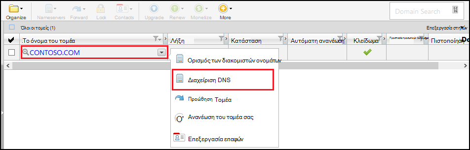
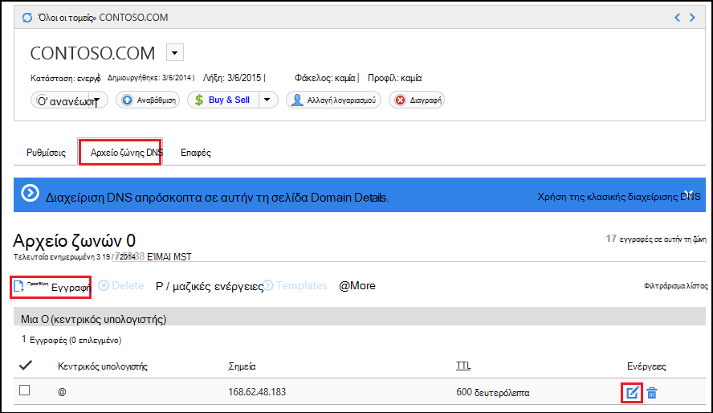
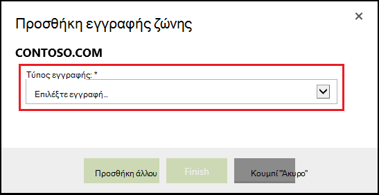
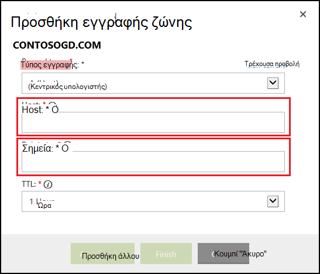

<properties
    pageTitle="Ρύθμιση των παραμέτρων ενός προσαρμοσμένου ονόματος τομέα στο Azure εφαρμογής υπηρεσίας (GoDaddy)"
    description="Μάθετε πώς μπορείτε να χρησιμοποιήσετε ένα όνομα τομέα από το GoDaddy με το Azure Web Apps"
    services="app-service"
    documentationCenter=""
    authors="erikre"
    manager="wpickett"
    editor="jimbe"/>

<tags
    ms.service="app-service"
    ms.workload="na"
    ms.tgt_pltfrm="na"
    ms.devlang="na"
    ms.topic="article"
    ms.date="01/12/2016"
    ms.author="cephalin"/>

# Ρύθμιση των παραμέτρων ενός προσαρμοσμένου ονόματος τομέα στο Azure εφαρμογής υπηρεσίας (αγοράστηκε απευθείας από το GoDaddy)

[AZURE.INCLUDE [web-selector](../../includes/websites-custom-domain-selector.md)]

[AZURE.INCLUDE [intro](../../includes/custom-dns-web-site-intro.md)]

Εάν έχετε αγοράσει τομέα μέσω του Azure εφαρμογής υπηρεσίας Web Apps, στη συνέχεια, ανατρέξτε στο τελικό βήμα [Αγορά τομέα για τις εφαρμογές Web](custom-dns-web-site-buydomains-web-app.md).

Σε αυτό το άρθρο παρέχει οδηγίες σχετικά με τη χρήση προσαρμοσμένου ονόματος τομέα που αγοράστηκε απευθείας από το [GoDaddy](https://godaddy.com) με [Εφαρμογή υπηρεσίας Web Apps](http://go.microsoft.com/fwlink/?LinkId=529714).

[AZURE.INCLUDE [introfooter](../../includes/custom-dns-web-site-intro-notes.md)]

##Κατανόηση των εγγραφών DNS

[AZURE.INCLUDE [understandingdns](../../includes/custom-dns-web-site-understanding-dns-raw.md)]

## Προσθήκη μιας εγγραφής DNS για τον προσαρμοσμένο τομέα σας

Για να συσχετίσετε τον προσαρμοσμένο τομέα σας με μια εφαρμογή web στην εφαρμογή υπηρεσίας, που πρέπει να προσθέσετε μια νέα εγγραφή στον πίνακα DNS για τον προσαρμοσμένο τομέα σας χρησιμοποιώντας τα εργαλεία που παρέχονται από το GoDaddy. Χρησιμοποιήστε τα ακόλουθα βήματα για να εντοπίσετε τα εργαλεία DNS για GoDaddy.com

1. Συνδεθείτε στο λογαριασμό σας με GoDaddy.com και επιλέξτε **Ο λογαριασμός μου** και, στη συνέχεια, να **διαχειριστείτε τομείς μου**. Τέλος, επιλέξτε το αναπτυσσόμενο μενού για το όνομα τομέα που θέλετε να χρησιμοποιήσετε με το Azure web app και επιλέξτε **Διαχείριση DNS**.

    

2. Από τη σελίδα **λεπτομερειών τομέα** , μεταβείτε με κύλιση στην καρτέλα **DNS Zone File** . Αυτή είναι η ενότητα που χρησιμοποιείται για την προσθήκη και τροποποίηση εγγραφές DNS για το όνομα του τομέα σας.

    

    Επιλέξτε **Add Record** για να προσθέσετε μια υπάρχουσα εγγραφή.

    Για να **επεξεργαστείτε** μια υπάρχουσα εγγραφή, επιλέξτε το εικονίδιο πένα & χαρτιού βρίσκεται δίπλα στην καρτέλα.

    > [AZURE.NOTE] Πριν να προσθέσετε νέες εγγραφές, σημειώστε ότι GoDaddy έχει ήδη δημιουργήσει εγγραφές DNS για δημοφιλείς υποτομείς (που ονομάζεται **κεντρικός υπολογιστής** στο πρόγραμμα επεξεργασίας,) όπως **ηλεκτρονικού ταχυδρομείου**, **αρχεία**, **Αλληλογραφία**και άλλα άτομα. Εάν το όνομα που θέλετε να χρησιμοποιήσετε ήδη υπάρχει, τροποποιήστε την υπάρχουσα εγγραφή αντί να δημιουργήσετε ένα νέο.

4. Κατά την προσθήκη μιας εγγραφής, πρέπει πρώτα να επιλέξετε τον τύπο εγγραφής.

    

    Στη συνέχεια, πρέπει να δώσετε τον **κεντρικό υπολογιστή** (το προσαρμοσμένο τομέα ή υποτομέα) και αυτό που **σημεία**.

    

    * Κατά την προσθήκη μιας **εγγραφής (κεντρικός υπολογιστής)** - πρέπει να ορίσετε το πεδίο **Host** είτε **@** (αντιπροσωπεύει όνομα ριζικού τομέα, όπως **contoso.com**,) *(χαρακτήρας μπαλαντέρ για τη συμφωνία πολλούς δευτερεύοντες τομείς,) ή τον υποτομέα που θέλετε να χρησιμοποιήσετε (για παράδειγμα, * *www**.) Πρέπει να ορίσετε το * *σημεία** πεδίο στη διεύθυνση IP της εφαρμογής Azure web.

    * Κατά την προσθήκη μιας **εγγραφής CNAME (alias)** - πρέπει να ορίσετε το πεδίο **κεντρικού υπολογιστή** για να τον υποτομέα που θέλετε να χρησιμοποιήσετε. Για παράδειγμα, **www**. Πρέπει να ορίσετε το πεδίο **σημεία** του **. azurewebsites.net** το όνομα τομέα της εφαρμογής Azure web. Για παράδειγμα, **contoso.azurewebsites.net**.

5. Κάντε κλικ στο κουμπί **Προσθήκη άλλου**.
6. Επιλέξτε **TXT** ως τύπο εγγραφής και, στη συνέχεια, καθορίστε μια τιμή **Host** **@** και μια τιμή **σημεία** ** &lt;yourwebappname&gt;. azurewebsites.net**.

    > [AZURE.NOTE] Αυτήν την εγγραφή TXT χρησιμοποιείται από Azure για την επικύρωση ότι είστε κάτοχος του τομέα που περιγράφεται από της εγγραφής A ή της πρώτης εγγραφής TXT. Όταν ο τομέας έχει αντιστοιχιστεί σε εφαρμογή web στην πύλη του Azure, μπορούν να καταργηθούν αυτή την καταχώρηση εγγραφής TXT.

5. Όταν έχετε ολοκληρώσει την προσθήκη ή τροποποίηση εγγραφών, κάντε κλικ στο κουμπί **Τέλος** για να αποθηκεύσετε τις αλλαγές.

## Ενεργοποίηση του ονόματος τομέα στην εφαρμογή web της

[AZURE.INCLUDE [modes](../../includes/custom-dns-web-site-enable-on-web-site.md)]

>[AZURE.NOTE] Εάν θέλετε να γρήγορα αποτελέσματα με το Azure εφαρμογής υπηρεσίας πριν από την εγγραφή για λογαριασμό Azure, μεταβείτε στο [Δοκιμάστε εφαρμογής υπηρεσίας](http://go.microsoft.com/fwlink/?LinkId=523751), όπου μπορείτε να αμέσως δημιουργήσετε μια εφαρμογή web μικρής διάρκειας starter στην εφαρμογή υπηρεσίας. Δεν υπάρχει πιστωτικές κάρτες υποχρεωτικό, χωρίς δεσμεύσεις.

## Τι έχει αλλάξει
* Για οδηγίες για την αλλαγή από τοποθεσίες Web App υπηρεσία ανατρέξτε στο θέμα: [Azure εφαρμογής υπηρεσίας και τον αντίκτυπο σχετικά με τις υπάρχουσες υπηρεσίες Azure](http://go.microsoft.com/fwlink/?LinkId=529714)
