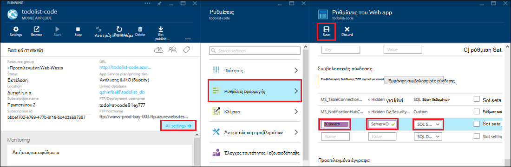

<properties 
    pageTitle="Πρόσβαση σε πόρους στην εσωτερική εγκατάσταση χρήση υβριδική συνδέσεις σε Azure εφαρμογής υπηρεσίας" 
    description="Δημιουργήστε μια σύνδεση ανάμεσα σε μια εφαρμογή web στο Azure εφαρμογής υπηρεσίας και ένας πόρος εσωτερικής εγκατάστασης που χρησιμοποιεί μια στατική θύρα TCP" 
    services="app-service" 
    documentationCenter="" 
    authors="cephalin" 
    manager="wpickett" 
    editor="mollybos"/>

<tags 
    ms.service="app-service" 
    ms.workload="na" 
    ms.tgt_pltfrm="na" 
    ms.devlang="na" 
    ms.topic="article" 
    ms.date="02/03/2016" 
    ms.author="cephalin"/>

#Πρόσβαση σε πόρους στην εσωτερική εγκατάσταση χρήση υβριδική συνδέσεις σε Azure εφαρμογής υπηρεσίας

Μπορείτε να συνδέσετε μια εφαρμογή Azure εφαρμογής υπηρεσίας σε κάθε πόρο εσωτερικής εγκατάστασης που χρησιμοποιεί μια στατική θύρα TCP, όπως SQL Server, MySQL, HTTP Web APIs και οι περισσότερες υπηρεσίες Web του προσαρμοσμένου. Σε αυτό το άρθρο σάς δείχνει πώς μπορείτε να δημιουργήσετε μια σύνδεση υβριδική μεταξύ της εφαρμογής υπηρεσίας και μια βάση δεδομένων SQL Server εσωτερικής εγκατάστασης.

> [AZURE.NOTE] Το τμήμα Web Apps της δυνατότητας υβριδική συνδέσεις είναι διαθέσιμη μόνο στην [Πύλη του Azure](https://portal.azure.com). Για να δημιουργήσετε μια σύνδεση στις υπηρεσίες BizTalk, ανατρέξτε στο θέμα [Υβριδική συνδέσεις](http://go.microsoft.com/fwlink/p/?LinkID=397274). 
> 
> Αυτό το περιεχόμενο ισχύει επίσης για τις εφαρμογές του Mobile στο Azure εφαρμογής υπηρεσίας. 

## Προαπαιτούμενα στοιχεία
- Μια συνδρομή του Azure. Για μια δωρεάν συνδρομή, ανατρέξτε στο θέμα [Azure δωρεάν δοκιμαστικής έκδοσης](https://azure.microsoft.com/pricing/free-trial/). 
 
    Εάν θέλετε να γρήγορα αποτελέσματα με το Azure εφαρμογής υπηρεσίας πριν από την εγγραφή για λογαριασμό Azure, μεταβείτε στο [Δοκιμάστε εφαρμογής υπηρεσίας](http://go.microsoft.com/fwlink/?LinkId=523751), όπου μπορείτε να αμέσως δημιουργήσετε μια εφαρμογή web μικρής διάρκειας starter στην εφαρμογή υπηρεσίας. Δεν υπάρχει πιστωτικές κάρτες υποχρεωτικό, χωρίς δεσμεύσεις.

- Για να χρησιμοποιήσετε μια βάση δεδομένων SQL Server ή SQL Server Express εσωτερικής εγκατάστασης με σύνδεση υβριδική, TCP/IP πρέπει να είναι ενεργοποιημένη σε μια στατική θύρα. Μια προεπιλεγμένη παρουσία στον SQL Server συνιστάται η χρήση επειδή χρησιμοποιεί στατική θύρα 1433. Για πληροφορίες σχετικά με την εγκατάσταση και ρύθμιση παραμέτρων SQL Server Express για χρήση με τις υβριδικές συνδέσεις, ανατρέξτε στο θέμα [σύνδεση σε έναν SQL Server εσωτερικής εγκατάστασης από Azure τοποθεσία web με χρήση υβριδική συνδέσεις](http://go.microsoft.com/fwlink/?LinkID=397979).

- Ο υπολογιστής στον οποίο εγκαθιστάτε τον παράγοντα διαχείρισης σύνδεσης υβριδική εσωτερικής εγκατάστασης που περιγράφεται παρακάτω σε αυτό το άρθρο:

    - Πρέπει να μπορείτε να συνδεθείτε στο Azure μέσω της θύρας 5671
    - Πρέπει να μπορούν να αποκτήσουν το *όνομα κεντρικού υπολογιστή*:*αριθμός_θύρας* του πόρου εσωτερικής εγκατάστασης. 

> [AZURE.NOTE] Τα βήματα σε αυτό το άρθρο προϋποθέτουν ότι χρησιμοποιείτε το πρόγραμμα περιήγησης από τον υπολογιστή που θα φιλοξενήσει τον παράγοντα σύνδεσης υβριδική εσωτερικής εγκατάστασης.

## Δημιουργία εφαρμογής web στην πύλη του Azure ##

> [AZURE.NOTE] Εάν έχετε ήδη δημιουργήσει μια εφαρμογή web ή εφαρμογή Mobile παρασκηνίου στην πύλη του Azure που θέλετε να χρησιμοποιήσετε για αυτό το πρόγραμμα εκμάθησης, μπορείτε να παραλείψετε προς τα εμπρός για να [δημιουργήσετε μια σύνδεση υβριδική και μια υπηρεσία BizTalk](#CreateHC) και να ξεκινήσετε από εκεί.

1. Στην επάνω αριστερή γωνία της [Πύλης Azure](https://portal.azure.com), κάντε κλικ στην επιλογή **Δημιουργία** > **Web + Mobile** > **Web App**.
    
    ![Νέα εφαρμογή web][NewWebsite]
    
2. Στην blade την **εφαρμογή Web** , παρέχει μια διεύθυνση URL και κάντε κλικ στην επιλογή **Δημιουργία**. 
    
    ![Όνομα τοποθεσίας Web][WebsiteCreationBlade]
    
3. Μετά από μερικά λεπτά, η εφαρμογή web δημιουργείται και εμφανίζεται το blade εφαρμογής web. Το blade είναι ένας πίνακας εργαλείων κατακόρυφα κυλιόμενο που σας επιτρέπει να διαχειριστείτε την τοποθεσία σας.
    
    ![Τοποθεσία Web που εκτελείται][WebSiteRunningBlade]
    
4. Για να επιβεβαιώσετε την τοποθεσία είναι ενεργή, μπορείτε να κάνετε κλικ στο εικονίδιο **Αναζήτηση** για να εμφανίσετε την προεπιλεγμένη σελίδα.
    
    ![Κάντε κλικ στο κουμπί Αναζήτηση για να δείτε την εφαρμογή web][Browse]
    
    ![Προεπιλεγμένη σελίδα εφαρμογής web][DefaultWebSitePage]
    
Στη συνέχεια, θα δημιουργήσετε μια σύνδεση υβριδική και μια υπηρεσία BizTalk για την εφαρμογή web.

## Δημιουργήστε μια σύνδεση υβριδική και μια υπηρεσία BizTalk ##

1. Στο σας blade εφαρμογής web, κάντε κλικ στην επιλογή σε **όλες τις ρυθμίσεις** > **δίκτυο** > **Ρύθμιση παραμέτρων του υβριδικού τα τελικά σημεία σύνδεσης**.
    
    ![Υβριδική συνδέσεις][CreateHCHCIcon]
    
2. Στην blade συνδέσεις του υβριδικού, κάντε κλικ στην επιλογή **Προσθήκη**.
    
    <!-- ![Add a hybrid connnection][CreateHCAddHC]
-->
    
3. Ανοίγει η **Προσθήκη μιας σύνδεσης υβριδική** blade.  Επειδή αυτή είναι η πρώτη σας σύνδεση υβριδική, προεπιλέξει στην επιλογή **νέα σύνδεση υβριδική** και τη **Δημιουργία υβριδικού σύνδεσης** blade ανοίγει για εσάς.
    
    ![Δημιουργία σύνδεσης υβριδική][TwinCreateHCBlades]
    
    Στη **Δημιουργία υβριδικού σύνδεσης blade**:
    - Για το **όνομα**, δώστε ένα όνομα για τη σύνδεση.
    - Για **όνομα κεντρικού υπολογιστή**, πληκτρολογήστε το όνομα του υπολογιστή εσωτερικής εγκατάστασης που φιλοξενεί τον πόρο.
    - Για τη **θύρα**, πληκτρολογήστε τον αριθμό θύρας που χρησιμοποιείται από τον πόρο στην εσωτερική εγκατάσταση (1433 για μια προεπιλεγμένη παρουσία του SQL Server).
    - Κάντε κλικ στην επιλογή **επιχειρήσεις μιλήσετε υπηρεσίας**

4. Ανοίγει η **Δημιουργία υπηρεσίας BizTalk** blade. Πληκτρολογήστε ένα όνομα για την υπηρεσία BizTalk και, στη συνέχεια, κάντε κλικ στο κουμπί **OK**.
    
    ![Δημιουργία BizTalk υπηρεσίας][CreateHCCreateBTS]
    
    Η **Δημιουργία υπηρεσίας BizTalk** blade κλείνει και επιστρέφετε στο blade τη **Δημιουργία υβριδικού σύνδεσης** .
    
5. Στην τη δημιουργία υβριδικού σύνδεσης blade, κάντε κλικ στο κουμπί **OK**. 
    
    ![Κάντε κλικ στο κουμπί OK][CreateBTScomplete]
    
6. Όταν ολοκληρωθεί η διαδικασία, στην περιοχή ειδοποιήσεων στην πύλη του σάς ενημερώνει ότι η σύνδεση δημιουργήθηκε με επιτυχία.
    <!---TODO

    Όλα τα στοιχεία αποτυγχάνει σε αυτό το βήμα. Δεν μπορώ να δημιουργήσω μια υπηρεσία BizTalk στην πύλη του dogfood. Να μεταβείτε στην πύλη κλασική (πλήρης πύλης) και δημιούργησε την υπηρεσία BizTalk, αλλά αυτό δεν φαίνεται να σάς επιτρέπουν να λειτουργία τους - όταν ολοκληρώσετε το βήμα δημιουργία υβριδικού στήλη, λαμβάνετε το ακόλουθο σφάλμα απέτυχε για να δημιουργήσετε σύνδεση υβριδική RelecIoudHC. Ο τύπος πόρου δεν ήταν δυνατή η εύρεση στο χώρο ονομάτων 'Microsoft.BizTaIkServices για το api έκδοση 2014-06-01'.
    
    Το σφάλμα υποδεικνύει δεν ήταν δυνατό να εντοπίσει τον τύπο, όχι την παρουσία.
    ![Ειδοποίηση επιτυχίας][CreateHCSuccessNotification]
    -->
7. Στην blade του web app, το εικονίδιο **υβριδική συνδέσεων** εμφανίζει τώρα ότι έχει δημιουργηθεί 1 υβριδική σύνδεσης.
    
    ![Σύνδεση ενός υβριδικού που δημιουργήσατε][CreateHCOneConnectionCreated]
    
Σε αυτό το σημείο, έχετε ολοκληρώσει ένα σημαντικό μέρος της υποδομής cloud υβριδική σύνδεσης. Στη συνέχεια, θα δημιουργήσετε μια αντίστοιχη τμήμα εσωτερικής εγκατάστασης.

## Εγκατάσταση της διαχείρισης σύνδεσης υβριδική εσωτερικής εγκατάστασης για την ολοκλήρωση της σύνδεσης ##

1. Στην blade του web app, κάντε κλικ στην επιλογή **όλες οι ρυθμίσεις** > **δίκτυο** > **Ρύθμιση παραμέτρων του υβριδικού τα τελικά σημεία σύνδεσης**. 
    
    ![Εικονίδιο συνδέσεις υβριδική][HCIcon]
    
2. Στην την **υβριδική συνδέσεις** blade, τη στήλη **κατάσταση** για το τελικό σημείο που προστέθηκαν πρόσφατα εμφανίζει **δεν είστε συνδεδεμένοι**. Κάντε κλικ στη σύνδεση για να ρυθμίσετε τις παραμέτρους της.
    
    ![Δεν είστε συνδεδεμένοι][NotConnected]
    
    Ανοίγει η υβριδική blade σύνδεσης.
    
    ![NotConnectedBlade][NotConnectedBlade]
    
3. Στην το blade, κάντε κλικ στην επιλογή **Ακρόασης εγκατάστασης**.
    
    ![Κάντε κλικ στην επιλογή ρύθμιση ακρόασης][ClickListenerSetup]
    
4. Ανοίγει το blade **υβριδική ιδιότητες σύνδεσης** . Στην περιοχή **Διαχείριση σύνδεσης υβριδική εσωτερικής εγκατάστασης**, επιλέξτε **κάντε κλικ εδώ για να εγκαταστήσετε**.
    
    ![Κάντε κλικ εδώ για να εγκαταστήσετε το][ClickToInstallHCM]
    
5. Στο η εφαρμογή εκτελείται, παράθυρο διαλόγου προειδοποίησης ασφαλείας, επιλέξτε **Εκτέλεση** για να συνεχίσετε.
    
    ![Επιλέξτε εκτέλεση για να συνεχίσετε][ApplicationRunWarning]
    
6.  Στο παράθυρο διαλόγου **Έλεγχος λογαριασμού χρήστη** , επιλέξτε **Ναι**.
    
    ![Επιλέξτε "Ναι"][UAC]
    
7. Στη Διαχείριση σύνδεσης υβριδική γίνεται λήψη και εγκατάσταση για εσάς. 
    
    ![Κατά την εγκατάσταση][HCMInstalling]
    
8. Όταν ολοκληρωθεί η εγκατάσταση, κάντε κλικ στο κουμπί **Κλείσιμο**.
    
    ![Κάντε κλικ στο κουμπί Κλείσιμο][HCMInstallComplete]
    
    Στην το blade **υβριδική συνδέσεις** , στη στήλη **κατάσταση** εμφανίζει τώρα **σύνδεση**. 
    
    ![Συνδεδεμένο κατάστασης][HCStatusConnected]

Τώρα που η υποδομή υβριδική σύνδεσης έχει ολοκληρωθεί, μπορείτε να δημιουργήσετε μια εφαρμογή υβριδική που χρησιμοποιεί το. 

>[AZURE.NOTE]Οι ενότητες που ακολουθούν δείχνουν πώς μπορείτε να χρησιμοποιήσετε μια σύνδεση υβριδική με ένα έργο παρασκηνίου .NET εφαρμογές του Mobile.

## Ρύθμιση παραμέτρων του έργου παρασκηνίου Mobile App .NET για να συνδεθείτε στη βάση δεδομένων του SQL Server

Στην εφαρμογή υπηρεσίας, ένα έργο παρασκηνίου .NET εφαρμογές του Mobile είναι απλώς μια εφαρμογή web ASP.NET με μια επιπλέον SDK εφαρμογές του Mobile, εγκατάσταση και προετοιμασία της. Για να χρησιμοποιήσετε την εφαρμογή web της ως έναν υπολογιστή στο παρασκήνιο εφαρμογές του Mobile, πρέπει να [κάνετε λήψη και προετοιμασία του υπολογιστή στο παρασκήνιο .NET εφαρμογές του Mobile SDK](../app-service-mobile/app-service-mobile-dotnet-backend-how-to-use-server-sdk.md#install-sdk).  

Για τις εφαρμογές του Mobile, πρέπει επίσης να ορίσετε μια συμβολοσειρά σύνδεσης για τη βάση δεδομένων εσωτερικής εγκατάστασης και τροποποίηση υπόβαθρο για να χρησιμοποιήσετε αυτήν τη σύνδεση. 

1. Στην Εξερεύνηση λύσεων στο Visual Studio, ανοίξτε το αρχείο Web.config για το Mobile App .NET παρασκηνίου, εντοπίστε την ενότητα **connectionStrings** , προσθέστε μια νέα καταχώρηση SqlClient όπως τα ακόλουθα, τα οποία αναφέρεται στη βάση δεδομένων SQL Server εσωτερικής εγκατάστασης:

        <add name="OnPremisesDBConnection"
         connectionString="Data Source=OnPremisesServer,1433;
         Initial Catalog=OnPremisesDB;
         User ID=HybridConnectionLogin;
         Password=<**secure_password**>;
         MultipleActiveResultSets=True"
         providerName="System.Data.SqlClient" />

    Μην ξεχάσετε να αντικαταστήσετε `<**secure_password**>` σε αυτήν τη συμβολοσειρά με τον κωδικό πρόσβασης που δημιουργήσατε για *HybridConnectionLogin*.

3. Κάντε κλικ στην επιλογή **Αποθήκευση** στο Visual Studio για να αποθηκεύσετε το αρχείο Web.config.

    > [AZURE.NOTE]Αυτήν τη ρύθμιση σύνδεσης χρησιμοποιείται κατά την εκτέλεση στον τοπικό υπολογιστή. Όταν εκτελείται στο Azure, αυτή η ρύθμιση είναι Αντικατάσταση κατά τη ρύθμιση σύνδεσης που έχει οριστεί στην πύλη.

4. Αναπτύξτε το φάκελο **μοντέλα** και ανοίξτε το αρχείο μοντέλου δεδομένων, η οποία λήγει σε *Context.cs*.

6. Τροποποιήστε την κατασκευή παρουσίας **DbContext** να μεταβιβάσετε την τιμή `OnPremisesDBConnection` στην βάσης κατασκευή **DbContext** , παρόμοια με το παρακάτω τμήμα κώδικα:

        public class hybridService1Context : DbContext
        {
            public hybridService1Context()
                : base("OnPremisesDBConnection")
            {
            }
        }

    Η υπηρεσία τώρα θα χρησιμοποιήσει τη νέα σύνδεση στη βάση δεδομένων του SQL Server.

## Ενημέρωση υπόβαθρο εφαρμογή Mobile για να χρησιμοποιήσετε τη συμβολοσειρά σύνδεσης εσωτερικής εγκατάστασης

Στη συνέχεια, πρέπει να προσθέσετε μια ρύθμιση εφαρμογής για αυτήν τη νέα συμβολοσειρά σύνδεσης, ώστε να μπορεί να χρησιμοποιηθεί από το Azure.  

1. Επιστροφή στην [πύλη του Azure](https://portal.azure.com) στον κώδικα παρασκηνίου εφαρμογής web για την εφαρμογή Mobile, κάντε κλικ στην επιλογή **όλες οι ρυθμίσεις**, στη συνέχεια, **Ρυθμίσεις εφαρμογής**.

3. Στη το blade **των ρυθμίσεων της εφαρμογής Web** , κάντε κύλιση προς τα κάτω σε **συμβολοσειρές σύνδεσης** και να προσθέσετε μια νέα συμβολοσειρά σύνδεσης **SQL Server** με το όνομα `OnPremisesDBConnection` με μια τιμή όπως η `Server=OnPremisesServer,1433;Database=OnPremisesDB;User ID=HybridConnectionsLogin;Password=<**secure_password**>`.

    Αντικατάσταση `<**secure_password**>` με ασφαλή κωδικό πρόσβασης για τη βάση δεδομένων εσωτερικής εγκατάστασης.

    

2. Πατήστε **Αποθήκευση** για να αποθηκεύσετε την υβριδική σύνδεση και τη συμβολοσειρά σύνδεσης που μόλις δημιουργήσατε.

Σε αυτό το σημείο μπορείτε να δημοσιεύσετε ξανά το project server και να ελέγξετε τη νέα σύνδεση με τους πελάτες σας υπάρχουσες εφαρμογές του Mobile. Τα δεδομένα θα διαβάσει από και εγγραφής στη βάση δεδομένων εσωτερικής εγκατάστασης χρησιμοποιώντας τη σύνδεση υβριδική.

## Επόμενα βήματα ##

- Για πληροφορίες σχετικά με τη δημιουργία μιας εφαρμογής web ASP.NET που χρησιμοποιεί μια σύνδεση υβριδική, ανατρέξτε στο θέμα [σύνδεση σε έναν SQL Server εσωτερικής εγκατάστασης από Azure τοποθεσία web με χρήση υβριδική συνδέσεις](http://go.microsoft.com/fwlink/?LinkID=397979). 

### Πρόσθετοι πόροι

[Επισκόπηση των συνδέσεων υβριδική](http://go.microsoft.com/fwlink/p/?LinkID=397274)

[Δυνατότητες Αλέξανδρος παρουσιάζει υβριδική συνδέσεις (9 καναλιού βίντεο)](http://channel9.msdn.com/Shows/Azure-Friday/Josh-Twist-introduces-hybrid-connections)

[Τοποθεσία web του υβριδικού συνδέσεις](https://azure.microsoft.com/services/biztalk-services/)

[BizTalk υπηρεσίες: Καρτέλες πίνακα εργαλείων, οθόνη, κλίμακα, ρύθμιση παραμέτρων και σύνδεση υβριδική](../biztalk-services/biztalk-dashboard-monitor-scale-tabs.md)

[Δημιουργία μιας Cloud υβριδική ρεαλιστικό με δυνατότητα μεταφοράς απρόσκοπτη εφαρμογή (9 καναλιού βίντεο)](http://channel9.msdn.com/events/TechEd/NorthAmerica/2014/DCIM-B323#fbid=)

[Σύνδεση με μια SQL Server εσωτερικής εγκατάστασης από υπηρεσίες Mobile Azure χρησιμοποιώντας συνδέσεις υβριδική (9 καναλιού βίντεο)](http://channel9.msdn.com/Series/Windows-Azure-Mobile-Services/Connect-to-an-on-premises-SQL-Server-from-Azure-Mobile-Services-using-Hybrid-Connections)

## Τι έχει αλλάξει
* Για οδηγίες για την αλλαγή από τοποθεσίες Web App υπηρεσία ανατρέξτε στο θέμα: [Azure εφαρμογής υπηρεσίας και τον αντίκτυπο σχετικά με τις υπάρχουσες υπηρεσίες Azure](http://go.microsoft.com/fwlink/?LinkId=529714)

<!-- IMAGES -->
[New]:./media/web-sites-hybrid-connection-get-started/B01New.png
[NewWebsite]:./media/web-sites-hybrid-connection-get-started/B02NewWebsite.png
[WebsiteCreationBlade]:./media/web-sites-hybrid-connection-get-started/B03WebsiteCreationBlade.png
[WebSiteRunningBlade]:./media/web-sites-hybrid-connection-get-started/B04WebSiteRunningBlade.png
[Browse]:./media/web-sites-hybrid-connection-get-started/B05Browse.png
[DefaultWebSitePage]:./media/web-sites-hybrid-connection-get-started/B06DefaultWebSitePage.png
[CreateHCHCIcon]:./media/web-sites-hybrid-connection-get-started/C01CreateHCHCIcon.png
[CreateHCAddHC]:./media/web-sites-hybrid-connection-get-started/C02CreateHCAddHC.png
[TwinCreateHCBlades]:./media/web-sites-hybrid-connection-get-started/C03TwinCreateHCBlades.png
[CreateHCCreateBTS]:./media/web-sites-hybrid-connection-get-started/C04CreateHCCreateBTS.png
[CreateBTScomplete]:./media/web-sites-hybrid-connection-get-started/C05CreateBTScomplete.png
[CreateHCSuccessNotification]:./media/web-sites-hybrid-connection-get-started/C06CreateHCSuccessNotification.png
[CreateHCOneConnectionCreated]:./media/web-sites-hybrid-connection-get-started/C07CreateHCOneConnectionCreated.png
[HCIcon]:./media/web-sites-hybrid-connection-get-started/D01HCIcon.png
[NotConnected]:./media/web-sites-hybrid-connection-get-started/D02NotConnected.png
[NotConnectedBlade]:./media/web-sites-hybrid-connection-get-started/D03NotConnectedBlade.png
[ClickListenerSetup]:./media/web-sites-hybrid-connection-get-started/D04ClickListenerSetup.png
[ClickToInstallHCM]:./media/web-sites-hybrid-connection-get-started/D05ClickToInstallHCM.png
[ApplicationRunWarning]:./media/web-sites-hybrid-connection-get-started/D06ApplicationRunWarning.png
[UAC]:./media/web-sites-hybrid-connection-get-started/D07UAC.png
[HCMInstalling]:./media/web-sites-hybrid-connection-get-started/D08HCMInstalling.png
[HCMInstallComplete]:./media/web-sites-hybrid-connection-get-started/D09HCMInstallComplete.png
[HCStatusConnected]:./media/web-sites-hybrid-connection-get-started/D10HCStatusConnected.png
 