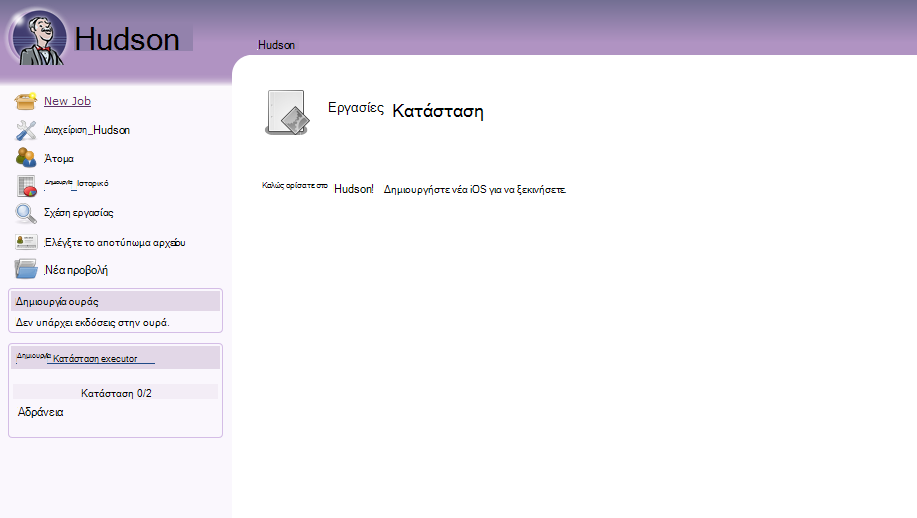

<properties 
    pageTitle="Αποστολή προσαρμοσμένης εφαρμογής web Java Azure" 
    description="Αυτό το πρόγραμμα εκμάθησης δείχνει πώς μπορείτε να στείλετε μια προσαρμοσμένη εφαρμογή web Java σε Azure εφαρμογής υπηρεσίας Web Apps." 
    services="app-service\web" 
    documentationCenter="java" 
    authors="rmcmurray" 
    manager="wpickett" 
    editor=""/>

<tags 
    ms.service="app-service-web" 
    ms.workload="web" 
    ms.tgt_pltfrm="na" 
    ms.devlang="Java" 
    ms.topic="article" 
    ms.date="08/11/2016" 
    ms.author="robmcm"/>

# Αποστολή προσαρμοσμένης εφαρμογής web Java Azure

Αυτό το θέμα εξηγεί τον τρόπο για να αποστείλετε μια προσαρμοσμένη εφαρμογή web Java στο [Azure εφαρμογής υπηρεσίας] Web Apps. Περιλαμβάνονται είναι πληροφορίες που ισχύουν για οποιαδήποτε εφαρμογή Java τοποθεσία Web ή web και επίσης ορισμένα παραδείγματα για συγκεκριμένες εφαρμογές.

Σημειώστε ότι Azure παρέχει τη δυνατότητα για τη δημιουργία εφαρμογών web Java με χρήση της ρύθμισης παραμέτρων της πύλης του Azure περιβάλλοντος εργασίας Χρήστη και το Azure Marketplace, όπως τεκμηριώνονται στο [δημιουργήσετε μια εφαρμογή web Java στο Azure εφαρμογής υπηρεσίας](web-sites-java-get-started.md). Αυτό το πρόγραμμα εκμάθησης είναι για σενάρια στην οποία δεν θέλετε να χρησιμοποιήσετε τη ρύθμιση παραμέτρων της πύλης Azure περιβάλλοντος εργασίας Χρήστη ή το Azure Marketplace.  

## Οδηγίες ρύθμισης παραμέτρων

Το παρακάτω περιγράφει τις ρυθμίσεις αναμένεται για προσαρμοσμένες εφαρμογές web Java σε Azure.

- Δυναμικά είναι αντιστοιχισμένος στη θύρα HTTP που χρησιμοποιείται από τη διαδικασία Java.  Η διαδικασία πρέπει να χρησιμοποιήσετε τη θύρα από τη μεταβλητή περιβάλλοντος `HTTP_PLATFORM_PORT`.
- Όλες οι θύρες ακρόαση εκτός από τη μία ακρόασης HTTP θα πρέπει να είναι απενεργοποιημένα.  Στο Tomcat, που περιλαμβάνει το τερματισμού HTTPS και AJP θύρες.
- Το κοντέινερ πρέπει να είναι διαμορφωμένη για την κυκλοφορία IPv4 μόνο.
- Η εντολή **εκκίνησης** για την εφαρμογή πρέπει να οριστεί στη ρύθμιση παραμέτρων.
- Εφαρμογές που απαιτούν καταλόγους με εγγραφή δικαιωμάτων πρέπει να βρίσκονται σε περιεχομένου καταλόγου το Azure web app, η οποία είναι **D:\home**.  Η μεταβλητή περιβάλλοντος `HOME` αναφέρεται σε D:\home.  

Μπορείτε να ορίσετε μεταβλητές περιβάλλοντος όπως απαιτείται στο αρχείο web.config.

## ρύθμιση παραμέτρων httpPlatform Web.config

Οι ακόλουθες πληροφορίες περιγράφει τη μορφή **httpPlatform** εντός web.config.
                                 
**ορίσματα** (Προεπιλεγμένη = ""). Ορίσματα για το εκτελέσιμο αρχείο ή δέσμη ενεργειών που καθορίζεται στη ρύθμιση **processPath** .

Παραδείγματα (απεικονίζεται με **processPath** περιλαμβάνονται):

    processPath="%HOME%\site\wwwroot\bin\tomcat\bin\catalina.bat"
    arguments="start"
    
    processPath="%JAVA_HOME\bin\java.exe"
    arguments="-Djava.net.preferIPv4Stack=true -Djetty.port=%HTTP\_PLATFORM\_PORT% -Djetty.base=&quot;%HOME%\site\wwwroot\bin\jetty-distribution-9.1.0.v20131115&quot; -jar &quot;%HOME%\site\wwwroot\bin\jetty-distribution-9.1.0.v20131115\start.jar&quot;"

**processPath** - διαδρομή προς το εκτελέσιμο αρχείο ή δέσμη ενεργειών που θα ξεκινήσει μια διαδικασία ακρόαση για αιτήσεις HTTP.

Παραδείγματα:

    processPath="%JAVA_HOME%\bin\java.exe"

    processPath="%HOME%\site\wwwroot\bin\tomcat\bin\startup.bat"

    processPath="%HOME%\site\wwwroot\bin\tomcat\bin\catalina.bat"
                                                                                       
**rapidFailsPerMinute** (Προεπιλεγμένη = 10.) Πόσες φορές η διαδικασία που καθορίζεται στο **processPath** επιτρέπεται να σφάλμα ανά λεπτό. Εάν υπάρχει υπέρβαση αυτό το όριο, **HttpPlatformHandler** θα σταματήσει εκκίνηση της διαδικασίας για το υπόλοιπο του λεπτού.
                                    
**requestTimeout** (Προεπιλεγμένη = "00: 02:00".) Για την οποία **HttpPlatformHandler** θα περιμένετε απάντηση από τη διαδικασία ακρόαση στη διάρκεια `%HTTP_PLATFORM_PORT%`.

**startupRetryCount** (Προεπιλεγμένη = 10.) Αριθμός των επαναλήψεων **HttpPlatformHandler** θα προσπαθήστε να εκκινήσετε τη διαδικασία που καθορίζεται στο **processPath**. Ανατρέξτε στο θέμα **startupTimeLimit** για περισσότερες λεπτομέρειες.

**startupTimeLimit** (Προεπιλεγμένη = 10 δευτερόλεπτα.) Διάρκεια για την οποία θα περιμένετε **HttpPlatformHandler** για το εκτελέσιμο αρχείο/δέσμη ενεργειών για να ξεκινήσετε μια διαδικασία ακρόαση στη θύρα.  Εάν το χρονικό όριο, **HttpPlatformHandler** θα τερματίσετε τη διαδικασία και προσπαθήστε να το εκκινήσετε ξανά **startupRetryCount** ώρες.
                                                                                      
**stdoutLogEnabled** (Προεπιλεγμένη = "true".) Εάν τιμή true, **stdout** και **stderr** για τη διαδικασία που καθορίζεται στη ρύθμιση **processPath** θα ανακατευθυνθείτε στο αρχείο που καθορίζεται στο **stdoutLogFile** (ανατρέξτε στην ενότητα **stdoutLogFile** ).
                                    
**stdoutLogFile** (Default="d:\home\LogFiles\httpPlatformStdout.log".) Απόλυτη διαδρομή για το αρχείο για το οποίο θα καταγραφούν **stdout** και **stderr** από τη διαδικασία που καθορίζεται στο **processPath** .
                                    
> [AZURE.NOTE] `%HTTP_PLATFORM_PORT%`είναι ένα ειδικό σύμβολο κράτησης θέσης που πρέπει να καθοριστεί είτε ως μέρος **των ορισμάτων** ή ως μέρος της λίστας **environmentVariables** **httpPlatform** . Αυτό θα αντικατασταθούν από μια θύρα εσωτερικά που δημιουργήθηκε από **HttpPlatformHandler** , έτσι ώστε η διαδικασία που καθορίζεται από **processPath** μπορούν να κάνουν ακρόαση σε αυτήν τη θύρα.

## Ανάπτυξη

Java εφαρμογές web που βασίζονται σε μπορούν να αναπτυχθούν εύκολα μέσω περισσότερες από τον ίδιο τρόπο που χρησιμοποιούνται με το Internet Information Services (IIS) σύμφωνα με τις εφαρμογές web.  FTP, Git και Kudu υποστηρίζονται ως μηχανισμοί ανάπτυξης, όπως είναι η ενσωματωμένη δυνατότητα SCM για τις εφαρμογές web. WebDeploy λειτουργεί ως πρωτόκολλο, ωστόσο, όπως Java δεν αναπτύσσεται στο Visual Studio, WebDeploy δεν ταιριάζουν με περιπτώσεις χρήσης της ανάπτυξης Java web app.

## Ρύθμιση παραμέτρων εφαρμογής παραδείγματα

Για τις παρακάτω εφαρμογές, ένα αρχείο web.config και την εφαρμογή ρύθμισης παραμέτρων παρέχεται ως παραδείγματα που δείχνουν πώς να ενεργοποιήσετε την εφαρμογή Java στην εφαρμογή υπηρεσίας Web Apps.

### Tomcat
Παρόλο που υπάρχουν δύο παραλλαγές Tomcat που παρέχονται με εφαρμογή υπηρεσίας Web Apps, εξακολουθεί να είναι αρκετά δυνατή η αποστολή συγκεκριμένες εμφανίσεις πελατών. Ακολουθεί ένα παράδειγμα μιας εγκατάστασης του Tomcat με μια διαφορετική εικονική μηχανή Java (JVM).

    <?xml version="1.0" encoding="UTF-8"?>
    <configuration>
      <system.webServer>
        <handlers>
          <add name="httpPlatformHandler" path="*" verb="*" modules="httpPlatformHandler" resourceType="Unspecified" />
        </handlers>
        <httpPlatform processPath="%HOME%\site\wwwroot\bin\tomcat\bin\startup.bat" 
            arguments="">
          <environmentVariables>
            <environmentVariable name="CATALINA_OPTS" value="-Dport.http=%HTTP_PLATFORM_PORT%" />
            <environmentVariable name="CATALINA_HOME" value="%HOME%\site\wwwroot\bin\tomcat" />
            <environmentVariable name="JRE_HOME" value="%HOME%\site\wwwroot\bin\java" /> <!-- optional, if not specified, this will default to %programfiles%\Java -->
            <environmentVariable name="JAVA_OPTS" value="-Djava.net.preferIPv4Stack=true" />
          </environmentVariables>
        </httpPlatform>
      </system.webServer>
    </configuration>

Από την πλευρά Tomcat, υπάρχουν ορισμένες αλλαγές ρύθμισης παραμέτρων που πρέπει να γίνουν. Το server.xml πρέπει να είναι δυνατή η επεξεργασία για να ορίσετε:

-   Θύρα τερματισμού = -1
-   Θύρα σύνδεσης HTTP = ${port.http}
-   Διεύθυνση σύνδεσης HTTP = "127.0.0.1"
-   Σχολιάσετε HTTPS και AJP γραμμές σύνδεσης
-   Μπορεί επίσης να οριστεί η ρύθμιση IPv4 στο αρχείο catalina.properties όπου μπορείτε να προσθέσετε`java.net.preferIPv4Stack=true`
    
Κλήσεις Direct3d δεν υποστηρίζονται στην εφαρμογή υπηρεσίας Web Apps. Για να απενεργοποιήσετε αυτές, προσθέστε την ακόλουθη επιλογή Java θα πρέπει να κάνετε την εφαρμογή σας κλήσεις αυτές:`-Dsun.java2d.d3d=false`

### Jetty

Όπως συμβαίνει για Tomcat, οι πελάτες να αποστείλετε τις δικές τους παρουσίες για Jetty. Στην περίπτωση εκτελείται η πλήρης εγκατάσταση Jetty, η ρύθμιση παραμέτρων θα μοιάζει κάπως έτσι:

    <?xml version="1.0" encoding="UTF-8"?>
    <configuration>
      <system.webServer>
        <handlers>
          <add name="httppPlatformHandler" path="*" verb="*" modules="httpPlatformHandler" resourceType="Unspecified" />
        </handlers>
        <httpPlatform processPath="%JAVA_HOME%\bin\java.exe" 
             arguments="-Djava.net.preferIPv4Stack=true -Djetty.port=%HTTP_PLATFORM_PORT% -Djetty.base=&quot;%HOME%\site\wwwroot\bin\jetty-distribution-9.1.0.v20131115&quot; -jar &quot;%HOME%\site\wwwroot\bin\jetty-distribution-9.1.0.v20131115\start.jar&quot;"
            startupTimeLimit="20"
          startupRetryCount="10"
          stdoutLogEnabled="true">
        </httpPlatform>
      </system.webServer>
    </configuration>

Πρέπει να αλλάξει σε το start.ini για να ορίσετε τη ρύθμιση παραμέτρων Jetty `java.net.preferIPv4Stack=true`.

### Springboot
Για να λάβετε μια Springboot εφαρμογή εκτελείται που πρέπει να αποστείλετε το αρχείο σας ΒΆΖΟ ή ΠΟΛΈΜΟΥ και προσθέστε το παρακάτω αρχείο web.config. Το αρχείο web.config τίθεται σε φάκελο wwwroot. Στο το αρχείο web.config προσαρμόστε τα ορίσματα να οδηγούν στο αρχείο σας ΒΆΖΟ, στο παράδειγμα που ακολουθεί το αρχείο ΒΆΖΟ βρίσκεται στο φάκελο wwwroot.  

    <?xml version="1.0" encoding="UTF-8"?>
    <configuration>
      <system.webServer>
        <handlers>
          <add name="httpPlatformHandler" path="*" verb="*" modules="httpPlatformHandler" resourceType="Unspecified" />
        </handlers>
        <httpPlatform processPath="%JAVA_HOME%\bin\java.exe"
            arguments="-Djava.net.preferIPv4Stack=true -Dserver.port=%HTTP_PLATFORM_PORT% -jar &quot;%HOME%\site\wwwroot\my-web-project.jar&quot;">
        </httpPlatform>
      </system.webServer>
    </configuration>

### Hudson

Μας δοκιμής χρησιμοποιούνται τα πολέμου Hudson 3.1.2 και την παρουσία Tomcat 7.0.50 προεπιλογή, αλλά χωρίς τη χρήση του περιβάλλοντος εργασίας Χρήστη για να ρυθμίσετε στοιχεία.  Επειδή Hudson είναι ένα λογισμικό δημιουργίας εργαλείο, συνιστάται να το εγκαταστήσετε σε αποκλειστική παρουσίες όπου η σημαία **AlwaysOn** μπορεί να οριστεί στην εφαρμογή web.

1. Στον ριζικό κατάλογο της εφαρμογής web σας, π.χ., **d:\home\site\wwwroot**, δημιουργήστε έναν κατάλογο **webapps** (Εάν δεν υπάρχουν ήδη) και τοποθετήστε Hudson.war στο **d:\home\site\wwwroot\webapps**.
2. Λήψη apache maven 3.0.5 (συμβατή με Hudson) και τοποθετήστε το στο **d:\home\site\wwwroot**.
3. Δημιουργία web.config στο **d:\home\site\wwwroot** και επικολλήστε τα περιεχόμενα του παρακάτω σε αυτό:
    
        <?xml version="1.0" encoding="UTF-8"?>
        <configuration>
          <system.webServer>
            <handlers>
              <add name="httppPlatformHandler" path="*" verb="*" 
        modules="httpPlatformHandler" resourceType="Unspecified" />
            </handlers>
            <httpPlatform processPath="%AZURE_TOMCAT7_HOME%\bin\startup.bat"
        startupTimeLimit="20"
        startupRetryCount="10">
        <environmentVariables>
          <environmentVariable name="HUDSON_HOME" 
        value="%HOME%\site\wwwroot\hudson_home" />
          <environmentVariable name="JAVA_OPTS" 
        value="-Djava.net.preferIPv4Stack=true -Duser.home=%HOME%/site/wwwroot/user_home -Dhudson.DNSMultiCast.disabled=true" />
        </environmentVariables>            
            </httpPlatform>
          </system.webServer>
        </configuration>

    Σε αυτό το σημείο μπορεί να γίνει επανεκκίνηση της εφαρμογής web να ακολουθήσετε τις αλλαγές.  Σύνδεση με http://yourwebapp/hudson για να ξεκινήσετε Hudson.

4. Αφού Hudson ρυθμίζει τις παραμέτρους της, θα πρέπει να βλέπετε την παρακάτω οθόνη:

    
    
5. Πρόσβαση στη σελίδα ρύθμισης παραμέτρων Hudson: κάντε κλικ στην επιλογή **Διαχείριση Hudson**και, στη συνέχεια, κάντε κλικ στην επιλογή **Ρύθμιση παραμέτρων του συστήματος**.
6. Ρυθμίστε τις παραμέτρους του JDK, όπως φαίνεται παρακάτω:

    

7. Ρύθμιση παραμέτρων Maven, όπως φαίνεται παρακάτω:

    

8. Αποθήκευση των ρυθμίσεων. Hudson πρέπει τώρα να ρυθμισμένη και έτοιμη για χρήση.

Για πρόσθετες πληροφορίες σχετικά με Hudson, ανατρέξτε στο θέμα [http://hudson-ci.org](http://hudson-ci.org).

### Liferay

Liferay υποστηρίζεται στην εφαρμογή υπηρεσίας Web Apps. Επειδή το Liferay μπορεί να απαιτούν σημαντική μνήμη, της εφαρμογής web πρέπει να εκτελέσετε στο μεσαίο ή μεγάλο αποκλειστικό εργαζόμενος, που μπορούν να παρέχουν αρκετή μνήμη. Liferay λαμβάνει επίσης αρκετά λεπτά για να ξεκινήσετε προς τα επάνω. Για αυτόν το λόγο, συνιστάται να ορίσετε την εφαρμογή web ώστε να είναι **Πάντα ανοιχτή**.  

Χρήση Liferay 6.1.2 GA3 Edition Κοινότητας μαζί με Tomcat, τα ακόλουθα αρχεία έγινε επεξεργασία μετά τη λήψη Liferay:

**Server.XML**

- Αλλάξτε τον τερματισμό θύρα σε -1.
- Αλλαγή HTTP γραμμή σύνδεσης      `<Connector port="${port.http}" protocol="HTTP/1.1" connectionTimeout="600000" address="127.0.0.1" URIEncoding="UTF-8" />`
- Σχόλιο από τη γραμμή σύνδεσης AJP.

Στο φάκελο **liferay\tomcat-7.0.40\webapps\ROOT\WEB-INF\classes** , δημιουργήστε ένα αρχείο με το όνομα **πύλης ext.properties**. Αυτό το αρχείο πρέπει να περιέχει μία γραμμή, όπως φαίνεται εδώ:

    liferay.home=%HOME%/site/wwwroot/liferay

Στο ίδιο επίπεδο καταλόγου ως φάκελο tomcat 7.0.40, δημιουργήστε ένα αρχείο με την ονομασία **web.config** με το παρακάτω περιεχόμενο:

    <?xml version="1.0" encoding="UTF-8"?>
    <configuration>
      <system.webServer>
        <handlers>
    <add name="httpPlatformHandler" path="*" verb="*"
         modules="httpPlatformHandler" resourceType="Unspecified" />
        </handlers>
        <httpPlatform processPath="%HOME%\site\wwwroot\tomcat-7.0.40\bin\catalina.bat" 
                      arguments="run" 
                      startupTimeLimit="10" 
                      requestTimeout="00:10:00" 
                      stdoutLogEnabled="true">
          <environmentVariables>
      <environmentVariable name="CATALINA_OPTS" value="-Dport.http=%HTTP_PLATFORM_PORT%" />
      <environmentVariable name="CATALINA_HOME" value="%HOME%\site\wwwroot\tomcat-7.0.40" />
            <environmentVariable name="JRE_HOME" value="D:\Program Files\Java\jdk1.7.0_51" /> 
            <environmentVariable name="JAVA_OPTS" value="-Djava.net.preferIPv4Stack=true" />
          </environmentVariables>
        </httpPlatform>
      </system.webServer>
    </configuration>

Στην περιοχή του μπλοκ **httpPlatform** , το **requestTimeout** έχει οριστεί σε "00: 10:00".  Μπορεί να μειωθεί, αλλά, στη συνέχεια, είναι πιθανό να δείτε ορισμένα σφάλματα χρονικού ορίου κατά την εκκίνηση Liferay.  Εάν αυτή η τιμή έχει αλλάξει, στη συνέχεια, το **connectionTimeout** στο το server.xml tomcat θα πρέπει να τροποποιηθούν.  

Είναι αξίζει να αναφερθούν ότι το varariable environnment JRE_HOME έχει καθοριστεί στο το παραπάνω web.config στην οποία θα οδηγεί η JDK 64-bit. Η προεπιλεγμένη τιμή είναι 32-bit, αλλά επειδή το Liferay μπορεί να απαιτεί υψηλού επιπέδου της μνήμης, συνιστάται να χρησιμοποιήσετε το JDK 64-bit.

Αφού κάνετε αυτές τις αλλαγές, επανεκκινήστε την εφαρμογή web της εκτελείται Liferay, στη συνέχεια, ανοίξτε http://yourwebapp. Η πύλη Liferay είναι διαθέσιμη από το ριζικό κατάλογο της εφαρμογής web. 

## Επόμενα βήματα

Για περισσότερες πληροφορίες σχετικά με το Liferay, ανατρέξτε στο θέμα [http://www.liferay.com](http://www.liferay.com).

Για περισσότερες πληροφορίες σχετικά με τη Java, ανατρέξτε στο [Κέντρο για προγραμματιστές Java](/develop/java/).

[AZURE.INCLUDE [app-service-web-whats-changed](../../includes/app-service-web-whats-changed.md)]

[AZURE.INCLUDE [app-service-web-try-app-service](../../includes/app-service-web-try-app-service.md)]
 
 
<!-- External Links -->
[Azure εφαρμογής υπηρεσίας]: http://go.microsoft.com/fwlink/?LinkId=529714
