<properties 
    pageTitle="Μετεγκατάσταση μια εφαρμογή web της εταιρείας στο Azure εφαρμογής υπηρεσίας" 
    description="Δείχνει πώς να χρησιμοποιείτε Web Apps μετεγκατάστασης του Βοηθού για τη μετεγκατάσταση γρήγορα υπάρχουσες τοποθεσίες Web στο Azure εφαρμογής υπηρεσίας Web Apps" 
    services="app-service" 
    documentationCenter="" 
    authors="cephalin" 
    writer="cephalin" 
    manager="wpickett" 
    editor=""/>

<tags 
    ms.service="app-service" 
    ms.workload="na" 
    ms.tgt_pltfrm="na" 
    ms.devlang="na" 
    ms.topic="article" 
    ms.date="07/01/2016" 
    ms.author="cephalin"/>

# Μετεγκατάσταση μια εφαρμογή web της εταιρείας στο Azure εφαρμογής υπηρεσίας

Μπορείτε εύκολα να μετεγκαταστήσετε τις υπάρχουσες τοποθεσίες Web που εκτελούνται στο Internet Information Service (IIS) 6 ή νεότερες εκδόσεις για να [Εφαρμογής υπηρεσίας Web Apps](http://go.microsoft.com/fwlink/?LinkId=529714). 

>[AZURE.IMPORTANT] Windows Server 2003 φτάσει τέλος της υποστήριξης σε 14 ΙΟΥΛΙΟΥ 2015. Εάν φιλοξενείτε αυτήν τη στιγμή τις τοποθεσίες Web των υπηρεσιών IIS διακομιστή που είναι Windows Server 2003, Web Apps είναι μια χαμηλού κινδύνου, χαμηλού κόστους, και χαμηλή τριβής τρόπος για να διατηρήσετε τις τοποθεσίες Web στο online και Web Apps μετεγκατάστασης Βοηθού μπορεί να σας βοηθήσει αυτοματοποίηση της διαδικασίας μετεγκατάστασης για εσάς. 

[Web Apps μετεγκατάστασης Βοηθός](https://www.movemetothecloud.net/) μπορεί να αναλύσετε την εγκατάσταση του διακομιστή των υπηρεσιών IIS, προσδιορίστε ποιες τοποθεσίες μπορείτε να μετεγκαταστήσετε στο εφαρμογής υπηρεσίας, επισήμανση οποιαδήποτε στοιχεία που δεν είναι δυνατή η μετεγκατάσταση ή δεν υποστηρίζονται στην πλατφόρμα και κατόπιν να μετεγκαταστήσετε τις τοποθεσίες Web και συσχετισμένες βάσεις δεδομένων Azure.

[AZURE.INCLUDE [app-service-web-to-api-and-mobile](../../includes/app-service-web-to-api-and-mobile.md)]

## Στοιχεία που έχει επαληθευτεί κατά την ανάλυση συμβατότητας ##
Το Βοηθό μετεγκατάστασης δημιουργεί μια αναφορά ετοιμότητας για να προσδιορίσετε τις πιθανές αιτίες για το πρόβλημα ή ζητήματα που εμποδίζουν που ενδέχεται να αποτρέπουν τη μια επιτυχημένη μετεγκατάσταση από εσωτερικής εγκατάστασης των υπηρεσιών IIS στο Azure εφαρμογής υπηρεσίας Web Apps. Ορισμένα από τα στοιχεία κλειδιού πρέπει να γνωρίζετε είναι:

-   Συνδέσεις θύρας – Web Apps υποστηρίζει μόνο θύρα 80 για HTTP και θύρα 443 για την κίνηση HTTPS. Ρύθμιση παραμέτρων διαφορετική θύρας θα αγνοούνται και κίνηση θα δρομολογούνται 80 ή 443. 
-   Έλεγχος ταυτότητας – Web Apps υποστηρίζει ανώνυμος έλεγχος ταυτότητας από προεπιλογή και ο έλεγχος ταυτότητας φορμών όπου που καθορίζονται από μια εφαρμογή του. Έλεγχος ταυτότητας των Windows μπορούν να χρησιμοποιηθούν από την ενοποίηση με το Azure Active Directory και ADFS μόνο. Όλες τις άλλες μορφές του ελέγχου ταυτότητας - για παράδειγμα, βασικός έλεγχος ταυτότητας - δεν υποστηρίζονται αυτήν τη στιγμή. 
-   Καθολικό Cache συγκροτήσεων (GAC) – GAC δεν υποστηρίζεται στις εφαρμογές Web. Εάν η εφαρμογή σας αναφέρεται σε συγκροτήσεις που συνήθως ανάπτυξη στη GAC, θα πρέπει να αναπτύξετε το στο φάκελο bin εφαρμογής στις εφαρμογές Web. 
-   IIS5 Κατάσταση λειτουργίας συμβατότητας – αυτό δεν υποστηρίζεται στις εφαρμογές Web. 
-   Εκτελέστε χώρους συγκέντρωσης εφαρμογών – σε εφαρμογές Web, κάθε τοποθεσία και τις εφαρμογές θυγατρικό στο ίδιο χώρου συγκέντρωσης εφαρμογών. Εάν η τοποθεσία σας έχει πολλά θυγατρικές εφαρμογές χρησιμοποιώντας πολλούς χώρους συγκέντρωσης εφαρμογών, τη συνολική εικόνα σε ένα χώρο συγκέντρωσης εφαρμογών μόνο με τις κοινές ρυθμίσεις ή μετεγκατάσταση κάθε εφαρμογή σε μια εφαρμογή web ξεχωριστά.
-   Στοιχεία COM-Web Apps δεν σας επιτρέπει την καταχώρηση των στοιχείων COM στην πλατφόρμα. Εάν σας τοποθεσίες Web ή εφαρμογές να χρησιμοποιήσετε οποιαδήποτε στοιχείων COM, πρέπει να επανεγγραφή τους σε διαχειριζόμενο κώδικα και αναπτύξτε τους με την τοποθεσία Web ή την εφαρμογή.
-   Φίλτρα – Web εφαρμογές μπορούν να υποστηρίξουν τη χρήση του φίλτρα. Πρέπει να κάνετε τα εξής:
    -   ανάπτυξη των dll με την εφαρμογή web 
    -   Καταχωρήστε τα αρχεία DLL χρησιμοποιώντας [Web.config](http://www.iis.net/configreference/system.webserver/isapifilters)
    -   Τοποθετήστε ένα αρχείο applicationHost.xdt στον ριζικό κατάλογο τοποθεσιών με το παρακάτω περιεχόμενο:

            <?xml version="1.0"?>
            <configuration xmlns:xdt="http://schemas.microsoft.com/XML-Document-Transform">
            <configSections>
                <sectionGroup name="system.webServer">
                  <section name="isapiFilters" xdt:Transform="SetAttributes(overrideModeDefault)" overrideModeDefault="Allow" />
                </sectionGroup>
              </configSections>
            </configuration>

        Για περισσότερα παραδείγματα του τρόπου χρήσης μετασχηματισμοί έγγραφο XML με την τοποθεσία Web, ανατρέξτε στο θέμα [Μετασχηματισμός την τοποθεσία Web του Microsoft Azure](http://blogs.msdn.com/b/waws/archive/2014/06/17/transform-your-microsoft-azure-web-site.aspx).

-   Άλλα στοιχεία, όπως του SharePoint, αρχική σελίδα επεκτάσεις διακομιστή (FPSE), FTP, δεν θα μετεγκατασταθούν πιστοποιητικά SSL.

## Πώς μπορείτε να χρησιμοποιήσετε το Βοηθό της μετεγκατάστασης του Web Apps ##
Τα βήματα ενότητα μέσω παράδειγμα για μετεγκατάσταση μερικές τοποθεσίες Web που χρησιμοποιούν μια βάση δεδομένων SQL Server και εκτελούνται σε έναν υπολογιστή Windows Server 2003 R2 (IIS 6.0) εσωτερικής εγκατάστασης:

1.  Στο διακομιστή των υπηρεσιών IIS ή υπολογιστή-πελάτη σας, μεταβείτε στο [https://www.movemetothecloud.net/](https://www.movemetothecloud.net/) 

    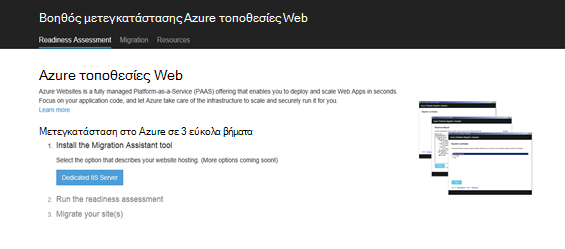

2.  Εγκατάσταση του Web Apps μετεγκατάστασης Βοηθός, κάνοντας κλικ στο κουμπί **Αφοσιωμένη στο διακομιστή των υπηρεσιών IIS** . Περισσότερες επιλογές θα επιλογές στο άμεσο μέλλον. 
4.  Κάντε κλικ στο κουμπί **Εγκατάσταση του εργαλείου** εγκατάστασης Web Apps μετεγκατάστασης Βοηθός στον υπολογιστή σας.

    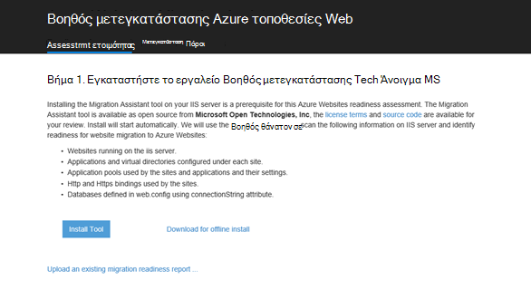

    >[AZURE.NOTE] Μπορείτε επίσης να επιλέξετε να **κάνετε λήψη για εργασία χωρίς σύνδεση εγκατάσταση** για να κάνετε λήψη σε ένα αρχείο ZIP για την εγκατάσταση σε διακομιστές που δεν είναι συνδεδεμένοι στο Internet. Εναλλακτικά, μπορείτε να επιλέξετε **Αποστολή μιας υπάρχουσας αναφοράς ετοιμότητας μετεγκατάστασης**, που είναι μια επιλογή για προχωρημένους για εργασία με μια υπάρχουσα ετοιμότητας έκθεσης μετεγκατάστασης που δημιουργήσατε προηγουμένως (επεξηγούνται αργότερα).

5.  Στην οθόνη **Εγκατάστασης εφαρμογών** , κάντε κλικ στην επιλογή **εγκατάσταση** για να εγκαταστήσετε το στον υπολογιστή σας. Επίσης, το θα εγκαταστήσετε αντίστοιχες εξαρτήσεις όπως ανάπτυξη Web DacFX και των υπηρεσιών IIS, εάν είναι απαραίτητο. 

    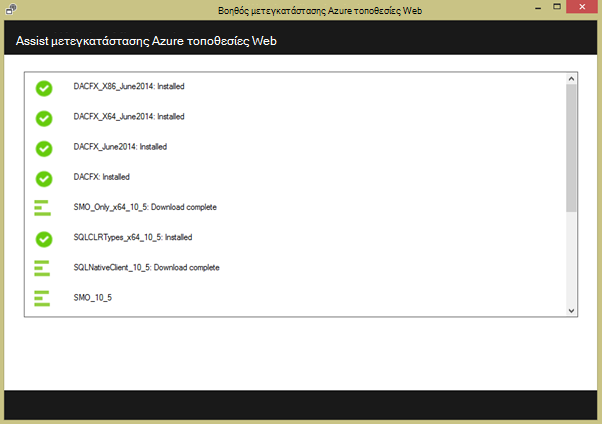

    Μόλις εγκαταστήσετε, Web Apps μετεγκατάστασης Βοηθός ξεκινά αυτόματα.
  
6.  Επιλέξτε **μετεγκατάσταση τοποθεσιών και βάσεων δεδομένων από έναν απομακρυσμένο διακομιστή για να Azure**. Εισαγάγετε τα διαπιστευτήρια διαχειριστή για τον απομακρυσμένο διακομιστή και κάντε κλικ στην επιλογή **Continue**. 

    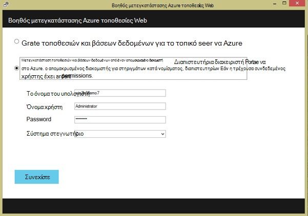

    Φυσικά, μπορείτε να επιλέξετε να κάνετε μετεγκατάσταση από τον τοπικό διακομιστή. Η απομακρυσμένη επιλογή είναι χρήσιμη όταν θέλετε να μετεγκαταστήσετε τοποθεσίες Web από ένα διακομιστή των υπηρεσιών IIS παραγωγής.
 
    Σε αυτό το σημείο θα ελέγξετε το εργαλείο μετεγκατάστασης τη ρύθμιση παραμέτρων του διακομιστή σας των υπηρεσιών IIS, όπως τοποθεσίες, εφαρμογές, χώρους συγκέντρωσης εφαρμογών και εξαρτήσεων για τον προσδιορισμό υποψηφίου τοποθεσίες Web για τη μετεγκατάσταση. 

8.  Το παρακάτω στιγμιότυπο οθόνης εμφανίζει τρεις τοποθεσίες Web – **προεπιλεγμένη τοποθεσία Web**, **TimeTracker**και **CommerceNet4**. Όλες τις έχετε συσχετισμένη βάση δεδομένων που θέλετε να μετεγκαταστήσετε. Επιλέξτε όλες τις τοποθεσίες που θέλετε να αξιολογήσετε και, στη συνέχεια, κάντε κλικ στο κουμπί **Επόμενο**.

    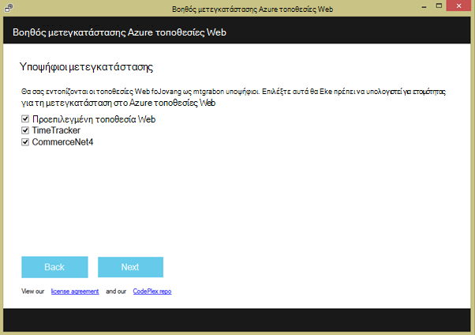
 
9.  Κάντε κλικ στην επιλογή **Αποστολή** για να αποστείλετε την αναφορά ετοιμότητας. Εάν κάνετε κλικ στο κουμπί **Αποθήκευση αρχείου τοπικά**, μπορείτε να εκτελέσετε το εργαλείο μετεγκατάστασης ξανά αργότερα και να αποστείλετε την αναφορά ετοιμότητας αποθηκευμένο όπως σημειώνεται νωρίτερα.

    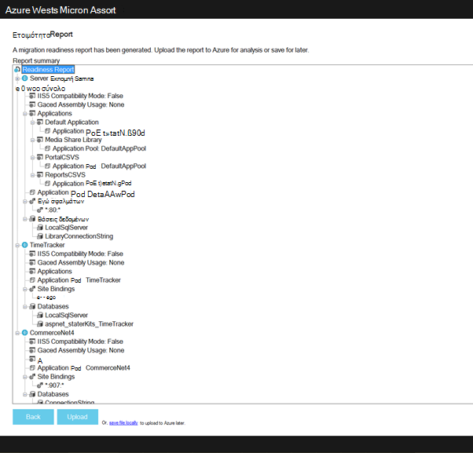
 
    Όταν κάνετε αποστολή την αναφορά ετοιμότητας, Azure εκτελεί ετοιμότητας ανάλυση και εμφανίζει τα αποτελέσματα. Διαβάστε τις λεπτομέρειες της αξιολόγησης για κάθε τοποθεσία Web και βεβαιωθείτε ότι Κατανόηση ή έχετε απαντήσει όλα τα προβλήματα, πριν να συνεχίσετε. 
 
    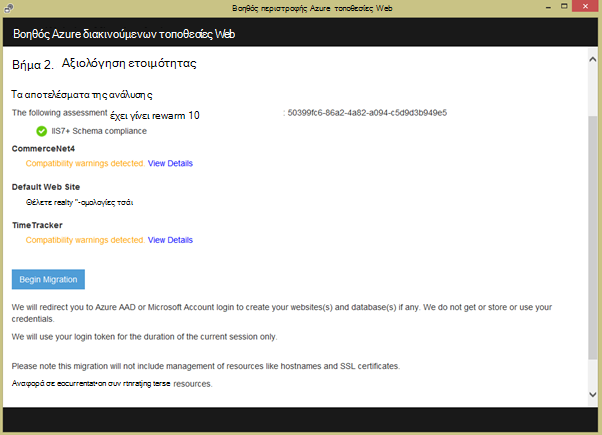

12. Κάντε κλικ στην επιλογή **Μετεγκατάστασης ξεκινήσει** για να ξεκινήσετε τη μετεγκατάσταση. Τώρα θα ανακατευθυνθείτε στο Azure για να συνδεθείτε στο λογαριασμό σας. Είναι σημαντικό να συνδεθείτε με ένα λογαριασμό που έχει μια ενεργή συνδρομή Azure. Εάν δεν έχετε λογαριασμό Azure, στη συνέχεια, μπορείτε να εγγραφείτε για μια δωρεάν δοκιμαστική [εδώ](https://azure.microsoft.com/pricing/free-trial/?WT.srch=1&WT.mc_ID=SEM_). 

13. Επιλέξτε το λογαριασμό σας στο μισθωτή, Azure συνδρομής και περιοχή για να χρησιμοποιήσετε για τις εφαρμογές web μετεγκαταστάθηκαν Azure και τις βάσεις δεδομένων και, στη συνέχεια, κάντε κλικ στην επιλογή **Έναρξη μετεγκατάστασης**. Μπορείτε να επιλέξετε τις τοποθεσίες Web για τη μετεγκατάσταση αργότερα.

    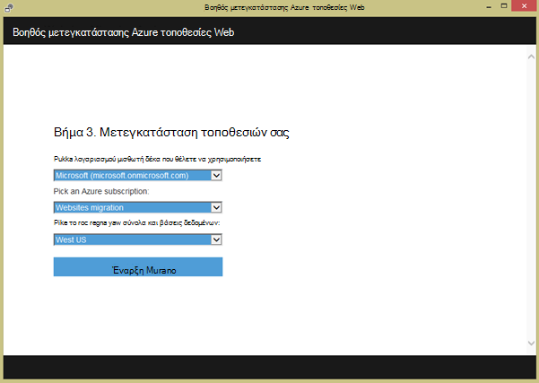

14. Στην επόμενη οθόνη μπορείτε να κάνετε αλλαγές στις προεπιλεγμένες ρυθμίσεις μετεγκατάστασης, όπως:

    - χρήση μιας υπάρχουσας βάσης δεδομένων SQL Azure ή να δημιουργήσετε μια νέα βάση δεδομένων SQL Azure και ρύθμιση παραμέτρων τα διαπιστευτήρια
    - Επιλέξτε τις τοποθεσίες Web για τη μετεγκατάσταση
    - ορίσετε ονόματα για τις εφαρμογές Azure web και τις συνδεδεμένες βάσεις δεδομένων SQL
    - Προσαρμόστε τις ρυθμίσεις επιπέδου τοποθεσιών και καθολικών ρυθμίσεων

    Το παρακάτω στιγμιότυπο οθόνης εμφανίζει όλες τις τοποθεσίες Web που είναι επιλεγμένο για μετεγκατάσταση με τις προεπιλεγμένες ρυθμίσεις.

    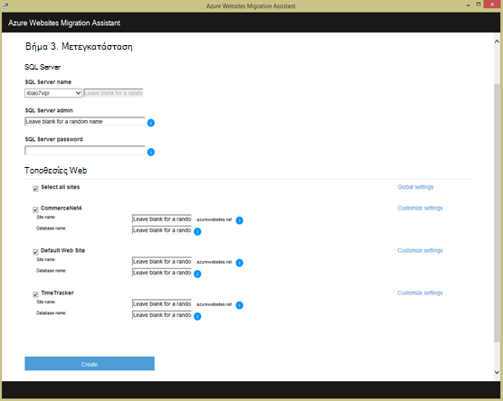

    >[AZURE.NOTE] το πλαίσιο ελέγχου **Ενεργοποίηση Azure Active Directory** στο προσαρμοσμένες ρυθμίσεις Ενοποιείται Azure web app με το [Azure Active Directory](active-directory-whatis.md) (η **Προεπιλεγμένη καταλόγου**). Για περισσότερες πληροφορίες σχετικά με συγχρονισμό Azure Active Directory με την εσωτερική εγκατάσταση υπηρεσίας καταλόγου Active Directory, ανατρέξτε στο θέμα [ενοποίηση καταλόγου](http://msdn.microsoft.com/library/jj573653).

16.  Αφού κάνετε όλες τις αλλαγές που θέλετε, κάντε κλικ στην επιλογή **Δημιουργία** για να ξεκινήσετε τη διαδικασία μετεγκατάστασης. Το εργαλείο μετεγκατάστασης θα δημιουργήσετε τη βάση δεδομένων SQL Azure και το Azure web app και, στη συνέχεια, δημοσιεύστε το περιεχόμενο τοποθεσίας Web και τις βάσεις δεδομένων. Η πρόοδος μετεγκατάστασης με σαφήνεια εμφανίζεται στο εργαλείο μετεγκατάστασης και θα δείτε μια σύνοψη οθόνη στο τέλος, των λεπτομερειών των τοποθεσιών τη μετεγκατάσταση, είτε να ήταν επιτυχής, συνδέεται με τις εφαρμογές που μόλις δημιουργήσατε Azure web. 

    Εάν παρουσιαστεί κάποιο σφάλμα κατά τη διάρκεια της μετεγκατάστασης, το εργαλείο μετεγκατάστασης με σαφήνεια υποδεικνύει την αποτυχία και επαναφορά τις αλλαγές. Επίσης θα μπορείτε να στείλετε την αναφορά σφάλματος απευθείας με την ομάδα των υπηρεσιών μηχανικής κάνοντας κλικ στο κουμπί **Αποστολή αναφοράς σφάλματος** , με την καταγραφή αποτυχίας στοίβα κλήση και να δομήσετε σώμα του μηνύματος. 

    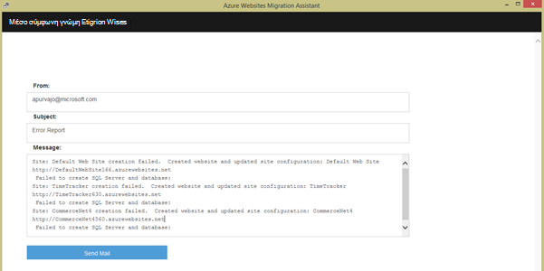

    Εάν μετεγκατάσταση με επιτυχία χωρίς σφάλματα, μπορείτε επίσης να κάνετε κλικ στο κουμπί **Παροχή σχολίων** για να παρέχετε τις πληροφορίες απευθείας. 
 
20. Κάντε κλικ στις συνδέσεις στις εφαρμογές Azure web και βεβαιωθείτε ότι η μετεγκατάσταση ολοκληρώθηκε με επιτυχία.

21. Τώρα, μπορείτε να διαχειριστείτε τις εφαρμογές web μετεγκαταστάθηκαν στο Azure εφαρμογής υπηρεσίας. Για να το κάνετε αυτό, συνδεθείτε με την [Πύλη Azure](https://portal.azure.com).

22. Στην πύλη του Azure, ανοίξτε το blade εφαρμογές Web για να δείτε τις μετεγκαταστάθηκαν τοποθεσίες Web (εμφανίζεται ως εφαρμογές web) και, στη συνέχεια, κάντε κλικ σε μία από αυτές για να ξεκινήσετε τη διαχείριση της εφαρμογής web, όπως τη ρύθμιση των παραμέτρων συνεχής δημοσίευση, τη δημιουργία αντιγράφων ασφαλείας, autoscaling, και χρήση ή επιδόσεων παρακολούθησης.

    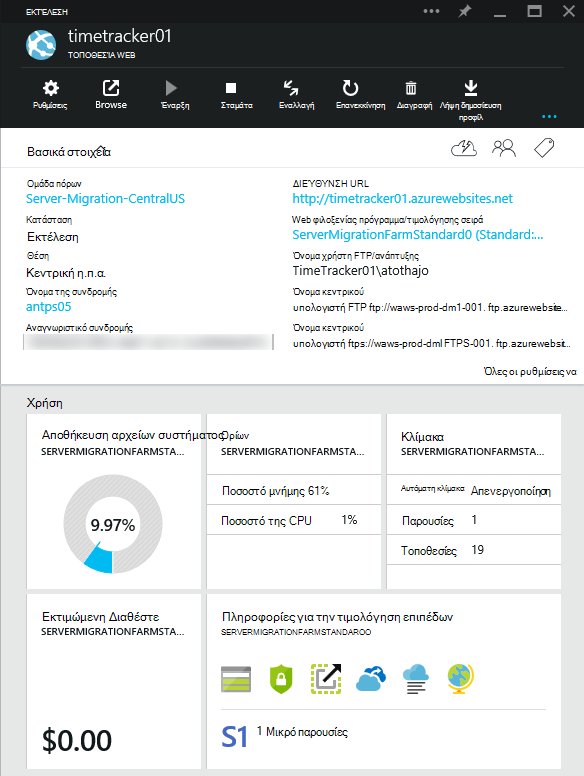

>[AZURE.NOTE] Εάν θέλετε να γρήγορα αποτελέσματα με το Azure εφαρμογής υπηρεσίας πριν από την εγγραφή για λογαριασμό Azure, μεταβείτε στο [Δοκιμάστε εφαρμογής υπηρεσίας](http://go.microsoft.com/fwlink/?LinkId=523751), όπου μπορείτε να αμέσως δημιουργήσετε μια εφαρμογή web μικρής διάρκειας starter στην εφαρμογή υπηρεσίας. Δεν υπάρχει πιστωτικές κάρτες υποχρεωτικό, χωρίς δεσμεύσεις.

## Τι έχει αλλάξει
* Για οδηγίες για την αλλαγή από τοποθεσίες Web App υπηρεσία ανατρέξτε στο θέμα: [Azure εφαρμογής υπηρεσίας και τον αντίκτυπο σχετικά με τις υπάρχουσες υπηρεσίες Azure](http://go.microsoft.com/fwlink/?LinkId=529714)
 
