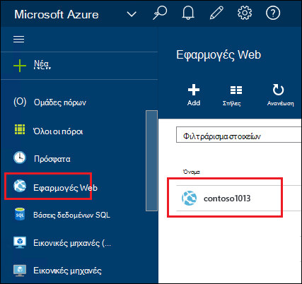
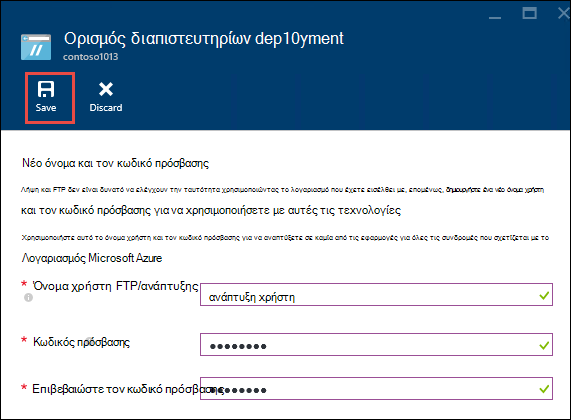
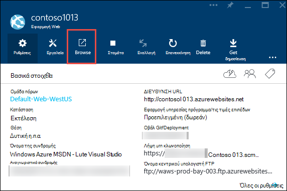
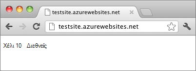

<properties
    pageTitle="Δημιουργία εφαρμογής web Node.js στο Azure εφαρμογής υπηρεσίας | Microsoft Azure"
    description="Μάθετε πώς μπορείτε να αναπτύξετε μια εφαρμογή Node.js για μια εφαρμογή web στο Azure εφαρμογής υπηρεσίας."
    services="app-service\web"
    documentationCenter="nodejs"
    authors="rmcmurray"
    manager="wpickett"
    editor=""/>

<tags
    ms.service="app-service-web"
    ms.workload="web"
    ms.tgt_pltfrm="na"
    ms.devlang="nodejs"
    ms.topic="hero-article"
    ms.date="08/11/2016"
    ms.author="robmcm"/>

# Δημιουργία εφαρμογής web Node.js στο Azure εφαρμογής υπηρεσίας

> [AZURE.SELECTOR]
- [.NET](web-sites-dotnet-get-started.md)
- [Node.js](web-sites-nodejs-develop-deploy-mac.md)
- [Java](web-sites-java-get-started.md)
- [PHP - Git](web-sites-php-mysql-deploy-use-git.md)
- [PHP - FTP](web-sites-php-mysql-deploy-use-ftp.md)
- [Python](web-sites-python-ptvs-django-mysql.md)

Αυτό το πρόγραμμα εκμάθησης δείχνει πώς μπορείτε να δημιουργήσετε μια απλή εφαρμογή [Node.js](http://nodejs.org) και ανάπτυξη μιας [εφαρμογής web](app-service-web-overview.md) με [Azure εφαρμογής υπηρεσίας](../app-service/app-service-value-prop-what-is.md) με τη χρήση [Git](http://git-scm.com). Μπορείτε να ακολουθήσετε τις οδηγίες σε αυτό το πρόγραμμα εκμάθησης σε κανένα λειτουργικό σύστημα που μπορεί να εκτελέσει Node.js.

Θα μάθετε:

* Μάθετε πώς μπορείτε να δημιουργήσετε μια εφαρμογή web στο Azure εφαρμογής υπηρεσίας, χρησιμοποιώντας την πύλη Azure.
* Μάθετε πώς μπορείτε να αναπτύξετε μια εφαρμογή Node.js στην εφαρμογή web πατώντας στο αποθετήριο δεδομένων Git του web app.

Οι δυνατότητες της εφαρμογής συντάσσει ένα σύντομο συμβολοσειράς "hello world" στο πρόγραμμα περιήγησης.

![Ένα πρόγραμμα περιήγησης εμφανίζει το μήνυμα 'Γεια'.][helloworld-completed]

Για προγράμματα εκμάθησης και δείγματα κώδικα με πιο σύνθετα Node.js εφαρμογές ή για άλλα θέματα σχετικά με τη χρήση Node.js στο Azure, ανατρέξτε στο [Κέντρο για προγραμματιστές του Node.js](/develop/nodejs/).

> [AZURE.NOTE]
> Για να ολοκληρώσετε αυτό το πρόγραμμα εκμάθησης, χρειάζεστε ένα λογαριασμό Microsoft Azure. Εάν δεν έχετε ένα λογαριασμό, μπορείτε να [ενεργοποιήσετε των πλεονεκτημάτων της συνδρομής σας Visual Studio](/en-us/pricing/member-offers/msdn-benefits-details/?WT.mc_id=A261C142F) ή να [εγγραφείτε για μια δωρεάν δοκιμαστική έκδοση](/en-us/pricing/free-trial/?WT.mc_id=A261C142F).
>
> Εάν θέλετε να γρήγορα αποτελέσματα με το Azure εφαρμογής υπηρεσίας πριν εγγραφείτε για ένα λογαριασμό Azure, μεταβείτε στο [Δοκιμάστε εφαρμογής υπηρεσίας](http://go.microsoft.com/fwlink/?LinkId=523751). Εκεί, μπορείτε να αμέσως δημιουργήσετε μια εφαρμογή web μικρής διάρκειας starter στην εφαρμογή υπηρεσίας — απαιτείται πιστωτική κάρτα και χωρίς δεσμεύσεις.

## Δημιουργία εφαρμογής web και ενεργοποίηση Git δημοσίευσης

Ακολουθήστε τα παρακάτω βήματα για να δημιουργήσετε μια εφαρμογή web στο Azure εφαρμογής υπηρεσίας και ενεργοποίηση Git δημοσίευσης. 

[Git](http://git-scm.com/) είναι ένα σύστημα ελέγχου κατανέμεται έκδοση που μπορείτε να χρησιμοποιήσετε για την ανάπτυξη της τοποθεσίας Web Azure. Θα μπορείτε να αποθηκεύσετε τον κωδικό γράφετε για την εφαρμογή web της σε ένα τοπικό αρχείο φύλαξης Git και θα αναπτύξετε τον κωδικό για να Azure πατώντας σε έναν απομακρυσμένο χώρο αποθήκευσης. Αυτή η μέθοδος ανάπτυξης είναι μια δυνατότητα της εφαρμογής υπηρεσίας web apps.  

1. Είσοδος στην [πύλη του Azure](https://portal.azure.com).

2. Κάντε κλικ στο **+ ΝΈΟ** εικονίδιο στην επάνω αριστερή πλευρά της πύλης Azure.

3. Κάντε κλικ στην επιλογή **Web + Mobile**και, στη συνέχεια, κάντε κλικ στην επιλογή **εφαρμογή Web**.

    ![][portal-quick-create]

4. Πληκτρολογήστε ένα όνομα για την εφαρμογή web στο πλαίσιο **εφαρμογή Web** .

    Αυτό το όνομα πρέπει να είναι μοναδικό στον τομέα azurewebsites.net, επειδή η διεύθυνση URL της εφαρμογής web θα {name}. azurewebsites.net. Εάν το όνομα που εισάγετε δεν είναι μοναδικές, εμφανίζεται ένα κόκκινο θαυμαστικό στο πλαίσιο κειμένου.

5. Επιλέξτε μια **συνδρομή**.

6. Επιλέξτε μια **Ομάδα πόρων** ή δημιουργήστε ένα νέο.

    Για περισσότερες πληροφορίες σχετικά με τις ομάδες πόρων, ανατρέξτε στο θέμα [Επισκόπηση της διαχείρισης πόρων Azure](../azure-resource-manager/resource-group-overview.md).

7. Επιλέξτε ένα **Πρόγραμμα εφαρμογής υπηρεσίας/θέση** ή δημιουργήστε ένα νέο.

    Για περισσότερες πληροφορίες σχετικά με τα σχέδια εφαρμογής υπηρεσίας, ανατρέξτε στο θέμα [Επισκόπηση προγράμματος Azure εφαρμογής υπηρεσίας](../azure-web-sites-web-hosting-plans-in-depth-overview.md)

8. Κάντε κλικ στην επιλογή **Δημιουργία**.
   
    ![][portal-quick-create2]

    Σε ένα μικρό χρονικό διάστημα, συνήθως λιγότερο από ένα λεπτό, Azure ολοκληρώσει τη δημιουργία της νέας εφαρμογής web.

9. Κάντε κλικ στην επιλογή **Web apps > {τη νέα εφαρμογή web}**.

    

10. Στο blade την **εφαρμογή Web** , κάντε κλικ στο τμήμα **ανάπτυξης** .

    ![][deployment-part]

11. Στο blade η **Συνεχής ανάπτυξη** , κάντε κλικ στην επιλογή **Επιλογή αρχείου προέλευσης**

12. Κάντε κλικ στην επιλογή **Τοπικό Git αποθετήριο δεδομένων**και, στη συνέχεια, κάντε κλικ στο κουμπί **OK**.

    ![][setup-git-publishing]

13. Εάν έχετε κάνει ήδη, ορίστε διαπιστευτήρια ανάπτυξης.

    μια. Στο blade την εφαρμογή Web, κάντε κλικ στην επιλογή **Ρυθμίσεις > Ανάπτυξη διαπιστευτήρια**.

    ![][deployment-credentials]
 
    β. Δημιουργήστε ένα όνομα χρήστη και τον κωδικό πρόσβασης. 
    
    

14. Στο blade την εφαρμογή Web, κάντε κλικ στην επιλογή **Ρυθμίσεις**και, στη συνέχεια, κάντε κλικ στην επιλογή **Ιδιότητες**.
 
    Για να δημοσιεύσετε, θα push σε έναν απομακρυσμένο αποθετήριο δεδομένων Git. Τη διεύθυνση URL για το αρχείο φύλαξης παρατίθεται στην περιοχή **Διεύθυνση URL GIT**. Θα χρησιμοποιήσετε αυτήν τη διεύθυνση URL αργότερα στην εκμάθηση.

    ![][git-url]

## Δημιουργία και να δοκιμάσετε την εφαρμογή σας τοπικά

Σε αυτήν την ενότητα, θα μπορείτε να δημιουργήσετε ένα αρχείο **server.js** που περιέχει μια έχουν τροποποιηθεί ελαφρώς έκδοση του παραδείγματος 'Γεια' από [nodejs.org]. Ο κώδικας προσθέτει process.env.PORT ως τη θύρα για ακρόαση όταν εκτελείται σε μια εφαρμογή Azure web.

1. Δημιουργήστε έναν κατάλογο με όνομα *helloworld*.

2. Χρησιμοποιήστε ένα πρόγραμμα επεξεργασίας κειμένου για να δημιουργήσετε ένα νέο αρχείο με το όνομα **server.js** στον κατάλογο *helloworld* .

2. Αντιγράψτε τον παρακάτω κώδικα στο αρχείο **server.js** και, στη συνέχεια, αποθηκεύστε το αρχείο:

        var http = require('http')
        var port = process.env.PORT || 1337;
        http.createServer(function(req, res) {
          res.writeHead(200, { 'Content-Type': 'text/plain' });
          res.end('Hello World\n');
        }).listen(port);

3. Ανοίξτε τη γραμμή εντολών και χρησιμοποιήστε την ακόλουθη εντολή για να ξεκινήσετε την εφαρμογή web τοπικά.

        node server.js

4. Ανοίξτε το πρόγραμμα περιήγησης web και μεταβείτε σε http://localhost:1337. 

    Εμφανίζεται μια ιστοσελίδα που εμφανίζει "Γεια", όπως φαίνεται στο παρακάτω στιγμιότυπο οθόνης.

    ![Ένα πρόγραμμα περιήγησης εμφανίζει το μήνυμα 'Γεια'.][helloworld-localhost]

## Δημοσίευση εφαρμογής σας

1. Εάν έχετε κάνει ήδη, εγκαταστήστε Git.

    Για οδηγίες εγκατάστασης για την πλατφόρμα σας, ανατρέξτε στο θέμα το [Git σελίδα λήψης](http://git-scm.com/download).

1. Από τη γραμμή εντολών, αλλάξτε σε καταλόγους στον κατάλογο **helloworld** και πληκτρολογήστε την παρακάτω εντολή για να προετοιμάσετε ένα τοπικό αρχείο φύλαξης Git.

        git init

2. Χρησιμοποιήστε τις παρακάτω εντολές για να προσθέσετε αρχεία στο αποθετήριο δεδομένων:

        git add .
        git commit -m "initial commit"

3. Προσθέστε μια Git απομακρυσμένης για Ώθηση ενημερώσεις στην εφαρμογή web που δημιουργήσατε προηγουμένως, χρησιμοποιώντας την ακόλουθη εντολή:

        git remote add azure [URL for remote repository]

4. Προωθήσετε τις αλλαγές σας σε Azure χρησιμοποιώντας την ακόλουθη εντολή:

        git push azure master

    Θα σας ζητηθεί για τον κωδικό πρόσβασης που δημιουργήσατε προηγουμένως. Το αποτέλεσμα θα είναι παρόμοιο με το ακόλουθο παράδειγμα.

        Counting objects: 3, done.
        Delta compression using up to 8 threads.
        Compressing objects: 100% (2/2), done.
        Writing objects: 100% (3/3), 374 bytes, done.
        Total 3 (delta 0), reused 0 (delta 0)
        remote: New deployment received.
        remote: Updating branch 'master'.
        remote: Preparing deployment for commit id '5ebbe250c9'.
        remote: Preparing files for deployment.
        remote: Deploying Web.config to enable Node.js activation.
        remote: Deployment successful.
        To https://user@testsite.scm.azurewebsites.net/testsite.git
         * [new branch]      master -> master

5. Για να προβάλετε την εφαρμογή σας, κάντε κλικ στο κουμπί **Αναζήτηση** στο τμήμα **Web App** στην πύλη του Azure.

    

    

## Δημοσίευση αλλαγών στην εφαρμογή σας

1. Ανοίξτε το αρχείο **server.js** σε ένα πρόγραμμα επεξεργασίας κειμένου, και αλλάξτε 'Hello World\n' σε 'Hello Azure\n'. 

2. Αποθηκεύστε το αρχείο.

2. Από τη γραμμή εντολών, μεταβείτε σε καταλόγους στον κατάλογο **helloworld** και εκτελέστε τις ακόλουθες εντολές:

        git add .
        git commit -m "changing to hello azure"
        git push azure master

    Θα σας ζητηθεί για τον κωδικό πρόσβασης ξανά.

3. Ανανεώστε το παράθυρο του προγράμματος περιήγησης που να περιηγούνται σε διεύθυνση URL του web app.

    ![Ιστοσελίδα εμφανίζει 'Hello Azure'][helloworld-completed]

## Επαναφορά μιας ανάπτυξης

Από την **εφαρμογή Web** blade μπορείτε να κάνετε κλικ **Ρυθμίσεις > συνεχούς ανάπτυξης** για να δείτε το ιστορικό ανάπτυξης στο το blade **αναπτύξεις** . Εάν χρειάζεστε για να επαναφέρετε μια προηγούμενη ανάπτυξη, που μπορούν να επιλέξτε την και, στη συνέχεια, κάντε κλικ στην επιλογή **αναπτύξτε ξανά** στο το blade **Λεπτομέρειες ανάπτυξης** .

## Επόμενα βήματα

Έχετε αναπτύξει μιας εφαρμογής Node.js για μια εφαρμογή web στο Azure εφαρμογής υπηρεσίας. Για να μάθετε περισσότερα σχετικά με τον τρόπο εφαρμογής υπηρεσίας web apps εκτέλεσης Node.js εφαρμογών, ανατρέξτε στο θέμα [Azure εφαρμογής υπηρεσίας Web Apps: Node.js](http://blogs.msdn.com/b/silverlining/archive/2012/06/14/windows-azure-websites-node-js.aspx) και [καθορίζοντας μια έκδοση Node.js σε μια εφαρμογή του Azure](../nodejs-specify-node-version-azure-apps.md).

Node.js παρέχει ένα εμπλουτισμένο περιβάλλον εμπορικής προσαρμογής των λειτουργικών μονάδων που μπορούν να χρησιμοποιηθούν με τις εφαρμογές σας. Για να μάθετε πώς λειτουργεί η Web Apps με λειτουργικές μονάδες, ανατρέξτε στο θέμα [Χρήση Node.js λειτουργικές μονάδες με εφαρμογές του Azure](../nodejs-use-node-modules-azure-apps.md).

Εάν αντιμετωπίσετε προβλήματα με την εφαρμογή σας αφού έχει αναπτυχθεί σε Azure, δείτε [πώς μπορείτε να σφαλμάτων σε μια εφαρμογή Node.js στο Azure εφαρμογής υπηρεσίας](web-sites-nodejs-debug.md) για πληροφορίες σχετικά με τη διάγνωση του προβλήματος.

Σε αυτό το άρθρο χρησιμοποιεί την πύλη του Azure για να δημιουργήσετε μια εφαρμογή web. Μπορείτε επίσης να χρησιμοποιήσετε το [περιβάλλον γραμμής εντολών Azure](../xplat-cli-install.md) ή [Azure PowerShell](../powershell-install-configure.md) για να εκτελέσετε τις ίδιες λειτουργίες.

Για περισσότερες πληροφορίες σχετικά με τον τρόπο ανάπτυξης εφαρμογών Node.js σε Azure, ανατρέξτε στο [Κέντρο για προγραμματιστές του Node.js](/develop/nodejs/).

[helloworld-completed]: ./media/web-sites-nodejs-develop-deploy-mac/helloazure.png
[helloworld-localhost]: ./media/web-sites-nodejs-develop-deploy-mac/helloworldlocal.png
[portal-quick-create]: ./media/web-sites-nodejs-develop-deploy-mac/create-quick-website.png
[portal-quick-create2]: ./media/web-sites-nodejs-develop-deploy-mac/create-quick-website2.png
[setup-git-publishing]: ./media/web-sites-nodejs-develop-deploy-mac/setup_git_publishing.png
[go-to-dashboard]: ./media/web-sites-nodejs-develop-deploy-mac/go_to_dashboard.png
[deployment-part]: ./media/web-sites-nodejs-develop-deploy-mac/deployment-part.png
[deployment-credentials]: ./media/web-sites-nodejs-develop-deploy-mac/deployment-credentials.png
[git-url]: ./media/web-sites-nodejs-develop-deploy-mac/git-url.png
