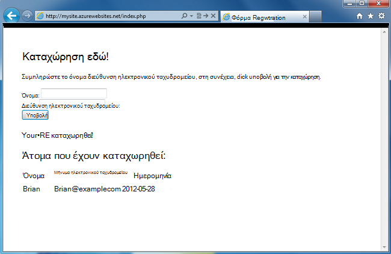
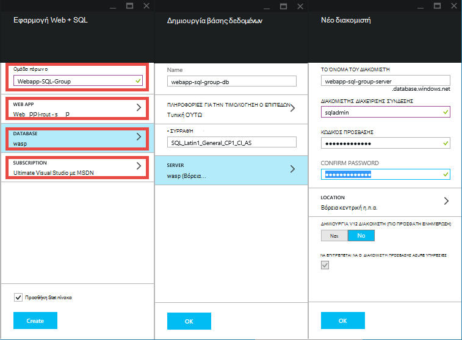
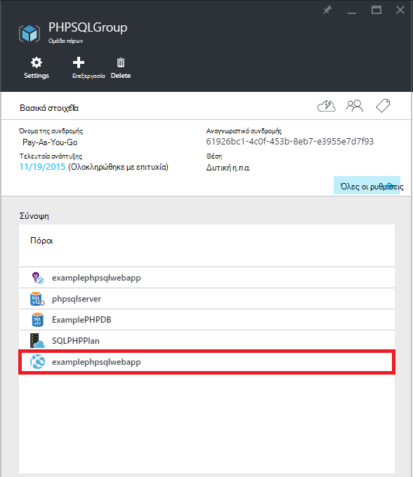
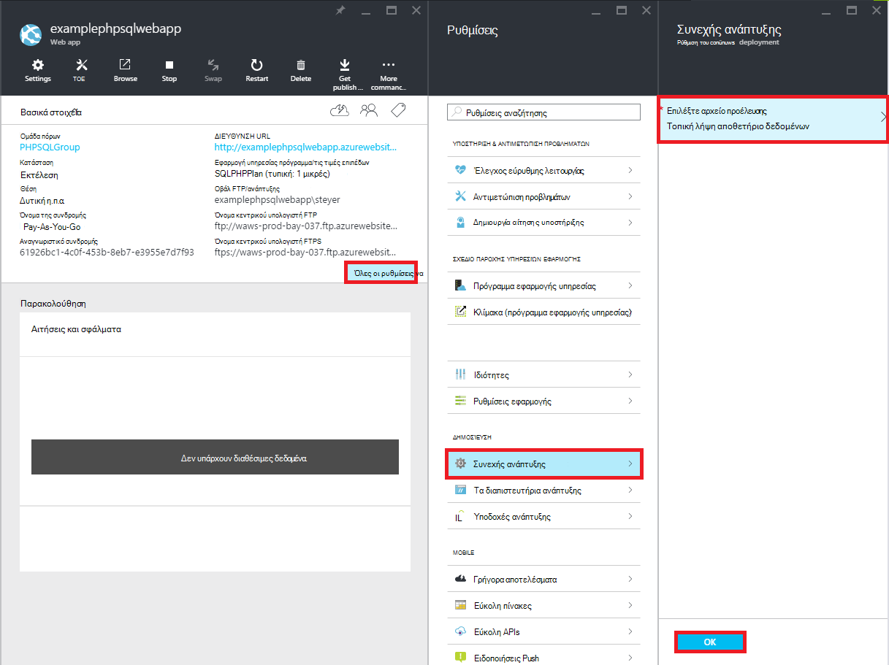
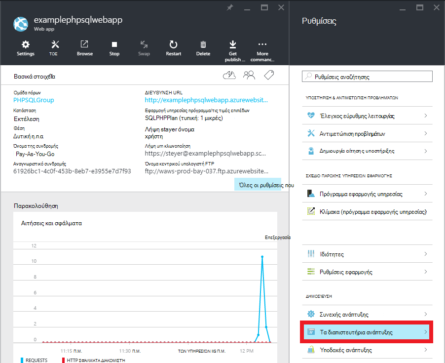
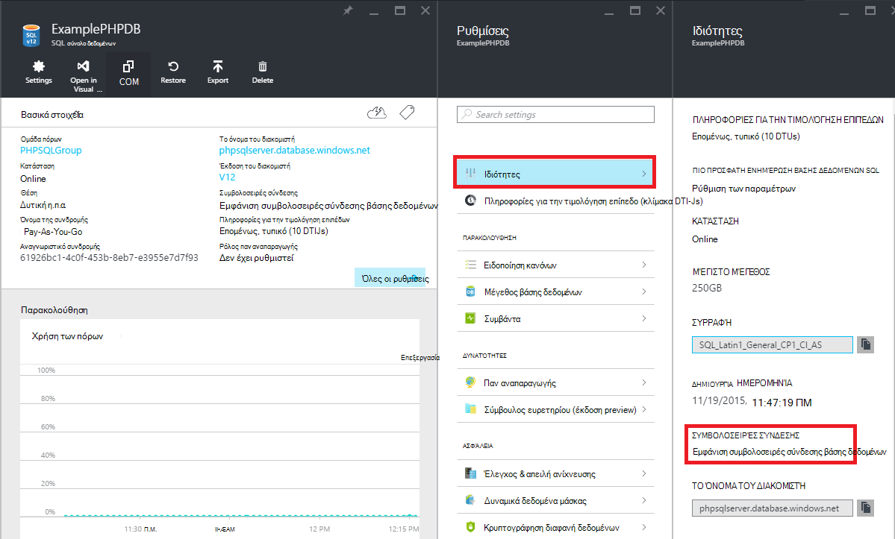

<properties 
    pageTitle="Δημιουργία μιας εφαρμογής web PHP SQL και ανάπτυξη σε Azure εφαρμογής υπηρεσίας με χρήση Git" 
    description="Ένα πρόγραμμα εκμάθησης που δείχνει πώς μπορείτε να δημιουργήσετε μια εφαρμογή web PHP που αποθηκεύει δεδομένα σε βάση δεδομένων SQL Azure και να χρησιμοποιήσετε Git ανάπτυξης για να Azure εφαρμογής υπηρεσίας." 
    services="app-service\web, sql-database" 
    documentationCenter="php" 
    authors="rmcmurray" 
    manager="wpickett" 
    editor=""/>

<tags 
    ms.service="app-service-web" 
    ms.workload="web" 
    ms.tgt_pltfrm="na" 
    ms.devlang="PHP" 
    ms.topic="article" 
    ms.date="08/11/2016" 
    ms.author="robmcm"/>

# Δημιουργία μιας εφαρμογής web PHP SQL και ανάπτυξη σε Azure εφαρμογής υπηρεσίας με χρήση Git

Αυτό το πρόγραμμα εκμάθησης σας δείχνει πώς μπορείτε να δημιουργήσετε μια εφαρμογή web PHP στο [Azure εφαρμογής υπηρεσίας](http://go.microsoft.com/fwlink/?LinkId=529714) που συνδέεται στη βάση δεδομένων SQL Azure και τον τρόπο ανάπτυξης χρησιμοποιώντας Git. Αυτό το πρόγραμμα εκμάθησης προϋποθέτει ότι έχετε [PHP][install-php], [SQL Server Express][install-SQLExpress], τα [Προγράμματα οδήγησης της Microsoft για τον SQL Server για PHP](http://www.microsoft.com/download/en/details.aspx?id=20098)και [Git] [ install-git] εγκατεστημένο στον υπολογιστή σας. Κατά την ολοκλήρωση αυτού του οδηγού, θα έχετε μια εφαρμογή web PHP SQL που εκτελείται στο Azure.

> [AZURE.NOTE]
> Μπορείτε να εγκαταστήσετε και να ρυθμίσετε τις παραμέτρους PHP, SQL Server Express και τα προγράμματα οδήγησης της Microsoft για τον SQL Server για PHP χρησιμοποιώντας το [Πρόγραμμα εγκατάστασης του Microsoft Web πλατφόρμας](http://www.microsoft.com/web/downloads/platform.aspx).

Θα μάθετε:

* Μάθετε πώς μπορείτε να δημιουργήσετε μια εφαρμογή Azure web και μια βάση δεδομένων SQL με την [Πύλη Azure](http://go.microsoft.com/fwlink/?LinkId=529715). Επειδή PHP είναι ενεργοποιημένη στις εφαρμογές Web της εφαρμογής υπηρεσίας από προεπιλογή, τίποτα ειδική απαιτείται για να εκτελέσετε τον κώδικα PHP.
* Μάθετε πώς μπορείτε να δημοσιεύσετε και να δημοσιεύσετε εκ νέου την εφαρμογή με το Azure χρησιμοποιώντας Git.
 
Ακολουθώντας αυτό το πρόγραμμα εκμάθησης, θα μπορείτε να δημιουργήσετε μια εφαρμογή web απλό εγγραφής στο PHP. Η εφαρμογή θα να φιλοξενούνται σε μια τοποθεσία Web του Azure. Στιγμιότυπο οθόνης της εφαρμογής ολοκληρωμένη είναι κάτω από:

[AZURE.INCLUDE [create-account-and-websites-note](../../includes/create-account-and-websites-note.md)]

>[AZURE.NOTE] Εάν θέλετε να γρήγορα αποτελέσματα με το Azure εφαρμογής υπηρεσίας πριν από την εγγραφή για λογαριασμό Azure, μεταβείτε στο [Δοκιμάστε εφαρμογής υπηρεσίας](http://go.microsoft.com/fwlink/?LinkId=523751), όπου μπορείτε να αμέσως δημιουργήσετε μια εφαρμογή web μικρής διάρκειας starter στην εφαρμογή υπηρεσίας. Δεν υπάρχει πιστωτικές κάρτες υποχρεωτικό, χωρίς δεσμεύσεις.

##Δημιουργία μιας εφαρμογής Azure web και ρύθμιση του Git δημοσίευσης

Ακολουθήστε τα παρακάτω βήματα για να δημιουργήσετε μια εφαρμογή Azure web και μια βάση δεδομένων SQL:

1. Συνδεθείτε [πύλη του Azure](https://portal.azure.com/).

2. Άνοιγμα του Azure Marketplace, κάνοντας κλικ στο εικονίδιο **Δημιουργία** στην επάνω αριστερή πλευρά της τον πίνακα εργαλείων, κάντε κλικ στην **Επιλογή όλων** δίπλα στο στοιχείο Marketplace και επιλέγοντας **Web + Mobile**.
    
3. Στην αγορά, επιλέξτε **Web + Mobile**.

4. Κάντε κλικ στο εικονίδιο **εφαρμογής Web + SQL** .

5. Μετά την ανάγνωση την περιγραφή της εφαρμογής Web + SQL εφαρμογής, επιλέξτε **Δημιουργία**.

6. Κάντε κλικ σε κάθε τμήμα (**Ομάδα πόρων**, **Εφαρμογή Web**, **βάση δεδομένων**και **τη συνδρομή**) και πληκτρολογήστε ή επιλέξτε τιμές για τα απαιτούμενα πεδία:
    
    - Πληκτρολογήστε ένα όνομα διεύθυνσης URL της επιλογής σας   
    - Ρύθμιση παραμέτρων διαπιστευτήρια διακομιστή βάσης δεδομένων
    - Επιλέξτε την περιοχή που βρίσκεται πιο κοντά σε εσάς

    

7. Όταν ολοκληρώσετε τον ορισμό της εφαρμογής web, κάντε κλικ στην επιλογή **Δημιουργία**.

    Όταν δημιουργηθεί η εφαρμογή web, το κουμπί " **ειδοποιήσεις** " θα flash πράσινο **ΕΠΙΤΥΧΊΑΣ** και το blade ομάδα πόρων ανοιχτό για να εμφανίσετε την εφαρμογή web και τη βάση δεδομένων SQL στην ομάδα.

4. Κάντε κλικ στο εικονίδιο του web app στο το blade ομάδα πόρων για να ανοίξετε το web app blade.

    

5. Στις **Ρυθμίσεις** , κάντε κλικ στην επιλογή **συνεχούς ανάπτυξης** > **Ρύθμιση παραμέτρων απαιτούμενες ρυθμίσεις**. Επιλέξτε **Τοπικό Git αποθετήριο** και κάντε κλικ στο κουμπί **OK**.

    

    Εάν δεν έχετε ρυθμίσει ένα αποθετήριο Git πριν, πρέπει να δώσετε ένα όνομα χρήστη και τον κωδικό πρόσβασης. Για να το κάνετε αυτό, κάντε κλικ στην επιλογή **Ρυθμίσεις** > **διαπιστευτήρια ανάπτυξης** στο blade του web app.

    

6. **Ρυθμίσεις** κάντε κλικ στις **Ιδιότητες** για να δείτε τη διεύθυνση URL απομακρυσμένης Git πρέπει να χρησιμοποιήσετε για να αναπτύξετε την εφαρμογή σας PHP αργότερα.

##Λάβετε πληροφορίες σύνδεσης της βάσης δεδομένων SQL

Για να συνδεθείτε με την παρουσία της βάσης δεδομένων SQL που συνδέεται με την εφαρμογή web, σας θα χρειάζονται τις πληροφορίες σύνδεσης, που έχει καθοριστεί κατά τη δημιουργία της βάσης δεδομένων. Για να λάβετε τις πληροφορίες σύνδεσης της βάσης δεδομένων SQL, ακολουθήστε τα παρακάτω βήματα:

1. Πίσω στο blade της ομάδας πόρων, κάντε κλικ στο εικονίδιο της βάσης δεδομένων SQL.

2. Στο blade τη βάση δεδομένων SQL του, κάντε κλικ στην επιλογή **Ρυθμίσεις** > **Ιδιότητες**, στη συνέχεια, κάντε κλικ στην επιλογή **Εμφάνιση συμβολοσειρές σύνδεσης βάσης δεδομένων**. 

    
    
3. Από την ενότητα **PHP** από το παράθυρο διαλόγου που προκύπτει, σημειώστε τις τιμές για `Server`, `SQL Database`, και `User Name`. Θα χρησιμοποιήσετε αργότερα αυτές τις τιμές κατά τη δημοσίευση την εφαρμογή web της PHP Azure εφαρμογής υπηρεσίας.

##Δημιουργία και να δοκιμάσετε την εφαρμογή σας τοπικά

Η εφαρμογή δήλωσης είναι μια απλή εφαρμογή PHP που σας επιτρέπει να εγγραφείτε για ένα συμβάν, παρέχοντας το όνομα διεύθυνση ηλεκτρονικού ταχυδρομείου. Πληροφορίες σχετικά με την προηγούμενη εγγεγραμμένοι PartnerDirect εμφανίζεται σε έναν πίνακα. Πληροφορίες εγγραφής αποθηκεύονται σε μια βάση δεδομένων SQL παρουσία. Η εφαρμογή αποτελείται από δύο αρχεία (διαθέσιμη κάτω από αντιγράψτε και επικολλήστε κωδικός):

* **Index.PHP**: Εμφανίζει μια φόρμα για την καταχώρηση και σε έναν πίνακα που περιέχει τις πληροφορίες registrant.
* **CreateTable.PHP**: δημιουργεί τον πίνακα βάσης δεδομένων SQL για την εφαρμογή. Αυτό το αρχείο θα χρησιμοποιηθούν μόνο μία φορά.

Για να εκτελέσετε την εφαρμογή τοπικά, ακολουθήστε τα παρακάτω βήματα. Σημειώστε ότι αυτά τα βήματα θεωρείται ότι έχετε PHP και SQL Server Express ρύθμιση στον τοπικό υπολογιστή σας και ότι έχετε ενεργοποιήσει την [επέκταση ΠΟΠ για τον SQL Server][pdo-sqlsrv].

1. Δημιουργία βάσης δεδομένων SQL Server που ονομάζεται `registration`. Μπορείτε να το κάνετε από το `sqlcmd` εντολών με αυτές τις εντολές:

        >sqlcmd -S localhost\sqlexpress -U <local user name> -P <local password>
        1> create database registration
        2> GO   

2. Στο το ριζικό κατάλογο της εφαρμογής, δημιουργήστε δύο αρχεία σε αυτό - μία που ονομάζεται `createtable.php` και μία που ονομάζεται `index.php`.

3. Άνοιγμα του `createtable.php` αρχείου σε ένα πρόγραμμα επεξεργασίας κειμένου ή IDE και προσθέστε τον παρακάτω κώδικα. Αυτός ο κώδικας θα χρησιμοποιηθεί για τη δημιουργία του `registration_tbl` πίνακα στο το `registration` βάσης δεδομένων.

        <?php
        // DB connection info
        $host = "localhost\sqlexpress";
        $user = "user name";
        $pwd = "password";
        $db = "registration";
        try{
            $conn = new PDO( "sqlsrv:Server= $host ; Database = $db ", $user, $pwd);
            $conn->setAttribute( PDO::ATTR_ERRMODE, PDO::ERRMODE_EXCEPTION );
            $sql = "CREATE TABLE registration_tbl(
            id INT NOT NULL IDENTITY(1,1) 
            PRIMARY KEY(id),
            name VARCHAR(30),
            email VARCHAR(30),
            date DATE)";
            $conn->query($sql);
        }
        catch(Exception $e){
            die(print_r($e));
        }
        echo "<h3>Table created.</h3>";
        ?>

    Σημειώστε ότι θα πρέπει να ενημερώσετε τις τιμές για <code>$user</code> και <code>$pwd</code> με το τοπικό όνομα χρήστη του SQL Server και τον κωδικό πρόσβασης.

4. Σε μια terminal στον ριζικό κατάλογο της εφαρμογής, πληκτρολογήστε την ακόλουθη εντολή:

        php -S localhost:8000

4. Ανοίξτε ένα πρόγραμμα περιήγησης web και μεταβείτε **http://localhost:8000/createtable.php**. Αυτό θα δημιουργήσει το `registration_tbl` πίνακα στη βάση δεδομένων.

5. Ανοίξτε το αρχείο **index.php** σε ένα πρόγραμμα επεξεργασίας κειμένου ή IDE και προσθέστε το βασικό κώδικα HTML και CSS για τη σελίδα (ο κώδικας PHP θα προστεθούν στα επόμενα βήματα).

        <html>
        <head>
        <Title>Registration Form</Title>
        
        </head>
        <body>
        <h1>Register here!</h1>
        
Fill in your name and email address, then click <strong>Submit</strong> to register.

        <form method="post" action="index.php" enctype="multipart/form-data" >
              Name  <input type="text" name="name" id="name"/> 
              Email <input type="text" name="email" id="email"/> 
              <input type="submit" name="submit" value="Submit" />
        </form>
        <?php

        ?>
        </body>
        </html>

6. Μέσα στα tag PHP, προσθέστε PHP κώδικα για τη σύνδεση με τη βάση δεδομένων.

        // DB connection info
        $host = "localhost\sqlexpress";
        $user = "user name";
        $pwd = "password";
        $db = "registration";
        // Connect to database.
        try {
            $conn = new PDO( "sqlsrv:Server= $host ; Database = $db ", $user, $pwd);
            $conn->setAttribute( PDO::ATTR_ERRMODE, PDO::ERRMODE_EXCEPTION );
        }
        catch(Exception $e){
            die(var_dump($e));
        }

    Ξανά, θα πρέπει να ενημερώσετε τις τιμές για <code>$user</code> και <code>$pwd</code> με το τοπικό όνομα χρήστη MySQL και τον κωδικό πρόσβασης.

7. Μετά τον κωδικό σύνδεσης βάσης δεδομένων, προσθέστε τον κώδικα για την εισαγωγή πληροφοριών δήλωσης στη βάση δεδομένων.

        if(!empty($_POST)) {
        try {
            $name = $_POST['name'];
            $email = $_POST['email'];
            $date = date("Y-m-d");
            // Insert data
            $sql_insert = "INSERT INTO registration_tbl (name, email, date) 
                           VALUES (?,?,?)";
            $stmt = $conn->prepare($sql_insert);
            $stmt->bindValue(1, $name);
            $stmt->bindValue(2, $email);
            $stmt->bindValue(3, $date);
            $stmt->execute();
        }
        catch(Exception $e) {
            die(var_dump($e));
        }
        echo "<h3>Your're registered!</h3>";
        }

8. Τέλος, μετά από τον παραπάνω κώδικα, προσθέστε κώδικα για την ανάκτηση δεδομένων από τη βάση δεδομένων.

        $sql_select = "SELECT * FROM registration_tbl";
        $stmt = $conn->query($sql_select);
        $registrants = $stmt->fetchAll(); 
        if(count($registrants) > 0) {
            echo "<h2>People who are registered:</h2>";
            echo "<table>";
            echo "<tr><th>Name</th>";
            echo "<th>Email</th>";
            echo "<th>Date</th></tr>";
            foreach($registrants as $registrant) {
                echo "<tr><td>".$registrant['name']."</td>";
                echo "<td>".$registrant['email']."</td>";
                echo "<td>".$registrant['date']."</td></tr>";
            }
            echo "</table>";
        } else {
            echo "<h3>No one is currently registered.</h3>";
        }

Τώρα, μπορείτε να περιηγηθείτε στο **http://localhost:8000/index.php** για να ελέγξετε την εφαρμογή.

##Δημοσίευση εφαρμογής σας

Αφού ελέγξετε τοπικά την εφαρμογή σας, μπορείτε να το δημοσιεύσετε σε εφαρμογή υπηρεσίας Web Apps με χρήση Git. Ωστόσο, πρέπει πρώτα να ενημερώσετε τις πληροφορίες σύνδεσης βάσης δεδομένων στην εφαρμογή. Χρησιμοποιώντας τις πληροφορίες σύνδεσης βάσης δεδομένων που λάβατε νωρίτερα (στην ενότητα **πληροφορίες σύνδεσης γρήγορα βάση δεδομένων SQL** ), ενημερώστε τις παρακάτω πληροφορίες στο **τόσο** το `createdatabase.php` και `index.php` αρχεία με τις κατάλληλες τιμές:

    // DB connection info
    $host = "tcp:<value of Server>";
    $user = "<value of User Name>";
    $pwd = "<your password>";
    $db = "<value of SQL Database>";

> [AZURE.NOTE]
> Στο το <code>$host</code>, η τιμή του διακομιστή πρέπει να τοποθετηθούν μπροστά από με <code>tcp:</code>.

Τώρα, είστε έτοιμοι για να ρυθμίσετε Git δημοσίευσης και να δημοσιεύσετε την εφαρμογή.

> [AZURE.NOTE]
> Αυτά είναι τα ίδια βήματα σημειώσατε στο τέλος της ενότητας **Δημιουργία εφαρμογής Azure web και ρύθμιση του Git δημοσίευσης** παραπάνω.

1. Άνοιγμα GitBash (ή μια terminal, εάν είναι Git σε σας `PATH`), αλλαγή σε καταλόγους στον ριζικό κατάλογο της εφαρμογής σας (τον κατάλογο **δήλωσης** ) και εκτελέστε τις ακόλουθες εντολές:

        git init
        git add .
        git commit -m "initial commit"
        git remote add azure [URL for remote repository]
        git push azure master

    Θα σας ζητηθεί για τον κωδικό πρόσβασης που δημιουργήσατε νωρίτερα.

2. Αναζητήστε **http://[web name].azurewebsites.net/createtable.php εφαρμογή** για να δημιουργήσετε τον πίνακα βάσης δεδομένων SQL για την εφαρμογή.
3. Αναζητήστε **http://[web name].azurewebsites.net/index.php εφαρμογής** για να αρχίσετε να χρησιμοποιείτε την εφαρμογή.

Μετά τη δημοσίευση την εφαρμογή σας, μπορείτε να αρχίσετε να κάνετε αλλαγές σε αυτό και να χρησιμοποιήσετε Git δημοσίευσή τους. 

##Δημοσίευση αλλαγών στην εφαρμογή σας

Για να δημοσιεύσετε τις αλλαγές στην εφαρμογή, ακολουθήστε τα παρακάτω βήματα:

1. Κάντε αλλαγές στην εφαρμογή σας τοπικά.
2. Άνοιγμα GitBash (ή μια terminal, it Git βρίσκεται σε σας `PATH`), αλλαγή σε καταλόγους στον ριζικό κατάλογο της εφαρμογής σας και εκτελέστε τις ακόλουθες εντολές:

        git add .
        git commit -m "comment describing changes"
        git push azure master

    Θα σας ζητηθεί για τον κωδικό πρόσβασης που δημιουργήσατε νωρίτερα.

3. Αναζητήστε **http://[web name].azurewebsites.net/index.php εφαρμογής** για να δείτε τις αλλαγές σας.

## Τι έχει αλλάξει
* Για οδηγίες για την αλλαγή από τοποθεσίες Web App υπηρεσία ανατρέξτε στο θέμα: [Azure εφαρμογής υπηρεσίας και τον αντίκτυπο σχετικά με τις υπάρχουσες υπηρεσίες Azure](http://go.microsoft.com/fwlink/?LinkId=529714)

[install-php]: http://www.php.net/manual/en/install.php
[install-SQLExpress]: http://www.microsoft.com/download/details.aspx?id=29062
[install-Drivers]: http://www.microsoft.com/download/details.aspx?id=20098
[install-git]: http://git-scm.com/
[pdo-sqlsrv]: http://php.net/pdo_sqlsrv
 
