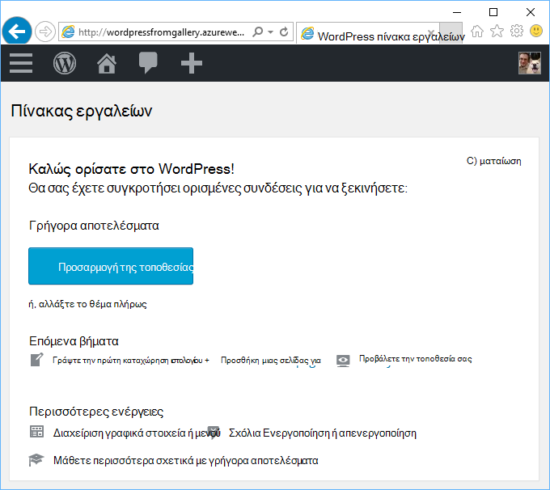
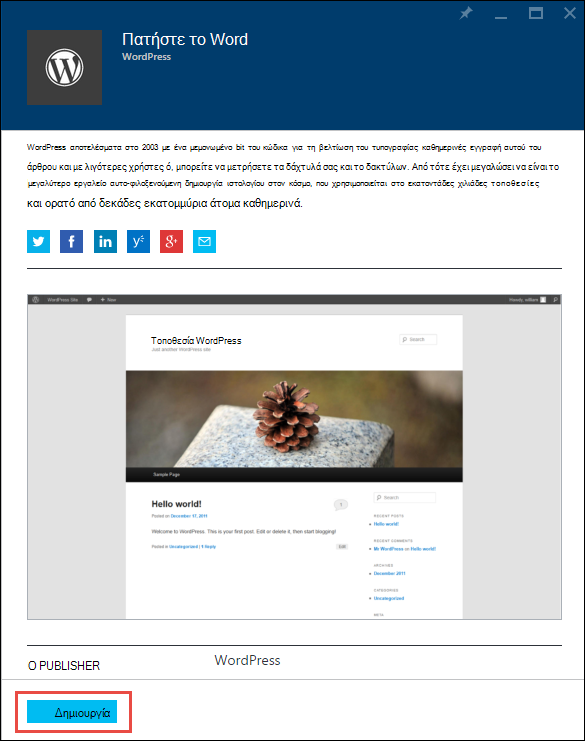
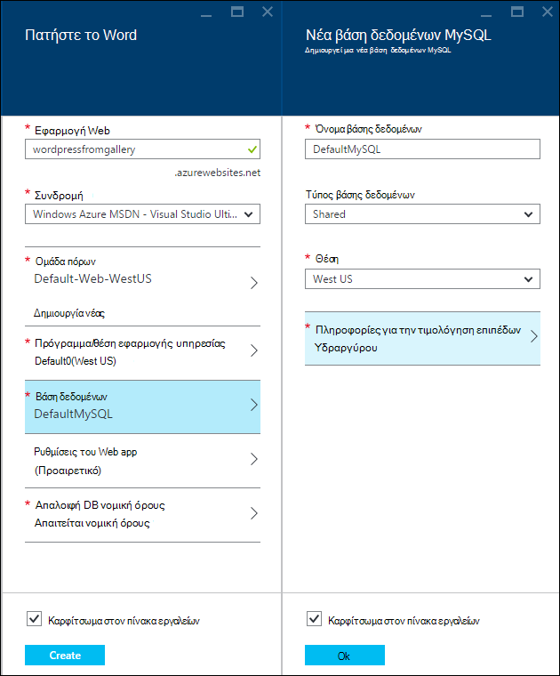
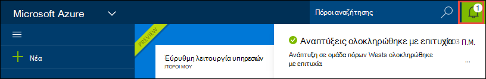
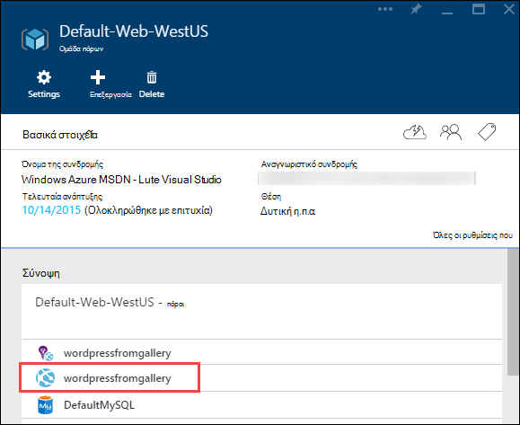
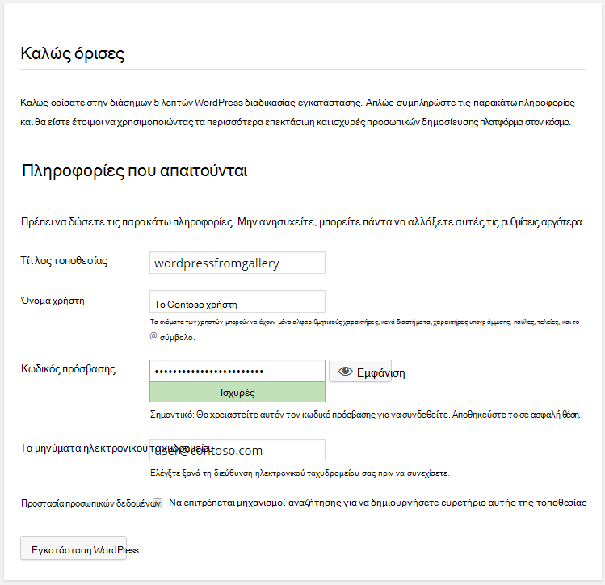

<properties
    pageTitle="Δημιουργία εφαρμογής web WordPress στο Azure εφαρμογής υπηρεσίας | Microsoft Azure"
    description="Μάθετε πώς μπορείτε να δημιουργήσετε μια νέα εφαρμογή Azure web για ένα ιστολόγιο WordPress με την πύλη Azure."
    services="app-service\web"
    documentationCenter="php"
    authors="rmcmurray"
    manager="wpickett"
    editor=""/>

<tags
    ms.service="app-service-web"
    ms.workload="na"
    ms.tgt_pltfrm="na"
    ms.devlang="PHP"
    ms.topic="hero-article"
    ms.date="08/11/2016"
    ms.author="robmcm"/>

# Δημιουργία εφαρμογής web WordPress στο Azure εφαρμογής υπηρεσίας

[AZURE.INCLUDE [tabs](../../includes/app-service-web-get-started-nav-tabs.md)]

Αυτό το πρόγραμμα εκμάθησης δείχνει πώς μπορείτε να αναπτύξετε μια τοποθεσία ιστολογίου WordPress από το Azure Marketplace.

Όταν ολοκληρώσετε την εργασία με το πρόγραμμα εκμάθησης, θα έχετε τη δική σας τοποθεσία ιστολογίου WordPress προς τα επάνω και την εκτέλεση στο cloud.

Θα μάθετε:

* Πώς μπορείτε να βρείτε ένα πρότυπο εφαρμογής από το Azure Marketplace.
* Μάθετε πώς μπορείτε να δημιουργήσετε μια εφαρμογή web στο Azure εφαρμογής υπηρεσίας που βασίζεται στο πρότυπο.
* Τρόπος ρύθμισης των παραμέτρων Azure εφαρμογής υπηρεσίας για τη νέα εφαρμογή web και τη βάση δεδομένων.

Το Azure Marketplace κάνει διαθέσιμη μια ευρεία ποικιλία εφαρμογές web δημοφιλείς που αναπτύχθηκε από τη Microsoft, εταιρείες τρίτων και πρωτοβουλίες λογισμικό Άνοιγμα αρχείου προέλευσης. Σε ένα ευρύ φάσμα δημοφιλών πλαίσια, όπως [PHP](/develop/nodejs/) στο αυτό WordPress παράδειγμα, [.NET](/develop/net/), [Node.js](/develop/nodejs/), [Java](/develop/java/)και [Python](/develop/python/), μερικά δημιουργούνται τα web apps. Για να δημιουργήσετε μια εφαρμογή web από το Azure Marketplace το λογισμικό μόνο που χρειάζεστε είναι το πρόγραμμα περιήγησης που χρησιμοποιείτε για την [Πύλη Azure](https://portal.azure.com/). 

Στην τοποθεσία WordPress που αναπτύσσετε σε αυτό το πρόγραμμα εκμάθησης χρησιμοποιεί MySQL για τη βάση δεδομένων. Εάν θέλετε να χρησιμοποιήσετε αντί για αυτό βάση δεδομένων SQL για τη βάση δεδομένων, ανατρέξτε στο θέμα [Nami έργου](http://projectnami.org/). **Nami έργου** είναι επίσης διαθέσιμο έως το Marketplace.

> [AZURE.NOTE]
> Για να ολοκληρώσετε αυτό το πρόγραμμα εκμάθησης, χρειάζεστε ένα λογαριασμό Microsoft Azure. Εάν δεν έχετε ένα λογαριασμό, μπορείτε να [ενεργοποιήσετε των πλεονεκτημάτων της συνδρομής σας Visual Studio](/pricing/member-offers/msdn-benefits-details/?WT.mc_id=A261C142F) ή να [εγγραφείτε για μια δωρεάν δοκιμαστική έκδοση](/en-us/pricing/free-trial/?WT.mc_id=A261C142F).
>
> Εάν θέλετε να γρήγορα αποτελέσματα με το Azure εφαρμογής υπηρεσίας πριν εγγραφείτε για ένα λογαριασμό Azure, μεταβείτε στο [Δοκιμάστε εφαρμογής υπηρεσίας](http://go.microsoft.com/fwlink/?LinkId=523751). Εκεί, μπορείτε να αμέσως δημιουργήσετε μια εφαρμογή web μικρής διάρκειας starter στην εφαρμογή υπηρεσίας — απαιτείται πιστωτική κάρτα και χωρίς δεσμεύσεις.

## Επιλέξτε WordPress και ρύθμιση παραμέτρων για το Azure εφαρμογής υπηρεσίας

1. Συνδεθείτε [πύλη του Azure](https://portal.azure.com/).

2. Κάντε κλικ στην επιλογή **νέα**.
    
    ![Δημιουργία νέας][5]
    
3. Αναζήτηση **WordPress**και, στη συνέχεια, κάντε κλικ στην επιλογή **WordPress**. Εάν θέλετε να χρησιμοποιήσετε βάση δεδομένων SQL αντί MySQL, πραγματοποιήστε αναζήτηση για **Nami έργου**.

    ![WordPress από τη λίστα][7]
    
5. Μετά την ανάγνωση την περιγραφή της εφαρμογής WordPress, κάντε κλικ στην επιλογή **Δημιουργία**.

    

4. Πληκτρολογήστε ένα όνομα για την εφαρμογή web στο πλαίσιο **εφαρμογή Web** .

    Αυτό το όνομα πρέπει να είναι μοναδικό στον τομέα azurewebsites.net, επειδή η διεύθυνση URL της εφαρμογής web θα {name}. azurewebsites.net. Εάν το όνομα που εισάγετε δεν είναι μοναδικές, εμφανίζεται ένα κόκκινο θαυμαστικό στο πλαίσιο κειμένου.

8. Εάν έχετε περισσότερες από μία συνδρομές, επιλέξτε αυτήν που θέλετε να χρησιμοποιήσετε. 

5. Επιλέξτε μια **Ομάδα πόρων** ή δημιουργήστε ένα νέο.

    Για περισσότερες πληροφορίες σχετικά με τις ομάδες πόρων, ανατρέξτε στο θέμα [Επισκόπηση της διαχείρισης πόρων Azure](../azure-resource-manager/resource-group-overview.md).

5. Επιλέξτε ένα **Πρόγραμμα εφαρμογής υπηρεσίας/θέση** ή δημιουργήστε ένα νέο.

    Για περισσότερες πληροφορίες σχετικά με τα σχέδια εφαρμογής υπηρεσίας, ανατρέξτε στο θέμα [Επισκόπηση προγράμματος Azure εφαρμογής υπηρεσίας](../azure-web-sites-web-hosting-plans-in-depth-overview.md) 

7. Κάντε κλικ στην επιλογή **βάση δεδομένων**και, στη συνέχεια, στο blade τη **Νέα βάση δεδομένων MySQL** , δώστε τις απαιτούμενες τιμές για τη ρύθμιση των παραμέτρων σας βάση δεδομένων MySQL.

    μια. Πληκτρολογήστε ένα νέο όνομα ή αφήστε το προεπιλεγμένο όνομα.

    β. Αποχώρηση από τον **Τύπο της βάσης δεδομένων** έχει οριστεί σε **κοινή χρήση**.

    c. Επιλέξτε στην ίδια θέση με αυτό που επιλέξατε για την εφαρμογή web.

    d. Επιλέξτε ένα επίπεδο τις πληροφορίες τιμολόγησης. Για αυτό το πρόγραμμα εκμάθησης είναι εντάξει υδραργύρου (δωρεάν με ελάχιστους επιτρεπόμενων συνδέσεων και χώρο στο δίσκο).

8. Στο blade τη **Νέα βάση δεδομένων MySQL** , κάντε κλικ στο κουμπί **OK**. 

8. Στο το blade **WordPress** , αποδεχτείτε τους όρους της νομικές και, στη συνέχεια, κάντε κλικ στην επιλογή **Δημιουργία**. 

    

    Azure εφαρμογής υπηρεσίας δημιουργεί την εφαρμογή web, συνήθως σε λιγότερο από ένα λεπτό. Μπορείτε να παρακολουθήσετε την πρόοδο κάνοντας κλικ στο εικονίδιο κουδουνιού στο επάνω μέρος της σελίδας της πύλης.

    

## Εκκίνηση και να διαχειριστείτε την εφαρμογή web της WordPress
    
7. Όταν ολοκληρώσετε τη δημιουργία της εφαρμογής web, μεταβείτε στην πύλη του Azure στην ομάδα πόρων στο οποίο έχετε δημιουργήσει την εφαρμογή και μπορείτε να δείτε την εφαρμογή web και τη βάση δεδομένων.

    Ο πόρος επιπλέον με το εικονίδιο λάμπας είναι [Εφαρμογή ιδέες](/services/application-insights/), που παρέχει υπηρεσίες παρακολούθησης για την εφαρμογή web.

1. Στο blade την **ομάδα πόρων** , κάντε κλικ στη γραμμή της εφαρμογής web.

    

2. Στο blade την εφαρμογή Web, κάντε κλικ στο κουμπί **Αναζήτηση**.

    ![διεύθυνση URL της τοποθεσίας][browse]

3. Στη σελίδα WordPress **Καλώς ορίσατε** , εισαγάγετε τις πληροφορίες ρύθμισης παραμέτρων που απαιτούνται από WordPress και, στη συνέχεια, κάντε κλικ στην επιλογή **Εγκατάσταση WordPress**.

    

4. Συνδεθείτε χρησιμοποιώντας τα διαπιστευτήρια που δημιουργήσατε στη σελίδα **υποδοχής** .  

5. Ανοίγει η σελίδα πίνακα εργαλείων της τοποθεσίας σας.    

    

## Επόμενα βήματα

Είδατε πώς μπορείτε να δημιουργήσετε και να αναπτύξετε μια εφαρμογή web PHP από τη συλλογή. Για περισσότερες πληροφορίες σχετικά με τη χρήση PHP Azure, ανατρέξτε στο [Κέντρο για προγραμματιστές PHP](/develop/php/).

Για περισσότερες πληροφορίες σχετικά με τον τρόπο εργασίας με εφαρμογή υπηρεσίας Web Apps, ανατρέξτε στις συνδέσεις στην αριστερή πλευρά της σελίδας (για windows ευρεία προγράμματος περιήγησης) ή στο επάνω μέρος της σελίδας (για windows στενή προγράμματος περιήγησης). 

## Τι έχει αλλάξει
* Για οδηγίες για την αλλαγή από τοποθεσίες Web για να εφαρμογής υπηρεσίας, ανατρέξτε στο θέμα [Azure εφαρμογής υπηρεσίας και τις επιπτώσεις της σχετικά με τις υπάρχουσες υπηρεσίες Azure](http://go.microsoft.com/fwlink/?LinkId=529714).

[5]: ./media/web-sites-php-web-site-gallery/startmarketplace.png
[7]: ./media/web-sites-php-web-site-gallery/search-web-app.png
[browse]: ./media/web-sites-php-web-site-gallery/browse-web.png
