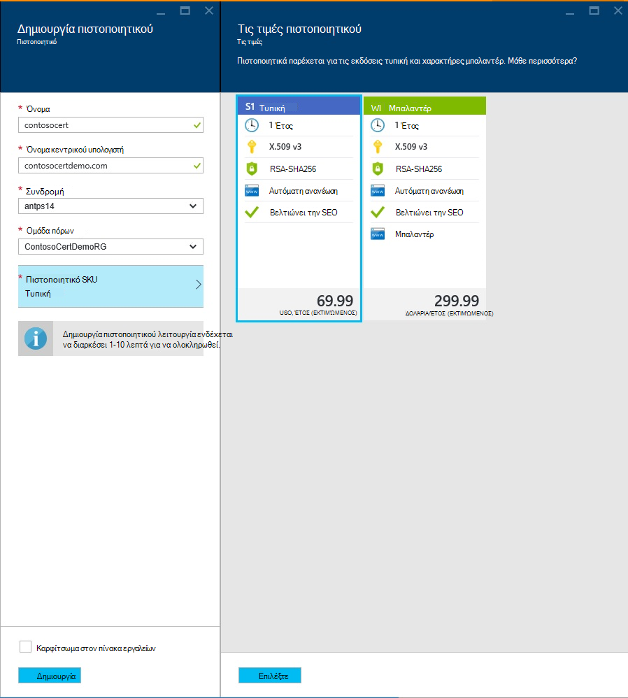

<properties
    pageTitle="Αγορά και ρύθμιση παραμέτρων πιστοποιητικού SSL για το Azure εφαρμογής υπηρεσίας"
    description="Μάθετε πώς μπορείτε να αγοράσετε και ρύθμιση παραμέτρων πιστοποιητικού SSL για το Azure εφαρμογής υπηρεσίας."
    services="app-service"
    documentationCenter=".net"
    authors="apurvajo"
    manager="stefsch"
    editor="cephalin"
    tags="buy-ssl-certificates"/>

<tags
    ms.service="app-service"
    ms.workload="na"
    ms.tgt_pltfrm="na"
    ms.devlang="na"
    ms.topic="article"
    ms.date="09/19/2016"
    ms.author="apurvajo"/>

#Αγορά και ρύθμιση παραμέτρων πιστοποιητικού SSL για το Azure εφαρμογής υπηρεσίας

> [AZURE.SELECTOR]
- [Αγορά του πιστοποιητικού SSL στο Azure](web-sites-purchase-ssl-web-site.md)
- [Χρήση του πιστοποιητικού SSL από κάποιο άλλο σημείο](web-sites-configure-ssl-certificate.md)

Από προεπιλογή, **[Azure εφαρμογής υπηρεσίας](http://go.microsoft.com/fwlink/?LinkId=529714)** επιτρέπει ήδη HTTPS για την εφαρμογή web σας με ένα πιστοποιητικό μπαλαντέρ για το *. azurewebsites.net τομέα. Εάν δεν σκοπεύετε να ρυθμίσετε τις παραμέτρους ενός προσαρμοσμένου τομέα, στη συνέχεια, μπορείτε να επωφεληθείτε από το προεπιλεγμένο πιστοποιητικό HTTPS. Ωστόσο, όπως όλα * [τομείς μπαλαντέρ](https://casecurity.org/2014/02/26/pros-and-cons-of-single-domain-multi-domain-and-wildcard-certificates), δεν είναι εξίσου ασφαλής με χρήση του προσαρμοσμένου τομέα με το δικό σας πιστοποιητικό. Azure εφαρμογής υπηρεσίας που παρέχει τώρα μια απλοποιημένη πραγματικά τρόπος για να αγοράσετε και να διαχειριστείτε ένα πιστοποιητικό SSL απευθείας από την πύλη Azure χωρίς να απομακρυνθείτε από την πύλη.  
Σε αυτό το άρθρο εξηγεί πώς μπορείτε να αγοράσετε και ρύθμιση παραμέτρων πιστοποιητικού SSL της **[Εφαρμογής υπηρεσίας Azure](http://go.microsoft.com/fwlink/?LinkId=529714)** με 3 απλά βήματα. 

> [AZURE.NOTE]
> Πιστοποιητικά SSL για τα προσαρμοσμένα ονόματα τομέα δεν μπορούν να χρησιμοποιηθούν με την εφαρμογή web δωρεάν και κοινή χρήση. Πρέπει να ρυθμίσετε τις παραμέτρους της εφαρμογής web για βασική, τυπική ή Premium λειτουργία, η οποία μπορεί να αλλάξει πόσο χρέωσης για τη συνδρομή σας. Για περισσότερες πληροφορίες, ανατρέξτε στο θέμα **[Λεπτομέρειες τιμολόγησης εφαρμογές Web](https://azure.microsoft.com/pricing/details/web-sites/)** .

##Επισκόπηση
> [AZURE.NOTE]
> Δεν προσπαθήστε να αγοράσετε ένα πιστοποιητικό SSL που χρησιμοποιείτε μια συνδρομή που δεν διαθέτει μια ενεργή πιστωτική κάρτα που έχει συσχετιστεί με αυτό. Αυτό θα μπορούσε να έχει ως αποτέλεσμα την απενεργοποίηση τη συνδρομή σας. 

##<a>Αγορά, αποθήκευση και αντιστοίχιση ενός πιστοποιητικού SSL για τον προσαρμοσμένο τομέα σας</a>
Για να ενεργοποιήσετε HTTPS για έναν προσαρμοσμένο τομέα, όπως contoso.com, θα πρέπει πρώτα να ** [ρύθμιση των παραμέτρων ενός προσαρμοσμένου ονόματος τομέα στο Azure εφαρμογής υπηρεσίας.](web-sites-custom-domain-name.md)**

Πριν από την αίτηση πιστοποιητικού SSL, πρέπει πρώτα να προσδιορίσετε ποια ονόματα τομέα θα είναι ασφαλείς από το πιστοποιητικό. Αυτό θα καθορίσει ποιες τύπο πιστοποιητικού, πρέπει να αποκτήσετε. Εάν θέλετε απλώς να ασφαλούς ένα όνομα μεμονωμένο τομέα όπως contoso.com ή www.contoso.com μια τυπική (βασική) πιστοποιητικό είναι αρκετό. Εάν χρειάζεστε για την ασφάλιση πολλών ονομάτων τομέων, όπως contoso.com, www.contoso.com και mail.contoso.com, στη συνέχεια, μπορείτε να λάβετε ένα ** [πιστοποιητικό μπαλαντέρ](http://en.wikipedia.org/wiki/Wildcard_certificate)**

##Βήμα 0: Τοποθετήστε μια σειρά πιστοποιητικό SSL

Σε αυτό το βήμα, θα μάθετε πώς μπορείτε να τοποθετήσετε μια σειρά για ένα πιστοποιητικό SSL της επιλογής σας.

1.  Στην **[Πύλη του Azure](https://portal.azure.com/)**, κάντε κλικ στην επιλογή Αναζήτηση και πληκτρολογήστε "Εφαρμογή υπηρεσίας πιστοποιητικά" στη γραμμή αναζήτησης και επιλέξτε "Εφαρμογή υπηρεσίας πιστοποιητικά" από το αποτέλεσμα και κάντε κλικ στην επιλογή Προσθήκη. 

    

    

2.  Εισαγάγετε **φιλικό όνομα** για το πιστοποιητικό SSL.

3.  Πληκτρολογήστε **όνομα κεντρικού υπολογιστή**
> [AZURE.NOTE]
    Αυτό είναι ένα από τα πιο κρίσιμες τμήματα της διαδικασίας αγοράς. Βεβαιωθείτε ότι για να εισαγάγετε το σωστό όνομα κεντρικού υπολογιστή (προσαρμοσμένο τομέα) που θέλετε να προστατεύσετε με αυτό το πιστοποιητικό. **Δεν ΜΠΟΡΏ** να προσαρτήσετε το όνομα κεντρικού υπολογιστή με το πρόθεμα WWW. Για παράδειγμα, εάν το προσαρμοσμένο όνομα τομέα είναι www.contoso.com, στη συνέχεια, απλώς πληκτρολογήστε contoso.com στο πεδίο όνομα κεντρικού υπολογιστή, το συγκεκριμένο πιστοποιητικό θα προστασία www και ρίζας τομείς. 
    
4.  Επιλέξτε τη **συνδρομή**σας. 

    Εάν έχετε πολλές συνδρομές, στη συνέχεια, βεβαιωθείτε ότι για να δημιουργήσετε ένα πιστοποιητικό SSL στην ίδια συνδρομή που χρησιμοποιήσατε για τον προσαρμοσμένο τομέα ή Web App εν λόγω.
       
5.  Επιλέξτε ή δημιουργήστε μια **ομάδα πόρων**.

    Ομάδες πόρων σάς επιτρέπουν να διαχειρίζεστε Σχετικοί πόροι Azure ως μια μονάδα και είναι χρήσιμες κατά τη δημιουργία κανόνων ελέγχου (RBAC) πρόσβασης βάσει ρόλων για τις εφαρμογές σας. Για περισσότερες πληροφορίες, ανατρέξτε στο θέμα Διαχείριση Azure τους πόρους σας.
     
6.  Επιλέξτε το **πιστοποιητικό SKU** 

    Τέλος, επιλέξτε το πιστοποιητικό SKU που ανταποκρίνεται στις ανάγκες σας και κάντε κλικ στην επιλογή Δημιουργία. Σήμερα, Azure εφαρμογής υπηρεσίας σάς επιτρέπει να αγοράσετε δύο διαφορετικές • SKU S1 – τυπικό πιστοποιητικό με 1 έτους εγκυρότητα και την αυτόματη ανανέωση  
           • W1 – πιστοποιητικού μπαλαντέρ με εγκυρότητα και την αυτόματη ανανέωση του έτους      
    Για περισσότερες πληροφορίες, ανατρέξτε στο θέμα **[Λεπτομέρειες τιμολόγησης εφαρμογές Web](https://azure.microsoft.com/pricing/details/web-sites/)** .

> [AZURE.NOTE]
> Δημιουργία του πιστοποιητικού SSL θα διαρκέσει από 1 – 10 λεπτά. Αυτή η διαδικασία εκτελεί πολλά βήματα στο παρασκήνιο, τα οποία διαφορετικά είναι πολύ εύκολα να εκτελέσετε με μη αυτόματο τρόπο.  

##Βήμα 1: Αποθηκεύστε το πιστοποιητικό στο θάλαμο κλειδί Azure

Σε αυτό το βήμα, θα μάθετε πώς μπορείτε να τοποθετήσετε ένα χώρο αποθήκευσης πιστοποιητικού SSL που αγοράσατε σε θάλαμο κλειδί Azure της επιλογής σας.

1.  Μόλις ολοκληρωθεί η αγορά πιστοποιητικό SSL θα πρέπει να το ανοίξετε με μη αυτόματο τρόπο **Εφαρμογής υπηρεσίας πιστοποιητικά** πόρων blade από την περιήγηση σε αυτήν ξανά (δείτε παραπάνω βήμα 1)   

    

    Θα παρατηρήσετε ότι πιστοποιητικό κατάσταση είναι **"σε εκκρεμότητα έκδοσης"** που υπάρχουν μερικά περισσότερα βήματα που πρέπει να ολοκληρωθεί πριν να ξεκινήσετε να χρησιμοποιείτε αυτό πιστοποιητικά.
 
2. Κάντε κλικ στη **"Ρύθμιση παραμέτρων πιστοποιητικού"** μέσα blade Ιδιότητες πιστοποιητικού και κάντε κλικ στο στοιχείο **"βήμα 1: Αποθήκευση"** για να αποθηκεύσετε αυτό το πιστοποιητικό σε Azure κλειδί θάλαμο.

3.  Από Blade **"πλήκτρο θάλαμο κατάστασης"** , κάντε κλικ στην **"αποθετήριο θάλαμο αριθμό-κλειδί"** για να επιλέξετε μια υπάρχουσα θάλαμο αριθμού-κλειδιού για να αποθηκεύσετε αυτό το πιστοποιητικό **ή "Δημιουργία νέου θάλαμο αριθμό-κλειδί"** για να δημιουργήσετε νέο αριθμό-κλειδί θάλαμο μέσα σε ομάδα ίδια συνδρομή και πόρων.
 
    
 
    > [AZURE.NOTE]
    Azure θάλαμο κλειδί έχει πολύ ελάχιστους χρεώσεις για την αποθήκευση αυτού του πιστοποιητικού. Για περισσότερες πληροφορίες, ανατρέξτε στο θέμα **[Azure κλειδί θάλαμο τις τιμές λεπτομερειών](https://azure.microsoft.com/pricing/details/key-vault/)** .

4. Αφού έχετε επιλέξει το αρχείο φύλαξης θάλαμο αριθμού-κλειδιού για να αποθηκεύσετε αυτό το πιστοποιητικό στο, προχωρήστε και αποθηκεύστε το, κάνοντας κλικ στο κουμπί **"Αποθήκευση"** στο επάνω μέρος blade **"πλήκτρο θάλαμο κατάστασης"** .  

    Αυτό θα πρέπει να ολοκληρώσετε το βήμα για την αποθήκευση του πιστοποιητικού που αγοράσατε με θάλαμο κλειδί Azure της επιλογής σας. Κατά την ανανέωση του Blade, θα πρέπει να βλέπετε πράσινο χρώμα, επιλέξτε σήμανση σε σχέση με αυτό το βήμα.
    
##Βήμα 2: Επαληθεύστε την κατοχή του τομέα

Σε αυτό το βήμα, θα μάθετε πώς να εκτελείτε επαλήθευση κατοχής του τομέα σας για ένα πιστοποιητικό SSL που απλώς τοποθετήσατε μια σειρά για. 

1.  Κάντε κλικ στο **"βήμα 2: επαλήθευση"** βήμα από τη **"Ρύθμιση παραμέτρων πιστοποιητικού"** Blade. Υπάρχουν 4 τύποι τομέα επαλήθευσης που υποστηρίζεται από την εφαρμογή υπηρεσίας πιστοποιητικά.

    * **Επαλήθευση εφαρμογής υπηρεσίας** 
    
        * Αυτή είναι η πιο εύκολη διαδικασία εάν έχετε ήδη **τον προσαρμοσμένο τομέα σας που έχουν εκχωρηθεί σε εφαρμογών υπηρεσίας.** Αυτή η μέθοδος θα εμφανιστούν ανάληψη όλα υπηρεσίας εφαρμογών που ικανοποιούν αυτά τα κριτήρια. 
           Για παράδειγμα, σε αυτήν την περίπτωση, **contosocertdemo.com** είναι ένα προσαρμοσμένο τομέα που έχουν εκχωρηθεί σε εφαρμογή υπηρεσίας εφαρμογή ονομάζεται **"ContosoCertDemo"** και ως εκ τούτου που είναι η μόνη εφαρμογή υπηρεσίας εφαρμογής παρατίθεται εδώ. Εάν υπήρχε ανάπτυξης πολλών περιοχών, στη συνέχεια, αυτό θα λίστα τους ολόκληρο τις περιοχές.
        
           Η μέθοδος επαλήθευσης είναι ΜΌΝΟ διαθέσιμο για αγορές τυπικό πιστοποιητικό (βασικά). Για τα πιστοποιητικά μπαλαντέρ, παραλείψτε και μετακινήστε την επιλογή B, C ή D παρακάτω.
        * Κάντε κλικ στο κουμπί **"Επαλήθευση"** , για να ολοκληρώσετε αυτό το βήμα.
        * Κάντε κλικ στην εντολή **"Ανανέωση"** για να ενημερώσετε την κατάσταση πιστοποιητικού μετά την ολοκλήρωση της επαλήθευσης. Ίσως χρειαστούν μερικά λεπτά για την επαλήθευση για να ολοκληρωθεί.
        
             

    * **Επαλήθευση τομέα** 

        * Αυτή είναι η πιο εύκολη διαδικασία **ΜΌΝΟ ΕΆΝ** έχετε **[αγοράσει τον προσαρμοσμένο τομέα σας από το Azure εφαρμογής υπηρεσίας.](custom-dns-web-site-buydomains-web-app.md)**
        
        * Κάντε κλικ στο κουμπί **"Επαλήθευση"** , για να ολοκληρώσετε αυτό το βήμα.
        
        * Κάντε κλικ στην εντολή **"Ανανέωση"** για να ενημερώσετε την κατάσταση πιστοποιητικού μετά την ολοκλήρωση της επαλήθευσης. Ίσως χρειαστούν μερικά λεπτά για την επαλήθευση για να ολοκληρωθεί.

    * **Επαλήθευση αλληλογραφίας**
        
        * Μήνυμα ηλεκτρονικού ταχυδρομείου επαλήθευσης έχει ήδη αποσταλεί για τις διευθύνσεις ηλεκτρονικού ταχυδρομείου που σχετίζονται με αυτόν τον προσαρμοσμένο τομέα.
         
        * Ανοίξτε το μήνυμα ηλεκτρονικού ταχυδρομείου και κάντε κλικ στη σύνδεση επαλήθευσης για να ολοκληρώσετε το βήμα ηλεκτρονικού ταχυδρομείου επαλήθευσης. 
        
        * Εάν θέλετε να στείλετε ξανά το μήνυμα ηλεκτρονικού ταχυδρομείου επιβεβαίωσης, κάντε κλικ στο κουμπί **"Επανάληψη αποστολής ηλεκτρονικού ταχυδρομείου"** .
         
    * **Μη αυτόματη επαλήθευση**    
                 
        1. **Επαλήθευση ιστοσελίδα HTML**
        
            * Δημιουργήστε ένα αρχείο HTML με το όνομα **{Τομέα επαλήθευσης διακριτικού}**.html (μπορείτε να αντιγράψετε το διακριτικό από αυτός Blade κατάσταση επαλήθευσης τομέα)
            
            * Περιεχομένου αυτού του αρχείου πρέπει να είναι το ακριβές ίδιο όνομα του **Τομέα επαλήθευσης διακριτικού**.
            
            * Η αποστολή του αρχείου στον ριζικό κατάλογο του διακομιστή web που φιλοξενεί τον τομέα σας.
            
            * Κάντε κλικ στην εντολή **"Ανανέωση"** για να ενημερώσετε την κατάσταση πιστοποιητικού μετά την ολοκλήρωση της επαλήθευσης. Ίσως χρειαστούν μερικά λεπτά για την επαλήθευση για να ολοκληρωθεί.
            
            Για παράδειγμα, αν έχετε αγοράσει ένα τυπικό πιστοποιητικό για contosocertdemo.com με το διακριτικό επαλήθευσης τομέα **'cAGgQrKc'** , στη συνέχεια, μια αίτηση web που έχουν γίνει στις **'http://contosocertdemo.com/cAGgQrKc.html'** πρέπει να επιστρέψει **cAGgQrKc.**
        2. **DNS TXT Record επαλήθευσης**

            * Χρησιμοποιώντας τη διαχείριση του DNS, δημιουργήστε μια εγγραφή TXT στη ο δευτερεύων τομέας **'DZC'** με τιμή ισούται με την **τομέα επαλήθευσης διακριτικού.**
            
            * Κάντε κλικ στην εντολή **"Ανανέωση"** για να ενημερώσετε την κατάσταση πιστοποιητικού μετά την ολοκλήρωση της επαλήθευσης. Ίσως χρειαστούν μερικά λεπτά για την επαλήθευση για να ολοκληρωθεί.
                              
            Για παράδειγμα, για να εκτελέσετε επικύρωσης για ένα πιστοποιητικό μπαλαντέρ με όνομα κεντρικού υπολογιστή ** \*. contosocertdemo.com** ή ** \*. subdomain.contosocertdemo.com** και επαλήθευση τομέα διακριτικού **cAGgQrKc**, πρέπει να δημιουργήσετε μια εγγραφή TXT σε dzc.contosocertdemo.com με τιμή **cAGgQrKc.**     

##Βήμα 3: Αντιστοίχιση πιστοποιητικού εφαρμογή εφαρμογής υπηρεσίας

Σε αυτό το βήμα, θα μάθετε πώς μπορείτε να εκχωρήσετε αυτό που μόλις αγόρασα πιστοποιητικό για να σας εφαρμογών υπηρεσίας. 

> [AZURE.NOTE]
> Πριν να εκτελέσετε τα βήματα που περιγράφονται σε αυτήν την ενότητα, πρέπει να έχουν συσχετιστεί ένα προσαρμοσμένο όνομα τομέα με την εφαρμογή σας. Για περισσότερες πληροφορίες, ανατρέξτε στο θέμα ** [τη ρύθμιση των παραμέτρων ενός προσαρμοσμένου ονόματος τομέα για μια app. web](web-sites-custom-domain-name.md)**

1.  Στο πρόγραμμα περιήγησης, ανοίξτε το ** [πύλη Azure.](https://portal.azure.com/)**
2.  Κάντε κλικ στην επιλογή **Εφαρμογή υπηρεσίας** στην αριστερή πλευρά της σελίδας.
3.  Κάντε κλικ στο όνομα της εφαρμογής στην οποία θέλετε να εκχωρήσετε αυτό το πιστοποιητικό. 
4.  Στις **Ρυθμίσεις**, κάντε κλικ στην επιλογή **πιστοποιητικά SSL**
5.  Κάντε κλικ στην επιλογή **Εισαγωγή εφαρμογής υπηρεσίας πιστοποιητικό** και επιλέξτε το πιστοποιητικό που έχετε αγοράσει

    

6. Το **ssl συνδέσεις** ενότητα κάντε κλικ στο στοιχείο **Προσθήκη συνδέσεων**
7. Στο η **Προσθήκη σύνδεσης SSL** blade Χρησιμοποιήστε αναπτυσσόμενη λίστα για να επιλέξετε το όνομα τομέα για την ασφάλιση με SSL και το πιστοποιητικό για να χρησιμοποιήσετε. Μπορείτε επίσης να επιλέξετε εάν θα χρησιμοποιήσετε **[Ένδειξη όνομα διακομιστή (SNI)](http://en.wikipedia.org/wiki/Server_Name_Indication)** ή IP με βάση SSL.

    

       •    IP based SSL associates a certificate with a domain name by mapping the dedicated public IP address of the server to the domain name. This requires each domain name (contoso.com, fabricam.com, etc.) associated with your service to have a dedicated IP address. This is the traditional          method of associating SSL certificates with a web server.
       •    SNI based SSL is an extension to SSL and **[Transport Layer Security](http://en.wikipedia.org/wiki/Transport_Layer_Security)** (TLS) that allows multiple domains to share the same IP address, with separate security certificates for each domain. Most modern browsers (including Internet Explorer, Chrome, Firefox and Opera) support SNI, however older browsers may not support SNI. For more information on SNI, see the **[Server Name Indication](http://en.wikipedia.org/wiki/Server_Name_Indication)** article on Wikipedia.
       
7. Κάντε κλικ στην επιλογή **Προσθήκη σύνδεσης** για να αποθηκεύσετε τις αλλαγές και να ενεργοποιήσετε το SSL.

Εάν έχετε επιλέξει **IP βάσει SSL** και τον προσαρμοσμένο τομέα σας έχει ρυθμιστεί με μια εγγραφή A, πρέπει να εκτελέσετε τα παρακάτω πρόσθετα βήματα:

* Αφού έχετε ρυθμίσει τις παραμέτρους μιας IP με βάση σύνδεση SSL, έχει ανατεθεί μια αποκλειστική διεύθυνση IP για την εφαρμογή σας. Μπορείτε να βρείτε αυτήν τη διεύθυνση IP στη σελίδα **προσαρμοσμένο τομέα** στην περιοχή ρυθμίσεις της εφαρμογής, προς τα δεξιά, επάνω από την ενότητα **ονόματα** . Θα καταχωρείται ως **Εξωτερική διεύθυνση IP**
    
    

    Σημειώστε ότι αυτή η διεύθυνση IP θα είναι διαφορετική από την εικονική διεύθυνση IP προηγουμένως χρησιμοποιείται για τη ρύθμιση παραμέτρων της εγγραφής A για τον τομέα σας. Εάν έχετε ρυθμίσει τις παραμέτρους για να χρησιμοποιήσετε SNI βάσει SSL ή δεν έχουν ρυθμιστεί ώστε να χρησιμοποιεί SSL, δεν υπάρχει διεύθυνση θα εμφανίζεται για αυτή την καταχώρηση.
    
2. Χρησιμοποιώντας τα εργαλεία που παρέχονται από το μητρώο καταχώρησης ονομάτων τομέα, να τροποποιήσετε την εγγραφή Α για το προσαρμοσμένο όνομα τομέα στην οποία θα οδηγεί η διεύθυνση IP από το προηγούμενο βήμα.
Σε αυτό το σημείο, θα πρέπει να μπορείτε να επισκεφθείτε την εφαρμογή σας με χρήση HTTPS:// αντί για το HTTP://, για να επιβεβαιώσετε ότι το πιστοποιητικό έχει ρυθμιστεί σωστά.

##Δημιουργείται ένα νέο κλειδί και να συγχρονίσετε το πιστοποιητικό

1. Για λόγους ασφαλείας, εάν χρειαστεί να επαναλαμβάνετε τα κλειδιά πιστοποιητικού, στη συνέχεια, απλώς επιλέξτε την επιλογή **"δημιουργείται ένα νέο κλειδί και συγχρονισμός"** από **"Ιδιότητες πιστοποιητικού"** Blade. 

2. Κάντε κλικ στο κουμπί **"Δημιουργείται ένα νέο κλειδί"** για να ξεκινήσετε τη διαδικασία. Αυτή η διαδικασία μπορεί να διαρκέσει 1-10 λεπτά για να ολοκληρωθεί. 

    

3. Επανάληψη κλειδιών πιστοποιητικού θα συνάθροιση το πιστοποιητικό με νέο πιστοποιητικό που έχει εκδοθεί από την αρχή έκδοσης πιστοποιητικών.
4. Δεν θα χρεωθεί για την Rekeying για τη διάρκεια ζωής του πιστοποιητικού. 
5. Επανάληψη κλειδιών πιστοποιητικού θα δούμε κατάσταση έκδοσης σε εκκρεμότητα. 
6. Όταν είστε έτοιμοι το πιστοποιητικό βεβαιωθείτε ότι μπορείτε να συγχρονίσετε τους πόρους σας χρησιμοποιώντας αυτό το πιστοποιητικό για να αποτρέψετε την διακοπή της υπηρεσίας.
7. Επιλογή συγχρονισμού δεν είναι διαθέσιμη για τα πιστοποιητικά που δεν έχουν ακόμα ανατεθεί στην εφαρμογή Web. 

## Περισσότεροι πόροι ##
- [Ενεργοποίηση HTTPS για μια εφαρμογή στο Azure εφαρμογής υπηρεσίας](web-sites-configure-ssl-certificate.md)
- [Αγορά και να ρυθμίσετε ένα προσαρμοσμένο όνομα τομέα στο Azure εφαρμογής υπηρεσίας](custom-dns-web-site-buydomains-web-app.md)
- [Κέντρο αξιοπιστίας της Microsoft Azure](/support/trust-center/security/)
- [Επιλογές ρύθμισης παραμέτρων ξεκλείδωτη σε τοποθεσίες Web Azure](http://azure.microsoft.com/blog/2014/01/28/more-to-explore-configuration-options-unlocked-in-windows-azure-web-sites/)
- [Πύλη διαχείρισης Azure](https://manage.windowsazure.com)

>[AZURE.NOTE] Εάν θέλετε να γρήγορα αποτελέσματα με το Azure εφαρμογής υπηρεσίας πριν από την εγγραφή για λογαριασμό Azure, μεταβείτε στο [Δοκιμάστε εφαρμογής υπηρεσίας](http://go.microsoft.com/fwlink/?LinkId=523751), όπου μπορείτε να αμέσως δημιουργήσετε μια εφαρμογή web μικρής διάρκειας starter στην εφαρμογή υπηρεσίας. Δεν υπάρχει πιστωτικές κάρτες υποχρεωτικό, χωρίς δεσμεύσεις.

