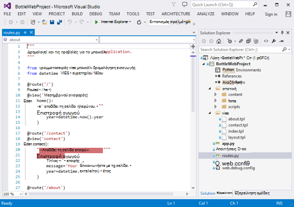
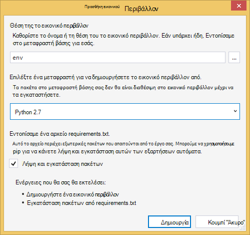
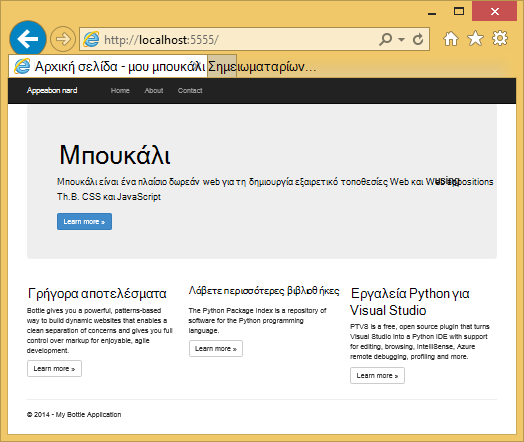
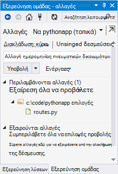
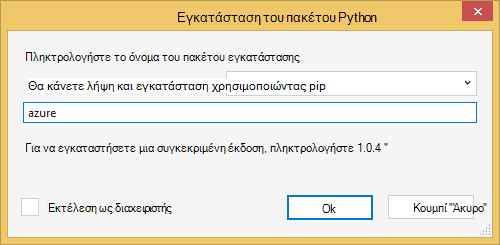
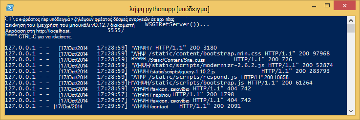
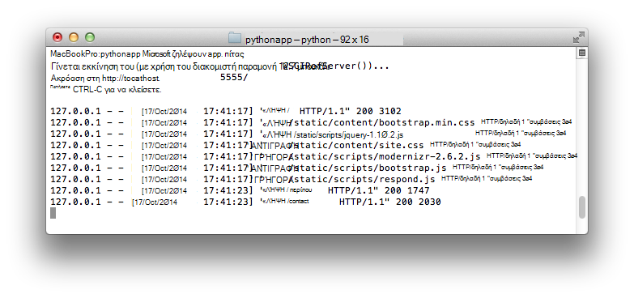
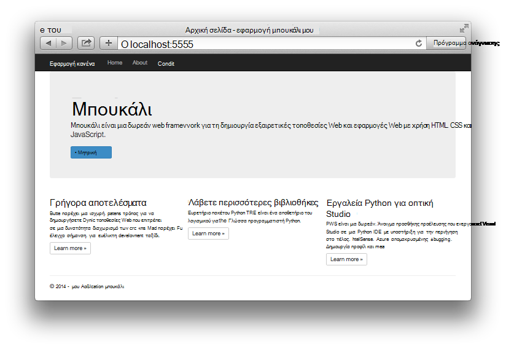

<properties 
    pageTitle="Python web apps με μπουκάλι στο Azure" 
    description="Ένα πρόγραμμα εκμάθησης που παρουσιάζει εκτελείται μια εφαρμογή web Python στο Azure εφαρμογής υπηρεσίας Web Apps." 
    services="app-service\web" 
    documentationCenter="python" 
    tags="python"
    authors="huguesv" 
    manager="wpickett" 
    editor=""/>

<tags 
    ms.service="app-service-web" 
    ms.workload="web" 
    ms.tgt_pltfrm="na" 
    ms.devlang="python" 
    ms.topic="article" 
    ms.date="02/19/2016"
    ms.author="huvalo"/>

# Δημιουργία εφαρμογών web με μπουκάλι στο Azure

Αυτό το πρόγραμμα εκμάθησης περιγράφει τον τρόπο για να ξεκινήσετε να εκτελείται Python στο Azure εφαρμογής υπηρεσίας Web Apps. Web Apps παρέχει περιορισμένες δωρεάν φιλοξενίας και γρήγορη ανάπτυξη και μπορείτε να χρησιμοποιήσετε Python! Καθώς εξελίσσεται η εφαρμογή σας, μπορείτε να μεταβείτε σε επί πληρωμή φιλοξενίας και, επίσης, μπορείτε να ενσωματώσετε με όλες τις άλλες υπηρεσίες Azure.

Θα δημιουργήσετε μια εφαρμογή web χρησιμοποιώντας το πλαίσιο web μπουκάλι (ανατρέξτε στο θέμα εναλλακτικές εκδόσεις αυτού του προγράμματος εκμάθησης για [Django](web-sites-python-create-deploy-django-app.md) και [φιάλη](web-sites-python-create-deploy-flask-app.md)). Θα δημιουργήσετε την εφαρμογή web από το Azure Marketplace, ρύθμιση Git ανάπτυξης και κλωνοποίηση τοπικά στο αποθετήριο. Στη συνέχεια, θα τοπικά εκτελέστε την εφαρμογή web, κάντε αλλαγές, ολοκλήρωση και push τις εφαρμογές του [Azure εφαρμογής υπηρεσίας Web](http://go.microsoft.com/fwlink/?LinkId=529714). Το πρόγραμμα εκμάθησης δείχνει πώς μπορείτε να το κάνετε αυτό από το Windows ή Mac/Linux.

[AZURE.INCLUDE [create-account-and-websites-note](../../includes/create-account-and-websites-note.md)]

>[AZURE.NOTE] Εάν θέλετε να γρήγορα αποτελέσματα με το Azure εφαρμογής υπηρεσίας πριν από την εγγραφή για λογαριασμό Azure, μεταβείτε στο [Δοκιμάστε εφαρμογής υπηρεσίας](http://go.microsoft.com/fwlink/?LinkId=523751), όπου μπορείτε να αμέσως δημιουργήσετε μια εφαρμογή web μικρής διάρκειας starter στην εφαρμογή υπηρεσίας. Δεν υπάρχει πιστωτικές κάρτες υποχρεωτικό, χωρίς δεσμεύσεις.

## Προαπαιτούμενα στοιχεία

- Windows, Mac ή Linux
- Python 2.7 ή 3.4
- setuptools, pip, virtualenv (Python 2.7 μόνο)
- Git
- [Εργαλεία Python 2.2 για το Visual Studio][] Σημείωση (PTVS) -: αυτό είναι προαιρετικό

**Σημείωση**: δημοσίευσης TFS αυτήν τη στιγμή δεν υποστηρίζεται για τα έργα Python.

### Windows

Εάν δεν έχετε ήδη Python 2.7 ή 3.4 εγκατεστημένων (32 bit), συνιστάται να την εγκατάσταση του [SDK Azure για Python 2.7] ή [Azure SDK για Python 3.4] χρήση Installer πλατφόρμα Web. Αυτό εγκαθιστά την έκδοση 32 bit του Python setuptools, pip, virtualenv, κλπ (32-bit Python είναι τι είναι εγκατεστημένο στους υπολογιστές Azure κεντρικού υπολογιστή). Εναλλακτικά, μπορείτε να λάβετε Python από [python.org].

Για Git, συνιστάται να [Git για Windows] ή [GitHub για Windows]. Εάν χρησιμοποιείτε το Visual Studio, μπορείτε να χρησιμοποιήσετε την ενσωματωμένη υποστήριξη Git.

Συνιστάται επίσης την εγκατάσταση [Python 2.2 εργαλεία για το Visual Studio]. Αυτό είναι προαιρετικό, αλλά εάν έχετε [Visual Studio], συμπεριλαμβανομένης της δωρεάν 2013 Κοινότητας Visual Studio ή οπτική το Studio Express 2013 για το Web, στη συνέχεια, αυτό θα σας δώσει μια εξαιρετική IDE Python.

### Mac/Linux

Θα πρέπει να έχετε Python και Git ήδη εγκατασταθεί, αλλά να βεβαιωθείτε ότι έχετε επιλέξει Python 2.7 ή 3.4.

## Δημιουργία εφαρμογής Web στην πύλη του Azure

Το πρώτο βήμα για τη δημιουργία της εφαρμογής σας είναι να δημιουργήσετε την εφαρμογή web μέσω του [Azure πύλη](https://portal.azure.com).  

1. Συνδεθείτε στην πύλη του Azure και κάντε κλικ στο κουμπί **ΔΗΜΙΟΥΡΓΊΑ** στην κάτω αριστερή γωνία. 
3. Στο πλαίσιο αναζήτησης, πληκτρολογήστε "python".
4. Στα αποτελέσματα αναζήτησης, επιλέξτε **μπουκάλι**και, στη συνέχεια, κάντε κλικ στην επιλογή **Δημιουργία**.
5. Ρύθμιση παραμέτρων της νέας εφαρμογής μπουκάλι, όπως τη δημιουργία νέου προγράμματος εφαρμογής υπηρεσίας και νέας ομάδας πόρων για αυτό. Στη συνέχεια, κάντε κλικ στην επιλογή **Δημιουργία**.
6. Ρυθμίστε τις παραμέτρους της δημοσίευσης Git για την εφαρμογή web που έχουν δημιουργηθεί πρόσφατα, ακολουθώντας τις οδηγίες στην [Τοπική ανάπτυξη Git σε Azure εφαρμογής υπηρεσίας](app-service-deploy-local-git.md).
 
## Επισκόπηση της εφαρμογής

### Περιεχόμενα Git αποθετήριο δεδομένων

Ακολουθεί μια επισκόπηση των αρχείων που θα βρείτε στο αρχικό αποθετήριο Git, που θα σας θα κλωνοποίηση στην επόμενη ενότητα.

    \routes.py
    \static\content\
    \static\fonts\
    \static\scripts\
    \views\about.tpl
    \views\contact.tpl
    \views\index.tpl
    \views\layout.tpl

Κύριο πηγών για την εφαρμογή. Αποτελείται από 3 σελίδες (ευρετήριο, σχετικά με την επαφή) με μια διάταξη υποδείγματος.  Στατικό περιεχόμενο και δεσμών ενεργειών περιλαμβάνουν εκκίνησης, jquery, modernizr και να απαντήσετε.

    \app.py

Υποστήριξη ανάπτυξης του τοπικού διακομιστή. Χρησιμοποιήστε αυτήν την επιλογή για να εκτελέσετε την εφαρμογή τοπικά.

    \BottleWebProject.pyproj
    \BottleWebProject.sln

Αρχεία Project για χρήση με [Εργαλεία Python για το Visual Studio].

    \ptvs_virtualenv_proxy.py

Διακομιστής μεσολάβησης των υπηρεσιών IIS για περιβάλλοντα εικονικού και PTVS απομακρυσμένου εντοπισμού υποστήριξης.

    \requirements.txt

Εξωτερική πακέτων απαιτείται από αυτήν την εφαρμογή. Η δέσμη ενεργειών ανάπτυξης θα pip εγκαταστήσετε τα πακέτα που αναφέρονται σε αυτό το αρχείο.
 
    \web.2.7.config
    \web.3.4.config

Αρχεία ρύθμισης παραμέτρων των υπηρεσιών IIS. Η δέσμη ενεργειών ανάπτυξης θα χρησιμοποιήσετε το κατάλληλο web.x.y.config και αντιγράψτε την ως web.config.

### Προαιρετικά αρχεία - Προσαρμογή ανάπτυξης

[AZURE.INCLUDE [web-sites-python-customizing-deployment](../../includes/web-sites-python-customizing-deployment.md)]

### Προαιρετικά αρχεία - Python χρόνου εκτέλεσης

[AZURE.INCLUDE [web-sites-python-customizing-runtime](../../includes/web-sites-python-customizing-runtime.md)]

### Πρόσθετα αρχεία στο διακομιστή

Ορισμένα αρχεία υπάρχει στο διακομιστή, αλλά δεν προστίθενται στο αποθετήριο git. Δημιουργούνται από τη δέσμη ενεργειών ανάπτυξης.

    \web.config

Αρχείο ρύθμισης παραμέτρων των υπηρεσιών IIS. Δημιουργία από web.x.y.config σε κάθε ανάπτυξης.

    \env\

Εικονικό περιβάλλον Python. Δημιουργήσατε κατά την ανάπτυξη εάν ένα συμβατό εικονικό περιβάλλον δεν υπάρχει ήδη στην εφαρμογή web.  Πακέτα που αναφέρονται σε requirements.txt είναι pip εγκατασταθεί, αλλά θα να παραλείψετε εγκατάστασης pip εάν έχετε ήδη εγκαταστήσει και τα πακέτα.

Το επόμενο 3 ενότητες περιγράφουν τον τρόπο για να συνεχίσετε με την ανάπτυξη εφαρμογών web, στην περιοχή 3 διαφορετικά περιβάλλοντα:

- Windows, με εργαλεία Python για το Visual Studio
- Windows, με τη γραμμή εντολών
- Mac/Linux, με τη γραμμή εντολών

## Ανάπτυξη εφαρμογών - Windows - Python εργαλεία για το Visual Studio στο Web

### Δημιουργία διπλότυπου το αποθετήριο δεδομένων

Πρώτα, κλωνοποίηση το αποθετήριο δεδομένων χρησιμοποιώντας τη διεύθυνση url που παρέχεται στην πύλη του Azure. Για περισσότερες πληροφορίες, ανατρέξτε στο θέμα [Τοπικό Git ανάπτυξης για να Azure εφαρμογής υπηρεσίας](app-service-deploy-local-git.md).

Ανοίξτε το αρχείο λύσης (.sln) που περιλαμβάνεται στη ρίζα του αποθετηρίου.

### Δημιουργία εικονικό περιβάλλον

Τώρα θα δημιουργήσουμε ένα εικονικό περιβάλλον για τοπική ανάπτυξη. Κάντε δεξί κλικ στην επιλογή **Περιβάλλοντα Python** **Προσθήκη εικονικό περιβάλλον...**.

- Βεβαιωθείτε ότι το όνομα του περιβάλλοντος είναι `env`.

- Επιλέξτε το πρόγραμμα μεταγλώττισης βάσης. Βεβαιωθείτε ότι χρησιμοποιείτε την ίδια έκδοση του Python που έχει επιλεγεί για την εφαρμογή web σας (σε runtime.txt ή το blade **Ρυθμίσεις εφαρμογής** της εφαρμογής web στην πύλη του Azure).

- Βεβαιωθείτε ότι είναι ενεργοποιημένη η επιλογή για να κάνετε λήψη και εγκατάσταση πακέτων.

Κάντε κλικ στην επιλογή **Δημιουργία**. Αυτό θα δημιουργήσετε το εικονικό περιβάλλον και εγκαταστήστε εξαρτήσεις που αναφέρονται σε requirements.txt.

### Εκτέλεση με χρήση διακομιστή ανάπτυξης

Πατήστε F5 για να ξεκινήσετε τον εντοπισμό σφαλμάτων και το πρόγραμμα περιήγησης web θα ανοίξει αυτόματα στη σελίδα εκτελείται τοπικά.

Μπορείτε να ορίσετε σημεία διακοπής στο τις προελεύσεις, χρησιμοποιήστε το windows παρακολούθησης, κ.λπ. Δείτε τα [Εργαλεία Python για την τεκμηρίωση του Visual Studio] για περισσότερες πληροφορίες σχετικά με τις διάφορες δυνατότητες.

### Κάντε αλλαγές

Τώρα μπορείτε να πειραματιστείτε με τις αλλαγές στην εφαρμογή προελεύσεις ή/και πρότυπα.

Αφού έχετε δοκιμάσει τις αλλαγές σας, ολοκλήρωση τους στο αποθετήριο Git:

### Εγκατάσταση περισσότερες πακέτων

Η εφαρμογή σας μπορεί να έχει εξαρτήσεις πέρα από Python και μπουκάλι.

Μπορείτε να εγκαταστήσετε πρόσθετα πακέτα χρησιμοποιώντας pip. Για να εγκαταστήσετε ένα πακέτο, κάντε δεξί κλικ στη το εικονικό περιβάλλον και επιλέξτε **Εγκατάσταση του πακέτου Python**.

Για παράδειγμα, για να εγκαταστήσετε το SDK Azure για Python, η οποία παρέχει πρόσβαση σε Azure αποθήκευση, την υπηρεσία bus και άλλες υπηρεσίες του Azure, πληκτρολογήστε `azure`:

Κάντε δεξί κλικ στη το εικονικό περιβάλλον και επιλέξτε **Δημιουργία requirements.txt** για να ενημερώσετε requirements.txt.

Στη συνέχεια, αποθηκεύστε τις αλλαγές σε requirements.txt του αποθετηρίου Git.

### Ανάπτυξη Azure

Για να ενεργοποιήσετε μια ανάπτυξη, κάντε κλικ στο κουμπί **Συγχρονισμός** ή **Push**. Συγχρονισμός κάνει μια push και μια ελκυστική.

Την πρώτη ανάπτυξη θα διαρκέσει αρκετά, όπως θα δημιουργήσει ένα εικονικό περιβάλλον, εγκατάσταση πακέτων, κ.λπ.

Visual Studio δεν εμφανίζει την πρόοδο της ανάπτυξης. Εάν θέλετε να αναθεωρήσετε το αποτέλεσμα, ανατρέξτε στην ενότητα στην [Αντιμετώπιση προβλημάτων - ανάπτυξης](#troubleshooting-deployment).

Μεταβείτε στη διεύθυνση URL Azure για να προβάλετε τις αλλαγές σας.

## Γραμμή εντολών - Windows - ανάπτυξη εφαρμογών Web

### Δημιουργία διπλότυπου το αποθετήριο δεδομένων

Πρώτα, κλωνοποίηση το αποθετήριο δεδομένων χρησιμοποιώντας τη διεύθυνση URL που παρέχεται στην πύλη του Azure και προσθέστε το Azure αποθετήριο δεδομένων ως έναν απομακρυσμένο. Για περισσότερες πληροφορίες, ανατρέξτε στο θέμα [Τοπικό Git ανάπτυξης για να Azure εφαρμογής υπηρεσίας](app-service-deploy-local-git.md).

    git clone <repo-url>
    cd <repo-folder>
    git remote add azure <repo-url> 

### Δημιουργία εικονικό περιβάλλον

Θα δημιουργήσουμε μια νέα εικονικό περιβάλλον για σκοπούς ανάπτυξης (δεν προσθέσετε στο αποθετήριο δεδομένων). Εικονικό περιβάλλοντα στο Python δεν είναι relocatable, ώστε κάθε προγραμματιστής εργασία σχετικά με την εφαρμογή θα δημιουργήσουν τις δικές τους τοπικά.

Βεβαιωθείτε ότι χρησιμοποιείτε την ίδια έκδοση του Python που έχει επιλεγεί για την εφαρμογή web σας (σε runtime.txt ή το blade ρυθμίσεις εφαρμογής για την εφαρμογή web σας στην πύλη του Azure)

Για Python 2.7:

    c:\python27\python.exe -m virtualenv env

Για Python 3.4:

    c:\python34\python.exe -m venv env

Εγκατάσταση των εξωτερικών πακέτων που απαιτούνται από την εφαρμογή σας. Μπορείτε να χρησιμοποιήσετε το αρχείο requirements.txt στον ριζικό κατάλογο του αποθετηρίου για να εγκαταστήσετε τα πακέτα στο εικονικό περιβάλλον σας:

    env\scripts\pip install -r requirements.txt

### Εκτέλεση με χρήση διακομιστή ανάπτυξης

Μπορείτε να εκκινήσετε την εφαρμογή στην περιοχή ένας διακομιστής ανάπτυξης με την ακόλουθη εντολή:

    env\scripts\python app.py

Η κονσόλα θα εμφανίσει τη διεύθυνση URL και παρακολουθεί θύρα διακομιστή για να:

Στη συνέχεια, ανοίξτε το πρόγραμμα περιήγησης web σε αυτήν τη διεύθυνση URL.

### Κάντε αλλαγές

Τώρα μπορείτε να πειραματιστείτε με τις αλλαγές στην εφαρμογή προελεύσεις ή/και πρότυπα.

Αφού έχετε δοκιμάσει τις αλλαγές σας, ολοκλήρωση τους στο αποθετήριο Git:

    git add <modified-file>
    git commit -m "<commit-comment>"

### Εγκατάσταση περισσότερες πακέτων

Η εφαρμογή σας μπορεί να έχει εξαρτήσεις πέρα από Python και μπουκάλι.

Μπορείτε να εγκαταστήσετε πρόσθετα πακέτα χρησιμοποιώντας pip. Για παράδειγμα, για να εγκαταστήσετε το SDK Azure για Python, η οποία παρέχει πρόσβαση σε Azure αποθήκευση, την υπηρεσία bus και άλλες υπηρεσίες του Azure, πληκτρολογήστε:

    env\scripts\pip install azure

Βεβαιωθείτε ότι έχετε ενημερώσει requirements.txt:

    env\scripts\pip freeze > requirements.txt

Αποθηκεύστε τις αλλαγές:

    git add requirements.txt
    git commit -m "Added azure package"

### Ανάπτυξη Azure

Για να ενεργοποιήσετε μια ανάπτυξη, δημοσιοποιήσετε τις αλλαγές σε Azure:

    git push azure master

Θα δείτε το αποτέλεσμα της δέσμης ενεργειών ανάπτυξης, συμπεριλαμβανομένων των εικονικό περιβάλλον δημιουργίας, εγκατάσταση των πακέτων, η δημιουργία web.config.

Μεταβείτε στη διεύθυνση URL Azure για να προβάλετε τις αλλαγές σας.

## Ανάπτυξη εφαρμογών - Mac/Linux - γραμμής εντολών στο Web

### Δημιουργία διπλότυπου το αποθετήριο δεδομένων

Πρώτα, κλωνοποίηση το αποθετήριο δεδομένων χρησιμοποιώντας τη διεύθυνση URL που παρέχεται στην πύλη του Azure και προσθέστε το Azure αποθετήριο δεδομένων ως έναν απομακρυσμένο. Για περισσότερες πληροφορίες, ανατρέξτε στο θέμα [Τοπικό Git ανάπτυξης για να Azure εφαρμογής υπηρεσίας](app-service-deploy-local-git.md).

    git clone <repo-url>
    cd <repo-folder>
    git remote add azure <repo-url> 

### Δημιουργία εικονικό περιβάλλον

Θα δημιουργήσουμε μια νέα εικονικό περιβάλλον για σκοπούς ανάπτυξης (δεν προσθέσετε στο αποθετήριο δεδομένων). Εικονικό περιβάλλοντα στο Python δεν είναι relocatable, ώστε κάθε προγραμματιστής εργασία σχετικά με την εφαρμογή θα δημιουργήσουν τις δικές τους τοπικά.

Βεβαιωθείτε ότι χρησιμοποιείτε την ίδια έκδοση του Python που έχει επιλεγεί για την εφαρμογή web σας (σε runtime.txt ή το blade ρυθμίσεις εφαρμογής της εφαρμογής web στην πύλη του Azure).

Για Python 2.7:

    python -m virtualenv env

Για Python 3.4:

    python -m venv env
ή pyvenv φάκελος

Εγκατάσταση των εξωτερικών πακέτων που απαιτούνται από την εφαρμογή σας. Μπορείτε να χρησιμοποιήσετε το αρχείο requirements.txt στον ριζικό κατάλογο του αποθετηρίου για να εγκαταστήσετε τα πακέτα στο εικονικό περιβάλλον σας:

    env/bin/pip install -r requirements.txt

### Εκτέλεση με χρήση διακομιστή ανάπτυξης

Μπορείτε να εκκινήσετε την εφαρμογή στην περιοχή ένας διακομιστής ανάπτυξης με την ακόλουθη εντολή:

    env/bin/python app.py

Η κονσόλα θα εμφανίσει τη διεύθυνση URL και παρακολουθεί θύρα διακομιστή για να:

Στη συνέχεια, ανοίξτε το πρόγραμμα περιήγησης web σε αυτήν τη διεύθυνση URL.

### Κάντε αλλαγές

Τώρα μπορείτε να πειραματιστείτε με τις αλλαγές στην εφαρμογή προελεύσεις ή/και πρότυπα.

Αφού έχετε δοκιμάσει τις αλλαγές σας, ολοκλήρωση τους στο αποθετήριο Git:

    git add <modified-file>
    git commit -m "<commit-comment>"

### Εγκατάσταση περισσότερες πακέτων

Η εφαρμογή σας μπορεί να έχει εξαρτήσεις πέρα από Python και μπουκάλι.

Μπορείτε να εγκαταστήσετε πρόσθετα πακέτα χρησιμοποιώντας pip. Για παράδειγμα, για να εγκαταστήσετε το SDK Azure για Python, η οποία παρέχει πρόσβαση σε Azure αποθήκευση, την υπηρεσία bus και άλλες υπηρεσίες του Azure, πληκτρολογήστε:

    env/bin/pip install azure

Φροντίστε να ενημερώνετε requirements.txt:

    env/bin/pip freeze > requirements.txt

Αποθηκεύστε τις αλλαγές:

    git add requirements.txt
    git commit -m "Added azure package"

### Ανάπτυξη Azure

Για να ενεργοποιήσετε μια ανάπτυξη, δημοσιοποιήσετε τις αλλαγές σε Azure:

    git push azure master

Θα δείτε το αποτέλεσμα της δέσμης ενεργειών ανάπτυξης, συμπεριλαμβανομένων των εικονικό περιβάλλον δημιουργίας, εγκατάσταση των πακέτων, η δημιουργία web.config.

Μεταβείτε στη διεύθυνση URL Azure για να προβάλετε τις αλλαγές σας.

## Αντιμετώπιση προβλημάτων - η εγκατάσταση του πακέτου

[AZURE.INCLUDE [web-sites-python-troubleshooting-package-installation](../../includes/web-sites-python-troubleshooting-package-installation.md)]

## Αντιμετώπιση προβλημάτων - εικονικό περιβάλλον

[AZURE.INCLUDE [web-sites-python-troubleshooting-virtual-environment](../../includes/web-sites-python-troubleshooting-virtual-environment.md)]

## Επόμενα βήματα

Ακολουθήστε αυτές τις συνδέσεις για να μάθετε περισσότερα σχετικά με μπουκάλι και Python εργαλεία για το Visual Studio: 
 
- [Μπουκάλι τεκμηρίωση]
- [Εργαλεία Python για την τεκμηρίωση του Visual Studio]

Για πληροφορίες σχετικά με τη χρήση χώρος αποθήκευσης πινάκων του Azure και MongoDB:

- [Μπουκάλι και MongoDB σε Azure με εργαλεία Python για το Visual Studio]
- [Μπουκάλι και χώρο αποθήκευσης πινάκων του Azure στη Azure με εργαλεία Python για το Visual Studio]

## Τι έχει αλλάξει
* Για οδηγίες για την αλλαγή από τοποθεσίες Web App υπηρεσία ανατρέξτε στο θέμα: [Azure εφαρμογής υπηρεσίας και τον αντίκτυπο σχετικά με τις υπάρχουσες υπηρεσίες Azure](http://go.microsoft.com/fwlink/?LinkId=529714)

<!--Link references-->
[Μπουκάλι και MongoDB σε Azure με εργαλεία Python για το Visual Studio]: web-sites-python-ptvs-bottle-table-storage.md
[Μπουκάλι και χώρο αποθήκευσης πινάκων του Azure στη Azure με εργαλεία Python για το Visual Studio]: web-sites-python-ptvs-bottle-table-storage.md

<!--External Link references-->
[Azure SDK για Python 2.7]: http://go.microsoft.com/fwlink/?linkid=254281
[Azure SDK για Python 3.4]: http://go.microsoft.com/fwlink/?linkid=516990
[Python.org]: http://www.python.org/
[Git για Windows]: http://msysgit.github.io/
[GitHub για Windows]: https://windows.github.com/
[Εργαλεία Python για το Visual Studio]: http://aka.ms/ptvs
[Python εργαλεία 2.2 για το Visual Studio]: http://go.microsoft.com/fwlink/?LinkID=624025
[Visual Studio]: http://www.visualstudio.com/
[Εργαλεία Python για την τεκμηρίωση του Visual Studio]: http://aka.ms/ptvsdocs 
[Μπουκάλι τεκμηρίωση]: http://bottlepy.org/docs/dev/index.html
 
