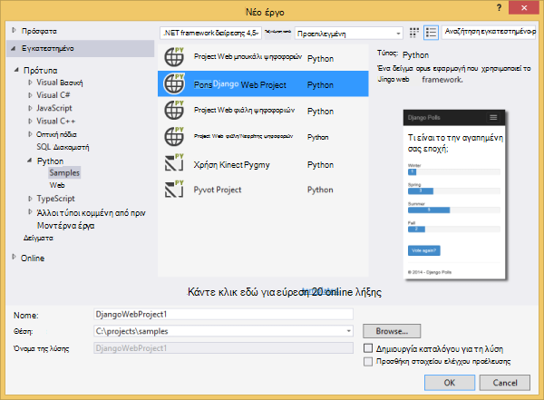
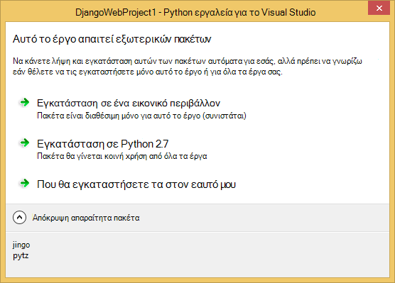
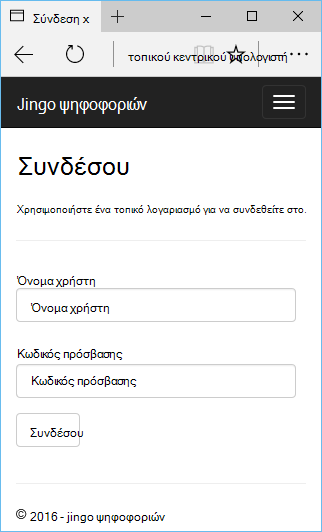
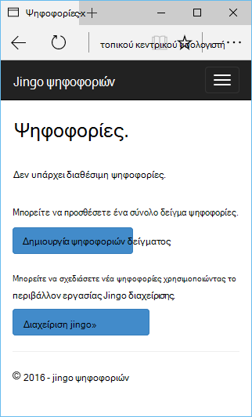
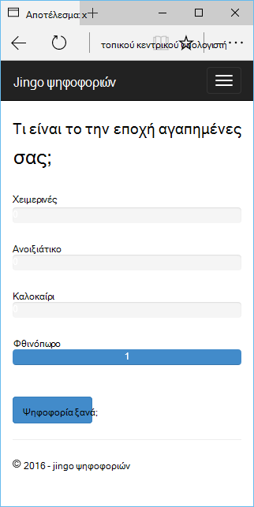
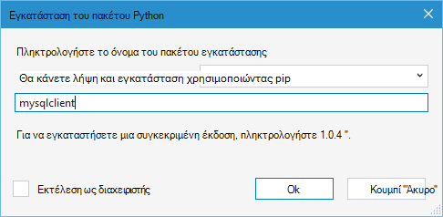
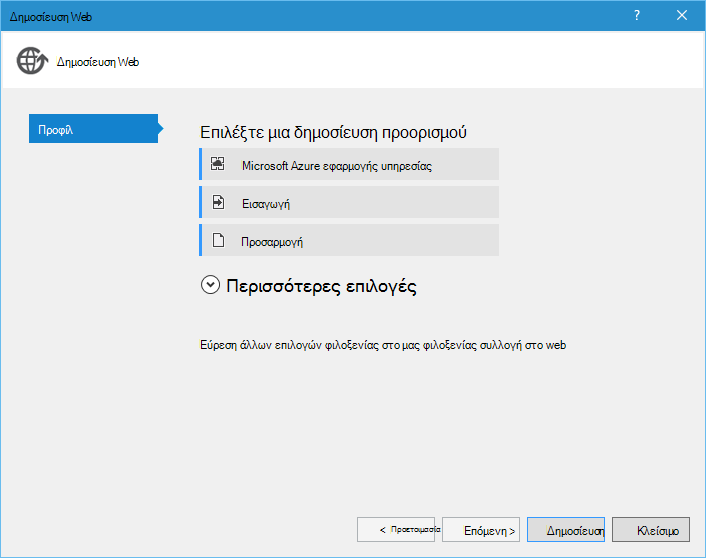
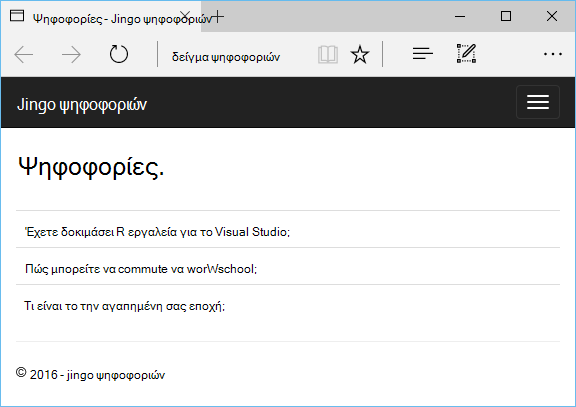

<properties 
    pageTitle="Django και MySQL σε Azure με εργαλεία Python 2.2 για το Visual Studio" 
    description="Μάθετε πώς μπορείτε να χρησιμοποιήσετε τα εργαλεία Python για το Visual Studio για να δημιουργήσετε μια εφαρμογή web Django που αποθηκεύει δεδομένα σε μια βάση δεδομένων MySQL την παρουσία και την αναπτύξει Azure εφαρμογής υπηρεσίας Web Apps." 
    services="app-service\web" 
    documentationCenter="python" 
    authors="huguesv" 
    manager="wpickett" 
    editor=""/>

<tags 
    ms.service="app-service-web" 
    ms.workload="web" 
    ms.tgt_pltfrm="na" 
    ms.devlang="python"
    ms.topic="get-started-article" 
    ms.date="07/07/2016"
    ms.author="huvalo"/>

# Django και MySQL σε Azure με εργαλεία Python 2.2 για το Visual Studio 

[AZURE.INCLUDE [tabs](../../includes/app-service-web-get-started-nav-tabs.md)]

Σε αυτό το πρόγραμμα εκμάθησης, θα χρησιμοποιήσετε [Python εργαλεία για το Visual Studio] (PTVS) για να δημιουργήσετε μια εφαρμογή web απλό ψηφοφορίες χρησιμοποιώντας ένα από τα πρότυπα δείγμα PTVS. Θα μάθετε πώς μπορείτε να χρησιμοποιήσετε μια υπηρεσία MySQL φιλοξενούνται σε Azure, πώς μπορείτε να ρυθμίσετε τις παραμέτρους της εφαρμογής web για να χρησιμοποιήσετε MySQL και πώς μπορείτε να δημοσιεύσετε την εφαρμογή web [Azure εφαρμογής υπηρεσίας Web Apps](http://go.microsoft.com/fwlink/?LinkId=529714).

> [AZURE.NOTE] Οι πληροφορίες που περιέχονται σε αυτό το πρόγραμμα εκμάθησης είναι επίσης διαθέσιμο στο βίντεο που ακολουθεί:
> 
> [PTVS 2.1: Εφαρμογή Django με MySQL][video]

Ανατρέξτε στο [Κέντρο για προγραμματιστές Python] για περισσότερα άρθρα που καλύπτουν ανάπτυξης του Azure εφαρμογής υπηρεσίας Web Apps με PTVS χρησιμοποιώντας μπουκάλι, φιάλη και Django πλαίσια web, με τις υπηρεσίες του χώρο αποθήκευσης πινάκων του Azure MySQL και βάση δεδομένων SQL. Ενώ σε αυτό το άρθρο εστιάζει στην εφαρμογή υπηρεσίας, τα βήματα είναι παρόμοια κατά την ανάπτυξη [Των υπηρεσιών Azure Cloud Services].

## Προαπαιτούμενα στοιχεία

 - Visual Studio 2015
 - [Python 2.7 32 bit] ή [Python 3.4 32 bit]
 - [Python εργαλεία 2.2 για το Visual Studio]
 - [Python εργαλεία 2.2 για Visual Studio δείγματα VSIX]
 - [Εργαλεία Azure SDK για ΣΎΓΚΡΙΣΗ 2015]
 - Django 1.9 ή νεότερη έκδοση

[AZURE.INCLUDE [create-account-and-websites-note](../../includes/create-account-and-websites-note.md)]

<!-- This note should not render as part of the the previous include. -->

> [AZURE.NOTE] Εάν θέλετε να γρήγορα αποτελέσματα με το Azure εφαρμογής υπηρεσίας πριν από την εγγραφή για λογαριασμό Azure, μεταβείτε στο [Δοκιμάστε εφαρμογής υπηρεσίας](http://go.microsoft.com/fwlink/?LinkId=523751), όπου μπορείτε να αμέσως δημιουργήσετε μια εφαρμογή web μικρής διάρκειας starter στην εφαρμογή υπηρεσίας. Δεν υπάρχει πιστωτική κάρτα απαιτείται και δεσμεύσεις δεν είναι απαραίτητα.

## Δημιουργία έργου

Σε αυτήν την ενότητα, θα μπορείτε να δημιουργήσετε ένα έργο Visual Studio χρησιμοποιώντας το δείγμα προτύπου. Θα δημιουργήσετε ένα εικονικό περιβάλλον και εγκαταστήσετε απαιτείται πακέτα. Θα μπορείτε να δημιουργήσετε μια τοπική βάση δεδομένων με χρήση sqlite. Στη συνέχεια, θα μπορείτε να εκτελέσετε την εφαρμογή τοπικά.

1. Στο Visual Studio, επιλέξτε **αρχείο**, το **Νέο έργο**.

1. Τα πρότυπα του έργου από το [Python 2.2 εργαλεία για Visual Studio δείγματα VSIX] είναι διαθέσιμες στην περιοχή **Python**, **δείγματα**. Επιλέξτε **Project Web Django ψηφοφοριών** και κάντε κλικ στο κουμπί OK για να δημιουργήσετε το έργο.

    

1. Θα σας ζητηθεί να εγκαταστήσετε το εξωτερικό πακέτων. Επιλέξτε **εγκατάσταση σε ένα εικονικό περιβάλλον**.

    

1. Επιλέξτε **Python 2.7** ή **Python 3.4** ως το βασικό μεταφραστή.

    

1. Στην **Εξερεύνηση λύσεων**, κάντε δεξί κλικ στον κόμβο του έργου και επιλέξτε **Python**και, στη συνέχεια, επιλέξτε **Django μετεγκατάσταση**.  Στη συνέχεια, επιλέξτε **Superuser δημιουργία Django**.

1. Θα ανοίξει μια κονσόλα διαχείρισης Django και δημιουργήστε μια βάση δεδομένων sqlite στο φάκελο του έργου. Ακολουθήστε τις οδηγίες για να δημιουργήσετε έναν νέο χρήστη.

1. Επιβεβαιώστε ότι λειτουργεί η εφαρμογή πατώντας το συνδυασμό πλήκτρων `F5`.

1. Κάντε κλικ στην επιλογή **σύνδεση στο** από τη γραμμή περιήγησης στο επάνω μέρος.

    

1. Εισαγάγετε τα διαπιστευτήρια για το χρήστη που δημιουργήσατε κατά το συγχρονισμό της βάσης δεδομένων.

    

1. Κάντε κλικ στην επιλογή **Δημιουργία ψηφοφοριών δείγμα**.

    

1. Κάντε κλικ σε μια ψηφοφορία και ψηφοφορία.

    

## Δημιουργήστε μια βάση δεδομένων MySQL

Για τη βάση δεδομένων, θα δημιουργήσετε μια βάση δεδομένων ClearDB MySQL φιλοξενούμενη σε Azure.

Ως εναλλακτική λύση, μπορείτε να δημιουργήσετε το δικό σας εικονικό μηχάνημα που εκτελείται στο Azure, στη συνέχεια, να εγκαταστήσετε και να διαχειριστείτε MySQL στον εαυτό σας.

Μπορείτε να δημιουργήσετε μια βάση δεδομένων με ένα δωρεάν πρόγραμμα ακολουθώντας τα παρακάτω βήματα.

1. Συνδεθείτε [πύλη του Azure].

1. Στο επάνω μέρος του παραθύρου περιήγησης, κάντε κλικ στην επιλογή **ΔΗΜΙΟΥΡΓΊΑ**, στη συνέχεια, κάντε κλικ στην επιλογή **δεδομένα + χώρος αποθήκευσης**και, στη συνέχεια, κάντε κλικ στην επιλογή **Βάση δεδομένων MySQL**. 

1. Ρύθμιση παραμέτρων τη νέα βάση δεδομένων MySQL με τη δημιουργία νέας ομάδας πόρων και επιλέξτε την κατάλληλη θέση για αυτήν.

1. Όταν δημιουργηθεί η βάση δεδομένων MySQL, κάντε κλικ στην επιλογή **Ιδιότητες** στο blade τη βάση δεδομένων.

1. Χρησιμοποιήστε το κουμπί "Αντιγραφή" για να τοποθετήσετε την τιμή της **ΣΥΜΒΟΛΟΣΕΙΡΆΣ ΣΎΝΔΕΣΗΣ** στο Πρόχειρο.

## Ρύθμιση παραμέτρων του έργου

Σε αυτήν την ενότητα, θα μπορείτε να ρυθμίσετε τις παραμέτρους του web app για να χρησιμοποιήσετε τη βάση δεδομένων MySQL που μόλις δημιουργήσατε. Μπορείτε, επίσης, θα εγκαταστήσετε πρόσθετα πακέτα Python που απαιτείται για τη χρήση βάσεων δεδομένων MySQL με Django. Στη συνέχεια, θα μπορείτε να εκτελέσετε την εφαρμογή web τοπικά.

1. Στο Visual Studio, ανοίξτε **settings.py**, από το φάκελο *όνομα έργου* . Επικόλληση προσωρινά τη συμβολοσειρά σύνδεσης στο πρόγραμμα επεξεργασίας. Η συμβολοσειρά σύνδεσης είναι σε αυτήν τη μορφή:

        Database=<NAME>;Data Source=<HOST>;User Id=<USER>;Password=<PASSWORD>

    Αλλαγή της προεπιλεγμένης βάσης δεδομένων για να χρησιμοποιήσετε MySQL **ΜΗΧΑΝΙΣΜΌΣ** και ορίστε τις τιμές για το **ΌΝΟΜΑ**, **ΧΡΉΣΤΗ**, **τον κωδικό ΠΡΌΣΒΑΣΗΣ** και **κεντρικού ΥΠΟΛΟΓΙΣΤΉ** από τη **συμβολοσειρά ΣΎΝΔΕΣΗΣ**.

        DATABASES = {
            'default': {
                'ENGINE': 'django.db.backends.mysql',
                'NAME': '<Database>',
                'USER': '<User Id>',
                'PASSWORD': '<Password>',
                'HOST': '<Data Source>',
                'PORT': '',
            }
        }

1. Στην Εξερεύνηση λύσεων, στην περιοχή **Python περιβάλλοντα**, κάντε δεξί κλικ στη το εικονικό περιβάλλον και επιλέξτε **Εγκατάσταση του πακέτου Python**.

1. Εγκατάσταση του πακέτου `mysqlclient` χρησιμοποιώντας **pip**.

    

1. Στην **Εξερεύνηση λύσεων**, κάντε δεξί κλικ στον κόμβο του έργου και επιλέξτε **Python**και, στη συνέχεια, επιλέξτε **Django μετεγκατάσταση**.  Στη συνέχεια, επιλέξτε **Superuser δημιουργία Django**.

    Αυτό θα δημιουργήσει τους πίνακες για τη βάση δεδομένων MySQL που δημιουργήσατε στην προηγούμενη ενότητα. Ακολουθήστε τις οδηγίες για να δημιουργήσετε ένα χρήστη, η οποία δεν πρέπει να συμφωνεί με το χρήστη στη βάση δεδομένων sqlite δημιουργήσει στην πρώτη ενότητα αυτού του άρθρου.

1. Εκτελέστε την εφαρμογή με `F5`. Θα να σειριοποιηθεί ψηφοφορίες που έχουν δημιουργηθεί με **Δημιουργία ψηφοφοριών δείγμα** και τα δεδομένα που υποβάλλονται από ψηφοφορία στη βάση δεδομένων MySQL.

## Δημοσίευση της εφαρμογής web σε Azure εφαρμογής υπηρεσίας

Το .NET SDK Azure αποτελούν έναν εύκολο τρόπο για να αναπτύξετε την εφαρμογή web της σε Azure εφαρμογής υπηρεσίας.

1. Στην **Εξερεύνηση λύσεων**, κάντε δεξί κλικ στον κόμβο του έργου και επιλέξτε **Δημοσίευση**.

    

1. Κάντε κλικ στο **Microsoft Azure εφαρμογής υπηρεσίας**.

1. Κάντε κλικ στην επιλογή **Δημιουργία** για να δημιουργήσετε μια νέα εφαρμογή web.

1. Συμπληρώστε τα παρακάτω πεδία και κάντε κλικ στην επιλογή **Δημιουργία**:
    - **Όνομα εφαρμογής Web**
    - **Πρόγραμμα εφαρμογής υπηρεσίας**
    - **Ομάδα πόρων**
    - **Περιοχή**
    - Αποχώρηση από **διακομιστή βάσης δεδομένων** , ορίστε σε **καμία βάση δεδομένων**

1. Αποδεχτείτε όλες τις άλλες προεπιλεγμένες τιμές και κάντε κλικ στο κουμπί **Δημοσίευση**.

1. Το πρόγραμμα περιήγησης web θα ανοίξει αυτόματα το δημοσιευμένο web app. Θα πρέπει να βλέπετε το web app λειτουργούν όπως αναμένεται, χρησιμοποιώντας τη βάση δεδομένων **MySQL** φιλοξενούνται σε Azure.

    

    Συγχαρητήρια! Έχετε δημοσιεύσει με επιτυχία την εφαρμογή web βάσει MySQL στο Azure.

## Επόμενα βήματα

Ακολουθήστε αυτές τις συνδέσεις για να μάθετε περισσότερα σχετικά με τα εργαλεία Python για Visual Studio, Django και MySQL.

- [Εργαλεία Python για την τεκμηρίωση του Visual Studio]
  - [Τα έργα Web]
  - [Έργα υπηρεσίας cloud]
  - [Ο απομακρυσμένος εντοπισμός σφαλμάτων στο Microsoft Azure]
- [Τεκμηρίωση Django]
- [MySQL]

Για περισσότερες πληροφορίες, ανατρέξτε στο [Κέντρο για προγραμματιστές Python](/develop/python/).

<!--Link references-->

[Κέντρο για προγραμματιστές Python]: /develop/python/
[Υπηρεσίες Azure Cloud]: ../cloud-services-python-ptvs.md

<!--External Link references-->

[Πύλη του Azure]: https://portal.azure.com
[Εργαλεία Python για το Visual Studio]: http://aka.ms/ptvs
[Python εργαλεία 2.2 για το Visual Studio]: http://go.microsoft.com/fwlink/?LinkID=624025
[Python εργαλεία 2.2 για Visual Studio δείγματα VSIX]: http://go.microsoft.com/fwlink/?LinkID=624025
[Εργαλεία Azure SDK για ΣΎΓΚΡΙΣΗ 2015]: http://go.microsoft.com/fwlink/?LinkId=518003
[Python 2.7 32-bit]: http://go.microsoft.com/fwlink/?LinkId=517190 
[Python 3.4 32-bit]: http://go.microsoft.com/fwlink/?LinkId=517191
[Εργαλεία Python για την τεκμηρίωση του Visual Studio]: http://aka.ms/ptvsdocs
[Ο απομακρυσμένος εντοπισμός σφαλμάτων στο Microsoft Azure]: http://go.microsoft.com/fwlink/?LinkId=624026
[Τα έργα Web]: http://go.microsoft.com/fwlink/?LinkId=624027
[Έργα υπηρεσίας cloud]: http://go.microsoft.com/fwlink/?LinkId=624028
[Τεκμηρίωση Django]: https://www.djangoproject.com/
[MySQL]: http://www.mysql.com/
[video]: http://youtu.be/oKCApIrS0Lo
