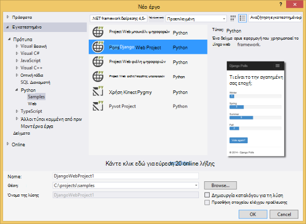
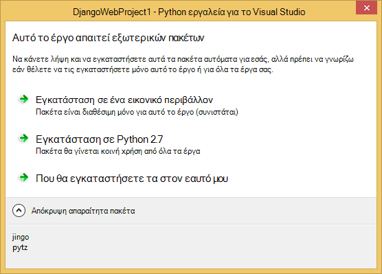
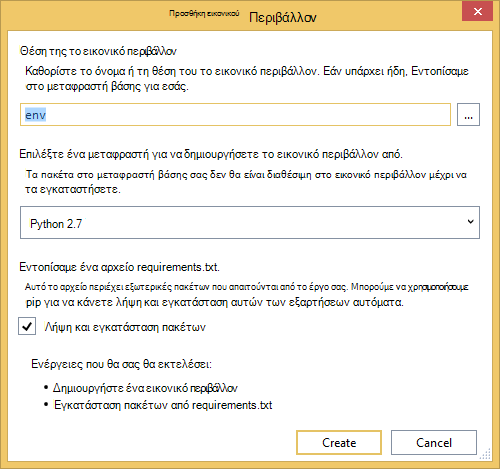
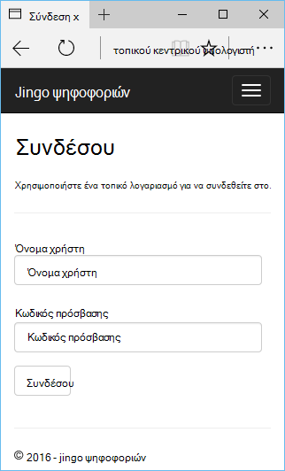
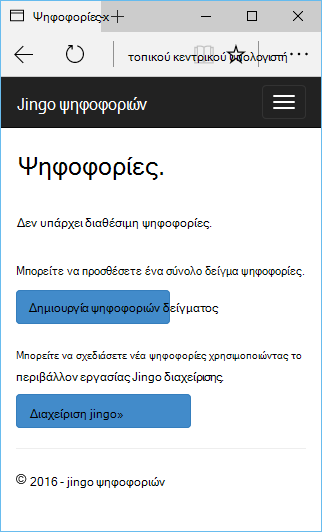
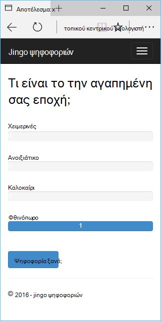
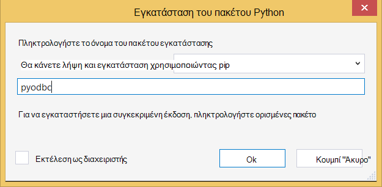
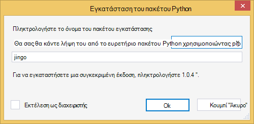
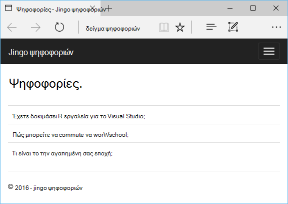

<properties 
    pageTitle="Django και βάση δεδομένων SQL στο Azure με εργαλεία Python 2.2 για το Visual Studio" 
    description="Μάθετε πώς μπορείτε να χρησιμοποιήσετε τα εργαλεία Python για το Visual Studio για να δημιουργήσετε μια εφαρμογή web Django που αποθηκεύει δεδομένα σε μια παρουσία της βάσης δεδομένων SQL και αναπτύξει Azure εφαρμογής υπηρεσίας Web Apps." 
    services="app-service\web" 
    tags="python"
    documentationCenter="python" 
    authors="huguesv" 
    manager="wpickett" 
    editor=""/>

<tags 
    ms.service="app-service-web" 
    ms.workload="web" 
    ms.tgt_pltfrm="na" 
    ms.devlang="python" 
    ms.topic="article" 
    ms.date="07/07/2016"
    ms.author="huguesv"/>

# Django και βάση δεδομένων SQL στο Azure με εργαλεία Python 2.2 για το Visual Studio 

Σε αυτό το πρόγραμμα εκμάθησης, θα χρησιμοποιήσουμε [Python εργαλεία για το Visual Studio] για να δημιουργήσετε μια εφαρμογή web απλό ψηφοφορίες χρησιμοποιώντας ένα από τα πρότυπα δείγμα PTVS της. Αυτό το πρόγραμμα εκμάθησης είναι επίσης διαθέσιμη ως ένα [βίντεο](https://www.youtube.com/watch?v=ZwcoGcIeHF4).

Θα σας θα μάθετε πώς μπορείτε να χρησιμοποιήσετε μια βάση δεδομένων SQL που φιλοξενούνται στο Azure, πώς μπορείτε να ρυθμίσετε τις παραμέτρους της εφαρμογής web για να χρησιμοποιήσετε μια βάση δεδομένων SQL και πώς μπορείτε να δημοσιεύσετε την εφαρμογή web [Azure εφαρμογής υπηρεσίας Web Apps](http://go.microsoft.com/fwlink/?LinkId=529714).

Ανατρέξτε στο [Κέντρο για προγραμματιστές Python] για περισσότερα άρθρα που καλύπτουν ανάπτυξης του Azure εφαρμογής υπηρεσίας Web Apps με PTVS χρησιμοποιώντας μπουκάλι, φιάλη και Django πλαίσια web, με τις υπηρεσίες του χώρο αποθήκευσης πινάκων του Azure, MySQL και βάση δεδομένων SQL. Ενώ σε αυτό το άρθρο εστιάζει στην εφαρμογή υπηρεσίας, τα βήματα είναι παρόμοια κατά την ανάπτυξη [Των υπηρεσιών Azure Cloud Services].

## Προαπαιτούμενα στοιχεία

 - Visual Studio 2015
 - [Python 2.7 32-bit]
 - [Python εργαλεία 2.2 για το Visual Studio]
 - [Python εργαλεία 2.2 για Visual Studio δείγματα VSIX]
 - [Εργαλεία Azure SDK για ΣΎΓΚΡΙΣΗ 2015]
 - Django 1.9 ή νεότερη έκδοση

[AZURE.INCLUDE [create-account-and-websites-note](../../includes/create-account-and-websites-note.md)]

>[AZURE.NOTE] Εάν θέλετε να γρήγορα αποτελέσματα με το Azure εφαρμογής υπηρεσίας πριν από την εγγραφή για λογαριασμό Azure, μεταβείτε στο [Δοκιμάστε εφαρμογής υπηρεσίας](http://go.microsoft.com/fwlink/?LinkId=523751), όπου μπορείτε να αμέσως δημιουργήσετε μια εφαρμογή web μικρής διάρκειας starter στην εφαρμογή υπηρεσίας. Δεν υπάρχει πιστωτικές κάρτες υποχρεωτικό, χωρίς δεσμεύσεις.

## Δημιουργία έργου

Σε αυτήν την ενότητα, θα δημιουργήσουμε ένα έργο Visual Studio χρησιμοποιώντας το δείγμα προτύπου. Θα δημιουργήσετε ένα εικονικό περιβάλλον και θα εγκαταστήσετε απαιτείται πακέτα. Θα δημιουργήσουμε μια τοπική βάση δεδομένων με χρήση sqlite. Στη συνέχεια, θα σας θα εκτελείται τοπικά στην εφαρμογή web.

1.  Στο Visual Studio, επιλέξτε **αρχείο**, το **Νέο έργο**.

1.  Τα πρότυπα του έργου από το [Python 2.2 εργαλεία για Visual Studio δείγματα VSIX] είναι διαθέσιμες στην περιοχή **Python**, **δείγματα**. Επιλέξτε **Project Web Django ψηφοφοριών** και κάντε κλικ στο κουμπί OK για να δημιουργήσετε το έργο.

    

1.  Θα σας ζητηθεί να εγκαταστήσετε το εξωτερικό πακέτων. Επιλέξτε **εγκατάσταση σε ένα εικονικό περιβάλλον**.

    

1.  Επιλέξτε **Python 2.7** ως στο μεταφραστή βάσης.

    

1.  Στην **Εξερεύνηση λύσεων**, κάντε δεξί κλικ στον κόμβο του έργου και επιλέξτε **Python**και, στη συνέχεια, επιλέξτε **Django μετεγκατάσταση**.  Στη συνέχεια, επιλέξτε **Superuser δημιουργία Django**.

1.  Θα ανοίξει μια κονσόλα διαχείρισης Django και δημιουργήστε μια βάση δεδομένων sqlite στο φάκελο του έργου. Ακολουθήστε τις οδηγίες για να δημιουργήσετε έναν νέο χρήστη.

1.  Επιβεβαιώστε ότι λειτουργεί η εφαρμογή πατώντας το πλήκτρο <kbd>F5</kbd>.

1.  Κάντε κλικ στην επιλογή **σύνδεση στο** από τη γραμμή περιήγησης στο επάνω μέρος.

    

1.  Εισαγάγετε τα διαπιστευτήρια για το χρήστη που δημιουργήσατε κατά το συγχρονισμό της βάσης δεδομένων.

    

1.  Κάντε κλικ στην επιλογή **Δημιουργία ψηφοφοριών δείγμα**.

    

1.  Κάντε κλικ σε μια ψηφοφορία και ψηφοφορία.

    

## Δημιουργία βάσης δεδομένων SQL

Για τη βάση δεδομένων, θα δημιουργήσουμε μια βάση δεδομένων Azure SQL.

Μπορείτε να δημιουργήσετε μια βάση δεδομένων, ακολουθώντας τα παρακάτω βήματα.

1.  Σύνδεση στο [Azure πύλη].

1.  Στο κάτω μέρος του παραθύρου περιήγησης, κάντε κλικ στην επιλογή **ΔΗΜΙΟΥΡΓΊΑ**. , κάντε κλικ στην επιλογή **δεδομένα + χώρος αποθήκευσης** > **Βάση δεδομένων SQL**.

1.  Ρύθμιση παραμέτρων της νέας βάσης δεδομένων SQL κατά τη δημιουργία νέας ομάδας πόρων και επιλέξτε την κατάλληλη θέση για αυτήν.

1.  Όταν δημιουργηθεί η βάση δεδομένων SQL, κάντε κλικ στην επιλογή **ανοιχτή στο Visual Studio** στο blade τη βάση δεδομένων.
2.  Κάντε κλικ στην επιλογή **Ρύθμιση παραμέτρων του τείχους προστασίας**.
3.  Στο το blade **Ρυθμίσεις του τείχους προστασίας** , προσθέστε έναν κανόνα τείχους προστασίας με **IP ΈΝΑΡΞΗΣ** και **ΛΉΞΗΣ IP** ρύθμιση στη δημόσια διεύθυνση IP του υπολογιστή σας στην ανάπτυξη. Κάντε κλικ στην επιλογή **Αποθήκευση**.

    Αυτό θα σας επιτρέψει συνδέσεις στο διακομιστή βάσης δεδομένων από τον υπολογιστή σας στην ανάπτυξη.

4.  Πίσω στο blade τη βάση δεδομένων, κάντε κλικ στην επιλογή **Ιδιότητες**και, στη συνέχεια, κάντε κλικ στην επιλογή **Εμφάνιση συμβολοσειρές σύνδεσης βάσης δεδομένων**. 

2.  Χρησιμοποιήστε το κουμπί "Αντιγραφή" για να τοποθετήσετε την τιμή του **ADO.NET** στο Πρόχειρο.

## Ρύθμιση παραμέτρων του έργου

Σε αυτήν την ενότητα, θα σας θα ρυθμίσετε τις παραμέτρους του web app για να χρησιμοποιήσετε τη βάση δεδομένων SQL που δημιουργήσαμε. Θα, επίσης, να εγκαταστήσετε πρόσθετα πακέτα Python που απαιτείται για τη χρήση βάσεων δεδομένων SQL με Django. Στη συνέχεια, θα σας θα εκτελείται τοπικά στην εφαρμογή web.

1.  Στο Visual Studio, ανοίξτε **settings.py**, από το φάκελο *όνομα έργου* . Επικόλληση προσωρινά τη συμβολοσειρά σύνδεσης στο πρόγραμμα επεξεργασίας. Η συμβολοσειρά σύνδεσης είναι σε αυτήν τη μορφή:

        Server=<ServerName>,<ServerPort>;Database=<DatabaseName>;User ID=<UserName>;Password={your_password_here};Encrypt=True;TrustServerCertificate=False;Connection Timeout=30;

Επεξεργασία του ορισμού `DATABASES` να χρησιμοποιήσετε τις παραπάνω τιμές.

        DATABASES = {
            'default': {
                'ENGINE': 'sql_server.pyodbc',
                'NAME': '<DatabaseName>',
                'USER': '<UserName>',
                'PASSWORD': '{your_password_here}',
                'HOST': '<ServerName>',
                'PORT': '<ServerPort>',
                'OPTIONS': {
                    'driver': 'SQL Server Native Client 11.0',
                    'MARS_Connection': 'True',
                }
            }
        }

1.  Στην Εξερεύνηση λύσεων, στην περιοχή **Python περιβάλλοντα**, κάντε δεξί κλικ στη το εικονικό περιβάλλον και επιλέξτε **Εγκατάσταση του πακέτου Python**.

1.  Εγκατάσταση του πακέτου `pyodbc` χρησιμοποιώντας **pip**.

    

1.  Εγκατάσταση του πακέτου `django-pyodbc-azure` χρησιμοποιώντας **pip**.

    

1.  Στην **Εξερεύνηση λύσεων**, κάντε δεξί κλικ στον κόμβο του έργου και επιλέξτε **Python**και, στη συνέχεια, επιλέξτε **Django μετεγκατάσταση**.  Στη συνέχεια, επιλέξτε **Superuser δημιουργία Django**.

    Αυτό θα δημιουργήσει τους πίνακες για τη βάση δεδομένων SQL που δημιουργήσαμε στην προηγούμενη ενότητα. Ακολουθήστε τις οδηγίες για να δημιουργήσετε ένα χρήστη, το οποίο δεν έχει ώστε να ταιριάζει με το χρήστη στη βάση δεδομένων sqlite δημιουργήσει στην πρώτη ενότητα.

1.  Εκτελέστε την εφαρμογή με `F5`. Θα να σειριοποιηθεί ψηφοφορίες που έχουν δημιουργηθεί με **Δημιουργία ψηφοφοριών δείγμα** και τα δεδομένα που υποβάλλονται από ψηφοφορία στη βάση δεδομένων SQL.

## Δημοσίευση της εφαρμογής web σε Azure εφαρμογής υπηρεσίας

Το .NET SDK Azure αποτελούν έναν εύκολο τρόπο για να αναπτύξετε την εφαρμογή web της web σε Azure εφαρμογής υπηρεσίας Web Apps.

1.  Στην **Εξερεύνηση λύσεων**, κάντε δεξί κλικ στον κόμβο του έργου και επιλέξτε **Δημοσίευση**.

    

1.  Κάντε κλικ σε **εφαρμογές Web της Microsoft Azure**.

1.  Κάντε κλικ στην επιλογή **Δημιουργία** για να δημιουργήσετε μια νέα εφαρμογή web.

1.  Συμπληρώστε τα παρακάτω πεδία και κάντε κλικ στην επιλογή **Δημιουργία**.
    -   **Όνομα εφαρμογής Web**
    -   **Πρόγραμμα εφαρμογής υπηρεσίας**
    -   **Ομάδα πόρων**
    -   **Περιοχή**
    -   Αποχώρηση από **διακομιστή βάσης δεδομένων** , ορίστε σε **καμία βάση δεδομένων**

1.  Αποδεχτείτε όλες τις άλλες προεπιλεγμένες τιμές και κάντε κλικ στο κουμπί **Δημοσίευση**.

1.  Το πρόγραμμα περιήγησης web θα ανοίξει αυτόματα το δημοσιευμένο web app. Θα πρέπει να βλέπετε την εφαρμογή web λειτουργεί με τον αναμενόμενο τρόπο, χρησιμοποιώντας τη βάση δεδομένων **SQL** που φιλοξενούνται στο Azure.

    Συγχαρητήρια!

    

## Επόμενα βήματα

Ακολουθήστε αυτές τις συνδέσεις για να μάθετε περισσότερα σχετικά με τα εργαλεία Python για Visual Studio, Django και βάση δεδομένων SQL.

- [Εργαλεία Python για την τεκμηρίωση του Visual Studio]
  - [Τα έργα Web]
  - [Έργα υπηρεσίας cloud]
  - [Ο απομακρυσμένος εντοπισμός σφαλμάτων στο Microsoft Azure]
- [Τεκμηρίωση Django]
- [Βάση δεδομένων SQL]

## Τι έχει αλλάξει
* Για οδηγίες για την αλλαγή από τοποθεσίες Web App υπηρεσία ανατρέξτε στο θέμα: [Azure εφαρμογής υπηρεσίας και τον αντίκτυπο σχετικά με τις υπάρχουσες υπηρεσίες Azure](http://go.microsoft.com/fwlink/?LinkId=529714)

<!--Link references-->
[Κέντρο για προγραμματιστές Python]: /develop/python/
[Υπηρεσίες Azure Cloud]: ../cloud-services-python-ptvs.md

<!--External Link references-->
[Πύλη του Azure]: https://portal.azure.com
[Εργαλεία Python για το Visual Studio]: http://aka.ms/ptvs
[Python εργαλεία 2.2 για το Visual Studio]: http://go.microsoft.com/fwlink/?LinkID=624025
[Python εργαλεία 2.2 για Visual Studio δείγματα VSIX]: http://go.microsoft.com/fwlink/?LinkID=624025
[Εργαλεία Azure SDK για ΣΎΓΚΡΙΣΗ 2015]: http://go.microsoft.com/fwlink/?LinkId=518003
[Python 2.7 32-bit]: http://go.microsoft.com/fwlink/?LinkId=517190 
[Εργαλεία Python για την τεκμηρίωση του Visual Studio]: http://aka.ms/ptvsdocs
[Ο απομακρυσμένος εντοπισμός σφαλμάτων στο Microsoft Azure]: http://go.microsoft.com/fwlink/?LinkId=624026
[Τα έργα Web]: http://go.microsoft.com/fwlink/?LinkId=624027
[Έργα υπηρεσίας cloud]: http://go.microsoft.com/fwlink/?LinkId=624028
[Τεκμηρίωση Django]: https://www.djangoproject.com/
[Βάση δεδομένων SQL]: /documentation/services/sql-database/
