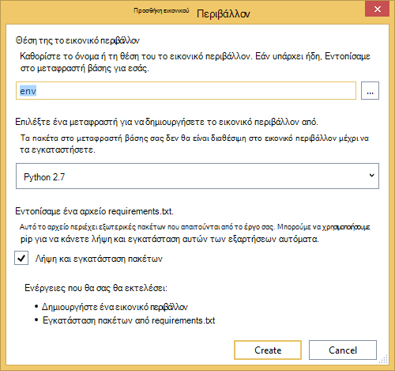

<properties 
    pageTitle="Φιάλη και χώρο αποθήκευσης πινάκων του Azure στη Azure με εργαλεία Python 2.2 για το Visual Studio" 
    description="Μάθετε πώς μπορείτε να χρησιμοποιήσετε τα εργαλεία Python για το Visual Studio για να δημιουργήσετε μια εφαρμογή web φιάλη που αποθηκεύει τα δεδομένα στο χώρο αποθήκευσης πινάκων του Azure και την αναπτύξει Azure εφαρμογής υπηρεσίας Web Apps." 
    services="app-service\web"
    tags="python"
    documentationCenter="python" 
    authors="huguesv" 
    manager="wpickett" 
    editor=""/>

<tags 
    ms.service="app-service-web" 
    ms.workload="web" 
    ms.tgt_pltfrm="na" 
    ms.devlang="python" 
    ms.topic="article" 
    ms.date="07/07/2016"
    ms.author="huvalo"/>

# Φιάλη και χώρο αποθήκευσης πινάκων του Azure στη Azure με εργαλεία Python 2.2 για το Visual Studio 

Σε αυτό το πρόγραμμα εκμάθησης, θα χρησιμοποιήσουμε [Python εργαλεία για το Visual Studio] για να δημιουργήσετε μια εφαρμογή web απλό ψηφοφορίες χρησιμοποιώντας ένα από τα πρότυπα δείγμα PTVS της. Αυτό το πρόγραμμα εκμάθησης είναι επίσης διαθέσιμη ως ένα [βίντεο](https://www.youtube.com/watch?v=qUtZWtPwbTk).

Στην εφαρμογή web ψηφοφορίες καθορίζει μια αφαίρεσης για το αρχείο φύλαξης, ώστε να μπορείτε εύκολα να μεταβαίνετε διαφορετικούς τύπους αποθετήρια (στη μνήμη, χώρος αποθήκευσης πινάκων του Azure, MongoDB).

Θα σας θα μάθετε πώς μπορείτε να δημιουργήσετε ένα λογαριασμό αποθήκευσης Azure, πώς μπορείτε να ρυθμίσετε τις παραμέτρους της εφαρμογής web για να χρησιμοποιήσετε το χώρο αποθήκευσης πινάκων του Azure και πώς μπορείτε να δημοσιεύσετε την εφαρμογή web [Azure εφαρμογής υπηρεσίας Web Apps](http://go.microsoft.com/fwlink/?LinkId=529714).

Ανατρέξτε στο [Κέντρο για προγραμματιστές Python] για περισσότερα άρθρα που καλύπτουν ανάπτυξης του Azure εφαρμογής υπηρεσίας Web Apps με PTVS χρησιμοποιώντας μπουκάλι, φιάλη και Django πλαίσια web, με τις υπηρεσίες MongoDB, χώρος αποθήκευσης πινάκων του Azure, MySQL και βάση δεδομένων SQL. Ενώ σε αυτό το άρθρο εστιάζει στην εφαρμογή υπηρεσίας, τα βήματα είναι παρόμοια κατά την ανάπτυξη [Των υπηρεσιών Azure Cloud Services].

## Προαπαιτούμενα στοιχεία

 - Visual Studio 2015
 - [Python εργαλεία 2.2 για το Visual Studio]
 - [Python εργαλεία 2.2 για Visual Studio δείγματα VSIX]
 - [Εργαλεία Azure SDK για ΣΎΓΚΡΙΣΗ 2015]
 - [Python 2.7 32 bit] ή [Python 3.4 32 bit]

[AZURE.INCLUDE [create-account-and-websites-note](../../includes/create-account-and-websites-note.md)]

>[AZURE.NOTE] Εάν θέλετε να γρήγορα αποτελέσματα με το Azure εφαρμογής υπηρεσίας πριν από την εγγραφή για λογαριασμό Azure, μεταβείτε στο [Δοκιμάστε εφαρμογής υπηρεσίας](http://go.microsoft.com/fwlink/?LinkId=523751), όπου μπορείτε να αμέσως δημιουργήσετε μια εφαρμογή web μικρής διάρκειας starter στην εφαρμογή υπηρεσίας. Δεν υπάρχει πιστωτικές κάρτες υποχρεωτικό, χωρίς δεσμεύσεις.

## Δημιουργία έργου

Σε αυτήν την ενότητα, θα δημιουργήσουμε ένα έργο Visual Studio χρησιμοποιώντας το δείγμα προτύπου. Θα δημιουργήσετε ένα εικονικό περιβάλλον και θα εγκαταστήσετε απαιτείται πακέτα. Στη συνέχεια, θα σας θα εκτελείτε την εφαρμογή τοπικά χρησιμοποιώντας το προεπιλεγμένο χώρο αποθήκευσης στη μνήμη.

1.  Στο Visual Studio, επιλέξτε **αρχείο**, το **Νέο έργο**.

1.  Τα πρότυπα του έργου από το [Python 2.2 εργαλεία για Visual Studio δείγματα VSIX] είναι διαθέσιμες στην περιοχή **Python**, **δείγματα**. Επιλέξτε **Project Web φιάλη ψηφοφοριών** και κάντε κλικ στο κουμπί OK για να δημιουργήσετε το έργο.

    

1.  Θα σας ζητηθεί να εγκαταστήσετε το εξωτερικό πακέτων. Επιλέξτε **εγκατάσταση σε ένα εικονικό περιβάλλον**.

    

1.  Επιλέξτε **Python 2.7** ή **Python 3.4** ως το βασικό μεταφραστή.

    

1.  Επιβεβαιώστε ότι λειτουργεί η εφαρμογή πατώντας το συνδυασμό πλήκτρων `F5`. Από προεπιλογή, η εφαρμογή χρησιμοποιεί ένα αποθετήριο δεδομένων στη μνήμη που δεν απαιτεί οποιαδήποτε ρύθμιση παραμέτρων. Όλα τα δεδομένα που χάνονται όταν ο διακομιστής web έχει διακοπεί.

1.  Κάντε κλικ στην επιλογή **Δημιουργία ψηφοφοριών δείγμα**και, στη συνέχεια, κάντε κλικ σε μια ψηφοφορία και ψηφοφορία.

    

## Δημιουργήστε ένα λογαριασμό Azure χώρου αποθήκευσης

Για να χρησιμοποιήσετε λειτουργίες χώρου αποθήκευσης, χρειάζεστε ένα λογαριασμό Azure χώρου αποθήκευσης. Μπορείτε να δημιουργήσετε ένα λογαριασμό του χώρου αποθήκευσης, ακολουθώντας τα παρακάτω βήματα.

1.  Σύνδεση στο [Azure πύλη](https://portal.azure.com/).

2. Κάντε κλικ στο εικονίδιο **Δημιουργία** στην επάνω αριστερή πλευρά της πύλης, στη συνέχεια, κάντε κλικ στην επιλογή **δεδομένα + χώρος αποθήκευσης** > **Λογαριασμού χώρου αποθήκευσης**. Κάντε κλικ στην εντολή **Δημιουργία**, στη συνέχεια, δώστε ένα μοναδικό όνομα στο λογαριασμό του χώρου αποθήκευσης και δημιουργήστε μια νέα [ομάδα πόρων](../azure-resource-manager/resource-group-overview.md) .

    

    Αφού δημιουργηθεί το λογαριασμό χώρου αποθήκευσης, το κουμπί " **ειδοποιήσεις** " θα flash πράσινο **ΕΠΙΤΥΧΊΑΣ** και blade του λογαριασμού του χώρου αποθήκευσης είναι ανοιχτό για την εμφάνιση που ανήκει η νέα ομάδα πόρων που δημιουργήσατε.

5. Κάντε κλικ στο τμήμα **Πλήκτρα πρόσβασης** σε blade του λογαριασμού του χώρου αποθήκευσης. Σημειώστε το όνομα λογαριασμού και το κλειδί1.

    

    Θα πρέπει να ρυθμίσετε τις παραμέτρους του έργου σας στην επόμενη ενότητα αυτές τις πληροφορίες.

## Ρύθμιση παραμέτρων του έργου

Σε αυτήν την ενότητα, θα σας θα ρυθμίσετε τις παραμέτρους μας εφαρμογής για να χρησιμοποιήσετε το λογαριασμό χώρου αποθήκευσης που δημιουργήσαμε. Θα σας θα δείτε πώς μπορείτε να αποκτήσετε ρυθμίσεις σύνδεσης από την πύλη του Azure. Στη συνέχεια, θα σας θα εκτελείται τοπικά στην εφαρμογή.

1.  Στο Visual Studio, κάντε δεξί κλικ στον κόμβο του έργου σας στην Εξερεύνηση λύσεων και επιλέξτε **Ιδιότητες**. Κάντε κλικ στην καρτέλα **Εντοπισμός σφαλμάτων** .

    

1.  Ορίστε τις τιμές των μεταβλητών περιβάλλοντος που απαιτούνται από την εφαρμογή στην **Εντολή Server εντοπισμός σφαλμάτων**, **περιβάλλον**.

        REPOSITORY_NAME=azuretablestorage
        STORAGE_NAME=<storage account name>
        STORAGE_KEY=<primary access key>

    Αυτό θα ορίσει τις μεταβλητές περιβάλλοντος όταν μπορείτε να **Ξεκινήσετε τον εντοπισμό σφαλμάτων**. Εάν θέλετε τις μεταβλητές θα οριστεί όταν **Ξεκινήσετε χωρίς τον εντοπισμό σφαλμάτων**, ορίζετε τις ίδιες τιμές στην περιοχή **Εκτέλεση εντολής Server** καθώς και.

    Εναλλακτικά, μπορείτε να ορίσετε μεταβλητές περιβάλλοντος χρησιμοποιώντας τον πίνακα ελέγχου των Windows. Αυτή είναι μια καλύτερη επιλογή εάν θέλετε να αποφύγετε την αποθήκευση διαπιστευτηρίων στο πηγαίος κώδικας / αρχείου έργου. Σημειώστε ότι θα πρέπει να κάνετε επανεκκίνηση του Visual Studio για τις νέες τιμές περιβάλλον να είναι διαθέσιμη στην εφαρμογή.

1.  Ο κώδικας που υλοποιεί το χώρο αποθήκευσης πινάκων του Azure αποθετήριο δεδομένων είναι σε **models/azuretablestorage.py**. Ανατρέξτε στην [τεκμηρίωση] για περισσότερες πληροφορίες σχετικά με τη χρήση πίνακα υπηρεσίας από Python.

1.  Εκτελέστε την εφαρμογή με `F5`. Ψηφοφορίες που έχουν δημιουργηθεί με τη **Δημιουργία δείγματος ψηφοφοριών** και τα δεδομένα που υποβάλλονται από εκλογής θα να σειριοποιηθεί στο χώρο αποθήκευσης πινάκων του Azure.

    > [AZURE.NOTE] Το εικονικό περιβάλλον 2.7 Python μπορεί να προκαλέσει μια αλλαγή εξαίρεσης στο Visual Studio.  Πατήστε το πλήκτρο `F5` για να συνεχίσετε τη φόρτωση του project web.

1.  Μεταβείτε στη σελίδα " **σχετικά με** " για να επιβεβαιώσετε ότι η εφαρμογή χρησιμοποιεί το **Χώρο αποθήκευσης πινάκων του Azure** αποθετήριο.

    

## Εξερευνήστε το χώρο αποθήκευσης πινάκων του Azure

Είναι εύκολο για προβολή και επεξεργασία πινάκων χώρου αποθήκευσης με την Εξερεύνηση των Cloud στο Visual Studio. Σε αυτήν την ενότητα θα χρησιμοποιήσουμε Εξερεύνηση Server για να προβάλετε τα περιεχόμενα των πινάκων εφαρμογή ψηφοφορίες της.

> [AZURE.NOTE] Αυτή η ενέργεια απαιτεί Microsoft Azure εργαλεία για να έχει εγκατασταθεί, που είναι διαθέσιμα ως μέρος του [SDK Azure για το .NET].

1.  Ανοίξτε την **Εξερεύνηση Cloud**. Αναπτύξτε **Τους λογαριασμούς χώρου αποθήκευσης**, το λογαριασμό χώρου αποθήκευσης, στη συνέχεια, οι **πίνακες**.

    

1.  Κάντε διπλό κλικ στον πίνακα **ψηφοφορίες** ή **Επιλογές** για να προβάλετε τα περιεχόμενα του πίνακα σε ένα παράθυρο του εγγράφου, καθώς και προσθήκη/κατάργηση/επεξεργασία οντοτήτων.

    

## Δημοσίευση της εφαρμογής web σε Azure εφαρμογής υπηρεσίας

Το .NET SDK Azure αποτελούν έναν εύκολο τρόπο για να αναπτύξετε την εφαρμογή web της σε Azure εφαρμογής υπηρεσίας.

1.  Στην **Εξερεύνηση λύσεων**, κάντε δεξί κλικ στον κόμβο του έργου και επιλέξτε **Δημοσίευση**.

    

1.  Κάντε κλικ σε **εφαρμογές Web της Microsoft Azure**.

1.  Κάντε κλικ στην επιλογή **Δημιουργία** για να δημιουργήσετε μια νέα εφαρμογή web.

1.  Συμπληρώστε τα παρακάτω πεδία και κάντε κλικ στην επιλογή **Δημιουργία**.
    -   **Όνομα εφαρμογής Web**
    -   **Πρόγραμμα εφαρμογής υπηρεσίας**
    -   **Ομάδα πόρων**
    -   **Περιοχή**
    -   Αποχώρηση από **διακομιστή βάσης δεδομένων** , ορίστε σε **καμία βάση δεδομένων**

1.  Αποδεχτείτε όλες τις άλλες προεπιλεγμένες τιμές και κάντε κλικ στο κουμπί **Δημοσίευση**.

1.  Το πρόγραμμα περιήγησης web θα ανοίξει αυτόματα το δημοσιευμένο web app. Εάν κάνετε αναζήτηση για να τα σχετικά με τη σελίδα, θα δείτε ότι χρησιμοποιεί το αποθετήριο δεδομένων **Στη μνήμη** , όχι το **Χώρο αποθήκευσης πινάκων του Azure** αποθετήριο δεδομένων.

    Αυτό συμβαίνει επειδή τις μεταβλητές περιβάλλοντος δεν έχουν οριστεί στην παρουσία εφαρμογές Web στην υπηρεσία εφαρμογής Azure, ώστε να χρησιμοποιεί τις προεπιλεγμένες τιμές που καθορίζεται στο **settings.py**.

## Ρύθμιση παραμέτρων της παρουσίας Web Apps

Σε αυτήν την ενότητα, θα σας θα ρυθμίσετε τις παραμέτρους μεταβλητές περιβάλλοντος για την παρουσία Web Apps.

1.  Στην [Πύλη του Azure](https://portal.azure.com), ανοίξτε το web app blade κάνοντας κλικ στην επιλογή **Αναζήτηση** > **Εφαρμογή υπηρεσιών** > το όνομα της εφαρμογής web.

1.  Στο blade της εφαρμογής σας web, κάντε κλικ στην επιλογή **Όλες οι ρυθμίσεις**και, στη συνέχεια, κάντε κλικ στην επιλογή **Ρυθμίσεις εφαρμογής**.

1.  Κάντε κύλιση προς τα κάτω στην ενότητα **Ρυθμίσεις εφαρμογής** και ορίστε τις τιμές για **ΑΠΟΘΕΤΉΡΙΟ\_ΌΝΟΜΑ**, **χώρου ΑΠΟΘΉΚΕΥΣΗΣ\_ΌΝΟΜΑ** και **χώρου ΑΠΟΘΉΚΕΥΣΗΣ\_ΚΛΕΙΔΊ** όπως περιγράφεται στην παραπάνω ενότητα **Ρύθμιση παραμέτρων του έργου** .

    

1.  Κάντε κλικ στην εντολή **Αποθήκευση**. Αφού λάβετε τις ειδοποιήσεις που έχουν εφαρμοστεί τις αλλαγές, κάντε κλικ στην **Αναζήτηση** από το κύριο blade εφαρμογής Web.

1.  Θα πρέπει να βλέπετε το web app λειτουργούν όπως αναμένεται, με χρήση του αποθετηρίου **Χώρος αποθήκευσης πινάκων του Azure** .

    Συγχαρητήρια!

    

## Επόμενα βήματα

Ακολουθήστε αυτές τις συνδέσεις για να μάθετε περισσότερα σχετικά με τα εργαλεία Python για Visual Studio, φιάλη και χώρος αποθήκευσης πινάκων του Azure.

- [Εργαλεία Python για την τεκμηρίωση του Visual Studio]
  - [Τα έργα Web]
  - [Έργα υπηρεσίας cloud]
  - [Ο απομακρυσμένος εντοπισμός σφαλμάτων στο Microsoft Azure]
- [Τεκμηρίωση φιάλη]
- [Azure χώρου αποθήκευσης]
- [Azure SDK για Python]
- [Πώς μπορείτε να χρησιμοποιήσετε την υπηρεσία αποθήκευσης πίνακα από Python]

## Τι έχει αλλάξει
* Για οδηγίες για την αλλαγή από τοποθεσίες Web App υπηρεσία ανατρέξτε στο θέμα: [Azure εφαρμογής υπηρεσίας και τον αντίκτυπο σχετικά με τις υπάρχουσες υπηρεσίες Azure](http://go.microsoft.com/fwlink/?LinkId=529714)

<!--Link references-->
[Κέντρο για προγραμματιστές Python]: /develop/python/
[Υπηρεσίες Azure Cloud]: ../cloud-services-python-ptvs.md
[τεκμηρίωση]: ../storage-python-how-to-use-table-storage.md
[Πώς μπορείτε να χρησιμοποιήσετε την υπηρεσία αποθήκευσης πίνακα από Python]: ../storage-python-how-to-use-table-storage.md

<!--External Link references-->
[Azure Portal]: https://portal.azure.com
[Azure SDK για .NET]: http://azure.microsoft.com/downloads/
[Εργαλεία Python για το Visual Studio]: http://aka.ms/ptvs
[Python εργαλεία 2.2 για το Visual Studio]: http://go.microsoft.com/fwlink/?LinkID=624025
[Python εργαλεία 2.2 για Visual Studio δείγματα VSIX]: http://go.microsoft.com/fwlink/?LinkID=624025
[Εργαλεία Azure SDK για ΣΎΓΚΡΙΣΗ 2015]: http://go.microsoft.com/fwlink/?linkid=518003
[Python 2.7 32-bit]: http://go.microsoft.com/fwlink/?LinkId=517190 
[Python 3.4 32-bit]: http://go.microsoft.com/fwlink/?LinkId=517191
[Εργαλεία Python για την τεκμηρίωση του Visual Studio]: http://aka.ms/ptvsdocs
[Τεκμηρίωση φιάλη]: http://flask.pocoo.org/
[Ο απομακρυσμένος εντοπισμός σφαλμάτων στο Microsoft Azure]: http://go.microsoft.com/fwlink/?LinkId=624026
[Τα έργα Web]: http://go.microsoft.com/fwlink/?LinkId=624027
[Έργα υπηρεσίας cloud]: http://go.microsoft.com/fwlink/?LinkId=624028
[Azure χώρου αποθήκευσης]: http://azure.microsoft.com/documentation/services/storage/
[Azure SDK για Python]: https://github.com/Azure/azure-sdk-for-python
 
