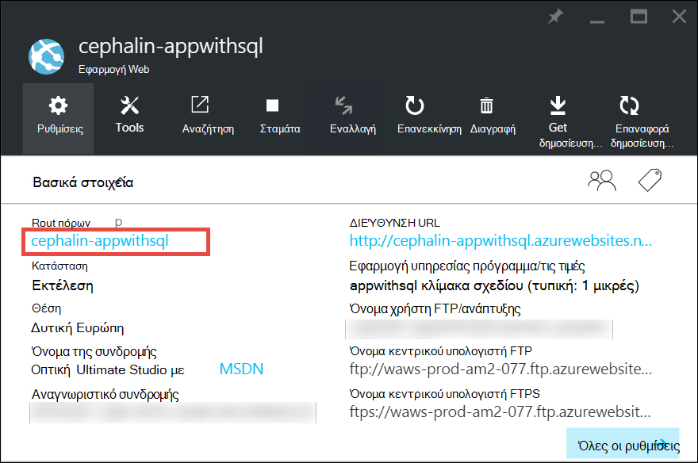
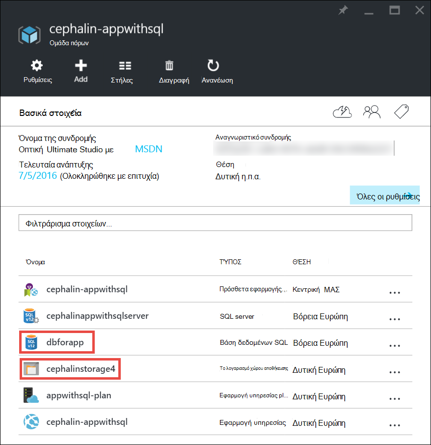
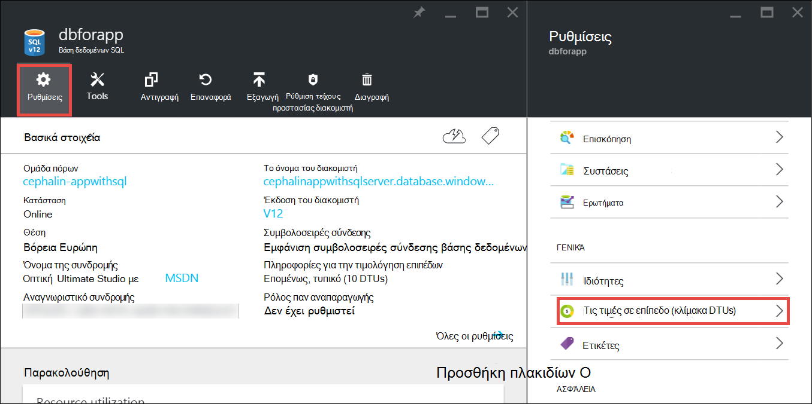
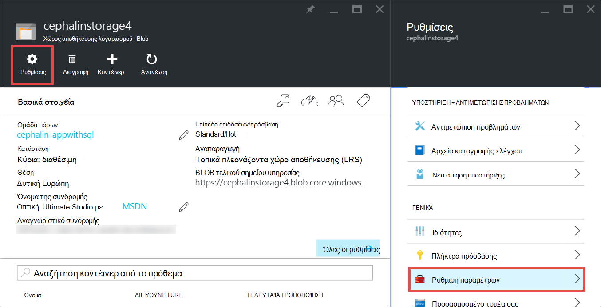

<properties
    pageTitle="Κλιμάκωσης εφαρμογής στο Azure | Microsoft Azure"
    description="Μάθετε πώς να κλιμάκωσης εφαρμογής στο Azure εφαρμογής υπηρεσίας για να προσθέσετε χωρητικότητα και δυνατότητες."
    services="app-service"
    documentationCenter=""
    authors="cephalin"
    manager="wpickett"
    editor="mollybos"/>

<tags
    ms.service="app-service"
    ms.workload="na"
    ms.tgt_pltfrm="na"
    ms.devlang="na"
    ms.topic="article"
    ms.date="07/05/2016"
    ms.author="cephalin"/>

# Κλιμάκωσης εφαρμογής στο Azure #

Αυτό το άρθρο παρουσιάζει τον τρόπο για να κλιμακωθεί την εφαρμογή σας στην υπηρεσία εφαρμογής Azure. Υπάρχουν δύο ροές εργασίας για κλίμακας, κλίμακας προς τα επάνω και κλίμακας ανάληψη και σε αυτό το άρθρο εξηγεί της κλίμακας του ροής εργασίας.

- [Κλιμάκωσης](https://en.wikipedia.org/wiki/Scalability#Horizontal_and_vertical_scaling): λήψη περισσότερων CPU, μνήμη, χώρος στο δίσκο και επιπλέον δυνατότητες, όπως αποκλειστικό εικονικές μηχανές (ΣΠΣ), προσαρμοσμένους τομείς και τα πιστοποιητικά, ενδιάμεσου υποδοχές autoscaling και πολλά άλλα. Κλίμακα προς τα επάνω, αλλάζοντας την τιμολόγησης σειρά από το πρόγραμμα εφαρμογής υπηρεσίας στην οποία ανήκει την εφαρμογή σας.
- [Κλίμακα ανάληψη](https://en.wikipedia.org/wiki/Scalability#Horizontal_and_vertical_scaling): Αυξήστε τον αριθμό των Εικονική παρουσιών που εκτελούνται την εφαρμογή σας.
Μπορεί να κλιμακωθεί ανάληψη έως 20 παρουσίες, ανάλογα με το επίπεδο τιμολόγησης. [Εφαρμογή υπηρεσίας περιβάλλοντα](../app-service/app-service-app-service-environments-readme.md) στο επίπεδο **Premium** περαιτέρω θα αυξήσει το πλήθος κλιμάκωσης σε παρουσίες των 50. Για περισσότερες πληροφορίες σχετικά με την κλιμάκωση ανάληψη, ανατρέξτε στο θέμα [Κλιμάκωση μέτρηση παρουσιών αυτόματα ή με μη αυτόματο τρόπο](../monitoring-and-diagnostics/insights-how-to-scale.md). Θα μάθετε πώς να χρησιμοποιείτε autoscaling, το οποίο είναι για να κλιμακωθεί μέτρηση παρουσιών αυτόματα με βάση προκαθορισμένους κανόνες και τα χρονοδιαγράμματα.

Οι ρυθμίσεις της κλίμακας διαρκέσει μόνο δευτερόλεπτα για να εφαρμόσετε και επηρεάζει όλες τις εφαρμογές στον το [πρόγραμμα εφαρμογής υπηρεσίας](../app-service/azure-web-sites-web-hosting-plans-in-depth-overview.md).
Δεν να απαιτούν να αλλάζετε τον κωδικό ή αναπτύξτε ξανά την εφαρμογή σας.

Για πληροφορίες σχετικά με τις τιμές και τις δυνατότητες του μεμονωμένα προγράμματα εφαρμογής υπηρεσίας, ανατρέξτε στο θέμα [Εφαρμογή υπηρεσίας τις τιμές λεπτομερειών](/pricing/details/web-sites/).  

> [AZURE.NOTE] Πριν να κάνετε εναλλαγή σε ένα πρόγραμμα εφαρμογής υπηρεσίας από τη σειρά **δωρεάν** , πρέπει πρώτα να καταργήσετε το [ξοδεύετε όρια](/pricing/spending-limits/) στη θέση για τη συνδρομή σας Azure. Για να προβάλετε ή να αλλάξετε τις επιλογές για τη συνδρομή σας Microsoft Azure εφαρμογής υπηρεσίας, ανατρέξτε στο θέμα [Microsoft Azure συνδρομές][azuresubscriptions].

## Κλιμάκωσης σας τιμολόγησης επιπέδων

1. Στο πρόγραμμα περιήγησης, ανοίξτε την [πύλη του Azure][portal].

2. Στο blade της εφαρμογής σας, κάντε κλικ στην επιλογή **όλες οι ρυθμίσεις**και, στη συνέχεια, κάντε κλικ στην επιλογή **Κλίμακας προς τα επάνω**.

    ![Περιηγηθείτε κλιμάκωσης Azure την εφαρμογή σας.][ChooseWHP]

4. Επιλέξτε το επίπεδο και, στη συνέχεια, κάντε κλικ στην **επιλογή**.

    Στην καρτέλα **ειδοποιήσεις** θα flash πράσινο **ΕΠΙΤΥΧΊΑΣ** μετά την ολοκλήρωση της λειτουργίας.

## Κλιμάκωση Σχετικοί πόροι
Εάν η εφαρμογή σας εξαρτάται από άλλες υπηρεσίες, όπως η βάση δεδομένων SQL Azure ή χώρο αποθήκευσης Azure, μπορείτε να επίσης κλιμάκωσης αυτούς τους πόρους με βάση τις ανάγκες σας. Αυτοί οι πόροι δεν είναι κλιμάκωση με το πρόγραμμα εφαρμογής υπηρεσίας και πρέπει να γίνει κλιμάκωση ξεχωριστά.

1. Στα **βασικά στοιχεία**, κάντε κλικ στη σύνδεση **ομάδα πόρων** .

    

2. Στο τμήμα **Σύνοψη** των blade την **ομάδα πόρων** , κάντε κλικ στην επιλογή ενός πόρου που θέλετε να περιορίσετε το μέγεθος. Το παρακάτω στιγμιότυπο οθόνης εμφανίζει μια βάση δεδομένων SQL του πόρου και ένας πόρος αποθήκευσης Azure.

    

3. Για έναν πόρο βάση δεδομένων SQL, κάντε κλικ στην επιλογή **Ρυθμίσεις** > **επίπεδο Τιμολόγηση** για να κλιμακωθεί την τιμολόγηση σειρά.

    

    Μπορείτε επίσης να ενεργοποιήσετε [παν αναπαραγωγής](../sql-database/sql-database-geo-replication-overview.md) για την παρουσία της βάσης δεδομένων SQL.

    Για έναν πόρο αποθήκευσης Azure, κάντε κλικ στην επιλογή **Ρυθμίσεις** > **ρύθμισης παραμέτρων** κλιμάκωσης τις επιλογές αποθήκευσης.

    

## Μάθετε περισσότερα σχετικά με τις δυνατότητες για προγραμματιστές
Ανάλογα με τη σειρά τιμολόγησης, οι ακόλουθες δυνατότητες για προγραμματιστές προσανατολισμένος είναι διαθέσιμες:

### Bitness ###

- Τα επίπεδα **βασικές** **Τυπική**και **Premium** υποστήριξη εφαρμογών 64-bit και 32 bit.
- Η **δωρεάν** και **κοινή χρήση** προγράμματος επίπεδα υποστηρίζει μόνο εφαρμογές 32-bit.

### Υποστήριξη προγράμματος εντοπισμού σφαλμάτων ###

- Υποστήριξη προγράμματος εντοπισμού σφαλμάτων είναι διαθέσιμη για το **δωρεάν**, **κοινή χρήση**και **βασικές** λειτουργίες σε μία σύνδεση ανά πρόγραμμα εφαρμογής υπηρεσίας.
- Υποστήριξη προγράμματος εντοπισμού σφαλμάτων είναι διαθέσιμη για τις λειτουργίες **τυπικές** και **Premium** στο πέντε ταυτόχρονες συνδέσεις ανά πρόγραμμα εφαρμογής υπηρεσίας.

## Μάθετε περισσότερα σχετικά με άλλες δυνατότητες

- Για λεπτομερείς πληροφορίες σχετικά με όλες τις υπόλοιπες δυνατότητες στο σχεδίων εφαρμογής υπηρεσίας, συμπεριλαμβανομένης της τιμολόγησης και δυνατότητες που σας ενδιαφέρουν σε όλους τους χρήστες (συμπεριλαμβανομένων των προγραμματιστές), ανατρέξτε στο θέμα [Εφαρμογή υπηρεσίας τις τιμές λεπτομερειών](/pricing/details/web-sites/).

>[AZURE.NOTE] Εάν θέλετε να γρήγορα αποτελέσματα με το Azure εφαρμογής υπηρεσίας πριν εγγραφείτε για ένα λογαριασμό Azure, μεταβείτε [Δοκιμάστε εφαρμογής υπηρεσίας](http://go.microsoft.com/fwlink/?LinkId=523751) όπου αμέσως να δημιουργήσετε μια εφαρμογή web μικρής διάρκειας starter στην εφαρμογή υπηρεσίας. Απαιτούνται χωρίς πιστωτικές κάρτες και υπάρχουν χωρίς δεσμεύσεις.

## Επόμενα βήματα

- Για να ξεκινήσετε με το Azure, ανατρέξτε στο θέμα [Δωρεάν δοκιμαστική έκδοση του Microsoft Azure](/pricing/free-trial/).
- Για πληροφορίες σχετικά με τις τιμές, υποστήριξη και SLA, επισκεφθείτε τις παρακάτω συνδέσεις.

    [Πληροφορίες για την τιμολόγηση μεταφορών δεδομένων](/pricing/details/data-transfers/)

    [Προγράμματα του Microsoft Azure υποστήριξης](/support/plans/)

    [Τις συμβάσεις επιπέδου υπηρεσιών](/support/legal/sla/)

    [Λεπτομέρειες τιμολόγησης βάσης δεδομένων SQL](/pricing/details/sql-database/)

    [Εικονική μηχανή και τα μεγέθη υπηρεσία Cloud για το Microsoft Azure][vmsizes]

    [Λεπτομέρειες τιμολόγησης εφαρμογής υπηρεσίας](/pricing/details/app-service/)

    [Εφαρμογή υπηρεσίας τις τιμές λεπτομερειών - συνδέσεις SSL](/pricing/details/web-sites/#ssl-connections)

- Για πληροφορίες σχετικά με την υπηρεσία εφαρμογών Azure ανατρέξτε στο θέμα βέλτιστες πρακτικές, όπως η δημιουργία μιας αρχιτεκτονικής μεταβλητού μεγέθους και είναι ανθεκτικά, [βέλτιστες πρακτικές: Azure εφαρμογής υπηρεσίας Web Apps](http://blogs.msdn.com/b/windowsazure/archive/2014/02/10/best-practices-windows-azure-websites-waws.aspx).

- Βίντεο σχετικά με την κλιμάκωση εφαρμογής υπηρεσίας εφαρμογών, ανατρέξτε στους ακόλουθους πόρους:

    - [Πότε πρέπει να κλιμακωθεί Azure τοποθεσίες Web - με Stefan Schackow](/documentation/videos/azure-web-sites-free-vs-standard-scaling/)
    - [Αυτόματη κλιμάκωση Azure τοποθεσίες Web που διαθέτετε, CPU ή προγραμματισμένη - με Stefan Schackow](/documentation/videos/auto-scaling-azure-web-sites/)
    - [Πώς Azure κλίμακα τοποθεσίες Web - με Stefan Schackow](/documentation/videos/how-azure-web-sites-scale/)

<!-- LINKS -->
[vmsizes]:/pricing/details/app-service/
[SQLaccountsbilling]:http://go.microsoft.com/fwlink/?LinkId=234930
[azuresubscriptions]:http://go.microsoft.com/fwlink/?LinkID=235288
[portal]: https://portal.azure.com/

<!-- IMAGES -->
[ChooseWHP]: ./media/web-sites-scale/scale1ChooseWHP.png
[ChooseBasicInstances]: ./media/web-sites-scale/scale2InstancesBasic.png
[SaveButton]: ./media/web-sites-scale/05SaveButton.png
[BasicComplete]: ./media/web-sites-scale/06BasicComplete.png
[ScaleStandard]: ./media/web-sites-scale/scale3InstancesStandard.png
[Autoscale]: ./media/web-sites-scale/scale4AutoScale.png
[SetTargetMetrics]: ./media/web-sites-scale/scale5AutoScaleTargetMetrics.png
[SetFirstRule]: ./media/web-sites-scale/scale6AutoScaleFirstRule.png
[SetSecondRule]: ./media/web-sites-scale/scale7AutoScaleSecondRule.png
[SetThirdRule]: ./media/web-sites-scale/scale8AutoScaleThirdRule.png
[SetRulesFinal]: ./media/web-sites-scale/scale9AutoScaleFinal.png
[ResourceGroup]: ./media/web-sites-scale/scale10ResourceGroup.png
[ScaleDatabase]: ./media/web-sites-scale/scale11SQLScale.png
[GeoReplication]: ./media/web-sites-scale/scale12SQLGeoReplication.png
