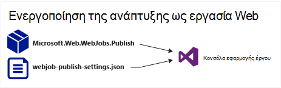
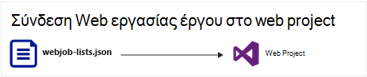
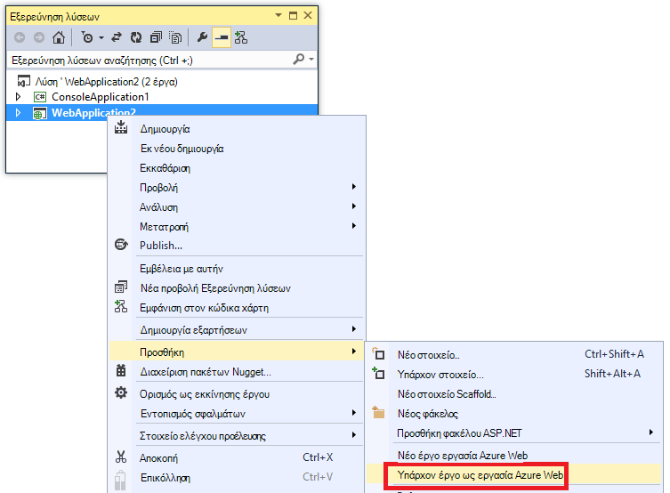
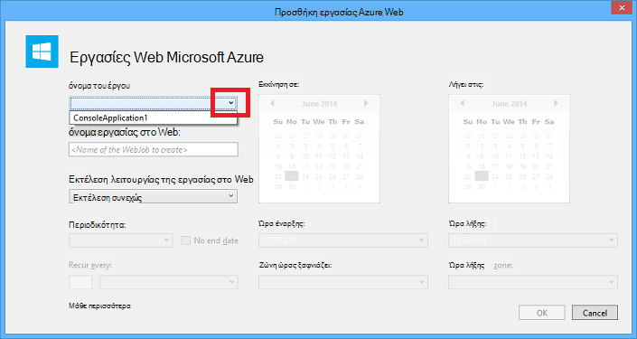
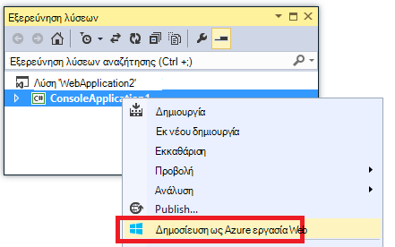
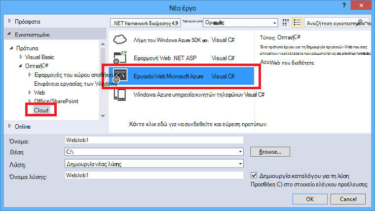
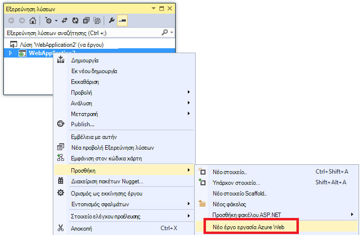
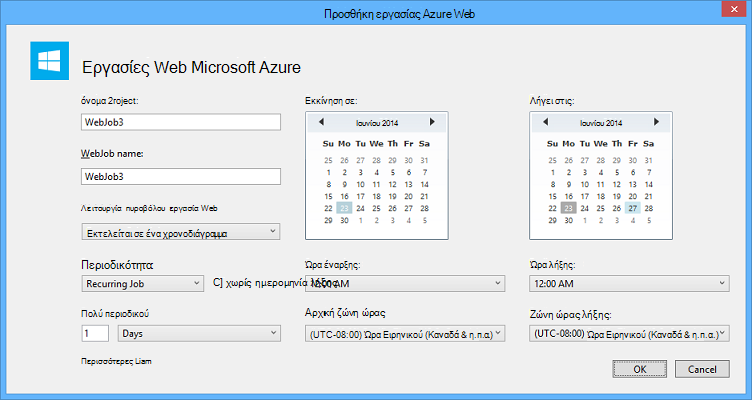

<properties 
    pageTitle="Ανάπτυξη WebJobs χρήση του Visual Studio" 
    description="Μάθετε πώς μπορείτε να αναπτύξετε το Azure WebJobs Azure εφαρμογής υπηρεσίας Web εφαρμογές χρήση του Visual Studio." 
    services="app-service" 
    documentationCenter="" 
    authors="tdykstra" 
    manager="wpickett" 
    editor="jimbe"/>

<tags 
    ms.service="app-service" 
    ms.devlang="dotnet" 
    ms.topic="article" 
    ms.tgt_pltfrm="na" 
    ms.workload="na" 
    ms.date="04/27/2016" 
    ms.author="tdykstra"/>

# Ανάπτυξη WebJobs χρήση του Visual Studio

## Επισκόπηση

Αυτό το θέμα εξηγεί τον τρόπο χρήσης του Visual Studio για να αναπτύξετε ένα έργο εφαρμογής κονσόλας σε μια εφαρμογή web στην [Εφαρμογή υπηρεσίας](http://go.microsoft.com/fwlink/?LinkId=529714) ως μια [Azure WebJob](http://go.microsoft.com/fwlink/?LinkId=390226). Για πληροφορίες σχετικά με τον τρόπο ανάπτυξης WebJobs, με την [Πύλη Azure](https://portal.azure.com), ανατρέξτε στο θέμα [εργασίες εκτέλεση φόντου με WebJobs](web-sites-create-web-jobs.md).

Όταν Visual Studio αναπτύσσει ένα έργο με δυνατότητα WebJobs εφαρμογής κονσόλας, εκτελεί δύο εργασίες:

* Αρχεία χρόνου εκτέλεσης αντίγραφα στον κατάλληλο φάκελο στο web app (*App_Data/εργασίες/συνεχής* για συνεχή WebJobs, *App_Data/εργασίες/ενεργοποίησε* για προγραμματισμένη και σε ζήτηση WebJobs).
* Ρυθμίζει [Azure Χρονοδιάγραμμα εργασιών](#scheduler) για WebJobs που έχουν προγραμματιστεί να εκτελεστεί σε συγκεκριμένες ώρες. (Αυτό δεν είναι απαραίτητη για συνεχή WebJobs.)

Ένα έργο με δυνατότητα WebJobs περιλαμβάνει τα ακόλουθα στοιχεία που προστίθενται σε αυτήν:

* Το πακέτο NuGet [Microsoft.Web.WebJobs.Publish](http://www.nuget.org/packages/Microsoft.Web.WebJobs.Publish/) .
* Ένα αρχείο [webjob δημοσίευση settings.json](#publishsettings) που περιέχει ρυθμίσεις ανάπτυξης και χρονοδιάγραμμα. 

Μπορείτε να προσθέσετε αυτά τα στοιχεία σε ένα υπάρχον έργο εφαρμογής κονσόλας ή να χρησιμοποιήσετε ένα πρότυπο για να δημιουργήσετε ένα νέο έργο με δυνατότητα WebJobs εφαρμογής κονσόλας. 

Μπορείτε να αναπτύξετε ένα έργο ως ένα WebJob μόνη ή σύνδεση σε ένα έργο web, έτσι ώστε να αναπτύσσει αυτόματα κάθε φορά που μπορείτε να αναπτύξετε το έργο web. Για να συνδέσετε έργα, Visual Studio περιλαμβάνει το όνομα του έργου με δυνατότητα WebJobs σε ένα αρχείο [webjobs list.json](#webjobslist) του έργου web.

## Προαπαιτούμενα στοιχεία

WebJobs ανάπτυξης δυνατότητες είναι διαθέσιμες στο Visual Studio 2015 κατά την εγκατάσταση του SDK Azure για το .NET:

* [Azure SDK για .NET (Visual Studio 2015)](http://go.microsoft.com/fwlink/?linkid=518003).

## Ενεργοποίηση για ένα υπάρχον έργο εφαρμογής κονσόλας WebJobs ανάπτυξη

Έχετε δύο επιλογές:

* [Ενεργοποίηση αυτόματης ανάπτυξης με ένα έργο web](#convertlink).

    Ρύθμιση παραμέτρων ένα υπάρχον έργο εφαρμογής κονσόλας, έτσι ώστε το αυτόματα αναπτύσσει ως μια WebJob, κατά την ανάπτυξη ενός έργου web. Χρησιμοποιήστε αυτήν την επιλογή όταν θέλετε να εκτελέσετε το WebJob στην ίδια εφαρμογή web στην οποία μπορείτε να εκτελέσετε την εφαρμογή web σχετικές.

* [Ενεργοποίηση της ανάπτυξης χωρίς έργο web](#convertnolink).

    Ρυθμίστε τις παραμέτρους σε ένα υπάρχον έργο εφαρμογής κονσόλας για την ανάπτυξη ως μια WebJob μόνη της, με χωρίς σύνδεση για ένα έργο web. Χρησιμοποιήστε αυτήν την επιλογή όταν θέλετε να εκτελέσετε μια WebJob σε μια εφαρμογή web μόνη της, με την εφαρμογή web δεν εκτελείται στο web app. Μπορείτε να το κάνετε αυτό για να έχετε τη δυνατότητα να περιορίσετε το μέγεθος των πόρων σας WebJob, ανεξάρτητα από τα πόρους της εφαρμογής web.

### Ενεργοποίηση αυτόματων ανάπτυξη WebJobs με ένα έργο web
  
1. Κάντε δεξί κλικ στο έργο web στην **Εξερεύνηση λύσεων**και, στη συνέχεια, κάντε κλικ στην επιλογή **Προσθήκη** > **Υπάρχον έργο ως Azure WebJob**.

    
    
    Εμφανίζεται το παράθυρο διαλόγου [Προσθήκη WebJob Azure](#configure) .

1. Στην αναπτυσσόμενη λίστα το **όνομα του έργου** , επιλέξτε το έργο εφαρμογής κονσόλας για να προσθέσετε ως μια WebJob.

    

2. Ολοκληρώστε το παράθυρο διαλόγου [Προσθήκη WebJob Azure](#configure) και, στη συνέχεια, κάντε κλικ στο κουμπί **OK**. 

### Ενεργοποίηση WebJobs ανάπτυξης χωρίς έργο web
  
1. Κάντε δεξί κλικ το έργο εφαρμογής κονσόλας στην **Εξερεύνηση λύσεων**και, στη συνέχεια, κάντε κλικ στην επιλογή **Δημοσίευση ως Azure WebJob**. 

    
    
    Εμφανίζεται το παράθυρο διαλόγου [Προσθήκη WebJob Azure](#configure) , με το έργο που έχει επιλεγεί στο πλαίσιο **όνομα έργου** .

2.  Ολοκληρώστε το παράθυρο διαλόγου [Προσθήκη WebJob Azure](#configure) και, στη συνέχεια, κάντε κλικ στο κουμπί **OK**.

    Εμφανίζεται ο οδηγός **Δημοσίευση Web** .  Εάν δεν θέλετε να δημοσιεύσετε αμέσως, κλείστε τον οδηγό. Οι ρυθμίσεις που έχετε εισαγάγει αποθηκεύονται για όταν θέλετε να [αναπτύξετε το έργο](#deploy).

## Δημιουργήστε ένα νέο έργο με δυνατότητα WebJobs

Για να δημιουργήσετε ένα νέο έργο με δυνατότητα WebJobs, μπορείτε να χρησιμοποιήσετε το πρότυπο έργου εφαρμογής κονσόλας και να ενεργοποιήσετε WebJobs ανάπτυξης, όπως εξηγείται στην [προηγούμενη ενότητα](#convert). Ως εναλλακτική λύση, μπορείτε να χρησιμοποιήσετε το πρότυπο WebJobs νέο έργο:

* [Χρησιμοποιήστε το πρότυπο νέο έργο WebJobs για μια ανεξάρτητη WebJob](#createnolink)

    Δημιουργία έργου και ρυθμίστε τις παραμέτρους του για την ανάπτυξη μόνη ως μια WebJob, με χωρίς σύνδεση για ένα έργο web. Χρησιμοποιήστε αυτήν την επιλογή όταν θέλετε να εκτελέσετε μια WebJob σε μια εφαρμογή web μόνη της, με την εφαρμογή web δεν εκτελείται στο web app. Μπορείτε να το κάνετε αυτό για να έχετε τη δυνατότητα να περιορίσετε το μέγεθος των πόρων σας WebJob, ανεξάρτητα από τα πόρους της εφαρμογής web.

* [Χρησιμοποιήστε το πρότυπο νέο έργο WebJobs για μια WebJob συνδεδεμένο με ένα έργο web](#createlink)

    Δημιουργήστε ένα έργο που έχει ρυθμιστεί για την ανάπτυξη αυτόματα ως μια WebJob όταν έχει αναπτυχθεί ένα έργο web στην ίδια λύση. Χρησιμοποιήστε αυτήν την επιλογή όταν θέλετε να εκτελέσετε το WebJob στην ίδια εφαρμογή web στην οποία μπορείτε να εκτελέσετε την εφαρμογή web σχετικές.

> [AZURE.NOTE] Το πρότυπο νέο έργο WebJobs εγκαθιστά πακέτα NuGet αυτόματα και περιλαμβάνει κώδικα στο *Program.cs* για το [WebJobs SDK](http://www.asp.net/aspnet/overview/developing-apps-with-windows-azure/getting-started-with-windows-azure-webjobs). Εάν δεν θέλετε να χρησιμοποιήσετε το SDK WebJobs ή, θέλετε να χρησιμοποιήσετε μια προγραμματισμένη αντί για συνεχή WebJob, κατάργηση ή αλλαγή του `host.RunAndBlock` πρόταση στο *Program.cs*.

### Χρησιμοποιήστε το πρότυπο νέο έργο WebJobs για μια ανεξάρτητη WebJob
  
1. Κάντε κλικ στο **αρχείο** > **Νέο έργο**, και, στη συνέχεια, στο παράθυρο διαλόγου **Νέο έργο** , κάντε κλικ στο **Cloud** > **Microsoft Azure WebJob**.

    
    
2. Ακολουθήστε τις οδηγίες που εμφανίζονται παραπάνω για να [κάνετε την εφαρμογή κονσόλας ανεξάρτητο έργο WebJobs του project](#convertnolink).

### Χρησιμοποιήστε το πρότυπο νέο έργο WebJobs για μια WebJob συνδεδεμένο με ένα έργο web

1. Κάντε δεξί κλικ στο έργο web στην **Εξερεύνηση λύσεων**και, στη συνέχεια, κάντε κλικ στην επιλογή **Προσθήκη** > **Νέο έργο WebJob Azure**.

    

    Εμφανίζεται το παράθυρο διαλόγου [Προσθήκη WebJob Azure](#configure) .

2. Ολοκληρώστε το παράθυρο διαλόγου [Προσθήκη WebJob Azure](#configure) και, στη συνέχεια, κάντε κλικ στο κουμπί **OK**.

## Το παράθυρο διαλόγου Προσθήκη WebJob Azure

Το παράθυρο διαλόγου **Προσθήκη WebJob Azure** σάς επιτρέπει να εισαγάγετε όνομα WebJob και τον προγραμματισμό ρυθμίσεις για το WebJob. 

Τα πεδία σε αυτό το παράθυρο διαλόγου αντιστοιχούν στα πεδία στο παράθυρο διαλόγου **Νέο έργο** της πύλης Azure. Για περισσότερες πληροφορίες, ανατρέξτε στο θέμα [εργασίες εκτέλεση φόντου με WebJobs](web-sites-create-web-jobs.md).

Για μια προγραμματισμένη WebJob (όχι για συνεχή WebJobs), Visual Studio δημιουργεί μια συλλογή [Azure χρονοδιάγραμμα](/services/scheduler/) έργου, εάν δεν υπάρχει ακόμα και δημιουργεί μια εργασία στη συλλογή:

* Η συλλογή χρονοδιαγράμματος εργασίας ονομάζεται *WebJobs-{regionname}* όπου *{regionname}* αναφέρεται στην περιοχή web app φιλοξενείται στο. Για παράδειγμα: WebJobs WestUS.
* Η εργασία scheduler ονομάζεται *{webappname}-{webjobname}*. Για παράδειγμα: MyWebApp MyWebJob. 
 
>[AZURE.NOTE]
> 
>* Για πληροφορίες σχετικά με την ανάπτυξη της γραμμής εντολών, ανατρέξτε στο θέμα [Ενεργοποίηση της γραμμής εντολών ή συνεχής παράδοσης WebJobs Azure](/blog/2014/08/18/enabling-command-line-or-continuous-delivery-of-azure-webjobs/).
>* Εάν ρυθμίσετε μια **Περιοδική εργασία** και ορίστε συχνότητα της περιοδικότητας σε έναν αριθμό λεπτών, η υπηρεσία χρονοδιαγράμματος Azure δεν είναι δωρεάν. Άλλες συχνότητας (ώρες, ημέρες, κ.ο.κ.) είναι δωρεάν.
>* Εάν αναπτύξετε μια WebJob και, στη συνέχεια, αποφασίσετε ότι θέλετε να αλλάξετε τον τύπο του WebJob και επανάληψη ανάπτυξης, θα πρέπει να διαγράψετε το αρχείο webjobs δημοσίευση settings.json. Αυτό θα καταστήσει Visual Studio ξανά, εμφανίζονται οι επιλογές δημοσίευσης, ώστε να μπορείτε να αλλάξετε τον τύπο του WebJob.
>* Εάν αναπτύξετε μια WebJob και αργότερα να αλλάξετε την κατάσταση λειτουργίας επεξεργασίας από συνεχής σε ασυνεχή ή αντίστροφα, Visual Studio δημιουργεί μια νέα WebJob στο Azure όταν κάνετε αναπτύξτε ξανά. Εάν μπορείτε να αλλάξετε άλλες ρυθμίσεις προγραμματισμού, αλλά διατήρηση εκτελέστε την ίδια λειτουργία ή εναλλαγή μεταξύ προγραμματισμένη και On Demand, Visual Studio ενημερώνει το υπάρχον έργο αντί να δημιουργήσετε ένα νέο.

## webjob δημοσίευση settings.json

Όταν ρυθμίζετε τις παραμέτρους μιας εφαρμογής κονσόλας για ανάπτυξη WebJobs, Visual Studio εγκαθιστά το πακέτο NuGet [Microsoft.Web.WebJobs.Publish](http://www.nuget.org/packages/Microsoft.Web.WebJobs.Publish/) και αποθηκεύει προγραμματισμού πληροφορίες σε ένα αρχείο *webjob δημοσίευση settings.json* στο φάκελο *Ιδιότητες* έργου του WebJobs έργου. Ακολουθεί ένα παράδειγμα αυτού του αρχείου:

        {
          "$schema": "http://schemastore.org/schemas/json/webjob-publish-settings.json",
          "webJobName": "WebJob1",
          "startTime": "2014-06-23T00:00:00-08:00",
          "endTime": "2014-06-27T00:00:00-08:00",
          "jobRecurrenceFrequency": "Minute",
          "interval": 5,
          "runMode": "Scheduled"
        }

Μπορείτε να επεξεργαστείτε αυτό το αρχείο απευθείας και Visual Studio παρέχει IntelliSense. Το σχήμα αρχείου είναι αποθηκευμένο στο [http://schemastore.org](http://schemastore.org/schemas/json/webjob-publish-settings.json) και μπορούν να προβληθούν εκεί.  

>[AZURE.NOTE]
>
>* Εάν ρυθμίσετε μια **Περιοδική εργασία** και ορίστε συχνότητα της περιοδικότητας σε έναν αριθμό λεπτών, η υπηρεσία χρονοδιαγράμματος Azure δεν είναι δωρεάν. Άλλες συχνότητας (ώρες, ημέρες, κ.ο.κ.) είναι δωρεάν.

## webjobs list.json

Όταν συνδέετε ένα έργο με δυνατότητα WebJobs σε ένα έργο web, Visual Studio αποθηκεύει το όνομα του έργου WebJobs σε ένα αρχείο *webjobs list.json* του έργου web *Ιδιότητες* φακέλου. Η λίστα μπορεί να περιέχει πολλά έργα WebJobs, όπως φαίνεται στο ακόλουθο παράδειγμα:

        {
          "$schema": "http://schemastore.org/schemas/json/webjobs-list.json",
          "WebJobs": [
            {
              "filePath": "../ConsoleApplication1/ConsoleApplication1.csproj"
            },
            {
              "filePath": "../WebJob1/WebJob1.csproj"
            }
          ]
        }

Μπορείτε να επεξεργαστείτε αυτό το αρχείο απευθείας και Visual Studio παρέχει IntelliSense. Το σχήμα αρχείου είναι αποθηκευμένο στο [http://schemastore.org](http://schemastore.org/schemas/json/webjobs-list.json) και μπορούν να προβληθούν εκεί.
  
## Ανάπτυξη WebJobs έργου

Ένα έργο WebJobs που έχετε συνδέσει με ένα έργο web αναπτύσσει αυτόματα με το project web. Για πληροφορίες σχετικά με την ανάπτυξη του project web, δείτε [πώς μπορείτε να αναπτύξετε σε εφαρμογές Web](web-sites-deploy.md).

Για να αναπτύξετε ένα έργο WebJobs μόνη, κάντε δεξί κλικ στο έργο στην **Εξερεύνηση λύσεων**και κάντε κλικ στην επιλογή **Δημοσίευση ως Azure WebJob**. 

    
Για μια ανεξάρτητη WebJob, τον ίδιο οδηγό **Δημοσίευση Web** που χρησιμοποιείται για τα έργα web εμφανίζεται, αλλά με λιγότερες ρυθμίσεις που είναι διαθέσιμες για να αλλάξετε.

## Επόμενα βήματα

Σε αυτό το άρθρο περιλαμβάνει εξηγείται πώς μπορείτε να αναπτύξετε το WebJobs με χρήση του Visual Studio. Για περισσότερες πληροφορίες σχετικά με την ανάπτυξη Azure WebJobs, ανατρέξτε στο θέμα [Ανάπτυξη Azure WebJobs - συνιστάται πόροι](http://www.asp.net/aspnet/overview/developing-apps-with-windows-azure/azure-webjobs-recommended-resources#deploying).
