<properties
    pageTitle="Δημιουργία μιας WebJob .NET στο Azure εφαρμογής υπηρεσίας | Microsoft Azure"
    description="Δημιουργία εφαρμογής πολλαπλών επιπέδων με χρήση του ASP.NET MVC και Azure. Το εμπρός τέλος εκτελείται σε μια εφαρμογή web στο Azure εφαρμογής υπηρεσίας και υπόβαθρο εκτελείται ως μια WebJob. Η εφαρμογή χρησιμοποιεί Framework οντότητα, βάση δεδομένων SQL, και ουρές Azure χώρου αποθήκευσης και αντικείμενα blob."
    services="app-service"
    documentationCenter=".net"
    authors="tdykstra"
    manager="wpickett"
    editor="mollybos"/>

<tags
    ms.service="app-service"
    ms.workload="na"
    ms.tgt_pltfrm="na"
    ms.devlang="na"
    ms.topic="article"
    ms.date="10/28/2016"
    ms.author="tdykstra"/>

# Δημιουργία μιας WebJob .NET στο Azure εφαρμογής υπηρεσίας

Αυτό το πρόγραμμα εκμάθησης δείχνει πώς να συντάξετε κώδικα για μια απλή εφαρμογή ASP.NET MVC 5 πολλαπλών επιπέδων που χρησιμοποιεί το [WebJobs SDK](websites-dotnet-webjobs-sdk.md).

Ο σκοπός του [WebJobs SDK](websites-webjobs-resources.md) είναι για να απλοποιήσετε τον κώδικα που συντάσσετε για τις κοινές εργασίες που ένα WebJob να εκτελέσετε, όπως η επεξεργασία εικόνας, ουρά επεξεργασίας, RSS συνάθροισης, αρχείο συντήρησης και αποστολή μηνυμάτων ηλεκτρονικού ταχυδρομείου. Το SDK WebJobs έχει ενσωματωμένες δυνατότητες για την εργασία με το χώρο αποθήκευσης Azure και Bus υπηρεσίας, για τον προγραμματισμό εργασιών και χειρισμού σφαλμάτων και πολλά άλλα συνηθισμένα σενάρια. Επίσης, είναι σχεδιασμένος για να επεκτάσιμη και δεν υπάρχει ένα [Άνοιγμα αποθετήριο δεδομένων προέλευσης για επεκτάσεις](https://github.com/Azure/azure-webjobs-sdk-extensions/wiki/Binding-Extensions-Overview).

Το δείγμα εφαρμογής είναι έναν πίνακα ανακοινώσεων διαφημίσεις. Οι χρήστες να αποστείλετε εικόνες για διαφημίσεις και μια διαδικασία παρασκηνίου μετατρέπει τις εικόνες σε μικρογραφίες. Στη σελίδα λίστας ad εμφανίζει τις μικρογραφίες και τη σελίδα λεπτομερειών ad εμφανίζει την εικόνα πλήρους μεγέθους. Ακολουθεί ένα στιγμιότυπο οθόνης:

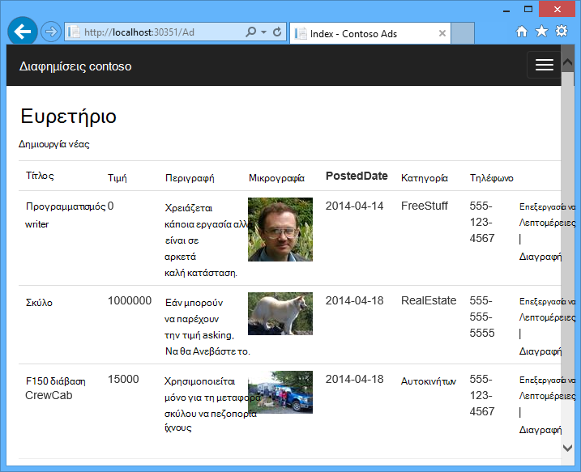

Αυτού του δείγματος εφαρμογής λειτουργεί με [Azure ουρές](http://www.asp.net/aspnet/overview/developing-apps-with-windows-azure/building-real-world-cloud-apps-with-windows-azure/queue-centric-work-pattern) και [Azure αντικείμενα BLOB](http://www.asp.net/aspnet/overview/developing-apps-with-windows-azure/building-real-world-cloud-apps-with-windows-azure/unstructured-blob-storage). Το πρόγραμμα εκμάθησης δείχνει πώς μπορείτε να αναπτύξετε την εφαρμογή για να [Azure εφαρμογής υπηρεσίας](http://go.microsoft.com/fwlink/?LinkId=529714) και [Βάση δεδομένων SQL Azure](http://msdn.microsoft.com/library/azure/ee336279).

## Προαπαιτούμενα στοιχεία

Το πρόγραμμα εκμάθησης προϋποθέτει ότι γνωρίζετε τον τρόπο εργασίας με τα έργα [ASP.NET MVC 5](http://www.asp.net/mvc/tutorials/mvc-5/introduction/getting-started) στο Visual Studio.

Το πρόγραμμα εκμάθησης έχει συνταχθεί για το Visual Studio 2013. Εάν δεν έχετε ήδη Visual Studio, αυτό θα εγκατασταθεί για εσάς αυτόματα κατά την εγκατάσταση του SDK Azure για το .NET.

Το πρόγραμμα εκμάθησης μπορεί να χρησιμοποιηθεί με το Visual Studio 2015, αλλά πριν από την εκτέλεση της εφαρμογής τοπικά θα πρέπει να αλλάξετε το `Data Source` μέρος του τη συμβολοσειρά σύνδεσης του SQL Server LocalDB στα αρχεία Web.config και App.config από `Data Source=(localdb)\v11.0` να `Data Source=(LocalDb)\MSSQLLocalDB`. 

> [AZURE.NOTE] Χρειάζεστε ένα λογαριασμό Azure για να ολοκληρώσετε αυτό το πρόγραμμα εκμάθησης:
  >
  > + Μπορείτε να [ανοίξετε ένα λογαριασμό Azure δωρεάν](https://azure.microsoft.com/pricing/free-trial/?WT.mc_id=A261C142F): λάβετε πιστώσεων μπορείτε να χρησιμοποιήσετε για να δοκιμάσετε την πληρωμή Azure υπηρεσιών και ακόμα και αν χρησιμοποιούνται προς τα επάνω, μπορείτε να διατηρήσετε το λογαριασμό και χρήση δωρεάν Azure υπηρεσίες, όπως τοποθεσίες Web που διαθέτετε. Η πιστωτική κάρτα σας θα χρεωθεί ποτέ, εκτός εάν αλλάξετε τις ρυθμίσεις σας και ζητήστε του να χρεωθεί ρητά.
  >
  > + Μπορείτε να [ενεργοποιήσετε το MSDN συνδρομητών πλεονεκτήματα](https://azure.microsoft.com/pricing/member-offers/msdn-benefits-details/?WT.mc_id=A261C142F): τη συνδρομή σας MSDN παρέχει πιστώσεων κάθε μήνα που μπορείτε να χρησιμοποιήσετε για τις υπηρεσίες του Azure επί πληρωμή.
  >
  >Εάν θέλετε να γρήγορα αποτελέσματα με το Azure εφαρμογής υπηρεσίας πριν από την εγγραφή για λογαριασμό Azure, μεταβείτε στο [Δοκιμάστε εφαρμογής υπηρεσίας](http://go.microsoft.com/fwlink/?LinkId=523751), όπου μπορείτε να αμέσως δημιουργήσετε μια εφαρμογή web μικρής διάρκειας starter στην εφαρμογή υπηρεσίας. Δεν υπάρχει πιστωτικές κάρτες υποχρεωτικό, χωρίς δεσμεύσεις.

## Τι θα μάθετε

Το πρόγραμμα εκμάθησης δείχνει πώς μπορείτε να κάνετε τις ακόλουθες εργασίες:

* Ενεργοποιήστε τον υπολογιστή σας για την ανάπτυξη Azure μέσω της εγκατάστασης του SDK Azure.
* Δημιουργία εφαρμογής κονσόλας έργου που αναπτύσσει αυτόματα ως μια WebJob Azure κατά την ανάπτυξη του έργου συσχετισμένη web.
* Δοκιμάστε έναν υπολογιστή στο παρασκήνιο WebJobs SDK τοπικά στον υπολογιστή ανάπτυξης.
* Δημοσίευση μιας εφαρμογής με έναν υπολογιστή στο παρασκήνιο WebJobs σε μια εφαρμογή web στην εφαρμογή υπηρεσίας.
* Αποστολή αρχείων και να τις αποθηκεύει στην υπηρεσία αντικειμένων Blob του Azure.
* Χρήση του SDK WebJobs Azure για εργασία με ουρές αποθήκευσης Azure και αντικείμενα blob.

## Αρχιτεκτονική της εφαρμογής

Το δείγμα εφαρμογής χρησιμοποιεί το [μοτίβο ουρά επίκεντρο εργασίας](http://www.asp.net/aspnet/overview/developing-apps-with-windows-azure/building-real-world-cloud-apps-with-windows-azure/queue-centric-work-pattern) για να συχνότης την εργασία υπολογιστική δημιουργίας μικρογραφίες σε μια διεργασία υπολογιστή στο παρασκήνιο.

Η εφαρμογή αποθηκεύει διαφημίσεις σε μια βάση δεδομένων SQL, χρησιμοποιώντας οντότητα Framework κώδικα πρώτη για τη δημιουργία των πινάκων και να αποκτήσετε πρόσβαση στα δεδομένα. Για κάθε διαφήμιση, η βάση δεδομένων αποθηκεύει δύο διευθύνσεις URL: μία για κάθε εικόνα πλήρους μεγέθους και μία για τη μικρογραφία.

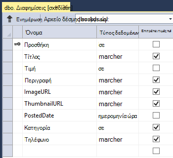

Όταν ένας χρήστης αποστέλλει μια εικόνα, η εφαρμογή web αποθηκεύει την εικόνα σε ένα [αντικειμένων blob του Azure](http://www.asp.net/aspnet/overview/developing-apps-with-windows-azure/building-real-world-cloud-apps-with-windows-azure/unstructured-blob-storage)και αποθηκεύει τις πληροφορίες ad στη βάση δεδομένων με μια διεύθυνση URL που οδηγεί το αντικείμενο blob. Την ίδια στιγμή, εγγράφει ένα μήνυμα σε μια ουρά Azure. Σε μια διεργασία παρασκηνίου εκτελείται ως μια WebJob Azure, το SDK WebJobs σταθμοσκοπεί ουρά για νέα μηνύματα. Όταν εμφανιστεί ένα νέο μήνυμα, το WebJob δημιουργεί μια μικρογραφία για αυτήν την εικόνα και ενημερώνει μικρογραφιών πεδίο διεύθυνση URL βάσης δεδομένων για το συγκεκριμένο ad. Ακολουθεί ένα διάγραμμα που δείχνει τον τρόπο αλληλεπίδρασης τα τμήματα της εφαρμογής:

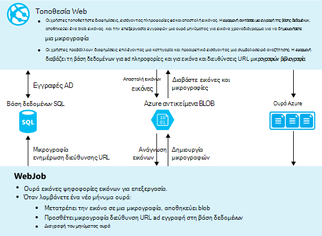

[AZURE.INCLUDE [install-sdk](../../includes/install-sdk-2015-2013.md)]

Τις οδηγίες του προγράμματος εκμάθησης εφαρμογή Azure SDK για .NET 2.7.1 ή νεότερη έκδοση.

## Δημιουργήστε ένα λογαριασμό αποθήκευσης Azure

Ένα λογαριασμό Azure αποθήκευσης παρέχει πόρους για την αποθήκευση δεδομένων ουρά και αντικειμένων blob στο cloud. Χρησιμοποιείται επίσης από το SDK WebJobs για την αποθήκευση δεδομένων καταγραφής για τον πίνακα εργαλείων.

Σε μια εφαρμογή ρεαλιστικό, συνήθως δημιουργείτε χωριστούς λογαριασμούς για την εφαρμογή δεδομένων έναντι της σύνδεσης δεδομένων, και ξεχωριστή λογαριασμούς για δεδομένα δοκιμής έναντι δεδομένα παραγωγής. Για αυτό το πρόγραμμα εκμάθησης, θα χρησιμοποιήσετε έναν μόνο λογαριασμό.

1. Ανοίξτε το παράθυρο **Εξερεύνησης διακομιστή** στο Visual Studio.

2. Κάντε δεξί κλικ στον κόμβο **Azure** και, στη συνέχεια, κάντε κλικ στην επιλογή **σύνδεση με το Windows Azure**.
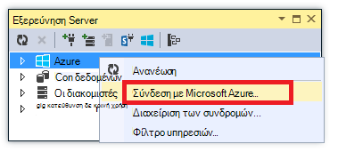

3. Πραγματοποιήστε είσοδο χρησιμοποιώντας τα διαπιστευτήριά σας Azure.

5. Κάντε δεξιό κλικ στο **χώρο αποθήκευσης** κάτω από τον κόμβο Azure και, στη συνέχεια, κάντε κλικ στην επιλογή **Δημιουργία λογαριασμού χώρου αποθήκευσης**.
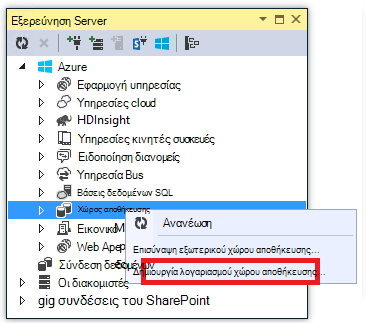

3. Στο παράθυρο διαλόγου **Δημιουργία λογαριασμού χώρου αποθήκευσης** , πληκτρολογήστε ένα όνομα για το λογαριασμό χώρου αποθήκευσης.

    Το όνομα πρέπει να πρέπει να είναι μοναδικό (άλλος λογαριασμός Azure αποθήκευσης μπορούν να έχουν το ίδιο όνομα). Εάν το όνομα που εισάγετε χρησιμοποιείται ήδη που θα έχετε την ευκαιρία να την αλλάξετε.

    Τη διεύθυνση URL για πρόσβαση στο λογαριασμό σας χώρου αποθήκευσης θα είναι *{name}*. core.windows.net.

5. Ορίστε την **περιοχή ή ομάδα συσχέτισης** αναπτυσσόμενη λίστα στην περιοχή πλησιέστερη σε εσάς.

    Αυτή η ρύθμιση καθορίζει ποιες Azure κέντρο δεδομένων θα φιλοξενήσει το λογαριασμό χώρου αποθήκευσης. Για αυτό το πρόγραμμα εκμάθησης, την επιλογή σας δεν θα κάνετε μια σημαντική διαφορά. Ωστόσο, για μια εφαρμογή web παραγωγής, που θέλετε το διακομιστή web και του λογαριασμού σας χώρο αποθήκευσης να είναι στην ίδια περιοχή για την Ελαχιστοποίηση λανθάνοντος χρόνου και δεδομένων εξόδου χρεώσεων. Το web app (το οποίο θα πρέπει να δημιουργήσετε αργότερα) πρέπει να είναι ως Κλείσιμο όσο το δυνατόν πιο για τα προγράμματα περιήγησης πρόσβαση σε εφαρμογή web για να ελαχιστοποιήσετε λανθάνων χρόνος κέντρου δεδομένων.

6. Ορίστε την αναπτυσσόμενη λίστα **αναπαραγωγής** σε **τοπικά πλεονάζοντα**.

    Όταν είναι ενεργοποιημένη η παν αναπαραγωγής για ένα λογαριασμό του χώρου αποθήκευσης, το αποθηκευμένο περιεχόμενο αναπαράγεται σε έναν δευτερεύοντα κέντρο δεδομένων για την ενεργοποίηση ανακατεύθυνσης σε αυτήν τη θέση σε περίπτωση μια κύρια καταστροφή στην κύρια θέση. Αναπαραγωγή παν μπορούν να περιλαμβάνουν πρόσθετο κόστος. Για τους λογαριασμούς δοκιμής και ανάπτυξη, γενικά δεν θέλετε να πληρώσετε για την αναπαραγωγή παν. Για περισσότερες πληροφορίες, ανατρέξτε στο θέμα [Δημιουργία, διαχείριση, ή διαγραφή ενός λογαριασμού χώρου αποθήκευσης](../storage-create-storage-account/#replication-options).

5. Κάντε κλικ στην επιλογή **Δημιουργία**.

    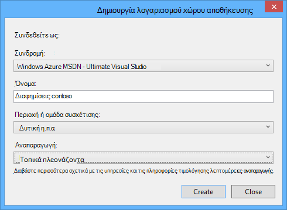

## Κάντε λήψη της εφαρμογής

1. Κάντε λήψη και αποσυμπιέστε την [ολοκλήρωση της λύσης](http://code.msdn.microsoft.com/Simple-Azure-Website-with-b4391eeb).

2. Ξεκινήστε το Visual Studio.

3. Από το μενού **αρχείο** επιλέξτε **Άνοιγμα > έργου/λύση**, μεταβείτε στο σημείο όπου έχετε κάνει λήψη της λύσης και, στη συνέχεια, ανοίξτε το αρχείο της λύσης.

4. Πατήστε το συνδυασμό πλήκτρων CTRL + SHIFT + B για να δημιουργήσετε τη λύση.

    Από προεπιλογή, το Visual Studio επαναφέρει αυτόματα το περιεχόμενο πακέτου NuGet, η οποία δεν περιλαμβάνεται στο αρχείο *.zip* . Εάν δεν επαναφέρετε τα πακέτα, τις εγκαταστήσετε με μη αυτόματο τρόπο από το παράθυρο διαλόγου **Διαχείριση πακέτων NuGet για λύση** και κάνοντας κλικ στο κουμπί **Επαναφορά** στην επάνω δεξιά γωνία.

5. Στην **Εξερεύνηση λύσεων**, βεβαιωθείτε ότι είναι επιλεγμένο το **ContosoAdsWeb** με το έργο της εκκίνησης.

## Ρύθμιση παραμέτρων της εφαρμογής για να χρησιμοποιήσετε το λογαριασμό χώρου αποθήκευσης

1. Ανοίξτε το αρχείο *Web.config* εφαρμογής του ContosoAdsWeb έργου.

    Το αρχείο περιέχει μια συμβολοσειρά σύνδεσης του SQL και μια συμβολοσειρά σύνδεσης Azure χώρου αποθήκευσης για εργασία με αντικείμενα BLOB και ουρές.

    Η συμβολοσειρά σύνδεσης SQL οδηγεί σε μια βάση δεδομένων [SQL Server Express LocalDB](http://msdn.microsoft.com/library/hh510202.aspx) .

    Η συμβολοσειρά σύνδεσης του χώρου αποθήκευσης είναι ένα παράδειγμα με σύμβολα κράτησης θέσης για το πλήκτρο πρόσβαση και όνομα λογαριασμού του χώρου αποθήκευσης. Θα μπορείτε να αντικαταστήσετε αυτό με μια συμβολοσειρά σύνδεσης που περιλαμβάνει το όνομα και το κλειδί του λογαριασμού σας χώρου αποθήκευσης.  

    <pre class="prettyprint">&lt;connectionStrings&gt;
   &lt;προσθέστε όνομα = συμβολοσειρά σύνδεσης "ContosoAdsContext" = "προέλευση δεδομένων = \v11.0 (localdb); Αρχικό κατάλογο = ContosoAds; Ενσωματωμένη ασφάλεια = True. MultipleActiveResultSets = True; "providerName="System.Data.SqlClient "/&gt;
   &lt;προσθέστε όνομα = συμβολοσειρά σύνδεσης"AzureWebJobsStorage"=" DefaultEndpointsProtocol = https; Όνομα λογαριασμού =<mark>[όνομα λογαριασμού]</mark>; AccountKey =<mark>[accesskey]</mark>"/&gt; 
    &lt;/connectionStrings      &gt;</pre>

    Η συμβολοσειρά σύνδεσης του χώρου αποθήκευσης ονομάζεται AzureWebJobsStorage καθώς αυτό είναι το όνομα που χρησιμοποιεί το SDK WebJobs από προεπιλογή. Το ίδιο όνομα χρησιμοποιείται εδώ, ώστε να έχετε για να ορίσετε μία μόνο τιμή συμβολοσειράς σύνδεσης στο περιβάλλον Azure.

2. Στην **Εξερεύνηση Server**, κάντε δεξιό κλικ στο λογαριασμό σας χώρο αποθήκευσης στον κόμβο του **χώρου αποθήκευσης** και, στη συνέχεια, κάντε κλικ στην επιλογή **Ιδιότητες**.

    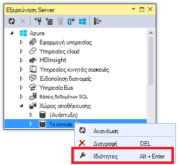

3. Στο παράθυρο **διαλόγου Ιδιότητες** , κάντε κλικ στην επιλογή **Πλήκτρα λογαριασμού χώρου αποθήκευσης**και, στη συνέχεια, κάντε κλικ στα αποσιωπητικά.

    

4. Αντιγράψτε τη **συμβολοσειρά σύνδεσης**.

    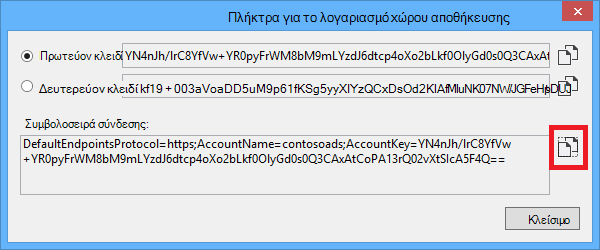

5. Αντικαταστήστε τη συμβολοσειρά σύνδεσης του χώρου αποθήκευσης στο αρχείο *Web.config* με τη συμβολοσειρά σύνδεσης που μόλις αντιγράψατε. Βεβαιωθείτε ότι έχετε επιλέξει όλα τα στοιχεία εντός των εισαγωγικών χωρίς να περιλαμβάνει τα εισαγωγικά πριν να κάνετε επικόλληση.

6. Ανοίξτε το αρχείο *App.config* στο έργο ContosoAdsWebJob.

    Αυτό το αρχείο έχει δύο συμβολοσειρών σύνδεσης χώρου αποθήκευσης, μία για δεδομένα εφαρμογής και μία για την καταγραφή. Μπορείτε να χρησιμοποιήσετε λογαριασμούς ξεχωριστή χώρου αποθήκευσης για τα δεδομένα των εφαρμογών και καταγραφή και μπορείτε να χρησιμοποιήσετε [πολλούς λογαριασμούς χώρου αποθήκευσης για τα δεδομένα](https://github.com/Azure/azure-webjobs-sdk/blob/master/test/Microsoft.Azure.WebJobs.Host.EndToEndTests/MultipleStorageAccountsEndToEndTests.cs). Για αυτό το πρόγραμμα εκμάθησης που θα χρησιμοποιήσετε ένα λογαριασμό μόνο χώρου αποθήκευσης. Οι συμβολοσειρές σύνδεσης έχουν σύμβολα κράτησης θέσης για τα πλήκτρα για το λογαριασμό χώρου αποθήκευσης. 
    <pre class="prettyprint">&lt;ρύθμιση παραμέτρων&gt; 
    &lt;connectionStrings&gt;
   &lt;προσθέστε όνομα = συμβολοσειρά σύνδεσης "AzureWebJobsDashboard" = "DefaultEndpointsProtocol = https; Όνομα λογαριασμού =<mark>[όνομα λογαριασμού]</mark>; AccountKey =<mark>[accesskey]</mark>"/&gt;
   &lt;προσθέστε όνομα = συμβολοσειρά σύνδεσης"AzureWebJobsStorage"=" DefaultEndpointsProtocol = https; Όνομα λογαριασμού =<mark>[όνομα λογαριασμού]</mark>; AccountKey =<mark>[accesskey]</mark>"/&gt;
   &lt;προσθέστε όνομα = συμβολοσειρά σύνδεσης"ContosoAdsContext"=" προέλευση δεδομένων = \v11.0 (localdb); Αρχικό κατάλογο = ContosoAds; Ενσωματωμένη ασφάλεια = True. MultipleActiveResultSets = True; " /&gt; 
    &lt;/connectionStrings&gt;
   &lt;εκκίνησης&gt;
   &lt;έκδοση υποστηριζόμενου χρόνου εκτέλεσης = sku "έκδοση 4.0" = ". NETFramework, έκδοση = v4.5 "/&gt; 
    &lt;/startup&gt;
&lt;/configuration                             &gt;</pre>

    Από προεπιλογή, το SDK WebJobs αναζητά συμβολοσειρές σύνδεσης με το όνομα AzureWebJobsStorage και AzureWebJobsDashboard. Ως εναλλακτική λύση, μπορείτε να κάνετε [store τη σύνδεση συμβολοσειράς ωστόσο που θέλετε και μεταβιβάζουν με ρητά για το `JobHost` αντικείμενο](websites-dotnet-webjobs-sdk-storage-queues-how-to.md#config).

7. Αντικατάσταση δύο συμβολοσειρών σύνδεσης χώρου αποθήκευσης με τη συμβολοσειρά σύνδεσης που αντιγράψατε προηγουμένως.

8. Αποθηκεύστε τις αλλαγές σας.

## Εκτελέστε την εφαρμογή τοπικά

1. Για να ξεκινήσετε το πρόγραμμα web προσκηνίου της εφαρμογής, πατήστε το συνδυασμό πλήκτρων CTRL + F5.

    Το προεπιλεγμένο πρόγραμμα περιήγησης ανοίγει στην αρχική σελίδα. (Το έργο web εκτελείται επειδή έχετε κάνει αυτό το έργο εκκίνησης.)

    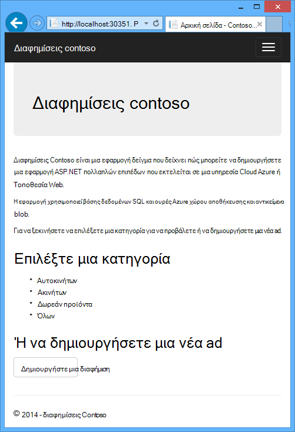

2. Για να ξεκινήσετε το παρασκηνίου WebJob της εφαρμογής, κάντε δεξί κλικ στο έργο ContosoAdsWebJob στην **Εξερεύνηση λύσεων**και, στη συνέχεια, κάντε κλικ στην επιλογή **Εντοπισμός σφαλμάτων** > **Έναρξη νέας παρουσίας**.

    Ένα παράθυρο εφαρμογής κονσόλας ανοίγει και εμφανίζει καταγραφής μηνυμάτων που υποδεικνύει ότι το αντικείμενο WebJobs SDK JobHost έχει ξεκινήσει να εκτελέσετε.

    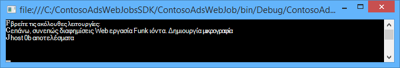

3. Στο πρόγραμμα περιήγησης, κάντε κλικ στην επιλογή **Δημιουργία μια διαφήμιση**.

4. Εισαγάγετε ορισμένα δεδομένα δοκιμής και επιλέξτε μια εικόνα για την αποστολή και, στη συνέχεια, κάντε κλικ στην επιλογή **Δημιουργία**.

    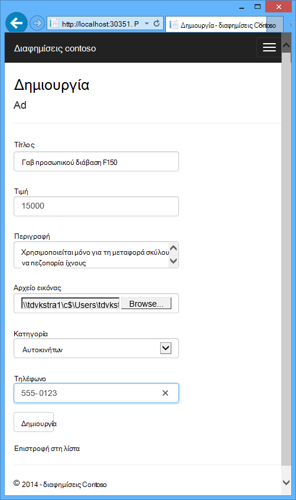

    Η εφαρμογή μεταβαίνει στη σελίδα ευρετήριο, αλλά δεν εμφανίζει μια μικρογραφία για το νέο ad επειδή η επεξεργασία δεν είναι ακόμη.

    Στο μεταξύ, μετά από μια σύντομη αναμονής καταγραφής μηνύματος στο παράθυρο της εφαρμογής κονσόλας δείχνει ότι ένα μήνυμα ουρά παραλήφθηκε και έχει υποβληθεί σε επεξεργασία.

    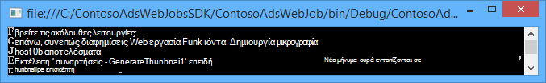

5. Όταν δείτε τα μηνύματα καταγραφής στο παράθυρο της εφαρμογής κονσόλας, ανανεώστε τη σελίδα ευρετηρίου για να δείτε τη μικρογραφία.

    

6. Κάντε κλικ στην επιλογή **Λεπτομέρειες** για το ad για να δείτε την εικόνα πλήρους μεγέθους.

    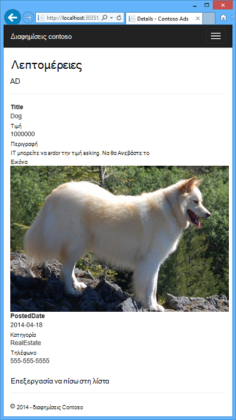

Έχετε λειτουργεί η εφαρμογή στον τοπικό υπολογιστή σας και τη χρήση SQL Server βάση δεδομένων που βρίσκεται στον υπολογιστή σας, αλλά λειτουργεί με ουρές και αντικείμενα blob στο cloud. Στην παρακάτω ενότητα θα εκτελείτε την εφαρμογή στο cloud, χρησιμοποιώντας μια βάση δεδομένων cloud, καθώς και αντικείμενα BLOB cloud και ουρές.  

## Εκτελέστε την εφαρμογή στο cloud

Θα μπορείτε να κάνετε τα παρακάτω βήματα για να εκτελέσετε την εφαρμογή στο cloud:

* Ανάπτυξη εφαρμογών Web. Visual Studio δημιουργεί αυτόματα μια νέα εφαρμογή web της εφαρμογής υπηρεσίας και μια παρουσία της βάσης δεδομένων SQL.
* Ρυθμίστε τις παραμέτρους του web app για να χρησιμοποιήσετε το λογαριασμό της βάσης δεδομένων και αποθήκευσης Azure SQL.

Αφού έχετε δημιουργήσει κάποια διαφημίσεις ενώ εκτελείται στο cloud, θα μπορείτε να προβάλετε τον πίνακα εργαλείων WebJobs SDK για να δείτε το εμπλουτισμένο παρακολούθησης που έχει να προσφέρει δυνατότητες.

### Ανάπτυξη εφαρμογών Web

1. Κλείστε το πρόγραμμα περιήγησης και το παράθυρο της εφαρμογής κονσόλας.

2. Στην **Εξερεύνηση λύσεων**, κάντε δεξί κλικ στο έργο ContosoAdsWeb και, στη συνέχεια, κάντε κλικ στο κουμπί **Δημοσίευση**.

3. Στο **προφίλ** βήμα του οδηγού **Δημοσίευση Web** , κάντε κλικ στην επιλογή **εφαρμογές web της Microsoft Azure**.

    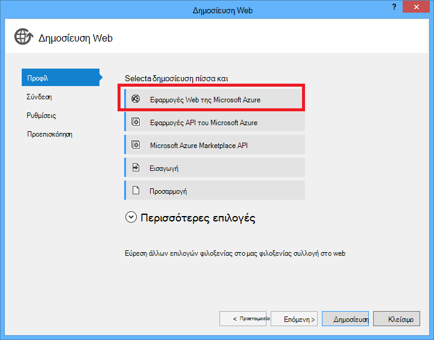

4. Πραγματοποιήστε είσοδο στο Azure εάν έχετε εισέλθει ακόμη.

5. Κάντε κλικ στην επιλογή **νέα**.

    Το παράθυρο διαλόγου ενδέχεται να διαφέρει λίγο, ανάλογα με το ποια έκδοση του Azure SDK για .NET που έχετε εγκαταστήσει.

    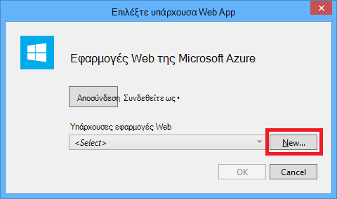

6. Στο παράθυρο διαλόγου **Δημιουργία εφαρμογής web στη Microsoft Azure** , πληκτρολογήστε ένα μοναδικό όνομα στο πλαίσιο **όνομα εφαρμογής Web** .

    Την πλήρη διεύθυνση URL θα αποτελείται από τα δεδομένα που πληκτρολογείτε εδώ συν. azurewebsites.net (όπως φαίνεται δίπλα στο πλαίσιο κειμένου **όνομα εφαρμογής Web** ). Για παράδειγμα, εάν το όνομα της εφαρμογής web είναι ContosoAds, τη διεύθυνση URL θα ContosoAds.azurewebsites.net.

7. Στην αναπτυσσόμενη λίστα το [πρόγραμμα εφαρμογής υπηρεσίας](../app-service/azure-web-sites-web-hosting-plans-in-depth-overview.md) , επιλέξτε **Δημιουργία νέο πρόγραμμα εφαρμογής υπηρεσίας**. Πληκτρολογήστε ένα όνομα για το πρόγραμμα εφαρμογής υπηρεσίας, όπως ContosoAdsPlan.

8. Στην [ομάδα πόρων](../azure-resource-manager/resource-group-overview.md) αναπτυσσόμενη λίστα επιλέξτε **Δημιουργία νέας ομάδας πόρων**.

9. Πληκτρολογήστε ένα όνομα για την ομάδα πόρων, όπως ContosoAdsGroup.

10. Στην **περιοχή** αναπτυσσόμενη λίστα, επιλέξτε στην ίδια περιοχή που επιλέξατε για το λογαριασμό χώρου αποθήκευσης.

    Αυτή η ρύθμιση καθορίζει ποιες Azure κέντρο δεδομένων της εφαρμογής σας web θα εκτελείται σε. Διατηρώντας το λογαριασμό web app και το χώρο αποθήκευσης στο ίδιο κέντρο δεδομένων ελαχιστοποιεί λανθάνων χρόνος και τα δεδομένα εξόδου χρεώσεων.

11. Στην αναπτυσσόμενη λίστα του **διακομιστή βάσης δεδομένων** , επιλέξτε **Δημιουργία νέου διακομιστή**.

12. Πληκτρολογήστε ένα όνομα για το διακομιστή βάσης δεδομένων, όπως contosoadsserver + έναν αριθμό ή το όνομά σας για να μετατρέψετε το όνομα του διακομιστή μοναδικών τιμών. 

    Το όνομα του διακομιστή πρέπει να είναι μοναδικό. Μπορεί να περιέχει πεζά γράμματα, αριθμητικά ψηφία και παύλες. Δεν μπορεί να περιέχει ένα τελικό ενωτικό. 

    Εναλλακτικά, εάν ήδη τη συνδρομή σας έχει ένα διακομιστή, μπορείτε να επιλέξετε αυτόν το διακομιστή από την αναπτυσσόμενη λίστα.

12. Εισαγάγετε ένα διαχειριστή **βάσης δεδομένων όνομα χρήστη** και **κωδικό πρόσβασης βάσης δεδομένων**.

    Εάν έχετε επιλέξει **νέα βάση δεδομένων SQL server** που δεν είναι εισάγοντας ένα υπάρχον όνομα και τον κωδικό πρόσβασης εδώ, εισαγωγή ένα νέο όνομα και τον κωδικό πρόσβασης που θα ορίσετε τώρα για να χρησιμοποιήσετε αργότερα, κατά την πρόσβαση στη βάση δεδομένων. Εάν έχετε επιλέξει ένα διακομιστή που δημιουργήσατε προηγουμένως, θα σας ζητηθεί για τον κωδικό πρόσβασης για το λογαριασμό χρήστη με δικαιώματα διαχειριστή που έχετε ήδη δημιουργήσει.

13. Κάντε κλικ στην επιλογή **Δημιουργία**.

    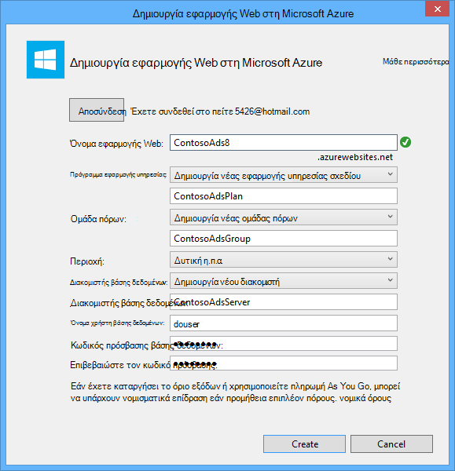

    Visual Studio δημιουργεί τη λύση, το project web, η εφαρμογή web στο Azure και την παρουσία βάσης δεδομένων SQL Azure.

14. Στο βήμα του οδηγού **Δημοσίευση Web** **σύνδεσης** , κάντε κλικ στο κουμπί **Επόμενο**.

    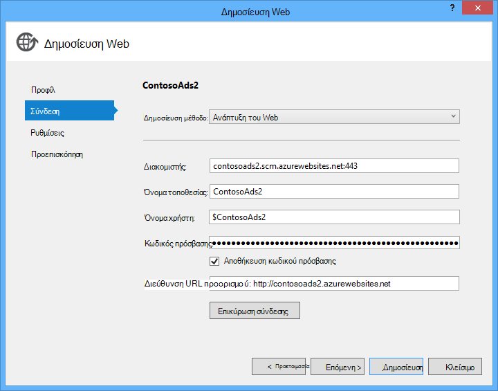

15. Στο βήμα **Ρυθμίσεις** , καταργήστε την επιλογή από το πλαίσιο ελέγχου **χρήση αυτήν τη συμβολοσειρά σύνδεσης κατά το χρόνο εκτέλεσης** και, στη συνέχεια, κάντε κλικ στο κουμπί **Επόμενο**.

    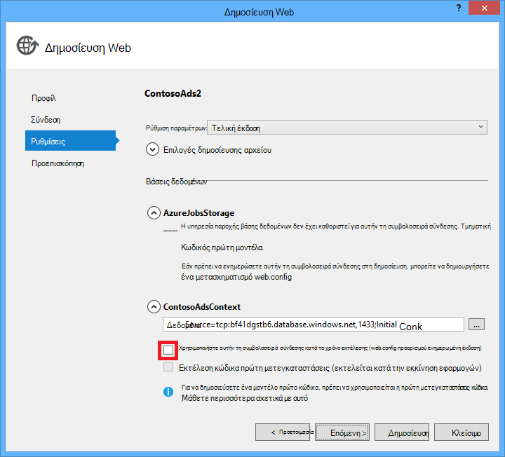

    Δεν χρειάζεται να χρησιμοποιήσετε το παράθυρο διαλόγου δημοσίευση για να ορίσετε τη συμβολοσειρά σύνδεσης του SQL, επειδή θα ορίσετε αυτήν την τιμή στο περιβάλλον Azure αργότερα.

    Μπορείτε να αγνοήσετε τις προειδοποιήσεις σε αυτήν τη σελίδα.

    * Κανονικά το λογαριασμό χώρου αποθήκευσης που χρησιμοποιείτε για εκτέλεση στο Azure θα είναι διαφορετική από αυτήν που χρησιμοποιείτε όταν εκτελείται τοπικά, αλλά αυτό το πρόγραμμα εκμάθησης που χρησιμοποιείτε το ίδιο με αυτό και στα δύο περιβάλλοντα. Η συμβολοσειρά σύνδεσης AzureWebJobsStorage δεν πρέπει να είναι μετασχηματισμό. Ακόμα και αν θέλετε να χρησιμοποιήσετε ένα λογαριασμό διαφορετικό χώρο αποθήκευσης στο cloud, δεν θα πρέπει να μετατρέψετε τη συμβολοσειρά σύνδεσης, επειδή η εφαρμογή χρησιμοποιεί μια ρύθμιση Azure περιβάλλον όταν εκτελείται στο Azure. Θα δείτε αυτό αργότερα στην εκμάθηση.

    * Για αυτό το πρόγραμμα εκμάθησης που δεν πρόκειται να κάνει αλλαγές στο μοντέλο δεδομένων που χρησιμοποιούνται για τη βάση δεδομένων ContosoAdsContext, επομένως δεν υπάρχει χωρίς να χρειάζεται να χρησιμοποιήσετε οντότητα Framework κώδικα πρώτη μετεγκαταστάσεις για ανάπτυξη. Κωδικός πρώτα δημιουργεί αυτόματα μια νέα βάση δεδομένων της πρώτης ώρα η εφαρμογή προσπαθεί να αποκτήσει πρόσβαση δεδομένων SQL.

    Για αυτό το πρόγραμμα εκμάθησης, οι προεπιλεγμένες τιμές από τις επιλογές στην περιοχή **Επιλογές δημοσίευση αρχείου** είναι λεπτομερές.

16. Στο βήμα **προεπισκόπησης** , κάντε κλικ στην επιλογή **Έναρξη Preview**.

    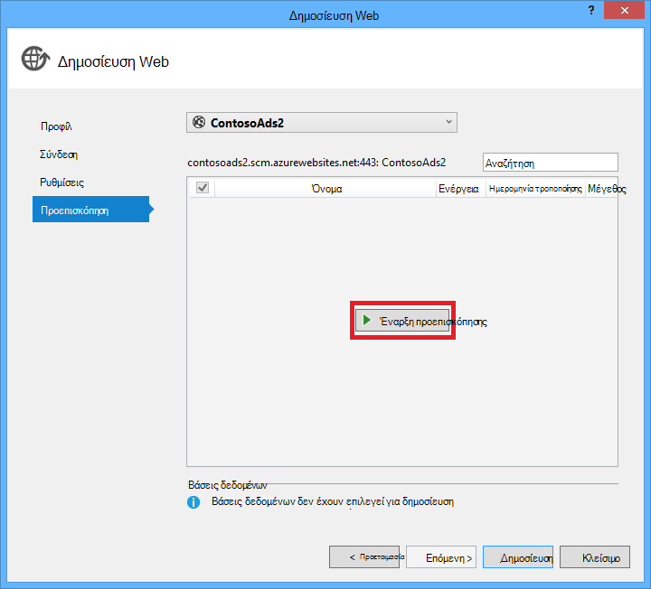

    Μπορείτε να αγνοήσετε την προειδοποίηση σχετικά με τις βάσεις δεδομένων δεν τη δημοσίευση. Οντότητα Framework κώδικα πρώτη δημιουργεί της βάσης δεδομένων. Δεν χρειάζεται να δημοσιευτεί.

    Το παράθυρο προεπισκόπησης εμφανίζει ότι δυαδικά στοιχεία και αρχεία ρύθμισης παραμέτρων από το έργο WebJob θα αντιγραφούν στο φάκελο *app_data\jobs\continuous* του web app.

    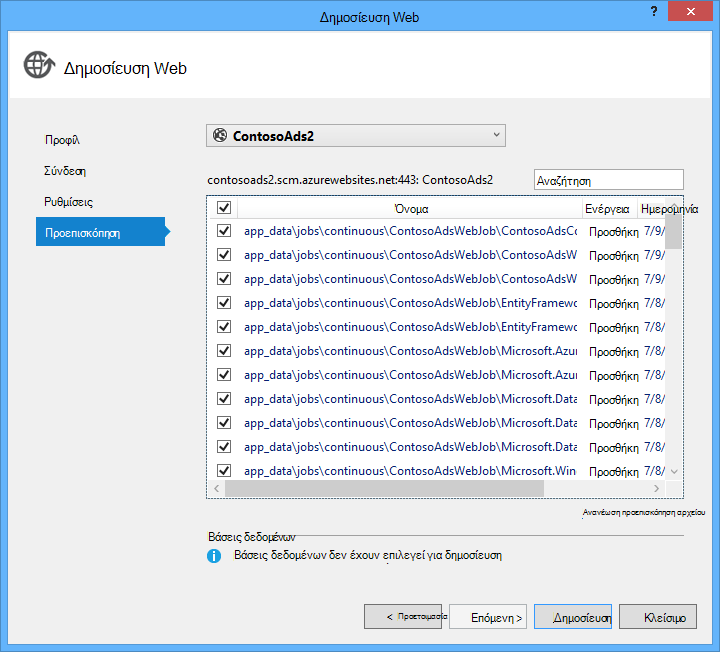

17. Κάντε κλικ στο κουμπί **Δημοσίευση**.

    Visual Studio ανάπτυξη της εφαρμογής και ανοίγει τη διεύθυνση URL αρχική σελίδα στο πρόγραμμα περιήγησης.

    Δεν θα μπορείτε να χρησιμοποιήσετε την εφαρμογή web μέχρι να ορίσετε συμβολοσειρές σύνδεσης στο περιβάλλον του Azure στην επόμενη ενότητα. Θα δείτε μια σελίδα σφάλματος ή στην αρχική σελίδα, ανάλογα με το web app και βάσεων δεδομένων επιλογές για τη δημιουργία που επιλέξατε νωρίτερα.

### Ρυθμίστε τις παραμέτρους του web app για να χρησιμοποιήσετε το λογαριασμό της βάσης δεδομένων και αποθήκευσης Azure SQL.

Είναι καλύτερη πρακτική ασφαλείας για να [αποφύγετε την τοποθέτηση ευαίσθητες πληροφορίες, όπως συμβολοσειρές σύνδεσης σε αρχεία που είναι αποθηκευμένα σε αποθετήρια κώδικα προέλευσης](http://www.asp.net/aspnet/overview/developing-apps-with-windows-azure/building-real-world-cloud-apps-with-windows-azure/source-control#secrets). Azure παρέχει ένας τρόπος για να το κάνετε: μπορείτε να ορίσετε συμβολοσειρά σύνδεσης και άλλες τιμές ρύθμιση στο περιβάλλον Azure και API ρύθμισης παραμέτρων ASP.NET αυτόματα σηκώστε αυτές τις τιμές κατά την εκτέλεση της εφαρμογής στο Azure. Μπορείτε να ορίσετε αυτές τις τιμές στο Azure χρησιμοποιώντας την **Εξερεύνηση Server**, την πύλη Azure, του Windows PowerShell ή το περιβάλλον γραμμής εντολών πλατφόρμες. Για περισσότερες πληροφορίες, ανατρέξτε στο θέμα [Πώς συμβολοσειρές εφαρμογής και σύνδεση συμβολοσειρές εργασίας](/blog/2013/07/17/windows-azure-web-sites-how-application-strings-and-connection-strings-work/).

Σε αυτήν την ενότητα, μπορείτε να χρησιμοποιήσετε **Εξερεύνηση Server** για να ορίσετε τιμές συμβολοσειράς σύνδεσης στο Azure.

7. Στην **Εξερεύνηση Server**, κάντε δεξί κλικ σε εφαρμογή web της στην περιοχή **Azure > εφαρμογής υπηρεσίας > {σας ομάδα πόρων}**, και, στη συνέχεια, κάντε κλικ στην επιλογή **Ρυθμίσεις προβολής**.

    Ανοίγει το παράθυρο **Azure Web App** στην καρτέλα **παράμετροι** .

9. Αλλάξτε το όνομα της συμβολοσειράς σύνδεσης DefaultConnection σε ContosoAdsContext.

    Azure δημιουργείται αυτόματα αυτήν τη συμβολοσειρά σύνδεσης κατά τη δημιουργία της εφαρμογής web με ένα σχετιζόμενης βάσης δεδομένων, ώστε να έχει ήδη την τιμή συμβολοσειράς σύνδεσης δεξιά. Θέλετε να αλλάξετε μόνο το όνομα για το τι είναι αναζητάτε τον κωδικό.

9. Προσθέστε δύο νέες συμβολοσειρές σύνδεσης με το όνομα AzureWebJobsStorage και AzureWebJobsDashboard. Ορισμός τύπου σε προσαρμοσμένη και ορίστε την τιμή συμβολοσειράς σύνδεσης με την ίδια τιμή που είχατε χρησιμοποιήσει προηγουμένως για τα αρχεία *Web.config* και *App.config* . (Βεβαιωθείτε ότι που περιλαμβάνει τη συμβολοσειρά ολόκληρη τη σύνδεση, όχι μόνο το πλήκτρο πρόσβασης, και δεν περιλαμβάνουν τα εισαγωγικά.)

    Αυτές οι συμβολοσειρές σύνδεσης που χρησιμοποιούνται από το SDK WebJobs, μία για δεδομένα εφαρμογής και μία για να συνδεθείτε. Όπως περιγράφηκε νωρίτερα, τη μία για δεδομένα εφαρμογής χρησιμοποιείται επίσης από τον κωδικό web προσκηνίου.

9. Κάντε κλικ στην επιλογή **Αποθήκευση**.

    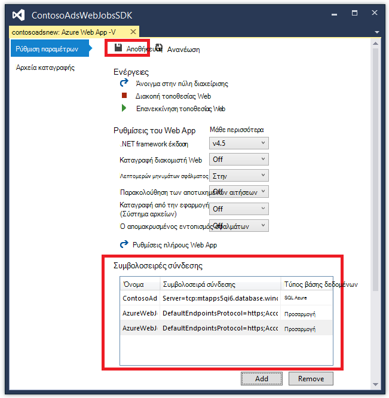

10. Στην **Εξερεύνηση Server**, κάντε δεξί κλικ στην εφαρμογή web και, στη συνέχεια, κάντε κλικ στην επιλογή **Διακοπή**.

12. Αφού σταματήσει την εφαρμογή web, κάντε ξανά δεξί κλικ στην εφαρμογή web και, στη συνέχεια, κάντε κλικ στο κουμπί **Έναρξη**.

    Το WebJob ξεκινά αυτόματα όταν δημοσιεύετε, αλλά να σταματήσει όταν κάνετε μια αλλαγή ρύθμισης παραμέτρων. Για να επανεκκινήσετε το μπορείτε να επανεκκινήστε την εφαρμογή web ή να επανεκκινήσετε το WebJob στην [Πύλη του Azure](http://go.microsoft.com/fwlink/?LinkId=529715). Γενικά συνιστάται να κάνετε επανεκκίνηση της εφαρμογής web μετά την αλλαγή ρύθμισης παραμέτρων.

9. Ανανεώστε το παράθυρο του προγράμματος περιήγησης με τη διεύθυνση URL της εφαρμογής web με τη γραμμή διευθύνσεων.

    Εμφανίζεται η αρχική σελίδα.

10. Δημιουργήστε μια διαφήμιση, όπως όταν εκτελέσατε τοπικά στην εφαρμογή.

    Εμφανίζει τη σελίδα ευρετηρίου χωρίς την πρώτη μικρογραφία.

11. Ανανεώστε τη σελίδα μετά από μερικά δευτερόλεπτα και εμφανίζεται η μικρογραφία.

    Εάν δεν εμφανίζεται η μικρογραφία, ίσως χρειαστεί να περιμένετε σε λεπτά ή επομένως για το WebJob για να ξεκινήσετε ξανά. Αν μετά από ένα λίγο ακόμη δεν βλέπετε τη μικρογραφία κατά την ανανέωση της σελίδας, το WebJob ενδέχεται να μην έχετε ξεκινήσει αυτόματα. Σε αυτή την περίπτωση, μεταβείτε στην καρτέλα WebJobs στη σελίδα [κλασική πύλη](https://manage.windowsazure.com) για την εφαρμογή web της και, στη συνέχεια, κάντε κλικ στο κουμπί **Έναρξη**.

### Προβολή του πίνακα εργαλείων WebJobs SDK

1. Στην [κλασική πύλης](https://manage.windowsazure.com), επιλέξτε την εφαρμογή web.

2. Κάντε κλικ στην καρτέλα **WebJobs** .

3. Κάντε κλικ στη διεύθυνση URL στη στήλη αρχεία καταγραφής για WebJob σας.

    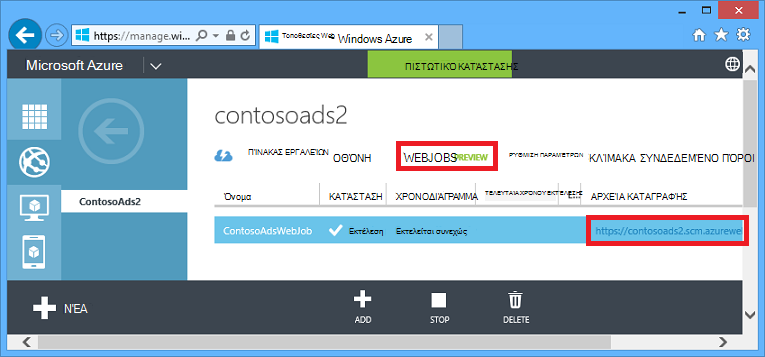

    Ανοίγει μια νέα καρτέλα του προγράμματος περιήγησης στον πίνακα εργαλείων WebJobs SDK. Πίνακας εργαλείων δείχνει ότι το WebJob εκτελείται και εμφανίζει μια λίστα με τις συναρτήσεις στον κώδικα που την ενεργοποίησε το SDK WebJobs.

4. Κάντε κλικ σε μία από τις συναρτήσεις για να δείτε λεπτομέρειες σχετικά με την εκτέλεση.

    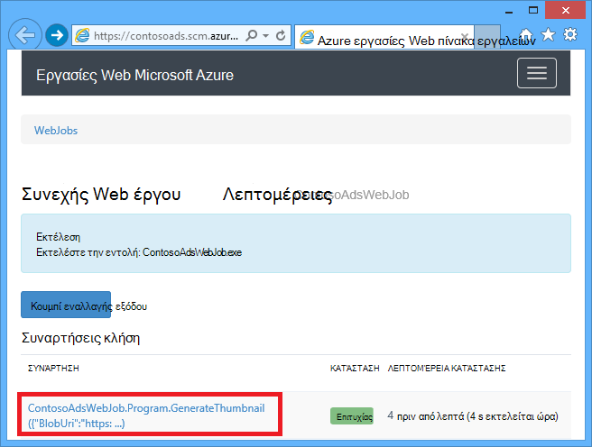

    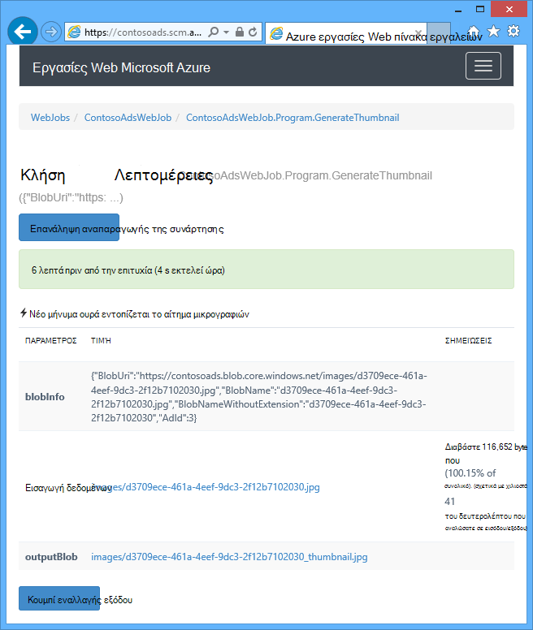

    Το κουμπί **Λειτουργία αναπαραγωγής** σε αυτήν τη σελίδα έχει ως αποτέλεσμα το πλαίσιο WebJobs SDK για να καλέσετε τη συνάρτηση ξανά και σας δίνει τη δυνατότητα να αλλάξετε τα δεδομένα που του μεταβιβάστηκε η συνάρτηση πρώτα.

>[AZURE.NOTE] Όταν έχετε ολοκληρώσει δοκιμές, διαγράψτε την εφαρμογή web και την παρουσία της βάσης δεδομένων SQL. Η εφαρμογή web είναι δωρεάν, αλλά η παρουσία της βάσης δεδομένων SQL και το λογαριασμό χώρου αποθήκευσης προσαύξηση χρεώσεις (ελάχιστους οφείλεται σε μικρό μέγεθος). Επίσης, εάν αφήσετε την εφαρμογή web εκτελείται, όλα τα άτομα που εντοπίζει τη διεύθυνση URL σας να δημιουργήσετε και να προβάλετε διαφημίσεις. Στην κλασική πύλη, μεταβείτε στην καρτέλα **πίνακα εργαλείων** για την εφαρμογή web σας και, στη συνέχεια, κάντε κλικ στο κουμπί **Διαγραφή** στο κάτω μέρος της σελίδας. Στη συνέχεια, μπορείτε να επιλέξετε ένα πλαίσιο ελέγχου για να διαγράψετε την παρουσία της βάσης δεδομένων SQL την ίδια στιγμή. Εάν θέλετε απλώς να προσωρινά εμποδίζετε άλλους χρήστες να αποκτούν πρόσβαση στην εφαρμογή web, επιλέξτε **Διακοπή** . Σε αυτή την περίπτωση, χρεώσεων θα συνεχίσουν να προσαύξηση για το λογαριασμό της βάσης δεδομένων SQL και χώρου αποθήκευσης. Μπορείτε να ακολουθήσετε μια παρόμοια διαδικασία για να διαγράψετε το λογαριασμό SQL βάσης δεδομένων και χώρου αποθήκευσης, όταν δεν χρειάζεστε πλέον τους.

## Δημιουργία της εφαρμογής από την αρχή

Σε αυτήν την ενότητα θα κάνετε τις ακόλουθες εργασίες:

* Δημιουργήστε μια λύση Visual Studio με ένα έργο web.
* Προσθέστε ένα έργο τάξης βιβλιοθήκη για το επίπεδο πρόσβασης δεδομένων που χρησιμοποιείται από κοινού μεταξύ προσκηνίου και παρασκηνίου.
* Προσθήκη εφαρμογής κονσόλας έργου για υπολογιστή στο παρασκήνιο, με ανάπτυξη WebJobs με δυνατότητα.
* Προσθήκη πακέτων NuGet.
* Σύνολο αναφορών έργου.
* Αντιγραφή αρχείων κώδικα και ρύθμισης παραμέτρων εφαρμογής από την εφαρμογή λήψης που εργαστήκατε με στην προηγούμενη ενότητα του προγράμματος εκμάθησης.
* Αναθεωρήστε τα τμήματα του κώδικα που λειτουργούν με αντικείμενα BLOB Azure και ουρές και το SDK WebJobs.

### Δημιουργήσετε μια λύση Visual Studio με ένα έργο web και το project βιβλιοθήκη κλάσης

1. Στο Visual Studio, επιλέξτε **Δημιουργία** > **έργου** από το μενού **αρχείο** .

2. Στο παράθυρο διαλόγου **Νέο έργο** , επιλέξτε **Visual C#** > **Web** > **Εφαρμογής Web ASP.NET**.

3. Ονομάστε το έργο ContosoAdsWeb, το όνομα της λύσης ContosoAdsWebJobsSDK (αλλαγή το όνομα της λύσης Αν τοποθετείτε στον ίδιο φάκελο με τη λύση που έχετε λάβει) και, στη συνέχεια, κάντε κλικ στο κουμπί **OK**.

    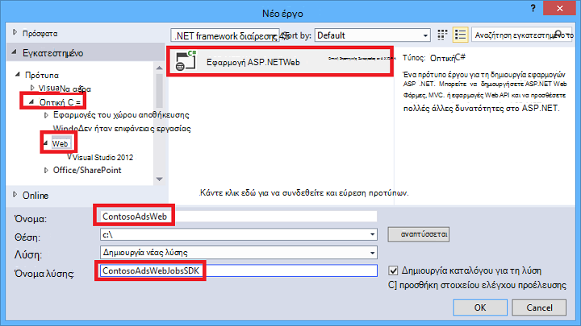

5. Στο παράθυρο διαλόγου **Νέο έργο ASP.NET** , επιλέξτε το πρότυπο MVC και καταργήστε το πλαίσιο ελέγχου **κεντρικού υπολογιστή στο cloud** στην περιοχή **Microsoft Azure**.

    Επιλογή **κεντρικού υπολογιστή στο cloud** ενεργοποιεί Visual Studio για να δημιουργήσετε αυτόματα μια νέα εφαρμογή Azure web και βάση δεδομένων SQL. Επειδή έχετε ήδη δημιουργήσει αυτά νωρίτερα, δεν χρειάζεται να τώρα κατά τη δημιουργία του έργου. Εάν θέλετε να δημιουργήσετε ένα νέο, επιλέξτε το πλαίσιο ελέγχου. Μπορείτε να, στη συνέχεια, ρυθμίσετε η νέα εφαρμογή web και η βάση δεδομένων SQL τον ίδιο τρόπο που κάνατε προηγουμένως κατά την ανάπτυξη της εφαρμογής.

5. Κάντε κλικ στην επιλογή **Αλλαγή ελέγχου ταυτότητας**.

    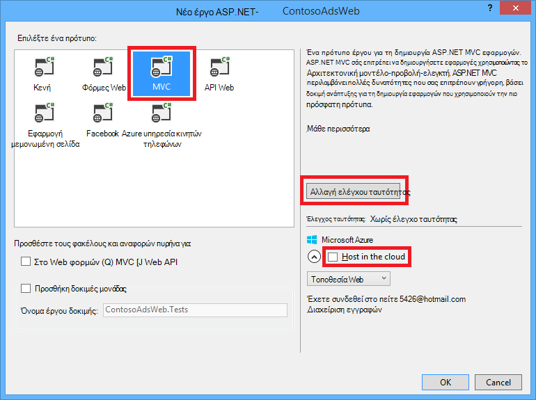

7. Στο παράθυρο διαλόγου **Αλλαγή ελέγχου ταυτότητας** , επιλέξτε **Χωρίς έλεγχο ταυτότητας**και, στη συνέχεια, κάντε κλικ στο κουμπί **OK**.

    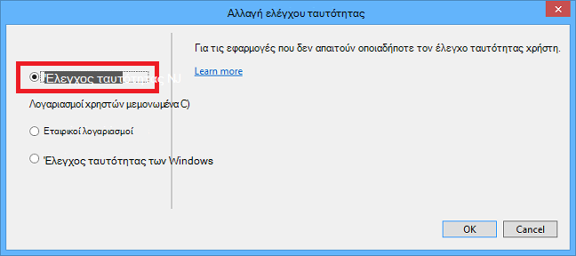

8. Στο παράθυρο διαλόγου **Νέο έργο ASP.NET** , κάντε κλικ στο **κουμπί OK**.

    Visual Studio δημιουργεί τη λύση και το project web.

9. Στην **Εξερεύνηση λύσεων**, κάντε δεξί κλικ της λύσης (μην το έργο) και επιλέξτε **Προσθήκη** > **Νέο έργο**.

11. Στο παράθυρο διαλόγου **Προσθήκη νέου έργου** , επιλέξτε **Visual C#** > **Επιφάνεια εργασίας των Windows** > **Βιβλιοθήκη κλάσεων** πρότυπο.  

10. Ονομάστε το έργο *ContosoAdsCommon*και, στη συνέχεια, κάντε κλικ στο κουμπί **OK**.

    Αυτό το έργο θα περιέχει το περιβάλλον Framework οντότητα και το μοντέλο δεδομένων που θα χρησιμοποιεί τόσο την προσκηνίου και παρασκηνίου. Ως εναλλακτική λύση μπορείτε να ορίσετε τις κατηγορίες που σχετίζονται με EF στο το project web και να αναφέρονται σε αυτό το έργο από το έργο WebJob. Αλλά, τότε το έργο σας WebJob θα έχει μια αναφορά σε συγκροτήσεις web που δεν χρειάζεται.

### Προσθήκη εφαρμογής κονσόλας έργου που έχει με δυνατότητα ανάπτυξης WebJobs

1. Κάντε δεξί κλικ στο έργο web (της λύσης ή όχι το έργο βιβλιοθήκη κλάσης) και, στη συνέχεια, κάντε κλικ στην επιλογή **Προσθήκη** > **Νέο έργο WebJob Azure**.

    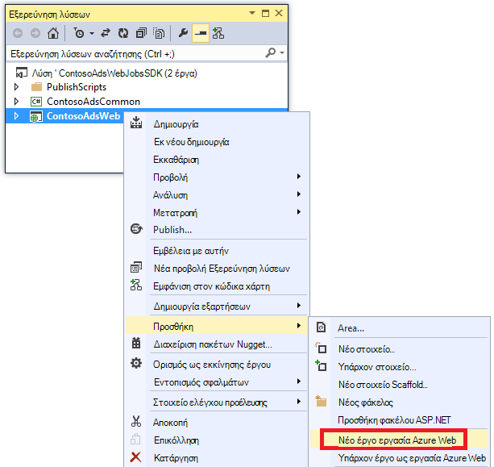

2. Στο παράθυρο διαλόγου **Προσθήκη WebJob Azure** , πληκτρολογήστε ContosoAdsWebJob ως το **όνομα του έργου** και το **όνομα WebJob**. Αφήστε **WebJob εκτέλεση λειτουργίας** ρύθμιση για να **Εκτελέσετε συνεχώς**.

3.  Κάντε κλικ στο **κουμπί OK**.

    Visual Studio δημιουργεί μια εφαρμογή κονσόλας που έχει ρυθμιστεί για την ανάπτυξη ως μια WebJob κάθε φορά που μπορείτε να αναπτύξετε το έργο web. Για να το κάνετε, εκτελείται τις ακόλουθες εργασίες μετά τη δημιουργία του έργου:

    * Προσθέσει ένα αρχείο *webjob δημοσίευση settings.json* στο φάκελο WebJob έργου ιδιότητες.
    * Προσθήκη αρχείου *webjobs list.json* στον φάκελο ιδιότητες του project web.
    * Εγκατάσταση του πακέτου Microsoft.Web.WebJobs.Publish NuGet του έργου WebJob.

    Για περισσότερες πληροφορίες σχετικά με αυτές τις αλλαγές, δείτε [πώς μπορείτε να αναπτύξετε το WebJobs με χρήση του Visual Studio](websites-dotnet-deploy-webjobs.md).

### Προσθήκη πακέτων NuGet

Το πρότυπο νέο έργο για ένα έργο WebJob εγκαθιστά αυτόματα το πακέτο WebJobs SDK NuGet [Microsoft.Azure.WebJobs](http://www.nuget.org/packages/Microsoft.Azure.WebJobs) και τις εξαρτήσεις.

Μία από τις εξαρτήσεις WebJobs SDK που εγκαθίσταται αυτόματα στο έργο WebJob είναι η βιβλιοθήκη προγράμματος-πελάτη αποθήκευσης Azure (SCL). Ωστόσο, πρέπει να την προσθέσετε στο έργο web για να εργαστείτε με αντικείμενα BLOB και ουρές.

1. Ανοίξτε το παράθυρο διαλόγου **Διαχείριση πακέτων NuGet** για τη λύση.

2. Στο αριστερό παράθυρο, επιλέξτε **εγκατεστημένες πακέτων**.

3. Βρείτε το *Χώρο αποθήκευσης Azure* πακέτο και, στη συνέχεια, κάντε κλικ στην επιλογή **Διαχείριση**.

4. Στο παράθυρο διαλόγου **Επιλογή έργων** , επιλέξτε το πλαίσιο ελέγχου **ContosoAdsWeb** και, στη συνέχεια, κάντε κλικ στο κουμπί **OK**.

    Όλα τα τρία έργα Χρησιμοποιήστε το πλαίσιο οντότητα για να εργαστείτε με τα δεδομένα στη βάση δεδομένων SQL.

5. Στο αριστερό παράθυρο, επιλέξτε **Online**.

6. Βρείτε το πακέτο NuGet *EntityFramework* και εγκαταστήστε την σε όλα τα τρία έργα.

### Σύνολο αναφορών έργου

Web και έργα WebJob εργαστείτε με τη βάση δεδομένων SQL, οπότε και τα δύο χρειάζεται μια αναφορά στο έργο ContosoAdsCommon.

1. Στο έργο ContosoAdsWeb, ορίστε μια αναφορά στο έργο ContosoAdsCommon. (Κάντε δεξί κλικ στο έργο ContosoAdsWeb και, στη συνέχεια, κάντε κλικ στην επιλογή **Προσθήκη** > **αναφοράς**. Στο παράθυρο διαλόγου **Διαχείριση αναφορά** , επιλέξτε **λύση** > **έργα** > **ContosoAdsCommon**, και, στη συνέχεια, κάντε κλικ στο **κουμπί OK**.)

1. Στο έργο ContosoAdsWebJob, ορίστε μια αναφορά στο έργο ContosAdsCommon.

    Το έργο WebJob ανάγκες αναφορές για εργασία με εικόνες και για να αποκτήσετε πρόσβαση σε συμβολοσειρές σύνδεσης.

3. Στο έργο ContosoAdsWebJob, ορίστε μια αναφορά σε `System.Drawing` και `System.Configuration`.

### Προσθήκη αρχείων κώδικα και ρύθμισης παραμέτρων

Αυτό το πρόγραμμα εκμάθησης δεν εμφανίζει πώς μπορείτε να [δημιουργήσετε MVC ελεγκτές και προβολές με τη χρήση ικριώματος](http://www.asp.net/mvc/tutorials/mvc-5/introduction/getting-started), [σύνταξη κώδικα Framework οντότητα που λειτουργεί με βάσεις δεδομένων SQL Server](http://www.asp.net/mvc/tutorials/getting-started-with-ef-using-mvc)ή [τα βασικά στοιχεία του ασύγχρονης προγραμματισμού στο διαίρεσης 4,5 ASP.NET](http://www.asp.net/aspnet/overview/developing-apps-with-windows-azure/building-real-world-cloud-apps-with-windows-azure/web-development-best-practices#async). Επομένως, όλες τις δυνατότητες που παραμένει για να το κάνετε είναι Αντιγραφή κώδικα και τη ρύθμιση παραμέτρων αρχείων από τη λήψη λύση σε νέας λύσης. Αφού κάνετε αυτό, οι παρακάτω ενότητες εμφάνιση και εξηγούν βασικά τμήματα του κώδικα.

Για να προσθέσετε τα αρχεία σε ένα έργο ή ένα φάκελο, κάντε δεξί κλικ στο project ή το φάκελο και κάντε κλικ στην επιλογή **Προσθήκη** > **Υπάρχον στοιχείο**. Επιλέξτε τα αρχεία που θέλετε και κάντε κλικ στην επιλογή **Προσθήκη**. Εάν ερωτηθείτε αν θέλετε να αντικαταστήσετε υπάρχοντα αρχεία, κάντε κλικ στο κουμπί **Ναι**.

1. Στο έργο ContosoAdsCommon, διαγράψτε το αρχείο *Class1.cs* και προσθέστε στη θέση τα ακόλουθα αρχεία από το έργο που έχετε λάβει.

    - *AD.CS*
    - *ContosoAdscontext.cs*
    - *BlobInformation.cs*  

2. Στο έργο ContosoAdsWeb, προσθέστε τα ακόλουθα αρχεία από το έργο που έχετε λάβει.

    - *Web.config*
    - *Global.asax.CS*  
    - Στο φάκελο *ελεγκτές* : *AdController.cs*
    - Στο φάκελο *Views\Shared* : *_Layout.cshtml* αρχείου
    - Στο φάκελο *Views\Home* : *Index.cshtml*
    - Στο φάκελο *Views\Ad* (δημιουργία πρώτα το φάκελο): πέντε αρχεία *.cshtml*  

3. Στο έργο ContosoAdsWebJob, προσθέστε τα ακόλουθα αρχεία από το έργο που έχετε λάβει.

    - *App.config* (αλλαγή του φίλτρου τύπου αρχείου σε **Όλα τα αρχεία**)
    - *Program.CS*
    - *Functions.CS*

Τώρα μπορείτε να δημιουργήσετε, να εκτελέσετε και να ανάπτυξη της εφαρμογής, σύμφωνα με τις οδηγίες σε το εκπαιδευτικό μάθημα. Πριν το κάνετε αυτό, ωστόσο, διακόψτε την WebJob που εξακολουθεί να εκτελείται στο πρώτο web app που αναπτυχθεί σε. Διαφορετικά WebJob που θα επεξεργαστεί ουρά μηνυμάτων δημιουργήθηκαν τοπικά ή από την εφαρμογή που εκτελούνται σε μια νέα εφαρμογή web, επειδή όλες, χρησιμοποιούν τον ίδιο λογαριασμό χώρου αποθήκευσης.

## Εξετάστε τον κώδικα της εφαρμογής

Οι παρακάτω ενότητες εξηγούν τον κώδικα που σχετίζονται με την εργασία με το WebJobs SDK και Azure χώρο αποθήκευσης αντικειμένων blob και ουρές.

> [AZURE.NOTE] Για τον συγκεκριμένο στο SDK WebJobs κώδικα, μεταβείτε στις ενότητες [Program.cs και Functions.cs](#programcs) .

### ContosoAdsCommon - Ad.cs

Το αρχείο Ad.cs καθορίζει μια απαρίθμηση για κατηγορίες ad και κλάση οντότητα POCO για ad πληροφορίες.

        public enum Category
        {
            Cars,
            [Display(Name="Real Estate")]
            RealEstate,
            [Display(Name = "Free Stuff")]
            FreeStuff
        }

        public class Ad
        {
            public int AdId { get; set; }

            [StringLength(100)]
            public string Title { get; set; }

            public int Price { get; set; }

            [StringLength(1000)]
            [DataType(DataType.MultilineText)]
            public string Description { get; set; }

            [StringLength(1000)]
            [DisplayName("Full-size Image")]
            public string ImageURL { get; set; }

            [StringLength(1000)]
            [DisplayName("Thumbnail")]
            public string ThumbnailURL { get; set; }

            [DataType(DataType.Date)]
            [DisplayFormat(DataFormatString = "{0:yyyy-MM-dd}", ApplyFormatInEditMode = true)]
            public DateTime PostedDate { get; set; }

            public Category? Category { get; set; }
            [StringLength(12)]
            public string Phone { get; set; }
        }

### ContosoAdsCommon - ContosoAdsContext.cs

Η κλάση ContosoAdsContext Καθορίζει ότι η κλάση Ad χρησιμοποιείται σε μια συλλογή DbSet, η οποία αποθηκεύει Framework οντότητα σε μια βάση δεδομένων SQL.

        public class ContosoAdsContext : DbContext
        {
            public ContosoAdsContext() : base("name=ContosoAdsContext")
            {
            }
            public ContosoAdsContext(string connString)
                : base(connString)
            {
            }
            public System.Data.Entity.DbSet<Ad> Ads { get; set; }
        }

Τάξη έχει δύο κατασκευές. Το πρώτο χρησιμοποιείται από το project web και καθορίζει το όνομα της συμβολοσειράς σύνδεσης που είναι αποθηκευμένα στο αρχείο Web.config ή του περιβάλλοντος χρόνου εκτέλεσης Azure. Η δεύτερη κατασκευή σάς επιτρέπει να μεταβιβάζουν στη συμβολοσειρά σύνδεσης πραγματική. Που απαιτείται από το έργο WebJob επειδή δεν διαθέτει ένα αρχείο Web.config. Είδατε προηγουμένως όπου αποθηκεύτηκε αυτήν τη συμβολοσειρά σύνδεσης και θα δείτε παρακάτω πώς τον κωδικό ανακτά τη συμβολοσειρά σύνδεσης, όταν το εμφανίζει την κλάση DbContext.

### ContosoAdsCommon - BlobInformation.cs

Το `BlobInformation` κλάση χρησιμοποιείται για την αποθήκευση πληροφοριών σχετικά με ένα blob εικόνα σε ένα μήνυμα ουράς.

        public class BlobInformation
        {
            public Uri BlobUri { get; set; }

            public string BlobName
            {
                get
                {
                    return BlobUri.Segments[BlobUri.Segments.Length - 1];
                }
            }
            public string BlobNameWithoutExtension
            {
                get
                {
                    return Path.GetFileNameWithoutExtension(BlobName);
                }
            }
            public int AdId { get; set; }
        }

### ContosoAdsWeb - Global.asax.cs

Κώδικα που απαιτείται από το `Application_Start` μέθοδος δημιουργεί ένα κοντέινερ αντικειμένων blob *εικόνες* και μια ουρά *εικόνες* , εάν δεν υπάρχει ήδη. Αυτό εξασφαλίζει ότι κάθε φορά που ξεκινάτε με ένα νέο λογαριασμό του χώρου αποθήκευσης, των κοντέινερ απαιτείται blob και ουρά δημιουργούνται αυτόματα.

Ο κωδικός αποκτά πρόσβαση στο λογαριασμό του χώρου αποθήκευσης, χρησιμοποιώντας τη συμβολοσειρά σύνδεσης χώρο αποθήκευσης από το αρχείο *Web.config* ή περιβάλλοντος χρόνου εκτέλεσης Azure.

        var storageAccount = CloudStorageAccount.Parse
            (ConfigurationManager.ConnectionStrings["AzureWebJobsStorage"].ToString());

Στη συνέχεια, θα λαμβάνει μια αναφορά στο κοντέινερ αντικειμένων blob *εικόνες* , δημιουργεί το κοντέινερ, εάν δεν υπάρχει ήδη, και ορίζει τα δικαιώματα πρόσβασης στο νέο κοντέινερ. Από προεπιλογή νέο κοντέινερ επιτρέπεται μόνο προγράμματα-πελάτες με διαπιστευτήρια λογαριασμού χώρου αποθήκευσης για να αποκτήσετε πρόσβαση σε αντικείμενα blob. Η εφαρμογή web πρέπει τα αντικείμενα BLOB να είναι δημόσια, ώστε να μπορεί να εμφανίσει εικόνες χρησιμοποιώντας διευθύνσεις URL που οδηγούν σε τα αντικείμενα BLOB εικόνα.

        var blobClient = storageAccount.CreateCloudBlobClient();
        var imagesBlobContainer = blobClient.GetContainerReference("images");
        if (imagesBlobContainer.CreateIfNotExists())
        {
            imagesBlobContainer.SetPermissions(
                new BlobContainerPermissions
                {
                    PublicAccess = BlobContainerPublicAccessType.Blob
                });
        }

Παρόμοια κώδικα λαμβάνει μια αναφορά στην ουρά *thumbnailrequest* και δημιουργεί μια νέα ουρά. Σε αυτήν την περίπτωση δεν χρειάζεται καμία αλλαγή δικαιωμάτων. 

        CloudQueueClient queueClient = storageAccount.CreateCloudQueueClient();
        var imagesQueue = queueClient.GetQueueReference("thumbnailrequest");
        imagesQueue.CreateIfNotExists();

### ContosoAdsWeb - _Layout.cshtml

Το αρχείο *_Layout.cshtml* ορίζει το όνομα εφαρμογής στην κεφαλίδα και υποσέλιδο και δημιουργεί μια καταχώρηση μενού "Διαφημίσεις".

### ContosoAdsWeb - Views\Home\Index.cshtml

Το αρχείο *Views\Home\Index.cshtml* εμφανίζει συνδέσεις κατηγορία στην αρχική σελίδα. Οι συνδέσεις που μεταβιβάζουν το ακέραια τιμή του `Category` απαρίθμηση μέσα σε μια συμβολοσειρά ερωτήματος μεταβλητή στη σελίδα διαφημίσεις ευρετηρίου.

        <li>@Html.ActionLink("Cars", "Index", "Ad", new { category = (int)Category.Cars }, null)</li>
        <li>@Html.ActionLink("Real estate", "Index", "Ad", new { category = (int)Category.RealEstate }, null)</li>
        <li>@Html.ActionLink("Free stuff", "Index", "Ad", new { category = (int)Category.FreeStuff }, null)</li>
        <li>@Html.ActionLink("All", "Index", "Ad", null, null)</li>

### ContosoAdsWeb - AdController.cs

Στο το *AdController.cs* αρχείων τις κλήσεις κατασκευή το `InitializeStorage` μέθοδος για τη δημιουργία αντικειμένων βιβλιοθήκη προγράμματος-πελάτη του Azure χώρου αποθήκευσης που παρέχουν ένα API για εργασία με αντικείμενα BLOB και ουρές.

Στη συνέχεια, τον κωδικό λαμβάνει μια αναφορά στο κοντέινερ αντικειμένων blob *εικόνες* όπως περιγράφηκε νωρίτερα σε *Global.asax.cs*. Ενώ κάνετε που, ορίζει ένα προεπιλεγμένο [επανάληψης πολιτικής](http://www.asp.net/aspnet/overview/developing-apps-with-windows-azure/building-real-world-cloud-apps-with-windows-azure/transient-fault-handling) κατάλληλη για μια εφαρμογή web. Η προεπιλεγμένη πολιτική "Επανάληψη" εκθετική διπλασιασμών μπορεί να σταματήσει να ανταποκρίνεται το web app για περισσότερο από ένα λεπτό σε επαναλαμβανόμενες επαναλήψεις για μεταβατικές ένα σφάλμα. Η πολιτική "Επανάληψη" που καθορίζεται εδώ περιμένει 3 δευτερόλεπτα μετά την κάθε προσπάθεια για προσπαθεί έως 3.

        var blobClient = storageAccount.CreateCloudBlobClient();
        blobClient.DefaultRequestOptions.RetryPolicy = new LinearRetry(TimeSpan.FromSeconds(3), 3);
        imagesBlobContainer = blobClient.GetContainerReference("images");

Παρόμοια κώδικα λαμβάνει μια αναφορά στην ουρά *εικόνες* .

        CloudQueueClient queueClient = storageAccount.CreateCloudQueueClient();
        queueClient.DefaultRequestOptions.RetryPolicy = new LinearRetry(TimeSpan.FromSeconds(3), 3);
        imagesQueue = queueClient.GetQueueReference("blobnamerequest");

Μεγαλύτερου μέρους του κώδικα ελεγκτή είναι τυπικές για την εργασία με ένα μοντέλο δεδομένων οντότητα Framework με χρήση μιας κλάσης DbContext. Η εξαίρεση είναι το HttpPost `Create` μέθοδο, η οποία αποστέλλει ένα αρχείο και το αποθηκεύει στο χώρο αποθήκευσης αντικειμένων blob. Το μοντέλο ντοσιέ παρέχει ένα αντικείμενο [HttpPostedFileBase](http://msdn.microsoft.com/library/system.web.httppostedfilebase.aspx) τη μέθοδο.

        [HttpPost]
        [ValidateAntiForgeryToken]
        public async Task<ActionResult> Create(
            [Bind(Include = "Title,Price,Description,Category,Phone")] Ad ad,
            HttpPostedFileBase imageFile)

Εάν ο χρήστης επιλέξει ενός αρχείου για αποστολή, τον κωδικό κάνει αποστολή του αρχείου, αποθηκεύει ένα blob και ενημερώνει την εγγραφή Ad βάσης δεδομένων με μια διεύθυνση URL που οδηγεί το αντικείμενο blob.

        if (imageFile != null && imageFile.ContentLength != 0)
        {
            blob = await UploadAndSaveBlobAsync(imageFile);
            ad.ImageURL = blob.Uri.ToString();
        }

Ο κώδικας που κάνει η αποστολή είναι στο το `UploadAndSaveBlobAsync` μέθοδο. Δημιουργεί ένα όνομα GUID για το αντικείμενο blob, αποστολές και αποθήκευση του αρχείου, και επιστρέφει μια αναφορά σε το αποθηκευμένο blob.

        private async Task<CloudBlockBlob> UploadAndSaveBlobAsync(HttpPostedFileBase imageFile)
        {
            string blobName = Guid.NewGuid().ToString() + Path.GetExtension(imageFile.FileName);
            CloudBlockBlob imageBlob = imagesBlobContainer.GetBlockBlobReference(blobName);
            using (var fileStream = imageFile.InputStream)
            {
                await imageBlob.UploadFromStreamAsync(fileStream);
            }
            return imageBlob;
        }

Μετά την HttpPost `Create` μέθοδος αποστέλλει ένα blob και ενημερώνει τη βάση δεδομένων, που δημιουργεί ένα μήνυμα ουρά για να ενημερώσετε τη διαδικασία παρασκηνίου αν μια εικόνα είναι έτοιμη για τη μετατροπή σε μια μικρογραφία.

        BlobInformation blobInfo = new BlobInformation() { AdId = ad.AdId, BlobUri = new Uri(ad.ImageURL) };
        var queueMessage = new CloudQueueMessage(JsonConvert.SerializeObject(blobInfo));
        await thumbnailRequestQueue.AddMessageAsync(queueMessage);

Τον κωδικό για το HttpPost `Edit` μέθοδος είναι παρόμοια με τη διαφορά ότι εάν ο χρήστης επιλέγει ένα νέο αρχείο εικόνας οποιαδήποτε αντικείμενα BLOB που υπάρχουν ήδη για αυτό ad πρέπει να διαγραφούν.

        if (imageFile != null && imageFile.ContentLength != 0)
        {
            await DeleteAdBlobsAsync(ad);
            imageBlob = await UploadAndSaveBlobAsync(imageFile);
            ad.ImageURL = imageBlob.Uri.ToString();
        }

Ακολουθεί ο κώδικας που διαγράφει αντικείμενα BLOB όταν διαγράφετε μια διαφήμιση:

        private async Task DeleteAdBlobsAsync(Ad ad)
        {
            if (!string.IsNullOrWhiteSpace(ad.ImageURL))
            {
                Uri blobUri = new Uri(ad.ImageURL);
                await DeleteAdBlobAsync(blobUri);
            }
            if (!string.IsNullOrWhiteSpace(ad.ThumbnailURL))
            {
                Uri blobUri = new Uri(ad.ThumbnailURL);
                await DeleteAdBlobAsync(blobUri);
            }
        }
        private static async Task DeleteAdBlobAsync(Uri blobUri)
        {
            string blobName = blobUri.Segments[blobUri.Segments.Length - 1];
            CloudBlockBlob blobToDelete = imagesBlobContainer.GetBlockBlobReference(blobName);
            await blobToDelete.DeleteAsync();
        }

### ContosoAdsWeb - Views\Ad\Index.cshtml και Details.cshtml

Το αρχείο *Index.cshtml* εμφανίζει μικρογραφίες με τα άλλα δεδομένα ad:

        

Το αρχείο *Details.cshtml* εμφανίζει την εικόνα πλήρους μεγέθους:

        

### ContosoAdsWeb - Views\Ad\Create.cshtml και Edit.cshtml

Καθορίστε τα αρχεία *Create.cshtml* και *Edit.cshtml* κωδικοποίησης της φόρμας που επιτρέπει την ελεγκτή για να λάβετε το `HttpPostedFileBase` αντικειμένου.

        @using (Html.BeginForm("Create", "Ad", FormMethod.Post, new { enctype = "multipart/form-data" }))

Μια `<input>` στοιχείο σας ενημερώνει για το πρόγραμμα περιήγησης για την παροχή ενός παραθύρου διαλόγου Επιλογή αρχείου.

        <input type="file" name="imageFile" accept="image/*" class="form-control fileupload" />

### ContosoAdsWebJob - Program.cs

Όταν ξεκινά το WebJob, το `Main` μέθοδο καλεί το SDK WebJobs `JobHost.RunAndBlock` μέθοδο για να ξεκινήσει η εκτέλεση των ενεργοποίησε συναρτήσεις στο τρέχον νήμα.

        static void Main(string[] args)
        {
            JobHost host = new JobHost();
            host.RunAndBlock();
        }

### Μέθοδος GenerateThumbnail ContosoAdsWebJob - Functions.cs-

Το SDK WebJobs κλήσεις αυτήν τη μέθοδο όταν λαμβάνετε ένα μήνυμα ουράς. Η μέθοδος δημιουργεί μια μικρογραφία και τοποθετεί στη μικρογραφία της διεύθυνσης URL της βάσης δεδομένων.

        public static void GenerateThumbnail(
        [QueueTrigger("thumbnailrequest")] BlobInformation blobInfo,
        [Blob("images/{BlobName}", FileAccess.Read)] Stream input,
        [Blob("images/{BlobNameWithoutExtension}_thumbnail.jpg")] CloudBlockBlob outputBlob)
        {
            using (Stream output = outputBlob.OpenWrite())
            {
                ConvertImageToThumbnailJPG(input, output);
                outputBlob.Properties.ContentType = "image/jpeg";
            }

            // Entity Framework context class is not thread-safe, so it must
            // be instantiated and disposed within the function.
            using (ContosoAdsContext db = new ContosoAdsContext())
            {
                var id = blobInfo.AdId;
                Ad ad = db.Ads.Find(id);
                if (ad == null)
                {
                    throw new Exception(String.Format("AdId {0} not found, can't create thumbnail", id.ToString()));
                }
                ad.ThumbnailURL = outputBlob.Uri.ToString();
                db.SaveChanges();
            }
        }

* Το `QueueTrigger` χαρακτηριστικό κατευθύνει το SDK WebJobs για να καλέσετε αυτήν τη μέθοδο κατά τη λήψη ενός νέου μηνύματος στην ουρά thumbnailrequest.

        [QueueTrigger("thumbnailrequest")] BlobInformation blobInfo,

    Το `BlobInformation` αντικείμενο στο μήνυμα ουρά είναι αυτόματα Αποσειριοποιημένο σε το `blobInfo` παραμέτρου. Όταν ολοκληρωθεί η μέθοδος, το μήνυμα ουρά διαγράφεται. Εάν η μέθοδος αποτύχει πριν από την ολοκλήρωση, το μήνυμα ουρά δεν διαγράφεται. Αφού λήξει η μίσθωση 10 λεπτά, το μήνυμα έχει κυκλοφορήσει για να εντοπιστεί ξανά και να υποβάλλονται σε επεξεργασία. Αυτή η ακολουθία δεν επαναλαμβάνεται απεριόριστο χρονικό διάστημα εάν ένα μήνυμα προκαλεί πάντοτε μια εξαίρεση. Αφού 5 επιτυχής επιχειρεί να επεξεργαστεί ένα μήνυμα, το μήνυμα μετακινείται σε μια ουρά με το όνομα {Όνομα_ουράς}-αλλοίωσης. Ο μέγιστος αριθμός των προσπαθειών είναι δυνατό να ρυθμιστεί.

* Δύο `Blob` χαρακτηριστικά παρέχουν αντικείμενα που είναι συνδεδεμένα με αντικείμενα BLOB: μία για να την υπάρχουσα εικόνα blob και σε ένα νέο blob μικρογραφίας που δημιουργεί τη μέθοδο.

        [Blob("images/{BlobName}", FileAccess.Read)] Stream input,
        [Blob("images/{BlobNameWithoutExtension}_thumbnail.jpg")] CloudBlockBlob outputBlob)

    Ονόματα αντικειμένων blob προέρχονται από τις ιδιότητες του το `BlobInformation` αντικείμενο που λάβατε με το μήνυμα ουρά (`BlobName` και `BlobNameWithoutExtension`). Για να λάβετε την πλήρη λειτουργικότητα της βιβλιοθήκης του προγράμματος-πελάτη χώρου αποθήκευσης που μπορείτε να χρησιμοποιήσετε το `CloudBlockBlob` κλάσης για εργασία με αντικείμενα blob. Εάν θέλετε να χρησιμοποιήσετε εκ νέου κώδικα που έχει συνταχθεί για να εργαστείτε με `Stream` αντικείμενα, μπορείτε να χρησιμοποιήσετε το `Stream` κλάση.

Για περισσότερες πληροφορίες σχετικά με τη σύνταξη των συναρτήσεων που χρησιμοποιούν WebJobs SDK χαρακτηριστικά, ανατρέξτε στους ακόλουθους πόρους:

* [Πώς να χρησιμοποιείτε το χώρο αποθήκευσης Azure ουρά με το SDK WebJobs](websites-dotnet-webjobs-sdk-storage-queues-how-to.md)
* [Πώς να χρησιμοποιείτε το χώρο αποθήκευσης αντικειμένων blob του Azure με το SDK WebJobs](websites-dotnet-webjobs-sdk-storage-blobs-how-to.md)
* [Πώς να χρησιμοποιείτε το χώρο αποθήκευσης πινάκων του Azure με το SDK WebJobs](websites-dotnet-webjobs-sdk-storage-tables-how-to.md)
* [Πώς μπορείτε να χρησιμοποιήσετε Azure Service Bus με το SDK WebJobs](websites-dotnet-webjobs-sdk-service-bus.md)

> [AZURE.NOTE]
>
> * Εάν την εφαρμογή web της εκτελείται σε πολλές ΣΠΣ, πολλές WebJobs θα εκτελείται ταυτόχρονα και σε ορισμένα σενάρια αυτό μπορεί να έχει ως αποτέλεσμα των ίδιων δεδομένων γίνεται επεξεργασία πολλές φορές. Δεν πρόκειται για ένα πρόβλημα, εάν χρησιμοποιήσετε την ενσωματωμένη ουρά, blob και εναύσματα Bus υπηρεσίας. Το SDK εξασφαλίζει ότι σας συναρτήσεις θα γίνεται επεξεργασία μόνο μία φορά για κάθε μήνυμα ή blob.
>
> * Για πληροφορίες σχετικά με τον τρόπο για την υλοποίηση φυσιολογική τερματισμού, ανατρέξτε στο θέμα [Φυσιολογική τερματισμού](websites-dotnet-webjobs-sdk-storage-queues-how-to.md#graceful).
>
> * Τον κώδικα στο το `ConvertImageToThumbnailJPG` μέθοδος (δεν εμφανίζεται) χρησιμοποιεί κλάσεις το `System.Drawing` χώρος ονομάτων για λόγους ευκολίας. Ωστόσο, οι κλάσεις σε αυτόν το χώρο ονομάτων έχουν σχεδιαστεί για χρήση με φόρμες των Windows. Δεν υποστηρίζονται για χρήση σε μια υπηρεσία Windows ή ASP.NET. Για περισσότερες πληροφορίες σχετικά με τις επιλογές επεξεργασίας εικόνας, ανατρέξτε στο θέμα [Δημιουργία δυναμικής εικόνας](http://www.hanselman.com/blog/BackToBasicsDynamicImageGenerationASPNETControllersRoutingIHttpHandlersAndRunAllManagedModulesForAllRequests.aspx) και [Βαθύ μέσα αλλαγής μεγέθους εικόνας](http://www.hanselminutes.com/313/deep-inside-image-resizing-and-scaling-with-aspnet-and-iis-with-imageresizingnet-author-na).

## Επόμενα βήματα

Σε αυτό το πρόγραμμα εκμάθησης που έχετε δει μια απλή εφαρμογή πολλών επιπέδων που χρησιμοποιεί το SDK WebJobs για επεξεργασία παρασκηνίου. Αυτή η ενότητα παρέχει ορισμένες προτάσεις για να μάθετε περισσότερα σχετικά με τις εφαρμογές πολλαπλών επιπέδων ASP.NET και WebJobs.

### Δυνατότητες που λείπουν

Η εφαρμογή έχει διατηρηθεί απλά για ένα πρόγραμμα εκμάθησης γρήγορα αποτελέσματα. Σε μια εφαρμογή ρεαλιστικό θα υλοποίηση της [εισαγωγής εξάρτηση](http://www.asp.net/mvc/tutorials/hands-on-labs/aspnet-mvc-4-dependency-injection) και το [αποθετήριο και μονάδα εργασίας μοτίβα](http://www.asp.net/mvc/tutorials/getting-started-with-ef-using-mvc/advanced-entity-framework-scenarios-for-an-mvc-web-application#repo), χρησιμοποιείτε [ένα περιβάλλον εργασίας για να συνδεθείτε](http://www.asp.net/aspnet/overview/developing-apps-with-windows-azure/building-real-world-cloud-apps-with-windows-azure/monitoring-and-telemetry#log), χρήση [Πρώτης μετεγκαταστάσεις κώδικα EF](http://www.asp.net/mvc/tutorials/getting-started-with-ef-using-mvc/migrations-and-deployment-with-the-entity-framework-in-an-asp-net-mvc-application) για τη διαχείριση αλλαγών μοντέλο δεδομένων, και χρησιμοποιείτε [EF ανοχή σύνδεσης](http://www.asp.net/mvc/tutorials/getting-started-with-ef-using-mvc/connection-resiliency-and-command-interception-with-the-entity-framework-in-an-asp-net-mvc-application) για τη Διαχείριση σφάλματα μεταβατικές δικτύου.

### Κλιμάκωση WebJobs

WebJobs εκτέλεση στο περιβάλλον της μια εφαρμογή web και δεν είναι μεταβλητού μεγέθους ξεχωριστά. Για παράδειγμα, εάν έχετε μία τυπική web app παρουσία, έχετε μόνο μία παρουσία της διεργασίας φόντου εκτελείται και τη χρήση ορισμένους από τους πόρους διακομιστή (CPU, μνήμη, κ.λπ.) η οποία διαφορετικά θα είναι διαθέσιμη για να εξυπηρετήσει περιεχομένου web.

Εάν κίνηση εξαρτάται από την ώρα της ημέρας ή ημέρα της εβδομάδας, και την επεξεργασία παρασκηνίου πρέπει να μπορούν να περιμένετε, ενδέχεται να μπορείτε να προγραμματίσετε σας WebJobs για να εκτελέσετε φορές χαμηλή κίνηση. Εάν η φόρτωση εξακολουθεί να είναι πολύ υψηλή για αυτήν τη λύση, μπορείτε να εκτελέσετε υπόβαθρο ως ένα WebJob σε μια εφαρμογή web ξεχωριστή αποκλειστική για το σκοπό. Μπορείτε, στη συνέχεια, να κλιμάκωση την εφαρμογή web της υποστήριξης ανεξάρτητα από την εφαρμογή web προσκηνίου.

Για περισσότερες πληροφορίες, ανατρέξτε στο θέμα [WebJobs κλίμακας](websites-webjobs-resources.md#scale).

### Αποφυγή web app χρονικό όριο παύσης της λειτουργίας

Για να βεβαιωθείτε ότι χρησιμοποιείτε πάντα σας WebJobs και εκτελείται σε όλες τις εμφανίσεις της εφαρμογής web, θα πρέπει να ενεργοποιήσετε τη δυνατότητα [AlwaysOn](http://weblogs.asp.net/scottgu/archive/2014/01/16/windows-azure-staging-publishing-support-for-web-sites-monitoring-improvements-hyper-v-recovery-manager-ga-and-pci-compliance.aspx) .

### Χρήση του SDK WebJobs εκτός WebJobs

Ένα πρόγραμμα που χρησιμοποιεί το SDK WebJobs δεν πρέπει να εκτελέσετε στο Azure σε μια WebJob. Μπορεί να εκτελέσει τοπικά και μπορεί να εκτελέσει επίσης σε άλλα περιβάλλοντα, όπως ένα ρόλο εργαζόμενου υπηρεσία Cloud ή μια υπηρεσία των Windows. Ωστόσο, μπορείτε να μεταβείτε στον πίνακα εργαλείων WebJobs SDK μόνο μέσω μιας εφαρμογής Azure web. Για να χρησιμοποιήσετε τον πίνακα εργαλείων πρέπει να συνδεθείτε στην εφαρμογή web με το λογαριασμό χώρου αποθήκευσης που χρησιμοποιείτε με τη ρύθμιση συμβολοσειρά σύνδεσης AzureWebJobsDashboard στην καρτέλα **Ρύθμιση παραμέτρων** της πύλης κλασική. Στη συνέχεια, μπορείτε να μεταβείτε στον πίνακα εργαλείων χρησιμοποιώντας την παρακάτω διεύθυνση URL:

https://{webappname}.SCM.azurewebsites.NET/azurejobs/#/Functions

Για περισσότερες πληροφορίες, ανατρέξτε στο θέμα [γρήγορα έναν πίνακα εργαλείων για τοπική ανάπτυξη με το SDK WebJobs](http://blogs.msdn.com/b/jmstall/archive/2014/01/27/getting-a-dashboard-for-local-development-with-the-webjobs-sdk.aspx), αλλά σημείωση που εμφανίζει ένα παλιό όνομα συμβολοσειρά σύνδεσης.

### Περισσότερες WebJobs τεκμηρίωση

Για περισσότερες πληροφορίες, ανατρέξτε στο θέμα [Azure WebJobs τεκμηρίωση πόρους](http://go.microsoft.com/fwlink/?LinkId=390226).
