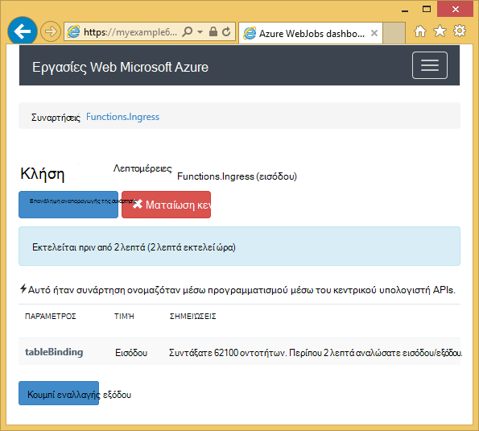
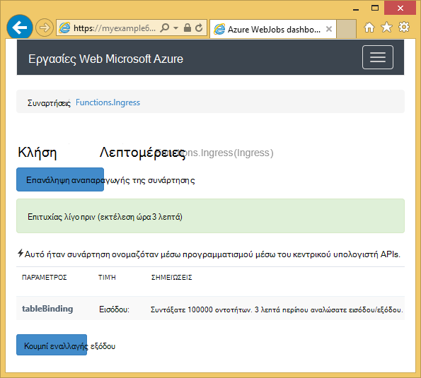

<properties 
    pageTitle="Πώς να χρησιμοποιείτε το χώρο αποθήκευσης πινάκων του Azure με το SDK WebJobs" 
    description="Μάθετε πώς να χρησιμοποιείτε το χώρο αποθήκευσης πινάκων του Azure με το SDK WebJobs. Δημιουργία πινάκων, προσθέστε οντοτήτων σε πίνακες και διαβάστε υπάρχοντες πίνακες." 
    services="app-service\web, storage" 
    documentationCenter=".net" 
    authors="tdykstra" 
    manager="wpickett" 
    editor="jimbe"/>

<tags 
    ms.service="app-service-web" 
    ms.workload="web" 
    ms.tgt_pltfrm="na" 
    ms.devlang="dotnet" 
    ms.topic="article" 
    ms.date="06/01/2016" 
    ms.author="tdykstra"/>

# Πώς να χρησιμοποιείτε το χώρο αποθήκευσης πινάκων του Azure με το SDK WebJobs

## Επισκόπηση

Αυτός ο οδηγός παρέχει C# δείγματα κώδικα που δείχνουν τον τρόπο ανάγνωσης και εγγραφής Azure χώρος αποθήκευσης πινάκων με χρήση του [WebJobs SDK](websites-dotnet-webjobs-sdk.md) έκδοση 1.x.

Ο οδηγός προϋποθέτει ότι γνωρίζετε [πώς μπορείτε να δημιουργήσετε ένα έργο WebJob στο Visual Studio με συμβολοσειρές σύνδεσης που οδηγούν στο λογαριασμό σας χώρο αποθήκευσης](websites-dotnet-webjobs-sdk-get-started.md) ή σε [πολλούς λογαριασμούς χώρου αποθήκευσης](https://github.com/Azure/azure-webjobs-sdk/blob/master/test/Microsoft.Azure.WebJobs.Host.EndToEndTests/MultipleStorageAccountsEndToEndTests.cs).
        
Ορισμένα από την προβολή τμημάτων κώδικα του `Table` χαρακτηριστικό που χρησιμοποιείται σε συναρτήσεις που [ονομάζεται με μη αυτόματο τρόπο](websites-dotnet-webjobs-sdk-storage-queues-how-to.md#manual), αυτό σημαίνει ότι δεν είναι χρησιμοποιώντας ένα από τα χαρακτηριστικά έναυσμα. 

## Πώς μπορείτε να προσθέσετε οντοτήτων σε πίνακα

Για να προσθέσετε οντοτήτων σε έναν πίνακα, χρησιμοποιήστε το `Table` χαρακτηριστικών με ένα `ICollector<T>` ή `IAsyncCollector<T>` παραμέτρου όπου `T` Καθορίζει το σχήμα των οντοτήτων που θέλετε να προσθέσετε. Η κατασκευή χαρακτηριστικού μεταφέρει παραμέτρου συμβολοσειράς που καθορίζει το όνομα του πίνακα. 

Το παρακάτω δείγμα κώδικα προσθέτει `Person` οντοτήτων σε έναν πίνακα με το όνομα *εισόδου*.

        [NoAutomaticTrigger]
        public static void IngressDemo(
            [Table("Ingress")] ICollector<Person> tableBinding)
        {
            for (int i = 0; i < 100000; i++)
            {
                tableBinding.Add(
                    new Person() { 
                        PartitionKey = "Test", 
                        RowKey = i.ToString(), 
                        Name = "Name" }
                    );
            }
        }

Συνήθως ο τύπος χρησιμοποιείτε με το `ICollector` προέρχεται από `TableEntity` ή υλοποιεί `ITableEntity`, αλλά δεν είναι απαραίτητο να. Ένα από τα εξής `Person` κλάδους εργασία με τον κωδικό που εμφανίζονται στην προηγούμενη `Ingress` μέθοδο.

        public class Person : TableEntity
        {
            public string Name { get; set; }
        }

        public class Person
        {
            public string PartitionKey { get; set; }
            public string RowKey { get; set; }
            public string Name { get; set; }
        }

Εάν θέλετε να εργαστείτε απευθείας με την αποθήκευση Azure API, μπορείτε να προσθέσετε μια `CloudStorageAccount` παραμέτρου στην υπογραφή μεθόδου.

## Παρακολούθηση σε πραγματικό χρόνο

Επειδή συναρτήσεις δεδομένων εισόδου διαδικασίας συχνά μεγάλους όγκους δεδομένων, τον πίνακα εργαλείων WebJobs SDK παρέχει δεδομένα σε πραγματικό χρόνο παρακολούθησης. Στην ενότητα **Ενεργοποίηση καταγραφής** σάς ενημερώνει εάν η συνάρτηση εκτελείται ακόμη.

Η σελίδα **Λεπτομέρειες κλήσης** αναφέρει την πρόοδο της συνάρτησης (αριθμός οντοτήτων γραμμένο) ενώ εκτελείται και σας δίνει την ευκαιρία να ματαιώσετε το. 

Όταν ολοκληρωθεί η συνάρτηση, τη σελίδα **Λεπτομερειών κλήση** αναφέρει τον αριθμό των γραμμών που έχουν εγγραφεί.

## Μάθετε πώς να διαβάζετε πολλών οντοτήτων από έναν πίνακα

Για να διαβάσετε έναν πίνακα, χρησιμοποιήστε το `Table` χαρακτηριστικών με ένα `IQueryable<T>` παραμέτρου όπου πληκτρολογείτε `T` προέρχεται από `TableEntity` ή υλοποιεί `ITableEntity`.

Το παρακάτω δείγμα κώδικα διαβάζει και καταγράφει όλες τις γραμμές από την `Ingress` πίνακα:
 
        public static void ReadTable(
            [Table("Ingress")] IQueryable<Person> tableBinding,
            TextWriter logger)
        {
            var query = from p in tableBinding select p;
            foreach (Person person in query)
            {
                logger.WriteLine("PK:{0}, RK:{1}, Name:{2}", 
                    person.PartitionKey, person.RowKey, person.Name);
            }
        }

### Μάθετε πώς να διαβάζετε μία οντότητα από έναν πίνακα

Υπάρχει μια `Table` κατασκευή χαρακτηριστικού με δύο πρόσθετες παραμέτρους που σας επιτρέπουν να καθορίσετε τα διαμερίσματα κλειδί και κλειδί γραμμής, όταν θέλετε να συνδέσετε με ένα ενιαίο πίνακα οντότητα.

Το παρακάτω δείγμα κώδικα διαβάζει μια γραμμή του πίνακα για μια `Person` οντότητα βάση partition κλειδί και γραμμή κλειδιού τιμές έχουν ληφθεί σε ένα μήνυμα ουρά:  

        public static void ReadTableEntity(
            [QueueTrigger("inputqueue")] Person personInQueue,
            [Table("persontable","{PartitionKey}", "{RowKey}")] Person personInTable,
            TextWriter logger)
        {
            if (personInTable == null)
            {
                logger.WriteLine("Person not found: PK:{0}, RK:{1}",
                        personInQueue.PartitionKey, personInQueue.RowKey);
            }
            else
            {
                logger.WriteLine("Person found: PK:{0}, RK:{1}, Name:{2}",
                        personInTable.PartitionKey, personInTable.RowKey, personInTable.Name);
            }
        }

Το `Person` κλάσης σε αυτό το παράδειγμα δεν διαθέτει για την υλοποίηση της `ITableEntity`.

## Πώς μπορείτε να χρησιμοποιήσετε το API αποθήκευσης .NET απευθείας για να εργαστείτε με έναν πίνακα

Μπορείτε επίσης να χρησιμοποιήσετε το `Table` χαρακτηριστικών με ένα `CloudTable` αντικειμένου για περισσότερη ευελιξία στο θέμα εργασία με έναν πίνακα.

Τον ακόλουθο κώδικα δείγμα χρησιμοποιεί μια `CloudTable` αντικειμένου για να προσθέσετε μία οντότητα στον πίνακα *εισόδου* . 
 
        public static void UseStorageAPI(
            [Table("Ingress")] CloudTable tableBinding,
            TextWriter logger)
        {
            var person = new Person()
                {
                    PartitionKey = "Test",
                    RowKey = "100",
                    Name = "Name"
                };
            TableOperation insertOperation = TableOperation.Insert(person);
            tableBinding.Execute(insertOperation);
        }

Για περισσότερες πληροφορίες σχετικά με τη χρήση του `CloudTable` αντικειμένου, ανατρέξτε στο θέμα [Πώς να χρησιμοποιείτε το χώρο αποθήκευσης πινάκων του από το .NET](../storage/storage-dotnet-how-to-use-tables.md). 

## Σχετικά θέματα που καλύπτονται από το άρθρο διαδικασιών ουρές

Για πληροφορίες σχετικά με τον τρόπο χειρισμού των ενεργοποίησε με ένα μήνυμα ουρά ή για σενάρια WebJobs SDK όχι συγκεκριμένα πίνακα επεξεργασίας, ανατρέξτε στο θέμα [Πώς να χρησιμοποιείτε το χώρο αποθήκευσης Azure ουρά με το SDK WebJobs](websites-dotnet-webjobs-sdk-storage-queues-how-to.md)επεξεργασία πίνακα. 

Θέματα που καλύπτονται σε αυτό το άρθρο περιλαμβάνουν τα εξής:

* Ασύγχρονων συναρτήσεων
* Πολλές παρουσίες
* Φυσιολογική τερματισμού
* Χρήση του WebJobs SDK χαρακτηριστικά στο σώμα μιας συνάρτησης
* Ορίστε τις συμβολοσειρές σύνδεσης SDK στον κώδικα
* Ορισμός τιμών για WebJobs SDK παραμέτρους κατασκευή στον κώδικα
* Ενεργοποίηση μιας συνάρτησης με μη αυτόματο τρόπο
* Γράψτε αρχείων καταγραφής

## Επόμενα βήματα

Αυτός ο οδηγός έχει παράσχει δείγματα κώδικα που δείχνουν τον τρόπο χειρισμού των συνηθισμένα σενάρια για την εργασία με πίνακες Azure. Για περισσότερες πληροφορίες σχετικά με τη χρήση Azure WebJobs και το SDK WebJobs, ανατρέξτε στο θέμα [Πόροι προτεινόμενα WebJobs Azure](http://go.microsoft.com/fwlink/?linkid=390226).
 
