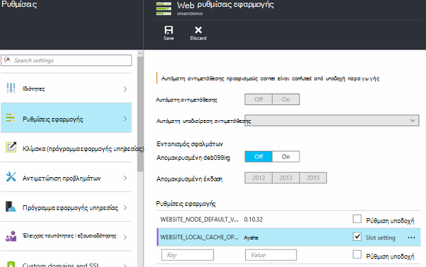

<properties
   pageTitle="Επισκόπηση Azure τοπικό Cache εφαρμογής υπηρεσίας | Microsoft Azure"
   description="Σε αυτό το άρθρο περιγράφει πώς μπορείτε να ενεργοποιήσετε, αλλαγή μεγέθους και την κατάσταση της δυνατότητας Azure εφαρμογής υπηρεσίας τοπικού Cache του ερωτήματος"
   services="app-service"
   documentationCenter="app-service"
   authors="SyntaxC4"
   manager="yochayk"
   editor=""
   tags="optional"
   keywords=""/>

<tags
   ms.service="app-service"
   ms.devlang="multiple"
   ms.topic="article"
   ms.tgt_pltfrm="na"
   ms.workload="na"
   ms.date="03/04/2016"
   ms.author="cfowler"/>

# <a name="azure-app-service-local-cache-overview"></a>Επισκόπηση Azure τοπικό Cache εφαρμογής υπηρεσίας

Περιεχόμενο του Azure web app είναι αποθηκευμένα στο χώρο αποθήκευσης Azure και είναι ολοκλήρωση της προετοιμασίας προς τα επάνω σε διαρκή, ως κοινόχρηστο περιεχόμενο. Αυτός ο σχεδιασμός προορίζεται για να εργαστείτε με μια ποικιλία εφαρμογών και περιλαμβάνει τα παρακάτω χαρακτηριστικά:  

* Το περιεχόμενο είναι κοινόχρηστο μεταξύ πολλών παρουσιών εικονική μηχανή (Εικονική) της εφαρμογής web.
* Το περιεχόμενο είναι διαρκή και μπορεί να τροποποιηθεί, εκτελώντας εφαρμογές web.
* Αρχεία καταγραφής διαγνωστικών αρχείων και δεδομένων είναι διαθέσιμες στην περιοχή στον ίδιο κοινόχρηστο φάκελο περιεχομένου.
* Δημοσίευση νέο περιεχόμενο απευθείας ενημερώνει ο φάκελος περιεχομένου. Μπορείτε να προβάλετε ακριβώς το ίδιο περιεχόμενο μέσω της τοποθεσίας Web SCM και της ενσωματωμένης εφαρμογής web (συνήθως ορισμένες τεχνολογίες, όπως ASP.NET προετοιμασία επανεκκίνηση εφαρμογής web σε ορισμένες αλλαγές αρχείου για να λάβετε το πιο πρόσφατο περιεχόμενο).

Ενώ πολλές εφαρμογές web, χρησιμοποιήστε μία ή όλες αυτές τις δυνατότητες, ορισμένες εφαρμογές web πρέπει απλώς ένα υψηλών επιδόσεων, μόνο για ανάγνωση περιεχομένου χώρο αποθήκευσης που που μπορούν να εκτελούν με υψηλή διαθεσιμότητα. Αυτές οι εφαρμογές μπορούν να επωφεληθούν από μια Εικονική παρουσία της ένα συγκεκριμένο τοπικό cache.

Η δυνατότητα Azure εφαρμογής υπηρεσίας τοπικού Cache παρέχει μια προβολή web ρόλο του περιεχομένου σας. Αυτό το περιεχόμενο είναι μια εγγραφή-αλλά-απόρριψη cache του περιεχομένου σας χώρου αποθήκευσης που δημιουργείται ασύγχρονα κατά την εκκίνηση της τοποθεσίας. Όταν το cache είναι έτοιμη, την τοποθεσία έχει αλλάξει για να εκτελέσετε σε σχέση με το περιεχόμενο στο cache. Οι εφαρμογές Web που εκτελούνται σε τοπικό Cache έχουν τα ακόλουθα πλεονεκτήματα:

* Αυτά, δεν επηρεάζονται σε των αδρανειών που προκύπτουν κατά την πρόσβαση σε περιεχόμενο στο χώρο αποθήκευσης Azure.
* Αυτά, δεν επηρεάζονται για να τις προγραμματισμένες αναβαθμίσεις ή μη προγραμματισμένη διακοπές λειτουργίας και τυχόν άλλες διακοπές με το χώρο αποθήκευσης Azure που προκύπτουν σε διακομιστές που εξυπηρετούν την κοινή χρήση περιεχομένου.
* Έχουν λιγότερα επανεκκίνηση του app λόγω αλλαγών κοινή χρήση του χώρου αποθήκευσης.

## <a name="how-local-cache-changes-the-behavior-of-app-service"></a>Πώς το τοπικό Cache αλλάζει τη συμπεριφορά της εφαρμογής υπηρεσίας

* Το τοπικό cache είναι ένα αντίγραφο των φακέλων /site και /siteextensions της εφαρμογής web. Δημιουργείται στην τοπική παρουσία Εικονική κατά την εκκίνηση εφαρμογής web. Το μέγεθος της τοπικής μνήμης cache ανά εφαρμογή web περιορίζεται στα 300 MB από προεπιλογή, αλλά μπορείτε να το αυξήσετε έως 1 GB.
* Το τοπικό cache είναι ανάγνωση και εγγραφή. Ωστόσο, οι τροποποιήσεις θα απορρίπτονται κατά την εφαρμογή web μετακινείται εικονικές μηχανές ή λαμβάνει την επανεκκίνηση. Δεν πρέπει να χρησιμοποιείτε το τοπικό Cache για τις εφαρμογές που αποθηκεύουν κρίσιμης σημασίας δεδομένα στο χώρο αποθήκευσης του περιεχομένου.
* Εφαρμογές Web να συνεχίσετε να γράψετε αρχεία καταγραφής και διαγνωστικών δεδομένων όπως εμφανίζονται τη συγκεκριμένη στιγμή. Αρχεία καταγραφής και τα δεδομένα, ωστόσο, αποθηκεύονται τοπικά στον η Εικονική. Στη συνέχεια, αντιγράφονται μέσω περιοδικά στο χώρο αποθήκευσης κοινόχρηστου περιεχομένου. Το αντίγραφο του κοινόχρηστου περιεχομένου χώρου αποθήκευσης είναι μια καλύτερης προσπάθειας--εγγραφής δημιουργεί αντίγραφο μπορεί να χαθούν προθεσμία για απότομη σφάλμα μια Εικονική παρουσίας.
* Υπάρχει μια αλλαγή στη δομή του φακέλου από τους φακέλους LogFiles και δεδομένων για τις εφαρμογές web που χρησιμοποιούν το τοπικό Cache. Τώρα υπάρχουν οι υποφάκελοι των φακέλων LogFiles και δεδομένων χώρου αποθήκευσης που ακολουθούν το μοτίβο ονομασίας "Μοναδικό αναγνωριστικό" + χρονική σήμανση. Κάθε έναν από τους υποφακέλους αντιστοιχεί σε μια παρουσία Εικονική όπου εκτελείται την εφαρμογή web ή να έχει εκτελεστεί.  
* Δημοσίευσης αλλαγές στην εφαρμογή web μέσω οποιονδήποτε από τους μηχανισμούς δημοσίευσης θα δημοσιεύσετε στο χώρο αποθήκευσης κοινόχρηστου περιεχομένου. Αυτό οφείλεται στη σχεδίαση επειδή θέλουμε το δημοσιευμένο περιεχόμενο να είναι διαρκή. Για να ανανεώσετε το τοπικό cache του web app, πρέπει να γίνει επανεκκίνηση. Το κάνει αυτό φαίνεται σαν ένα πλεονάζουσα βήμα; Για να κάνετε την κύκλου ζωής απρόσκοπτη, δείτε τις πληροφορίες παρακάτω σε αυτό το άρθρο.
* D:\Home θα οδηγεί το τοπικό cache. D:\local θα συνεχίσουν που δείχνει προς την προσωρινή αποθήκευση συγκεκριμένες Εικονική.
* Η προεπιλεγμένη προβολή περιεχομένου της τοποθεσίας SCM θα συνεχίσουν να είναι που του κοινόχρηστου περιεχομένου χώρου αποθήκευσης.

## <a name="enable-local-cache-in-app-service"></a>Ενεργοποίηση τοπικό Cache στην εφαρμογή υπηρεσίας

Ρύθμιση παραμέτρων του τοπικού Cache, χρησιμοποιώντας ένα συνδυασμό των ρυθμίσεων της εφαρμογής δεσμευμένη. Μπορείτε να ρυθμίσετε αυτές τις ρυθμίσεις εφαρμογής, χρησιμοποιώντας τις παρακάτω μεθόδους:

* [Πύλη του Azure](#Configure-Local-Cache-Portal)
* [Azure από διαχειριστή πόρων](#Configure-Local-Cache-ARM)

### <a name="configure-local-cache-by-using-the-azure-portal"></a>Ρύθμιση παραμέτρων του τοπικού Cache, χρησιμοποιώντας την πύλη του Azure
<a name="Configure-Local-Cache-Portal"></a>

Μπορείτε να ενεργοποιήσετε τοπικού Cache σε βάση ανά web-εφαρμογής χρησιμοποιώντας αυτήν τη ρύθμιση της εφαρμογής:`WEBSITE_LOCAL_CACHE_OPTION` = `Always`  



### <a name="configure-local-cache-by-using-azure-resource-manager"></a>Ρύθμιση παραμέτρων του τοπικού Cache χρησιμοποιώντας τη διαχείριση πόρων Azure
<a name="Configure-Local-Cache-ARM"></a>

```
...

{
    "apiVersion": "2015-08-01",
    "type": "config",
    "name": "appsettings",
    "dependsOn": [
        "[resourceId('Microsoft.Web/sites/', variables('siteName'))]"
    ],
    "properties": {
        "WEBSITE_LOCAL_CACHE_OPTION": "Always",
        "WEBSITE_LOCAL_CACHE_SIZEINMB": "300"
    }
}

...
```

## <a name="change-the-size-setting-in-local-cache"></a>Αλλάξτε τη ρύθμιση του μεγέθους στο τοπικό Cache

Από προεπιλογή, το μέγεθος του τοπικού cache είναι **300 MB**. Αυτό περιλαμβάνει το /site και /siteextensions φακέλους που έχουν αντιγραφεί από το χώρο αποθήκευσης περιεχομένου, καθώς και τυχόν τοπικά που έχουν δημιουργηθεί φακέλους αρχείων καταγραφής και δεδομένων. Για να αυξήσετε αυτό το όριο, χρησιμοποιήστε τη ρύθμιση εφαρμογής `WEBSITE_LOCAL_CACHE_SIZEINMB`. Μπορείτε να αυξήσετε το μέγεθος έως **1 GB** (1000 MB) ανά εφαρμογή web.

## <a name="best-practices-for-using-app-service-local-cache"></a>Βέλτιστες πρακτικές για τη χρήση του τοπικού Cache εφαρμογής υπηρεσίας

Συνιστάται να χρησιμοποιήσετε τοπικού Cache σε συνδυασμό με τη δυνατότητα [Περιβάλλοντα ενδιάμεσου σταδίου](../app-service-web/web-sites-staged-publishing.md) .

* Προσθέστε την _Αυτοκόλλητες_ ρύθμιση εφαρμογής `WEBSITE_LOCAL_CACHE_OPTION` με την τιμή `Always` για να σας υποδιαίρεση **παραγωγής** . Εάν χρησιμοποιείτε το `WEBSITE_LOCAL_CACHE_SIZEINMB`, επίσης να την προσθέσετε ως Αυτοκόλλητες τιμή για την υποδοχή παραγωγής.
* Δημιουργήστε μια υποδοχή **ενδιάμεσου σταδίου** και δημοσίευση για να σας υποδιαίρεση ενδιάμεσου σταδίου. Συνήθως δεν μπορείτε να ορίσετε την υποδοχή ενδιάμεσου σταδίου για να χρησιμοποιήσετε το τοπικό Cache για να ενεργοποιήσετε μια απρόσκοπτη κύκλου ζωής Δόμηση ανάπτυξη-έλεγχος για ενδιάμεσου Εάν λάβετε τα πλεονεκτήματα της τοπικής μνήμης Cache για την υποδοχή παραγωγής.
*   Δοκιμή της τοποθεσίας σας σε σχέση με την υποδοχή ενδιάμεσου σταδίου.  
*   Όταν είστε έτοιμοι, θεμάτων μια [λειτουργία κάνετε εναλλαγή](../app-service-web/web-sites-staged-publishing.md#to-swap-deployment-slots) μεταξύ του υποδοχές δημιουργίας σταδίων και παραγωγής.  
*   Αυτοκόλλητες ρυθμίσεις περιλαμβάνουν όνομα και Αυτοκόλλητες σε μια υποδοχή. Επομένως, όταν η εσοχή ενδιάμεσου σταδίου λαμβάνει Αντιμετάθεση σε παραγωγή, θα μεταβιβάζονται τις ρυθμίσεις εφαρμογής τοπικού Cache. Η εσοχή παραγωγής που μόλις εναλλαγής θα εκτελεστεί σε του τοπικού cache μετά από μερικά λεπτά και θα να προθερμαίνονται ως μέρος του warmup υποδιαίρεση μετά κάνετε εναλλαγή. Επομένως, όταν ολοκληρωθεί η αντιμετάθεσης υποδιαίρεση, σας υποδιαίρεση παραγωγής θα να εκτελείται σε σχέση με το τοπικό cache.

## <a name="frequently-asked-questions-faq"></a>Συνήθεις ερωτήσεις

### <a name="how-can-i-tell-if-local-cache-applies-to-my-web-app"></a>Πώς μπορώ να διαπιστώσω εάν ισχύουν τοπικού Cache για εφαρμογή μου web;

Εάν την εφαρμογή web της χρειάζεται υψηλών επιδόσεων, αξιόπιστη περιεχομένου χώρου αποθήκευσης, δεν χρησιμοποιεί το χώρο αποθήκευσης περιεχομένου για να γράψετε κρίσιμων δεδομένων κατά το χρόνο εκτέλεσης και είναι λιγότερο από 1 GB στο συνολικό μέγεθος, στη συνέχεια, η απάντηση είναι "Ναι"! Για να δείτε το συνολικό μέγεθος των φακέλων σας /site και /siteextensions, μπορείτε να χρησιμοποιήσετε την επέκταση τοποθεσιών "Χρήση δίσκου εφαρμογές Web Azure".  

### <a name="how-can-i-tell-if-my-site-has-switched-to-using-local-cache"></a>Πώς μπορώ να διαπιστώσω εάν έχει ενεργοποιηθεί η τοποθεσία μου με τη χρήση του τοπικού Cache;

Εάν χρησιμοποιείτε τη δυνατότητα τοπικού Cache με περιβάλλοντα ενδιάμεσου σταδίου, η λειτουργία αντιμετάθεσης δεν θα ολοκληρωθεί μέχρι να προθερμαίνονται τοπικού Cache. Για να ελέγξετε εάν η τοποθεσία σας εκτελείται σε σχέση με το τοπικό Cache, μπορείτε να ελέγξετε τη μεταβλητή περιβάλλοντος εργασίας διαδικασία `WEBSITE_LOCALCACHE_READY`. Χρησιμοποιήστε τις οδηγίες στη σελίδα [εργασίας μεταβλητή περιβάλλοντος διαδικασία](https://github.com/projectkudu/kudu/wiki/Process-Threads-list-and-minidump-gcdump-diagsession#process-environment-variable) για να αποκτήσετε πρόσβαση τη μεταβλητή περιβάλλοντος διαδικασία εργαζόμενου σε πολλές παρουσίες.  

### <a name="i-just-published-new-changes-but-my-web-app-does-not-seem-to-have-them-why"></a>Να δημοσιευτεί μόνο νέες αλλαγές, αλλά μου web app δεν φαίνεται να έχουν τους. Γιατί?

Εάν η εφαρμογή web της χρησιμοποιεί το τοπικό Cache, στη συνέχεια, πρέπει να επανεκκινήσετε την τοποθεσία σας για να λάβετε τις πιο πρόσφατες αλλαγές. Δεν θέλετε να δημοσιεύσετε τις αλλαγές σε μια τοποθεσία παραγωγής; Δείτε τις επιλογές εσοχή στην προηγούμενη ενότητα βέλτιστες πρακτικές.

### <a name="where-are-my-logs"></a>Πού βρίσκονται αρχείων καταγραφής μου;

Με το τοπικό Cache, τα αρχεία καταγραφής και οι φάκελοι δεδομένων εμφανίζονται λίγο διαφορετικά. Ωστόσο, οι τη δομή των υποφακέλων σας παραμένει το ίδιο, με τη διαφορά ότι οι υποφάκελοι είναι nestled στην περιοχή έναν υποφάκελο με τη μορφή "Μοναδικό Εικονική αναγνωριστικό" + χρονική σήμανση.

### <a name="i-have-local-cache-enabled-but-my-web-app-still-gets-restarted-why-is-that-i-thought-local-cache-helped-with-frequent-app-restarts"></a>Έχω ενεργοποιημένη τοπικό Cache, αλλά μου εφαρμογής web εξακολουθεί να λαμβάνει επανεκκίνηση του. Γιατί συμβαίνει αυτό; Να σκέψης τοπικού Cache βοήθησε με επανεκκίνηση του συχνές εφαρμογής.

Τοπικό Cache να αποτρέψετε την επανεκκίνηση του εφαρμογής web που σχετίζονται με το χώρο αποθήκευσης. Ωστόσο, εφαρμογή web της εξακολουθεί να μπορεί να υποβάλλονται σε επανεκκίνηση του κατά την προγραμματισμένη υποδομή αναβαθμίσεις του Εικονική. Το συνολικό επανεκκίνηση του εφαρμογής που αντιμετωπίζετε με ενεργοποιημένη τοπικό Cache πρέπει να είναι λιγότερα.
