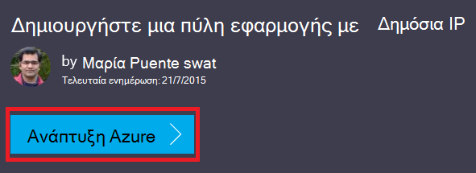

<properties
   pageTitle="Δημιουργήστε μια πύλη εφαρμογής, με τη χρήση προτύπων από διαχειριστή πόρων Azure | Microsoft Azure"
   description="Αυτή η σελίδα παρέχει οδηγίες για να δημιουργήσετε μια πύλη Azure εφαρμογής χρησιμοποιώντας το πρότυπο διαχείρισης πόρων Azure"
   documentationCenter="na"
   services="application-gateway"
   authors="georgewallace"
   manager="carmonm"
   editor="tysonn"/>
<tags
   ms.service="application-gateway"
   ms.devlang="na"
   ms.topic="article"
   ms.tgt_pltfrm="na"
   ms.workload="infrastructure-services"
   ms.date="10/25/2016"
   ms.author="gwallace"/>

# Δημιουργία μιας εφαρμογής πύλης χρησιμοποιώντας το πρότυπο διαχείρισης πόρων Azure

> [AZURE.SELECTOR]
- [Πύλη του Azure](application-gateway-create-gateway-portal.md)
- [Azure του PowerShell για τη διαχείριση πόρων](application-gateway-create-gateway-arm.md)
- [Azure κλασική PowerShell](application-gateway-create-gateway.md)
- [Azure προτύπου για τη διαχείριση πόρων](application-gateway-create-gateway-arm-template.md)
- [Azure CLI](application-gateway-create-gateway-cli.md)

Azure πύλη εφαρμογής είναι μια μονάδα εξισορρόπησης φόρτου επιπέδου-7. Παρέχει ανακατεύθυνση, δρομολόγησης επιδόσεων αιτήσεις HTTP ανάμεσα σε διαφορετικούς διακομιστές, είτε είναι στο cloud ή εσωτερικής εγκατάστασης. Πύλη εφαρμογής παρέχει πολλές δυνατότητες εφαρμογή παράδοσης ελεγκτή (ADC) συμπεριλαμβανομένων εξισορρόπηση φόρτου HTTP συσχέτισης βασίζεται σε cookie περιόδου λειτουργίας, Secure Sockets Layer (SSL) μείωση φόρτου, καθετήρες προσαρμοσμένο εύρυθμης λειτουργίας υποστήριξης για πολλούς τοποθεσίας και πολλά άλλα. Για να βρείτε μια πλήρη λίστα των υποστηριζόμενες δυνατότητες, επισκεφθείτε την [Επισκόπηση πύλης εφαρμογής](application-gateway-introduction.md)

Μάθετε πώς μπορείτε να κάνετε λήψη και τροποποίηση ενός υπάρχοντος προτύπου για τη διαχείριση πόρων Azure από GitHub και ανάπτυξη του προτύπου από το GitHub, PowerShell και το Azure CLI.

Εάν αναπτύσσετε απλώς το πρότυπο διαχείρισης πόρων Azure απευθείας από GitHub χωρίς αλλαγές, μεταβείτε στο ανάπτυξη προτύπου από GitHub.

## Σενάριο

Σε αυτό το σενάριο θα πρέπει:

- Δημιουργήστε μια πύλη εφαρμογής με δύο παρουσίες.
- Δημιουργήστε ένα εικονικό δίκτυο με το όνομα VirtualNetwork1 με ένα δεσμευμένο μπλοκ CIDR 10.0.0.0/16.
- Δημιουργήστε ένα δευτερεύον που ονομάζεται Appgatewaysubnet που χρησιμοποιεί 10.0.0.0/28 ως το μπλοκ CIDR.
- Ρύθμιση του δύο διαμορφώσατε προηγουμένως παρασκηνίου διευθύνσεις IP για τους διακομιστές web που θέλετε να φορτώσετε υπολοίπου την κυκλοφορία. Σε αυτό το παράδειγμα προτύπου, το διευθύνσεις IP του παρασκηνίου είναι 10.0.1.10 και 10.0.1.11.

>[AZURE.NOTE] Αυτές οι ρυθμίσεις είναι οι παράμετροι για αυτό το πρότυπο. Για να προσαρμόσετε το πρότυπο, μπορείτε να αλλάξετε τους κανόνες, το ακροατήριο και το SSL που ανοίγει το azuredeploy.json.

## Κάντε λήψη και να κατανοήσετε το πρότυπο διαχείρισης πόρων Azure

Μπορείτε να κάνετε λήψη του υπάρχοντος προτύπου για τη διαχείριση πόρων Azure για να δημιουργήσετε ένα εικονικό δίκτυο και δύο δευτερευόντων δικτύων από GitHub, κάντε τις αλλαγές που ενδέχεται να θέλετε και να το χρησιμοποιήσετε ξανά. Για να κάνετε αυτό, χρησιμοποιήστε τα παρακάτω βήματα:

1. Μεταβείτε στη [Δημιουργία πύλης εφαρμογής](https://github.com/Azure/azure-quickstart-templates/tree/master/101-application-gateway-create).
2. Κάντε κλικ στην επιλογή **azuredeploy.json**και, στη συνέχεια, κάντε κλικ στην επιλογή **ΠΡΏΤΕΣ**.
3. Αποθηκεύστε το αρχείο σε έναν τοπικό φάκελο στον υπολογιστή σας.
4. Εάν είστε εξοικειωμένοι με τη διαχείριση πόρων Azure πρότυπα, μεταβείτε στο βήμα 7.
5. Ανοίξτε το αρχείο που έχετε αποθηκεύσει και δείτε τα περιεχόμενα στην περιοχή **παράμετροι** στη γραμμή 5. Azure παραμέτρους προτύπου για τη διαχείριση πόρων παρέχουν ένα σύμβολο κράτησης θέσης για τις τιμές που μπορούν να συμπληρωθούν κατά την ανάπτυξη.

  	| Παράμετρος | Περιγραφή |
  	|---|---|
  	| **θέση** | Azure περιοχή όπου έχει δημιουργηθεί η πύλη εφαρμογής |
  	| **VirtualNetwork1** | Όνομα για το νέο δίκτυο εικονικού |
  	| **addressPrefix** | Ο χώρος διευθύνσεων για το εικονικό δίκτυο, σε μορφή CIDR |
  	| **ApplicationGatewaysubnet** | Όνομα για το υποδίκτυο πύλης εφαρμογής |
  	| **subnetPrefix** | Αποκλεισμός CIDR για το υποδίκτυο πύλης εφαρμογής |
  	| **skuname** | Μέγεθος παρουσία SKU |
  	| **χωρητικότητα** | Αριθμός των παρουσιών |
  	| **backendaddress1** | Διεύθυνση IP του πρώτου διακομιστή web |
  	| **backendaddress2** | Διεύθυνση IP του δεύτερου διακομιστή web |

    >[AZURE.IMPORTANT] Azure πρότυπα διαχείρισης πόρων διατηρούνται στις GitHub να αλλάξετε μέσα στο χρόνο. Βεβαιωθείτε ότι επιλέγετε το πρότυπο πριν να το χρησιμοποιήσετε.

6. Ελέγξτε το περιεχόμενο στο πλαίσιο **πόροι** και παρατηρήστε τα εξής:

    - **Τύπος**. Τύπος πόρου που δημιουργείται από το πρότυπο. Σε αυτήν την περίπτωση, ο τύπος είναι **Microsoft.Network/applicationGateways**, που αντιπροσωπεύει μια πύλη εφαρμογής.
    - **όνομα**. Όνομα για τον πόρο. Παρατηρήστε τη χρήση του **[parameters('applicationGatewayName')]**, γεγονός που σημαίνει ότι το όνομα παρέχεται ως είσοδο από εσάς ή από ένα αρχείο παραμέτρων κατά την ανάπτυξη.
    - **Ιδιότητες**. Λίστα των ιδιοτήτων για τον πόρο. Αυτό το πρότυπο χρησιμοποιεί το εικονικό δίκτυο και δημόσια διεύθυνση IP κατά τη δημιουργία της εφαρμογής πύλης.

7. Μεταβείτε στην [https://github.com/Azure/azure-quickstart-templates/blob/master/101-application-gateway-create/](https://github.com/Azure/azure-quickstart-templates/blob/master/101-application-gateway-create).
8. Κάντε κλικ στην επιλογή **azuredeploy paremeters.json**και, στη συνέχεια, κάντε κλικ στην επιλογή **ΠΡΏΤΕΣ**.
9. Αποθηκεύστε το αρχείο σε έναν τοπικό φάκελο στον υπολογιστή σας.
10. Ανοίξτε το αρχείο που έχετε αποθηκεύσει και να επεξεργαστείτε τις τιμές για τις παραμέτρους. Χρησιμοποιήστε τις παρακάτω τιμές για την ανάπτυξη της εφαρμογής πύλης περιγράφεται στο μας σενάριο.

        {
        "$schema": "http://schema.management.azure.com/schemas/2015-01-01/deploymentParameters.json#",
        {
        "location" : {
        "value" : "West US"
        },
        "addressPrefix": {
        "value": "10.0.0.0/16"
        },
        "subnetPrefix": {
        "value": "10.0.0.0/24"
        },
        "skuName": {
        "value": "Standard_Small"
        },
        "capacity": {
        "value": 2
        },
        "backendIpAddress1": {
        "value": "10.0.1.10"
        },
        "backendIpAddress2": {
        "value": "10.0.1.11"
        }
        }

11. Αποθηκεύστε το αρχείο. Μπορείτε να ελέγξετε το πρότυπο JSON και το πρότυπο παράμετρο χρησιμοποιώντας εργαλεία επικύρωσης online JSON όπως [JSlint.com](http://www.jslint.com/).

## Ανάπτυξη του προτύπου για τη διαχείριση πόρων Azure με χρήση του PowerShell

Εάν δεν έχετε χρησιμοποιήσει ποτέ Azure PowerShell, ανατρέξτε στο θέμα [Πώς να εγκαταστήσετε και να ρυθμίσετε τις παραμέτρους του PowerShell Azure](../powershell-install-configure.md) και ακολουθήστε τις οδηγίες για να συνδεθείτε στο Azure και επιλέξτε τη συνδρομή σας.

### Βήμα 1

    Login-AzureRmAccount

### Βήμα 2

Ελέγξτε τις συνδρομές για το λογαριασμό.

    Get-AzureRmSubscription

Θα σας ζητηθεί για τον έλεγχο ταυτότητας με τα διαπιστευτήριά σας.

### Βήμα 3

Επιλέξτε από το Azure όλες τις συνδρομές σας για να χρησιμοποιήσετε.

    Select-AzureRmSubscription -Subscriptionid "GUID of subscription"

### Βήμα 4

Εάν είναι απαραίτητο, δημιουργήστε μια ομάδα πόρων, χρησιμοποιώντας το cmdlet **New-AzureResourceGroup** . Στο παρακάτω παράδειγμα, μπορείτε να δημιουργήσετε μια ομάδα πόρων που ονομάζεται AppgatewayRG στη θέση Ανατολικής ΗΠΑ.

    New-AzureRmResourceGroup -Name AppgatewayRG -Location "East US"

Εκτελέστε το cmdlet **New-AzureRmResourceGroupDeployment** για να αναπτύξετε το νέο δίκτυο εικονικού χρησιμοποιώντας το προηγούμενο πρότυπο και παράμετρος αρχεία που έχουν ληφθεί και τροποποίηση.

    New-AzureRmResourceGroupDeployment -Name TestAppgatewayDeployment -ResourceGroupName AppgatewayRG `
        -TemplateFile C:\ARM\azuredeploy.json -TemplateParameterFile C:\ARM\azuredeploy-parameters.json

## Ανάπτυξη του προτύπου για τη διαχείριση πόρων Azure χρησιμοποιώντας το CLI Azure

Για να αναπτύξετε το πρότυπο διαχείρισης πόρων Azure που λάβατε με τη χρήση Azure CLI, ακολουθήστε τα παρακάτω βήματα:

### Βήμα 1

Εάν δεν έχετε χρησιμοποιήσει ποτέ Azure CLI, ανατρέξτε στο θέμα [εγκατάσταση και ρύθμιση παραμέτρων του Azure CLI](../xplat-cli-install.md) και ακολουθήστε τις οδηγίες μέχρι το σημείο όπου μπορείτε να επιλέξετε το Azure λογαριασμό και τη συνδρομή.

### Βήμα 2

Εκτελέστε την εντολή **λειτουργία azure ρύθμισης παραμέτρων** για να μεταβείτε σε λειτουργία διαχείρισης πόρων, όπως φαίνεται παρακάτω.

    azure config mode arm

Εδώ είναι το αναμενόμενο αποτέλεσμα για την παραπάνω εντολή:

    info:   New mode is arm

### Βήμα 3

Εάν είναι απαραίτητο, εκτελέστε την εντολή **Δημιουργία azure ομάδας** για να δημιουργήσετε μια νέα ομάδα πόρων, όπως φαίνεται παρακάτω. Παρατηρήστε ότι το αποτέλεσμα της εντολής. Στη λίστα που εμφανίζεται μετά την έξοδο εξηγεί τις παραμέτρους που χρησιμοποιούνται. Για περισσότερες πληροφορίες σχετικά με τις ομάδες πόρων, επισκεφθείτε την [Επισκόπηση της διαχείρισης πόρων Azure](../azure-resource-manager/resource-group-overview.md).

    azure group create -n appgatewayRG -l eastus

**-n (ή--όνομα)**. Όνομα για τη νέα ομάδα πόρων. Για το σενάριο, είναι *appgatewayRG*.

**-l (ή--θέση)**. Azure περιοχή όπου έχει δημιουργηθεί η νέα ομάδα πόρων. Για το σενάριο, είναι *eastus*.

### Βήμα 4

Εκτελέστε το cmdlet **Δημιουργία azure ομάδα ανάπτυξης** για να αναπτύξετε το νέο δίκτυο εικονικού χρησιμοποιώντας τα αρχεία προτύπου και η παράμετρος που έχουν ληφθεί και τροποποίησης παραπάνω. Στη λίστα που εμφανίζεται μετά την έξοδο εξηγεί τις παραμέτρους που χρησιμοποιούνται.

    azure group deployment create -g appgatewayRG -n TestAppgatewayDeployment -f C:\ARM\azuredeploy.json -e C:\ARM\azuredeploy-parameters.json

## Ανάπτυξη του προτύπου για τη διαχείριση πόρων Azure χρησιμοποιώντας κάντε κλικ στην επιλογή ανάπτυξη

Κάντε κλικ στην επιλογή ανάπτυξη είναι ένας άλλος τρόπος για να χρησιμοποιήσετε πρότυπα διαχείρισης πόρων Azure. Είναι ένας εύκολος τρόπος για να χρησιμοποιήσετε πρότυπα με την πύλη του Azure.

### Βήμα 1

Ανατρέξτε στο θέμα [Δημιουργία μια πύλη εφαρμογής με δημόσια IP](https://azure.microsoft.com/documentation/templates/101-application-gateway-public-ip/).

### Βήμα 2

Κάντε κλικ στην επιλογή **Ανάπτυξη Azure**.

### Βήμα 3

Συμπληρώστε τις παραμέτρους για το πρότυπο ανάπτυξης στην πύλη και κάντε κλικ στο κουμπί **OK**.

### Βήμα 4

Επιλέξτε **νομική τους όρους** και κάντε κλικ στην επιλογή **αγορά**.

### Βήμα 5

Στην blade ανάπτυξης την προσαρμοσμένη, κάντε κλικ στην επιλογή **Δημιουργία**.

## Επόμενα βήματα

Εάν θέλετε να ρυθμίσετε τις παραμέτρους μείωση φόρτου SSL, ανατρέξτε στο θέμα [Ρύθμιση παραμέτρων μια πύλη εφαρμογής για το SSL μείωση φόρτου](application-gateway-ssl.md).

Εάν θέλετε να ρυθμίσετε τις παραμέτρους μια πύλη εφαρμογής για χρήση με μια εσωτερική εξισορρόπηση φόρτου, ανατρέξτε στο θέμα [Δημιουργία μια πύλη εφαρμογής με μια εσωτερική εξισορρόπηση φόρτου (ILB)](application-gateway-ilb.md).

Εάν θέλετε περισσότερες πληροφορίες σχετικά με τη φόρτωση εξισορρόπησης επιλογές σε γενικές γραμμές, επισκεφθείτε:

- [Azure εξισορρόπηση φόρτου](https://azure.microsoft.com/documentation/services/load-balancer/)
- [Διαχείριση Azure κίνηση](https://azure.microsoft.com/documentation/services/traffic-manager/)
