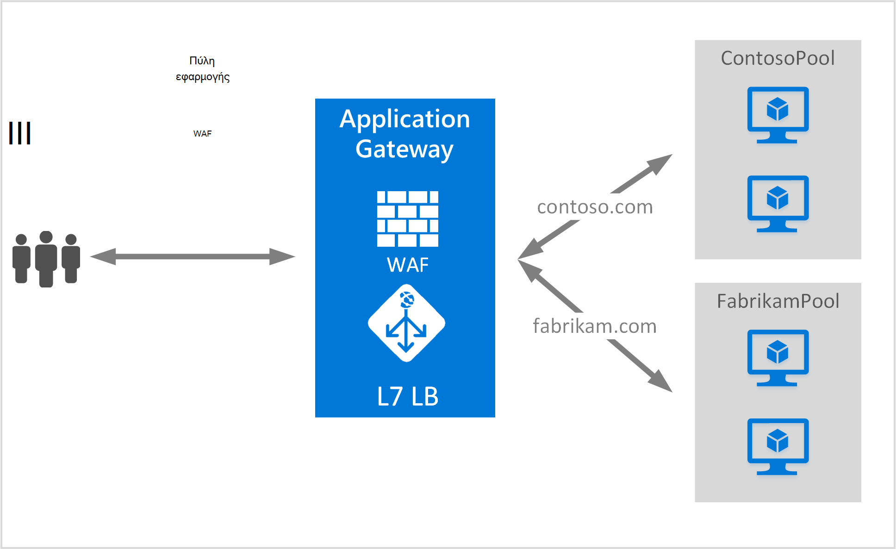

<properties
   pageTitle="Δημιουργία μιας εφαρμογής πύλης για τη φιλοξενία πολλών τοποθεσιών | Microsoft Azure"
   description="Αυτή η σελίδα παρέχει οδηγίες για να δημιουργήσετε, να ρυθμίσετε τις παραμέτρους μιας πύλης Azure εφαρμογών για τη φιλοξενία πολλές εφαρμογές web στην ίδια πύλη."
   documentationCenter="na"
   services="application-gateway"
   authors="amsriva"
   manager="rossort"
   editor="amsriva"/>
<tags
   ms.service="application-gateway"
   ms.devlang="na"
   ms.topic="article"
   ms.tgt_pltfrm="na"
   ms.workload="infrastructure-services"
   ms.date="10/25/2016"
   ms.author="amsriva"/>

# Δημιουργία μιας εφαρμογής πύλης για τη φιλοξενία πολλών εφαρμογών web

> [AZURE.SELECTOR]
- [Πύλη του Azure](application-gateway-create-multisite-portal.md)
- [Azure του PowerShell για τη διαχείριση πόρων](application-gateway-create-multisite-azureresourcemanager-powershell.md)

Πολλές φιλοξενίας τοποθεσίας σάς επιτρέπει να αναπτύξετε περισσότερες από μία εφαρμογής web στην ίδια πύλη εφαρμογής. Βασίζεται σε παρουσία της κεφαλίδας κεντρικού υπολογιστή στην εισερχόμενη αίτηση HTTP, για να προσδιορίσετε ποια ακρόασης θα λαμβάνει την κυκλοφορία. Το ακροατήριο, στη συνέχεια, κατευθύνει την κυκλοφορία στο κατάλληλο παρασκηνίου χώρου συγκέντρωσης όπως έχει ρυθμιστεί στον ορισμό κανόνες της πύλης. Στις εφαρμογές web δυνατότητα SSL, πύλη εφαρμογής εξαρτάται από την επέκταση ένδειξη όνομα διακομιστή (SNI) για να επιλέξετε τη σωστή λειτουργία ακρόασης για την κυκλοφορία web. Μια κοινή χρήση για τη φιλοξενία πολλών τοποθεσιών είναι η εξισορρόπηση αιτήσεων για τους τομείς διαφορετικό web σε διαφορετικό διακομιστή παρασκηνίου χώρους συγκέντρωσης. Ομοίως πολλούς δευτερεύοντες τομείς του ίδιου ριζικό τομέα μπορεί επίσης, να φιλοξενηθούν στην ίδια πύλη εφαρμογής.

## Σενάριο

Στο παρακάτω παράδειγμα, πύλη εφαρμογής σερβίρισμα κίνηση για contoso.com και fabrikam.com με δύο σύνολα διακομιστή υποστήριξης: contoso σύνολο διακομιστή και σύνολο διακομιστή fabrikam. Παρόμοια ρύθμισης μπορεί να χρησιμοποιηθεί για host δευτερεύοντες τομείς όπως app.contoso.com και blog.contoso.com.

## Πριν ξεκινήσετε

1. Εγκαταστήστε την πιο πρόσφατη έκδοση του τα cmdlet του Azure PowerShell χρησιμοποιώντας το πρόγραμμα εγκατάστασης πλατφόρμας Web. Μπορείτε να κάνετε λήψη και εγκατάσταση της πιο πρόσφατης έκδοσης από την ενότητα **Του Windows PowerShell** από τη [σελίδα λήψης](https://azure.microsoft.com/downloads/).
2. Πρέπει να υπάρχει τους διακομιστές που προσθέσατε στο χώρο συγκέντρωσης παρασκηνίου για να χρησιμοποιήσετε την πύλη εφαρμογής ή τα τελικά σημεία δημιουργήσετε είτε στο δίκτυο εικονικού σε ξεχωριστό υποδίκτυο ή με μια δημόσια στους οποίους έχουν ανατεθεί IP/VIP.

## Απαιτήσεις

- **Σύνολο διακομιστή παρασκηνίου:** Η λίστα διευθύνσεων IP των διακομιστών παρασκηνίου. Οι διευθύνσεις IP που παρατίθενται θα πρέπει να ανήκουν είτε στο υποδίκτυο εικονικού δικτύου ή πρέπει να είναι μια δημόσια IP/VIP. Μπορεί επίσης να χρησιμοποιηθεί FQDN.
- **Ρυθμίσεων χώρου συγκέντρωσης διακομιστή παρασκηνίου:** Κάθε χώρος συγκέντρωσης έχει ρυθμίσεις όπως θύρα πρωτόκολλο και βασίζονται σε cookie συνάφεια. Αυτές οι ρυθμίσεις είναι συνδεδεμένη με ένα χώρο συγκέντρωσης και εφαρμόζονται σε όλους τους διακομιστές εντός του χώρου συγκέντρωσης.
- **Προσκηνίου θύρας:** Αυτήν τη θύρα είναι η δημόσια θύρα που είναι δυνατό το άνοιγμα της εφαρμογής πύλης. Κίνηση επισκέψεις αυτήν τη θύρα και, στη συνέχεια, γίνεται ανακατεύθυνση σε έναν από τους διακομιστές παρασκηνίου.
- **Ακρόασης:** Το ακροατήριο διαθέτει προσκηνίου θύρα, ένα πρωτόκολλο (Http ή Https, αυτές οι τιμές διάκριση πεζών-κεφαλαίων), και το όνομα του πιστοποιητικού SSL (εάν τη ρύθμιση των παραμέτρων SSL μείωση φόρτου). Για πύλες εφαρμογής με δυνατότητα πολλών τοποθεσίας, όνομα κεντρικού υπολογιστή και δείκτες SNI προστίθενται.
- **Κανόνα:** Ο κανόνας συνδέει το ακροατήριο, το χώρο συγκέντρωσης server παρασκηνίου, και καθορίζει ποιο σύνολο διακομιστή παρασκηνίου την κυκλοφορία πρέπει να απευθύνονται όταν το επισκέψεις μιας συγκεκριμένης υπηρεσίας ακρόασης.

## Δημιουργήστε μια πύλη εφαρμογής

Ακολουθούν τα βήματα που απαιτούνται για να δημιουργήσετε μια πύλη εφαρμογής:

1. Δημιουργήστε μια ομάδα πόρων για διαχείριση πόρων.
2. Δημιουργήστε ένα εικονικό δίκτυο, δευτερεύοντα δίκτυα και δημόσια IP για την πύλη εφαρμογής.
3. Δημιουργήστε ένα αντικείμενο ρύθμισης παραμέτρων εφαρμογής πύλης.
4. Δημιουργήστε έναν πόρο πύλης εφαρμογής.

## Δημιουργία μιας ομάδας πόρων για διαχείριση πόρων

Βεβαιωθείτε ότι χρησιμοποιείτε την πιο πρόσφατη έκδοση του Azure PowerShell. Περισσότερες πληροφορίες είναι διαθέσιμες στη [Χρήση του Windows PowerShell με το διαχειριστή πόρων](../powershell-azure-resource-manager.md).

### Βήμα 1

Συνδεθείτε στο Azure

    Login-AzureRmAccount

Θα σας ζητηθεί για τον έλεγχο ταυτότητας με τα διαπιστευτήριά σας.

### Βήμα 2

Ελέγξτε τις συνδρομές για το λογαριασμό.

    Get-AzureRmSubscription

### Βήμα 3

Επιλέξτε από το Azure όλες τις συνδρομές σας για να χρησιμοποιήσετε.

    Select-AzureRmSubscription -SubscriptionName "Name of subscription"

### Βήμα 4

Δημιουργήστε μια ομάδα πόρων (παράλειψη αυτό το βήμα εάν χρησιμοποιείτε μια υπάρχουσα ομάδα πόρων).

    New-AzureRmResourceGroup -Name appgw-RG -location "West US"

Εναλλακτικά μπορείτε επίσης να δημιουργήσετε ετικέτες για μια ομάδα πόρων για την πύλη εφαρμογής:

    $resourceGroup = New-AzureRmResourceGroup -Name appgw-RG -Location "West US" -Tags @{Name = "testtag"; Value = "Application Gateway multiple site"}

Azure διαχείριση πόρων απαιτεί όλων των ομάδων πόρων καθορίσετε μια θέση. Αυτή η θέση χρησιμοποιείται ως την προεπιλεγμένη θέση για τους πόρους σε αυτήν την ομάδα πόρων. Βεβαιωθείτε ότι όλες οι εντολές για να δημιουργήσετε μια πύλη εφαρμογής χρησιμοποιούν την ίδια ομάδα πόρων.

Στο παραπάνω παράδειγμα, που δημιουργήσαμε μια ομάδα πόρων που ονομάζεται "appgw-RG" με μια θέση "Δυτική εμάς".

>[AZURE.NOTE] Εάν θέλετε να ρυθμίσετε τις παραμέτρους ενός προσαρμοσμένου δοκιμή του για την πύλη εφαρμογή, ανατρέξτε στο θέμα [Δημιουργία μια πύλη εφαρμογής με προσαρμοσμένο καθετήρες με χρήση του PowerShell](application-gateway-create-probe-ps.md). Επισκεφθείτε [προσαρμοσμένο καθετήρες και τον έλεγχο εύρυθμης λειτουργίας](application-gateway-probe-overview.md) για περισσότερες πληροφορίες.

## Δημιουργήστε ένα εικονικό δίκτυο και δευτερεύοντα δίκτυα

Το παρακάτω παράδειγμα δείχνει πώς μπορείτε να δημιουργήσετε ένα εικονικό δίκτυο χρησιμοποιώντας τη διαχείριση πόρων. Δύο δευτερευόντων δικτύων δημιουργούνται σε αυτό το βήμα. Το πρώτο υποδίκτυο είναι για την πύλη εφαρμογής ίδια. Πύλη εφαρμογής απαιτεί ξεχωριστή υποδίκτυο, να κρατήστε πατημένο το πλήκτρο τις παρουσίες. Σε αυτό το δευτερεύον δίκτυο, μπορούν να αναπτυχθούν μόνο άλλες πύλες εφαρμογής. Το δεύτερο υποδίκτυο χρησιμοποιείται για τη διατήρηση τους διακομιστές παρασκηνίου.

### Βήμα 1

Εκχωρήστε το 10.0.0.0/24 περιοχής διευθύνσεων στη μεταβλητή υποδικτύου που θα χρησιμοποιηθεί για τη διατήρηση της εφαρμογής πύλης.

    $subnet = New-AzureRmVirtualNetworkSubnetConfig -Name appgatewaysubnet -AddressPrefix 10.0.0.0/24

### Βήμα 2

Εκχωρήστε το 10.0.1.0/24 περιοχής διευθύνσεων στη μεταβλητή subnet2 που θα χρησιμοποιηθεί για τους χώρους συγκέντρωσης παρασκηνίου.

    $subnet2 = New-AzureRmVirtualNetworkSubnetConfig -Name backendsubnet -AddressPrefix 10.0.1.0/24

### Βήμα 3

Δημιουργήστε ένα εικονικό δίκτυο με το όνομα "appgwvnet" στο πόρου ομάδας "appgw-rg" για την περιοχή Δυτική η.π.α., χρησιμοποιώντας το πρόθεμα 10.0.0.0/16 με 10.0.0.0/24 υποδίκτυο, και 10.0.1.0/24.

    $vnet = New-AzureRmVirtualNetwork -Name appgwvnet -ResourceGroupName appgw-RG -Location "West US" -AddressPrefix 10.0.0.0/16 -Subnet $subnet,$subnet2

### Βήμα 4

Εκχωρήστε μια μεταβλητή υποδικτύου για τα επόμενα βήματα, τα οποία δημιουργεί μια πύλη εφαρμογής.

    $appgatewaysubnet = Get-AzureRmVirtualNetworkSubnetConfig -Name appgatewaysubnet -VirtualNetwork $vnet
    $backendsubnet = Get-AzureRmVirtualNetworkSubnetConfig -Name backendsubnet -VirtualNetwork $vnet

## Δημιουργήστε μια δημόσια διεύθυνση IP για τη ρύθμιση παραμέτρων του περιβάλλοντος χρήστη

Δημιουργία δημόσιας πόρου IP "publicIP01" πόρου ομάδας "appgw-rg" για την περιοχή Δυτική ΗΠΑ.

    $publicip = New-AzureRmPublicIpAddress -ResourceGroupName appgw-RG -name publicIP01 -location "West US" -AllocationMethod Dynamic

Μια διεύθυνση IP αντιστοιχίζεται στην πύλη εφαρμογή κατά την εκκίνηση της υπηρεσίας.

## Δημιουργία εφαρμογής ρύθμισης παραμέτρων πύλης

Πρέπει να ρυθμίσετε όλα τα στοιχεία ρύθμισης παραμέτρων πριν από τη δημιουργία της εφαρμογής πύλης. Ακολουθήστε τα παρακάτω βήματα Δημιουργήστε τα στοιχεία ρύθμισης παραμέτρων που απαιτούνται για έναν πόρο πύλης εφαρμογής.

### Βήμα 1

Δημιουργήστε μια ρύθμιση IP πύλης εφαρμογή με το όνομα "gatewayIP01". Κατά την εκκίνηση εφαρμογών πύλης, παίρνει μια διεύθυνση IP από το υποδίκτυο έχει ρυθμιστεί και δρομολογείτε την κίνηση δικτύου στις διευθύνσεις IP στο χώρο συγκέντρωσης IP παρασκηνίου. Λάβετε υπόψη ότι κάθε παρουσία λαμβάνει μια διεύθυνση IP.

    $gipconfig = New-AzureRmApplicationGatewayIPConfiguration -Name gatewayIP01 -Subnet $appgatewaysubnet

### Βήμα 2

Ρύθμιση παραμέτρων το σύνολο διευθύνσεων IP παρασκηνίου με το όνομα "pool01" και "pool2" με διευθύνσεις IP "10.0.1.100, 10.0.1.101,10.0.1.102" για "pool1" και "10.0.1.103, 10.0.1.104, 10.0.1.105" για "pool2".

    $pool1 = New-AzureRmApplicationGatewayBackendAddressPool -Name pool01 -BackendIPAddresses 10.0.1.100, 10.0.1.101, 10.0.1.102
    $pool2 = New-AzureRmApplicationGatewayBackendAddressPool -Name pool02 -BackendIPAddresses 10.0.1.103, 10.0.1.104, 10.0.1.105

Σε αυτό το παράδειγμα, υπάρχουν δύο σύνολα παρασκηνίου για να δρομολογήσετε την κίνηση του δικτύου με βάση την απαιτούμενη τοποθεσία. Ένα χώρο συγκέντρωσης λαμβάνει την κυκλοφορία από την τοποθεσία "contoso.com" και άλλα χώρου συγκέντρωσης λαμβάνει την κυκλοφορία από την τοποθεσία "fabrikam.com". Πρέπει να αντικαταστήσετε το προηγούμενο διευθύνσεις IP για να προσθέσετε τη δική σας διεύθυνση IP εφαρμογής τα τελικά σημεία. Στη θέση εσωτερικές διευθύνσεις IP, μπορείτε επίσης να χρησιμοποιήσετε δημόσιες διευθύνσεις IP, FQDN ή μια Εικονική NIC για παρουσίες παρασκηνίου. Χρήση "-BackendFQDNs" παραμέτρου σε PowerShell για να καθορίσετε FQDN αντί για διευθύνσεις IP.

### Βήμα 3

Ρύθμιση παραμέτρων εφαρμογής πύλης τη ρύθμιση "poolsetting01" και "poolsetting02" για την κίνηση δικτύου εξισορρόπηση φόρτου στο χώρο συγκέντρωσης παρασκηνίου. Σε αυτό το παράδειγμα, μπορείτε να ρυθμίσετε παραμέτρους διαφορετικό χώρο συγκέντρωσης παρασκηνίου για τα σύνολα παρασκηνίου. Κάθε σύνολο παρασκηνίου μπορεί να έχει το δικό της ρύθμιση χώρου συγκέντρωσης παρασκηνίου.

    $poolSetting01 = New-AzureRmApplicationGatewayBackendHttpSettings -Name "besetting01" -Port 80 -Protocol Http -CookieBasedAffinity Disabled -RequestTimeout 120
    $poolSetting02 = New-AzureRmApplicationGatewayBackendHttpSettings -Name "besetting02" -Port 80 -Protocol Http -CookieBasedAffinity Enabled -RequestTimeout 240

### Βήμα 4

Ρύθμιση παραμέτρων του προσκηνίου IP με δημόσια τελικού σημείου διευθύνσεων IP.

    $fipconfig01 = New-AzureRmApplicationGatewayFrontendIPConfig -Name "frontend1" -PublicIPAddress $publicip

### Βήμα 5

Ρυθμίστε τις παραμέτρους της θύρας προσκηνίου για μια πύλη εφαρμογής.

    $fp01 = New-AzureRmApplicationGatewayFrontendPort -Name "fep01" -Port 443

### Βήμα 6

Ρύθμιση παραμέτρων δύο πιστοποιητικά SSL για τις δύο τοποθεσίες Web, πρόκειται για την υποστήριξη σε αυτό το παράδειγμα. Είναι ένα πιστοποιητικό για την κίνηση contoso.com και το άλλο είναι για την κίνηση fabrikam.com. Αυτά τα πιστοποιητικά πρέπει να είναι μια αρχή έκδοσης πιστοποιητικών που εκδίδονται πιστοποιητικών για τις τοποθεσίες Web. Πιστοποιητικά αυτόματης υπογραφής είναι υποστηρίζονται, αλλά δεν συνιστάται για την κίνηση παραγωγής.

    $cert01 = New-AzureRmApplicationGatewaySslCertificate -Name contosocert -CertificateFile <file path> -Password <password>
    $cert02 = New-AzureRmApplicationGatewaySslCertificate -Name fabrikamcert -CertificateFile <file path> -Password <password>

### Βήμα 7

Σε αυτό το παράδειγμα, ρυθμίστε τις παραμέτρους δύο ακροατών για τις δύο τοποθεσίες web. Αυτό το βήμα ρυθμίζει τις παραμέτρους του ακροατών για δημόσια διεύθυνση IP, θύρας και χρησιμοποιείται για τη λήψη εισερχόμενη κυκλοφορία κεντρικού υπολογιστή. Όνομα κεντρικού υπολογιστή παράμετρος είναι απαραίτητη για την υποστήριξη πολλών τοποθεσιών και πρέπει να έχει οριστεί στην κατάλληλη τοποθεσία Web για την οποία έχει λάβει την κυκλοφορία. Η παράμετρος RequireServerNameIndication πρέπει να οριστεί σε true για τοποθεσίες Web που χρειάζεστε υποστήριξη για το SSL σε σενάριο πολλών κεντρικού υπολογιστή. Εάν απαιτείται υποστήριξη SSL, πρέπει επίσης να καθορίσετε το πιστοποιητικό SSL που χρησιμοποιείται για την ασφάλιση κίνηση για αυτήν την εφαρμογή web. Ο συνδυασμός FrontendIPConfiguration, FrontendPort και όνομα κεντρικού υπολογιστή πρέπει να είναι μοναδικό σε μια υπηρεσία ακρόασης. Κάθε πρόγραμμα ακρόασης μπορούν να υποστηρίξουν ένα πιστοποιητικό.

    $listener01 = New-AzureRmApplicationGatewayHttpListener -Name "listener01" -Protocol Https -FrontendIPConfiguration $fipconfig01 -FrontendPort $fp01 -HostName "contoso11.com" -RequireServerNameIndication true  -SslCertificate $cert01
    $listener02 = New-AzureRmApplicationGatewayHttpListener -Name "listener02" -Protocol Https -FrontendIPConfiguration $fipconfig01 -FrontendPort $fp01 -HostName "fabrikam11.com" -RequireServerNameIndication true -SslCertificate $cert02

### Βήμα 8

Δημιουργήστε δύο ρύθμιση κανόνα για τις εφαρμογές web δύο σε αυτό το παράδειγμα. Ένας κανόνας συνδέει μαζί ακροατών, χώρους συγκέντρωσης παρασκηνίου και ρυθμίσεις http. Αυτό το βήμα ρυθμίζει τις παραμέτρους της πύλης εφαρμογής για να χρησιμοποιήσετε βασικές κανόνα δρομολόγησης, μία για κάθε τοποθεσία Web. Κίνηση σε κάθε τοποθεσία Web λαμβάνεται από τη ρύθμιση παραμέτρων ακρόασης και, στη συνέχεια, κατευθύνεται ο χώρος συγκέντρωσης έχει ρυθμιστεί παρασκηνίου, χρησιμοποιώντας τις ιδιότητες που καθορίζονται σε το BackendHttpSettings.

    $rule01 = New-AzureRmApplicationGatewayRequestRoutingRule -Name "rule01" -RuleType Basic -HttpListener $listener01 -BackendHttpSettings $poolSetting01 -BackendAddressPool $pool1
    $rule02 = New-AzureRmApplicationGatewayRequestRoutingRule -Name "rule02" -RuleType Basic -HttpListener $listener02 -BackendHttpSettings $poolSetting02 -BackendAddressPool $pool2

### Βήμα 9

Ρυθμίστε τις παραμέτρους του αριθμού των παρουσιών και μέγεθος για την πύλη εφαρμογής.

    $sku = New-AzureRmApplicationGatewaySku -Name "Standard_Medium" -Tier Standard -Capacity 2

## Δημιουργία εφαρμογής πύλης

Δημιουργήστε μια πύλη εφαρμογής με όλα τα αντικείμενα ρύθμισης παραμέτρων από τα προηγούμενα βήματα.

    $appgw = New-AzureRmApplicationGateway -Name appgwtest -ResourceGroupName appgw-RG -Location "West US" -BackendAddressPools $pool1,$pool2 -BackendHttpSettingsCollection $poolSetting01, $poolSetting02 -FrontendIpConfigurations $fipconfig01 -GatewayIpConfigurations $gipconfig -FrontendPorts $fp01 -HttpListeners $listener01, $listener02 -RequestRoutingRules $rule01, $rule02 -Sku $sku -SslCertificates $cert01, $cert02

>[AZURE.IMPORTANT] Παροχή πύλης εφαρμογών είναι μια λειτουργία μεγάλης διάρκειας και ενδέχεται να χρειαστεί κάποιος χρόνος για να ολοκληρωθεί.

## Λήψη εφαρμογής όνομα DNS πύλης

Όταν δημιουργηθεί η πύλη, το επόμενο βήμα είναι να ρυθμίσετε τις παραμέτρους του υπολογιστή-πελάτη για την επικοινωνία. Όταν χρησιμοποιείτε μια δημόσια IP, πύλη εφαρμογής απαιτεί μια δυναμική αντιστοίχιση όνομα DNS, το οποίο δεν είναι φιλική. Για να τοποθετήστε το δείκτη στο δημόσιο τελικό σημείο της εφαρμογής πύλης μπορεί να χρησιμοποιηθεί για να βεβαιωθείτε ότι οι τελικοί χρήστες μπορούν να πατήσετε την πύλη εφαρμογής μια εγγραφή CNAME. [Ρύθμιση των παραμέτρων ενός προσαρμοσμένου ονόματος τομέα για στο Azure](../cloud-services/cloud-services-custom-domain-name-portal.md). Για να κάνετε αυτό, ανακτήσετε λεπτομέρειες σχετικά με την πύλη εφαρμογής και το σχετικό όνομα IP/DNS χρησιμοποιώντας το στοιχείο PublicIPAddress που συνδέονται με την πύλη εφαρμογής. Το όνομα της πύλης εφαρμογή DNS πρέπει να χρησιμοποιείται για να δημιουργήσετε μια εγγραφή CNAME, το οποίο δείχνει τις εφαρμογές web δύο σε αυτό το όνομα DNS. Η χρήση των εγγραφών A δεν συνιστάται, επειδή το VIP ενδέχεται να αλλάξουν κατά την επανεκκίνηση της εφαρμογής πύλης.
    
    Get-AzureRmPublicIpAddress -ResourceGroupName appgw-RG -Name publicIP01
        
    Name                     : publicIP01
    ResourceGroupName        : appgw-RG
    Location                 : westus
    Id                       : /subscriptions/<subscription_id>/resourceGroups/appgw-RG/providers/Microsoft.Network/publicIPAddresses/publicIP01
    Etag                     : W/"00000d5b-54ed-4907-bae8-99bd5766d0e5"
    ResourceGuid             : 00000000-0000-0000-0000-000000000000
    ProvisioningState        : Succeeded
    Tags                     : 
    PublicIpAllocationMethod : Dynamic
    IpAddress                : xx.xx.xxx.xx
    PublicIpAddressVersion   : IPv4
    IdleTimeoutInMinutes     : 4
    IpConfiguration          : {
                                 "Id": "/subscriptions/<subscription_id>/resourceGroups/appgw-RG/providers/Microsoft.Network/applicationGateways/appgwtest/frontendIP
                               Configurations/frontend1"
                               }
    DnsSettings              : {
                                 "Fqdn": "00000000-0000-xxxx-xxxx-xxxxxxxxxxxx.cloudapp.net"
                               }

## Επόμενα βήματα

Μάθετε πώς να προστατεύσετε τις τοποθεσίες Web με την [Πύλη εφαρμογής - τείχος προστασίας εφαρμογής Web](application-gateway-webapplicationfirewall-overview.md)