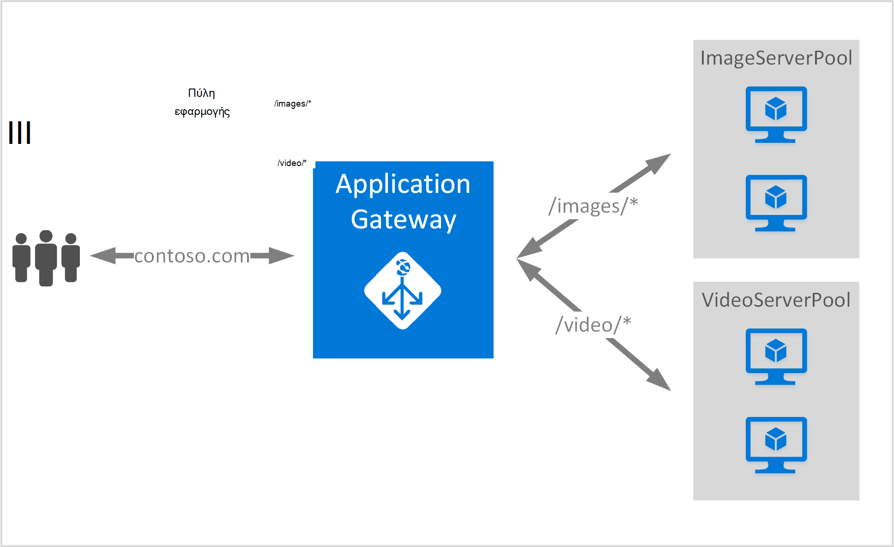

<properties
   pageTitle="Δημιουργήστε μια πύλη εφαρμογής με τη χρήση κανόνων δρομολόγησης διεύθυνση URL | Microsoft Azure"
   description="Αυτή η σελίδα παρέχει οδηγίες για να δημιουργήσετε, να ρυθμίσετε τις παραμέτρους μιας πύλης Azure εφαρμογή με τη χρήση κανόνων δρομολόγησης διεύθυνσης URL"
   documentationCenter="na"
   services="application-gateway"
   authors="georgewallace"
   manager="jdial"
   editor="tysonn"/>
<tags
   ms.service="application-gateway"
   ms.devlang="na"
   ms.topic="article"
   ms.tgt_pltfrm="na"
   ms.workload="infrastructure-services"
   ms.date="10/25/2016"
   ms.author="gwallace"/>

# Δημιουργήστε μια πύλη εφαρμογής χρησιμοποιώντας διαδρομή με βάση τη δρομολόγηση 

> [AZURE.SELECTOR]
- [Πύλη του Azure](application-gateway-create-url-route-portal.md)
- [Azure του PowerShell για τη διαχείριση πόρων](application-gateway-create-url-route-arm-ps.md)

Διεύθυνση URL διαδρομή με βάση τη δρομολόγηση σάς επιτρέπει να συσχετίσετε διαδρομές με βάση τη διαδρομή URL του αίτηση Http. Το ελέγχει εάν υπάρχει μια διαδρομή σε ένα χώρο συγκέντρωσης παρασκηνίου ρυθμίσει τις παραμέτρους για τις λίστες διεύθυνση URL στη πύλη εφαρμογής και στείλτε την κίνηση δικτύου για το καθορισμένο χώρο συγκέντρωσης παρασκηνίου. Μια κοινή χρήση για τη δρομολόγηση βασίζεται σε διεύθυνση URL είναι η εξισορρόπηση αιτήσεων για διαφορετικούς τύπους περιεχομένου σε διαφορετικό διακομιστή παρασκηνίου χώρους συγκέντρωσης.

Διεύθυνση URL με βάση τη δρομολόγηση παρουσιάζει έναν νέο τύπο κανόνα για να πύλη εφαρμογής. Πύλη εφαρμογής διαθέτει δύο τύπους κανόνα: βασικές και PathBasedRouting. Τύπος κανόνα βασικές παρέχει round robin υπηρεσίας για τους χώρους συγκέντρωσης παρασκηνίου κατά PathBasedRouting εκτός από την κατανομή round robin, λαμβάνει επίσης μοτίβο διαδρομή της διεύθυνσης URL της αίτησης υπόψη κατά την επιλογή του χώρου συγκέντρωσης παρασκηνίου.

>[AZURE.IMPORTANT] PathPattern: Η λίστα των μοτίβα διαδρομή ώστε να ταιριάζει με. Κάθε πρέπει να ξεκινά με / και τη θέση στην μόνο ένα "\*" επιτρέπεται βρίσκεται στο τέλος. Παραδείγματα έγκυρη είναι /xyz, /xyz* ή /xyz/*. Η συμβολοσειρά τροφοδοσία για τη διαδρομή matcher δεν περιλαμβάνει κείμενο μετά την πρώτη ";" ή "#" και οι χαρακτήρες δεν επιτρέπεται. 

## Σενάριο
Στο παρακάτω παράδειγμα, πύλη εφαρμογής σερβίρισμα κίνηση για contoso.com με δύο σύνολα διακομιστή υποστήριξης: σύνολο βίντεο διακομιστή και σύνολο διακομιστή εικόνα.

Οι αιτήσεις για http://contoso.com/image* δρομολογούνται στο χώρο συγκέντρωσης server (pool1), εικόνα και http://contoso.com/video* δρομολογούνται σύνολο βίντεο διακομιστή (pool2). Ένα προεπιλεγμένο χώρο συγκέντρωσης διακομιστή (pool1) είναι επιλεγμένο, εάν κανένα από τα μοτίβα διαδρομή συμφωνούν.

## Πριν ξεκινήσετε

1. Εγκαταστήστε την πιο πρόσφατη έκδοση του τα cmdlet του Azure PowerShell χρησιμοποιώντας το πρόγραμμα εγκατάστασης πλατφόρμας Web. Μπορείτε να κάνετε λήψη και εγκατάσταση της πιο πρόσφατης έκδοσης από την ενότητα **Του Windows PowerShell** από τη [σελίδα λήψης](https://azure.microsoft.com/downloads/).
2. Μπορείτε να δημιουργήσετε μια εικονική δικτύου και το δευτερεύον για πύλη εφαρμογής. Βεβαιωθείτε ότι δεν υπάρχουν εικονικές μηχανές ή αναπτύξεις cloud χρησιμοποιούν το υποδίκτυο. Η πύλη εφαρμογής πρέπει να είναι μόνη ένα υποδίκτυο εικονικού δικτύου.
3. Πρέπει να υπάρχει τους διακομιστές που προσθέσατε στο χώρο συγκέντρωσης παρασκηνίου για να χρησιμοποιήσετε την πύλη εφαρμογής ή τα τελικά σημεία δημιουργήσατε στο το εικονικό δίκτυο ή με μια δημόσια στους οποίους έχουν ανατεθεί IP/VIP.

## Τι θα πρέπει να δημιουργήσει μια πύλη εφαρμογής;

- **Σύνολο διακομιστή παρασκηνίου:** Η λίστα διευθύνσεων IP των διακομιστών παρασκηνίου. Οι διευθύνσεις IP που παρατίθενται θα πρέπει να ανήκουν είτε στο υποδίκτυο εικονικού δικτύου ή πρέπει να είναι μια δημόσια IP/VIP.
- **Ρυθμίσεων χώρου συγκέντρωσης διακομιστή παρασκηνίου:** Κάθε χώρος συγκέντρωσης έχει ρυθμίσεις όπως θύρα, το πρωτόκολλο και βασίζονται σε cookie συσχέτισης. Αυτές οι ρυθμίσεις είναι συνδεδεμένη με ένα χώρο συγκέντρωσης και εφαρμόζονται σε όλους τους διακομιστές εντός του χώρου συγκέντρωσης.
- **Προσκηνίου θύρας:** Αυτήν τη θύρα είναι η δημόσια θύρα που είναι δυνατό το άνοιγμα της εφαρμογής πύλης. Κίνηση επισκέψεις αυτήν τη θύρα και, στη συνέχεια, γίνεται ανακατεύθυνση σε έναν από τους διακομιστές παρασκηνίου.
- **Ακρόασης:** Η ακρόαση διαθέτει προσκηνίου θύρα, ένα πρωτόκολλο (Http ή Https, αυτοί είναι διάκριση πεζών-κεφαλαίων), και το όνομα του πιστοποιητικού SSL (εάν τη ρύθμιση των παραμέτρων SSL μείωση φόρτου).
- **Κανόνα:** Ο κανόνας συνδέει το ακροατήριο, το χώρο συγκέντρωσης server παρασκηνίου και καθορίζει ποιο σύνολο διακομιστή παρασκηνίου την κυκλοφορία πρέπει να απευθύνονται όταν το επισκέψεις μιας συγκεκριμένης υπηρεσίας ακρόασης.

## Δημιουργήστε μια πύλη εφαρμογής

Η διαφορά μεταξύ της χρήσης κλασική Azure και διαχείριση πόρων Azure είναι η σειρά με την οποία δημιουργείτε την πύλη εφαρμογής και τα στοιχεία που πρέπει να ρυθμιστούν.

Με τη διαχείριση πόρων, όλα τα στοιχεία που κάνετε μια πύλη εφαρμογής ρυθμίζονται μεμονωμένα και, στη συνέχεια, τοποθετήστε για να δημιουργήσετε τον πόρο πύλης εφαρμογής.

Ακολουθούν τα βήματα που απαιτούνται για να δημιουργήσετε μια πύλη εφαρμογής:

1. Δημιουργήστε μια ομάδα πόρων για διαχείριση πόρων.
2. Δημιουργία ενός εικονικού δικτύου, υποδικτύου και δημόσια IP για την πύλη εφαρμογής.
3. Δημιουργήστε ένα αντικείμενο ρύθμισης παραμέτρων εφαρμογής πύλης.
4. Δημιουργήστε έναν πόρο πύλης εφαρμογής.

## Δημιουργία μιας ομάδας πόρων για διαχείριση πόρων

Βεβαιωθείτε ότι χρησιμοποιείτε την πιο πρόσφατη έκδοση του Azure PowerShell. Περισσότερες πληροφορίες είναι διαθέσιμες στη [Χρήση του Windows PowerShell με το διαχειριστή πόρων](../powershell-azure-resource-manager.md).

### Βήμα 1

Συνδεθείτε στο Azure

    Login-AzureRmAccount

Θα σας ζητηθεί για τον έλεγχο ταυτότητας με τα διαπιστευτήριά σας. 

### Βήμα 2

Ελέγξτε τις συνδρομές για το λογαριασμό.

    Get-AzureRmSubscription

### Βήμα 3

Επιλέξτε από το Azure όλες τις συνδρομές σας για να χρησιμοποιήσετε.  

    Select-AzureRmSubscription -Subscriptionid "GUID of subscription"

### Βήμα 4

Δημιουργήστε μια ομάδα πόρων (παράλειψη αυτό το βήμα εάν χρησιμοποιείτε μια υπάρχουσα ομάδα πόρων).

    New-AzureRmResourceGroup -Name appgw-RG -Location "West US"

Εναλλακτικά μπορείτε επίσης να δημιουργήσετε ετικέτες για μια ομάδα πόρων για την πύλη εφαρμογής:
    
    $resourceGroup = New-AzureRmResourceGroup -Name appgw-RG -Location "West US" -Tags @{Name = "testtag"; Value = "Application Gateway URL routing"} 

Azure διαχείριση πόρων απαιτεί όλων των ομάδων πόρων καθορίσετε μια θέση. Χρησιμοποιείται ως την προεπιλεγμένη θέση για τους πόρους σε αυτήν την ομάδα πόρων. Βεβαιωθείτε ότι όλες οι εντολές για να δημιουργήσετε μια πύλη εφαρμογής χρησιμοποιούν την ίδια ομάδα πόρων.

Στο παραπάνω παράδειγμα, που δημιουργήσαμε μια ομάδα πόρων που ονομάζεται "appgw RG" και τη θέση "Δυτική ΜΑΣ".

>[AZURE.NOTE] Εάν θέλετε να ρυθμίσετε τις παραμέτρους ενός προσαρμοσμένου δοκιμή του για την πύλη εφαρμογή, ανατρέξτε στο θέμα [Δημιουργία μια πύλη εφαρμογής με προσαρμοσμένο καθετήρες με χρήση του PowerShell](application-gateway-create-probe-ps.md). Ανατρέξτε στο θέμα [προσαρμοσμένες καθετήρες και τον έλεγχο εύρυθμης λειτουργίας](application-gateway-probe-overview.md) για περισσότερες πληροφορίες.

## Δημιουργήστε ένα εικονικό δίκτυο και ένα υποδίκτυο για την πύλη εφαρμογής

Το παρακάτω παράδειγμα δείχνει πώς μπορείτε να δημιουργήσετε ένα εικονικό δίκτυο χρησιμοποιώντας τη διαχείριση πόρων.

### Βήμα 1

Εκχωρήστε το 10.0.0.0/24 περιοχής διευθύνσεων στη μεταβλητή υποδικτύου που θα χρησιμοποιηθεί για να δημιουργήσετε ένα εικονικό δίκτυο.

    $subnet = New-AzureRmVirtualNetworkSubnetConfig -Name subnet01 -AddressPrefix 10.0.0.0/24

### Βήμα 2

Δημιουργήστε ένα εικονικό δίκτυο με το όνομα "appgwvnet" στο πόρου ομάδας "appgw-rg" για την περιοχή Δυτική η.π.α., χρησιμοποιώντας το πρόθεμα 10.0.0.0/16 με 10.0.0.0/24 υποδικτύου.

    $vnet = New-AzureRmVirtualNetwork -Name appgwvnet -ResourceGroupName appgw-RG -Location "West US" -AddressPrefix 10.0.0.0/16 -Subnet $subnet

### Βήμα 3

Εκχωρήστε μια μεταβλητή υποδικτύου για τα επόμενα βήματα, τα οποία δημιουργεί μια πύλη εφαρμογής.

    $subnet=$vnet.Subnets[0]

## Δημιουργήστε μια δημόσια διεύθυνση IP για τη ρύθμιση παραμέτρων του περιβάλλοντος χρήστη

Δημιουργία δημόσιας IP πόρου "publicIP01" πόρου ομάδας "appgw-rg" για την περιοχή Δυτική ΗΠΑ.

    $publicip = New-AzureRmPublicIpAddress -ResourceGroupName appgw-RG -name publicIP01 -location "West US" -AllocationMethod Dynamic

Μια διεύθυνση IP αντιστοιχίζεται στην πύλη εφαρμογή κατά την εκκίνηση της υπηρεσίας.

## Δημιουργία εφαρμογής ρύθμισης παραμέτρων πύλης

Όλα τα στοιχεία ρύθμισης παραμέτρων πρέπει να ρυθμιστεί πριν από τη δημιουργία της εφαρμογής πύλης. Ακολουθήστε τα παρακάτω βήματα Δημιουργήστε τα στοιχεία ρύθμισης παραμέτρων που απαιτούνται για έναν πόρο πύλης εφαρμογής.

### Βήμα 1

Δημιουργήστε μια ρύθμιση IP πύλης εφαρμογή με το όνομα "gatewayIP01". Κατά την εκκίνηση εφαρμογών πύλης, παίρνει μια διεύθυνση IP από το υποδίκτυο έχει ρυθμιστεί και δρομολογείτε την κίνηση δικτύου στις διευθύνσεις IP στο χώρο συγκέντρωσης IP παρασκηνίου. Λάβετε υπόψη ότι κάθε παρουσία λαμβάνει μια διεύθυνση IP.

    $gipconfig = New-AzureRmApplicationGatewayIPConfiguration -Name gatewayIP01 -Subnet $subnet

### Βήμα 2

Ρύθμιση παραμέτρων το σύνολο διευθύνσεων IP παρασκηνίου με το όνομα "pool01" και "pool2" με διευθύνσεις IP "134.170.185.46, 134.170.188.221,134.170.185.50" για "pool1" και "134.170.186.46, 134.170.189.221,134.170.186.50" για "pool2".

    $pool1 = New-AzureRmApplicationGatewayBackendAddressPool -Name pool01 -BackendIPAddresses 134.170.185.46, 134.170.188.221,134.170.185.50

    $pool2 = New-AzureRmApplicationGatewayBackendAddressPool -Name pool02 -BackendIPAddresses 134.170.186.46, 134.170.189.221,134.170.186.50

Σε αυτό το παράδειγμα, υπάρχουν δύο σύνολα παρασκηνίου για να δρομολογήσετε την κίνηση του δικτύου με βάση τη διαδρομή διεύθυνσης URL. Ένα σύνολο λαμβάνει την κυκλοφορία από διαδρομή URL "/ βίντεο" και άλλα χώρο συγκέντρωσης λαμβάνει την κυκλοφορία από τη διαδρομή "/ εικόνα". Αντικαταστήστε το προηγούμενο διευθύνσεις IP για να προσθέσετε τη δική σας διεύθυνση IP εφαρμογής τα τελικά σημεία. 

### Βήμα 3

Ρύθμιση παραμέτρων εφαρμογής πύλης τη ρύθμιση "poolsetting01" και "poolsetting02" για την κίνηση δικτύου εξισορρόπηση φόρτου στο χώρο συγκέντρωσης παρασκηνίου. Σε αυτό το παράδειγμα, μπορείτε να ρυθμίσετε παραμέτρους διαφορετικό χώρο συγκέντρωσης παρασκηνίου για τα σύνολα παρασκηνίου. Κάθε σύνολο παρασκηνίου μπορεί να έχει το δικό της ρύθμιση χώρου συγκέντρωσης παρασκηνίου.

    $poolSetting01 = New-AzureRmApplicationGatewayBackendHttpSettings -Name "besetting01" -Port 80 -Protocol Http -CookieBasedAffinity Disabled -RequestTimeout 120

    $poolSetting02 = New-AzureRmApplicationGatewayBackendHttpSettings -Name "besetting02" -Port 80 -Protocol Http -CookieBasedAffinity Enabled -RequestTimeout 240

### Βήμα 4

Ρύθμιση παραμέτρων του προσκηνίου IP με το τελικό σημείο δημόσια IP.

    $fipconfig01 = New-AzureRmApplicationGatewayFrontendIPConfig -Name "frontend1" -PublicIPAddress $publicip

### Βήμα 5 

Ρυθμίστε τις παραμέτρους της θύρας προσκηνίου για μια πύλη εφαρμογής.

    $fp01 = New-AzureRmApplicationGatewayFrontendPort -Name "fep01" -Port 80
### Βήμα 6

Ρυθμίστε τις παραμέτρους της ακρόασης. Αυτό το βήμα ρυθμίζει τις παραμέτρους στο πρόγραμμα ακρόασης για τη δημόσια διεύθυνση IP και τη θύρα χρησιμοποιείται για τη λήψη εισερχόμενη κίνηση δικτύου. 
 
    $listener = New-AzureRmApplicationGatewayHttpListener -Name "listener01" -Protocol Http -FrontendIPConfiguration $fipconfig01 -FrontendPort $fp01

### Βήμα 7 

Ρύθμιση παραμέτρων διαδρομές κανόνα διεύθυνσης URL για τους χώρους συγκέντρωσης παρασκηνίου. Αυτό το βήμα ρυθμίζει τη σχετική διαδρομή που χρησιμοποιούνται από την πύλη εφαρμογής για να ορίσετε την αντιστοίχιση μεταξύ διαδρομή URL και ποια χώρου συγκέντρωσης παρασκηνίου εκχωρείται για να χειριστείτε τα εισερχόμενα δεδομένα.

Το παρακάτω παράδειγμα δημιουργεί δύο κανόνες: μία για την "/ εικόνα /" διαδρομή δρομολόγησης κίνηση παρασκηνίου "pool1" και ένα άλλο για την "/ βίντεο /" διαδρομή δρομολόγησης κίνηση παρασκηνίου "pool2".
    
    $imagePathRule = New-AzureRmApplicationGatewayPathRuleConfig -Name "pathrule1" -Paths "/image/*" -BackendAddressPool $pool1 -BackendHttpSettings $poolSetting01

    $videoPathRule = New-AzureRmApplicationGatewayPathRuleConfig -Name "pathrule2" -Paths "/video/*" -BackendAddressPool $pool2 -BackendHttpSettings $poolSetting02

Η ρύθμιση παραμέτρων κανόνα διαδρομή χάρτη επίσης ρυθμίζει τις παραμέτρους ενός χώρου συγκέντρωσης προεπιλεγμένη διεύθυνση παρασκηνίου εάν η διαδρομή δεν ταιριάζουν με οποιονδήποτε από τους κανόνες προκαθορισμένες διαδρομή. 

    $urlPathMap = New-AzureRmApplicationGatewayUrlPathMapConfig -Name "urlpathmap" -PathRules $videoPathRule, $imagePathRule -DefaultBackendAddressPool $pool1 -DefaultBackendHttpSettings $poolSetting02

### Βήμα 8

Δημιουργήστε μια ρύθμιση κανόνα. Αυτό το βήμα ρυθμίζει τις παραμέτρους της πύλης εφαρμογής για να χρησιμοποιήσετε τη δρομολόγηση βάσει διαδρομή διεύθυνσης URL.

    $rule01 = New-AzureRmApplicationGatewayRequestRoutingRule -Name "rule1" -RuleType PathBasedRouting -HttpListener $listener -UrlPathMap $urlPathMap

### Βήμα 9

Ρυθμίστε τις παραμέτρους του αριθμού των παρουσιών και μέγεθος για την πύλη εφαρμογής.

    $sku = New-AzureRmApplicationGatewaySku -Name "Standard_Small" -Tier Standard -Capacity 2

## Δημιουργία εφαρμογής πύλης

Δημιουργήστε μια πύλη εφαρμογής με όλα τα αντικείμενα ρύθμισης παραμέτρων από τα προηγούμενα βήματα.

    $appgw = New-AzureRmApplicationGateway -Name appgwtest -ResourceGroupName appgw-RG -Location "West US" -BackendAddressPools $pool1,$pool2 -BackendHttpSettingsCollection $poolSetting01, $poolSetting02 -FrontendIpConfigurations $fipconfig01 -GatewayIpConfigurations $gipconfig -FrontendPorts $fp01 -HttpListeners $listener -UrlPathMaps $urlPathMap -RequestRoutingRules $rule01 -Sku $sku

## Λήψη εφαρμογής όνομα DNS πύλης

Όταν δημιουργηθεί η πύλη, το επόμενο βήμα είναι να ρυθμίσετε τις παραμέτρους του υπολογιστή-πελάτη για την επικοινωνία. Όταν χρησιμοποιείτε μια δημόσια IP, πύλη εφαρμογής απαιτεί μια δυναμική αντιστοίχιση όνομα DNS, το οποίο δεν είναι φιλική. Για να τοποθετήστε το δείκτη στο δημόσιο τελικό σημείο της εφαρμογής πύλης μπορεί να χρησιμοποιηθεί για να βεβαιωθείτε ότι οι τελικοί χρήστες μπορούν να πατήσετε την πύλη εφαρμογής μια εγγραφή CNAME. [Ρύθμιση των παραμέτρων ενός προσαρμοσμένου ονόματος τομέα για στο Azure](../cloud-services/cloud-services-custom-domain-name-portal.md). Για να το κάνετε αυτό, η ανάκτηση λεπτομέρειες σχετικά με την πύλη εφαρμογής και το σχετικό όνομα IP/DNS χρησιμοποιώντας το στοιχείο PublicIPAddress που συνδέονται με την πύλη εφαρμογής. Το όνομα της πύλης εφαρμογή DNS πρέπει να χρησιμοποιείται για να δημιουργήσετε μια εγγραφή CNAME, το οποίο δείχνει τις εφαρμογές web δύο σε αυτό το όνομα DNS. Η χρήση των εγγραφών A δεν συνιστάται, επειδή το VIP ενδέχεται να αλλάξουν κατά την επανεκκίνηση της εφαρμογής πύλης.
    
    Get-AzureRmPublicIpAddress -ResourceGroupName appgw-RG -Name publicIP01
        
    Name                     : publicIP01
    ResourceGroupName        : appgw-RG
    Location                 : westus
    Id                       : /subscriptions/<subscription_id>/resourceGroups/appgw-RG/providers/Microsoft.Network/publicIPAddresses/publicIP01
    Etag                     : W/"00000d5b-54ed-4907-bae8-99bd5766d0e5"
    ResourceGuid             : 00000000-0000-0000-0000-000000000000
    ProvisioningState        : Succeeded
    Tags                     : 
    PublicIpAllocationMethod : Dynamic
    IpAddress                : xx.xx.xxx.xx
    PublicIpAddressVersion   : IPv4
    IdleTimeoutInMinutes     : 4
    IpConfiguration          : {
                                 "Id": "/subscriptions/<subscription_id>/resourceGroups/appgw-RG/providers/Microsoft.Network/applicationGateways/appgwtest/frontendIP
                               Configurations/frontend1"
                               }
    DnsSettings              : {
                                 "Fqdn": "00000000-0000-xxxx-xxxx-xxxxxxxxxxxx.cloudapp.net"
                               }

## Επόμενα βήματα

Εάν θέλετε να μάθετε μείωση φόρτου Secure Sockets Layer (SSL), ανατρέξτε στο θέμα [Ρύθμιση παραμέτρων μια πύλη εφαρμογής για το SSL μείωση φόρτου](application-gateway-ssl-arm.md).