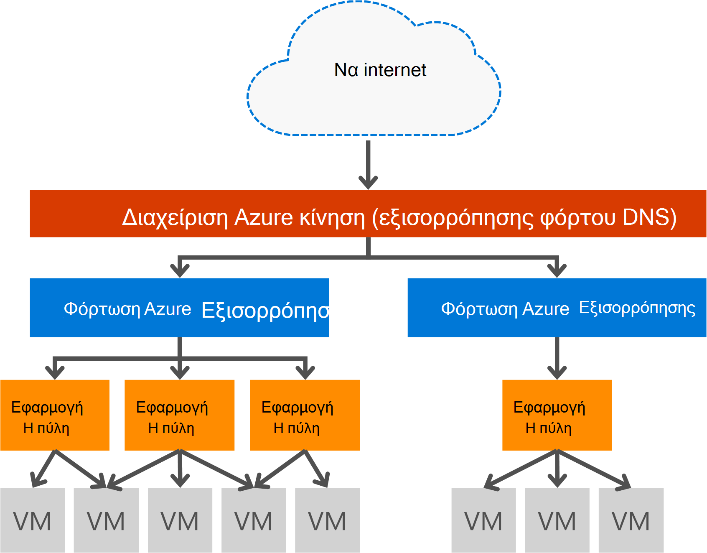

<properties
   pageTitle="Εισαγωγή στην πύλη εφαρμογής | Microsoft Azure"
   description="Αυτήν τη σελίδα παρέχει μια επισκόπηση της υπηρεσίας πύλη εφαρμογής για το επίπεδο 7 εξισορρόπηση φόρτου, συμπεριλαμβανομένων των μεγέθη πύλης, HTTP φόρτωση εξισορρόπησης, βάσει cookie περιόδου λειτουργίας συσχέτισης και μείωση φόρτου SSL."
   documentationCenter="na"
   services="application-gateway"
   authors="georgewallace"
   manager="carmonm"
   editor="tysonn"/>
<tags
   ms.service="application-gateway"
   ms.devlang="na"
   ms.topic="hero-article"
   ms.tgt_pltfrm="na"
   ms.workload="infrastructure-services"
   ms.date="10/25/2016"
   ms.author="gwallace"/>

# Επισκόπηση της εφαρμογής πύλης

## Τι είναι η πύλη εφαρμογής

Πύλη εφαρμογής Microsoft Azure παρέχει ελεγκτή παράδοσης εφαρμογής (ADC) ως υπηρεσία, σας δίνει τη δυνατότητα εξισορρόπησης δυνατότητες για την εφαρμογή σας διάφορες φόρτου επίπεδο 7. Επιτρέπει στους πελάτες για να βελτιστοποιήσετε την παραγωγικότητα συστοιχία web μειώνοντας το φορτίο CPU εντατική τερματισμού SSL στην πύλη εφαρμογής. Παρέχει επίσης άλλες δυνατότητες δρομολόγησης επίπεδο 7 καθώς και διανομής round robin εισερχόμενης κυκλοφορίας, cookie βάσει συσχέτισης περίοδο λειτουργίας, διαδρομή ανάλογα με τη διεύθυνση URL δρομολόγηση και δυνατότητα για τη φιλοξενία πολλές τοποθεσίες Web πίσω από ένα μεμονωμένο πύλη εφαρμογής. Πύλη εφαρμογής έχει επίσης web εφαρμογής τείχος προστασίας (WAF) που προστατεύει την εφαρμογή του σε σχέση με περισσότερες από τις OWASP πρώτων 10 κοινές web ευπάθειες. Πύλη εφαρμογής μπορεί να ρυθμιστεί ως αντικριστές πύλης internet, εσωτερικές μόνο πύλης ή ένας συνδυασμός των δύο. Πύλη εφαρμογής είναι πλήρως Azure διαχείρισης, ιδιαίτερα διαθέσιμες και με δυνατότητα κλιμάκωσης. Παρέχει εμπλουτισμένο σύνολο των εργαλεία διαγνωστικού ελέγχου και τις δυνατότητες καταγραφής για καλύτερη διαχείριση. Πύλη εφαρμογής λειτουργεί με εικονικές μηχανές, τις υπηρεσίες cloud και εσωτερικό ή εξωτερικό άμεσα προσβάσιμη από εφαρμογές web.

Πύλη εφαρμογής είναι μια αποκλειστική εικονική συσκευή για την εφαρμογή σας και περιλαμβάνει πολλές παρουσίες εργαζόμενου για κλιμάκωση και υψηλή διαθεσιμότητα. Όταν δημιουργείτε μια πύλη εφαρμογής, ένα τελικό σημείο (δημόσια VIP ή εσωτερικό ILB IP) είναι που σχετίζονται και να χρησιμοποιηθεί για την κίνηση δικτύου εισόδου. Αυτό το ILB IP ή VIP παρέχεται από πρόγραμμα εξισορρόπησης φόρτου Azure εργασία στο επίπεδο μεταφοράς (TCP/UDP) και αντιμετωπίζετε όλη την εισερχόμενη κυκλοφορία δικτύου που εξισορρόπηση στις παρουσίες εργαζόμενου πύλη εφαρμογής. Η πύλη εφαρμογής, στη συνέχεια, δρομολογεί την κίνηση HTTP/HTTPS βάσει της ρύθμισης παραμέτρων είτε πρόκειται για μια εικονική μηχανή στο cloud υπηρεσία, εσωτερικό ή σε μια εξωτερική διεύθυνση IP. Για το SLA και τις τιμές, ανατρέξτε στις σελίδες [SLA](https://azure.microsoft.com/support/legal/sla/) και [Τιμολόγηση](https://azure.microsoft.com/pricing/details/application-gateway/) .

## Δυνατότητες

Πύλη εφαρμογής υποστηρίζει επί του παρόντος παράδοση 7 εφαρμογών επιπέδου με τις εξής δυνατότητες:

- **[Τείχος προστασίας των εφαρμογών web (έκδοση Preview)](application-gateway-webapplicationfirewall-overview.md)** - το web εφαρμογής τείχος προστασίας (WAF) στην πύλη εφαρμογής Azure προστατεύει εφαρμογές web από κοινές επιθέσεις βασίζεται στο web όπως την εισαγωγή SQL, επιθέσεις δέσμης ενεργειών διατοποθεσιακή και hijacks περιόδου λειτουργίας.
- **Εξισορρόπηση φόρτου HTTP** - πύλη εφαρμογής παρέχει εξισορρόπηση φόρτου round robin. Εξισορρόπηση φόρτου γίνεται στο επίπεδο 7 και χρησιμοποιείται για την κίνηση HTTP (S) μόνο.
- **Συνάφεια βασίζεται σε cookie περιόδου λειτουργίας** - αυτή η δυνατότητα είναι χρήσιμη όταν θέλετε να διατηρήσετε μια περίοδο λειτουργίας χρήστη στην ίδια παρασκηνίου. Με τη χρήση cookies πύλη διαχείρισης, η πύλη εφαρμογής είναι δυνατό να κατευθύνουν οι επόμενες κυκλοφορία από μια περίοδο λειτουργίας χρήστη για το ίδιο παρασκηνίου για επεξεργασία. Αυτή η δυνατότητα είναι σημαντικό στις περιπτώσεις όπου η κατάσταση περιόδου λειτουργίας αποθηκεύεται τοπικά στο διακομιστή παρασκηνίου για μια περίοδο λειτουργίας χρήστη.
- **[Μείωση φόρτου secure Sockets Layer (SSL)](application-gateway-ssl-arm.md)** - αυτή η δυνατότητα σας μεταφέρει στην εργασία κοστίζουν αποκρυπτογράφησης κίνηση HTTPS απενεργοποίηση διακομιστές web. Κατά τον τερματισμό της σύνδεσης SSL στην πύλη εφαρμογής και την προώθηση της αίτησης στο διακομιστή μη κρυπτογραφημένη, το διακομιστή web είναι unburdened, η αποκρυπτογράφηση.  Πύλη εφαρμογής κρυπτογραφεί εκ νέου την απάντηση πριν από την αποστολή του προγράμματος-πελάτη. Αυτή η δυνατότητα είναι χρήσιμη σε σενάρια όπου βρίσκεται το παρασκηνίου στο ίδιο ασφαλή εικονικό δίκτυο με την πύλη εφαρμογής στο Azure.
- **[SSL τελικών](application-gateway-backend-ssl.md)** - πύλη εφαρμογής υποστηρίζει κρυπτογράφηση τελικών κυκλοφορίας. Πύλη εφαρμογής γίνεται με τον τερματισμό της σύνδεσης SSL στην πύλη εφαρμογής. Στη συνέχεια, την πύλη ισχύει η δρομολόγηση κανόνες για την κίνηση, κρυπτογραφεί εκ νέου το πακέτο και προωθεί το πακέτο για να το κατάλληλο παρασκηνίου με βάση τους κανόνες δρομολόγησης που ορίζονται από το. Οποιαδήποτε απόκριση από το διακομιστή web, έχετε την ίδια διαδικασία ξανά για να τον τελικό χρήστη.
- **[Διεύθυνση URL βάσει δρομολόγησης περιεχομένου](application-gateway-url-route-overview.md)** - αυτή η δυνατότητα παρέχει τη δυνατότητα να χρησιμοποιήσετε διαφορετικούς διακομιστές παρασκηνίου για διαφορετική κυκλοφορία. Κίνηση για ένα φάκελο στο διακομιστή web ή για ένα CDN μπορεί να δρομολογηθούν σε μια διαφορετική παρασκηνίου, μειώνοντας τα περιττά φόρτωση στο παρασκήνιο που δεν λειτουργήσει συγκεκριμένο περιεχόμενο.
- **[Δρομολόγησης πολλαπλών τοποθεσιών](application-gateway-multi-site-overview.md)** - εφαρμογή πύλη σας επιτρέπει να ενοποιήσετε έως και 20 τοποθεσίες Web σε μια μεμονωμένη εφαρμογή πύλη.
- **[Υποστήριξη Websocket](application-gateway-websocket.md)** - άλλο εξαιρετική δυνατότητα της εφαρμογής πύλης είναι τα εγγενή υποστήριξη για Websocket.
- **[Παρακολούθηση εύρυθμης λειτουργίας](application-gateway-probe-overview.md)** - πύλη εφαρμογής παρέχει προεπιλεγμένες εύρυθμης λειτουργίας παρακολούθησης παρασκηνίου πόρους και προσαρμοσμένα probes για την παρακολούθηση για πιο συγκεκριμένες σενάρια.

## Πλεονεκτήματα

Πύλη εφαρμογής είναι χρήσιμη για:

- Εφαρμογές που απαιτούν αιτήσεις από την ίδια περίοδο λειτουργίας του χρήστη/προγράμματος-πελάτη για την επίτευξη την ίδια εικονική μηχανή παρασκηνίου. Παραδείγματα από αυτές τις εφαρμογές θα αγορών εφαρμογές καροτσιού αγορών και των διακομιστών αλληλογραφίας web.
- Εφαρμογές που θέλετε να ελευθερώσετε συμπλεγμάτων διακομιστή web από ψηλά τερματισμού SSL.
- Εφαρμογές, όπως ένα δίκτυο παροχής περιεχομένου, που απαιτεί εξισορρόπηση πολλών αιτήσεων HTTP στην ίδια σύνδεση TCP μεγάλη διάρκεια εκτέλεσης δρομολογούνται ή φόρτωση σε διαφορετικούς διακομιστές παρασκηνίου.
- Εφαρμογές που υποστηρίζουν την κυκλοφορία websocket
- Προστασία εφαρμογών web από κοινές επιθέσεις που βασίζονται στο web, όπως την εισαγωγή SQL, επιθέσεις δέσμης ενεργειών διατοποθεσιακή και hijacks περιόδου λειτουργίας.

Πύλη εφαρμογής εξισορρόπηση φόρτου ως μιας υπηρεσίας διαχειριζόμενων Azure επιτρέπει την προμήθεια του μια μονάδα εξισορρόπησης φόρτου επίπεδο 7 πίσω από τη μονάδα εξισορρόπησης φόρτου Azure λογισμικού. Διαχείριση κίνηση μπορεί να χρησιμοποιηθεί για να ολοκληρώσετε το σενάριο, όπως φαίνεται στην παρακάτω εικόνα. Όταν η κυκλοφορία Manager προβλέπει ανακατεύθυνσης και τη διαθεσιμότητα, εξισορρόπηση φόρτου παρέχει στην περιοχή κλιμάκωση και τη διαθεσιμότητα και πύλη εφαρμογής παρέχει εξισορρόπηση φόρτου επίπεδο 7 διασταύρωσης περιοχής.

[AZURE.INCLUDE [load-balancer-compare-tm-ag-lb-include.md](../../includes/load-balancer-compare-tm-ag-lb-include.md)]

## Η πύλη μεγέθη και παρουσίες

Πύλη εφαρμογής είναι αυτήν τη στιγμή που διέθετε το τρία μεγέθη: μικρό, μεσαίο και μεγάλο. Μεγέθη μικρές παρουσία προορίζονται για ανάπτυξη και δοκιμών σενάρια.

Υπάρχουν δύο τις SKU για πύλη εφαρμογής: WAF και τυπική.

Μπορείτε να δημιουργήσετε έως και 50 πύλες εφαρμογής ανά συνδρομή και κάθε πύλη εφαρμογής μπορεί να έχει έως και 10 παρουσίες. Κάθε πύλη εφαρμογής μπορεί να περιλαμβάνει 20 http ακροατών. Για μια πλήρη λίστα των ορίων πύλης εφαρμογή, επισκεφθείτε τη σελίδα [Όρια υπηρεσίας](../azure-subscription-service-limits.md#application-gateway) .

Ο παρακάτω πίνακας εμφανίζει μια μετάδοσης μέση απόδοση για κάθε παρουσία της πύλης εφαρμογής:

| Απόκριση παρασκηνίου σελίδας | Μικρό | Μεσαίο | Μεγάλη|
|---|---|---|---|
| 6K | 7.5 Mbps | 13 Mbps | 50 Mbp |
|100K | 35 Mbps | 100 Mbps| 200 Mbps |

>[AZURE.NOTE] Αυτές οι τιμές είναι κατά προσέγγιση τιμές για μια εφαρμογή μετάδοσης πύλης. Η πραγματική ταχύτητα μετάδοσης εξαρτάται από διάφορες περιβάλλον λεπτομέρειες, όπως το μέγεθος σελίδας μέσος όρος, θέση παρουσίες παρασκηνίου και περισσότερος χρόνος για να λειτουργήσει μια σελίδα. Για τους αριθμούς ακριβή επιδόσεων, θα πρέπει να εκτελέσετε τη δική σας δοκιμές, αυτές οι τιμές παρέχονται μόνο για χωρητικότητα σχεδιασμού καθοδήγηση.

## Παρακολούθηση εύρυθμης λειτουργίας

Azure πύλη εφαρμογής αυτόματα παρακολουθεί την εύρυθμη λειτουργία των παρουσιών παρασκηνίου μέσω basic ή probes προσαρμοσμένο εύρυθμης λειτουργίας. Με τη χρήση καθετήρες εύρυθμης λειτουργίας, αυτό εξασφαλίζει ότι μόνο σε καλή κατάσταση hosts απάντηση σε κίνηση. Για περισσότερες πληροφορίες, ανατρέξτε στο θέμα [Επισκόπηση παρακολούθησης εύρυθμης λειτουργίας πύλη εφαρμογής](application-gateway-probe-overview.md).

## Ρύθμιση παραμέτρων και τη Διαχείριση

Το τελικό σημείο, πύλη εφαρμογής μπορεί να έχει μια δημόσια IP, ιδιωτικό IP ή και τα δύο όταν έχει ρυθμιστεί. Πύλη εφαρμογής έχει ρυθμιστεί μέσα σε ένα εικονικό δίκτυο στο δικό του υποδικτύου. Το υποδίκτυο δημιουργηθεί ή χρησιμοποιούνται για την πύλη εφαρμογής δεν μπορεί να περιέχει τυχόν άλλους τύπους πόρων, οι μόνο πόροι που επιτρέπονται στο δευτερεύον είναι άλλες πύλες εφαρμογής. Για την ασφάλιση τους πόρους σας παρασκηνίου υπόβαθρο διακομιστές μπορεί να είναι μέσα σε ένα διαφορετικό υποδίκτυο στο ίδιο δίκτυο εικονικού με την πύλη εφαρμογής. Αυτό επιπλέον αυτό δεν απαιτείται για τις εφαρμογές υπολογιστή στο παρασκήνιο, με την προϋπόθεση ότι η πύλη εφαρμογής μπορούν να επικοινωνήσουν με τη διεύθυνση ip, πύλη εφαρμογής είναι σε θέση να παρέχουν ADC δυνατότητες για τους διακομιστές παρασκηνίου.

Μπορείτε να δημιουργήσετε και να διαχειριστείτε μια πύλη εφαρμογής χρησιμοποιώντας REST API, PowerShell cmdlet του, Azure CLI, ή [Azure πύλη](https://portal.azure.com/).

## Επόμενα βήματα

Μετά την εκμάθηση σχετικά με την πύλη εφαρμογής, μπορείτε να [δημιουργήσετε μια πύλη εφαρμογής](application-gateway-create-gateway-portal.md) ή μπορείτε να [δημιουργήσετε μια πύλη εφαρμογής μείωση φόρτου SSL](application-gateway-ssl-arm.md) στις συνδέσεις HTTPS εξισορρόπησης φόρτου.

Για να μάθετε πώς μπορείτε να δημιουργήσετε μια πύλη εφαρμογής με χρήση διεύθυνσης URL βάσει δρομολόγησης περιεχομένου, μεταβείτε για να [δημιουργήσετε μια πύλη εφαρμογής με χρήση διεύθυνσης URL με βάση τη δρομολόγηση](application-gateway-create-url-route-arm-ps.md) για περισσότερες πληροφορίες.

