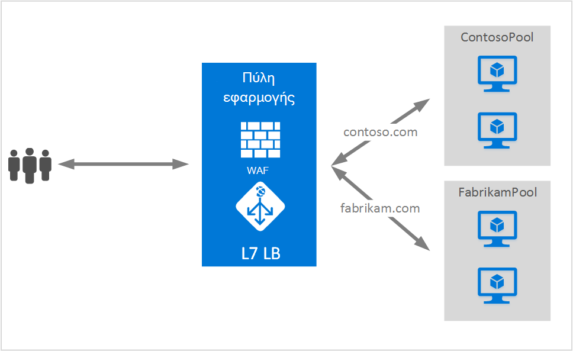

<properties
   pageTitle="Φιλοξενία πολλές τοποθεσίες στην πύλη εφαρμογής | Microsoft Azure"
   description="Αυτή η σελίδα παρέχει μια επισκόπηση της υποστήριξης πολλαπλών τοποθεσία πύλη εφαρμογής."
   documentationCenter="na"
   services="application-gateway"
   authors="amsriva"
   manager="rossort"
   editor="amsriva"/>
<tags
   ms.service="application-gateway"
   ms.devlang="na"
   ms.topic="hero-article"
   ms.tgt_pltfrm="na"
   ms.workload="infrastructure-services"
   ms.date="10/25/2016"
   ms.author="amsriva"/>

# Πύλη εφαρμογής πολλών φιλοξενίας τοποθεσίας

Πολλές φιλοξενίας τοποθεσίας σάς επιτρέπει να ρύθμιση παραμέτρων περισσότερες από μία εφαρμογής web στην ίδια παρουσία πύλης εφαρμογής. Αυτή η δυνατότητα σάς επιτρέπει να ρυθμίσετε τις παραμέτρους μιας πιο αποτελεσματική τοπολογίας για αναπτύξεις σας προσθέτοντας έως 20 τοποθεσίες Web σε μια εφαρμογή πύλης. Κάθε τοποθεσία Web να κατευθύνεται στο δικό του χώρο συγκέντρωσης παρασκηνίου. Στο παρακάτω παράδειγμα, πύλη εφαρμογής σερβίρισμα κίνηση για contoso.com και fabrikam.com από δύο σύνολα παρασκηνίου διακομιστή που ονομάζεται ContosoServerPool και FabrikamServerPool.

Αιτήσεις για http://contoso.com δρομολογούνται στα ContosoServerPool και http://fabrikam.com δρομολογούνται στα FabrikamServerPool.

Ομοίως δύο δευτερεύοντες τομείς του ίδιου τομέα γονικό μπορούν να φιλοξενηθούν σε την ίδια ανάπτυξη της εφαρμογής πύλης. Παραδείγματα χρήσης δευτερεύοντες τομείς ενδέχεται να περιλαμβάνουν http://blog.contoso.com και http://app.contoso.com φιλοξενούνται σε μια μεμονωμένη εφαρμογή ανάπτυξη πύλης.

## Κεφαλίδες κεντρικού υπολογιστή και ένδειξη όνομα διακομιστή (SNI)

Υπάρχουν τρεις μηχανισμοί κοινές για την Ενεργοποίηση πολλών φιλοξενίας τοποθεσίας στην ίδια υποδομή.

1. Φιλοξενία πολλές εφαρμογές web κάθε σε μια μοναδική διεύθυνση IP.
2. Χρησιμοποιήστε το όνομα κεντρικού υπολογιστή για τη φιλοξενία πολλών εφαρμογές web την ίδια διεύθυνση IP.
3. Χρησιμοποιήστε διαφορετικές θύρες για τη φιλοξενία πολλών εφαρμογές web την ίδια διεύθυνση IP.

Προς το παρόν μια πύλη εφαρμογής λαμβάνει μία δημόσια διεύθυνση IP στην οποία κάνει ακρόαση για την κίνηση. Υποστήριξη, επομένως, πολλές εφαρμογές, κάθε μία με τη δική του διεύθυνση IP, προς το παρόν δεν υποστηρίζεται. Πύλη εφαρμογής υποστηρίζει πολλές εφαρμογές φιλοξενίας κάθε ακρόαση σε διαφορετικές θύρες, αλλά αυτό το σενάριο απαιτείται τις εφαρμογές για να αποδεχτείτε την κυκλοφορία σε μη τυπική θύρες και συχνά δεν είναι μια επιθυμητή ρύθμιση παραμέτρων. Πύλη εφαρμογής βασίζεται σε HTTP 1.1 κεφαλίδων κεντρικού υπολογιστή για τη φιλοξενία περισσότερες από μία τοποθεσία Web στην ίδια δημόσια διεύθυνση IP και θύρες. Επίσης, τις τοποθεσίες που φιλοξενούνται σε πύλη εφαρμογής να μείωση φόρτου SSL υποστήριξη με επέκταση TLS ένδειξη όνομα διακομιστή (SNI). Αυτό το σενάριο σημαίνει ότι του προγράμματος-πελάτη προγράμματος περιήγησης και παρασκηνίου συμπλέγματος διακομιστών web πρέπει να υποστηρίζει HTTP/1.1 και TLS επέκταση όπως ορίζεται στο RFC 6066.

## Στοιχείο παραμέτρων ακρόασης

Υπάρχον στοιχείο παραμέτρων HTTPListener είναι βελτιωμένες για την υποστήριξη host όνομα και ο διακομιστής ονομάτων ένδειξη στοιχείων, που χρησιμοποιείται από την πύλη εφαρμογής για να την κυκλοφορία δρομολόγηση στο κατάλληλο παρασκηνίου χώρου συγκέντρωσης. Το ακόλουθο παράδειγμα κώδικα είναι το τμήμα κώδικα HttpListeners στοιχείου από το αρχείο προτύπου.

    "httpListeners": [
                {
                    "name": "appGatewayHttpsListener1",
                    "properties": {
                        "FrontendIPConfiguration": {
                            "Id": "/subscriptions/<subid>/resourceGroups/<rgName>/providers/Microsoft.Network/applicationGateways/applicationGateway1/frontendIPConfigurations/DefaultFrontendPublicIP"
                        },
                        "FrontendPort": {
                            "Id": "/subscriptions/<subid>/resourceGroups/<rgName>/providers/Microsoft.Network/applicationGateways/applicationGateway1/frontendPorts/appGatewayFrontendPort443'"
                        },
                        "Protocol": "Https",
                        "SslCertificate": {
                            "Id": "/subscriptions/<subid>/resourceGroups/<rgName>/providers/Microsoft.Network/applicationGateways/applicationGateway1/sslCertificates/appGatewaySslCert1'"
                        },
                        "HostName": "contoso.com",
                        "RequireServerNameIndication": "true"
                    }
                },
                {
                    "name": "appGatewayHttpListener2",
                    "properties": {
                        "FrontendIPConfiguration": {
                            "Id": "/subscriptions/<subid>/resourceGroups/<rgName>/providers/Microsoft.Network/applicationGateways/applicationGateway1/frontendIPConfigurations/appGatewayFrontendIP'"
                        },
                        "FrontendPort": {
                            "Id": "/subscriptions/<subid>/resourceGroups/<rgName>/providers/Microsoft.Network/applicationGateways/applicationGateway1/frontendPorts/appGatewayFrontendPort80'"
                        },
                        "Protocol": "Http",
                        "HostName": "fabrikam.com",
                        "RequireServerNameIndication": "false"
                    }
                }
            ],

Μπορείτε να επισκεφθείτε [το πρότυπο διαχείρισης πόρων χρησιμοποιώντας πολλά φιλοξενίας τοποθεσίας](https://github.com/Azure/azure-quickstart-templates/blob/master/201-application-gateway-multihosting) για μια ανάπτυξη τελικών με βάση το πρότυπο.

## Κανόνα δρομολόγησης

Δεν υπάρχει καμία αλλαγή απαιτείται στον κανόνα δρομολόγησης. Ο κανόνας δρομολόγηση 'Βασική' θα πρέπει να συνεχίσετε να επιλέγεται για να συνδέσετε το ακροατήριο κατάλληλη τοποθεσία για να το αντίστοιχο σύνολο διευθύνσεων παρασκηνίου.

    "requestRoutingRules": [
    {
        "name": "<ruleName1>",
        "properties": {
            "RuleType": "Basic",
            "httpListener": {
                "id": "/subscriptions/<subid>/resourceGroups/<rgName>/providers/Microsoft.Network/applicationGateways/applicationGateway1/httpListeners/appGatewayHttpsListener1')]"
            },
            "backendAddressPool": {
                "id": "/subscriptions/<subid>/resourceGroups/<rgName>/providers/Microsoft.Network/applicationGateways/applicationGateway1/backendAddressPools/ContosoServerPool')]"
            },
            "backendHttpSettings": {
                "id": "/subscriptions/<subid>/resourceGroups/<rgName>/providers/Microsoft.Network/applicationGateways/applicationGateway1/backendHttpSettingsCollection/appGatewayBackendHttpSettings')]"
            }
        }

    },
    {
        "name": "<ruleName2>",
        "properties": {
            "RuleType": "Basic",
            "httpListener": {
                "id": "/subscriptions/<subid>/resourceGroups/<rgName>/providers/Microsoft.Network/applicationGateways/applicationGateway1/httpListeners/appGatewayHttpListener2')]"
            },
            "backendAddressPool": {
                "id": "/subscriptions/<subid>/resourceGroups/<rgName>/providers/Microsoft.Network/applicationGateways/applicationGateway1/backendAddressPools/FabrikamServerPool')]"
            },
            "backendHttpSettings": {
                "id": "/subscriptions/<subid>/resourceGroups/<rgName>/providers/Microsoft.Network/applicationGateways/applicationGateway1/backendHttpSettingsCollection/appGatewayBackendHttpSettings')]"
            }
        }

    }
    ]

## Επόμενα βήματα

Μετά την εκμάθηση πληροφορίες για τη φιλοξενία πολλών τοποθεσιών, μεταβείτε για να [δημιουργήσετε μια πύλη εφαρμογής χρησιμοποιώντας πολλά φιλοξενίας τοποθεσίας](application-gateway-create-multisite-azureresourcemanager-powershell.md) για να δημιουργήσετε μια πύλη εφαρμογής με δυνατότητα υποστήριξης περισσότερες από μία εφαρμογή web.
