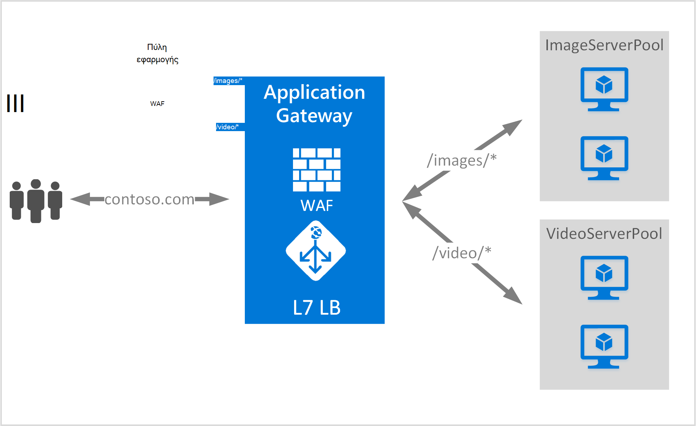

<properties
   pageTitle="Διεύθυνση URL βάσει περιεχομένου δρομολόγησης Επισκόπηση | Microsoft Azure"
   description="Αυτή η σελίδα παρέχει μια επισκόπηση των βασίζεται σε διεύθυνση URL της πύλης εφαρμογής δρομολόγησης περιεχομένου, ρύθμιση παραμέτρων UrlPathMap και PathBasedRouting κανόνα."
   documentationCenter="na"
   services="application-gateway"
   authors="georgewallace"
   manager="carmonm"
   editor="tysonn"/>
<tags
   ms.service="application-gateway"
   ms.devlang="na"
   ms.topic="hero-article"
   ms.tgt_pltfrm="na"
   ms.workload="infrastructure-services"
   ms.date="10/25/2016"
   ms.author="gwallace"/>

# Επισκόπηση της διεύθυνσης URL διαδρομή με βάση τη δρομολόγηση

Διεύθυνση URL διαδρομή με βάση τη δρομολόγηση σας επιτρέπει να την κυκλοφορία δρομολόγηση στο διακομιστή παρασκηνίου χώρους συγκέντρωσης που βασίζονται σε διαδρομές URL της αίτησης. Ένα από τα σενάρια είναι να δρομολόγηση αιτήσεων για διαφορετικούς τύπους περιεχομένου σε χώρους συγκέντρωσης διακομιστή διαφορετικό υπολογιστή στο παρασκήνιο.
Στο παρακάτω παράδειγμα, πύλη εφαρμογής σερβίρισμα κίνηση για contoso.com από τρεις χώρους συγκέντρωσης παρασκηνίου διακομιστή για παράδειγμα: VideoServerPool, ImageServerPool και DefaultServerPool.

Οι αιτήσεις για http://contoso.com/video* δρομολογούνται στα VideoServerPool, και http://contoso.com/images* δρομολογούνται ImageServerPool. DefaultServerPool είναι επιλεγμένο, εάν κανένα από τα μοτίβα διαδρομή συμφωνούν.

## Στοιχείο παραμέτρων UrlPathMap

Στοιχείο UrlPathMap χρησιμοποιείται για να καθορίσετε διαδρομή μοτίβα για αντιστοιχίσεις χώρου συγκέντρωσης διακομιστή παρασκηνίου. Το ακόλουθο παράδειγμα κώδικα είναι το τμήμα κώδικα urlPathMap στοιχείου από το αρχείο προτύπου.

    "urlPathMaps": [
    {
    "name": "<urlPathMapName>",
    "id": "/subscriptions/<subscriptionId>/../microsoft.network/applicationGateways/<gatewayName>/ urlPathMaps/<urlPathMapName>",
    "properties": {
        "defaultBackendAddressPool": {
            "id": "/subscriptions/<subscriptionId>/../microsoft.network/applicationGateways/<gatewayName>/backendAddressPools/<poolName>"
        },
        "defaultBackendHttpSettings": {
            "id": "/subscriptions/<subscriptionId>/../microsoft.network/applicationGateways/<gatewayName>/backendHttpSettingsList/<settingsName>"
        },
        "pathRules": [
            {
                "paths": [
                    <pathPattern>
                ],
                "backendAddressPool": {
                    "id": "/subscriptions/<subscriptionId>/../microsoft.network/applicationGateways/<gatewayName>/backendAddressPools/<poolName2>"
                },
                "backendHttpsettings": {
                    "id": "/subscriptions/<subscriptionId>/../microsoft.network/applicationGateways/<gatewayName>/backendHttpsettingsList/<settingsName2>"
                },

            },

        ],

    }
    }
    

>[AZURE.NOTE] PathPattern: Αυτή η ρύθμιση είναι μια λίστα με μοτίβα διαδρομή ώστε να ταιριάζει με. Κάθε πρέπει να ξεκινά με / και τη θέση στην μόνο ένα "*" επιτρέπεται προς τα ακόλουθα τέλος μιας "/". Η συμβολοσειρά τροφοδοσία για τη διαδρομή matcher δεν περιλαμβάνει οποιοδήποτε κείμενο μετά την πρώτη; ή # και οι χαρακτήρες δεν επιτρέπονται εδώ. 

Μπορείτε να ελέγξετε ενός [προτύπου για τη διαχείριση πόρων με χρήση διεύθυνσης URL με βάση τη δρομολόγηση](https://azure.microsoft.com/documentation/templates/201-application-gateway-url-path-based-routing) για περισσότερες πληροφορίες.

## PathBasedRouting κανόνα

RequestRoutingRule του τύπου PathBasedRouting χρησιμοποιείται για να δεσμεύσετε ένα ακροατήριο σε μια urlPathMap. Όλες τις αιτήσεις που λαμβάνονται για αυτό ακρόασης δρομολογούνται σύμφωνα με την πολιτική που καθορίζεται στο urlPathMap.
Απόκομμα PathBasedRouting κανόνα:

    "requestRoutingRules": [
    {

    "name": "<ruleName>",
    "id": "/subscriptions/<subscriptionId>/../microsoft.network/applicationGateways/<gatewayName>/requestRoutingRules/<ruleName>",
    "properties": {
        "ruleType": "PathBasedRouting",
        "httpListener": {
            "id": "/subscriptions/<subscriptionId>/../microsoft.network/applicationGateways/<gatewayName>/httpListeners/<listenerName>"
        },
        "urlPathMap": {
            "id": "/subscriptions/<subscriptionId>/../microsoft.network/applicationGateways/<gatewayName>/ urlPathMaps/<urlPathMapName>"
        },

    }
    
## Επόμενα βήματα

Μετά την εκμάθηση σχετικά με τη διεύθυνση URL βάσει δρομολόγησης περιεχομένου, μεταβείτε για να [δημιουργήσετε μια πύλη εφαρμογής με χρήση διεύθυνσης URL με βάση τη δρομολόγηση](application-gateway-create-url-route-portal.md) για να δημιουργήσετε μια πύλη εφαρμογής με κανόνες δρομολόγησης διεύθυνση URL.
