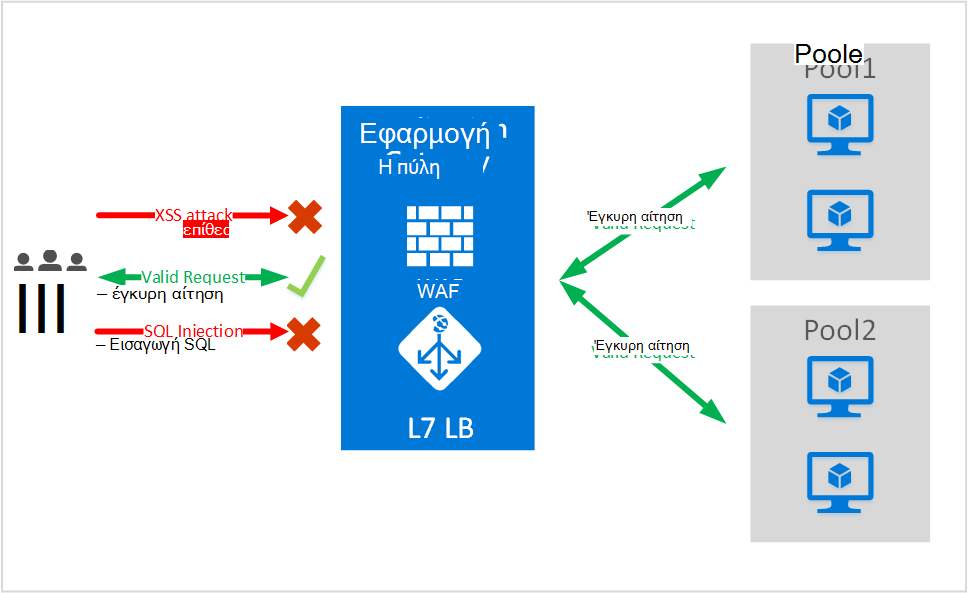
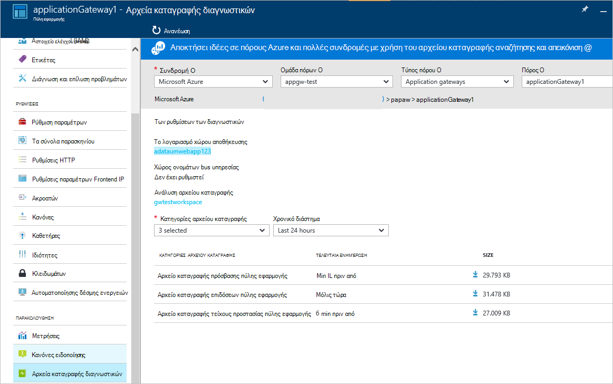

<properties
   pageTitle="Εισαγωγή στο τείχος προστασίας εφαρμογών Web (WAF) για την πύλη εφαρμογής | Microsoft Azure"
   description="Αυτή η σελίδα παρέχει μια επισκόπηση του τείχους προστασίας των εφαρμογών Web (WAF) για την πύλη εφαρμογής "
   documentationCenter="na"
   services="application-gateway"
   authors="amsriva"
   manager="rossort"
   editor="amsriva"/>
<tags
   ms.service="application-gateway"
   ms.devlang="na"
   ms.topic="hero-article"
   ms.tgt_pltfrm="na"
   ms.workload="infrastructure-services"
   ms.date="10/25/2016"
   ms.author="amsriva"/>

# Εφαρμογή Web πύλης εφαρμογή τείχος προστασίας (έκδοση preview)

Τείχος προστασίας των εφαρμογών Web (WAF) είναι μια δυνατότητα της πύλης azure εφαρμογής που παρέχει προστασία σε εφαρμογές web που να αξιοποιήσετε πύλη εφαρμογής για τυπικές συναρτήσεις ελέγχου παράδοσης εφαρμογής (ADC). Τείχος προστασίας εφαρμογής Web το κάνει αυτό με την προστασία τους σε σχέση με περισσότερες από τις OWASP πρώτων 10 κοινές web ευπάθειες. Εφαρμογές Web αυξανόμενη αποτελούν στόχους της κακόβουλες επιθέσεις που εκμεταλλεύεται κοινές γνωστά θέματα ευπάθειας. Συνηθισμένες σε αυτά τα στοιχεία εκμετάλλευσης είναι επιθέσεις εισαγωγής SQL, δέσμες ενεργειών διατοποθεσιακή επιθέσεις μερικά. Αποτροπή όπως επιθέσεις στον κώδικα της εφαρμογής μπορεί να είναι δύσκολη και μπορεί να απαιτεί αυστηρών συντήρηση, ενημέρωση και παρακολούθησης σε πολλά επίπεδα στην τοπολογία εφαρμογής. Τείχος προστασίας εφαρμογής web κεντρικής για προστασία από επιθέσεις web κάνει απλουστεύοντας Διαχείριση ασφαλείας και σας προσφέρει καλύτερη εξασφάλισης αναβάθμισης στην εφαρμογή από το απειλές παραβιάσεις. Μια λύση WAF να επίσης με αντικείμενο σε γρηγορότερο απειλή ασφαλείας κατά την ενημέρωση ενός γνωστά ευπάθεια σε μια κεντρική θέση έναντι ασφάλιση κάθε μία από τις εφαρμογές web μεμονωμένα. Υπάρχουσα εφαρμογή πύλες μπορεί να μετατραπεί σε μια πύλη εφαρμογής με το τείχος προστασίας εφαρμογής web εύκολα.

Πύλη εφαρμογής λειτουργεί ως μια εφαρμογή του ελεγκτή παράδοσης και προσφέρει τερματισμού SSL, συσχέτισης βασίζεται σε cookie περιόδου λειτουργίας, φόρτωση round robin κατανομή, περιεχομένου με βάση τη δρομολόγηση, δυνατότητα για τη φιλοξενία πολλές βελτιώσεις τοποθεσίες Web και την ασφάλεια. Βελτιώσεις ασφαλείας που παρέχεται από την πύλη εφαρμογής περιλαμβάνουν διαχείριση πολιτικών SSL, τελικών υποστήριξη SSL. Θα σας ενίσχυση δυνατότητες ασφαλείας εφαρμογής της υπηρεσίας μας, εισάγοντας απευθείας ενοποιηθεί με το ADC σας δίνει τη δυνατότητα WAF (τείχος προστασίας εφαρμογής web). Αυτή η δυνατότητα παρέχει ένα εύκολο να ρυθμίσετε τις παραμέτρους κεντρική θέση για τη διαχείριση και την προστασία των εφαρμογών web από κοινά θέματα ευπάθειας web.

Ρύθμιση παραμέτρων WAF στην πύλη εφαρμογής παρέχει το παρακάτω όφελος για εσάς:

- Προστασία της εφαρμογής web από το web ευπάθειες και επιθέσεις χωρίς να τροποποιηθεί στον κώδικα παρασκηνίου.
- Προστασία πολλές εφαρμογές web την ίδια στιγμή πίσω από μια πύλη εφαρμογής. Πύλη εφαρμογής υποστηρίζει φιλοξενίας έως 20 τοποθεσίες Web πίσω από ένα μεμονωμένο πύλη που θα μπορούσε να προστατεύονται από επιθέσεις web.
- Παρακολουθήστε την εφαρμογή web από επιθέσεις χρήση σε πραγματικό χρόνο αναφοράς που δημιουργούνται από αρχεία καταγραφής εφαρμογών πύλης WAF.
- Ορισμένα στοιχεία ελέγχου συμμόρφωσης απαιτούν όλα internet αντικριστές τελικά σημεία να προστατεύεται από μια λύση WAF. Χρησιμοποιώντας την πύλη εφαρμογής με WAF ενεργοποιημένο, μπορείτε να πληροί αυτές τις απαιτήσεις συμμόρφωσης.

## Επισκόπηση

Εφαρμογή πύλης WAF είναι διαθέσιμο σε μια νέα SKU (WAF SKU) και διατίθεται προδιαμορφωμένο με ModSecurity και ορισμός κανόνα πυρήνα OWASP για να προσφέρει προστασία γραμμής βάσης από περισσότερες από τις OWASP πρώτων 10 κοινές web ευπάθειες.

- Προστασία εισαγωγής SQL
- Cross προστασίας δέσμης ενεργειών τοποθεσίας
- Κοινές το Web επιθέσεις προστασίας όπως εντολή εισαγωγής, λαθραία υποβολή, απόκριση HTTP διαίρεση, αιτήσεων HTTP και απομακρυσμένο αρχείο συμπερίληψης επίθεση
- Προστασία από παραβιάσεις πρωτοκόλλου HTTP
- Προστασία από ανωμαλίες πρωτοκόλλου HTTP όπως λείπουν φιλοξενήσετε παράγοντα χρήστη και αποδεχτείτε κεφαλίδες
- Προστασία DoS HTTP όπως κατάκλυση HTTP και αργή αποτροπής HTTP DoS
- Αποτροπή σε σχέση με τα BOT, προγράμματα ανίχνευσης και σαρωτές
- Εντοπισμός ενός συνήθεις εσφαλμένες ρυθμίσεις εφαρμογής (δηλαδή Apache, των υπηρεσιών IIS, κλπ)

## Λειτουργίες WAF

Εφαρμογή WAF πύλης μπορεί να ρυθμιστεί ώστε να εκτελείται σε τις εξής δύο καταστάσεις λειτουργίας:

- **Λειτουργία εντοπισμού** – όταν έχει ρυθμιστεί ώστε να εκτελείται σε λειτουργία εντοπισμού, εφαρμογή πύλης WAF παρακολουθεί και καταγράφει όλες τις ειδοποιήσεις απειλή σε ένα αρχείο καταγραφής. Πρέπει να εξασφαλίσετε ότι καταγραφή διαγνωστικών για πύλη εφαρμογής είναι ενεργοποιημένος χρησιμοποιώντας την ενότητα Διαγνωστικά. Θα πρέπει επίσης να εξασφαλίσετε ότι το αρχείο καταγραφής WAF είναι επιλεγμένο και ενεργοποιημένη.
- **Λειτουργία αποτροπής** – όταν έχει ρυθμιστεί ώστε να εκτελείται σε λειτουργία αποτροπής και πύλη εφαρμογής ενεργά παραβιάσεις μπλοκ και επιθέσεις εντοπίζονται από τους κανόνες. Ο εισβολέας λαμβάνει μια εξαίρεση 403 μη εξουσιοδοτημένη πρόσβαση και η σύνδεση τερματίζεται. Λειτουργία αποτροπής εξακολουθεί να συνδεθείτε όπως επιθέσεις στα αρχεία καταγραφής WAF.

## Εφαρμογή πύλης WAF αναφορών

Εφαρμογή πύλης WAF παρέχει λεπτομερείς αναφορές σε κάθε απειλή εντοπίσει. Καταγραφή είναι συνδεδεμένη με τα αρχεία καταγραφής διαγνωστικών Azure και ειδοποιήσεων καταγράφονται σε μορφή json.

    {
        "resourceId": "/SUBSCRIPTIONS/<subscriptionId>/RESOURCEGROUPS/<resourceGroupName>/PROVIDERS/MICROSOFT.NETWORK/APPLICATIONGATEWAYS/<applicationGatewayName>",
        "operationName": "ApplicationGatewayFirewall",
        "time": "2016-09-20T00:40:04.9138513Z",
        "category": "ApplicationGatewayFirewallLog",
        "properties":     {
            "instanceId":"ApplicationGatewayRole_IN_0",
            "clientIp":"108.41.16.164",
            "clientPort":1815,
            "requestUri":"/wavsep/active/RXSS-Detection-Evaluation-POST/",
            "ruleId":"OWASP_973336",
            "message":"XSS Filter - Category 1: Script Tag Vector",
            "action":"Logged",
            "site":"Global",
            "message":"XSS Filter - Category 1: Script Tag Vector",
            "details":{"message":" Warning. Pattern match "(?i)(<script","file":"/owasp_crs/base_rules/modsecurity_crs_41_xss_attacks.conf","line":"14"}}
    }

## Εφαρμογή Τιμολόγηση SKU WAF πύλης

Κατά την προεπισκόπηση, υπάρχουν χωρίς επιπλέον χρεώσεις για χρήση εφαρμογής πύλης WAF. Μπορείτε να συνεχίσετε να χρεωθεί με υπάρχουσα χρεώσεις βασικές SKU. Θα σας θα επικοινωνήσει τις χρεώσεις WAF SKU στιγμή GA. Οι πελάτες που επιλέξατε να αναπτύξετε πύλη εφαρμογής στο WAF SKU θα ξεκινήσετε προσαυξάνονται SKU WAF τις τιμές μόνο μετά την ανακοίνωση GA.

## Επόμενα βήματα

Αφού μάθετε περισσότερα σχετικά με τις δυνατότητες του WAF, επισκεφθείτε την τοποθεσία [πώς μπορείτε να ρυθμίσετε το τείχος προστασίας εφαρμογής Web στην πύλη εφαρμογής](application-gateway-web-application-firewall-portal.md).
