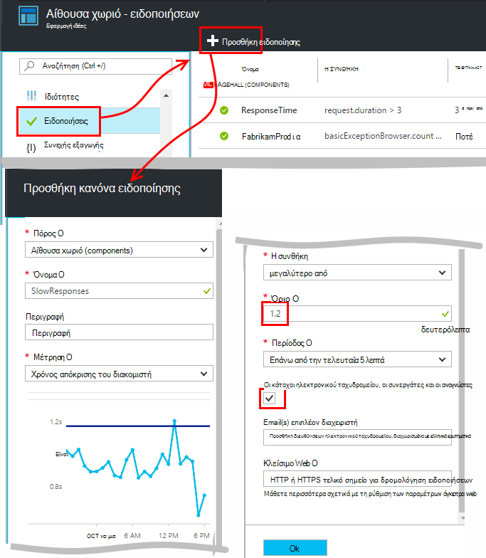
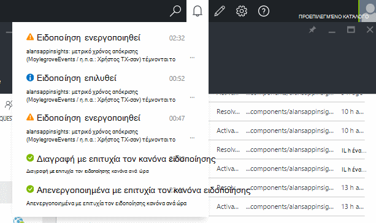
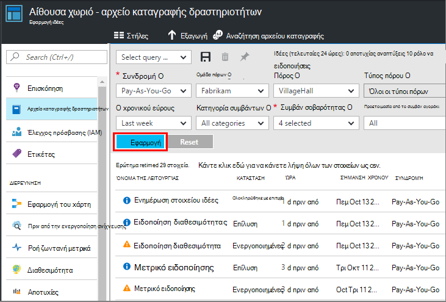

<properties 
    pageTitle="Ορισμός ειδοποιήσεων σε εφαρμογή ιδέες | Microsoft Azure" 
    description="Ενημερωθείτε σχετικά με την καθυστέρηση απόκρισης, εξαιρέσεις, και άλλες επιδόσεων ή χρήση αλλαγές στην εφαρμογή web." 
    services="application-insights" 
    documentationCenter=""
    authors="alancameronwills" 
    manager="douge"/>

<tags 
    ms.service="application-insights" 
    ms.workload="tbd" 
    ms.tgt_pltfrm="ibiza" 
    ms.devlang="na" 
    ms.topic="article" 
    ms.date="10/14/2016" 
    ms.author="awills"/>
 
# Ορισμός ειδοποιήσεων σε ιδέες εφαρμογής

[Visual Studio εφαρμογή ιδέες] [ start] μπορεί να σας ειδοποιεί με τις αλλαγές σε επιδόσεις ή χρήση μετρικά στην εφαρμογή web. 

Εφαρμογή ιδέες παρακολουθεί την εφαρμογή σας live σε μια [μεγάλη ποικιλία πλατφόρμες] [ platforms] θα σας βοηθήσουν να διάγνωση θεμάτων επιδόσεων και έχετε κατανοήσει μοτίβα χρήσης.

Υπάρχουν τρία είδη των ειδοποιήσεων:

* **Μετρικό ειδοποιήσεις** σας ενημερώσει όταν οποιοδήποτε μετρικό τέμνει μια οριακή τιμή για ορισμένες περίοδο - όπως χρόνους απόκρισης, πλήθος εξαίρεσης, η χρήση της CPU ή προβολές σελίδας. 
* [**Δοκιμές στο Web** ] [ availability] ενημερώσει κατά την τοποθεσία σας είναι διαθέσιμο στο internet, ή ανταποκρίνεται αργά. [Μάθετε περισσότερα][availability].
* [**Έγκαιρη Διαγνωστικά**](app-insights-proactive-diagnostics.md) ρυθμίζονται αυτόματα για να σας ειδοποιεί σχετικά με τις επιδόσεις ασυνήθιστο μοτίβα.

Θα σας εστιάσετε μετρικό ειδοποιήσεις σε αυτό το άρθρο.

## Ορίστε μια ειδοποίηση μετρικό

Ανοίξτε το blade ειδοποίησης κανόνες και, στη συνέχεια, χρησιμοποιήστε το κουμπί Προσθήκη. 

* Ορισμός του πόρου πριν από τις άλλες ιδιότητες. **Επιλέξτε τον πόρο "(components)"** εάν θέλετε να ορίσετε ειδοποιήσεις επιδόσεων "ή" Χρήση μετρικά.
* Το όνομα που δίνεται ειδοποίηση πρέπει να είναι μοναδικό μέσα στην ομάδα πόρων (όχι μόνο την εφαρμογή).
* Μην ξεχάσετε να σημειώσετε τις μονάδες στην οποία θα σας ζητηθεί να εισαγάγετε το οριακή τιμή.
* Εάν επιλέξετε το πλαίσιο "Ηλεκτρονικού ταχυδρομείου κάτοχοι...", ειδοποιήσεις θα αποσταλούν μέσω ηλεκτρονικού ταχυδρομείου για όλους τους χρήστες που έχουν πρόσβαση σε αυτήν την ομάδα πόρων. Για να αναπτύξετε αυτό το σύνολο των ατόμων, μπορείτε να τις προσθέσετε στην [ομάδα πόρων ή συνδρομή](app-insights-resources-roles-access-control.md) (δεν τον πόρο).
* Εάν καθορίσετε "Επιπλέον μηνύματα ηλεκτρονικού ταχυδρομείου", θα αποστέλλονται ειδοποιήσεις στα κατάλληλα άτομα ή ομάδες (ή όχι που επιλέξατε στο πλαίσιο "ηλεκτρονικού ταχυδρομείου κάτοχοι..."). 
* Ορίστε μια [διεύθυνση webhook](../monitoring-and-diagnostics/insights-webhooks-alerts.md) εάν έχετε ρυθμίσει μια εφαρμογή web που αποκρίνεται σε ειδοποιήσεις. Ονομασία όταν ενεργοποιείται η ειδοποίηση (δηλαδή, ενεργοποιείται) και όταν να επιλυθεί. (Ωστόσο, σημειώστε ότι προς το παρόν, παράμετροι ερωτήματος δεν μεταβιβάζονται μέσω ως ιδιότητες webhook.)
* Μπορείτε να απενεργοποιήσετε ή να ενεργοποιήσετε την ειδοποίηση: δείτε τα κουμπιά στο επάνω μέρος του blade.

*Δεν βλέπω το κουμπί Προσθήκη ειδοποίησης.* 

- Χρησιμοποιείτε έναν εταιρικό λογαριασμό; Μπορείτε να ορίσετε ειδοποιήσεις εάν έχετε κάτοχος ή ο συνεργάτης να αποκτήσει πρόσβαση σε αυτόν τον πόρο εφαρμογής. Ρίξτε μια ματιά το blade έλεγχος πρόσβασης. [Μάθετε περισσότερα σχετικά με τον έλεγχο πρόσβασης][roles].

> [AZURE.NOTE] Στο το blade ειδοποιήσεις, θα δείτε ότι υπάρχει ήδη ένα σύνολο ειδοποίησης προς τα επάνω: [Διαγνωστικά πριν από την ενεργοποίηση](app-insights-proactive-failure-diagnostics.md). Αυτή είναι μια αυτόματη ειδοποίηση που παρακολουθεί ένα συγκεκριμένο μετρικό, αίτηση ρυθμός αποτυχίας. Εκτός και αν αποφασίσετε να απενεργοποιήσετε την ειδοποίηση πριν από την ενεργοποίηση, δεν χρειάζεται για να ορίσετε τις δικές σας ειδοποίηση στην αίτηση αποτυχία επιτόκιο. 

## Δείτε τις ειδοποιήσεις σας

Μπορείτε να λάβετε ένα μήνυμα ηλεκτρονικού ταχυδρομείου όταν μια κατάσταση ειδοποίησης αλλαγές μεταξύ ανενεργά και ενεργά. 

Την τρέχουσα κατάσταση κάθε ειδοποίησης εμφανίζεται με το blade ειδοποίησης κανόνων.

Υπάρχει μια σύνοψη των πρόσφατων δραστηριότητες τις ειδοποιήσεις αναπτυσσόμενη λίστα:

Είναι το ιστορικό των αλλαγών κατάστασης στο αρχείο καταγραφής της δραστηριότητας:

## Πώς λειτουργούν οι ειδοποιήσεις

* Μια ειδοποίηση έχει τρεις καταστάσεις: "Δεν έχει ενεργοποιηθεί", "Ενεργοποιημένο" και "Επίλυση". Ενεργοποιημένη σημαίνει ότι η συνθήκη που καθορίσατε έχει τιμή true, όταν το τελευταίο έχει αξιολογηθεί.

* Δημιουργείται μια ειδοποίηση όταν μια ειδοποίηση αλλάζει κατάσταση. (Εάν η συνθήκη ειδοποίησης ήταν ήδη true όταν δημιουργήσατε την ειδοποίηση, ενδέχεται να μην λαμβάνετε μια ειδοποίηση μέχρι τη συνθήκη μεταβαίνει false.)

* Κάθε ειδοποίηση δημιουργεί ένα μήνυμα ηλεκτρονικού ταχυδρομείου εάν επιλεγμένο πλαίσιο μηνύματα ηλεκτρονικού ταχυδρομείου ή που παρέχονται διευθύνσεις ηλεκτρονικού ταχυδρομείου. Μπορείτε επίσης να ανατρέξετε σε ειδοποιήσεις αναπτυσσόμενη λίστα.

* Μια ειδοποίηση υπολογίζεται κάθε φορά που ένα μετρικό φτάσει, αλλά δεν διαφορετικά.

* Την αξιολόγηση συγκεντρώνει τη μέτρηση μέσω της προηγούμενης περιόδου και, στη συνέχεια, συγκρίνει με το όριο για να προσδιορίσετε η νέα κατάσταση.

* Την περίοδο που επιλέγετε καθορίζει το χρονικό διάστημα βάσει του οποίου έχουν συναθροιστεί μετρικά. Δεν επηρεάζει τη συχνότητα αξιολογείται την ειδοποίηση: που εξαρτάται από τη συχνότητα άφιξη των μετρήσεων.

* Εάν δεν υπάρχουν δεδομένα που λαμβάνονται για ένα συγκεκριμένο μετρικό για κάποιο χρονικό διάστημα, το κενό διαθέτει διάφορα εφέ ειδοποίησης αξιολόγησης και, από τα γραφήματα στην Εξερεύνηση των μετρικό. Στην Εξερεύνηση των μετρικό, εάν δεν υπάρχουν δεδομένα είναι ορατή για περισσότερο από το γράφημα δειγματοληψία διάστημα, το γράφημα εμφανίζει την τιμή 0. Αλλά ειδοποίησης με βάση το ίδιο μετρικό δεν είναι εκ νέου αξιολογηθεί και την ειδοποίηση κατάστασης παραμένει αμετάβλητη. 

    Μόλις φτάσει τελικά δεδομένων, το γράφημα μεταβαίνει σε μια μη μηδενική τιμή. Υπολογίζει την ειδοποίηση με βάση τα δεδομένα που είναι διαθέσιμες για το διάστημα που καθορίσατε. Εάν το νέο σημείο δεδομένων είναι ο μοναδικός χρήστης που είναι διαθέσιμες στην περίοδο, το συγκεντρωτικό αποτέλεσμα βασίζεται σε ότι σημείο δεδομένων.

* Μια ειδοποίηση να αναβοσβήνει συχνά μεταξύ των καταστάσεων ειδοποίησης και σε καλή κατάσταση, ακόμα και εάν ορίσετε μια μεγάλη χρονική περίοδο. Αυτό μπορεί να συμβεί εάν η τιμή μετρικό δείκτης τοποθετείται γύρω από το όριο. Δεν υπάρχει καμία υστέρησης σε το όριο: Μετάβαση σε ειδοποίηση συμβαίνει με την ίδια τιμή με τη μετάβαση σε καλή κατάσταση.

## Τι είναι καλή ειδοποιήσεις για να ορίσετε;

Εξαρτάται από την εφαρμογή σας. Για να ξεκινήσετε με, είναι καλύτερα να μην ορίσετε πάρα πολλά μετρικά. Διαθέστε κάποιο χρονικό διάστημα εξετάζοντας μετρικό γραφήματά σας κατά την εκτέλεση της εφαρμογής σας, για να εξοικειωθείτε με τον τρόπο συμπεριφοράς κανονικά. Αυτό σας βοηθά να βρείτε τρόπους για να βελτιώσετε την απόδοση. Στη συνέχεια, ρυθμίστε ειδοποιήσεις για να σας ενημερώσει όταν μεταβείτε τα μετρικά έξω από την κανονική ζώνη. 

Δημοφιλείς ειδοποιήσεις περιλαμβάνουν τα εξής:

* [Μετρικά περιήγησης][client], ιδίως περιήγησης **τους χρόνους φόρτωσης σελίδων**, είναι καλό για τις εφαρμογές web. Εάν η σελίδα σας έχει πολλά δέσμες ενεργειών, θα θέλετε να αναζητήσετε **Εξαιρέσεις προγράμματος περιήγησης**. Για να λάβετε αυτές τις μετρήσεις και ειδοποιήσεις, πρέπει να ρυθμίσετε [ιστοσελίδα παρακολούθηση][client].
* **Χρόνος απόκρισης του διακομιστή** για την πλευρά του διακομιστή με τις εφαρμογές web. Καθώς και να ρυθμίσετε τις ειδοποιήσεις, Παρακολουθήστε αυτό το μετρικό για να δείτε εάν το ποικίλλει δυσανάλογη με υψηλή αίτηση χρεώσεις: που μπορεί να υποδεικνύει ότι η εφαρμογή σας εκτελείται από τους πόρους. 
* **Εξαιρέσεις διακομιστή** - για να τα δείτε, πρέπει να κάνετε ορισμένες [επιπλέον εγκατάστασης](app-insights-asp-net-exceptions.md).

Μην ξεχάσετε που [έγκαιρη αποτυχία επιτόκιο Διαγνωστικά](app-insights-proactive-failure-diagnostics.md) αυτόματα να παρακολουθήσετε το ρυθμό με τον οποίο αποκρίνεται σε αιτήσεις με τους κωδικούς αποτυχίας της εφαρμογής σας. 

## Αυτοματοποίηση

* [Χρήση του PowerShell για να αυτοματοποιήσετε τη ρύθμιση των ειδοποιήσεων](app-insights-powershell-alerts.md)
* [Χρήση webhooks για την αυτοματοποίηση απάντηση σε ειδοποιήσεις](../monitoring-and-diagnostics/insights-webhooks-alerts.md)

## Δείτε επίσης

* [Διαθεσιμότητα web δοκιμές](app-insights-monitor-web-app-availability.md)
* [Αυτοματοποίηση τη ρύθμιση των ειδοποιήσεων](app-insights-powershell-alerts.md)
* [Έγκαιρη Διαγνωστικά](app-insights-proactive-diagnostics.md) 

<!--Link references-->

[availability]: app-insights-monitor-web-app-availability.md
[client]: app-insights-javascript.md
[platforms]: app-insights-platforms.md
[roles]: app-insights-resources-roles-access-control.md
[start]: app-insights-overview.md

 