<properties 
    pageTitle="Περιήγηση στις Analytics στην εφαρμογή ιδέες | Microsoft Azure" 
    description="Σύντομο δείγματα όλα τα ερωτήματα κύριο ανάλυση, το εργαλείο ισχυρή αναζήτησης της εφαρμογής ιδέες." 
    services="application-insights" 
    documentationCenter=""
    authors="alancameronwills" 
    manager="douge"/>

<tags 
    ms.service="application-insights" 
    ms.workload="tbd" 
    ms.tgt_pltfrm="ibiza" 
    ms.devlang="na" 
    ms.topic="article" 
    ms.date="10/15/2016" 
    ms.author="awills"/>


 
# <a name="a-tour-of-analytics-in-application-insights"></a>Μια περιήγηση της ανάλυσης στο ιδέες εφαρμογής


[Ανάλυση](app-insights-analytics.md) είναι η δυνατότητα ισχυρή αναζήτησης της [Εφαρμογής ιδέες](app-insights-overview.md). Αυτές οι σελίδες περιγράφουν τη lanquage ερωτήματος ανάλυσης.


* **[Παρακολουθήστε το εισαγωγικό βίντεο](https://applicationanalytics-media.azureedge.net/home_page_video.mp4)**.
* **[Μονάδα δίσκου δοκιμή ανάλυσης μας προσομοιωμένη δεδομένα](https://analytics.applicationinsights.io/demo)** κατά την εφαρμογή σας δεν είναι αποστολή δεδομένων σε εφαρμογή ιδέες ακόμη.


Ας ρίξουμε μια ματιά ορισμένα βασικά ερωτήματα για να ξεκινήσετε.

## <a name="connect-to-your-application-insights-data"></a>Σύνδεση με τα δεδομένα σας ιδέες εφαρμογής

Άνοιγμα Analytics από την εφαρμογή [Επισκόπηση blade](app-insights-dashboards.md) στην εφαρμογή ιδέες:

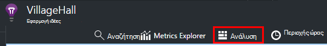

    
## <a name="takeapp-insights-analytics-referencemdtake-operator-show-me-n-rows"></a>[Λήψη](app-insights-analytics-reference.md#take-operator): Εμφάνιση n αριθμό των γραμμών

Σημεία δεδομένων που συνδέονται χρήστη λειτουργιών (συνήθως αιτήσεις HTTP από την εφαρμογή web της) είναι αποθηκευμένες σε έναν πίνακα που ονομάζεται `requests`. Κάθε γραμμή είναι ένα σημείο δεδομένων τηλεμετρίας που λάβατε από την εφαρμογή SDK ιδέες στην εφαρμογή.

Ας ξεκινήσουμε εξετάζοντας μερικές γραμμές δείγματος του πίνακα:

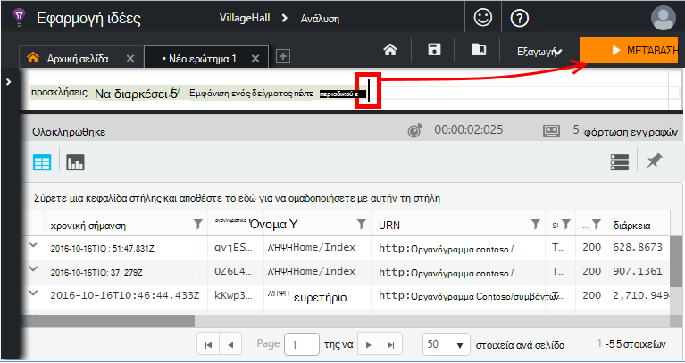

> [AZURE.NOTE] Τοποθετήστε το δρομέα στο κάπου αλλού στην πρόταση πριν κάνετε κλικ στο κουμπί Μετάβαση. Μπορείτε να διαιρέσετε μια πρόταση πάνω από περισσότερες από μία γραμμές, αλλά μην τοποθετήσετε κενές γραμμές σε μια πρόταση. Κενές γραμμές είναι ένας εύκολος τρόπος για να διατηρήσετε πολλών ερωτημάτων ξεχωριστή στο παράθυρο.


Επιλογή στηλών, σύρετέ τα, ομαδοποίηση κατά στήλες, και το φιλτράρισμα: 

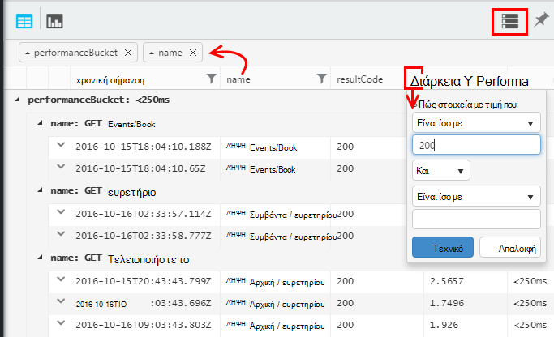


Αναπτύξτε οποιοδήποτε στοιχείο για να δείτε τις λεπτομέρειες:
 
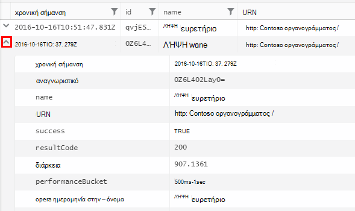

> [AZURE.NOTE] Κάντε κλικ στην επιλογή ο επικεφαλής της στήλης για να αλλάξετε τη διάταξη των αποτελεσμάτων που είναι διαθέσιμες στο πρόγραμμα περιήγησης web. Αλλά να θυμάστε ότι για ένα σύνολο αποτελεσμάτων μεγάλο, τον αριθμό των γραμμών που έχουν ληφθεί στο πρόγραμμα περιήγησης είναι περιορισμένη. Ταξινόμηση με τον τρόπο αυτό δεν εμφανίζονται πάντα που τα πραγματικά στοιχεία μεγαλύτερο ή μικρότερο. Για να ταξινομήσετε τα στοιχεία αξιόπιστα, χρησιμοποιήστε το `top` ή `sort` τελεστή. 

## <a name="topapp-insights-analytics-referencemdtop-operator-and-sortapp-insights-analytics-referencemdsort-operator"></a>[Επάνω](app-insights-analytics-reference.md#top-operator) και [Ταξινόμηση](app-insights-analytics-reference.md#sort-operator)

`take`είναι χρήσιμη για να λάβετε μια γρήγορη δείγμα ενός αποτελέσματος, αλλά που εμφανίζει τις γραμμές από τον πίνακα με κάποια συγκεκριμένη σειρά. Για να λάβετε μια ταξινομημένη προβολή, χρησιμοποιήστε `top` (για το δείγμα) ή `sort` (επάνω από ολόκληρο τον πίνακα).

Εμφάνιση του πρώτου n αριθμό των γραμμών, σύμφωνα με μια συγκεκριμένη στήλη:

```AIQL

    requests | top 10 by timestamp desc 
```

* *Σύνταξη:* Οι περισσότεροι τελεστές έχουν λέξεων-κλειδιών παραμέτρους όπως `by`.
* `desc`= φθίνουσα σειρά, `asc` = αύξουσα.

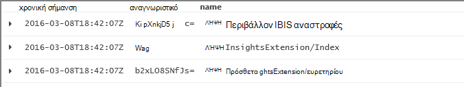

`top...`είναι ένας τρόπος περισσότερες performant αναφέρει `sort ... | take...`. Θα σας θα μπορούσε να έχει εγγραφεί:

```AIQL

    requests | sort by timestamp desc | take 10
```

Το αποτέλεσμα θα είναι το ίδιο, αλλά θα εκτελεστεί λίγο πιο αργά. (Μπορείτε επίσης να συντάξετε `order`, που είναι ένα ψευδώνυμο της `sort`.)

Τις κεφαλίδες στηλών στην προβολή πίνακα μπορεί να χρησιμοποιηθεί επίσης για να ταξινομήσετε τα αποτελέσματα στην οθόνη. Αλλά του κύκλου μαθημάτων, εάν έχετε χρησιμοποιήσει `take` ή `top` για να ανακτήσετε μόνο μέρος του πίνακα, που θα μόνο εκ νέου τη διάταξη των εγγραφών που έχετε ανακτήσατε.


## <a name="projectapp-insights-analytics-referencemdproject-operator-select-rename-and-compute-columns"></a>[Έργο](app-insights-analytics-reference.md#project-operator): Επιλέξτε, μετονομάστε και τον υπολογισμό στηλών

Χρήση [`project`](app-insights-analytics-reference.md#project-operator) για να επιλέξετε ανάληψη μόνο με τις στήλες που θέλετε:

```AIQL

    requests | top 10 by timestamp desc
             | project timestamp, name, resultCode
```

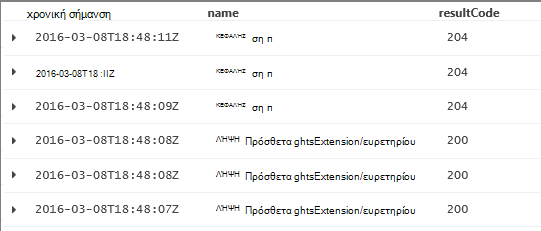


Μπορείτε επίσης να μετονομάσετε στήλες και να καθορίσετε νέα:

```AIQL

    requests 
  	| top 10 by timestamp desc 
  	| project  
            name, 
            response = resultCode,
            timestamp, 
            ['time of day'] = floor(timestamp % 1d, 1s)
```

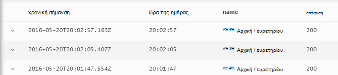

* [Ονόματα των στηλών](app-insights-analytics-reference.md#names) μπορούν να περιέχουν κενά διαστήματα ή σύμβολα εάν αυτές είναι σε αγκύλες, ως εξής: `['...']` ή`["..."]`
* `%`είναι τα συνήθη λειτουργική μονάδα τελεστή. 
* `1d`(αυτό είναι ένα ψηφίο ένα, στη συνέχεια, μια είχατε ') είναι ένα ακριβές χρονικό διάστημα, δηλαδή μία ημέρα. Εδώ θα βρείτε ορισμένες περισσότερες λεκτικές σταθερές χρονικό διάστημα: `12h`, `30m`, `10s`, `0.01s`.
* `floor`(ψευδώνυμο `bin`) στρογγυλοποιεί μια τιμή προς τα κάτω στο πλησιέστερο πολλαπλάσιο του την τιμή βάσης που παρέχετε. Επομένως, `floor(aTime, 1s)` Στρογγυλοποιεί προς τα κάτω στο πλησιέστερο δεύτερο φορά.

[Παραστάσεις](app-insights-analytics-reference.md#scalars) να συμπεριλάβετε όλα τα συνήθη τελεστές (`+`, `-`,...), και δεν υπάρχει μια περιοχή χρήσιμες συναρτήσεις.

    

## <a name="extendapp-insights-analytics-referencemdextend-operator-compute-columns"></a>[Επέκταση](app-insights-analytics-reference.md#extend-operator): τον υπολογισμό στηλών

Εάν θέλετε απλώς να προσθέσετε στήλες σε τις υπάρχουσες, χρησιμοποιήστε [`extend`](app-insights-analytics-reference.md#extend-operator):

```AIQL

    requests 
  	| top 10 by timestamp desc
  	| extend timeOfDay = floor(timestamp % 1d, 1s)
```

Χρήση [`extend`](app-insights-analytics-reference.md#extend-operator) είναι λιγότερο λεπτομερής από [`project`](app-insights-analytics-reference.md#project-operator) εάν θέλετε να διατηρήσετε όλες τις υπάρχουσες στήλες.


## <a name="summarizeapp-insights-analytics-referencemdsummarize-operator-aggregate-groups-of-rows"></a>[Σύνοψη](app-insights-analytics-reference.md#summarize-operator): συγκέντρωση ομάδες γραμμών

`Summarize`εφαρμόζει μια καθορισμένη *συνάρτηση συνάθροισης* επάνω σε ομάδες γραμμών. 

Για παράδειγμα, το χρόνο την εφαρμογή web της χρειάζεται να απαντήσετε σε μια πρόσκληση αναφέρεται στο πεδίο `duration`. Ας δούμε τη μέσος χρόνος απόκρισης σε όλες τις αιτήσεις:

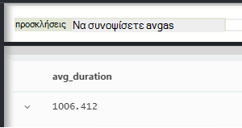

Ή θα σας θα μπορούσε να διαχωρίσετε το αποτέλεσμα σε προσκλήσεις σε διαφορετική ονομάτων:


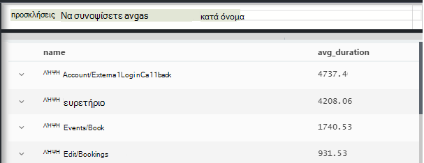

`Summarize`συλλέγει τα σημεία δεδομένων στη ροή σε ομάδες για την οποία το `by` όρος αξιολογεί εξίσου. Κάθε τιμή του `by` παράσταση - κάθε όνομα λειτουργίας στο παραπάνω παράδειγμα - τα αποτελέσματα σε μια γραμμή του πίνακα αποτελεσμάτων. 

Ή θα σας θα μπορούσε να ομαδοποιήσετε αποτελέσματα ανά ώρα της ημέρας:

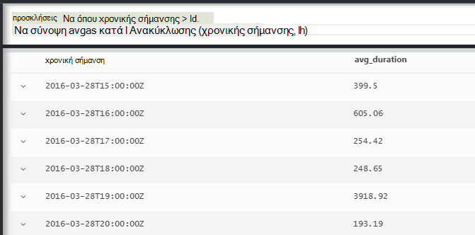

Παρατηρήστε πώς χρησιμοποιούμε τη το `bin` συνάρτηση (γνωστά και ως `floor`). Εάν χρησιμοποιήσαμε απλώς `by timestamp`, κάθε γραμμή εισαγωγής μπορεί να οδηγήσει σε δικό του μικρή ομάδα. Για οποιαδήποτε συνεχής άνυσμα όπως ώρες ή αριθμούς, έχουμε να διακόψω τη συνεχόμενη περιοχή σε διαχειρίσιμα αριθμό της διακριτές τιμές, και `bin` -που είναι πραγματικά απλώς το οικείο στρογγυλοποίηση προς τα κάτω `floor` συνάρτηση - είναι ο ευκολότερος τρόπος για να το κάνετε.

Μπορούμε να χρησιμοποιήσουμε την ίδια τεχνική για να μειώσετε περιοχές συμβολοσειρών:


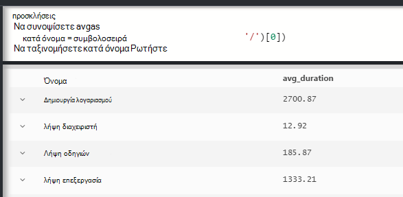

Παρατηρήστε ότι μπορείτε να χρησιμοποιήσετε `name=` για να ορίσετε το όνομα της στήλης αποτέλεσμα, είτε σε τις παραστάσεις συνάθροιση ή τον-BY.

## <a name="counting-sampled-data"></a>Καταμέτρηση δείγμα δεδομένων

`sum(itemCount)`είναι η προτεινόμενη συγκέντρωση για να μετρήσετε συμβάντα. Σε πολλές περιπτώσεις, itemCount == 1, έτσι η συνάρτηση απλώς μετρά τον αριθμό των γραμμών στην ομάδα. Αλλά όταν [δειγματοληψία](app-insights-sampling.md) είναι σε λειτουργία, μόνο ένα κλάσμα από το αρχικό συμβάντα θα διατηρηθούν ως σημεία δεδομένων σε εφαρμογή ιδέες, ώστε κάθε σημείο δεδομένων που μπορείτε να δείτε, υπάρχουν `itemCount` συμβάντα. 

Για παράδειγμα, εάν δειγματοληψία απορρίπτει 75% του αρχικού συμβάντων και, στη συνέχεια, itemCount == 4 στις εγγραφές διατηρούνται - δηλαδή, για κάθε εγγραφή διατηρούνται, υπήρχαν τέσσερις αρχικό εγγραφές. 

Προσαρμόσιμες δειγματοληψία προκαλεί itemCount είναι υψηλότερα περιόδους κατά την εφαρμογή που χρησιμοποιείται πολύ.

Επομένως, άθροισμα του itemCount σας δίνει μια καλή εκτίμηση της τον αρχικό αριθμό συμβάντων.


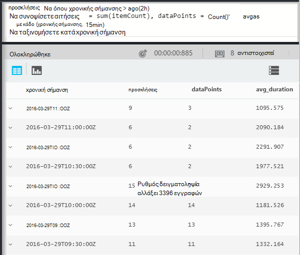

Υπάρχει επίσης μια `count()` συνάθροισης (και μια λειτουργία count), για τις περιπτώσεις όπου θέλετε πραγματικά να μετρήσετε τον αριθμό των γραμμών σε μια ομάδα.


Υπάρχει μια περιοχή [συναρτήσεις συνάθροισης](app-insights-analytics-reference.md#aggregations).


## <a name="charting-the-results"></a>Δημιουργία γραφημάτων τα αποτελέσματα


```AIQL

    exceptions 
       | summarize count()  
         by bin(timestamp, 1d)
```

Από προεπιλογή, τα αποτελέσματα εμφανίζονται ως πίνακα:

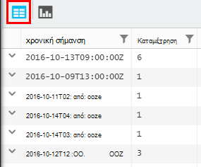


Μπορούμε να κάνουμε καλύτερα από την προβολή του πίνακα. Ας εξετάσουμε τα αποτελέσματα σε προβολή Γράφημα με η κατακόρυφη γραμμή επιλογή:

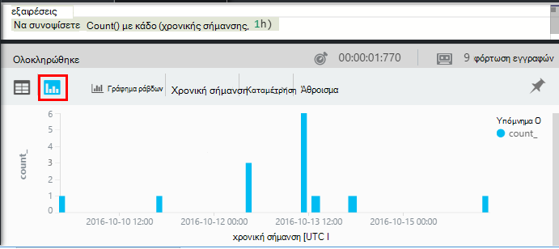

Σημειώστε ότι αν και δεν θα σας να ταξινομήσετε τα αποτελέσματα με βάση το χρόνο (όπως μπορείτε να δείτε την εμφάνιση του πίνακα), την εμφάνιση του γραφήματος πάντα εμφανίζει ημερομηνίες-ώρες στη σωστή σειρά.


## <a name="whereapp-insights-analytics-referencemdwhere-operator-filtering-on-a-condition"></a>[Όπου](app-insights-analytics-reference.md#where-operator): φιλτράρισμα σε μια συνθήκη

Εάν έχετε ρυθμίσει ιδέες εφαρμογής παρακολούθησης για τον [υπολογιστή-πελάτη](app-insights-javascript.md) και το διακομιστή πλευρές της εφαρμογής, ορισμένα από τα τηλεμετρίας στη βάση δεδομένων προέρχεται από προγράμματα περιήγησης.

Ας δούμε απλώς εξαιρέσεις που αναφέρονται από τα προγράμματα περιήγησης:

```AIQL

    exceptions 
  	| where client_Type == "Browser" 
  	|  summarize count() 
       by client_Browser, outerMessage 
```

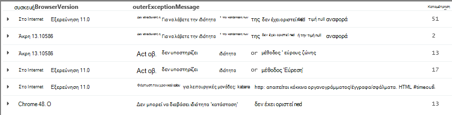

Το `where` τελεστή λαμβάνει μια δυαδική παράσταση. Ακολουθούν ορισμένα σημαντικά σημεία σχετικά με τους:

 * `and`, `or`: Οι τελεστές Boolean
 * `==`, `<>` : ίσο με και δεν ισούται με
 * `=~`, `!=` : διάκριση πεζών-κεφαλαίων συμβολοσειρά ίσο και δεν είναι ίση. Υπάρχουν πολλές περισσότερες τελεστές σύγκρισης συμβολοσειράς.

Διαβάστε όλα [ανυσματική παραστάσεις](app-insights-analytics-reference.md#scalars).

### <a name="filtering-events"></a>Φιλτράρισμα συμβάντων

Βρείτε επιτυχής αιτήσεις:

```AIQL

    requests 
  	| where isnotempty(resultCode) and toint(resultCode) >= 400
```

`responseCode`περιλαμβάνει τύπο συμβολοσειράς, έτσι θα σας πρέπει να [μετατραπεί αυτό](app-insights-analytics-reference.md#casts) για σύγκριση αριθμών.

Σύνοψη τις διαφορετικές απαντήσεις:

```AIQL

    requests
  	| where isnotempty(resultCode) and toint(resultCode) >= 400
  	| summarize count() 
      by resultCode
```

## <a name="timecharts"></a>Timecharts

Εμφάνιση πόσες συμβάντα είναι κάθε ημέρα:

```AIQL

    requests
      | summarize event_count=count()
        by bin(timestamp, 1d)
```

Ενεργοποιήστε την επιλογή εμφάνισης γραφήματος:

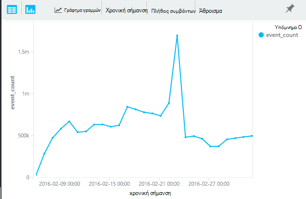


## <a name="multiple-series"></a>Πολλές σειρές 

Πολλές παραστάσεων σε το `summarize` δημιουργεί πολλές στήλες.

Πολλές παραστάσεων σε το `by` όρος δημιουργεί πολλές γραμμές, μία για κάθε συνδυασμό των τιμών.


```AIQL

    requests
  	| summarize count(), avg(duration) 
      by bin(timestamp, 1d), client_StateOrProvince, client_City 
  	| order by timestamp asc, client_StateOrProvince, client_City
```

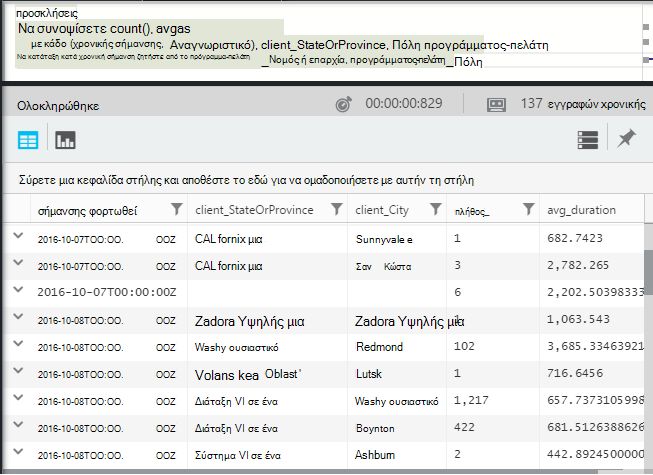

### <a name="segment-a-chart-by-dimensions"></a>Τμήμα γραφήματος με διαστάσεις

Εάν το γράφημα έναν πίνακα που έχει μια στήλη συμβολοσειράς και μια αριθμητική στήλη, η συμβολοσειρά μπορεί να χρησιμοποιηθεί για να διαιρέσετε τα αριθμητικά δεδομένα σε ξεχωριστή σειρά σημείων. Εάν υπάρχουν περισσότερες από μία στήλες συμβολοσειρά, μπορείτε να επιλέξετε τη στήλη που θα χρησιμοποιηθεί ως το διακριτικό. 

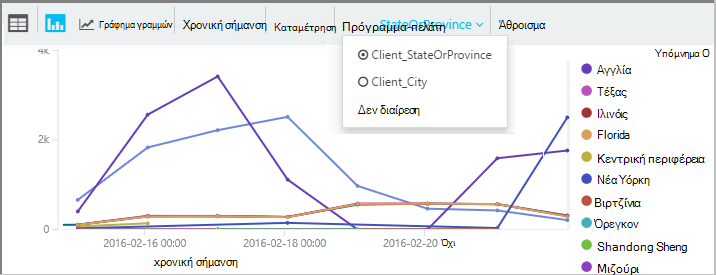

### <a name="display-multiple-metrics"></a>Εμφάνιση πολλά μετρικά

Εάν γράφημα έναν πίνακα που αριθμητική περισσότερες από μία στήλες, εκτός από τη χρονική σήμανση, μπορείτε να εμφανίσετε οποιονδήποτε συνδυασμό από αυτά.

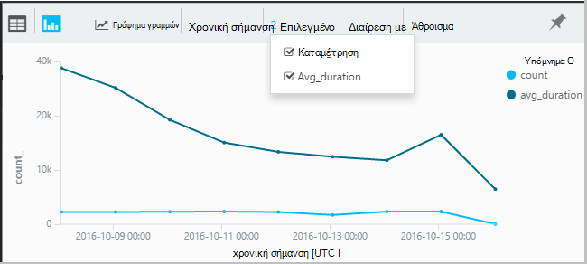

Πρέπει να επιλέξετε δεν διαίρεσης για να επιλέξετε πολλές αριθμητικές στήλες που δεν είναι δυνατό να διαιρεθεί με βάση μια συμβολοσειρά στήλη την ίδια στιγμή ως εμφανίζει περισσότερες από μία αριθμητική στήλη. 


## <a name="daily-average-cycle"></a>Ημερήσιο average κύκλος

Πώς διαφέρουν χρήση επάνω από τη μέση ημέρα;

Καταμέτρηση αιτήσεις από το χρόνο λειτουργική μονάδα μία ημέρα, binned σε ώρες:

```AIQL

    requests
  	| extend hour = floor(timestamp % 1d , 1h) 
          + datetime("2016-01-01")
  	| summarize event_count=count() by hour
```

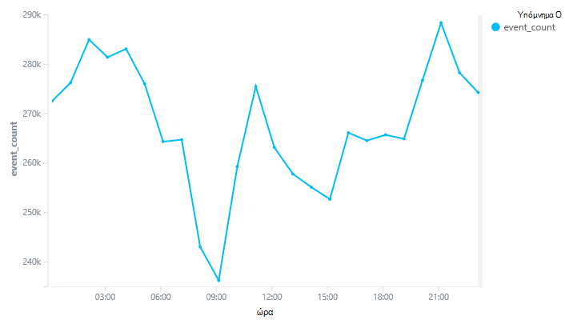

>[AZURE.NOTE] Παρατηρήστε έχουμε αυτήν τη στιγμή για να μετατρέψετε τις διάρκειες ώρα ημερομηνίες-ώρες προκειμένου να εμφανίσετε στην του γραφήματος.


## <a name="compare-multiple-daily-series"></a>Σύγκριση πολλές σειρές ημερήσια

Πώς επηρεάζει η χρήση διαφέρουν πάνω από την ώρα της ημέρας σε διαφορετικές χώρες;

```AIQL

 requests  | where tostring(operation_SyntheticSource)
     | extend hour= floor( timestamp % 1d , 1h)
           + datetime("2001-01-01")
     | summarize event_count=count() 
       by hour, client_CountryOrRegion 
     | render timechart
```

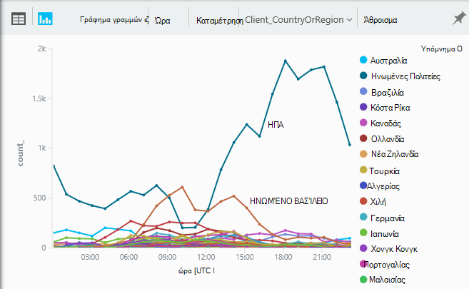


## <a name="plot-a-distribution"></a>Σχεδιάστε μια κατανομή

Πόσες περίοδοι λειτουργίας υπάρχουν διαφορετικού μήκους;

```AIQL

    requests 
  	| where isnotnull(session_Id) and isnotempty(session_Id) 
  	| summarize min(timestamp), max(timestamp) 
      by session_Id 
  	| extend sessionDuration = max_timestamp - min_timestamp 
  	| where sessionDuration > 1s and sessionDuration < 3m 
  	| summarize count() by floor(sessionDuration, 3s) 
  	| project d = sessionDuration + datetime("2016-01-01"), count_
```

Η τελευταία γραμμή είναι απαραίτητη για τη μετατροπή σε ημερομηνία/ώρα. Αυτήν τη στιγμή στον άξονα x ενός γραφήματος εμφανίζεται ως ένα άνυσμα μόνο εάν είναι μια ημερομηνίας/ώρας.

Το `where` όρος αποκλείει τους one-shot περιόδους λειτουργίας (sessionDuration == 0) και ορίζει το μήκος του άξονα x.


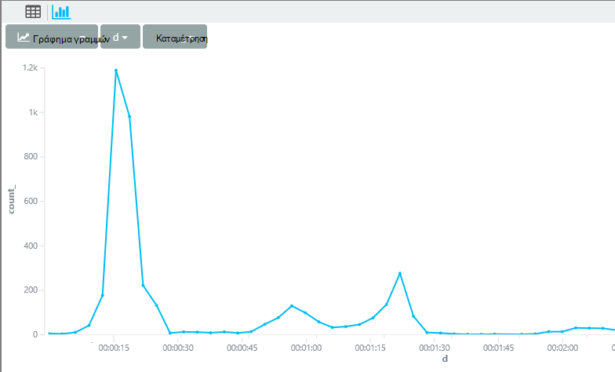


## <a name="percentilesapp-insights-analytics-referencemdpercentiles"></a>[Εκατοστημόριου](app-insights-analytics-reference.md#percentiles)

Ποιες περιοχές των διαρκειών εξώφυλλο διαφορετικά ποσοστά των περιόδων λειτουργίας;

Χρησιμοποιήστε το παραπάνω ερώτημα, αλλά αντικαταστήστε την τελευταία γραμμή:

```AIQL

    requests 
  	| where isnotnull(session_Id) and isnotempty(session_Id) 
  	| summarize min(timestamp), max(timestamp) 
      by session_Id 
  	| extend sesh = max_timestamp - min_timestamp 
  	| where sesh > 1s
  	| summarize count() by floor(sesh, 3s) 
  	| summarize percentiles(sesh, 5, 20, 50, 80, 95)
```

Κατάργηση επίσης το ανώτατο όριο στο το σημείο όπου τον όρο FROM, έτσι ώστε να λάβετε σωστές σχήματα όπως όλες οι περίοδοι λειτουργίας με περισσότερες από μία αίτηση:


Από τον οποίο μπορούμε να δούμε που:

* 5% των περιόδων λειτουργίας έχουν διάρκεια μικρότερη από 3 λεπτά 34s; 
* 50% των περιόδων λειτουργίας τελευταίος μικρότερη από 36 minnutes;
* 5% των περιόδων λειτουργίας τελευταίες περισσότερα από 7 ημέρες

Για να λάβετε μια ξεχωριστή ανάλυση για κάθε χώρα, θα σας απλώς έχει για να εμφανίσετε τη στήλη client_CountryOrRegion ξεχωριστά έως και τα δύο σύνοψη τελεστές:

```AIQL

    requests 
  	| where isnotnull(session_Id) and isnotempty(session_Id) 
  	| summarize min(timestamp), max(timestamp) 
      by session_Id, client_CountryOrRegion
  	| extend sesh = max_timestamp - min_timestamp 
  	| where sesh > 1s
  	| summarize count() by floor(sesh, 3s), client_CountryOrRegion
  	| summarize percentiles(sesh, 5, 20, 50, 80, 95)
      by client_CountryOrRegion
```

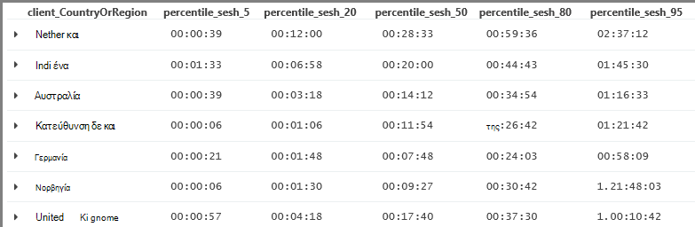


## <a name="joinapp-insights-analytics-referencemdjoin"></a>[Συμμετοχή σε](app-insights-analytics-reference.md#join)

Έχουμε πρόσβαση σε πολλούς πίνακες, συμπεριλαμβανομένων των προσκλήσεων και εξαιρέσεις.

Για να βρείτε τις εξαιρέσεις που σχετίζονται με μια αίτηση που επέστρεψε μια απόκριση αποτυχία, θα σας μπορούν να συμμετάσχουν σε τους πίνακες στην `session_Id`:

```AIQL

    requests 
  	| where toint(responseCode) >= 500 
  	| join (exceptions) on operation_Id 
  	| take 30
```


Είναι καλή πρακτική να χρησιμοποιήσετε `project` για να επιλέξετε μόνο με τις στήλες χρειαζόμαστε πριν από την εκτέλεση του συνδέσμου.
Στο ίδιο τους όρους, θα σας μετονομάστε τη στήλη χρονική σήμανση.


## <a name="letapp-insights-analytics-referencemdlet-clause-assign-a-result-to-a-variable"></a>[Ενημερώστε](app-insights-analytics-reference.md#let-clause): εκχώρηση ένα αποτέλεσμα σε μεταβλητή

Χρησιμοποιήστε [σας επιτρέπουν να](./app-insights-analytics-reference.md#let-statements) για να διαχωρίσετε τα τμήματα της προηγούμενης παράστασης. Τα αποτελέσματα θα αλλάξει:

```AIQL

    let bad_requests = 
      requests
        | where  toint(resultCode) >= 500  ;
    bad_requests
  	| join (exceptions) on session_Id 
  	| take 30
```

> Συμβουλή: Στο πρόγραμμα-πελάτη ανάλυση, μην τοποθετήσετε κενές γραμμές μεταξύ των τμημάτων από αυτές. Βεβαιωθείτε ότι έχετε εκτελέσει όλα.


## <a name="accessing-nested-objects"></a>Πρόσβαση σε ένθετα αντικείμενα

Ένθετα αντικείμενα είναι δυνατή η πρόσβαση εύκολα. Για παράδειγμα, στη ροή εξαιρέσεις θα δείτε δομημένες αντικείμενα ως εξής:

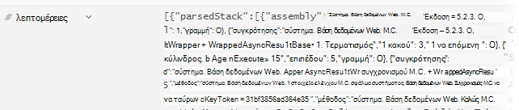

Μπορείτε να το ισοπεδώσετε, επιλέγοντας τις ιδιότητες που σας ενδιαφέρει:

```AIQL

    exceptions | take 10
  	| extend method1 = tostring(details[0].parsedStack[1].method)
```

Σημειώστε ότι πρέπει να χρησιμοποιήσετε μια [cast](app-insights-analytics-reference.md#casts) για να τον κατάλληλο τύπο.

## <a name="custom-properties-and-measurements"></a>Προσαρμοσμένες ιδιότητες και μετρήσεις

Εάν την εφαρμογή σας επισυνάπτει [προσαρμοσμένες διαστάσεις (Ιδιότητες) και μετρήσεις προσαρμοσμένα](app-insights-api-custom-events-metrics.md#properties) συμβάντα και, στη συνέχεια, θα δείτε τους στο το `customDimensions` και `customMeasurements` αντικείμενα.


Για παράδειγμα, εάν η εφαρμογή σας περιλαμβάνει:

```C#

    var dimensions = new Dictionary<string, string> 
                     {{"p1", "v1"},{"p2", "v2"}};
    var measurements = new Dictionary<string, double>
                     {{"m1", 42.0}, {"m2", 43.2}};
    telemetryClient.TrackEvent("myEvent", dimensions, measurements);
```

Για να εξαγάγετε αυτές τις τιμές στην ανάλυση:

```AIQL

    customEvents
  	| extend p1 = customDimensions.p1, 
      m1 = todouble(customMeasurements.m1) // cast to expected type

``` 

## <a name="tables"></a>Πίνακες

Η ροή του τηλεμετρίας που λάβατε από την εφαρμογή σας είναι προσβάσιμα μέσω πολλούς πίνακες. Το σχήμα του ιδιότητες που είναι διαθέσιμες για κάθε πίνακα είναι ορατό στην αριστερή πλευρά του παραθύρου.

### <a name="requests-table"></a>Προσκλήσεις σε πίνακα

Καταμέτρηση τις αιτήσεις HTTP του web app και το τμήμα κατά όνομα σελίδας:

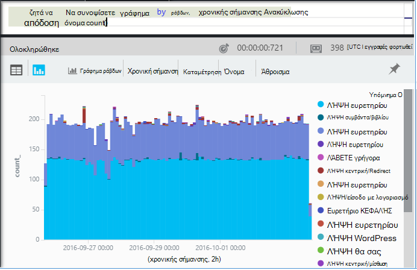

Βρείτε τις αιτήσεις που αποτυγχάνουν πιο:

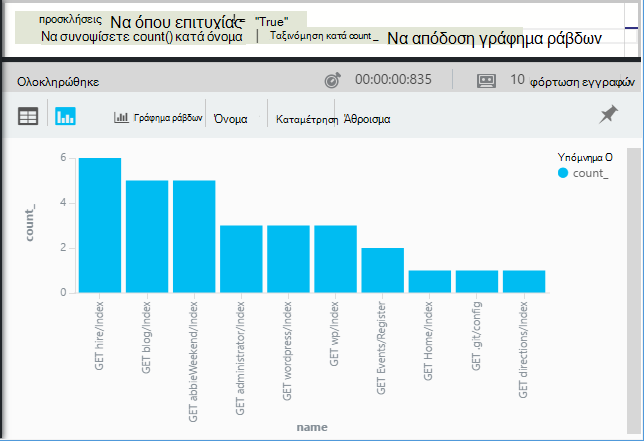

### <a name="custom-events-table"></a>Προσαρμοσμένα συμβάντα πίνακα

Εάν χρησιμοποιείτε το [TrackEvent()](app-insights-api-custom-events-metrics.md#track-event) για να στείλετε τη δική σας συμβάντα, μπορείτε να διαβάσετε αυτά από αυτόν τον πίνακα. 

Ας ρίξουμε ένα παράδειγμα όπου σας κώδικας εφαρμογής περιέχει αυτές τις γραμμές:

```C#

    telemetry.TrackEvent("Query", 
       new Dictionary<string,string> {{"query", sqlCmd}},
       new Dictionary<string,double> {
           {"retry", retryCount},
           {"querytime", totalTime}})
```

Εμφάνιση της συχνότητας από αυτά τα συμβάντα:
 
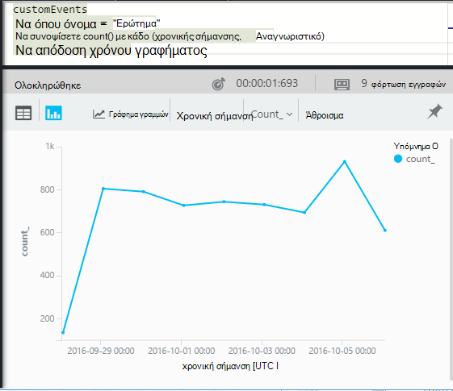

Εξαγάγετε τις μετρήσεις και τις διαστάσεις από τα συμβάντα:

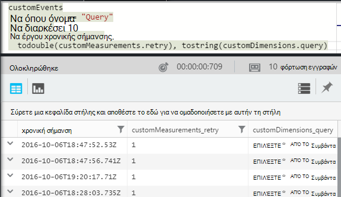

### <a name="custom-metrics-table"></a>Μετρικά προσαρμοσμένου πίνακα

Εάν χρησιμοποιείτε [TrackMetric()](app-insights-api-custom-events-metrics.md#track-metric) για να στείλετε τη δική σας μετρικό τιμές, θα βρείτε τα αποτελέσματά στη ροή **customMetrics** . Για παράδειγμα:  

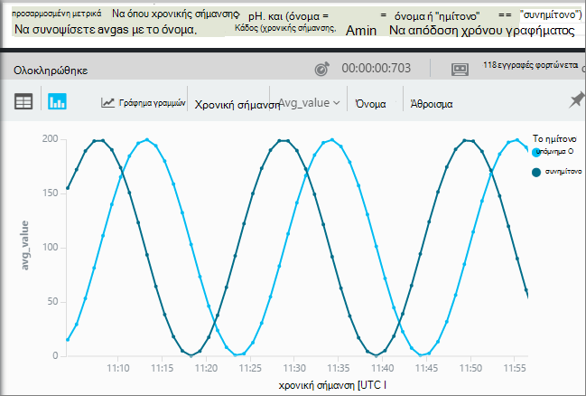


> [AZURE.NOTE] Στην [Εξερεύνηση των μετρήσεων](app-insights-metrics-explorer.md), όλες οι προσαρμοσμένες μετρήσεις που έχουν επισυναφθεί σε οποιονδήποτε τύπο τηλεμετρίας εμφανίζονται μαζί σε το blade μετρικά μαζί με μετρικά χρησιμοποιώντας `TrackMetric()`. Αλλά στην ανάλυση, προσαρμοσμένες διαστάσεις εξακολουθεί να είναι συνημμένα σε όποια τύπο τηλεμετρίας αυτές πραγματοποιήθηκαν σε - συμβάντα ή αιτήσεις και ούτω καθεξής - κατά μετρικά αποστέλλονται από TrackMetric εμφανίζονται στο δικό τους ροής.

### <a name="performance-counters-table"></a>Πίνακας μετρητές επιδόσεων

[Μετρητές επιδόσεων](app-insights-performance-counters.md) εμφανίζουν μετρήσεις βασικού συστήματος για την εφαρμογή, όπως το CPU, μνήμης και χρήση δικτύου. Μπορείτε να ρυθμίσετε το SDK για να στείλετε επιπλέον μετρητές, συμπεριλαμβανομένων των δικών σας προσαρμοσμένων μετρητών.

Το σχήμα **performanceCounters** εκθέτει το `category`, `counter` όνομα, και `instance` όνομα κάθε μετρητή επιδόσεων. Ονόματα παρουσία μετρητών ισχύουν μόνο για ορισμένα μετρητές επιδόσεων και υποδηλώνουν συνήθως το όνομα της διαδικασίας στην οποία αναφέρεται το πλήθος. Στο το τηλεμετρίας για κάθε εφαρμογή, θα δείτε μόνο τους μετρητές για αυτήν την εφαρμογή. Για παράδειγμα, για να δείτε ποιες μετρητές είναι διαθέσιμες: 

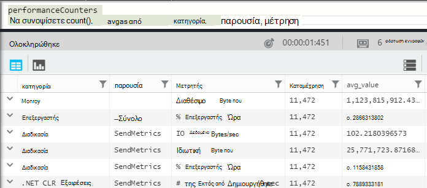

Για να λάβετε ένα γράφημα με διαθέσιμη μνήμη επάνω από την πρόσφατη περίοδο: 

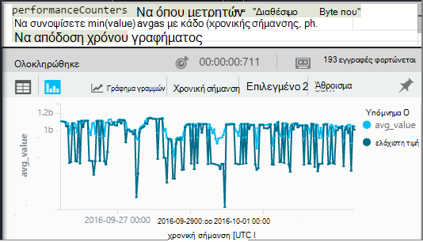


Όπως άλλες τηλεμετρίας, **performanceCounters** περιλαμβάνει επίσης μια στήλη `cloud_RoleInstance` που υποδεικνύει την ταυτότητα από τον κεντρικό υπολογιστή στον οποίο εκτελείται η εφαρμογή σας. Για παράδειγμα, για να συγκρίνετε τις επιδόσεις της εφαρμογής σε διαφορετικούς υπολογιστές: 


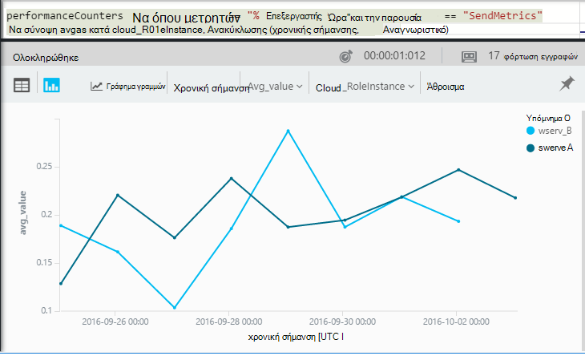

### <a name="exceptions-table"></a>Ο πίνακας εξαιρέσεων

[Εξαιρέσεις που αναφέρονται από την εφαρμογή σας](app-insights-asp-net-exceptions.md) είναι διαθέσιμες σε αυτόν τον πίνακα. 

Για να βρείτε μια αίτηση HTTP που χειρισμού της εφαρμογής σας όταν η εξαίρεση έχει δημιουργηθεί, συμμετοχή σε operation_Id:

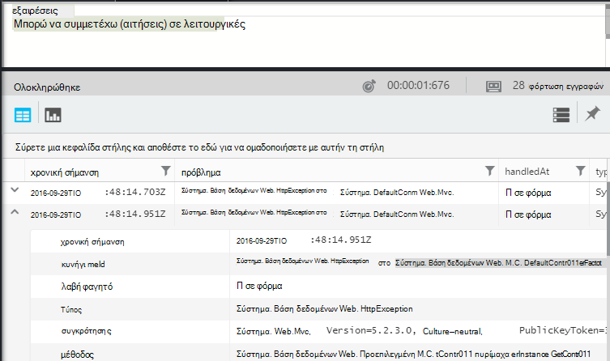


### <a name="browser-timings-table"></a>Πίνακας χρονισμών προγράμματος περιήγησης

`browserTimings`εμφανίζει δεδομένα φόρτωση σελίδας που συλλέγονται στα προγράμματα περιήγησης των χρηστών σας.

[Ρύθμιση της εφαρμογής για τηλεμετρίας πλευρά του προγράμματος-πελάτη](app-insights-javascript.md) για να δείτε αυτές τις μετρήσεις. 

Το σχήμα περιλαμβάνει [μετρικά που υποδεικνύει τα μήκη των διαφορετικά στάδια της διαδικασίας φόρτωση της σελίδας](app-insights-javascript.md#page-load-performance). (Δεν υποδεικνύουν το χρονικό διάστημα οι χρήστες σας να διαβάσετε μια σελίδα).  

Εμφάνιση του popularities διαφορετικές σελίδες και φόρτωση ώρες για κάθε σελίδα:

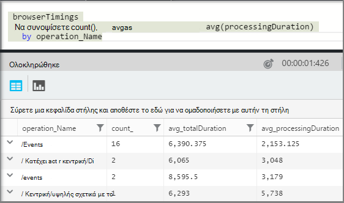

### <a name="availbility-results-table"></a>Πίνακας αποτελεσμάτων Availbility

`availabilityResults`Εμφανίζει τα αποτελέσματα από το [web δοκιμές](app-insights-monitor-web-app-availability.md). Κάθε εκτέλεση των δοκιμών από κάθε θέση δοκιμής αναφέρεται ξεχωριστά. 


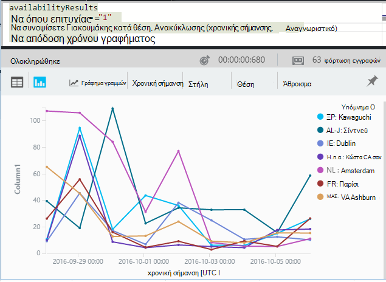

### <a name="dependencies-table"></a>Εξαρτήσεις πίνακα

Περιέχει τα αποτελέσματα των κλήσεων που κάνει την εφαρμογή σας σε βάσεις δεδομένων και REST API του Yammer και άλλες κλήσεις σε TrackDependency().

### <a name="traces-table"></a>Ίχνη πίνακα

Περιέχει το αποστέλλονται από την εφαρμογή σας με τη χρήση TrackTrace() ή [άλλα πλαίσια καταγραφή](app-insights-asp-net-trace-logs.md)τηλεμετρίας.

## <a name="dashboards"></a>Πίνακες εργαλείων

Μπορείτε να καρφιτσώσετε τα αποτελέσματα σε έναν πίνακα εργαλείων για να μεταφέρετε μαζί όλες τις πιο σημαντικές γραφήματα και πίνακες.

* [Azure κοινόχρηστο πίνακα εργαλείων](app-insights-dashboards.md#share-dashboards): κάντε κλικ στο εικονίδιο pin. Πριν το κάνετε αυτό, πρέπει να έχετε ένα κοινόχρηστο πίνακα εργαλείων. Στην πύλη του Azure, ανοίξτε ή δημιουργήστε έναν πίνακα εργαλείων και κάντε κλικ στην επιλογή κοινή χρήση.
* [Πίνακας εργαλείων του Power BI](app-insights-export-power-bi.md): κάντε κλικ στην επιλογή εξαγωγή, ερωτήματος του Power BI. Ένα πλεονέκτημα της αυτή η εναλλακτική είναι ότι μπορείτε να εμφανίσετε το ερώτημά σας μαζί με μια άλλα αποτελέσματα από ένα πολύ ευρύ φάσμα προελεύσεων.


## <a name="next-steps"></a>Επόμενα βήματα

* [Αναφορά ανάλυσης γλώσσας](app-insights-analytics-reference.md)

[AZURE.INCLUDE [app-insights-analytics-footer](../../includes/app-insights-analytics-footer.md)]


