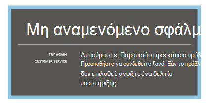
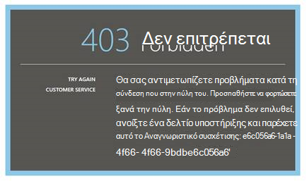
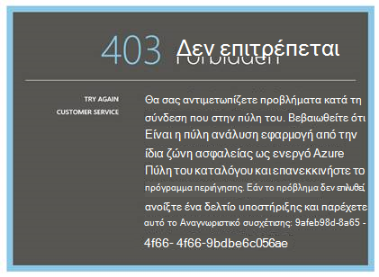
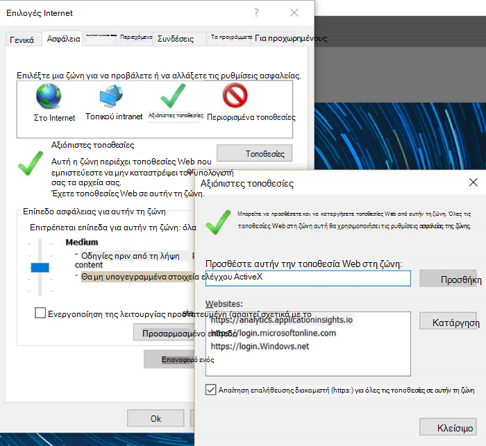
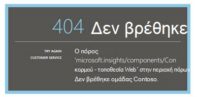
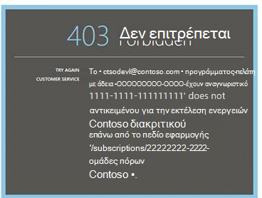
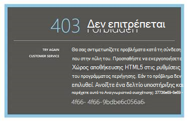
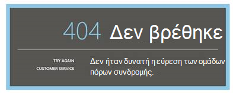
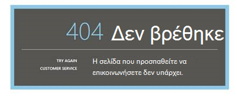

<properties 
    pageTitle="Αντιμετώπιση προβλημάτων ανάλυσης - το εργαλείο ισχυρή αναζήτησης της εφαρμογής ιδέες | Microsoft Azure" 
    description="Αντιμετωπίζετε προβλήματα με ανάλυση ιδέες εφαρμογή; Ξεκινήστε εδώ. " 
    services="application-insights" 
    documentationCenter=""
    authors="alancameronwills" 
    manager="douge"/>

<tags 
    ms.service="application-insights" 
    ms.workload="tbd" 
    ms.tgt_pltfrm="ibiza" 
    ms.devlang="na" 
    ms.topic="article" 
    ms.date="07/11/2016" 
    ms.author="awills"/>

# Αντιμετώπιση προβλημάτων ανάλυσης στο ιδέες εφαρμογής

Αντιμετωπίζετε προβλήματα με την [εφαρμογή ιδέες ανάλυσης](app-insights-analytics.md); Ξεκινήστε εδώ. Ανάλυση είναι το εργαλείο ισχυρή αναζήτησης του Visual Studio εφαρμογή ιδέες.

## Όρια

* Προς το παρόν, αποτελέσματα ερωτήματος περιορίζονται μόνο πάνω από μία εβδομάδα προηγούμενες δεδομένων.
* Προγράμματα περιήγησης θα σας δοκιμή σε: πιο πρόσφατες εκδόσεις του Chrome, άκρου και τον Internet Explorer.

## Επεκτάσεις γνωστά συμβατό πρόγραμμα περιήγησης

* Ghostery

Απενεργοποιήστε την επέκταση ή χρησιμοποιήστε ένα διαφορετικό πρόγραμμα περιήγησης.

##"Μη αναμενόμενο σφάλμα"

Παρουσιάστηκε εσωτερικό σφάλμα κατά τη διάρκεια της πύλης runtime – ανεπίλυτη εξαίρεση.

* Εκκαθάριση cache του προγράμματος περιήγησης. 

## 403..., δοκιμάστε να επαναλάβετε τη φόρτωση

Έναν έλεγχο ταυτότητας που σχετίζονται με σφάλμα (κατά τον έλεγχο ταυτότητας ή κατά τη διάρκεια δημιουργίας διακριτικό πρόσβασης). Πύλη του μπορεί να έχει τρόπο για να ανακτήσετε χωρίς να αλλάξετε τις ρυθμίσεις του προγράμματος περιήγησης.

* Επιβεβαιώστε [cookies τρίτων έχουν ενεργοποιηθεί](#cookies) στο πρόγραμμα περιήγησης. 

## 403... επαλήθευση ζώνη ασφαλείας

Έναν έλεγχο ταυτότητας που σχετίζονται με σφάλμα (κατά τον έλεγχο ταυτότητας ή κατά τη διάρκεια δημιουργίας διακριτικό πρόσβασης). Πύλη του μπορεί να έχει τρόπο για να ανακτήσετε χωρίς να αλλάξετε τις ρυθμίσεις του προγράμματος περιήγησης.

1. Επιβεβαιώστε [cookies τρίτων έχουν ενεργοποιηθεί](#cookies) στο πρόγραμμα περιήγησης. 

2. Χρησιμοποιήσατε μια αγαπημένη, σελιδοδείκτη ή την αποθηκευμένη σύνδεση για να ανοίξετε την πύλη ανάλυσης; Έχετε εισέλθει με διαφορετικά διαπιστευτήρια από αυτόν που χρησιμοποιείται κατά την αποθήκευση της σύνδεσης;

2. Δοκιμάστε να χρησιμοποιήσετε ένα παράθυρο προγράμματος περιήγησης στο-ιδιωτικό/incognito (μετά το κλείσιμο όλων αυτών των παραθύρων). Θα πρέπει να παρέχετε τα διαπιστευτήριά σας. 

2. Ανοίξτε ένα άλλο παράθυρο προγράμματος περιήγησης (κανονική) και μεταβείτε στο [Azure](https://portal.azure.com). Αποσυνδεθείτε. Στη συνέχεια, ανοίξτε το σύνδεσης και πραγματοποιήστε είσοδο με τα σωστά διαπιστευτήρια.

2. Χρήστες του άκρου και τον Internet Explorer επίσης να λάβετε αυτό το σφάλμα όταν ζώνη αξιόπιστων ρυθμίσεις δεν υποστηρίζονται.

    Επιβεβαιώστε [πύλη ανάλυση](https://analytics.applicationinsights.io) και [πύλη Azure Active Directory](https://portal.azure.com) είναι στην ίδια ζώνη ασφαλείας:

 * Στον Internet Explorer, ανοίξτε **Επιλογές Internet**"," **ασφάλεια**"," **Αξιόπιστες τοποθεσίες**"," **τοποθεσίες**:

    

    Στη λίστα τοποθεσιών Web, εάν οποιαδήποτε από τις ακόλουθες διευθύνσεις URL περιλαμβάνονται, βεβαιωθείτε ότι οι άλλες περιλαμβάνονται επίσης:

    https://Analytics.applicationinsights.IO 
   https://Login.microsoftonline.com 
   https://Login.Windows.NET

## 404... Δεν βρέθηκε ο πόρος

Εφαρμογή πόρος έχει διαγραφεί από εφαρμογή ιδέες και δεν είναι διαθέσιμη πλέον. Αυτό μπορεί να συμβεί εάν έχετε αποθηκεύσει τη διεύθυνση URL στη σελίδα "Ανάλυση".

## 403... Δεν υπάρχει εξουσιοδότηση

Δεν έχετε δικαιώματα για να ανοίξετε αυτήν την εφαρμογή στην ανάλυση.

* Λάβατε τη σύνδεση από κάποιον άλλο; Ζητήστε τους να βεβαιωθείτε ότι βρίσκεστε στην [προγράμματα ανάγνωσης ή συνεργατών για αυτήν την ομάδα πόρων](app-insights-resources-roles-access-control.md).
* Αποθηκεύσατε τη σύνδεση χρησιμοποιώντας τα διαπιστευτήρια διαφορετικό; Ανοίξτε την [πύλη του Azure](https://portal.azure.com), αποσυνδεθείτε και, στη συνέχεια, δοκιμάστε αυτήν τη σύνδεση και πάλι, παρέχοντας τα σωστά διαπιστευτήρια.

## 403... Χώρος αποθήκευσης HTML5

Πύλη μας χρησιμοποιεί HTML5 localStorage και sessionStorage.

* Chrome: Ρυθμίσεις, προστασίας προσωπικών δεδομένων, ρυθμίσεις περιεχομένου.
* Internet Explorer: Επιλογές Internet, καρτέλα για προχωρημένους, ασφαλείας, ενεργοποίηση αποθήκευσης DOM.

## 404... Δεν βρέθηκε συνδρομή

Η διεύθυνση URL δεν είναι έγκυρη. 

* Ανοίξτε τον πόρο εφαρμογής στην [πύλη εφαρμογής ιδέες](https://portal.azure.com). Στη συνέχεια, χρησιμοποιήστε το κουμπί "Ανάλυση".

## 404... σελίδας δεν υπάρχει

Η διεύθυνση URL δεν είναι έγκυρη.

* Ανοίξτε τον πόρο εφαρμογής στην [πύλη εφαρμογής ιδέες](https://portal.azure.com). Στη συνέχεια, χρησιμοποιήστε το κουμπί "Ανάλυση".

## Ενεργοποίηση των cookies τρίτων κατασκευαστών

  Δείτε [πώς μπορείτε να απενεργοποιήσετε cookies άλλων κατασκευαστών](http://www.digitalcitizen.life/how-disable-third-party-cookies-all-major-browsers), αλλά προσέξτε πρέπει να **ενεργοποιήσετε** τους.

## Εάν όλες οι ενέργειες αποτύχουν    

[Επικοινωνήστε μαζί μας](app-insights-get-dev-support.md).
 
[AZURE.INCLUDE [app-insights-analytics-footer](../../includes/app-insights-analytics-footer.md)]

