<properties 
    pageTitle="Χρήση ανάλυσης - το εργαλείο ισχυρή αναζήτησης της εφαρμογής ιδέες | Microsoft Azure" 
    description="Χρησιμοποιώντας την ανάλυση, το εργαλείο ισχυρή διαγνωστικών αναζήτησης της εφαρμογής ιδέες. " 
    services="application-insights" 
    documentationCenter=""
    authors="danhadari" 
    manager="douge"/>

<tags 
    ms.service="application-insights" 
    ms.workload="tbd" 
    ms.tgt_pltfrm="ibiza" 
    ms.devlang="na" 
    ms.topic="article" 
    ms.date="10/21/2016" 
    ms.author="awills"/>

# Χρήση αναλυτικών στοιχείων σε ιδέες εφαρμογής

[Ανάλυση](app-insights-analytics.md) είναι η δυνατότητα ισχυρή αναζήτησης της [Εφαρμογής ιδέες](app-insights-overview.md). Αυτές οι σελίδες περιγράφουν τη γλώσσα ερωτήματος ανάλυσης.

* **[Παρακολουθήστε το εισαγωγικό βίντεο](https://applicationanalytics-media.azureedge.net/home_page_video.mp4)**.
* **[Μονάδα δίσκου δοκιμή ανάλυσης μας προσομοιωμένη δεδομένα](https://analytics.applicationinsights.io/demo)** κατά την εφαρμογή σας δεν είναι αποστολή δεδομένων σε εφαρμογή ιδέες ακόμη.

## Άνοιγμα ανάλυσης

Από την εφαρμογή οικίας πόρο στην εφαρμογή ιδέες, κάντε κλικ στην επιλογή ανάλυσης.

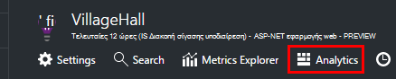

Το πρόγραμμα εκμάθησης ενσωματωμένη παρέχει ορισμένες ιδέες σχετικά με το τι μπορείτε να κάνετε.

Υπάρχει μια [πιο εκτεταμένη περιήγηση εδώ](app-insights-analytics-tour.md).

## Υποβολή ερωτήματος σας τηλεμετρίας

### Συντάξτε ένα ερώτημα

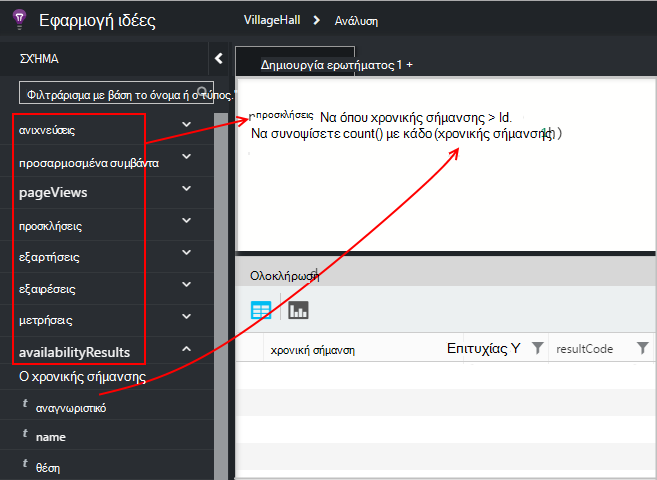

Ξεκινήστε με τα ονόματα των οποιονδήποτε από τους πίνακες που παρατίθενται σε αριστερά (ή τους τελεστές [περιοχής](app-insights-analytics-reference.md#range-operator) ή [ένωσης](app-insights-analytics-reference.md#union-operator) ). Χρήση `|` για να δημιουργήσετε μια διοχέτευση [τελεστών](app-insights-analytics-reference.md#queries-and-operators). Το IntelliSense σάς ειδοποιεί με τους τελεστές και ορισμένα από τα στοιχεία της παράστασης που μπορείτε να χρησιμοποιήσετε.

Ανατρέξτε στο θέμα [Επισκόπηση γλώσσας ανάλυση](app-insights-analytics-tour.md) και [αναφορά γλώσσας](app-insights-analytics-reference.md).

### Εκτέλεση ενός ερωτήματος

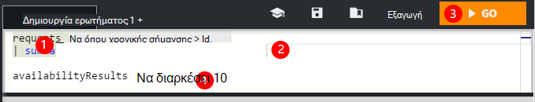

1. Μπορείτε να χρησιμοποιήσετε μία γραμμή αλλαγές σε ένα ερώτημα.
2. Τοποθετήστε το δρομέα στο εσωτερικό ή στο τέλος του ερωτήματος που θέλετε να εκτελέσετε.
3. Κάντε κλικ στην επιλογή Μετάβαση για να εκτελέσετε το ερώτημα.
4. Μην τοποθετήσετε κενές γραμμές στο ερώτημά σας. Μπορείτε να διατηρήσετε πολλών ερωτημάτων χωρισμένα σε μία καρτέλα ερώτημα διαχωρίζοντάς τις με κενές γραμμές. Εκτελείται μόνο αυτό με το δρομέα.

### Αποθήκευση ενός ερωτήματος

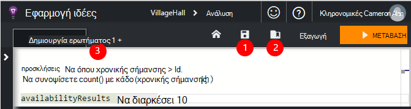

1. Αποθήκευση του τρέχοντος αρχείου ερωτήματος.
2. Ανοίξτε ένα αρχείο αποθηκευμένο ερώτημα.
3. Δημιουργήστε ένα νέο αρχείο ερωτήματος.

## Δείτε τις λεπτομέρειες

Ανάπτυξη γραμμής στα αποτελέσματα για να δείτε την πλήρη λίστα των ιδιοτήτων. Μπορείτε να αναπτύξετε περαιτέρω οποιαδήποτε ιδιότητα που είναι δομημένες τιμή - για παράδειγμα, προσαρμοσμένες διαστάσεις ή στη στοίβα καταχώρηση σε μια εξαίρεση.

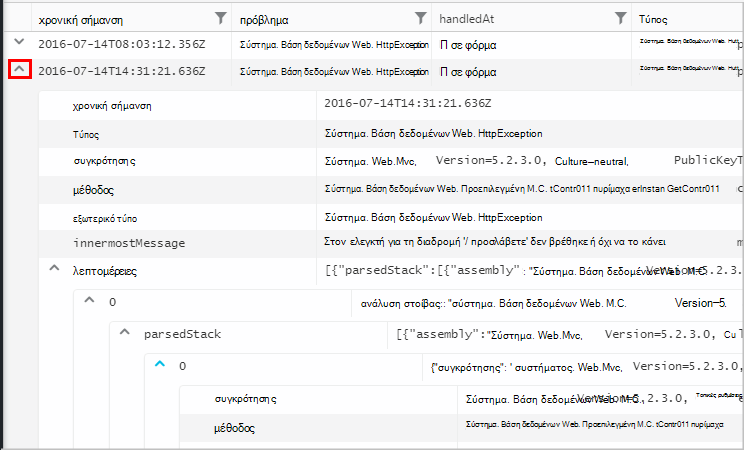

 

## Τακτοποίηση των αποτελεσμάτων

Μπορείτε να ταξινομήσετε, να φιλτράρετε, να μεταβείτε και να ομαδοποίηση των αποτελεσμάτων που επιστρέφονται από το ερώτημά σας.

> [AZURE.NOTE] Ταξινόμηση, ομαδοποίηση και το φιλτράρισμα στο πρόγραμμα περιήγησης δεν εκτελέστε ξανά το ερώτημά σας. Τους μόνο να αναδιατάξετε τα αποτελέσματα που επιστράφηκαν από το τελευταίο ερώτημα. 
> 
> Για να εκτελέσετε αυτές τις εργασίες στο διακομιστή πριν από τα αποτελέσματα επιστρέφονται, συντάξτε το ερώτημά σας με την [Ταξινόμηση](app-insights-analytics-reference.md#sort-operator), [Σύνοψη](app-insights-analytics-reference.md#summarize-operator) και [όπου](app-insights-analytics-reference.md#where-operator) τελεστές.

Επιλέξτε τις στήλες που θέλετε να δείτε, σύρετε κεφαλίδες στηλών για να αναδιατάξετε τους και αλλαγή μεγέθους στηλών, σύροντας τα περιγράμματα.

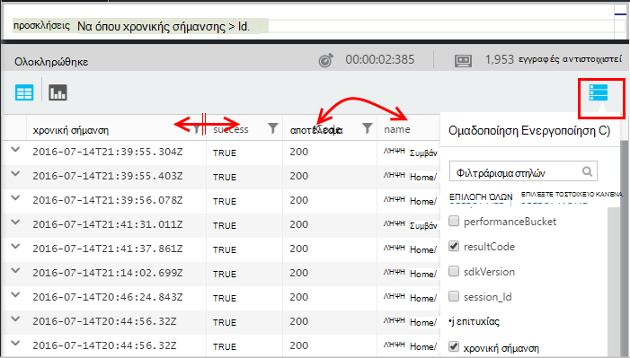

### Ταξινόμηση και φιλτράρισμα στοιχείων

Ταξινόμηση των αποτελεσμάτων σας κάνοντας κλικ στην επιλογή ο επικεφαλής της στήλης. Κάντε ξανά κλικ για να ταξινομήσετε ο άλλος τρόπος και κάντε κλικ στην επιλογή τρίτη φορά για να επαναφέρετε το αρχικό ταξινόμηση επιστρέφονται από το ερώτημά σας.

Χρησιμοποιήστε το εικονίδιο φίλτρου για να περιορίσετε την αναζήτησή σας.

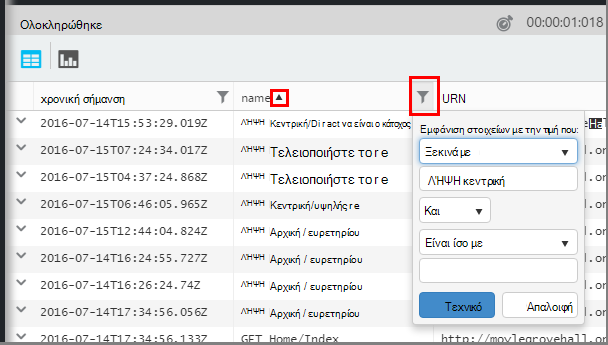

### Ομαδοποίηση στοιχείων

Για να ταξινομήσετε σύμφωνα με περισσότερες από μία στήλες, χρησιμοποιήστε ομαδοποίησης. Πρώτα να ενεργοποιήσετε το και, στη συνέχεια, σύρετε κεφαλίδες στηλών στο χώρο επάνω από τον πίνακα.

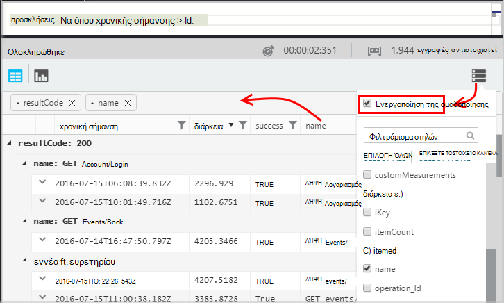

### Λείπουν ορισμένα αποτελέσματα;

Υπάρχει όριο περίπου 10 k γραμμές σχετικά με τα αποτελέσματα που επιστρέφονται από την πύλη. Μια προειδοποίηση δείχνει αν μεταβείτε υπερβαίνουν το όριο. Αν συμβεί αυτό, ταξινόμησης για τα αποτελέσματα του πίνακα δεν θα εμφανίζονται πάντα που όλα τα πραγματικά ή του επωνύμου αποτελέσματα. 

Είναι καλή πρακτική να αποφύγετε να επιτύχετε το όριο. Χρήση τελεστών όπως:

* [όπου χρονικής σήμανσης > ago(3d)](app-insights-analytics-reference.md#where-operator)
* [πρώτων 100 με χρονική σήμανση](app-insights-analytics-reference.md#top-operator) 
* [λήψη 100](app-insights-analytics-reference.md#take-operator)
* [Σύνοψη](app-insights-analytics-reference.md#summarize-operator) 

## Διαγράμματα

Επιλέξτε τον τύπο του διαγράμματος που θέλετε:

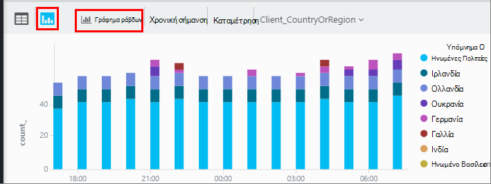

Εάν έχετε πολλές στήλες με τους τύπους δεξιά, μπορείτε να επιλέξετε το x και y αξόνων και μια στήλη με διαστάσεις για να διαιρέσετε τα αποτελέσματα από.

Από προεπιλογή, αποτελέσματα εμφανίζονται αρχικά ως πίνακα και επιλέξτε το διάγραμμα με μη αυτόματο τρόπο. Αλλά μπορείτε να χρησιμοποιήσετε την [απόδοση οδηγία](app-insights-analytics-reference.md#render-directive) στο τέλος ενός ερωτήματος για να επιλέξετε ένα διάγραμμα.

## Καρφίτσωμα στον πίνακα εργαλείων

Μπορείτε να καρφιτσώσετε ένα διάγραμμα ή πίνακα σε μία από το [κοινόχρηστο πίνακες εργαλείων](app-insights-dashboards.md) - απλώς κάντε κλικ στην επιλογή το pin. (Ίσως χρειαστεί να [αναβάθμισης της εφαρμογής σας τιμολόγησης του πακέτου](app-insights-pricing.md) για να ενεργοποιήσετε αυτήν τη δυνατότητα.) 

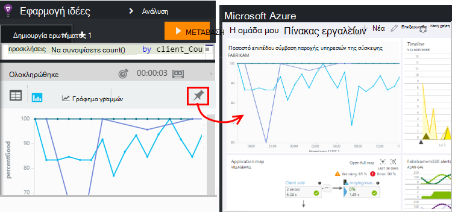

Αυτό σημαίνει ότι, όταν συνθέτετε ενός πίνακα εργαλείων σας βοηθά να παρακολουθείτε τις επιδόσεις ή τη χρήση των υπηρεσιών web σας, μπορείτε να συμπεριλάβετε αρκετά σύνθετη ανάλυση μαζί με τα άλλα μετρικά. 

Μπορείτε να καρφιτσώσετε πίνακα για τον πίνακα εργαλείων, εάν έχει τέσσερις ή λιγότερες στήλες. Εμφανίζονται μόνο των πρώτων γραμμών επτά.

#### Ανανέωση πίνακα εργαλείων

Το γράφημα καρφιτσωμένα στον πίνακα εργαλείων ανανεώνεται αυτόματα με Επανεκτέλεση ερωτήματος περίπου κάθε μισή ώρα.

#### Αυτόματη απλουστεύσεις

Σε ορισμένες περιπτώσεις, ορισμένες απλουστεύσεις εφαρμόζονται σε ένα γράφημα, όταν το Καρφίτσωμα σε έναν πίνακα εργαλείων.

Όταν pin ένα γράφημα που εμφανίζει πολλές διακριτές θέσεων αποθήκευσης (συνήθως ένα γράφημα ράβδων), τις θέσεις αποθήκευσης λιγότερο συμπληρωμένη ομαδοποιούνται αυτόματα σε ένα μόνο κλάσης "άλλα άτομα". Για παράδειγμα, αυτό το ερώτημα:

    requests | summarize count_search = count() by client_CountryOrRegion

μοιάζει κάπως έτσι σε αναλυτικών στοιχείων:

Ωστόσο, όταν καρφιτσώνετε σε έναν πίνακα εργαλείων, μοιάζει κάπως έτσι:

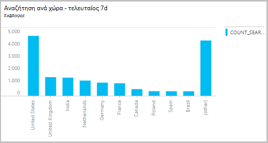

## Εξαγωγή στο Excel

Αφού έχετε εκτελέσει ένα ερώτημα, μπορείτε να κάνετε λήψη ενός αρχείου .csv. Κάντε κλικ στην επιλογή **Εξαγωγή στο Excel**.

## Εξαγωγή στο Power BI

Τοποθετήστε το δρομέα σε ένα ερώτημα και επιλέξτε **Εξαγωγή στο Power BI**.

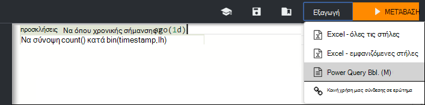

Μπορείτε να εκτελέσετε το ερώτημα στο Power BI. Μπορείτε να τη ρυθμίσετε να ανανεώσετε σε ένα χρονοδιάγραμμα.

Με το Power BI, μπορείτε να δημιουργήσετε πίνακες εργαλείων που συγκέντρωση δεδομένων από μια ευρεία ποικιλία προελεύσεων.

[Μάθετε περισσότερα σχετικά με την εξαγωγή στο Power BI](app-insights-export-power-bi.md)

[AZURE.INCLUDE [app-insights-analytics-footer](../../includes/app-insights-analytics-footer.md)]

